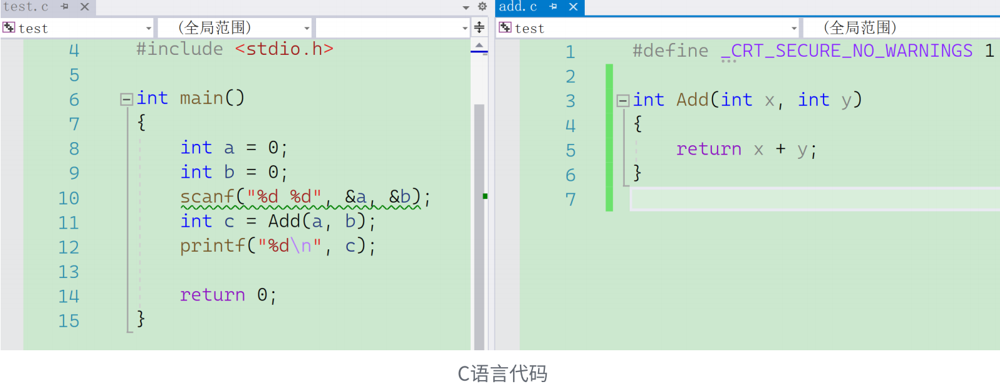
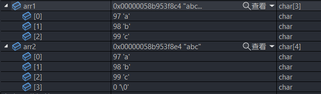

## 一. C语言是什么？

⼈和⼈交流使⽤的是⾃然语⾔，如：汉语、英语、⽇语

那⼈和计算机是怎么交流的呢？使⽤计算机语⾔。

⽬前已知已经有上千种计算机语⾔，⼈们是通过计算机语⾔写的程序，给计算机下达指令，让计算机⼯作的。

C语⾔就是众多计算机语⾔中的⼀种，当然 C++/Java/Go/Python 都是计算机语⾔。

## 二. C语言的历史和辉煌

C 语⾔最初是作为 Unix 系统的开发⼯具⽽发明的。


语言排行榜：https://www.tiobe.com/tiobe-index/


## 三. 编译器的选择 VS2022

### 01. 编译和链接

C语⾔是⼀⻔**编译型**计算机语⾔，C语⾔源代码都是⽂本⽂件，⽂本⽂件本⾝⽆法执⾏，必须**通过编译器翻译和链接器的链接，⽣成⼆进制的可执⾏⽂件**，可执⾏⽂件才能执⾏。

C语⾔代码是放在 .c 为后缀的⽂件中的，要得到最终运⾏的可执⾏程序，中间要经过编译和链接2个过程。




⼀个⼯程⼀般都会有多个源⽂件组成，如下图所⽰，演⽰了源程序经过编译器和链接器处理的过程。


> 注意：
>
> 1. 每个 .c 源⽂件单独经过编译器处理⽣成对应的⽬标⽂件(.obj为后缀的⽂件)
> 2. 多个⽬标⽂件和库⽂件经过链接器处理⽣成对应的可执⾏程序(.exe⽂件)

这就是，在 Windows 电脑上 C 语⾔程序⽣成的 exe 可执⾏⽂件


### 02. 编译器的对比

C语⾔是⼀⻔编译型的计算机语⾔，需要依赖编译器将计算机语⾔转换成机器能够执⾏的机器指令。

那我们常⻅的C语⾔编译器都有哪些呢？

⽐如：msvc、clang、gcc 就是⼀些常⻅的编译器，当然也有⼀些集成开发环境 如：VS2022、

XCode、CodeBlocks、DevC++、Clion 等。

集成开发环境（IDE）⽤于提供程序开发环境的应⽤程序，⼀般包括代码编辑器、 编译器 、 调试器和 图形⽤⼾界⾯ 等⼯具。 集成了代码编写功能、分析功能、编译功能、调试功能等⼀体化的开发软件服务套。


- VS2022 集成了MSVC（安装报包较⼤⼀些，安装简单，⽆需多余配置，使⽤起来⾮常⽅便）
- XCode 集成了clang（苹果电脑上的开发⼯具）
- CodeBlocks 集成了gcc（这个⼯具⽐较⼩众，需要配置环境，不太推荐）
- DevC++ 集成了gcc（⼩巧，但是⼯具过于简单，对于代码⻛格的养成不好，⼀些竞赛使⽤）
- Clion 是默认使⽤CMake，编译器是可以配置的（⼯具是收费，所以暂时推荐⼤家使⽤）

整体考虑，推荐⼤家安装 VS2022 的社区版本学习，免费，使⽤⽅便，⼯作中常⻅。

VS2022 的安装教程：https://www.bilibili.com/video/BV11R4y1s7jz/

### 03. VS2022的优缺点

优点：

- VS2022 是⼀个主流的集成开发环境，企业中使⽤较为普遍
- VS2022 包含了：编辑器+编译器+调试器，功能强大
- 直接安装即可使⽤，基本不⽤额外配置环境，上⼿容易
- 默认界⾯是中⽂的初学者友好

缺点：

- 因为功能丰富，所以安装包大，占⽤空间多


## 四. VS项目和源文件、头文件介绍

在VS上写代码，我们是需要创建项⽬的，直接新建项⽬就可以了。

在项⽬中就可以添加源⽂件和头⽂件。

C语⾔把 **.c 为后缀的⽂件**称为**源⽂件**，把 **.h 为后缀的⽂件**称为**头⽂件**。


## 五. 第一个C语言程序

```c
#include <stdio.h>

int main() {
	printf("hello C\n");
	printf("hello world");
	return 0;
}
```

这⾥演⽰ VS2022 中创建项⽬和编写 C 代码的过程，并运⾏出结果。

在 VS2022 上运⾏代码的快捷键： Ctrl + f5


## 六. main函数

每个 C 语⾔程序不管有多少⾏代码，都是从 main 函数开始执⾏的， main 函数是程序的⼊⼝，main 函数也被叫做：主函数。 main 前⾯的 int 表⽰ main 函数执⾏结束的时候返回⼀个整型类型的值。所以在 main 函数的最后写 return 0; 正好前后呼应。

- **main 函数是程序的入口**
- **一个项目中只能有一个main函数**
- 即使⼀个项⽬中有多个.c⽂件，但是只能有⼀个main函数（因为程序的⼊⼝只能有⼀个）

第⼀次写代码，⼀些常⻅的错误总结：

- main 被写成了mian
- main后边的()漏掉了
- 代码中不能使⽤中⽂符号，⽐如括号和分号
- ⼀条语句结束后，有分号

> main函数的位置可以在任意位置，但是如果在主函数之中调用了哪些函数，必须在main函数前对其所调用函数进行生命或包含其被调用函数的头文件。


## 七. printf 和库函数

在上⾯的代码中有⼀句代码如下：

```c
printf("hello C\n");
```

代码中使⽤了 printf 函数，实现了在屏幕上的信息的打印。

这⾥简单的介绍⼀下 printf ， **printf 是⼀个库函数**，它的功能是在标准输出设备（⼀般指屏幕）上进⾏信息的打印。上⾯的代码是使⽤ printf 函数打印字符串。只要把想要打印的⼀串字符放在双引号中并传递给 printf 函数就可以打印。

printf函数也可以⽤来打印其他类型的数据，⽐如：

```c
int n = 100;
printf("%d\n", n); // 打印整型，双引号表示的是一个字符串
printf("%c\n", 'q'); // 打印字符，单引号表示的是一个字符
printf("%lf\n", 3.14); // 打印双精度浮点型
```

这⾥的 **%d , %c 等是占位符，会被后边的值替换**。（后面再介绍）

同时我们在**使⽤库函数的时候，是需要包含头⽂件的**，⽐如： **printf 函数需要包含的就是 `stdio.h` 这个头⽂件**，具体的⽅法就是：

```c
#include <stdio.h>
// std => standard：标准
// i => input
// o => output
// stdio：标准输入输出
```

那什么是库函数呢？

为了不再重复实现常⻅的代码，让程序员提升开发效率，C语⾔标准规定了⼀组函数，这些函数再由不同的编译器⼚商根据标准进⾏实现，提供给程序员使⽤。这些函数组成了⼀个函数库，被称为标准库，这些函数也被称为库函数。在这个基础上⼀些编译器⼚商可能会额外扩展提供部分函数（这些函数其他编译器不⼀定⽀持）。

⼀个系列的库函数⼀般会声明在同⼀个头⽂件中，所以库函数的使⽤，要包含对应的头⽂件。

库函数⽐较多，后期慢慢来介绍，提前了解可参考链接：https://cplusplus.com/reference/clibrary/


## 八. 关键字介绍

C语⾔中有⼀批保留的名字的符号，⽐如： int 、 if 、 return ，这些符号被称为保留字或者关键字。

- 关键字都有特殊的意义，是保留给C语⾔使⽤的
- 程序员⾃⼰在创建标识符的时候是不能和关键字重复的
- 关键字也是不能⾃⼰创建的。

C语⾔的32个关键字如下：

```
auto break case char const continue default do double else enum 
extern float for goto if int long register return short signed sizeof static struct switch typedef union unsigned void volatile while
```

注：在C99标准中加⼊了 inline、restrict、 _Bool、 _Complex、 _Imaginary 等关键字。

⼀些关键字⼤家可以去了解⼀下，不过使⽤最多的还是上⾯的32个关键字。

注：https://zh.cppreference.com/w/c/keyword（C语⾔关键字的全部介绍）


## 九. 字符和ASCII编码

在键盘上可以敲出各种字符，如：a，q，@，#等，这些符号都被称为字符，C语⾔中字符是⽤单引号括起来的，如：'a'，'b'，'@'。

我们知道在计算机中所有的数据都是以⼆进制的形式存储的，那这些字符在内存中分别以什么样的⼆进制存储的呢？如果我们每个⼈⾃⼰给这些字符中的每个字符编⼀个⼆进制序列，这个叫做编码，为了⽅便⼤家相互通信，不造成混乱，后来美国国家标准学会（ANSI）出台了⼀个标准 ASCII 编码，C语⾔中的字符就遵循了 ASCII 编码的⽅式。

ASCII 码表

下列码表含有全部 128 个 ASCII 十进制 **(dec)** 、八进制 **(oct)** 、十六进制 **(hex)** 及字符 **(ch)** 编码。


参考：https://zh.cppreference.com/w/cpp/language/ascii

我们不需要记住所有的ASCII码表中的数字，使⽤时查看就可以，不过我们最好能掌握⼏组特殊的数据：

- 字符A~Z的ASCII码值从65~90（**字符A对应65**）
- 字符a~z的ASCII码值从97~122
- 对应的⼤⼩写字符(a和A)的ASCII码值的差值是 32
- **大写字母的ASCII码值 +32 就等于 对应小写字母的ASCII码值**
- 数字字符0~9的ASCII码值从48~57（**字符0对应48**）
- 换⾏ \n 的ASCII值是：10
- 在这些字符中ASCII码值从**0~31 这32个字符是不可打印字符**，⽆法打印在屏幕上观察

单个字符的打印可以使⽤ `%c` 来指定格式：

```c
#include <stdio.h>

int main() {
  printf("%c\n", 'Q');
  printf("%c\n", 81); // 这里的81是字符Q的ASCII编码，也是可以正常打印的
  return 0;
}
```

可打印字符展示：

```c
#include <stdio.h>

int main() {
	int i = 0;
  for (i = 32; i <= 127; i++) {
    printf("%c ", i);
    if (i % 16 == 15) printf("\n");
  }
  return 0;
}
```


> 补充：
>
> - 为什么ASCII码是128个，不是256个？
>
>   ASCII（American Standard Code for Information Interchange）是一种字符编码标准，它最初是为了在计算机和通信设备之间传输信息而设计的。ASCII将字符映射到数字，每个字符都有一个对应的**7位二进制代码（即0-127）**。**最初的ASCII标准使用7位**，因此**最多**可以表示**128个**不同的字符。
>
>   后来出现了**扩展**ASCII标准，这种标准使用**8位**二进制代码，可以表示**256个**不同的字符，但是它不能与传统的7位ASCII兼容。
>
>   虽然我们现在使用的编码标准已经进化为Unicode，但7位ASCII仍然被广泛使用，这是因为在许多文本应用程序中，仅需要表达基本字符（字母、数字和常见标点符号），并且使用7位编码可以节省存储空间并简化数据传输。

## 十. 字符串 和 \0

C语⾔中如何表⽰字符串呢？使⽤双引号括起来的⼀串字符就被称为字符串S如："abcdef"，就是⼀个字符串。

**字符串的打印格式**可以使⽤ **%s** 来指定，也可以直接打印如下：

```c
int main() {
	printf("%s\n", "hello C");
	printf("hello C");
	return 0;
}
```

C语⾔字符串中⼀个特殊的知识，就是在字符串的末尾隐藏放着⼀个 \0 字符，这个 \0 字符是字符串的结束标志。

VS2022的监视窗口观察字符串（必须先开F10，窗口项中才会出现监视）


对于字符串"abc"，我们表面上看到了3个字符：a,b,c，但是实际上在末尾还隐藏⼀个 \0 的转义字符， **\0 是字符串的结束标志**。所以我们在使⽤库函数 printf() 打印字符串或者 strlen() 计算字符串⻓度的时候，遇到 \0 的时候就⾃动停⽌了。

C语⾔中也可以把⼀个字符串放在⼀个字符数组中，我们在这⾥利⽤下⾯的代码验证⼀下 \0 的功能。

```c
#include <stdio.h>

int main() {
	char arr1[] = { 'a', 'b', 'c' }; // arr1字符数组中存放3个字符
	char arr2[] = "abc"; // arr2字符数组中存放字符串
	printf("%s\n", arr1);
	printf("%s\n", arr2);
	return 0;
}
```

这样的代码，我调试的时候，观察⼀下 arr1 和 arr2 的内容：



运行结果：


我们可以看到， arr1 字符数组在打印的时候，打印了 a 、 b 、 c 后还打印了⼀些随机值，这就是因为 arr1 在末尾的地⽅没有 \0 字符作为结束标志，在打印的时候没有停⽌。但是 arr2 的打印就是完全正常的，就是因为 arr2 数组是使⽤字符串常量初始化的，数组中有 \0作为技术标志，打印可以正常停⽌。

如果我们在arr1数组中单独放⼀个 '\0' 字符会怎么样呢？

```C
#include <stdio.h>

int main() {
	char arr1[] = { 'a', 'b', 'c', '\0'}; // arr1数组中存放3个字符
	char arr2[] = "abc"; // arr2数组中存放字符串
	printf("%s\n", arr1);
	printf("%s\n", arr2);
	printf("%s\n", "abc\0def");
	return 0;
}
```


看到三次打印的结果是⼀样的了，都是打印到 \0 的时候就停⽌了，那从上述的例⼦我们确实能够观察到 \0 的作⽤和重要性的。

> 补充：
>
> - 字符串是一系列连续的字符的组合，要想在内存中定位一个字符串，除了要知道它的开头，还要知道它的结尾。找到字符串的开头很容易，知道它的名字（字符数组名或者字符串名）就可以；然而，如何找到字符串的结尾呢？C语言的解决方案有点奇妙，或者说有点奇葩。
>
> - **在C语言中，字符串总是以'\0'作为结尾，所以'\0'也被称为字符串结束标志，或者字符串结束符。**
>
>   ```
>   '\0'是 ASCII 码表中的第 0 个字符，英文称为 NUL，中文称为“空字符”。
>   该字符既不能显示，也没有控制功能，输出该字符不会有任何效果，它在C语言中唯一的作用就是作为字符串结束标志。
>   ```
>
> - C语言在处理字符串时，会从前往后逐个扫描字符，一旦遇到'\0'就认为到达了字符串的末尾，就结束处理。'\0'至关重要，没有'\0'就意味着永远也到达不了字符串的结尾。
> - 由" "包围的字符串会自动在末尾添加'\0'。例如，"abc123"从表面看起来只包含了 6 个字符，其实不然，C语言会在最后隐式地添加一个'\0'，这个过程是在后台默默地进行的，所以我们感受不到。
> - 更多：https://zhuanlan.zhihu.com/p/574180757
>
> 测试一：
>
> ```c
> #include <stdio.h>
> #include <string.h>
> 
> int main() {
>     char arr[] = {'b', 'i', 't'};
>     printf("%d\n", strlen(arr)); // 随机值
> 		return 0;
> }
> 
> 解析：
> // strlen是用来获取字符串的有效长度的，结尾标记'\0'不包含在内。strlen获取的规则非常简单：从前往后依次检测，直到遇到'\0'是就终止检测。
> 
> // 而arr是一个字符数组，不是一个有效的字符串，因为后面没有放置'\0'，因此strlen在求解时，将有效字符检测完之后，还会继续向后检测，直到遇到'\0'是才终止，因此答案为不确定，就看紧跟在't'之后的第一个'\0'在什么位置。
> ```
> 
> 测试二：
>
> ```c
>#include <stdio.h>
> #include <string.h>
> int main()
> {
>     printf("%d\n", strlen("c:\test\121"));
>     return 0;
> }
> 
> 解析：
> // strlen：获取字符串的有效长度，不包括'\0', "c:\test\121": 在该字符串中，\t是转义字符，水平制表，跳到下一个tab的位置；而\121表示一个字符，是将121看做8进制数组，转换为10进制后的81，转义为ASCII码值的字符，即：字符'Q' ，故上述字符串实际为："c: estQ",只有7个有效字符
> ```
> 


## 十一. 转义字符

也许在前⾯的代码中你看到 \n , \0 很纳闷是啥。其实在字符中有⼀组特殊的字符是转义字符，转义字符顾名思义：**转变原来的意思的字符**。

⽐如：我们有字符 n ，在字符串中打印的时候⾃然能打印出这个字符，如下：

```c
#include <stdio.h>

int main() {
	printf("abcndef");
	return 0;
}
```


如果我们修改⼀下代码，在 n 的前⾯加上 \ ,变成如下代码：

```c
#include <stdio.h>

int main() {
	printf("abc\ndef");
	return 0;
}
```


我们可以看到修改的前后代码输出的结果，截然不同的，那这是为什么呢？

这就是转义字符的问题， \n 是⼀个转义字符表示换行的意思，我们可以简单的理解为 \ 让 n 的意思发⽣了转变， n 本来是⼀个普通的字符，被 \ 转义为换⾏的意思。

C语⾔中像这样的转义字符还有⼀些，具体如下：

- `\?`：在书写连续多个问号时使⽤，防⽌他们被解析成三字⺟词，在新的编译器上没法验证了。
- `\'`：⽤于表⽰字符常量 `'`
- `\"`：⽤于表⽰⼀个字符串内部的双引号
- `\\`：⽤于表⽰⼀个反斜杠，防⽌它被解释为⼀个转义序列符。
- `\a`：警报，这会使得终端发出警报声或出现闪烁，或者两者同时发⽣。
- `\b`：退格键，光标回退⼀个字符，但不删除字符，而是覆盖原有位置上的字符。
- `\f`：换⻚符，光标移到下⼀⻚。在现代系统上，这已经反映不出来了，⾏为改成类似于 \v 。
- `\n`：换⾏符。
- `\r`：回⻋符，光标移到同⼀⾏的开头。
- `\t`：制表符，光标移到下⼀个⽔平制表位，通常是下⼀个8的倍数。
- `\v`：垂直分隔符，光标移到下⼀个垂直制表位，通常是下⼀⾏的同⼀列。

下⾯2种转义字符可以理解为：字符的8进制或者16进制表⽰形式

• **\ddd** ：ddd 表⽰1~3个**⼋进制的数字**。 如： \130 表⽰字符X

• **\xdd** ：dd 表⽰2个**⼗六进制数字**。 如： \x30 表⽰字符0

\0 ：null 字符，代表没有内容， \0 就是 \ddd 这类转义字符的⼀种，⽤于字符串的结束标志，其ASCII码值是0.

代码演示：

```c
#include <stdio.h>

int main() {
	printf("%c\n", '\''); // '
	printf("%s\n", "\""); // "
	printf("c:\\test\\code\\test.cn\n"); // c:\test\code\test.cn
	printf("\a"); // 终端发出警报声
	printf("%c\n", '\130'); // 130是八进制，转换成10进制是88，以88作为ASCII码值的字符是'X'
	printf("%c\n", '\x30'); // x30中的30是十六进制，转换成10进制是48，以48作为ASCII码值的字符是'0'
	printf("%c\n", '\0');
	return 0;
}
```

这些ASCII码值是可以⾃⼰写代码验证的，⼤家也可以⾃⼰验证。

关于转义字符我们⾸先要了解，然后要能在字符串中识别出来。

转义字符参考：https://zh.cppreference.com/w/c/language/escape


## 十二. 语句和语句分类

C语⾔的代码是由⼀条⼀条的语句构成的，C语⾔中的语句可为以下五类：

- 空语句
- 表达式语句
- 函数调⽤语句
- 复合语句
- 控制语句

### 01. 空语句

空语句是最简单的，⼀个分号就是⼀条语句，是空语句。

```c
#include <stdio.h>
int main() {
	; // 空语句
	return 0;
}
```

空语句，⼀般出现的地⽅是：这⾥需要⼀条语句，但是这个语句不需要做任何事，就可以写⼀个空语句。

### 02. 表达式语句

表达式语句就是在表达式的后边加上分号。如下所示：

```c
#include <stdio.h>
int main()
{
	int a = 20;
	int b = 0;
	b = a + 5; //表达式语句
	return 0;
}
```

### 03. 函数调用语句

函数调用的时候，也会加上分号，就是函数调用语句。

```c
int Add(int x, int y)
{
	return x + y;
}

int main()
{
	printf("hehe\n");//函数调⽤语句
	int ret = Add(2, 3);//函数调⽤语句 
	return 0;
}
```

### 04. 复合语句

复合语句其实就是前⾯讲过的代码块，成对括号中的代码就构成⼀个代码块，也被称为复合语句。

```c
void print(int arr[], int sz) //函数的⼤括号中的代码也构成复合语句
{
	int i = 0;
	for (i = 0; i < sz; i++)
	{
		printf("%d ", arr[i]);
	}
}
int main()
{
	int i = 0;
	int arr[10] = { 0 };
	for (i = 0; i < 10; i++) //for循环的循环体的⼤括号中的就是复合语句
	{
		arr[i] = 10 - i;
		printf("%d\n", arr[i]);
	}
	return 0;
}
```

### 05. 控制语句

控制语句⽤于控制程序的执⾏流程，以实现程序的各种结构⽅式（C语⾔⽀持三种结构：顺序结构、选择结构、循环结构），它们由特定的语句定义符组成，C语⾔有九种控制语句。

可分成以下三类：

1. 条件判断语句也叫分⽀语句：if语句、switch语句；
2. 循环执⾏语句：do while语句、while语句、for语句；

\3. 转向语句：break语句、goto语句、continue语句、return语句。

后面会⼀⼀介绍控制语句。


## 十三. 注释是什么？为什么写注释？

注释是对代码的说明，编译器会忽略注释，也就是说，注释对实际代码没有影响。注释是给程序员⾃⼰，或者其他程序员看的。好的注释可以帮我们更好的理解代码，但是也不要过度注释，不要写没必要的注释。当然不写注释可能会让后期阅读代码的⼈抓狂。写注释⼀定程度上反应了程序作者的素质，建议⼤家写必要的注释，在未来找⼯作的时候，写代码时留下必要的注释也会给⾯试官留下更好的印象。

### 01. 注释的2种形式

1. /**/ 的形式

   ```c
   /* 注释 */
   /*
    这是⼀⾏注释
   */
   ```

   - 第⼀种⽅法是将注释放在 /*...*/ 之间，内部可以分⾏

   - 这种注释可以插在⾏内。

     ```c
     int/*注释*/a = 1;
     int fopen(char* s /* file name */, int mode);
     ```

   - 上⾯⽰例中， /* file name */ ⽤来对函数参数进⾏说明，跟在它后⾯的代码依然会有效执⾏。

     这种注释⼀定不能忘记写结束符号 */ ，否则很容易导致错误。

     ```c
     printf("a "); /* 注释⼀
     printf("b ");
     printf("c "); /* 注释⼆ */
     printf("d ");
     ```

   - 上⾯⽰例的原意是，第⼀⾏和第三⾏代码的尾部，有两个注释。但是，第⼀⾏注释忘记写结束符号，导致注释⼀延续到第三⾏结束。

   - /*/ 的这个注释也不⽀持嵌套注释， / 开始注释后，遇到第⼀个 */ 就认为注释结束了。

     ```c
     /*
     printf("a ");
     printf("b ");
     printf("c "); /* 注释⼆ */
     printf("d ");
     */
     ```

2. // 形式

   - 第⼆种写法是将注释放在双斜杠 // 后⾯，从双斜杠到⾏尾都属于注释。这种注释只能是单⾏，可以放在⾏⾸，也可以放在⼀⾏语句的结尾。这是 C99 标准新增的语法。

     ```c
     // 这是⼀⾏注释
     int x = 1; // 这也是注释
     ```

   - 不管是哪⼀种注释，都不能放在双引号⾥⾯。双引号⾥⾯的注释符号，会成为字符串的⼀部分，解释为普通符号，失去注释作⽤。

     ```c
     printf("// hello /* world */ ");
     ```

   - 上⾯⽰例中，双引号⾥⾯的注释符号，都会被视为普通字符，没有注释作⽤。

### 02. 注释会被替换

**编译时，注释会被替换成⼀个空格**

```c
int/*注释*/a= 1; // => int a = 1;
```


