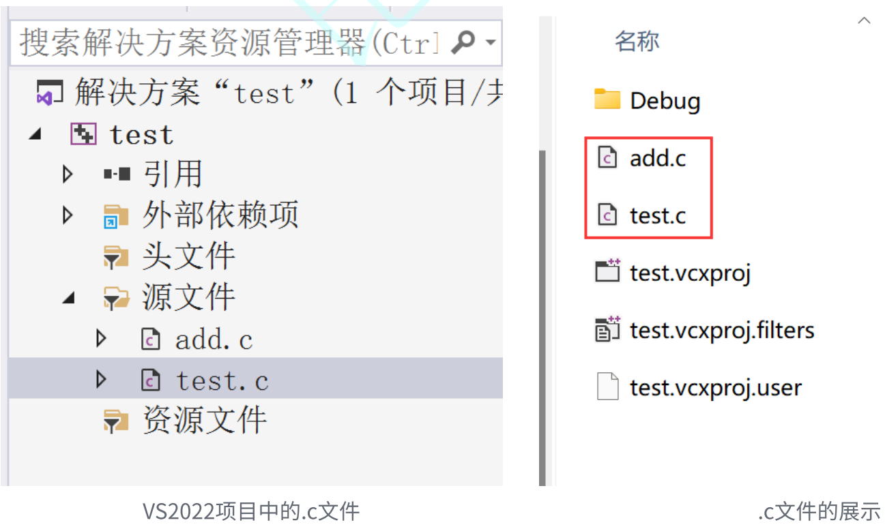
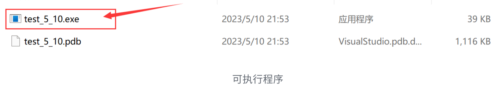
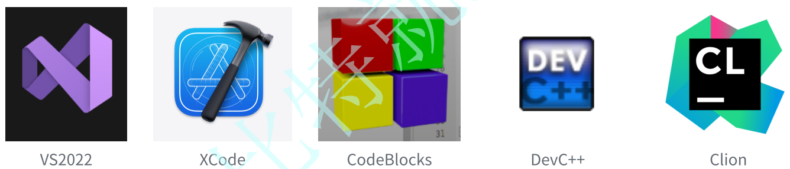

## 一. C语言是什么？

⼈和⼈交流使⽤的是⾃然语⾔，如：汉语、英语、⽇语

那⼈和计算机是怎么交流的呢？使⽤计算机语⾔。

⽬前已知已经有上千种计算机语⾔，⼈们是通过计算机语⾔写的程序，给计算机下达指令，让计算机⼯作的。

C语⾔就是众多计算机语⾔中的⼀种，当然 C++/Java/Go/Python 都是计算机语⾔。

## 二. C语言的历史和辉煌

C 语⾔最初是作为 Unix 系统的开发⼯具⽽发明的。

语言排行榜：https://www.tiobe.com/tiobe-index/

## 三. 编译器的选择 VS2022

### 01. 编译和链接

C语⾔是⼀⻔**编译型**计算机语⾔，C语⾔源代码都是⽂本⽂件，⽂本⽂件本⾝⽆法执⾏，必须**通过编译器翻译和链接器的链接，⽣成⼆进制的可执⾏⽂件**，可执⾏⽂件才能执⾏。

C语⾔代码是放在 .c 为后缀的⽂件中的，要得到最终运⾏的可执⾏程序，中间要经过编译和链接2个过程。

⼀个⼯程⼀般都会有多个源⽂件组成，如下图所⽰，演⽰了源程序经过编译器和链接器处理的过程。

> 注意：
>
> 1. 每个 .c 源⽂件单独经过编译器处理⽣成对应的⽬标⽂件(.obj为后缀的⽂件)
> 2. 多个⽬标⽂件和库⽂件经过链接器处理⽣成对应的可执⾏程序(.exe⽂件)

这就是，在 Windows 电脑上 C 语⾔程序⽣成的 exe 可执⾏⽂件

### 02. 编译器的对比

C语⾔是⼀⻔编译型的计算机语⾔，需要依赖编译器将计算机语⾔转换成机器能够执⾏的机器指令。

那我们常⻅的C语⾔编译器都有哪些呢？

⽐如：msvc、clang、gcc 就是⼀些常⻅的编译器，当然也有⼀些集成开发环境 如：VS2022、

XCode、CodeBlocks、DevC++、Clion 等。

集成开发环境（IDE）⽤于提供程序开发环境的应⽤程序，⼀般包括代码编辑器、 编译器 、 调试器和 图形⽤⼾界⾯ 等⼯具。 集成了代码编写功能、分析功能、编译功能、调试功能等⼀体化的开发软件服务套。

- VS2022 集成了MSVC（安装报包较⼤⼀些，安装简单，⽆需多余配置，使⽤起来⾮常⽅便）
- XCode 集成了clang（苹果电脑上的开发⼯具）
- CodeBlocks 集成了gcc（这个⼯具⽐较⼩众，需要配置环境，不太推荐）
- DevC++ 集成了gcc（⼩巧，但是⼯具过于简单，对于代码⻛格的养成不好，⼀些竞赛使⽤）
- Clion 是默认使⽤CMake，编译器是可以配置的（⼯具是收费，所以暂时推荐⼤家使⽤）

整体考虑，推荐⼤家安装 VS2022 的社区版本学习，免费，使⽤⽅便，⼯作中常⻅。

VS2022 的安装教程：https://www.bilibili.com/video/BV11R4y1s7jz/

### 03. VS2022的优缺点

优点：

- VS2022 是⼀个主流的集成开发环境，企业中使⽤较为普遍
- VS2022 包含了：编辑器+编译器+调试器，功能强大
- 直接安装即可使⽤，基本不⽤额外配置环境，上⼿容易
- 默认界⾯是中⽂的初学者友好

缺点：

- 因为功能丰富，所以安装包大，占⽤空间多

## 四. VS项目和源文件、头文件介绍

在VS上写代码，我们是需要创建项⽬的，直接新建项⽬就可以了。

在项⽬中就可以添加源⽂件和头⽂件。

C语⾔把 **.c 为后缀的⽂件**称为**源⽂件**，把 **.h 为后缀的⽂件**称为**头⽂件**。

## 五. 第一个C语言程序

