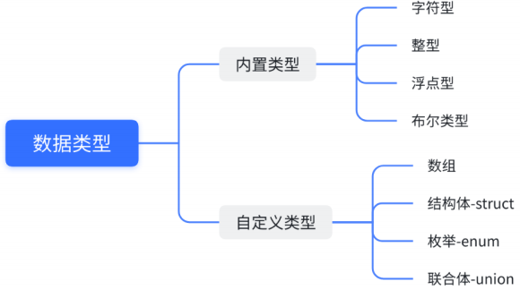

## 一. 数据类型介绍

C语⾔提供了丰富的数据类型来描述⽣活中的各种数据。

使⽤整型类型来描述整数，使⽤字符类型来描述字符，使⽤浮点型类型来描述⼩数。

所谓“类型”，就是相似的数据所拥有的共同特征，编译器只有知道了数据的类型，才知道怎么操作数据。

下⾯盘点⼀下C语⾔提供的各种数据类型，本章节主要探讨内置数据类型。



### 01. 字符型

```c
char // character
[signed] char // 有符号的
unsigned char // 无符号的
```

### 02. 整型

```c
// 短整型
short [int]
[signed] short [int]
unsigned short [int]
  
// 整型
int
[signed] int
unsigned int

// 长整型
long [int]
[signed] long [int]
unsigned long [int]

// 更长的整型
// C99中引入
long long [int]
[signed] long long [int]
unsigned long long [int]
```

### 03. 浮点型

```c
float // 单精度浮点型 12.34 => 1.234 * 10
double // 双精度浮点型 能表示更精准的数字
long double
```

### 04. 布尔类型

在 C99 标准之前，C 语言没有原生的布尔类型。布尔值通常通过整数类型（例如 `int`）来表示，习惯上使用 0 表示假（false），而非零值表示真（true）。

1. **_Bool：** 在较早版本的C标准中，使用了 _Bool 来表示布尔类型。然而，__Bool 不包含 <stdbool.h> 头文件中定义的 true 和 false 关键字，C99之前，C语言中没有真正的布尔类型，而是使用 `0` 表示 `false`，非零值表示 `true`。例如：

   ```c
   int main() {
     _Bool myBool = 1;  // 1 表示 true
     printf("%d\n", myBool);  // 输出 1
     return 0;
   }
   ```

2. **bool：** 自C99标准起，C语言引入了 <stdbool.h> 头文件，并定义了 bool、true 和 false 三个关键字。bool 是_Bool的别名，表示布尔数据类型，可以取 true 或 false 的值。例如：

   ```c
   #include <stdbool.h>
   
   int main() {
     bool myBool = true;
     printf("%d\n", myBool);  // 输出 1，true在C中通常用1表示
     return 0;
   }
   ```

总体而言，`bool` 是更加现代且直观的表示方式，而 `_Bool` 是较早版本C标准中的一种表示方式。在新代码中，建议使用 `bool`。

### 05. 各种数据类型的⻓度

每⼀种数据类型都有⾃⼰的⻓度，使⽤不同的数据类型，能够创建出⻓度不同的变量，变量⻓度的不同，存储的数据范围就有所差异。

- sizeof 操作符

  - sizeof 是⼀个关键字，也是操作符，专⻔是⽤来计算sizeof的操作符数的类型⻓度的，**单位是字节**。

  - sizeof 操作符的操作数可以是类型，也可是变量或者表达式。

    ```c
    sizeof(类型)
    sizeof 表达式
    ```

  - sizeof 的操作数如果不是类型，是表达式的时候，可以省略掉后边的括号的。
  - **sizeof 后边的表达式是不真实参与运算的，根据表达式的类型来得出⼤⼩**。
  - sizeof 的计算结果是 size_t 类型的。

  > 什么是size_t类型？
  >
  > - **sizeof 运算符的返回值，C 语⾔只规定是⽆符号整数**，并没有规定具体的类型，⽽是留给系统⾃⼰去决定， sizeof 到底返回什么类型。不同的系统中，返回值的类型有可能是unsigned int ，也有可能是 unsigned long ，甚⾄是 unsigned long long ，对应的 printf() 占位符分别是 %u 、 %lu 和 %llu 。这样不利于程序的可移植性。
  > - C 语⾔提供了⼀个解决⽅法，创造了⼀个类型别名 size_t ，⽤来统⼀表⽰ sizeof 的返回值类型。对应当前系统的 sizeof 的返回值类型，可能是 unsigned int ，也可能是unsigned long long 
  > - 

- 比如：

  ```c
  #include <stdio.h>
  int main()
  {
  	int a = 10;
  	printf("%zd\n", sizeof(a)); // 4
  	printf("%zd\n", sizeof a); // 4，表达式写法
  	printf("%zd\n", sizeof(int)); // 4 类型必须带()
  	printf("%zd\n", sizeof(3 + 3.5)); // 8
  	return 0;
  }
  ```

- 数据类型长度（在VS2022 X64配置下的输出）

  ```c
  #include <stdio.h>
  int main() {
  	printf("%d\n", sizeof(char)); // 1
  	printf("%d\n", sizeof(short)); // 2
  	printf("%d\n", sizeof(int)); // 4
  	printf("%d\n", sizeof(long)); // 4
    // 为什么long跟int都是4，不应该long>int吗
    // C语言标准规定：sizeof(long) >= sizeof(int)，根据不同编译器厂商实现结果不同
  	printf("%d\n", sizeof(long long)); // 8
  	printf("%d\n", sizeof(float)); // 4
  	printf("%d\n", sizeof(long double)); // 8
  	printf("%d\n", sizeof(bool)); // 1
  
  	return 0;
  }
  ```

- sizeof 中表达式不计算

  ```c
  int main()
  {
  	short s = 3;
  	int b = 10;
  	printf("%d\n", sizeof(s = b + 1)); // 2
  	printf("s = %d\n", s); // s = 3
  	return 0;
  }
  ```

  sizeof 在代码进⾏编译的时候，就根据表达式的类型确定了，⽽表达式的执⾏却要在程序运⾏期间才能执⾏，在编译期间已经将sizeof处理掉了，所以在运⾏期间就不会执⾏表达式了。

  在 C 语言中，赋值表达式的结果是被赋值的左值的类型。在这个情况下，赋值表达式 `s = b + 1` 的结果是 `short` 类型，因为 `s` 是 `short` 类型。

  然而，`sizeof` 运算符在求值的时候不会实际执行赋值操作，它只是根据类型返回大小。所以，`sizeof(s = b + 1)` 的结果是 `sizeof(short)`。

  现在，关于 `sizeof(short)` 的结果，`short` 类型通常占用2个字节（16位）。因此，`sizeof(s = b + 1)` 的输出是2。

### 06. %u、%z

`%u` 是用于在C语言中格式化输出无符号整数的格式说明符。它告诉 `printf` 函数，相应的参数是一个无符号整数，应该按照无符号整数的格式进行输出。

例如：

```c
#include <stdio.h>

int main() {
    unsigned int num = 42;
    printf("The unsigned integer is: %u\n", num);
    return 0;
}
```

在这个例子中，`%u` 被用于输出无符号整数 `num` 的值。 `%u` 不接受负数，并且按照无符号整数的方式进行输出。

如果你尝试使用 `%u` 格式说明符来输出带符号整数，结果可能是不确定的，因为这会导致类型不匹配的错误。在这种情况下，应该使用 `%d` 来格式化输出带符号整数。

在C语言中，`%z` 是用于格式化输出 `size_t` 类型的格式说明符。`size_t` 是一个无符号整数类型，通常用于表示对象大小或数组索引。

例如：

```c
#include <stdio.h>

int main() {
    size_t size = 123;
    printf("The size is: %zu\n", size);
    return 0;
}
```

在这个例子中，`%zu` 被用于输出 `size_t` 类型的变量 `size` 的值。`%zu` 用于表示无符号整数，因此在这里用于输出 `size_t` 类型的值。

需要注意的是，`%z` 用于 `size_t` 是C99标准引入的，如果你的编译环境不支持C99标准，可能需要考虑使用其他兼容的方式来处理。


## 二. signed 和 unsigned

C 语⾔使⽤ signed 和 unsigned 关键字修饰 字符型和整型 类型的。

- **signed** 关键字，**表⽰⼀个类型带有正负号，包含负值**；
- **unsigned** 关键字，**表⽰该类型不带有正负号，只能表⽰零和正整数**。

**对于 int 类型，默认是带有正负号的**，也就是说 int 等同于 signed int 。

由于这是默认情况，关键字 signed ⼀般都省略不写，但是写了也不算错。

```c
signed int a;
// 等同于int a;
```

int 类型也可以不带正负号，只表示非负整数。这时就必须使用关键字 unsigned 声明变量

```c
unsigned int a;
```

整数变量声明为 unsigned 的好处是，同样⻓度的内存能够表⽰的最⼤整数值，增⼤了⼀倍。⽐如，16位的 signed short int 的取值范围是：-32768~32767，最⼤是32767；⽽unsigned short int 的取值范围是：0~65535，最⼤值增⼤到了65,535。32位的 signed 。int 的取值范围可以参看 limits.h 中给出的定义

下⾯的定义是VS2022环境中，limits.h中相关定义。

```c
#define SHRT_MIN (-32768) // 有符号16位整型的最⼩值
#define SHRT_MAX 32767 // 有符号16位整型的最⼤值
#define USHRT_MAX 0xffff // ⽆符号16位整型的最⼤值
#define INT_MIN (-2147483647 - 1) // 有符号整型的最⼩值
#define INT_MAX 2147483647 // 有符号整型的最⼤值
```

**unsigned int ⾥⾯的 int 可以省略**，所以上⾯的变量声明也可以写成下⾯这样。

```c
unsigned a;
```

字符类型 char 也可以设置 signed 和 unsigned 。

```c
signed char c; // 范围为 -128 到 127
unsigned char c; // 范围为 0 到 255
```

注意，**C 语⾔规定 char 类型默认是否带有正负号，由当前编译器决定**。这就是说， char 不等同于 signed char ，它有可能是 signed char ，也有可能是unsigned char 。这⼀点与 int 不同， int 就是等同于 signed int 。


## 三. 数据类型的取值范围

上述的数据类型很多，尤其数整型类型就有short、int、long、long long 四种，为什么呢？其实每⼀种数据类型有⾃⼰的取值范围，也就是存储的数值的最⼤值和最⼩值的区间，有了丰富的类型，我们就可以在适当的场景下去选择适合的类型。如果要查看当前系统上不同数据类型的极限值：

- limits.h ⽂件中说明了整型类型的取值范围。
- float.h 这个头⽂件中说明浮点型类型的取值范围。

为了代码的可移植性，需要知道某种整数类型的极限值时，应该尽量使⽤这些常量。

```c
• SCHAR_MIN， SCHAR_MAX：signed char 的最⼩值和最⼤值。
• SHRT_MIN， SHRT_MAX：short 的最⼩值和最⼤值。
• INT_MIN ， INT_MAX ：int 的最⼩值和最⼤值。
• LONG_MIN ， LONG_MAX ：long 的最⼩值和最⼤值。
• LLONG_MIN ， LLONG_MAX ：long long 的最⼩值和最⼤值。
• UCHAR_MAX ：unsigned char 的最⼤值。
• USHRT_MAX ：unsigned short 的最⼤值。
• UINT_MAX ：unsigned int 的最⼤值。
• ULONG_MAX ：unsigned long 的最⼤值。
• ULLONG_MAX ：unsigned long long 的最⼤值。
```


## 四. 变量

### 01. 变量的创建

了解清楚了类型，我们使⽤类型做什么呢？**类型是⽤来创建变量的**。

什么是变量呢？C语⾔中把**经常变化的值称为变量**，**不变的值称为常量**。

变量创建的语法形式是这样的：

```c
data_type name;
// 数据类型 变量名
```

```c
int age; // 整型变量
char ch; // 字符变量
double weight; // 浮点型变量
```

变量在创建的时候就给⼀个初始值，就叫初始化。

```c
int age = 18;
char ch = 'w';
double weight = 48.0;
unsigned int height = 100;
```

### 02. 变量的分类

- 全局变量：**在⼤括号外部定义的变量**就是**全局变量**
  - 全局变量的使⽤范围更⼴，整个⼯程中想使⽤，都是有办法使⽤的。
- 局部变量：**在⼤括号内部定义的变量**就是**局部变量**
  - 局部变量的使⽤范围是⽐较局限，只能在⾃⼰所在的局部范围内使⽤的。

```c
#include <stdio.h>

int global = 2023; // 全局变量

int main() {
	int local = 2018; // 局部变量
	printf("%d\n", local); // 2018
	printf("%d\n", global); // 2023
	{
		int a = 1; // 局部变量
    printf("%d\n", a); // 1
	}
	printf("%d\n", a); // error: “a”: 未声明的标识符
	return 0;
}
```

如果局部和全局变量，名字相同呢？

```c
#include <stdio.h>

int n = 1000;
int main()
{
	int n = 10;
	printf("%d\n", n); // 10
	return 0;
}
```

其实当局部变量和全局变量同名的时候，局部变量优先使⽤。

### 03. 全局变量和局部变量在内存中的存储

⼀般我们在学习C/C++语⾔的时候，我们会关注内存中的三个区域：栈区、堆区、静态区，其实还有其他的区域。


1. 局部变量是存放在内存的栈区
2. 全局变量是放在内存的静态区
3. 堆区是用来动态内存管理的（后面介绍）

其实内存区域的划分会更加细致，以后在操作系统的相关知识的时候会介绍。


## 五. 算术操作符：+、-、*、/、%

在写代码时候，⼀定会涉及到计算。C语⾔中为了⽅便运算，提供了⼀系列操作符，其中有⼀组操作符叫：算术操作符。分别是： + - * / % ，这些操作符都是双⽬操作符。注：操作符也被叫做：运算符，是不同的翻译，意思是⼀样的。

### 01. + 和 -

\+ 和 - ⽤来完成加法和减法。+ 和 - 都是有2个操作数的，位于操作符两端的就是它们的操作数，这种两个操作数的操作符也叫双⽬操作符。

```c
#include <stdio.h>
int main()
{
 int x = 4 + 22;
 int y = 61 - 23;
 printf("%d\n", x); // 26
 printf("%d\n", y); // 38
 return 0;
}
```

### 02. *

运算符 * ⽤来完成乘法。

```c
#include <stdio.h>
int main()
{
 int num = 5;
 printf("%d\n", num * num); // 输出 25
 return 0;
}
```

### 03. /

运算符 / ⽤来完成除法。

**除号的两端如果是整数，执⾏的是整数除法，得到的结果也是整数。**

```c
#include <stdio.h>
int main() {
	float x = 5 / 2;
	int y = 5 / 2;
	printf("%f\n", x); // 输出 2.000000
  printf("%.1f\n", x); // 输出 2.0
	printf("%.2f\n", x); // 输出 2.00
	printf("%d\n", y); // 输出 2
	return 0;
}
// %f 和 %lf 打印的时候小数点后默认打印6位小数
// 通过 %.1f 控制打印小数位
```

上⾯⽰例中，尽管变量 x 的类型是 float （浮点数），但是 5 / 2 得到的结果是 2.0 ，⽽不是2.5 。原因就在于 **C 语⾔⾥⾯的整数除法是整除，只会返回整数部分，丢弃⼩数部分**。

如果希望得到浮点数的结果，**两个运算数必须⾄少有⼀个浮点数，这时C语⾔就会进⾏浮点数除法**。

```c
int main() {
	float x = 5.0 / 2; // 或者写成 5 / 2.0
	printf("%f\n", x); // 输出 2.500000
	return 0;
}
```

上⾯⽰例中， 5.0 / 2 表⽰进⾏浮点数除法，得到的结果就是 2.5 。

再看⼀个例⼦：

```c
int main() {
	int score = 5;
	score = (score / 20) * 100;
	printf("%d\n", score); // 0
	return 0;
}
```

上⾯的代码，你可能觉得经过运算， score 会等于 25 ，但是实际上 score 等于 0 。这是因为score / 20 是整除，会得到⼀个整数值 0 ，所以乘以 100 后得到的也是 0 。

为了得到预想的结果，可以将除数 20 改成 20.0 ，让整除变成浮点数除法。

```c
int main() {
	int score = 5;
	score = (score / 20.0) * 100;
	printf("%d\n", score); // 25
	return 0;
}
```

### 04. %

运算符 % 表⽰求模运算，即返回两个整数相除的余值。这个运算符**只能⽤于整数，不能⽤于浮点数**。

```c
#include <stdio.h>
int main() {
  int x = 6 % 4; // 2
  return 0;
}
```

负数求模的规则是，**结果的正负号由第⼀个运算数的正负号决定**。

```c
#include <stdio.h>
int main() {
  printf("%d\n", 11 % -5); // 1
  printf("%d\n", -11 % -5); // -1
  printf("%d\n", -11 % 5); // -1
  return 0;
}
```

上⾯⽰例中，第⼀个运算数的正负号（ 11 或 -11 ）决定了结果的正负号。


## 六. 赋值操作符：=和复合赋值

在变量创建的时候给⼀个初始值叫初始化，在变量创建好后，再给⼀个值，这叫赋值。

```c
int a = 100; // 初始化
a = 200; // 赋值，这⾥使⽤的就是赋值操作符
```

赋值操作符 = 是⼀个随时可以给变量赋值的操作符。

### 01. 连续赋值

赋值操作符也可以连续赋值，如：

```c
int a = 3;
int b = 5;
int c = 0;
c = b = a + 3; // 连续赋值，从右向左依次赋值的。
```

C语⾔虽然⽀持这种连续赋值，但是写出的代码不容易理解，建议还是拆开来写，这样⽅便观察代码的执⾏细节。

```c
int a = 3;
int b = 5;
int c = 0;
b = a + 3;
c = b;
```

这样写，在调试的是，每⼀次赋值的细节都是可以很⽅便的观察的。

### 02. 复合赋值符

在写代码时，我们经常可能对⼀个数进⾏⾃增、⾃减的操作，如下代码：

```c
int a = 10;
a = a + 3;
a = a - 2;
```

这样代码C语⾔给提供了更加⽅便的写法：

```c
int a = 10;
a += 3;
a -= 2;
```

C语⾔中提供了复合赋值符，⽅便我们编写代码，这些赋值符有：

```c
+=、-=、*=、/=、%=
>>=、<<=、&=、|=、^=
```


## 七. 单⽬操作符：++、--、+、-

前⾯介绍的操作符都是双⽬操作符，有2个操作数的。C语⾔中还有⼀些操作符只有⼀个操作数，被称为**单⽬操作符**。 ++、--、+(正)、-(负) 就是单⽬操作符的。

### 01. ++ 和 --

++是⼀种⾃增的操作符，⼜分为前置++和后置++，--是⼀种⾃减的操作符，也分为前置--和后置--.

- 前置++

  ```c
  int a = 10;
  int b = ++a; // ++的操作数是a，是放在a的前⾯的，就是前置++
  printf("a=%d b=%d\n", a, b);
  ```

  