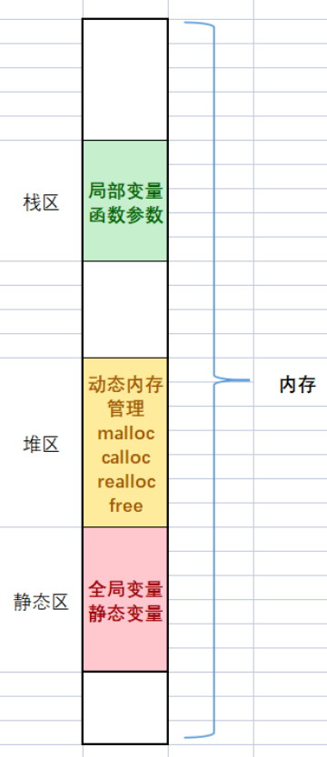

## 一. 数据类型介绍

C语⾔提供了丰富的数据类型来描述⽣活中的各种数据。

使⽤整型类型来描述整数，使⽤字符类型来描述字符，使⽤浮点型类型来描述⼩数。

所谓“类型”，就是相似的数据所拥有的共同特征，编译器只有知道了数据的类型，才知道怎么操作数据。

下⾯盘点⼀下C语⾔提供的各种数据类型，本章节主要探讨内置数据类型。


### 01. 字符型

```c
char // character
[signed] char // 有符号的
unsigned char // 无符号的
```

### 02. 整型

```c
// 短整型
short [int]
[signed] short [int]
unsigned short [int]
  
// 整型
int
[signed] int
unsigned int

// 长整型
long [int]
[signed] long [int]
unsigned long [int]

// 更长的整型
// C99中引入
long long [int]
[signed] long long [int]
unsigned long long [int]
```

### 03. 浮点型

```c
float // 单精度浮点型 12.34 => 1.234 * 10
double // 双精度浮点型 能表示更精准的数字
long double
```

### 04. 布尔类型

在 C99 标准之前，C 语言没有原生的布尔类型。布尔值通常通过整数类型（例如 `int`）来表示，习惯上使用 0 表示假（false），而非零值表示真（true）。

1. **_Bool：** 在较早版本的C标准中，使用了 _Bool 来表示布尔类型。然而，__Bool 不包含 <stdbool.h> 头文件中定义的 true 和 false 关键字，C99之前，C语言中没有真正的布尔类型，而是使用 `0` 表示 `false`，非零值表示 `true`。例如：

   ```c
   int main() {
     _Bool myBool = 1;  // 1 表示 true
     printf("%d\n", myBool);  // 输出 1
     return 0;
   }
   ```

2. **bool：** 自C99标准起，C语言引入了 <stdbool.h> 头文件，并定义了 bool、true 和 false 三个关键字。bool 是_Bool的别名，表示布尔数据类型，可以取 true 或 false 的值。例如：

   ```c
   #include <stdbool.h>
   
   int main() {
     bool myBool = true;
     printf("%d\n", myBool);  // 输出 1，true在C中通常用1表示
     return 0;
   }
   ```

总体而言，`bool` 是更加现代且直观的表示方式，而 `_Bool` 是较早版本C标准中的一种表示方式。在新代码中，建议使用 `bool`。

### 05. 各种数据类型的⻓度

每⼀种数据类型都有⾃⼰的⻓度，使⽤不同的数据类型，能够创建出⻓度不同的变量，变量⻓度的不同，存储的数据范围就有所差异。

- sizeof 操作符

  - sizeof 是⼀个关键字，也是操作符，专⻔是⽤来计算sizeof的操作符数的类型⻓度的，**单位是字节**。

  - sizeof 操作符的操作数可以是类型，也可是变量或者表达式。

    ```c
    sizeof(类型)
    sizeof 表达式
    ```

  - sizeof 的操作数如果不是类型，是表达式的时候，可以省略掉后边的括号的。
  - **sizeof 后边的表达式是不真实参与运算的，根据表达式的类型来得出⼤⼩**。
  - **sizeof 的计算结果是 size_t 类型的**。

  > 什么是size_t类型？
  >
  > - **sizeof 运算符的返回值，C 语⾔只规定是⽆符号整数**，并没有规定具体的类型，⽽是留给系统⾃⼰去决定， sizeof 到底返回什么类型。不同的系统中，返回值的类型有可能是unsigned int ，也有可能是 unsigned long ，甚⾄是 unsigned long long ，对应的 printf() 占位符分别是 %u 、 %lu 和 %llu 。这样不利于程序的可移植性。
  > - C 语⾔提供了⼀个解决⽅法，创造了⼀个类型别名 size_t ，⽤来统⼀表⽰ sizeof 的返回值类型。对应当前系统的 sizeof 的返回值类型，可能是 unsigned int ，也可能是unsigned long long 
  > - 

- 比如：

  ```c
  #include <stdio.h>
  int main()
  {
  	int a = 10;
  	printf("%zd\n", sizeof(a)); // 4
  	printf("%zd\n", sizeof a); // 4，表达式写法
  	printf("%zd\n", sizeof(int)); // 4 类型必须带()
  	printf("%zd\n", sizeof(3 + 3.5)); // 8
  	return 0;
  }
  ```

- 数据类型长度（在VS2022 X64配置下的输出）

  ```c
  #include <stdio.h>
  int main() {
  	printf("%d\n", sizeof(char)); // 1
  	printf("%d\n", sizeof(short)); // 2
  	printf("%d\n", sizeof(int)); // 4
  	printf("%d\n", sizeof(long)); // 4
    // 为什么long跟int都是4，不应该long>int吗
    // C语言标准规定：sizeof(long) >= sizeof(int)，根据不同编译器厂商实现结果不同
  	printf("%d\n", sizeof(long long)); // 8
  	printf("%d\n", sizeof(float)); // 4
  	printf("%d\n", sizeof(long double)); // 8
  	printf("%d\n", sizeof(bool)); // 1
  	return 0;
  }
  ```
  
- sizeof 中表达式不计算

  ```c
  int main() {
  	short s = 3;
  	int b = 10;
  	printf("%d\n", sizeof(s = b + 1)); // 2
  	printf("s = %d\n", s); // s = 3
  	return 0;
  }
  ```
  

sizeof 在代码进⾏编译的时候，就根据表达式的类型确定了，⽽表达式的执⾏却要在程序运⾏期间才能执⾏，在编译期间已经将sizeof处理掉了，所以在运⾏期间就不会执⾏表达式了。

在 C 语言中，赋值表达式的结果是被赋值的左值的类型。在这个情况下，赋值表达式 `s = b + 1` 的结果是 `short` 类型，因为 `s` 是 `short` 类型。

然而，`sizeof` 运算符在求值的时候不会实际执行赋值操作，它只是根据类型返回大小。所以，`sizeof(s = b + 1)` 的结果是 `sizeof(short)`。

现在，关于 `sizeof(short)` 的结果，`short` 类型通常占用2个字节（16位）。因此，`sizeof(s = b + 1)` 的输出是2。

### 06. %u、%z

`%u` 是用于在C语言中格式化输出无符号整数的格式说明符。它告诉 `printf` 函数，相应的参数是一个无符号整数，应该按照无符号整数的格式进行输出。

例如：

```c
#include <stdio.h>
int main() {
    unsigned int num = 42;
    printf("The unsigned integer is: %u\n", num);
    return 0;
}
```

在这个例子中，`%u` 被用于输出无符号整数 `num` 的值。 `%u` 不接受负数，并且按照无符号整数的方式进行输出。

如果你尝试使用 `%u` 格式说明符来输出带符号整数，结果可能是不确定的，因为这会导致类型不匹配的错误。在这种情况下，应该使用 `%d` 来格式化输出带符号整数。

在C语言中，`%z` 是用于格式化输出 `size_t` 类型的格式说明符。`size_t` 是一个无符号整数类型，通常用于表示对象大小或数组索引。

例如：

```c
#include <stdio.h>

int main() {
  size_t size = 123;
  printf("The size is: %zu\n", size);
  return 0;
}
```

在这个例子中，`%zu` 被用于输出 `size_t` 类型的变量 `size` 的值。`%zu` 用于表示无符号整数，因此在这里用于输出 `size_t` 类型的值。

需要注意的是，`%z` 用于 `size_t` 是C99标准引入的，如果你的编译环境不支持C99标准，可能需要考虑使用其他兼容的方式来处理。


## 二. signed 和 unsigned

C 语⾔使⽤ signed 和 unsigned 关键字修饰 字符型和整型 类型的。

- **signed** 关键字，**表⽰⼀个类型带有正负号，包含负值**；
- **unsigned** 关键字，**表⽰该类型不带有正负号，只能表⽰零和正整数**。

**对于 int 类型，默认是带有正负号的**，也就是说 int 等同于 signed int 。

由于这是默认情况，关键字 signed ⼀般都省略不写，但是写了也不算错。

```c
signed int a;
// 等同于int a;
```

int 类型也可以不带正负号，只表示非负整数。这时就必须使用关键字 unsigned 声明变量

```c
unsigned int a;
```

整数变量声明为 unsigned 的好处是，同样⻓度的内存能够表⽰的最⼤整数值，增⼤了⼀倍。⽐如，16位的 signed short int 的取值范围是：-32768~32767，最⼤是32767；⽽unsigned short int 的取值范围是：0~65535，最⼤值增⼤到了65,535。32位的 signed 。int 的取值范围可以参看 limits.h 中给出的定义

下⾯的定义是VS2022环境中，limits.h中相关定义。

```c
#define SHRT_MIN (-32768) // 有符号16位整型的最⼩值
#define SHRT_MAX 32767 // 有符号16位整型的最⼤值
#define USHRT_MAX 0xffff // ⽆符号16位整型的最⼤值
#define INT_MIN (-2147483647 - 1) // 有符号整型的最⼩值
#define INT_MAX 2147483647 // 有符号整型的最⼤值
```

**unsigned int ⾥⾯的 int 可以省略**，所以上⾯的变量声明也可以写成下⾯这样。

```c
unsigned a;
```

字符类型 char 也可以设置 signed 和 unsigned 。

```c
signed char c; // 范围为 -128 到 127
unsigned char c; // 范围为 0 到 255
```

注意，**C 语⾔规定 char 类型默认是否带有正负号，由当前编译器决定**。这就是说， char 不等同于 signed char ，它有可能是 signed char ，也有可能是unsigned char 。这⼀点与 int 不同， int 就是等同于 signed int 。


## 三. 数据类型的取值范围

上述的数据类型很多，尤其数整型类型就有short、int、long、long long 四种，为什么呢？其实每⼀种数据类型有⾃⼰的取值范围，也就是存储的数值的最⼤值和最⼩值的区间，有了丰富的类型，我们就可以在适当的场景下去选择适合的类型。如果要查看当前系统上不同数据类型的极限值：

- limits.h ⽂件中说明了整型类型的取值范围。
- float.h 这个头⽂件中说明浮点型类型的取值范围。

为了代码的可移植性，需要知道某种整数类型的极限值时，应该尽量使⽤这些常量。

```c
• SCHAR_MIN， SCHAR_MAX：signed char 的最⼩值和最⼤值。
• SHRT_MIN， SHRT_MAX：short 的最⼩值和最⼤值。
• INT_MIN ， INT_MAX ：int 的最⼩值和最⼤值。
• LONG_MIN ， LONG_MAX ：long 的最⼩值和最⼤值。
• LLONG_MIN ， LLONG_MAX ：long long 的最⼩值和最⼤值。
• UCHAR_MAX ：unsigned char 的最⼤值。
• USHRT_MAX ：unsigned short 的最⼤值。
• UINT_MAX ：unsigned int 的最⼤值。
• ULONG_MAX ：unsigned long 的最⼤值。
• ULLONG_MAX ：unsigned long long 的最⼤值。
```


## 四. 变量

### 01. 变量的创建

了解清楚了类型，我们使⽤类型做什么呢？**类型是⽤来创建变量的**。

什么是变量呢？C语⾔中把**经常变化的值称为变量**，**不变的值称为常量**。

变量创建的语法形式是这样的：

```c
data_type name;
// 数据类型 变量名
```

```c
int age; // 整型变量
char ch; // 字符变量
double weight; // 浮点型变量
```

变量在创建的时候就给⼀个初始值，就叫初始化。

```c
int age = 18;
char ch = 'w';
double weight = 48.0;
unsigned int height = 100;
```

### 02. 变量的分类

- 全局变量：**在⼤括号外部定义的变量**就是**全局变量**
  - 全局变量的使⽤范围更⼴，整个⼯程中想使⽤，都是有办法使⽤的。
- 局部变量：**在⼤括号内部定义的变量**就是**局部变量**
  - 局部变量的使⽤范围是⽐较局限，只能在⾃⼰所在的局部范围内使⽤的。

```c
#include <stdio.h>

int global = 2023; // 全局变量

int main() {
	int local = 2018; // 局部变量
	printf("%d\n", local); // 2018
	printf("%d\n", global); // 2023
	{
		int a = 1; // 局部变量
    printf("%d\n", a); // 1
	}
	printf("%d\n", a); // error: “a”: 未声明的标识符
	return 0;
}
```

如果局部和全局变量，名字相同呢？

```c
#include <stdio.h>

int n = 1000;
int main()
{
	int n = 10;
	printf("%d\n", n); // 10
	return 0;
}
```

其实当局部变量和全局变量同名的时候，局部变量优先使⽤。

### 03. 全局变量和局部变量在内存中的存储

⼀般我们在学习C/C++语⾔的时候，我们会关注内存中的三个区域：栈区、堆区、静态区，其实还有其他的区域。



1. **局部变量**是存放在**内存的栈区**
2. **全局变量**是放在**内存的静态区**
3. 堆区是用来动态内存管理的（后面介绍）

其实内存区域的划分会更加细致，以后在操作系统的相关知识的时候会介绍。


## 五. 算术操作符：+、-、*、/、%

在写代码时候，⼀定会涉及到计算。C语⾔中为了⽅便运算，提供了⼀系列操作符，其中有⼀组操作符叫：算术操作符。分别是： + - * / % ，这些操作符都是双⽬操作符。注：操作符也被叫做：运算符，是不同的翻译，意思是⼀样的。

### 01. + 和 -

\+ 和 - ⽤来完成加法和减法。+ 和 - 都是有2个操作数的，位于操作符两端的就是它们的操作数，这种两个操作数的操作符也叫双⽬操作符。

```c
#include <stdio.h>
int main()
{
 int x = 4 + 22;
 int y = 61 - 23;
 printf("%d\n", x); // 26
 printf("%d\n", y); // 38
 return 0;
}
```

### 02. *

运算符 * ⽤来完成乘法。

```c
#include <stdio.h>
int main()
{
 int num = 5;
 printf("%d\n", num * num); // 输出 25
 return 0;
}
```

### 03. /

运算符 / ⽤来完成除法。

**除号的两端如果是整数，执⾏的是整数除法，得到的结果也是整数。**

```c
#include <stdio.h>
int main() {
	float x = 5 / 2;
	int y = 5 / 2;
	printf("%f\n", x); // 输出 2.000000
  printf("%.1f\n", x); // 输出 2.0
	printf("%.2f\n", x); // 输出 2.00
	printf("%d\n", y); // 输出 2
	return 0;
}
// %f 和 %lf 打印的时候小数点后默认打印6位小数
// 通过 %.1f 控制打印小数位
```

上⾯⽰例中，尽管变量 x 的类型是 float （浮点数），但是 5 / 2 得到的结果是 2.0 ，⽽不是2.5 。原因就在于 **C 语⾔⾥⾯的整数除法是整除，只会返回整数部分，丢弃⼩数部分**。

如果希望得到浮点数的结果，**两个运算数必须⾄少有⼀个浮点数，这时C语⾔就会进⾏浮点数除法**。

```c
int main() {
	float x = 5.0 / 2; // 或者写成 5 / 2.0
	printf("%f\n", x); // 输出 2.500000
	return 0;
}
```

上⾯⽰例中， 5.0 / 2 表⽰进⾏浮点数除法，得到的结果就是 2.5 。

再看⼀个例⼦：

```c
int main() {
	int score = 5;
	score = (score / 20) * 100;
	printf("%d\n", score); // 0
	return 0;
}
```

上⾯的代码，你可能觉得经过运算， score 会等于 25 ，但是实际上 score 等于 0 。这是因为score / 20 是整除，会得到⼀个整数值 0 ，所以乘以 100 后得到的也是 0 。

为了得到预想的结果，可以将除数 20 改成 20.0 ，让整除变成浮点数除法。

```c
int main() {
	int score = 5;
	score = (score / 20.0) * 100;
	printf("%d\n", score); // 25
	return 0;
}
```

### 04. %

运算符 % 表⽰求模运算，即返回两个整数相除的余值。

%运算符**只能⽤于整数，不能⽤于浮点数**。

```c
#include <stdio.h>
int main() {
  int x = 6 % 4; // 2
  return 0;
}
```

负数求模的规则是，**结果的正负号由第⼀个运算数的正负号决定**。

```c
#include <stdio.h>
int main() {
  printf("%d\n", 11 % -5); // 1
  printf("%d\n", -11 % -5); // -1
  printf("%d\n", -11 % 5); // -1
  return 0;
}
```

上⾯⽰例中，第⼀个运算数的正负号（ 11 或 -11 ）决定了结果的正负号。


## 六. 赋值操作符：=和复合赋值

在变量创建的时候给⼀个初始值叫初始化，在变量创建好后，再给⼀个值，这叫赋值。

```c
int a = 100; // 初始化
a = 200; // 赋值，这⾥使⽤的就是赋值操作符
```

赋值操作符 = 是⼀个随时可以给变量赋值的操作符。

### 01. 连续赋值

赋值操作符也可以连续赋值，如：

```c
int a = 3;
int b = 5;
int c = 0;
c = b = a + 3; // 连续赋值，从右向左依次赋值的。
```

C语⾔虽然⽀持这种连续赋值，但是写出的代码不容易理解，建议还是拆开来写，这样⽅便观察代码的执⾏细节。

```c
int a = 3;
int b = 5;
int c = 0;
b = a + 3;
c = b;
```

这样写，在调试的是，每⼀次赋值的细节都是可以很⽅便的观察的。

### 02. 复合赋值符

在写代码时，我们经常可能对⼀个数进⾏⾃增、⾃减的操作，如下代码：

```c
int a = 10;
a = a + 3;
a = a - 2;
```

这样代码C语⾔给提供了更加⽅便的写法：

```c
int a = 10;
a += 3;
a -= 2;
```

C语⾔中提供了复合赋值符，⽅便我们编写代码，这些赋值符有：

```c
+=、-=、*=、/=、%=
>>=、<<=、&=、|=、^=
```


## 七. 单⽬操作符：++、--、+、-

前⾯介绍的操作符都是双⽬操作符，有2个操作数的。C语⾔中还有⼀些操作符只有⼀个操作数，被称为**单⽬操作符**。 ++、--、+(正)、-(负) 就是单⽬操作符的。

### 01. ++ 和 --

++是⼀种⾃增的操作符，⼜分为前置++和后置++，--是⼀种⾃减的操作符，也分为前置--和后置--.

- 前置++

  ```c
  int a = 10;
  int b = ++a; // ++的操作数是a，是放在a的前⾯的，就是前置++
  printf("a=%d b=%d\n", a, b); // a=11 b=11
  ```

  - 计算⼝诀：先+1，后使⽤
  - a原来是10，先+1，后a变成了11，再使⽤就是赋值给b，b得到的也是11，所以计算技术后，a和b都是11，相当于这样的代码
  
  ```c
  int a = 10;
  a = a+1;
  int b = a;
  printf("a=%d b=%d\n",a , b); // a=11 b=11
  ```

- 后置++

  ```c
  int a = 10;
  int b = a++;//++的操作数是a，是放在a的后⾯的，就是后置++
  printf("a=%d b=%d\n",a , b); // a=11 b=10
  ```

  - 计算⼝诀：先使⽤，后+1
  - a原来是10，先使⽤，就是先赋值给b，b得到了10，然后再+1，然后a变成了11，所以直接结束后a是11，b是10，相当于这样的代码：

  ```c
  int a = 10;
  int b = a;
  a = a+1;
  printf("a=%d b=%d\n",a , b); // a=11 b=10
  ```

- 前置--

  - 如果你听懂了前置++，那前置--是同理的，只是把加1，换成了减1；
  - 计算⼝诀：先-1，后使⽤

  ```c
  int a = 10;
  int b = --a; // --的操作数是a，是放在a的前⾯的，就是前置--
  printf("a=%d b=%d\n",a , b); // a=9 b=9
  ```

- 后置--

  - 同理后置--类似于后置++，只是把加⼀换成了减一
  - 计算⼝诀：先使⽤，后-1

  ```c
  int a = 10;
  int b = a--; // --的操作数是a，是放在a的后⾯的，就是后置--
  printf("a=%d b=%d\n",a , b); // a=9 b=10
  ```

### 02. \+ 和 -

这⾥的+是正号，-是负号，都是单⽬操作符。

运算符 + 对正负值没有影响，是⼀个完全可以省略的运算符，但是写了也不会报错。

```c
int a = +10; // 等价于=> int a = 10;
```

运算符 - ⽤来改变⼀个值的正负号，负数的前⾯加上 - 就会得到正数，正数的前⾯加上 - 会得到负数。

```c
int a = 10;
int b = -a;
int c = -10;
printf("b=%d c=%d\n", b, c); // b=-10 c=-10
int a = -10;
int b = -a;
printf("b=%d\n", b); // b=10
```


## 八. 强制类型转换

在操作符中还有⼀种特殊的操作符是强制类型转换，语法形式很简单，形式如下：

```c
(类型)
```

请看代码：

```c
int a = 3.14; // 直接写的字面浮点数，会被编译器识别为double类型
// a的是int类型, 3.14是double类型
// 两边的类型不⼀致，编译器会报警告：warning C4244: “初始化”: 从“double”转换到“int”，可能会丢失数据
```

为了消除这个警告，我们可以使⽤强制类型转换：

```c
int a = (int)3.14; 
// 将3.14强制类型转换为int类型，这种强制类型只取整数部分
```

俗话说，强扭的⽠不甜，我们使⽤强制类型转换都是万不得已的时候使⽤，如果不需要强制类型转化就能实现代码，这样⾃然更好的。


## 九. scanf 和 printf 介绍

### 01. printf

1. 基本用法

   - `printf()` 的作用是**将参数文本输出到屏幕**。它名字里面的 `f` 代表 `format`(格式化)，表⽰可以定制输出⽂本的格式。

   - printf() 是在**标准库的头⽂件 stdio.h中 定义的**。使⽤这个函数之前，必须在源码⽂件头部引⼊这个头⽂件。

     ```c
     #include <stdio.h>
     int main(void) {
       printf("hello world");
       return 0;
     }
     ```

   - 上⾯命令会在屏幕上输出⼀⾏⽂字“Hello World”。

   - printf() **不会在⾏尾⾃动添加换⾏符**，运⾏结束后，光标就停留在输出结束的地⽅，不会⾃动换⾏。

   - 为了让光标移到下⼀⾏的开头，可以在输出⽂本的结尾，添加⼀个换⾏符 `\n` 。

     ```c
     printf("hello world\n");
     ```

   - 如果⽂本内部有换⾏，也是通过插⼊换行符来实现，如下方代码：

     ```c
     #include <stdio.h>
     int main(void) 
     {
      printf("Hello\nWorld\n");
      printf("Hello\n");
      printf("World\n");
      return 0;
     }
     ```

2. 占位符

   - printf() 可以在输出⽂本中指定占位符。

   - 所谓 “占位符”，就是这个位置可以⽤其他值代⼊。

     ```c
     // 输出 There are 3 apples
     #include <stdio.h>
     int main() {
      printf("There are %d apples\n", 3);
      return 0;
     }
     ```

   - 上⾯⽰例中， There are %d apples\n 是输出⽂本，⾥⾯的 `%d` 就是占位符，表⽰这个位置要⽤其他值来替换。

   - 占位符的**第⼀个**字符为**百分号%** ，**第⼆个**字符表⽰占位符的**类型**， %d 表⽰这⾥代⼊的值必须是⼀个整数。

     ```c
     //格式：%占位符类型
     ```

   - printf() 的第⼆个参数就是替换占位符的值，上⾯的例⼦是整数 3 替换 %d 。执⾏后的输出结果就是 There are 3 apples 。

   - 常⽤的占位符除了 %d ，还有 %s 表⽰代⼊的是字符串。

     ```c
     #include <stdio.h>
     int main() {
      printf("%s world\n", "hello");
      return 0;
     }
     ```

   - 上⾯⽰例中， %s 表⽰代⼊的是⼀个字符串，所以 printf() 的第⼆个参数就必须是字符串，这个例⼦是 hello。执⾏后的输出就是hello world。

   - 输出⽂本⾥⾯**可以使⽤多个占位符**。

     ```c
     #include <stdio.h>
     int main() {
      printf("my %s is %d \n", "age", 24);
      return 0;
     }
     ```

   - 上⾯⽰例中，输出⽂本 my %s is %d \n 有两个占位符，第⼀个是字符串占位符 %s ，第⼆个是整数占位符 %d ，分别对应 printf() 的第⼆个参数（age）和第三个参数（24）。执⾏后的输出就是 my age is 24。
   - printf() 参数与占位符是⼀⼀对应关系，如果有 n 个占位符， printf() 的参数就应该有 n + 1 个。`如果参数个数少于对应的占位符， printf() 可能会输出内存中的任意值`。

3. 占位符列举

   - printf() 的占位符有许多种类，与 C 语⾔的数据类型相对应。下⾯按照字⺟顺序，列出常⽤的占位符，⽅便查找，具体含义在后⾯章节介绍。

     | 占位符  | 输出格式                                                     |
     | ------- | ------------------------------------------------------------ |
     | %a      | ⼗六进制浮点数，字⺟输出为⼩写。                             |
     | %A      | ⼗六进制浮点数，字⺟输出为⼤写。                             |
     | **%c**  | **字符**                                                     |
     | **%d**  | **十进制整数**                                               |
     | %e      | 使⽤科学计数法的浮点数，指数部分的 e 为⼩写。                |
     | %E      | 使⽤科学计数法的浮点数，指数部分的 E 为⼤写。                |
     | %i      | 整数，基本等同于 %d 。                                       |
     | **%f**  | **⼩数（包含 float 类型和 double 类型）**                    |
     | %g      | 6个有效数字的浮点数。整数部分⼀旦超过6位，就会⾃动转为科学计数法，指数部分的 e为⼩写。 |
     | %G      | 等同于 %g ，唯⼀的区别是指数部分的 E 为⼤写。                |
     | **%hd** | **⼗进制 short int 类型**                                    |
     | %ho     | ⼋进制 short int 类型                                        |
     | %hx     | ⼗六进制 short int 类型                                      |
     | **%hu** | **unsigned short int 类型**                                  |
     | **%ld** | **⼗进制 long int 类型**                                     |
     | %lo     | ⼋进制 long int 类型                                         |
     | %lx     | ⼗六进制 long int 类型                                       |
     | %lu     | unsigned long int 类型                                       |
     | %lld    | ⼗进制 long long int 类型                                    |
     | %llo    | ⼋进制 long long int 类型                                    |
     | %llx    | ⼗六进制 long long int 类型                                  |
     | %llu    | unsigned long long int 类型                                  |
     | %Le     | 科学计数法表⽰的 long double 类型浮点数                      |
     | **%Lf** | **long double 类型浮点数**                                   |
     | %n      | 已输出的字符串数量。该占位符本⾝不输出，只将值存储在指定变量之中 |
     | %o      | ⼋进制整数                                                   |
     | **%p**  | **指针**                                                     |
     | **%s**  | **字符串**                                                   |
     | **%u**  | **⽆符号整数（unsigned int），范围：0和正整数**              |
     | **%x**  | **⼗六进制整数**                                             |
     | **%zd** | **`size_t` 类型**                                            |
     | %%      | 输出⼀个百分号                                               |

4. 输出格式

   printf() 可以·定制占位符的输出格式

   1. **限定宽度**

      - printf 允许**限定占位符的最小宽度**，超出则按实际宽度打印

        ```c
        printf("%5d\n", 123); // "  123"
        ```

      - 上⾯⽰例中， %5d 表⽰这个占位符的宽度⾄少为5位。如果不满5位，对应的值的前⾯会添加空格。输出的值**默认是右对⻬**，即输出内容前⾯会有空格；如果希望改成左对⻬，在输出内容后⾯添加空格，可以在占位符的 % 的后⾯插⼊⼀个 - 号。

        ```c
        printf("%-5d\n", 123); // "123  "
        ```

      - 上⾯⽰例中，输出内容 123 的后⾯添加了空格。

      - 对于⼩数，这个限定符会限制所有数字的最⼩显⽰宽度。

        ```c
        printf("%12f\n", 123.45); // 输出 "  123.450000"
        ```

      - 上⾯⽰例中， %12f 表⽰输出的浮点数最少要占据12位。由于**⼩数的默认显⽰精度是⼩数点后6位**，所以 123.45 输出结果的头部会添加2个空格。

   2. **总是显示正负号**

      - 默认情况下， printf() 不对正数显⽰ + 号，只对负数显⽰ - 号。如果想让正数也输出 + 号，可以在占位符的 % 后⾯加⼀个 + 。

        ```c
        printf("%+d\n", 12); // +12
        printf("%+d\n", -12); // -12
        ```

      - 上⾯⽰例中， %+d 可以确保输出的数值，总是带有正负号。

   3. **限定⼩数位数**

      - 输出⼩数时，有时希望限定⼩数的位数。举例来说，希望⼩数点后⾯只保留两位，占位符可以写成 %.2f 。

        ```c
        printf("%.2f\n", 0.5); // 0.50
        ```

      - 上⾯⽰例中，如果希望⼩数点后⾯输出3位（ 0.500 ），占位符就要写成 %.3f 。

      - 这种写法可以与限定宽度占位符，结合使⽤。

        ```c
        printf("%6.2f\n", 0.5); // "  0.50"
        ```

      - 上⾯⽰例中， %6.2f 表⽰输出字符串最⼩宽度为6，⼩数位数为2。所以，输出字符串的头部有两个空格。

      - **最⼩宽度**和**⼩数位数**这两个限定值，都可以**⽤ * 代替**，通过 printf() 的**参数传⼊**。

        ```c
        printf("%*.*f\n", 6, 2, 0.5); // "  0.50"
        ```

      - 上⾯⽰例中， %*.*f 的两个星号通过 printf() 的两个参数 6 和 2 传⼊。

   4. **输出部分字符串**

      - %s 占位符⽤来输出字符串，默认是全部输出。如果只想输出开头的部分，可以⽤ %.[m]s 指定输出的⻓度，其中 [m] 代表⼀个数字，表⽰所要输出的⻓度。

        ```c
        printf("%s", "hello world\n"); // hello world
        printf("%.3s", "hello world"); // hel
        ```

      - 上⾯⽰例中，占位符 %.3s 表⽰只输出字符串“hello world”的前3个字符，即“hel”。

### 02. scanf

当我们有了变量，我们需要给变量输⼊值就可以使⽤ scanf 函数，如果需要将变量的值输出在屏幕上的时候可以使⽤ printf 函数，下⾯看⼀个例⼦：

```c
#include <stdio.h>
int main()
{
  int score = 0;
  printf("请输⼊成绩:");
  scanf("%d", &score);
  printf("成绩是：%d\n", score);
  return 0;
}
```


注：标准输⼊⼀般指的就是键盘，标准输出⼀般指的就是屏幕

1. 基本用法

   - scanf() 函数⽤于**读取⽤⼾的键盘输⼊**。

   - 程序运⾏到这个语句时，会停下来，等待⽤⼾从键盘输⼊。

   - ⽤⼾输⼊数据、按下回⻋键后， scanf() 就会处理⽤⼾的输⼊，将其存⼊变量。它的原型**定义在头⽂件 stdio.h** 。

   - scanf() 的语法跟 printf() 类似。

     ```c
     scanf("%d", &i);
     ```

   - 它的第⼀个参数是⼀个格式字符串，⾥⾯会放置占位符（与 printf() 的占位符基本⼀致），告诉编译器如何解读⽤⼾的输⼊，需要提取的数据是什么类型。

   - 这是因为 C 语⾔的数据都是有类型的， scanf() 必须提前知道⽤⼾输⼊的数据类型，才能处理数据。

   - 它的其余参数就是存放⽤⼾输⼊的变量，格式字符串⾥⾯有多少个占位符，就有多少个变量。

   - 上⾯⽰例中， scanf() 的第⼀个参数 %d ，表⽰⽤⼾输⼊的应该是⼀个整数。 %d 就是⼀个占位符， % 是占位符的标志， d 表⽰整数。第⼆个参数 &i 表⽰，将⽤⼾从键盘输⼊的整数存⼊变量i 。

     > 注意：
     >
     > - 变量前⾯必须加上 & 运算符（指针变量除外），因为 scanf() 传递的不是值，⽽是地址，即将变量 i 的地址指向⽤⼾输⼊的值。如果这⾥的变量是指针变量（⽐如字符串变量），那就不⽤加 & 运算符。

   - 下⾯是⼀次将键盘输⼊读⼊多个变量的例子：

     ```c
     scanf("%d%d%f%f", &i, &j, &x, &y);
     ```

   - 上⾯⽰例中，格式字符串 %d%d%f%f ，表⽰⽤⼾输⼊的前两个是整数，后两个是浮点数，⽐如 1 -20 3.4 -4.0e3 。这四个值依次放⼊ i 、 j 、 x 、 y 四个变量。

   - scanf() **处理数值占位符时**，会**⾃动过滤空⽩字符**，包括空格、制表符、换⾏符等。

   - 所以，⽤⼾输⼊的数据之间，有⼀个或多个空格不影响 scanf() 解读数据。另外，⽤⼾使⽤回⻋键，将输⼊分成⼏⾏，也不影响解读。

     ```c
     1
     -20
     3.4
     -4.0e3
     // 等价于 => 1 -20 3.4 -4.0e3
     ```

   - 上⾯⽰例中，⽤⼾分成四⾏输⼊，得到的结果与⼀⾏输⼊是完全⼀样的。每次按下回⻋键以后，scanf() 就会开始解读，如果第⼀⾏匹配第⼀个占位符，那么下次按下回⻋键时，就会从第⼆个占位符开始解读。

   - scanf() 处理⽤⼾输⼊的原理是，**⽤⼾的输⼊先放⼊缓存，等到按下回⻋键后，按照占位符对缓存进⾏解读**。

   - 解读⽤⼾输⼊时，会从上⼀次解读遗留的第⼀个字符开始，直到读完缓存，或者遇到第⼀个不符合条件的字符为⽌。

     ```c
     #include <stdio.h>
     int main()
     {
       int x;
       float y;
     
       // ⽤⼾输⼊ "     -13.45e12# 0"
       scanf("%d", &x);
       printf("%d\n", x);
       scanf("%f", &y);
       printf("%f\n", y);
       return 0;
     }
     ```

   - 上⾯⽰例中， scanf() 读取⽤⼾输⼊时， %d 占位符会忽略起⾸的空格，从 - 处开始获取数据，读取到 -13 停下来，因为后⾯的 . 不属于整数的有效字符。这就是说，占位符 %d 会读到 -13 。

   - 第⼆次调⽤ scanf() 时，就会从上⼀次停⽌解读的地⽅，继续往下读取。这⼀次读取的⾸字符是 . ，由于对应的占位符是 %f ，会读取到 .45e12 ，这是采⽤科学计数法的浮点数格式。后⾯的 # 不属于浮点数的有效字符，所以会停在这⾥。

   - 由于 scanf() 可以连续处理多个占位符，所以上⾯的例⼦也可以写成下⾯这样。

     ```c
     #include <stdio.h>
     int main() {
       int x;
       float y;
       // ⽤⼾输⼊ "     -13.45e12# 0"
       scanf("%d%f", &x, &y);
       return 0;
     }
     ```

2. **scanf 的返回值**

   - scanf() 的返回值是**⼀个整数**，表⽰**成功读取的变量个数**。

   - 如果没有读取任何项，或者匹配失败，则返回 0 。如果在成功读取任何数据之前，发⽣了**读取错误或遇到读取到⽂件结尾，则返回常量 EOF（-1）**。

   - `EOF(-1)`：end of file 文件结束标志，EOF本质是-1

     ```c
     #include <stdio.h>
     int main()
     {
       int a = 0;
       int b = 0;
       float f = 0.0f;
       int r = scanf("%d %d %f", &a, &b, &f);
       printf("a=%d b=%d f=%f\n", a, b, f);
       printf("r = %d\n", r);
       return 0;
     }
     ```

   - 输入输出测试：

     

   - 如果输入2个数后，按`ctrl+z`，提前结束输入：

     

   - 在VS环境中按3次 ctrl+z ，才结束了输⼊，我们可以看到r是2，表⽰正确读取了2个数值。如果⼀个数字都不输⼊，直接按3次 ctrl+z ,输出的r是-1，也就是EOF

     

3. 占位符

   - scanf() 常⽤的占位符如下，与 printf() 的占位符基本⼀致。

   - %c ：字符。

   - %d ：整数。

   - %f ： float 类型浮点数。

   - %lf ： double 类型浮点数。

   - %Lf ： long double 类型浮点数。

   - %s ：字符串。

   - %[] ：在⽅括号中指定⼀组匹配的字符（⽐如 %[0-9] ），遇到不在集合之中的字符，匹配将会停⽌。

   - 上⾯所有占位符之中，除了 %c 以外，都会⾃动忽略起⾸的空⽩字符。 **%c 不会忽略空⽩字符**，总是返回当前第⼀个字符，⽆论该字符是否为空格。

   - 如果要强制跳过字符前的空⽩字符，可以写成 scanf(" %c", &ch) ，即 %c 前加上⼀个空格，表⽰跳过零个或多个空⽩字符。

   - 下⾯要特别说⼀下占位符 %s ，它其实不能简单地等同于字符串。它的规则是，从当前第⼀个⾮空⽩字符开始读起，直到遇到空⽩字符（即空格、换⾏符、制表符等）为⽌。

   - 因为 **%s 不会包含空⽩字符**，所以⽆法⽤来读取多个单词，除⾮多个 %s ⼀起使⽤。这也意味着，scanf() 不适合读取可能包含空格的字符串，⽐如书名或歌曲名。另外， scanf() 遇到 %s 占位符，会在字符串变量末尾存储⼀个空字符 \0 。

   - scanf() 将字符串读⼊字符数组时，不会检测字符串是否超过了数组⻓度。所以，储存字符串时，很可能会超过数组的边界，导致预想不到的结果。为了防⽌这种情况，使⽤ %s 占位符时，应该指定读⼊字符串的最⻓⻓度，即写成 %[m]s ，其中的 [m] 是⼀个整数，表⽰读取字符串的最⼤⻓度，后⾯的字符将被丢弃。

     ```c
     #include <stdio.h>
     int main() {
       char name[11];
       scanf("%10s", name);
       return 0;
     }
     ```

   - 上⾯⽰例中， name 是⼀个⻓度为11的字符数组， scanf() 的占位符 %10s 表⽰最多读取⽤⼾输⼊的10个字符，后⾯的字符将被丢弃，这样就不会有数组溢出的⻛险了。

4. 赋值忽略符

   - 有时，⽤⼾的输⼊可能不符合预定的格式。

     ```c
     #include <stdio.h>
     int main()
     {
       int year = 0;
       int month = 0;
       int day = 0;
       scanf("%d-%d-%d", &year, &month, &day);
       printf("%d %d %d\n", year, month, day);
       return 0;
     }
     ```

   - 上⾯⽰例中，如果⽤⼾输⼊ 2020-01-01 ，就会正确解读出年、⽉、⽇。问题是⽤⼾可能输⼊其他格式，⽐如 2020/01/01 ，这种情况下， scanf() 解析数据就会失败。

   - 为了避免这种情况， scanf() 提供了⼀个赋值忽略符（assignment suppression character） * 。只要把 * 加在任何占位符的百分号后⾯，该占位符就不会返回值，解析后将被丢弃。

     ```c
     #include <stdio.h>
     int main()
     {
       int year = 0;
       int month = 0;
       int day = 0;
       scanf("%d%*c%d%*c%d", &year, &month, &day);
       return 0;
     }
     ```

   - 上⾯⽰例中， **%*c** 就是在占位符的百分号后⾯，加⼊了赋值忽略符 * ，表⽰**这个占位符没有对应的变量，解读后不必返回**。
