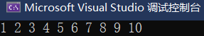

C语⾔是结构化的程序设计语⾔，这⾥的结构指的是顺序结构、选择结构、循环结构，C语⾔是能够实现这三种结构的，其实我们如果仔细分析，我们⽇常所⻅的事情都可以拆分为这三种结构或者这三种结构的组合。我们可以使⽤ if 、 switch 实现分⽀结构，使⽤ for 、 while 、 do while 实现循环结构。

## 一. if 语句

### 01. if

if 语句的语法形式如下：

```c
if (表达式)
  语句
```

表达式成⽴（为真），则语句执行，表达式不成⽴（为假），则语句不执行。

在C语⾔中，0为假，⾮0表⽰真，也就是表达式的结果如果是0，则语句不执⾏，表达式的结果如果不是0，则语句执⾏。

例⼦：输⼊⼀个整数，判断是否为奇数

```c
#include <stdio.h>
int main() {
	int num = 0;
	scanf("%d", &num);
	if (num % 2 == 1)
		printf("%d 是奇数\n", num);
	return 0;
}
```


### 02. else

如果⼀个数不是奇数，那就是偶数了，如果任意⼀个整数，我们要清楚的判断是奇数还是偶数怎么表⽰呢？这⾥就需要 if...else... 语句了，语法形式如下：

```c
if (表达式)
  语句1
else
  语句2
```

例⼦：输⼊⼀个整数，判断是否为奇数，如果是奇数打印是奇数，否则打印偶数。

```c
#include <stdio.h>
int main() {
  int num = 0;
  scanf("%d", &num);
  if (num % 2 == 1)
    printf("%d 是奇数\n", num);
  else 
    printf("%d 是偶数\n", num);
  return 0;
}
```

练习：输⼊⼀个年龄，>= 18岁就输出：成年，否则就输出：未成年

```c
#include <stdio.h>
int main() {
  int age = 0;
  scanf("%d", &age);
  if(age >= 18)
    printf("成年");
  else
    printf("未成年");
  return 0;
}
```

### 03. 分支中包含多条语句

默认在if和else语句中默认都只控制一条语句，比如：

```c
#include <stdio.h>
int main() {
  int age = 0;
  scanf("%d", &age);
  if (age >= 18) 
    printf("成年了");
  	printf("可以谈恋爱了");
  return 0;
}
```

上⾯的代码，你会发现输⼊的值不管是>=18 还是<18，"可以谈恋爱了" 都会打印在屏幕上。


这是因为 if 语句只能控制⼀条语句，就是 printf("成年了\n"); ，if语句为真，则打印成年了，if语句为假，则不打印，对于 printf("可以谈恋爱了\n"); 是独⽴存在的，不管if语句的条件的真假，都会被执⾏。那如果我们要if语句同时控制2条语句，怎么办呢？那就要使⽤ {} 将代码括起来，else 后也可以跟上⼤括号。如下：

```c
#include <stdio.h>
int main() {
  int age = 0;
  scanf("%d", &age);
  if(age >= 18) {
    // if后使⽤{}控制多条语句-这个块也叫：程序块，或复合语句
    printf("成年了\n");
    printf("可以谈恋爱了\n");
  }
  return 0;
}

int main() {
  int age = 0;
  scanf("%d", &age);
  if(age >= 18) {
    printf("成年了\n");
    printf("可以谈恋爱了\n");
  }
  else { 
    // else后使⽤{}控制多条语句-这个块也叫：程序块，或复合语句
    printf("未成年\n");
    printf("不可以早恋哦\n");
  }
  return 0;
}
```

### 04. 嵌套if

在 if else 语句中， else 可以与另⼀个 if 语句连⽤，构成多重判断。

⽐如：要求输⼊⼀个整数，判断输⼊的整数是0，还是正数或者负数。请看如下代码：

```c
#include <stdio.h>
int main() {
  int num = 0;
  scanf("%d", &num);
  if(num == 0)
    printf("输⼊的数字是0\n");
  else if(num > 0) //这⾥的if 相当于嵌套在else语句中，形成了嵌套结构
    printf("输⼊的数字是正数\n");
  else
    printf("输⼊的数字是负数\n");
  return 0;
}
```

输⼊⼀个整数，如果是正数，再判断是奇数还是偶数，并输出；如果不是正数则输出：⾮正数。

```c
#include <stdio.h>
int main() {
  int num = 0;
  scanf("%d", &num);
  if (num > 0) {
    if (num%2 == 0)
      printf("偶数\n");
    else
      printf("奇数\n");
  }
  else {
    printf("⾮正数\n");
  }
  return 0;
}
```

以上就是嵌套if语句的语法，有了嵌套if语句，就可以完成更多复杂逻辑的判断。

练习：

```c
输⼊⼀个⼈的年龄
如果年龄<18岁，打印"少年"
如果年龄在18岁⾄44岁打印"⻘年"
如果年龄在45岁⾄59岁打印"中⽼年"
如果年龄在60岁⾄89岁打印"⽼年"
如果90岁及以上打印"⽼寿星"
```

```c
//⽅法1
#include <stdio.h>
int main() {
  int age = 0;
  scanf("%d", &age);
  if(age<18)
    printf("少年\n");
  else if(age<=44)
    printf("⻘年\n");
  else if(age<=59)
    printf("中⽼年\n");
  else if(age<=89)
    printf("⽼年\n");
  else
    printf("⽼寿星\n");
  return 0;
}


// 带上⼤括号更容易看明⽩
#include <stdio.h>
int main() {
  int age = 0;
  scanf("%d", &age);
  if(age<18){
    printf("少年\n");
  } else {
    if(age<=44){
      printf("⻘年\n");
    } else{
      if(age<=59){
        printf("中⽼年\n");
      } else {
        if(age<=89)
          printf("⽼年\n");
        else
          printf("⽼寿星\n");
      }
    }
  }
  return 0;
}
```

### 05. 悬空else问题

如果有多个 if 和 else ，可以记住这样⼀条规则， else 总是跟最接近的 if 匹配。我们⾸先从下⾯代码开始

```c
int main() {
  int a = 0;
  int b = 2;
  if (a == 1)
    if (b == 2)
      printf("hehe");
  else
    printf("haha");
  return 0;
}
```

程序运⾏的结果是啥？很多初学者，上来以判断 a 是 0，不等于 1 ，那就执⾏ else ⼦句，打印 haha，但是当你去运⾏代码，输出的结果是：啥都不输出。


为什么呢？

这就是悬空 else 的问题，如果有多个 if 和 else ，可以记住这样⼀条规则， else 总是跟最接近的 if 匹配。

上⾯的代码排版，让 else 和第⼀个 if 语句对⻬，让我们以为 else 是和第⼀个if匹配的，当 if语句不成⽴的时候，⾃然想到的就是执⾏ else ⼦句，打印 haha ，但实际上 else 是和第⼆个 if进⾏匹配的，这样后边的 if...else 语句是嵌套在第⼀个 if 语句中的，如果第⼀个 if 语句就不成⽴，嵌套 if 和 else 就没机会执⾏了，最终啥都不打印。

如果代码改成下⾯这样就更加容易理解了

```c
#include <stdio.h>
int main() {
  int a = 0;
  int b = 2;
  if(a == 1)
  {
    if(b == 2)
      printf("hehe\n");
    else
      printf("haha\n");
  }
  return 0;
}
```

或者如果我们希望else确实和第⼀个if匹配，可以这样修改代码：

```c
#include <stdio.h>
int main() {
  int a = 0;
  int b = 2;
  if(a == 1)
  {
    if(b == 2)
      printf("hehe\n");
  }
  else
  {
    printf("haha\n");
  }
  return 0;
}
```

只要带上适当的⼤括号，代码的逻辑就会更加的清晰，所以⼤家以后在写代码的时候要注意括号的使⽤，让代码的可读性更⾼。


## 二. 关系操作符

C 语⾔⽤于⽐较的表达式，称为 “关系表达式”（relational expression），⾥⾯使⽤的运算符就称为“关系运算符”（relational operator），主要有下⾯6个。

```c
> ⼤于运算符
< ⼩于运算符
>= ⼤于等于运算符
<= ⼩于等于运算符
== 相等运算符
!= 不相等运算符
```

下⾯是⼀些例⼦。

```c
a == b;
a != b;
a < b;
a > b;
a <= b;
a >= b;
```

关系表达式通常返回 0 或 1 ，表⽰真假。

C 语⾔中， 0 表⽰假，所有⾮零值表⽰真。⽐如， 20 > 12 返回 1 ， 12 > 20 返回 0 。

关系表达式常⽤于 if 或 while 结构。

```c
if (x == 3) {
  printf("x is 3.\n");
}
```

注意：相等运算符 == 与赋值运算符 = 是两个不⼀样的运算符，不要混淆。有时候，可能会不⼩⼼写出下⾯的代码，它可以运⾏，但很容易出现意料之外的结果。

```c
if (x = 3) ...
```

上⾯⽰例中，原意是 x == 3 ，但是不⼩⼼写成 x = 3 。这个式⼦表⽰对变量 x 赋值 3 ，它的返回值为 3 ，所以 if 判断总是为真。

为了防⽌出现这种错误，有的程序员喜欢将变量写在等号的右边。

```c
if (3 == x) ...
```

这样的话，如果把 `==` 误写成 `=`，编译器就会报错

```c
// 报错
if (3 = x) ...
```

另一个需要避免的错误是：C语言中，多个关系运算符不宜连用。

```c
i < j < k
```

上⾯⽰例中，连续使⽤两个⼩于运算符。这是合法表达式，不会报错，但是通常达不到想要的结果，即不是保证变量 j 的值在 i 和 k 之间。因为关系运算符是从左到右计算，所以实际执⾏的是下⾯的表达式。

```c
(i < j) < k
```

上⾯式⼦中， i < j 返回 0 或 1 ，所以最终是 0 或 1 与变量 k 进⾏⽐较。如果想要判断变量 j的值是否在 i 和 k 之间，应该使⽤下⾯的写法。

```c
i < j && j < k
```

⽐如：我们输⼊⼀个年龄，如果年龄在18岁~36岁之间，我们输出⻘年。如果我们这样写：

```c
#include <stdio.h>
int main() {
  int age = 0;
  scanf("%d", &age);
  if (18<=age<=36) {
    printf("⻘年\n");
  }
  return 0;
}
```

当我们输⼊10的时候，依然输出⻘年，如下图：


这是因为，我们先拿18和age中存放的10⽐较，表达式18<=10为假， 18<=age 的结果是0，再拿0和36⽐较，0<=36为真，所以打印了 ⻘年 ，所以即使当age是10的时候，也能打印 ⻘年 ，逻辑上是有问题，这个代码应该怎么写呢？

```c
#include <stdio.h>
int main() {
  int age = 0;
  scanf("%d", &age);
  if (age>=18 && age<=36) {
    printf("⻘年\n");
  }
  return 0;
}
```

以上就是关于操作符，我们需要掌握的，剩下的只要按照字⾯意思理解使⽤就⾏，没有特别注意的。


## 三. 条件操作符

条件操作符也叫三⽬操作符，需要接受三个操作数的，形式如下：

```c
exp11 ? exp2 : exp3
```

条件操作符的计算逻辑是：如果 exp1 为真， exp2 计算，计算的结果是整个表达式的结果；如果 exp1 为假， exp3 计算，计算的结果是整个表达式的结果。

练习1：使⽤条件操作符表⽰下⾯代码的逻辑

```c
#include <stdio.h>
int main() {
  int a = 0;
  int b = 0;
  scanf("%d", &a);
  if (a > 5)
    b = 3;
  else
    b = -3;
  printf("%d\n", b);
  return 0;
}

// 改造后：
#include <stdio.h>
int main() {
  int a = 0;
  int b = 0;
  scanf("%d", &a);
  b = a>5 ? 3:-3;
  printf("%d\n", b);
  return 0;
}
```

练习2：使⽤条件表达式实现找两个数中较⼤值。

```c
#include <stdio.h>
int main() {
  int a = 0;
  int b = 0;
  scanf("%d %d", &a, &b);
  int m = a>b ? a : b;
  printf("%d\n", m);
  return 0;
}
```


## 四. 逻辑操作符：&&、||、！

逻辑运算符提供逻辑判断功能，⽤于构建更复杂的表达式，主要有下⾯三个运算符。

- ! ：逻辑取反运算符（改变单个表达式的真假）。
- && ：与运算符，就是并且的意思（两侧的表达式都为真，则为真，否则为假）。
- || ：或运算符，就是或者的意思（两侧⾄少有⼀个表达式为真，则为真，否则为假）。

> 注意：C语音中，非0表示真，0表示假。

### 01. 逻辑取反运算符！


⽐如，我们有⼀个变量叫 flag，如果flag为假，要做⼀个什么事情，就可以这样写代码：

```c
#include <stdio.h>
int main() {
  int flag = 0;
  if (!flag) {
    printf("do something\n");
  }
  return 0;
}
```

如果 flag 为真， !flag 就是假，如果 flag 为假， !flag 就是真

所以上⾯的代码的意思就是 flag 为假，执⾏if语句中的代码。

### 02. 与运算符 &&


&& 就是与运算符，也是并且的意思， && 是⼀个双⽬操作符，使⽤的⽅式是 a&&b , && 两边的表达式都是真的时候，整个表达式才为真，只要有⼀个是假，则整个表达式为假。⽐如：如果我们说⽉份是3⽉到5⽉，是春天，那使⽤代码怎么体现呢？

```c
int month = 0;
scanf("%d", &month);
if (month >= 3 && month <= 5) {
 printf("春季\n");
}
```

这⾥表达的意思就是month既要⼤于等于3，⼜要⼩于等于5，必须同时满⾜。

### 03. 或运算符 ||


||就是或运算符，也就是或者的意思， ||也是⼀个双⽬操作符，使⽤的⽅式是 a || b ， ||两边的表达式只要有⼀个是真，整个表达式就是真，两边的表达式都为假的时候，才为假。

⽐如：我们说⼀年中⽉份是12⽉或者1⽉或者2⽉是冬天，那么我们怎么使⽤代码体现呢？

```c
int month = 0;
scanf("%d", &month);
if (month == 12 || month==1 || month == 2) {
  printf("冬季\n");
}
```

### 04. 练习：闰年的判断

输⼊⼀个年份year，判断year是否是闰年

闰年判断的规则：

1. 被4整除并且不能被100整除的是闰年
2. 被400整除是闰年

```c
#include <stdio.h>
//代码1
int main() {
  int year = 0;
  scanf("%d", &year);
  if(year%4==0 && year%100!=0)
    printf("是闰年\n");
  else if(year%400==0)
    printf("是闰年\n");

  return 0;
}
//代码2
int main() {
  int year = 0;
  scanf("%d", &year);
  if((year%4==0 && year%100!=0) || (year%400==0))
    printf("是闰年\n");
  return 0;
}
```

### 05. 短路

C语⾔逻辑运算符还有⼀个特点，它总是先对左侧的表达式求值，再对右边的表达式求值，这个顺序是保证的。

如果左边的表达式满⾜逻辑运算符的条件，就不再对右边的表达式求值。这种情况称为“短路”。

如前⾯的代码：

```c
if (month >= 3 && month <= 5)
```

表达式中&& 的左操作数是 month >= 3 ，右操作数是 month <= 5 ,当左操作数 month >= 3 的结果是0的时候，即使不判断 month <= 5 ，整个表达式的结果也是0。

所以，对于&&操作符来说，左边操作数的结果是0的时候，右边操作数就不再执⾏。

对于 || 操作符是怎么样呢？我们结合前⾯的代码：

```c
if (month == 12 || month == 1 || month == 2)
```

如果month == 12，则不⽤再判断month是否等于1或者2，整个表达式的结果也是1。

所以， || 操作符的左操作数的结果不为0时，就⽆需执⾏右操作数。

像这种仅仅根据左操作数的结果就能知道整个表达式的结果，不再对右操作数进⾏计算的运算称为短路求值。

练习：阅读代码，计算代码输出的结果

```c
#include <stdio.h>
int main() {
  int i = 0,a = 0,b = 2,c = 3,d = 4;
  i = a++ && ++b && d++;
  //i = a++||++b||d++;
  printf("a=%d\n b=%d\n c=%d\n d=%d\n", a, b, c, d); // 1 2 3 4
  printf("%d", i); // 0
  return 0;
}
```


## 五. switch 语句

除了 if 语句外，C语⾔还提供了 switch 语句来实现分⽀结构。

switch 语句是⼀种特殊形式的 if...else 结构，⽤于判断条件有多个结果的情况。它把多重的 else if 改成更易⽤、可读性更好的形式。

```c
switch (expression) {
  case value1: statement
  case value2: statement
  default: statement
}
```

上⾯代码中，根据表达式 expression 不同的值，执⾏相应的 case 分⽀。如果找不到对应的值，就执⾏ default 分⽀。

> 注意：
>
> - switch 后的 expression 必须是整型表达式
> - case 后的值，必须是整型常量表达式

### 01. if语句和switch语句的对比

练习：输⼊任意⼀个整数值，计算除3之后的余数

如果使⽤if语句完成，如下：

```c
#include <stdio.h>
int main() {
  int n;
  scanf("%d", &n);
  if(n%3 == 0)
    printf("整除，余数为0\n");
  else if(n%3 == 1)
    printf("余数是1\n");
  else
    printf("余数是2\n");
  return 0;
}
```

如果使⽤switch语句改写，就可以是这样的：

```c
#include <stdio.h>
int main() {
  int n;
  scanf("%d", &n);
  switch (n%3) {
    case 0:
      printf("整除，余数为0\n"); 
      break;
    case 1:
      printf("余数是1\n"); 
      break;
    case 2:
      printf("余数是2\n"); 
      break;
  }
  return 0;
}
```

上述的代码中，我们要注意的点有：

1. case 和后边的数字之间必须有空格
2. 每⼀个 case 语句中的代码执⾏完成后，需要加上 break ，才能跳出这个switch语句。

### 02. switch语句中的break

前⾯的代码中，如果我们去掉case语句中的break，会出现什么情况呢？

```c
#include <stdio.h>
int main() {
  int n = 0;
  scanf("%d", &n);
  switch (n%3) {
    case 0:
      printf("整除，余数为0\n"); 
    case 1:
      printf("余数是1\n"); 
    case 2:
  }
  return 0;
}
```

测试⼀组，看⼀下结果：

我们发现，7除以3本来余数是1，但是我们发现程序运⾏的结果多了⼀⾏“余数是2”的打印。

这是为什么呢？

原因是 switch 语句也是分⽀效果的，只有在 switch 语句中使⽤ break 才能在跳出 switch 语句，如果某⼀个 case 语句的后边没有 break 语句，代码会继续往下执⾏，有可能执⾏其他 case语句中的代码，直到遇到 break 语句或者 switch 语句结束。就⽐如上⾯的代码就执⾏了 case 2 中的语句。所以在 switch 语句中 break 语句是⾮常重要的，能实现真正的分⽀效果。当然， break 也不是每个 case 语句都得有，这就得根据实际情况来看了。

练习：

```c
输⼊⼀个1~7的数字，打印对应的星期⼏
例如：
  输⼊：1 输出：星期⼀
  输⼊：2 输出：星期⼆
  输⼊：3 输出：星期三
  输⼊：4 输出：星期四
  输⼊：5 输出：星期五
  输⼊：6 输出：星期六
  输⼊：7 输出：星期天
```

参考代码如下：

```c
#include <stdio.h>
int main() {
  int day = 0;
  scanf("%d", &day);
  switch(day) {
    case 1：
      printf("星期⼀\n");
      break;
    case 2:
      printf("星期⼆\n");
      break;
    case 3:
      printf("星期三\n");
      break; 
    case 4:
      printf("星期四\n");
      break; 
    case 5:
      printf("星期五\n");
      break;
    case 6:
      printf("星期六\n");
      break;
    case 7:
      printf("星期天\n"); 
      break;
  }
  return 0;
}
```

如果需求发⽣变化，变为：

1. 输⼊1-5，输出的是“⼯作⽇”
2. 输⼊6-7，输出“休息⽇”

那参考代码如下：

```c
#include <stdio.h>
int main() {
  int day = 0;
  scanf("%d", &day);
  switch (day) {
    case 1：
    case 2:
    case 3:
    case 4:
    case 5:
      printf("⼯作⽇\n");
      break;
    case 6:
    case 7:
      printf("休息⽇\n");
      break;
  }
  return 0;
}
```

上⾯的练习中，我们发现应该根据实际的情况，来在代码中觉得是否使⽤break ，或者在哪⾥使⽤break ，才能正确完成实际的需求。

### 03. switch语句中的default

在使⽤ switch 语句的时候，我们经常可能遇到⼀种情况，⽐如 switch 后的表达式中的值⽆法匹配代码中的 case 语句的时候，这时候要不就不做处理，要不就得在 switch 语句中加⼊default ⼦句。

```c
switch (expression) {
  case value1: statement
  case value2: statement
  default: statement
}
```

switch 后边的 expression 的结果不是 value1 ，也不是 value2 的时候，就会执⾏default ⼦句。就⽐如前⾯做的打印星期的练习，如果 day 的输⼊不是1~7的值，如果我们要提⽰：输⼊错误，则可以这样完成代码：

```c
#include <stdio.h>
int main() {
  int day = 0;
  scanf("%d", &day);
  switch (day) {
    case 1：
    case 2:
    case 3:
    case 4:
    case 5:
      printf("⼯作⽇\n");
      break;
    case 6:
    case 7:
      printf("休息⽇\n");
      break;
    default:
      printf("输⼊错误\n");
      break;
  }
  return 0;
}
```

### 04. switch语句中的case和default的顺序问题

在 switch 语句中 case ⼦句和 default ⼦句有要求顺序吗？ default 只能放在最后吗？其实，在 switch 语句中 case 语句和 default 语句是没有顺序要求的，只要你的顺序是满⾜实际需求的就可以。

不过我们通常是把 default ⼦句放在最后处理的。


## 六. while循环

C语⾔提供了3种循环语句， while 就是其中⼀种，接下来就介绍⼀下 while 语句。while 语句的语法结构和 if 语句⾮常相似。

### 01. if 和 while 的对比

```c
if(表达式)
  语句;

while(表达式)
  语句; // 如果循环体想包含更多的语句，可以加上⼤括号
```

你可以对⽐来看⼀下，具体写个代码吧

```c
//代码1
#include <stdio.h>
int main() {
  if(1)
    printf("hehe\n"); //if后边条件满⾜，打印⼀次hehe
  return 0;
}
```

```c
//代码2
#include <stdio.h>
int main() {
  while(1)
    printf("hehe\n"); //while后边的条件满⾜，死循环的打印hehe
  return 0;
}
```

这就是他们的区别，while语句是可以实现循环效果的。

### 02. while 语句的执行流程


⾸先上来就是执⾏判断表达式，表达式的值为0，循环直接结束；表达式的值不为0，则执⾏循环语句，语句执⾏完后再继续判断，是否进⾏下⼀次判断。

### 03. while循环的实践

练习：在屏幕上打印 1~10 的值

参考代码：

```c
#include <stdio.h>
int main() {
  int i = 1;
  while (i <= 10) {
    printf("%d ", i++);
  }
  return 0;
}
```


### 04. 练习

输⼊⼀个正的整数，逆序打印这个整数的每⼀位

例如：

```c
// 输⼊：1234，输出：4 3 2 1
// 输⼊：521，输出：1 2 5
```

题⽬解析：

1. 要想得到n的最低位，可以使⽤n%10的运算，得到的余数就是最低位，如：1234%10得到4。
2. 要想去掉n的最低位，找出倒数第⼆位，则使⽤ n=n/10 操作就可以去掉最低位的，如：n=1234/10得到123，123相较于1234就去掉了最低位，123%10就得到倒数第⼆位3。
3. 循环1和2两个步骤，在n变成0之前，就能到所有的位。

参考代码：

```c
// 代码一：
int inputNum;
scanf("%d", &inputNum);
while (inputNum%10 != 0) {
  printf("%d ", inputNum%10);
  inputNum /= 10;
}

// 代码二：
int n = 0;
scanf("%d", n);
while (n) {
  printf("%d ", n%10);
  n /= 10;
}
```


## 七. for循环

### 01. 语法形式

for 循环是三种循环中使用最多的，for循环的语法形式如下：

```c
for(表达式1; 表达式2; 表达式3)
  语句;
```

表达式1 ⽤于循环变量的初始化

表达式2 ⽤于循环结束条件的判断

表达式3 ⽤于循环变量的调整

### 02. for循环的执行流程


⾸先执⾏ 表达式1 初始化循环变量，接下来就是执⾏ 表达式2 的判断部分， 表达式2 的结果如果==0，则循环结束； 表达式2 的结果如果!=0则执⾏循环语句，循环语句执⾏完后，再去执⾏表 达式3 ,调整循环变量，然后再去 表达式2 的地⽅执⾏判断， 表达式2 的结果是否为0，决定循环是否继续。整个循环的过程中，表达式1初始化部分只被执⾏1次，剩下的就是表达式2、循环语句、表达式3在循环。

### 03. for循环的实践

练习：在屏幕上打印1~10的值

参考代码：

```c
int i = 0;
for (i = 1; i <= 10; i++) {
	printf("%d ", i);
}
```



### 04. while循环与for循环的对比


for 和 while 在实现循环的过程中都有初始化、判断、调整这三个部分，但是 for 循环的三个部分⾮常集中，便于代码的维护，⽽如果代码较多的时候 while 循环的三个部分就⽐较分散，所以从形式上 for 循环要更优⼀些。

### 05. 练习

练习1：计算1~100之间3的倍数的数字之和

```c
int i = 0;
int sum = 0;
for(i=1; i<=100; i++)
{
  if(i % 3 == 0)
    sum += i;
}
printf("%d\n", sum);

// ⼩⼩的优化
// 如果能直接产⽣3的倍数的数字就省去了多余的循环和判断
int sum = 0;
for (int i = 3; i <= 100; i+=3) {
  sum += i;
}
printf("%d\n", sum);
```


## 八. do-while 循环

### 01. 语法形式

在循环语句中 do while 语句的使⽤最少，它的语法如下：

```c
do
	语句；
while(表达式)；
```

while 和 for 这两种循环都是先判断，条件如果满⾜就进⼊循环，执⾏循环语句，如果不满⾜就跳出循环；⽽do while循环则是先直接进⼊循环体，执⾏循环语句，然后再执⾏ while 后的判断表达式，表达式为真，就会进⾏下⼀次，表达式为假，则不再继续循环。

### 02. do while循环的执行流程


在 do while 循环中先执⾏图上的“语句”，执⾏完语句，在去执⾏“判断表达式”，判断表达式的结果是!=0，则继续循环，执⾏循环语句；判断表达式的结果==0，则循环结束。所以在 do while 语句中循环体是⾄少执⾏⼀次的，这是 do while 循环⽐较特殊的地⽅。

### 03. do while循环的实践

在屏幕上打印1~10的值

```c
int i = 1;
do {
  printf("%d ", i++);
} while (i <= 10);
```


⼀般 do while 使⽤在循环体⾄少被执⾏⼀次的场景下，所以较少⼀些。

### 04. 练习

输⼊⼀个正整数，计算这个整数是⼏位数？

例如：

- 输⼊：1234 输出：4

- 输⼊：12 输出：2

  ```c
  int inputNum, len = 0;
  scanf("%d", &inputNum);
  do {
    len++;
    inputNum /= 10;
  } while (inputNum);
  printf("是 %d 位数", len);
  ```

这⾥并⾮必须使⽤ do while 语句，但是这个代码就⽐较适合使⽤ do while 循环，因为n即使是0，也是1位数，要统计位数的。


## 九. break 和 continue 语句

在循环执⾏的过程中，如果某些状况发⽣的时候，需要提前终⽌循环，这是⾮常常⻅的现象。C语⾔中提供了 break 和 continue 两个关键字，就是应⽤到循环中的。

- break 的作⽤是⽤于永久的终⽌循环，只要 break 被执⾏，直接就会跳出循环，继续往后执⾏。
- continue 的作⽤是跳过本次循环 continue 后边的代码，在 for 循环和 while 循环中有所差异的。

### 01. while循环中的break和continue

1. break举例

   ```c
   int i = 1;
   while (i <= 10) {
     // 当i等于5后，就执⾏break，循环就终⽌了
   	if (i == 5) break; 
   	printf("%d ", i);
   	i++;
   }
   ```

   执⾏的结果：

   

   打印了1,2,3,4后，当i等于5的时候，循环在 break 的地⽅终⽌，不再打印，不再循环。所以 break 的作⽤就是永久的终⽌循环，只要 break 被执⾏， break 外的第⼀层循环就终⽌了。那以后我们在循环中，想在某种条件下终⽌循环，则可以使⽤ break 来完成我们想要的效果。

2. continue举例

   continue 是继续的意思，在循环中的作⽤就是跳过本次循环中 continue 后边的代码，继续进⾏下⼀次循环的判断。

   上⾯的代码，如果把 break 换成 continue 会是什么结果呢？

   ```c
   int i = 1;
   while (i <= 10) {
     // 当i等于5后，就执⾏continue，直接跳过continue的代码，去循环的判断的地⽅  
   	if (i == 5) continue; 
   	printf("%d ", i);
   	i++; // 因为这⾥跳过了i++，所以i⼀直为5，程序陷⼊和死循环
   }
   ```

   到这⾥我们就能分析出来， continue 可以帮助我们跳过某⼀次循环 continue 后边的代码，直接到循环的判断部分，进⾏下⼀次循环的判断，如果循环的调整是在 continue 后边的话，可能会造成死循环。

### 02. for循环中的break和continue

1.  break举例

   其实和 while 循环中的 break ⼀样， for 循环中的 break 也是⽤于终⽌循环的，不管循环还需要循环多少次，只要执⾏到了 break ，循环就彻底终⽌，我们上代码。 

   ```c
   int i = 1;
   for(i=1; i<=10; i++)
   {
     if(i == 5)
       break;
     printf("%d ", i);
   }
   ```

   运行结果：

   

   break 的作⽤是永久的终⽌循环，未来我们在某个条件发⽣的时候，不想再继续循环的时候，就可以使⽤ break 来完成。

2. continue举例

   上⾯的代码，如果把 break 换成 continue 会是什么结果呢？

   ```c
   int i = 1;
   for(i=1; i<=10; i++)
   {
     if(i == 5)
       continue;//这⾥continue跳过了后边的打印，来到了i++的调整部分
     printf("%d ", i);
   }
   ```

   运行结果：

   

   所以在 for 循环中 continue 的作⽤是跳过本次循环中 continue 后的代码，直接去到循环的调整部分。未来当某个条件发⽣的时候，本次循环⽆需再执⾏后续某些操作的时候，就可以使⽤continue 来实现。

在这⾥我们也可以对⽐⼀下 while 循环和 for 循环中 continue 的区别：


### 03. do while循环中的break和continue

do.while 语句中的 break 和 continue 的作⽤和 while 循环中⼏乎⼀模⼀样，⼤家下来可以⾃⾏测试并体会。

```c
#include <stdio.h>
int main()
{
  int i = 1;
  do
  {
    if(i == 5)
      break;
    printf("%d ", i);
    i = i + 1;
  }while(i<=10);
  return 0;
}

#include <stdio.h>
int main()
{
  int i = 1;
  do
  {
    if(i == 5)
      continue;
    printf("%d ", i);
    i = i + 1;
  }while(i<=10);
  return 0; 
}
```


## 十. 循环的嵌套

前⾯学习了三种循环 while ， do while ， for ，这三种循环往往会嵌套在⼀起才能更好的解决问题，就是我们所说的：循环嵌套，这⾥我们就看⼀个例⼦。

### 01. 练习

找出100~200之间的素数，并打印在屏幕上。

注：素数⼜称质数，只能被1和本⾝整除的数字。

### 02. 题目解析

1. 要从100~200之间找出素数，⾸先得有100~200之间的数，这⾥可以使⽤循环解决。
2. 假设要判断i是否为素数，需要拿2~i-1之间的数字去试除i，需要产⽣2~i-1之间的数字，也可以使⽤循环解决。
3. 如果2~i-1之间有数字能整除i，则i不是素数，如果都不能整除，则i是素数。

### 03. 参考代码

```c
#include <stdio.h>
#include <math.h>
int main() {
  int n1 = 0, n2 = 0;
  for (int i = 101; i <= 200; i+=2) {
    n1++;
    int isPrime = 1; // 假设i是素数
    for (int j = 2; j <= sqrt(i - 1); j++) {
      n2++;
      if (i % j == 0) {
        isPrime = 0;
        break;
      }
    }

    if (isPrime == 1) {
      printf("%d ", i);
    }

  }
  printf("\nn1=%d", n1);
  printf("\nn2=%d", n2);
  return 0;
}
```

- 注意点一：素数只存在奇数种，可以+=2排除偶数
- 注意点二：获取条件限制数的平方根，减少计算量


## 十一. goto语句

C语⾔提供了⼀种⾮常特别的语法，就是 goto 语句和跳转标记， goto 语句可以实现**在同⼀个函数内跳转到设置好的标记处**。(js中没有goto，但也有类似的标记语句，但js中的标记语句只能和break或continue搭配使用)。

- 语法形式：

  ```c
  goto label;
  // ...
  label: 
  // ...
  ```

- 例如：

  ```c
  	printf("111\n");
  	goto next; 
  	printf("222\n");
  next:
  	printf("333\n");
  ```

- 输出结果：

  

goto 语句如果使⽤的不当，就会导致在函数内部随意乱跳转，打乱程序的执⾏流程，所以我们的建议是能不⽤尽量不去使⽤；但是 goto 语句也不是⼀⽆是处，在多层循环的代码中，如果想快速跳出使⽤ goto 就⾮常的⽅便了。

```c
for(...)
{
  for(...)
  {
    for(...)
    {
      if(disaster)
        goto error;
    }
  }
}
error:
//...
```

本来 for 循环想提前退出得使⽤ break ，⼀个 break 只能跳出⼀层 for 循环，如果3层循环嵌套就得使⽤3个 break 才能跳出循环，所以在这种情况下我们使⽤ goto 语句就会更加的快捷。


## 十二. 猜数字游戏

游戏要求：

1. 电脑⾃动⽣成1~100的随机数
2. 玩家猜数字，猜数字的过程中，根据猜测数据的⼤⼩给出⼤了或⼩了的反馈，直到猜对，游戏结束

### 01. 随机数生成

要想完成猜数字游戏，⾸先得产⽣随机数，那怎么产⽣随机数呢？

1. rand

   C语⾔提供了⼀个函数叫rand，这函数是可以⽣成随机数的，函数原型如下所⽰：

   ```c
   int rand(void);
   ```

   rand函数会**返回⼀个伪随机数**，这个随机数的范围是在0~RAND_MAX之间，这个RAND_MAX的⼤⼩是依赖编译器上实现的，但是⼤部分编译器上是32767。

   rand函数的使⽤需要包含⼀个头⽂件是：stdlib.h。

   那我们就测试⼀下rand函数，这⾥多调⽤⼏次，产⽣5个随机数：

   ```c
   printf("%d\n", rand());
   printf("%d\n", rand());
   printf("%d\n", rand());
   printf("%d\n", rand());
   printf("%d\n", rand());
   ```

   我们先运⾏⼀次，看看结果，再运⾏⼀次再看看结果，多运⾏⼏次呢？

   

   我们可以看到虽然⼀次运⾏中产⽣的5个数字是相对随机的，但是下⼀次运⾏程序⽣成的结果和上⼀次⼀模⼀样，这就说明有点问题。

   如果再深⼊了解⼀下，我们就不难发现，其实rand函数⽣成的随机数是伪随机的，伪随机数不是真正的随机数，是通过某种算法⽣成的随机数。真正的随机数的是⽆法预测下⼀个值是多少的。⽽rand函数是对⼀个叫“种⼦”的基准值进⾏运算⽣成的随机数。

   之所以前⾯每次运⾏程序产⽣的随机数序列是⼀样的，那是因为**rand函数⽣成随机数的默认种⼦是1**。

   如果**要⽣成不同的随机数，就要让种⼦是变化的**。

2. srand

   C语⾔中⼜提供了⼀个函数叫srand，⽤来初始化随机数的⽣成器的，srand的原型如下：

   ```c
   void srand(unsigned int seed);
   ```

   程序中在调⽤ rand 函数之前先调⽤ srand 函数，通过 srand 函数的参数seed来设置rand函数⽣成随机数的时候的种⼦，只要种⼦在变化，每次⽣成的随机数序列也就变化起来了。

   那也就是说给srand的种⼦是如果是随机的，rand就能⽣成随机数；在⽣成随机数的时候⼜需要⼀个随机数，这就⽭盾了。

3. time

   在程序中我们⼀般是使⽤程序运⾏的时间作为种⼦的，因为时间时刻在发⽣变化的。

   在C语⾔中有⼀个函数叫time ，就可以获得这个时间，time函数原型如下：

   ```c
   time_t time(time_t* timer);
   ```

   time 函数会返回当前的⽇历时间，其实返回的是1970年1⽉1⽇0时0分0秒到现在程序运⾏时间之间的差值，单位是秒。返回的类型是time_t类型的，time_t 类型本质上其实就是32位或64位的整型类型。

   time函数的参数 timer 如果是⾮NULL的指针的话，函数也会将这个返回的差值放在timer指向的内存中带回去。

   如果 timer 是NULL，就只返回这个时间的差值。time函数返回的这个时间差也被叫做：时间戳。

   time函数的时候需要包含头⽂件：time.h

4. 


