## 一. 数组的概念

数组是⼀组相同类型元素的集合；从这个概念中我们就可以发现2个有价值的信息：

- 数组中存放的是1个或多个数据，但是数组元素个数不能为0。
- 数组中存放的多个数据，类型是相同的。

数组分为⼀维数组和多维数组，多维数组⼀般⽐较多⻅的是⼆维数组。

> 注意：
>
> - **在C语言中，数组元素个数不能为0。即至少存在1个元素。**


## 二. 一维数组的创建和初始化

### 01. 数组创建

⼀维数组创建的基本语法如下：

```c
type arr_name[常量值];
```

存放在数组的值被称为数组的元素，数组在创建的时候可以指定数组的⼤⼩和数组的元素类型。

- type 指的是数组中所存放元素的数据类型，可以是：char、short、int、float 等，也可以是自定义的类型。
- arr_name 指的是数组名的名字，这个名字根据实际情况，起的有意义就行。
- [] 中的常量值是⽤来指定数组的⼤⼩的，这个数组的⼤⼩是根据实际的需求指定就⾏。

⽐如：我们现在想存储某个班级的20⼈的数学成绩，那我们就可以创建⼀个数组，如下：

```c
int math[20];
```

当然我们也可以根据需要创建其他类型和⼤⼩的数组：

```c
char ch[8];
double score[10];
```

### 02. 数组的初始化

有时候，数组在创建的时候，我们需要给定⼀些初始值，这种就称为初始化的。那数组如何初始化呢？数组的初始化⼀般情况下使⽤⼤括号，将数据放在⼤括号中。

```c
// 完全初始化
int arr[5] = { 1, 2, 3, 4, 5 };

// 不完全初始化
int arr2[6] = { 1 }; // 第一个元素初始化为1，剩余元素默认初始化为0

// 错误的初始化 - 初始化项太多
int arr3[3] = { 1,2,3,4 }; // 编译报错：初始值设定项太多

// 未指定数组大小，则根据初始化元素的个数决定
int arr4[] = { 0,1,2 }; // 等价于：int [4]
```

> 注意：
>
> - **数组的初始化一般情况下使用 `{}`，但不是所有场景都得使用 `{}`。**

### 03. 数组的类型

数组也是有类型的，数组算是⼀种**⾃定义类型**，**去掉数组名留下的就是数组的类型**。

如下：

```c
int arr1[10]; 
// arr1数组的类型 => int [10]

int arr2[12];
// arr2数组的类型 => int [12]

char ch[2];
// ch数组的类型 => char [2]
```

### 04. 字符串数组

补充：https://learn.microsoft.com/zh-cn/cpp/c-language/initializing-strings?view=msvc-170


## 三. ⼀维数组的使用

学习了⼀维数组的基本语法，⼀维数组可以存放数据，存放数据的⽬的是对数据的操作，那我们如何使⽤⼀维数组呢？

### 01. 数组下标

C语⾔规定数组是有下标的，下标是从0开始的，假设数组有n个元素，最后⼀个元素的下标是n-1，下标就相当于数组元素的编号，如下：

```c
int arr[10] = {1,2,3,4,5,6,7,8,9,10};
```

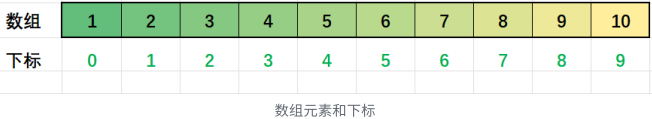

在C语⾔中数组的访问提供了⼀个操作符 [] ，这个操作符叫：**下标引⽤操作符**。

有了下标访问操作符，我们就可以轻松的访问到数组的元素了，⽐如我们访问下标为7的元素，我们就可以使⽤ arr[7] ，想要访问下标是3的元素，就可以使⽤ arr[3] ,如下代码：

```c
int arr[10] = { 1,2,3,4,5,6,7,8,9,10 };
printf("%d\n", arr[7]); // 8
printf("%d\n", arr[3]); // 4
```

### 02. 数组元素的打印

接下来，如果想要访问整个数组的内容，那怎么办呢？只要我们产⽣数组所有元素的下标就可以了，那我们使⽤for循环产⽣0~9的下标，接下来使⽤下标访问就⾏了。

如下代码：

```c
int arr[10] = { 1,2,3,4,5,6,7,8,9,10 };
for (int i = 0; i < 10; i++) {
	printf("%d ", arr[i]);
}
// output: 1 2 3 4 5 6 7 8 9 10
```

### 03. 数组的输入

明⽩了数组的访问，当然我们也根据需求，⾃⼰给数组输⼊想要的数据，如下：

```c
int arr[10];
for (int i = 0; i < 10; i++) 
	scanf("%d", &arr[i]);
for (int i = 0; i < 10; i++) 
	printf("%d ", arr[i]);
```


## 四. 一维数组在内存中的存储

有了前⾯的知识，我们其实使⽤数组基本没有什么障碍了，如果我们要深⼊了解数组，我们最好能了解⼀下数组在内存中的存储。

依次打印数组元素的地址：

```c
int arr[10];
for (int i = 0; i < 10; i++)
  // %p 打印地址是16进制形式，且开头的0不会省略
  // %x 打印是16进制形式，但开头0会省略
	printf("&arr[%d] = %p\n", i, &arr[i]);
```

输出结果：

```c
// x64 - 64位环境
/*
  &arr[0] = 000000ACD873FAE8
	& arr[1] = 000000ACD873FAEC
	& arr[2] = 000000ACD873FAF0
	& arr[3] = 000000ACD873FAF4
	& arr[4] = 000000ACD873FAF8
	& arr[5] = 000000ACD873FAFC
	& arr[6] = 000000ACD873FB00
	& arr[7] = 000000ACD873FB04
	& arr[8] = 000000ACD873FB08
	& arr[9] = 000000ACD873FB0C
*/

// 32位环境输出(地址短一些)
/*
	&arr[0] = 00BEFD6C
	& arr[1] = 00BEFD70
	& arr[2] = 00BEFD74
	& arr[3] = 00BEFD78
	& arr[4] = 00BEFD7C
	& arr[5] = 00BEFD80
	& arr[6] = 00BEFD84
	& arr[7] = 00BEFD88
	& arr[8] = 00BEFD8C
	& arr[9] = 00BEFD90
*/
```

从输出的结果我们分析，数组随着下标的增⻓，地址是由⼩到⼤变化的，并且我们发现每两个相邻的元素之间相差4（因为数据类型是⼀个整型（4个字节））。所以我们得出结论：数组在内存中是连续存放的。这就为后期我们使⽤指针访问数组奠定了基础（在讲指针的时候我们在再讲，这⾥暂且记住就⾏）。

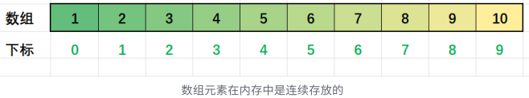


## 五. sizeof 计算数组元素个数

在遍历数组的时候，我们经常想知道数组的元素个数，那C语⾔中有办法使⽤程序计算数组元素个数吗？

答案是有的，可以使⽤sizeof。

sizeof 中C语⾔是⼀个关键字，是可以**计算类型或变量⼤⼩的**，其实 sizeof **也可以计算数组的⼤⼩**。

⽐如：

```c
int arr[10] = {0};
printf("%d\n", sizeof(arr)); // 40
```

这⾥输出的结果是40，计算的是数组所占内存空间的总⼤⼩，单位是字节。

我们⼜知道数组中所有元素的类型都是相同的，那只要计算出⼀个元素所占字节的个数，数组的元素个数就能算出来。这⾥我们选择第⼀个元素算大小就可以。

```c
int arr[10] = {0};
printf("%d\n", sizeof(arr[0])); // 计算⼀个元素的⼤⼩，单位是字节
```

接下来就能计算出数组的元素个数：

```c
int arr[10] = {0};
int sz = sizeof(arr) / sizeof(arr[0]);
printf("%d\n", sz); // 10
```

这⾥的结果是：10，表⽰数组有10个元素。

以后在代码中需要数组元素个数的地⽅就不⽤固定写死了，使⽤上⾯的计算，不管数组怎么变化，计算出的⼤⼩也就随着变化了。

```c
int arr[10] = {1};
printf("arr数组所占大小（单位：字节）：%zd\n", sizeof(arr));
printf("数组中单个元素所占大小：%zd\n", sizeof(arr[0]));
printf("数组元素个数：%d\n", sizeof(arr) / sizeof(arr[0]));
// output:
// arr数组所占大小（单位：字节）：40
// 数组中单个元素所占大小：4
// 数组元素个数：10
printf("%zd\n", sizeof(int[10])); // 40
```


## 六. 二维数组的创建

### 01. 二维数组的概念

前⾯学习的数组被称为⼀维数组，数组的元素都是内置类型的，如果我们把⼀维数组做为数组的元素，这时候就是⼆维数组，⼆维数组作为数组元素的数组被称为三维数组，⼆维数组以上的数组统称为多维数组。


### 02. 二维数组的创建

那我们如何定义⼆维数组呢？语法如下：

```c
type arr_name[行数常量值][列数常量值];

// 例如：
int arr[3][5];
int data[2][8];
```

解释：上述代码中出现的信息

- 3表⽰数组有3行
- 5表⽰每⼀⾏有5个元素
- int 表⽰数组的每个元素是整型类型
- arr 是数组名，可以根据⾃⼰的需要指定名字

data数组意思基本⼀致。

### 03. 二维数组的初始化

在创建变量或者数组的时候，给定⼀些初始值，被称为初始化。那⼆维数组如何初始化呢？像⼀维数组⼀样，也是使⽤⼤括号初始化的。

1. 不完全初始化

   ```c
   // 剩余的元素默认初始化为0
   int arr1[3][5] = {1,2};
   int arr2[3][5] = {0};
   ```

   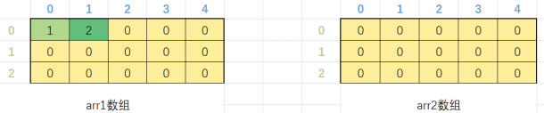

2. 完全初始化

   ```c
   int arr3[3][5] = {1,2,3,4,5, 2,3,4,5,6, 3,4,5,6,7};
   ```

   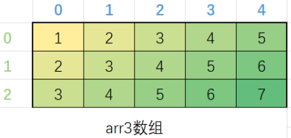

3. 按照⾏初始化

   ```c
   int arr4[3][5] = { {1,2}, {3,4}, {5,6} };
   ```

   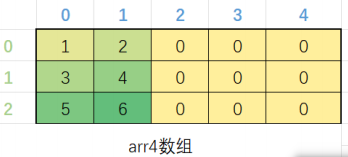

4. 初始化时省略行，但是不能省略列

   ```c
   int arr5[][5] = { 1,2,3 };
   int arr6[][5] = { 1,2,3,4,5,6,7 };
   int arr7[][5] = { {1,2}, {3,4}, {5,6} };
   ```

   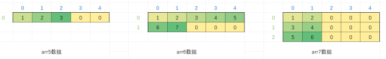


## 七. 二维数组的使用

### 01. 二维数组的下标

当我们掌握了⼆维数组的创建和初始化，那我们怎么使⽤⼆维数组呢？

其实⼆维数组访问也是使⽤下标的形式的，⼆维数组是有⾏和列的，只要锁定了⾏和列就能唯⼀锁定数组中的⼀个元素。

C语⾔规定，⼆维数组的⾏是从0开始的，列也是从0开始的，如下所⽰：

```c
int arr[3][5] = {1,2,3,4,5, 2,3,4,5,6, 3,4,5,6,7};
```

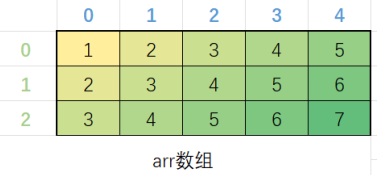

图中最左侧绿⾊的数字表⽰⾏号，第⼀⾏蓝⾊的数字表⽰列号，都是从0开始的，⽐如，我们说：第2⾏，第4列，快速就能定位出7。

```c
int arr[3][5] = {1,2,3,4,5, 2,3,4,5,6, 3,4,5,6,7};
 printf("%d\n", arr[2][4]); // 7
```

### 02. 二维数组的输入和输出

访问⼆维数组的单个元素我们知道了，那如何访问整个⼆维数组呢？

其实我们只要能够按照⼀定的规律产⽣所有的⾏和列的数字就⾏；以上⼀段代码中的arr数组为例，行的选择范围是0~2，列的取值范围是0~4，所以我们可以借助循环实现⽣成所有的下标。

```c
int arr[3][5] = {1,2,3,4,5, 2,3,4,5,6, 3,4,5,6,7};
for (int i = 0; i < 3; i++) { // 行号
	for (int j = 0; j < 5; j++) { // 列号
		scanf("%d", &arr[i][j]); // 输入数据
	}
}
printf("开始输出result：\n");
for (int i = 0; i < 3; i++) {
	for (int j = 0; j < 5; j++) {
		printf("%d ", arr[i][j]);
	}
	printf("\n");
}
```

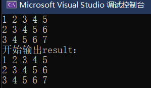


## 八. 二维数组在内存中的存储

像⼀维数组⼀样，我们如果想研究⼆维数组在内存中的存储⽅式，我们也是可以打印出数组所有元素的地址的。代码如下：

```c
int arr[3][5] = { 0 };
for (int i = 0; i < 3; i++)
	for (int j = 0; j < 5; j++)
		printf("&arr[%d][%d] = %p\n", i, j, &arr[i][j]);
```

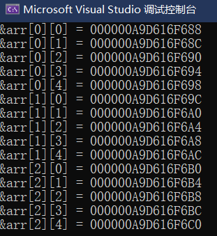

从输出的结果来看，每⼀⾏内部的每个元素都是相邻的，地址之间相差4个字节，跨⾏位置处的两个元素（如：arr[0][4]和arr[1][0]）之间也是差4个字节，所以**⼆维数组中的每个元素都是连续存放的**。

如下图所⽰：

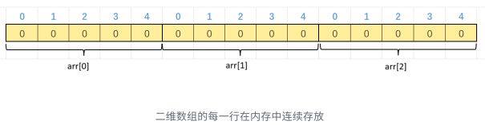

了解清楚⼆维数组在内存中的布局，有利于我们后期使⽤指针来访问数组的学习。


## 九. C99中的变长数组

在C99标准之前，C语⾔在创建数组的时候，数组⼤⼩的指定只能使⽤常量、常量表达式，或者如果我们初始化数据的话，可以省略数组⼤⼩。

```c
int arr1[10];
int arr2[3+5];
int arr3[] = { 1,2,3 };
```

这样的语法限制，让我们创建数组就不够灵活，有时候数组⼤了浪费空间，有时候数组⼜小了不够⽤的。

**C99中新增**了⼀个**变长数组**（variable-length array，简称 VLA）的新特性，允许我们可以使⽤变量指定数组⼤⼩。

请看下⾯的代码：

```c
int n = a+b;
int arr[n];
```

上⾯⽰例中，数组 arr 就是变⻓数组，因为它的⻓度取决于变量 n 的值，编译器没法事先确定，只有运⾏时才能知道 n 是多少。

变⻓数组的根本特征，就是数组⻓度只有运⾏时才能确定，所以变⻓数组不能初始化。它的好处是程序员不必在开发时，随意为数组指定⼀个估计的⻓度，程序可以在运⾏时为数组分配精确的⻓度。有⼀个⽐较迷惑的点，变⻓数组的意思是数组的⼤⼩是可以使⽤变量来指定的，在程序运⾏的时候，根据变量的⼤⼩来指定数组的元素个数，⽽不是说数组的⼤⼩是可变的。数组的⼤⼩⼀旦确定就不能再变。

遗憾的是在VS2022上，虽然⽀持⼤部分C99的语法，没有⽀持C99中的变⻓数组，没法测试；下⾯是在gcc编译器上测试，可以看⼀下。

```c
int n = 0;
scanf("%d", &n); // 根据输⼊数值确定数组的⼤⼩
int arr[n];
for (int i = 0; i < n; i++) 
	scanf("%d", &arr[i]);
for (i = 0; i < n; i++) 
	printf("%d ", arr[i]);
```

第⼀次测试，我给n中输⼊5，然后输⼊5个数字在数组中，并正常输出，第⼆次测试，我给n中输⼊10，然后输⼊10个数字在数组中，并正常输出。

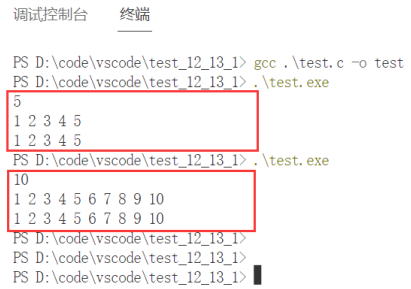

> 总结：
>
> - 变长数组：本质就是**数组长度由变量的大小决定**。
> - **数组大小不是可变的，一旦确定就无法在改变**。
> - vs2022不支持变长数组
>
> - 


## 十. 数组练习

### 01. 多个字符从两端移动，向中间汇聚

编写代码，演⽰多个字符从两端移动，向中间汇聚

```c
#include <stdio.h>
#include <stdlib.h>
#include <Windows.h>
init main() {
  char arr1[] = "welcome to bit...";
  char arr2[] = "#################";
  int left = 0;
  int right = strlen(arr1) - 1;
  // 如果用sizeof 获取数组长度，是会将字符串尾部的\0也统计进去，就需要对结果 - 2。
  // strlen 不会包含\0。
  printf("%s\n", arr2);
  while (left <= right) {
    arr2[left] = arr1[left];
    arr2[right] = arr1[right];
    left++;
    right--;
    system("cls");
    printf("%s\n", arr2);
    Sleep(200);
  }
  return 0;
}
```

### 02. 二分查找(折半查找)

在⼀个**升序的**数组中查找指定的数字n，很容易想到的⽅法就是遍历数组，但是这种⽅法效率⽐较低。⽐如我买了⼀双鞋，你好奇问我多少钱，我说不超过300元。你还是好奇，你想知道到底多少，我就让你猜，你会怎么猜？你会1，2，3，4...这样猜吗？显然很慢；⼀般你都会猜中间数字，⽐如：150，然后看⼤了还是⼩了，这就是**⼆分查找**，**也叫 折半查找**。

```c
#include <stdio.h>
int main() {
	int arr[] = { 1,2,3,4,5,6,7,8,9,10 };
	int left = 0;
	int right = sizeof(arr) / sizeof(arr[0] - 1);
	int key = 7; // 要找的数字
	int mid = 0; // 记录中间元素的下标
	int find = 0;
	while (left <= right) {
		mid = (left + right) / 2;
		if (arr[mid] > key) {
			right = mid - 1;
		} 
		else 
		if (arr[mid < key]) {
			left = mid + 1;
		}	
		else {
			printf("查找到了，下标是%d\n", mid);
			break;
		}
	}
	if (left > right)printf("找不到了\n");
}
```

求中间元素的下标，使⽤ mid = (left+right)/2 ，如果left和right⽐较⼤的时候可能存在问题，可以使⽤下⾯的⽅式：

```c
mid = left+(right-left)/2;
```

