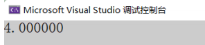
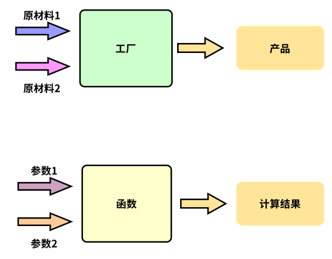
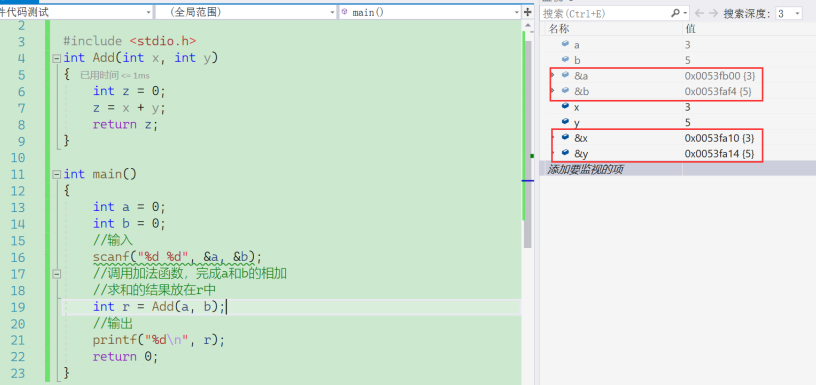

## 一. 函数的概念

数学中我们其实就⻅过函数的概念，⽐如：⼀次函数 y=kx+b ，k和b都是常数，给⼀个任意的x，就得到⼀个y值。

其实在C语⾔也引⼊函数（function）的概念，有些翻译为：⼦程序，⼦程序这种翻译更加准确⼀些。

C语⾔中的函数就是⼀个完成某项特定的任务的⼀⼩段代码。这段代码是有特殊的写法和调⽤⽅法的。

C语⾔的程序其实是由⽆数个⼩的函数组合⽽成的，也可以说：⼀个⼤的计算任务可以分解成若⼲个较⼩的函数（对应较⼩的任务）完成。同时⼀个函数如果能完成某项特定任务的话，这个函数也是可以复⽤的，提升了开发软件的效率。

在C语⾔中我们⼀般会⻅到两类函数：

- 库函数
- ⾃定义函数


## 二. 库函数

### 01. 标准库和头文件

C语⾔标准中规定了C语⾔的各种语法规则，C语⾔并不提供库函数；C语⾔的国际标准ANSI C规定了⼀些常⽤的函数的标准，被称为标准库，那不同的编译器⼚商根据ANSI提供的C语⾔标准就给出了⼀系列函数的实现。这些函数就被称为库函数。

我们前⾯内容中学到的 printf 、 scanf 都是库函数，库函数也是函数，不过这些函数已经是现成的，我们只要学会就能直接使⽤了。有了库函数，⼀些常⻅的功能就不需要程序员⾃⼰实现了，⼀定程度提升了效率；同时库函数的质量和执⾏效率上都更有保证。

各种编译器的标准库中提供了⼀系列的库函数，这些库函数根据功能的划分，都在不同的头⽂件中进⾏了声明。

库函数相关头⽂件：https://zh.cppreference.com/w/c/header

有数学相关的，有字符串相关的，有⽇期相关的等，每⼀个头⽂件中都包含了，相关的函数和类型等信息，库函数的学习不⽤着急⼀次性全部学会，慢慢学习，各个击破就⾏。


### 02. 库函数的使用方法

库函数的学习和查看⼯具很多，⽐如：

C/C++官⽅的链接：https://zh.cppreference.com/w/c/header

cplusplus.com：https://legacy.cplusplus.com/reference/clibrary/

举例：sqrt

```c
double sqrt (double x);
// sqrt 是函数名
// x 是函数的参数，表⽰调⽤sqrt函数需要传递⼀个double类型的值
// double 是返回值类型 - 表⽰函数计算的结果是double类型的值
```

- 功能

  Compute square root 计算平⽅根

  Returns the *square root* of x.（返回平⽅根）

- 头文件包含

  库函数是在标准库中对应的头⽂件中声明的，所以库函数的使⽤，务必包含对应的头⽂件，不包含是可能会出现⼀些问题的。

- 实践

  ```c
  #include <stdio.h>
  #include <math.h>
  
  int main() {
   double d = 16.0;
   double r = sqrt(d);
   printf("%lf\n", r);
   return 0;
  }
  ```

- 运⾏结果：

  

- 库函数文档的一般格式
  1. 函数原型
  2. 函数功能介绍
  3. 参数和返回类型说明
  4. 代码举例
  5. 代码输出
  6. 相关知识链接

### 03. 自定义函数

了解了库函数，我们的关注度应该聚焦在⾃定义函数上，⾃定义函数其实更加重要，也能给程序员写代码更多的创造性。

- 函数的语法形式

  其实自定义函数和库函数是一样的，形式如下：

  ```c
  ret_type fun_name(形式参数) {
    
  }
  ```

  - ret_type：函数返回类型
  - fun_name：函数名
  - 括号中放的是函数形参
  - {}括起来的是函数体

  

  - 我们可以把函数想象成⼩型的⼀个加⼯⼚，⼯⼚得输⼊原材料，经过⼯⼚加⼯才能⽣产出产品，那函数也是⼀样的，函数⼀般会输⼊⼀些值（可以是0个，也可以是多个），经过函数内的计算，得出结果。

  - ret_type 是⽤来表⽰函数计算结果的类型，有时候返回类型可以是 void ，表⽰什么都不返回。

  - fun_name 是为了⽅便使⽤函数；就像⼈的名字⼀样，有了名字⽅便称呼，函数有了名字⽅便调⽤，所以函数名尽量要根据函数的功能起的有意义。

  - 函数的参数就相当于，⼯⼚中送进去的原材料，函数的参数也可以是 void ，明确表⽰函数没有参数。如果有参数，要交代清楚参数的类型和名字，以及参数个数。

  - {}括起来的部分被称为函数体，函数体就是完成计算的过程。

- 函数的举例

  举个例⼦：

  写⼀个加法函数，完成2个整型变量的加法操作。

  ```c
  #include <stdio.h>
  int main() {
    int a = 0;
    int b = 0;
    //输⼊
    scanf("%d %d", &a, &b);
    //调⽤加法函数，完成a和b的相加
    //求和的结果放在r中
    //to do
  
    //输出
    printf("%d\n", r);
    return 0;
  }
  ```

  我们根据要完成的功能，给函数取名：Add，函数Add需要接收2个整型类型的参数，函数计算的结果也是整型。

  所以我们根据上述的分析写出函数：

  ```c
  #include <stdio.h>
  int Add(int x, int y) {
    int z = 0;
    z = x+y;
    return z;
  }
  int main() {
    int a = 0;
    int b = 0;
    //输⼊
    scanf("%d %d", &a, &b);
    //调⽤加法函数，完成a和b的相加
    //求和的结果放在r中
    int r = Add(a, b);
    //输出
    printf("%d\n", r);
    return 0;
  }
  ```

  Add函数可以简化为：

  ```c
  int Add(int x, int y) {
    return x + y;
  }
  ```

  函数的参数部分需要交代清楚：参数个数，每个参数的类型是啥，形参的名字叫啥。上⾯只是⼀个例⼦，未来我们是根据实际需要来设计函数，函数名、参数、返回类型都是可以灵活变化的。

### 04. 形参和实参

在函数使⽤的过程中，把函数的参数分为，实参和形参。

再看看我们前⾯写的代码：

```c
#include <stdio.h>
int Add(int x, int y) {
  int z = 0;
  z = x+y;
  return z;
}

int main() {
  int a = 0;
  int b = 0;
  //输⼊
  scanf("%d %d", &a, &b);
  //调⽤加法函数，完成a和b的相加
  //求和的结果放在r中
  int r = Add(a, b);
  //输出
  printf("%d\n", r);
  return 0;
}
```

- 实参

  在上⾯代码中，第2~7⾏是 Add 函数的定义，有了函数后，再第17⾏调⽤Add函数的。

  我们把第17⾏调⽤Add函数时，传递给函数的参数a和b，称为实际参数，简称实参。

  实际参数就是真实传递给函数的参数。

- 形参

  在上⾯代码中，第2⾏定义函数的时候，在函数名 Add 后的括号中写的 x 和 y ，称为形式参数，简称形参。

  为什么叫形式参数呢？实际上，如果只是定义了 Add 函数，⽽不去调⽤的话， Add 函数的参数 x和 y 只是形式上存在的，不会向内存申请空间，不会真实存在的，所以叫形式参数。**形式参数只有在函数被调⽤的过程中为了存放实参传递过来的值，才向内存申请空间**，这个**过程**就是**形参的实例化**。

- 实参和形参的关系

  虽然我们提到了实参是传递给形参的，他们之间是有联系的，但是形参和实参各⾃是独⽴的内存空间。

  这个现象是可以通过调试来观察的。请看下⾯的代码和调试演⽰:

  ```c
  #include <stdio.h>
  int Add(int x, int y) {
    int z = 0;
    z = x + y;
    return z;
  }
  
  int main() {
    int a = 0;
    int b = 0;
    //输⼊
    scanf("%d %d", &a, &b);
    //调⽤加法函数，完成a和b的相加
    //求和的结果放在r中
    int r = Add(a, b);
    //输出
    printf("%d\n", r);
    return 0;
  }
  ```

  

​	我们在调试的时候可以观察到，x和y确实得到了a和b的值，但是x和y的地址和a和b的地址是不⼀样的，所以我们可以理解为**形参是实参的⼀份临时拷⻉**。