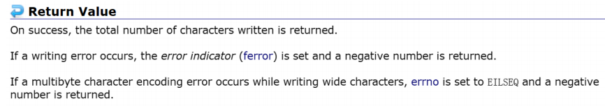
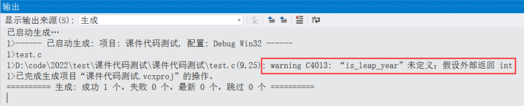
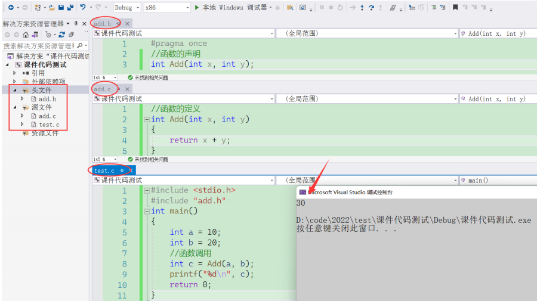

## 一. 函数的概念

数学中我们其实就⻅过函数的概念，⽐如：⼀次函数 y=kx+b ，k和b都是常数，给⼀个任意的x，就得到⼀个y值。

其实在C语⾔也引⼊函数（function）的概念，有些翻译为：⼦程序，⼦程序这种翻译更加准确⼀些。

C语⾔中的函数就是⼀个完成某项特定的任务的⼀⼩段代码。这段代码是有特殊的写法和调⽤⽅法的。

C语⾔的程序其实是由⽆数个⼩的函数组合⽽成的，也可以说：⼀个⼤的计算任务可以分解成若⼲个较⼩的函数（对应较⼩的任务）完成。同时⼀个函数如果能完成某项特定任务的话，这个函数也是可以复⽤的，提升了开发软件的效率。

在C语⾔中我们⼀般会⻅到两类函数：

- 库函数
- ⾃定义函数


## 二. 库函数

### 01. 标准库和头文件

C语⾔标准中规定了C语⾔的各种语法规则，C语⾔并不提供库函数；C语⾔的国际标准ANSI C规定了⼀些常⽤的函数的标准，被称为标准库，那不同的编译器⼚商根据ANSI提供的C语⾔标准就给出了⼀系列函数的实现。这些函数就被称为库函数。

我们前⾯内容中学到的 printf 、 scanf 都是库函数，库函数也是函数，不过这些函数已经是现成的，我们只要学会就能直接使⽤了。有了库函数，⼀些常⻅的功能就不需要程序员⾃⼰实现了，⼀定程度提升了效率；同时库函数的质量和执⾏效率上都更有保证。

各种编译器的标准库中提供了⼀系列的库函数，这些库函数根据功能的划分，都在不同的头⽂件中进⾏了声明。

库函数相关头⽂件：https://zh.cppreference.com/w/c/header

有数学相关的，有字符串相关的，有⽇期相关的等，每⼀个头⽂件中都包含了，相关的函数和类型等信息，库函数的学习不⽤着急⼀次性全部学会，慢慢学习，各个击破就⾏。


### 02. 库函数的使用方法

库函数的学习和查看⼯具很多，⽐如：

C/C++官⽅的链接：https://zh.cppreference.com/w/c/header

cplusplus.com：https://legacy.cplusplus.com/reference/clibrary/

举例：sqrt

```c
double sqrt (double x);
// sqrt 是函数名
// x 是函数的参数，表⽰调⽤sqrt函数需要传递⼀个double类型的值
// double 是返回值类型 - 表⽰函数计算的结果是double类型的值
```

- 功能

  Compute square root 计算平⽅根

  Returns the *square root* of x.（返回平⽅根）

- 头文件包含

  库函数是在标准库中对应的头⽂件中声明的，所以库函数的使⽤，务必包含对应的头⽂件，不包含是可能会出现⼀些问题的。

- 实践

  ```c
  #include <stdio.h>
  #include <math.h>
  
  int main() {
   double d = 16.0;
   double r = sqrt(d);
   printf("%lf\n", r);
   return 0;
  }
  ```

- 运⾏结果：

  

- 库函数文档的一般格式
  1. 函数原型
  2. 函数功能介绍
  3. 参数和返回类型说明
  4. 代码举例
  5. 代码输出
  6. 相关知识链接


## 三. 自定义函数

了解了库函数，我们的关注度应该聚焦在⾃定义函数上，⾃定义函数其实更加重要，也能给程序员写代码更多的创造性。

### 01. 函数的语法形式

其实自定义函数和库函数是一样的，形式如下：

```c
ret_type fun_name(形式参数) {
  
}
```

- ret_type：函数返回类型
- fun_name：函数名
- 括号中放的是函数形参
- {}括起来的是函数体


- 我们可以把函数想象成⼩型的⼀个加⼯⼚，⼯⼚得输⼊原材料，经过⼯⼚加⼯才能⽣产出产品，那函数也是⼀样的，函数⼀般会输⼊⼀些值（可以是0个，也可以是多个），经过函数内的计算，得出结果。

- ret_type 是⽤来表⽰函数计算结果的类型，有时候返回类型可以是 void ，表⽰什么都不返回。

- fun_name 是为了⽅便使⽤函数；就像⼈的名字⼀样，有了名字⽅便称呼，函数有了名字⽅便调⽤，所以函数名尽量要根据函数的功能起的有意义。

- 函数的参数就相当于，⼯⼚中送进去的原材料，函数的参数也可以是 void ，明确表⽰函数没有参数。如果有参数，要交代清楚参数的类型和名字，以及参数个数。

- {}括起来的部分被称为函数体，函数体就是完成计算的过程。

### 02. 函数的举例

举个例⼦：

写⼀个加法函数，完成2个整型变量的加法操作。

```c
#include <stdio.h>
int main() {
  int a = 0;
  int b = 0;
  //输⼊
  scanf("%d %d", &a, &b);
  //调⽤加法函数，完成a和b的相加
  //求和的结果放在r中
  //to do

  //输出
  printf("%d\n", r);
  return 0;
}
```

我们根据要完成的功能，给函数取名：Add，函数Add需要接收2个整型类型的参数，函数计算的结果也是整型。

所以我们根据上述的分析写出函数：

```c
#include <stdio.h>
int Add(int x, int y) {
  int z = 0;
  z = x+y;
  return z;
}
int main() {
  int a = 0;
  int b = 0;
  //输⼊
  scanf("%d %d", &a, &b);
  //调⽤加法函数，完成a和b的相加
  //求和的结果放在r中
  int r = Add(a, b);
  //输出
  printf("%d\n", r);
  return 0;
}
```

Add函数可以简化为：

```c
int Add(int x, int y) {
  return x + y;
}
```

函数的参数部分需要交代清楚：参数个数，每个参数的类型是啥，形参的名字叫啥。上⾯只是⼀个例⼦，未来我们是根据实际需要来设计函数，函数名、参数、返回类型都是可以灵活变化的。


## 四. 形参和实参

在函数使⽤的过程中，把函数的参数分为，实参和形参。

再看看我们前⾯写的代码：

```c
#include <stdio.h>
int Add(int x, int y) {
  int z = 0;
  z = x+y;
  return z;
}

int main() {
  int a = 0;
  int b = 0;
  //输⼊
  scanf("%d %d", &a, &b);
  //调⽤加法函数，完成a和b的相加
  //求和的结果放在r中
  int r = Add(a, b);
  //输出
  printf("%d\n", r);
  return 0;
}
```

### 01. 实参

在上⾯代码中，第2~7⾏是 Add 函数的定义，有了函数后，再第17⾏调⽤Add函数的。

我们把第17⾏调⽤Add函数时，传递给函数的参数a和b，称为实际参数，简称实参。

实际参数就是真实传递给函数的参数。

### 02. 形参

在上⾯代码中，第2⾏定义函数的时候，在函数名 Add 后的括号中写的 x 和 y ，称为形式参数，简称形参。

为什么叫形式参数呢？实际上，如果只是定义了 Add 函数，⽽不去调⽤的话， Add 函数的参数 x和 y 只是形式上存在的，不会向内存申请空间，不会真实存在的，所以叫形式参数。**形式参数只有在函数被调⽤的过程中为了存放实参传递过来的值，才向内存申请空间**，这个**过程**就是**形参的实例化**。

### 03. 实参和形参的关系

虽然我们提到了实参是传递给形参的，他们之间是有联系的，但是形参和实参各⾃是独⽴的内存空间。

这个现象是可以通过调试来观察的。请看下⾯的代码和调试演⽰:

```c
#include <stdio.h>
int Add(int x, int y) {
  int z = 0;
  z = x + y;
  return z;
}

int main() {
  int a = 0;
  int b = 0;
  //输⼊
  scanf("%d %d", &a, &b);
  //调⽤加法函数，完成a和b的相加
  //求和的结果放在r中
  int r = Add(a, b);
  //输出
  printf("%d\n", r);
  return 0;
}
```


​	我们在调试的时候可以观察到，x和y确实得到了a和b的值，但是x和y的地址和a和b的地址是不⼀样的，所以我们可以理解为**形参是实参的⼀份临时拷⻉**。


## 五. return 语句

在函数的设计中，函数中经常会出现return语句，这⾥讲⼀下return语句使⽤的注意事项。

- return后边可以是⼀个数值，也可以是⼀个表达式，如果是表达式则先执⾏表达式，再返回表达式的结果。
- return后边也可以什么都没有，直接写 return; 这种写法适合函数返回类型是void的情况。
- return返回的值和函数返回类型不⼀致，系统会⾃动将返回的值隐式转换为函数的返回类型。
- return语句执⾏后，函数就彻底返回，后边的代码不再执⾏。
- 如果函数中存在if等分⽀的语句，则要保证每种情况下都有return返回，否则会出现编译错误。


## 六. 数组做函数参数

在使⽤函数解决问题的时候，难免会将数组作为参数传递给函数，在函数内部对数组进⾏操作。⽐如：写⼀个函数对将⼀个整型数组的内容，全部置为-1，再写⼀个函数打印数组的内容。

简单思考⼀下，基本的形式应该是这样的：

```c
#include <stdio.h>
int main() {
  int arr[] = {1, 2, 3, 4, 5, 6, 7, 8, 9, 10};
  set_arr();
  print_arr();
  return 0;
}
```

这⾥的set_arr函数要能够对数组内容进⾏设置，就得把数组作为参数传递给函数，同时函数内部在设置数组每个元素的时候，也得遍历数组，需要知道数组的元素个数。所以我们需要给set_arr传递2个参数，⼀个是数组，另外⼀个是数组的元素个数。仔细分析print_arr也是⼀样的，只有拿到了数组和元素个数，才能遍历打印数组的每个元素。

```c
#include <stdio.h>
int main() {
  int arr[] = {1,2,3,4,5,6,7,8,9,10};
  int sz = sizeof(arr)/sizeof(arr[0]);
  set_arr(arr, sz);//设置数组内容为-1
  print_arr(arr, sz);//打印数组内容
  return 0;
}
```

数组作为参数传递给了set_arr 和 print_arr 函数了，那这两个函数应该如何设计呢？

这⾥我们需要知道数组传参的⼏个重点知识：

- 函数的形式参数要和函数的实参个数匹配
- 函数的实参是数组，形参也是可以写成数组形式的
- 形参如果是⼀维数组，数组⼤⼩可以省略不写
- 形参如果是⼆维数组，⾏可以省略，但是列不能省略
- 数组传参，形参是不会创建新的数组的
- 形参操作的数组和实参的数组是同⼀个数组

根据上述的信息，我们就可以实现这两个函数：

```c
void set_arr(int arr[], int sz) {
  int i = 0;
  for (i=0; i<sz; i++) {
    arr[i] = -1;
  }
}
void print_arr(int arr[], int sz) {
  int i = 0;
  for (i=0; i<sz; i++) {
    printf("%d ", arr[i]);
  }
  printf("\n");
}
```


## 七. 嵌套调用和链式访问

### 01. 嵌套调用

嵌套调⽤就是函数之间的互相调⽤，每个函数就⾏⼀个乐⾼零件，正是因为多个乐⾼的零件互相⽆缝的配合才能搭建出精美的乐⾼玩具，也正是因为函数之间有效的互相调⽤，最后写出来了相对⼤型的程序。

假设我们计算某年某⽉有多少天？如果要函数实现，可以设计2个函数:

- is_leap_year()：根据年份确定是否是闰年
- get_days_of_month()：调⽤is_leap_year确定是否是闰年后，再根据⽉计算这个⽉的天数

```c
int is_leap_year(int y) {
  if(((y%4==0)&&(y%100!=0))||(y%400==0))
    return 1;
  else
    return 0;
}

int get_days_of_month(int y, int m) {
  int days[] = {0, 31, 28, 31, 30, 31, 30, 31, 31, 30, 31, 30, 31};
  int day = days[m];
  if (is_leap_year(y) && m == 2)
    day += 1;

  return day;
}

int main() {
  int y = 0;
  int m = 0;
  scanf("%d %d", &y, &m);
  int d = get_days_of_month(y, m);
  printf("%d\n", d);
  return 0;
}
```

这⼀段代码，完成了⼀个独⽴的功能。代码中反应了不少的函数调⽤：

- main 函数调⽤ scanf 、 printf 、 get_days_of_month
- get_days_of_month 函数调⽤ is_leap_year

未来的稍微⼤⼀些代码都是函数之间的嵌套调⽤，但是函数是不能嵌套定义的。

### 02. 链式访问

所谓链式访问就是将⼀个函数的返回值作为另外⼀个函数的参数，像链条⼀样将函数串起来就是函数的链式访问。

⽐如：

```c
#include <stdio.h>
int main() {
  int len = strlen("abcdef"); // 1.strlen求⼀个字符串的⻓度
  printf("%d\n", len); // 2.打印⻓度 
  return 0;
}
```

前⾯的代码完成动作写了2条语句，把如果把strlen的返回值直接作为printf函数的参数呢？这样就是⼀个链式访问的例⼦了。

```c
#include <stdio.h>
int main() {
  printf("%d\n", strlen("abcdef")); // 链式访问
  return 0;
}
```

在看⼀个有趣的代码，下⾯代码执⾏的结果是什么呢？

```c
#include <stdio.h>
int main() {
  printf("%d", printf("%d", printf("%d", 43)));
  return 0;
}
```

这个代码的关键是明⽩ printf 函数的返回是啥？

```c
int printf ( const char * format, ... );
```



printf函数返回的是打印在屏幕上的字符的个数。

上⾯的例⼦中，我们就第⼀个printf打印的是第⼆个printf的返回值，第⼆个printf打印的是第三个printf的返回值。

第三个printf打印43，在屏幕上打印2个字符，再返回2

第⼆个printf打印2，在屏幕上打印1个字符，再放回1

第⼀个printf打印1

所以屏幕上最终打印：4321


## 八. 函数的声明和定义

### 01. 单个文件

⼀般我们在使⽤函数的时候，直接将函数写出来就使⽤了。

⽐如：我们要写⼀个函数判断⼀年是否是闰年。

```c
#include <stido.h>
// 判断⼀年是不是闰年
int is_leap_year(int y) { // 1.函数定义
  if (((y%4==0)&&(y%100!=0)) || (y%400==0))
    return 1;
  else
    return 0;
}

int main() {
  int y = 0;
  scanf("%d", &y);
  int r = is_leap_year(y); // 2.函数调用
  if(r == 1)
    printf("闰年\n");
  else
    printf("⾮闰年\n");
  return 0;
}
```

上⾯代码中1的部分是函数的定义，2部分是函数的调⽤。

这种场景下是函数的定义在函数调⽤之前，没啥问题。

那如果我们将函数的定义放在函数的调⽤后边，如下：

```c
#include <stido.h>
int main() {
  int y = 0;
  scanf("%d", &y);
  int r = is_leap_year(y); // 2.函数调用
  if(r == 1)
    printf("闰年\n");
  else
    printf("⾮闰年\n");
  return 0;
}

// 判断⼀年是不是闰年
int is_leap_year(int y) { // 1.函数定义
  if (((y%4==0)&&(y%100!=0)) || (y%400==0))
    return 1;
  else
    return 0;
}
```

这个代码在VS2022上编译，会出现下⾯的警告信息：



这是因为C语⾔编译器对源代码进⾏编译的时候，从第⼀⾏往下扫描的，当遇到第7⾏的is_leap_year函数调⽤的时候，并没有发现前⾯有is_leap_year的定义，就报出了上述的警告。

该怎么解决这个问题呢？就是函数调⽤之前先声明⼀下is_leap_year这个函数，声明函数只要交代清楚：函数名，函数的返回类型和函数的参数。

如：int is_leap_year(int y)；这就是函数声明，函数声明中参数只保留类型，省略掉名字也是可以的。

代码变成这样就能正常编译了。

```c
#include <stido.h>

int is_leap_year(int y); // 函数声明

int main() {
  int y = 0;
  scanf("%d", &y);
  int r = is_leap_year(y); // 2.函数调用
  if(r == 1)
    printf("闰年\n");
  else
    printf("⾮闰年\n");
  return 0;
}

// 判断⼀年是不是闰年
int is_leap_year(int y) { // 1.函数定义
  if (((y%4==0)&&(y%100!=0)) || (y%400==0))
    return 1;
  else
    return 0;
}
```

函数的调⽤⼀定要满⾜，先声明后使⽤；

函数的定义也是⼀种特殊的声明，所以如果函数定义放在调⽤之前也是可以的。

### 02. 多个文件

⼀般在企业中我们写代码时候，代码可能⽐较多，不会将所有的代码都放在⼀个⽂件中；我们往往会

根据程序的功能，将代码拆分放在多个⽂件中。

**⼀般情况下，函数的声明、类型的声明放在头⽂件（.h）中，函数的实现是放在源⽂件（.c）⽂件中。**

如下：

```c
// add.c
// 函数的定义
int Add(int x, int y) {
  return x + y;
}
```

```c
// add.h
// 函数的声明
int Add(int x, int y);
```

```c
// test.c
#include <stdio.h>
#include "add.h"
int main() {
  int a = 10;
  int b = 20;
  // 函数调用
  int c = Add(a, b);
  printf("%d\n", c);
  return 0;
}
```

运⾏结果：



有了函数声明和函数定义的理解，我们写代码就更加⽅便了。

### 03. static 和 extern

static 和 extern 都是C语⾔中的关键字。

static 是 静态的 的意思，可以⽤来：

- 修饰局部变量
- 修饰全局变量
- 修饰函数

extern 是⽤来声明外部符号的。

在讲解 static 和 extern 之前

再讲⼀下：作⽤域和⽣命周期。

作⽤域（scope）是程序设计概念，通常来说，⼀段程序代码中所⽤到的名字并不总是有效（可⽤）的，⽽限定这个名字的可⽤性的代码范围就是这个名字的作⽤域。

- 局部变量的作⽤域是变量所在的局部范围。
- 全局变量的作⽤域是整个⼯程（项⽬）。

1. static 修饰局部变量

   ```c
   //代码1
   #include <stdio.h>
   void test() {
     int i = 0;
     printf("%d ", i++);
   }
   
   int main() {
     int i = 0;
     for (i=0; i<5; i++) {
       test();
     }
     return 0;
   }
   ```

   ```c
   //代码2
   #include <stdio.h>
   void test() {
     //static修饰局部变量
     static int i = 0;
     printf("%d ", i++);
   }
   int main() {
     int i = 0;
     for (i=0; i<5; i++) {
       test();
     }
     return 0;
   }
   ```

   对⽐代码1和代码2的效果，理解 static 修饰局部变量的意义。

   代码1的test函数中的局部变量i是每次进⼊test函数先创建变量（⽣命周期开始）并赋值为0，然后++，再打印，出函数的时候变量⽣命周期将要结束（释放内存）。

   代码2中，我们从输出结果来看，i的值有累加的效果，其实 test函数中的i创建好后，出函数的时候是不会销毁的，重新进⼊函数也就不会重新创建变量，直接上次累积的数值继续计算。

   > - 结论：
   >   - static修饰局部变量改变了变量的⽣命周期，⽣命周期改变的本质是改变了变量的存储类型，本来⼀个局部变量是存储在内存的栈区的，但是被 static 修饰后存储到了静态区。存储在静态区的变量和全局变量是⼀样的，⽣命周期就和程序的⽣命周期⼀样了，只有程序结束，变量才销毁，内存才回收。但是作⽤域不变的。
   >
   > - 使⽤建议：
   >   - 未来⼀个变量出了函数后，我们还想保留值，等下次进⼊函数继续使⽤，就可以使⽤static修饰该变量。

2. 