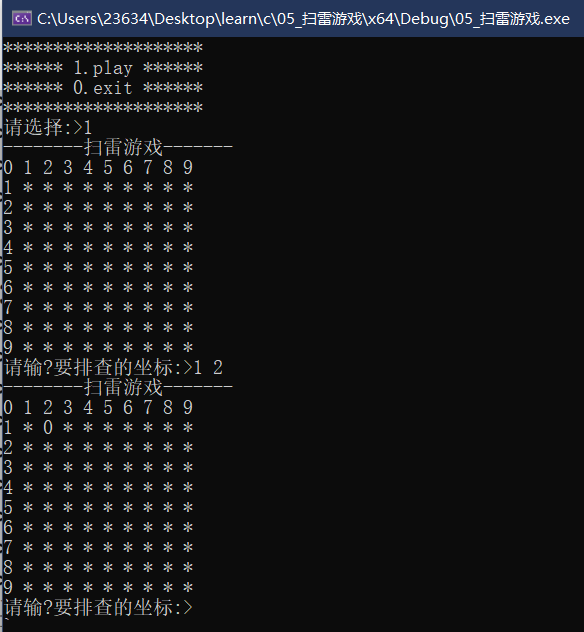
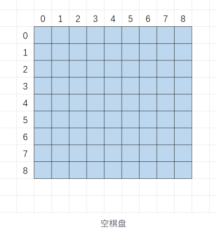
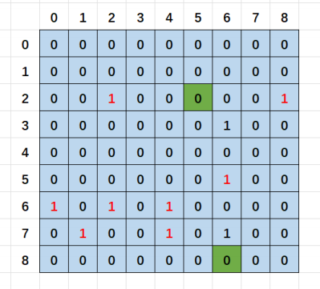
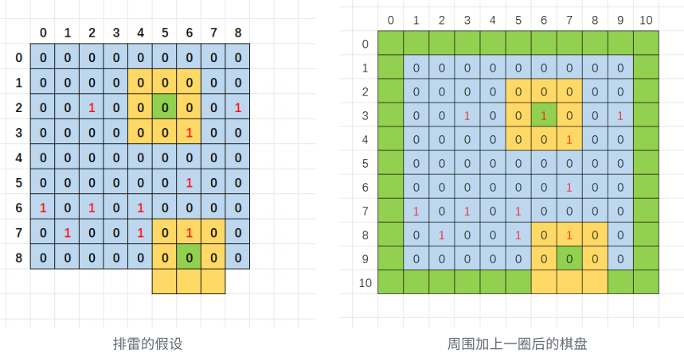
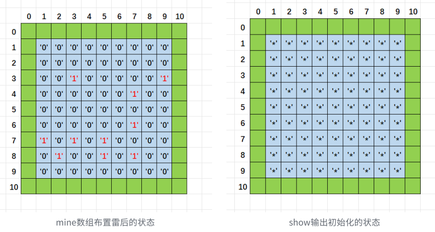

## 一. 扫雷游戏分析和设计

### 01. 扫雷游戏的功能说明

- 使⽤控制台实现经典的扫雷游戏

- 游戏可以通过菜单实现继续玩或者退出游戏

- 扫雷的棋盘是9*9的格⼦

- 默认随机布置10个雷

- 可以排查雷

- 如果位置不是雷，就显⽰周围有⼏个雷

- 如果位置是雷，就炸死游戏结束

- 把除10个雷之外的所有⾮雷都找出来，排雷成功，游戏结束

- 游戏的界⾯：

  

### 02. 游戏的分析和设计

1. 数据结构的分析

   扫雷的过程中，布置的雷和排查出的雷的信息都需要存储，所以我们需要⼀定的数据结构来存储这些信息。

   因为我们需要在9*9的棋盘上布置雷的信息和排查雷，我们⾸先想到的就是创建⼀个9*9的数组来存放信息。

   

   那如果这个位置布置雷，我们就存放1，没有布置雷就存放0.

   

   假设我们排查(2,5)这个坐标时，我们访问周围的⼀圈8个⻩⾊位置，统计周围雷的个数是1

   假设我们排查(8,6)这个坐标时，我们访问周围的⼀圈8个⻩⾊位置，统计周围雷的个数时，最下⾯的三个坐标就会越界，为了防⽌越界，我们在设计的时候，给数组扩⼤⼀圈，雷还是布置在中间的9*9的坐

   标上，周围⼀圈不去布置雷就⾏，这样就解决了越界的问题。所以我们将存放数据的数组创建成11*11是⽐较合适。

   

   再继续分析，我们在棋盘上布置了雷，棋盘上雷的信息（1）和⾮雷的信息（0），假设我们排查了某⼀个位置后，这个坐标处不是雷，这个坐标的周围有1个雷，那我们需要将排查出的雷的数量信息记录

   存储，并打印出来，作为排雷的重要参考信息的。那这个雷的个数信息存放在哪⾥呢？如果存放在布置雷的数组中，这样雷的信息和雷的个数信息就可能或产⽣混淆和打印上的困难。 

   这⾥我们肯定有办法解决，⽐如：雷和⾮雷的信息不要使⽤数字，使⽤某些字符就⾏，这样就避免冲突了，但是这样做棋盘上有雷和⾮雷的信息，还有排查出的雷的个数信息，就⽐较混杂，不够⽅便。

   这⾥我们采⽤另外⼀种⽅案，我们专⻔给⼀个棋盘（对应⼀个数组mine）存放布置好的雷的信息，再给另外⼀个棋盘（对应另外⼀个数组show）存放排查出的雷的信息。这样就互不⼲扰了，把雷布置到

   mine数组，在mine数组中排查雷，排查出的数据存放在show数组，并且打印show数组的信息给后期排查参考。

   同时为了保持神秘，show数组开始时初始化为字符 '*'，为了保持两个数组的类型⼀致，可以使⽤同⼀套函数处理，mine数组最开始也初始化为字符'0'，布置雷改成'1'。如下如：

   

   对应的数组应该是：

   ```c
   char mine[11][11] = {0};//⽤来存放布置好的雷的信息
   char show[11][11] = {0};//⽤来存放排查出的雷的个数信息
   ```

2. 文件结构设计

   之前学习了多⽂件的形式对函数的声明和定义，这⾥我们实践⼀下，我们设计三个⽂件：

   ```c
   test.c //⽂件中写游戏的测试逻辑 
   game.c //⽂件中写游戏中函数的实现等
   game.h //⽂件中写游戏需要的数据类型和函数声明等
   ```


## 二. 代码实现

game.h

```c
#pragma once
#include <stdio.h>
#include <stdlib.h>
#include <time.h>
#define EASY_COUNT 10
#define ROW 9
#define COL 9
#define ROWS ROW+2
#define COLS COL+2
//初始化棋盘
void InitBoard(char board[ROWS][COLS], int rows, int cols, char set);
//打印棋盘
void DisplayBoard(char board[ROWS][COLS], int row, int col);
//布置雷
void SetMine(char board[ROWS][COLS], int row, int col);
//排查雷
void FindMine(char mine[ROWS][COLS], char show[ROWS][COLS], int row, int col);
```

game.c

```c
#define _CRT_SECURE_NO_WARNINGS 1

#include "game.h"
void InitBoard(char board[ROWS][COLS], int rows, int cols, char set)
{
	int i = 0;
	for (i = 0; i < rows; i++)
	{
		int j = 0;
		for (j = 0; j < cols; j++)
		{
			board[i][j] = set;
		}
	}
}
void DisplayBoard(char board[ROWS][COLS], int row, int col)
{
	int i = 0;
	printf("--------扫雷游戏-------\n");
	for (i = 0; i <= col; i++)
	{
		printf("%d ", i);
	}
	printf("\n");
	for (i = 1; i <= row; i++)
	{
		printf("%d ", i);
		int j = 0;
		for (j = 1; j <= col; j++)
		{
			printf("%c ", board[i][j]);
		}
		printf("\n");
	}
}
void SetMine(char board[ROWS][COLS], int row, int col)
{
	//布置10个雷
	//⽣成随机的坐标，布置雷
	int count = EASY_COUNT;
	while (count)
	{
		int x = rand() % row + 1;
		int y = rand() % col + 1;
		if (board[x][y] == '0')
		{
			board[x][y] = '1';
			count--;
		}
	}
}
int GetMineCount(char mine[ROWS][COLS], int x, int y)
{
	return (mine[x - 1][y] + mine[x - 1][y - 1] + mine[x][y - 1] + mine[x + 1][y -
		1] + mine[x + 1][y] +
		mine[x + 1][y + 1] + mine[x][y + 1] + mine[x - 1][y + 1] - 8 * '0');
}
void FindMine(char mine[ROWS][COLS], char show[ROWS][COLS], int row, int col)
{
	int x = 0;
	int y = 0;
	int win = 0;
	while (win < row * col - EASY_COUNT)
	{
		printf("请输入要排查的坐标:>");
		scanf("%d %d", &x, &y);
		if (x >= 1 && x <= row && y >= 1 && y <= col)
		{
			if (mine[x][y] == '1')
			{
				printf("很遗憾，你被炸死了\n");
				DisplayBoard(mine, ROW, COL);
				break;
			}
			else
			{
				//该位置不是雷，就统计这个坐标周围有⼏个雷
				int count = GetMineCount(mine, x, y);
				show[x][y] = count + '0';
				DisplayBoard(show, ROW, COL);
				win++;
			}
		}
		else
		{
			printf("坐标⾮法，重新输⼊\n");
		}
	}
	if (win == row * col - EASY_COUNT)
	{
		printf("恭喜你，排雷成功\n");
		DisplayBoard(mine, ROW, COL);
	}
}
```

test.c

```c
#define _CRT_SECURE_NO_WARNINGS 1

#include <stdio.h>
#include "game.h"

void menu() {
	printf("********************\n");
	printf("****** 1.play ******\n");
	printf("****** 0.exit ******\n");
	printf("********************\n");
}

void game() {
	char mine[ROWS][COLS];//存放布置好的雷
	char show[ROWS][COLS];//存放排查出的雷的信息
	//初始化棋盘
	//1. mine数组最开始是全'0'
	//2. show数组最开始是全'*'
	InitBoard(mine, ROWS, COLS, '0');
	InitBoard(show, ROWS, COLS, '*');
	//打印棋盘
	//DisplayBoard(mine, ROW, COL);
	DisplayBoard(show, ROW, COL);
	//1. 布置雷
	SetMine(mine, ROW, COL);
	//DisplayBoard(mine, ROW, COL);
	//2. 排查雷
	FindMine(mine, show, ROW, COL);
}

int main()
{
	int input = 0;
	srand((unsigned int)time(NULL));
	do
	{
		menu();
		printf("请选择:>");
		scanf("%d", &input);
		switch (input)
		{
		case 1:
			game();
			break;
		case 0:
			printf("退出游戏\n");
			break;
		default:
			printf("选择错误，重新选择\n");
			break;
		}
	} while (input);
	return 0;
}
```


## 三. 扫雷游戏的扩展

- 是否可以选择游戏难度
  - 简单 9*9 棋盘，10个雷*
  - *中等 16*16棋盘，40个雷
  - 困难 30*16棋盘，99个雷
- 如果排查位置不是雷，周围也没有雷，可以展开周围的⼀⽚
- 是否可以标记雷
- 是否可以加上排雷的时间显⽰

在线扫雷游戏：http://www.minesweeper.cn/