## 一. 什么是bug

bug本意是“昆⾍”或“⾍⼦”，现在⼀般是指在电脑系统或程序中，隐藏着的⼀些未被发现的缺陷或问题，简称程序漏洞。

“Bug” 的创始⼈格蕾丝·赫柏（Grace Murray Hopper），她是⼀位为美国海军⼯作的电脑专家，1947年9⽉9⽇，格蕾丝·赫柏对Harvard MarkII设置好17000个继电器进⾏编程后，技术⼈员正在进⾏整机运⾏时，它突然停⽌了⼯作。于是他们爬上去找原因，发现这台巨⼤的计算机内部⼀组继电器的触点之间有⼀只⻜蛾，这显然是由于⻜蛾受光和热的吸引，⻜到了触点上，然后被⾼电压击死。所以在报告中，赫柏⽤胶条贴上⻜蛾，并把“bug”来表⽰“⼀个在电脑程序⾥的错误”，“Bug”这个说法⼀直沿⽤到今天。

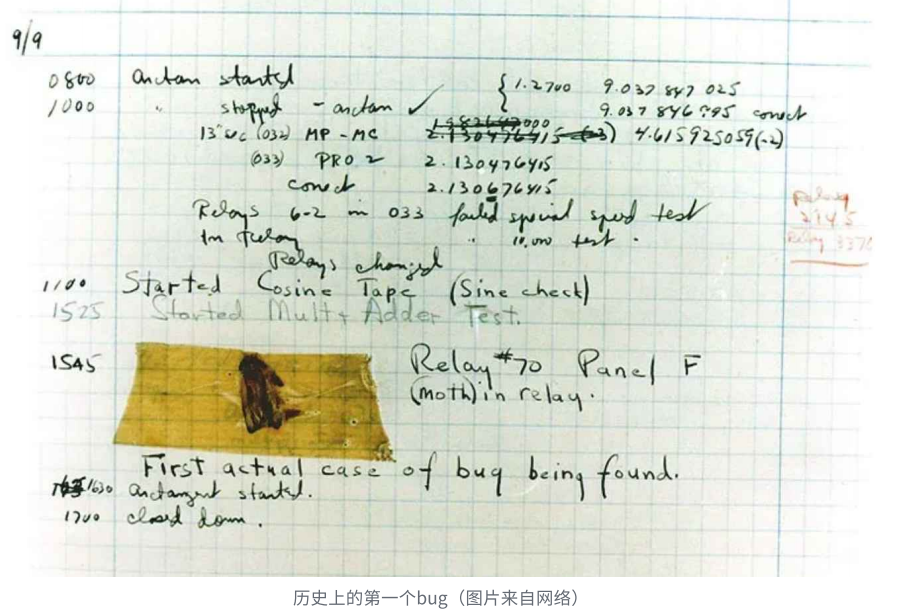


## 二. 什么是调试(debug) ?

当我们发现程序中存在的问题的时候，那下⼀步就是找到问题，并修复问题。

这个找问题的过程叫称为调试，英⽂叫debug（消灭bug）的意思。

调试⼀个程序，⾸先是承认出现了问题，然后通过各种⼿段去定位问题的位置，可能是逐过程的调试，也可能是隔离和屏蔽代码的⽅式，找到问题所的位置，然后确定错误产⽣的原因，再修复代码，重新测试。


## 三. Debug 和 Release

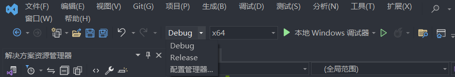

在VS上编写代码的时候，就能看到有 debug 和 release 两个选项，分别是什么意思呢？

Debug 通常称为调试版本，它包含调试信息，并且不作任何优化，便于程序员调试程序；程序员在写代码的时候，需要经常性的调试代码，就将这⾥设置为 debug ，这样编译产⽣的是debug 版本的可执⾏程序，其中包含调试信息，是可以直接调试的。

Release 称为发布版本，它往往是进⾏了各种优化，使得程序在代码⼤⼩和运⾏速度上都是最优的，以便⽤⼾很好地使⽤。当程序员写完代码，测试再对程序进⾏测试，直到程序的质量符合交付给⽤⼾、使⽤的标准，这个时候就会设置为 release ，编译产⽣的就是 release 版本的可执⾏程序，这个版本是⽤⼾使⽤的，⽆需包含调试信息等。

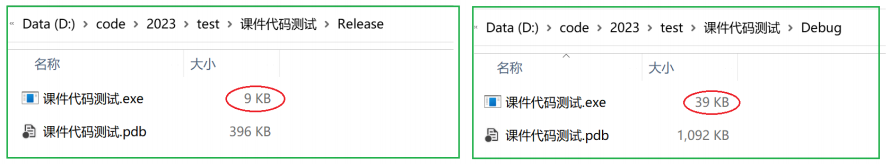

对⽐可以看到从同⼀段代码，编译⽣成的可执⾏⽂件的⼤⼩，release版本明显要⼩，⽽debug版本明显⼤。


## 四. VS调试快捷键

那程序员怎么调试代码呢？

### 01. 环境准备

⾸先是环境的准备，需要⼀个⽀持调试的开发环境，我们上课使⽤VS，应该把VS上设置为Debug，如图：

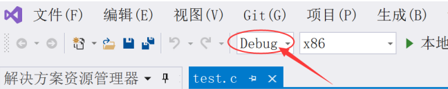

### 02. 调试快捷键

调试最常使⽤的⼏个快捷键：

**F9：创建断点和取消断点**

断点的作⽤是可以在程序的任意位置设置断点，打上断点就可以使得程序执⾏到想要的位置暂定执⾏，接下来我们就可以使⽤F10，F11这些快捷键，观察代码的执⾏细节。

条件断点：满⾜这个条件，才触发断点。

F5：启动调试，经常⽤来直接跳到下⼀个断点处，⼀般是和F9配合使⽤。

F10：逐过程，通常⽤来处理⼀个过程，⼀个过程可以是⼀次函数调⽤，或者是⼀条语句。

F11：逐语句，就是每次都执⾏⼀条语句，但是这个快捷键可以使我们的执⾏逻辑进⼊函数内部。在函数调⽤的地⽅，想进⼊函数观察细节，必须使⽤F11，如果使⽤F10，直接完成函数调⽤。

CTRL + F5：开始执⾏不调试，如果你想让程序直接运⾏起来⽽不调试就可以直接使⽤。

VS更多快捷键了解：http://blog.csdn.net/mrlisky/article/details/72622009


## 五. 监视和内存观察

在调试的过程中我们，如果要观察代码执⾏过程中，上下⽂环境中的变量的值，有哪些⽅法呢？

这些观察的前提条件⼀定是开始调试后观察，⽐如：

```c
#include <stdio.h>
int main() {
  int arr[10] = {0};
  int num = 100;
  char c = 'w';
  for (int i = 0; i < 10; i++) {
    arr[i] = i;
  }
  return 0;
}
```

### 01. 监视

开始调试后，在菜单栏中【调试】->【窗⼝】->【监视】，打开任意⼀个监视窗⼝，输⼊想要观察的对象就⾏。

打开监视窗⼝：

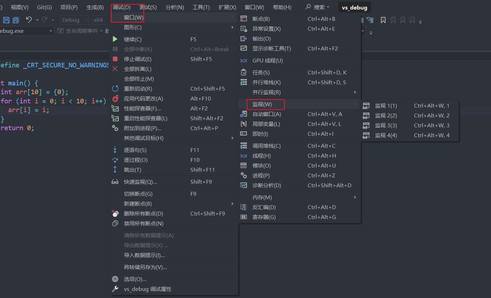

在监视窗⼝中观察：

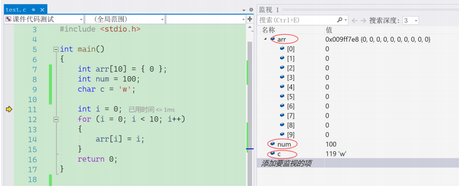

### 02. 内存

如果监视窗⼝看的不够仔细，也是可以观察变量在内存中的存储情况，还是在【调试】=>【窗⼝】=>【内存】

打开内存窗⼝：

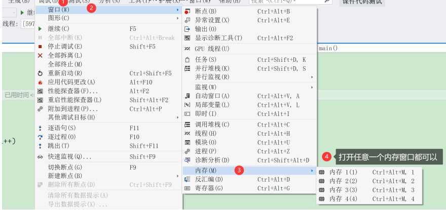

在内存窗⼝中观察数据：

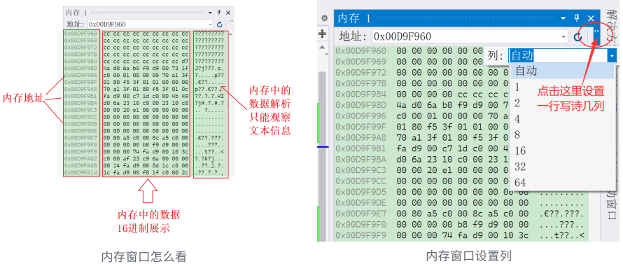

在打开内存窗⼝后，要在地址栏输⼊：arr，&num，&c，这类地址，就能观察到该地址处的数据。

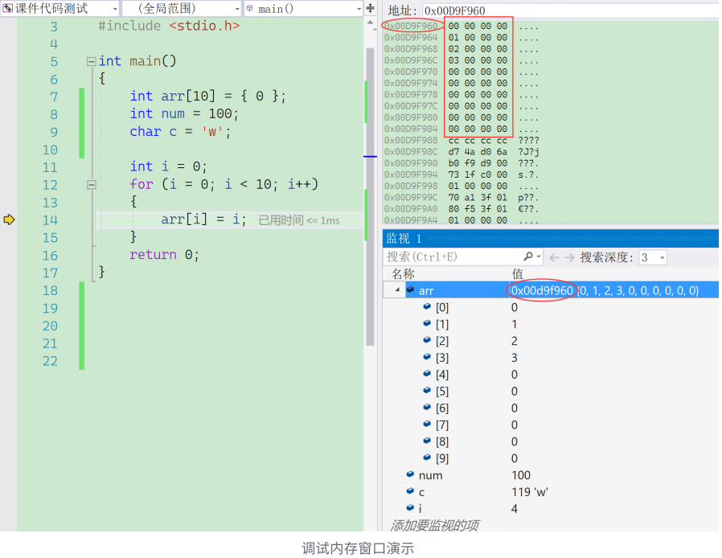

除此之外，在调试的窗⼝中还有：⾃动窗⼝，局部变量，反汇编、寄存器等窗⼝，⾃⾏验证使⽤⼀下。


## 六. 调试举例1

求 1!+2!+3!+4!+...10! 的和，请看下⾯的代码：

```c
#include <stdio.h>
//写⼀个代码求n的阶乘
int main() {
  int n = 0;
  scanf("%d", &n);
  int ret = 1;
  for (int i=1; i<=n; i++) {
    ret *= i;
  }
  printf("%d\n", ret);
  return 0;
}

//如果n分别是1,2,3,4,5...10,求出每个数的阶乘，再求和就好了
//在上⾯的代码上改造
int main() {
  int n = 0;
  int sum = 0;
  for (n=1; n<=10; n++) {
    for (int i=1; i<=n; i++) {
      ret *= i;
    }
    sum += ret;
  }
  printf("%d\n", sum);
  return 0;
}
//运⾏结果应该是错的？
```

调试找⼀下问题。

修改后的：

```c
#include <stdio.h>
int main() {
  int sum = 0;
  for (int n = 1; n <= 10; n++) {
    int ret = 1;
    for (int i = 1; i <= n; i++) {
      ret *= i;
    }
    sum += ret;
  }
  printf("sum: %d", sum);
  return 0;
}
```


## 七. 调试举例2

在VS2022、X86、Debug 的环境下，编译器不做任何优化的话，下⾯代码执⾏的结果是啥？

```c
#include <stdio.h>
int main() {
  int arr[10] = {1,2,3,4,5,6,7,8,9,10};
  for (int i=0; i<=12; i++) {
    arr[i] = 0;
    printf("hehe\n");
  }
  return 0;
}
```

程序运⾏，死循环了，调试看看为什么？

调试可以上⾯程序的内存布局如下：

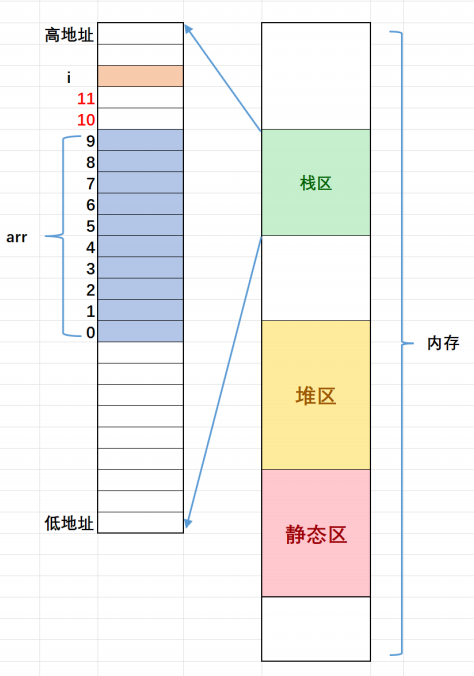

1. 栈区内存的使⽤习惯是从⾼地址向低地址使⽤的，所以变量i的地址是较⼤的。arr数组的地址整体是⼩于i的地址。

2. 数组在内存中的存放是：随着下标的增⻓，地址是由低到⾼变化的。所以根据代码，就能理解为什么是左边的代码布局了。如果是左边的内存布局，那随着数组下标的增⻓，往后越界就有可能覆盖到i，这样就可能造成死循环的。这⾥肯定有同学有疑问：为什么i和arr数组之间恰好空出来2个整型的空间呢？这⾥确实是巧合，在不同的编译器下可能中间的空出的空间⼤⼩是不⼀样的，代码中这些变量内存的分配和地址分配是编译器指定的，所以的不同的编译器之间就有差异了。所以这个题⽬是和环境相关的。

从这个理解我们能够体会到调试的重要性，只有调试才能观察到程序内部执⾏的细节，就像医⽣给病⼈做B超，CT⼀样。

注意：栈区的默认的使⽤习惯是先使⽤⾼地址，再使⽤低地址的空间，但是这个具体还是要编译器的实现，⽐如：在VS上切换到X64，这个使⽤的顺序就是相反的，在Release版本的程序中，这个使⽤的顺序也是相反的。


## 八. 调试举例3：扫雷

如果⼀个代码稍微复杂，那怎么调试呢？

这⾥我们就上⼿调试⼀下扫雷的代码。

演⽰：

- 在函数内部打断点，快速跳转到函数
- 在数组传参，调试进⼊函数，如何在监视窗⼝观察数组的内容： 数组名,n 的形式

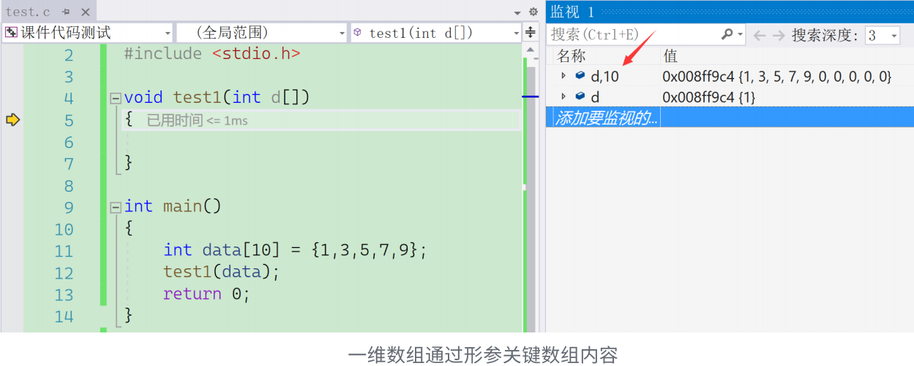

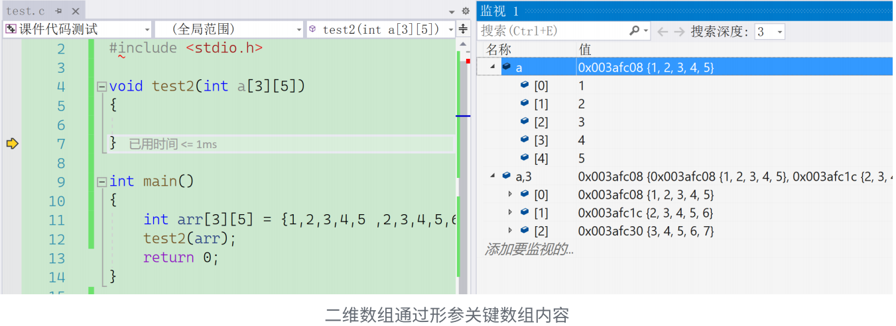

调试过程中，要做到⼼中有数，也就是程序员⾃⼰⼼⾥要清晰的知道希望代码怎么执⾏，然后再去看代码有没有按照我们预定的路线在执⾏。

调试是需要反复去动⼿练习的，调试是可以增加程序员对代码的理解和掌控的，掌握了调试的能⼒，就能看到本质，就像能给程序做B超⼀样，对程序内部⼀览⽆余。


## 九. 编程常见错误归类

### 01. 编译型错误

编译型错误⼀般都是语法错误，这类错误⼀般看错误信息就能找到⼀些蛛丝⻢迹的，双击错误信息也能初步的跳转到代码错误的地⽅或者附近。编译错误，随着语⾔的熟练掌握，会越来越少，也容易解决。

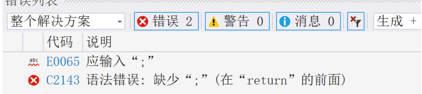

### 02. 链接型错误

看错误提示信息，主要在代码中找到错误信息中的标识符，然后定位问题所在。⼀般是因为

- 标识符名不存在
- 拼写错误
- 头⽂件没包含
- 引⽤的库不存在

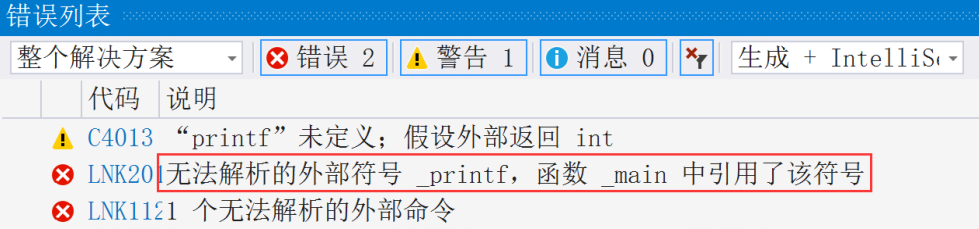

### 03. 运行时错误

运⾏时错误，是千变万化的，需要借助调试，逐步定位问题，调试解决的是运⾏时问题。


