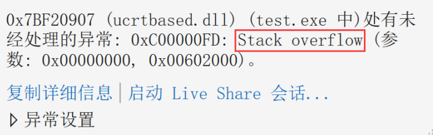
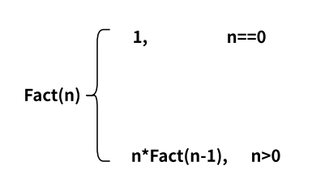
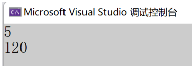
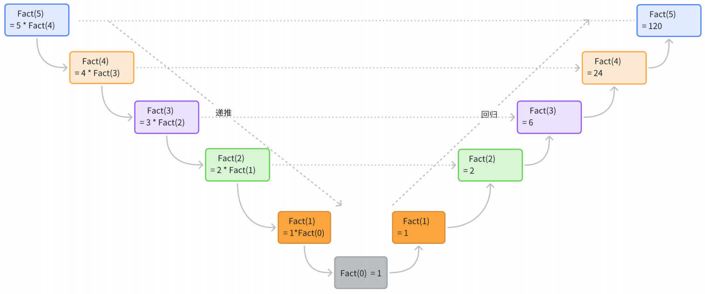
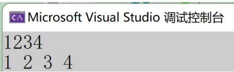
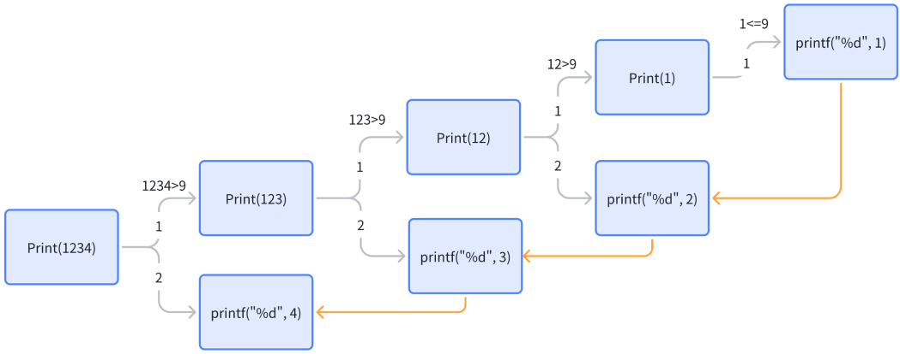
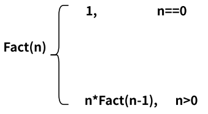
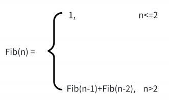
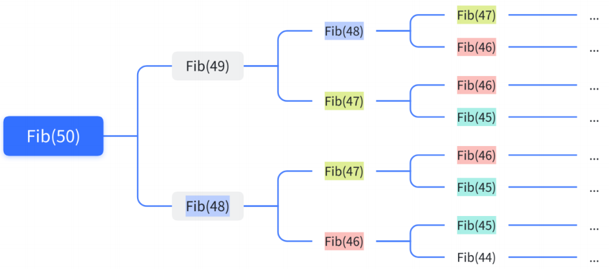
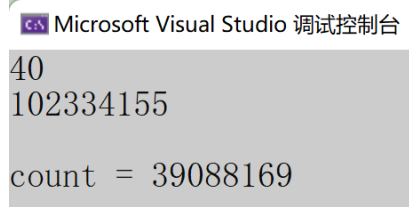

## 一. 什么是递归

递归是学习C语⾔函数绕不开的⼀个话题，那什么是递归呢？

递归其实是⼀种解决问题的⽅法，在C语⾔中，递归就是函数⾃⼰调⽤⾃⼰。

写⼀个史上最简单的C语⾔递归代码：

```c
#include <stdio.h>
int main() {
  printf("hehe\n");
  main(); // main函数中又调用了main函数
  return 0;
}
```

上述就是⼀个简单的递归程序，只不过上⾯的递归只是为了演⽰递归的基本形式，不是为了解决问题，代码最终也会陷⼊死递归，导致栈溢出（Stack overflow）。



### 01. 递归的思想

把⼀个⼤型复杂问题层层转化为⼀个与原问题相似，但规模较⼩的⼦问题来求解；直到⼦问题不能再被拆分，递归就结束了。所以递归的思考⽅式就是把⼤事化⼩的过程。

递归中的递就是递推的意思，归就是回归的意思，接下来慢慢来体会。

### 02. 递归的限制条件

递归在书写的时候，有2个必要条件：

- 递归存在限制条件，当满⾜这个限制条件的时候，递归便不再继续。
- 每次递归调⽤之后越来越接近这个限制条件。

在下⾯的例⼦中，我们逐步体会这2个限制条件。


## 二. 递归的举例

### 01. 举例1：求n的阶乘

> ⼀个正整数的阶乘（factorial）是所有⼩于及等于该数的正整数的积，并且0的阶乘为1。⾃然数n的阶乘写作n!。

题⽬：计算n的阶乘（不考虑溢出），**n的阶乘 就是1~n的数字累积相乘**。

1. 分析和代码实现

   我们知道n的阶乘的公式：*n*！ =  *n* ∗ (*n* − 1)!

   ```c
   举例：
    5! = 5*4*3*2*1
    4! = 4*3*2*1
    所以:5! = 5*4!
   ```

   这样的思路就是把⼀个较⼤的问题，转换为⼀个与原问题相似，但规模较⼩的问题来求解的。

   当 n==0 的时候，n的阶乘是1，其余n的阶乘都是可以通过公式计算。

   n的阶乘的递归公式如下：

   

   那我们就可以写出函数Fact求n的阶乘，假设Fact(n)就是求n的阶乘，那么Fact(n-1)就是求n-1的阶乘，函数如下：

   ```c
   #include <stdio.h>
   int Fact(int n) {
     if(n==0)
       return 1;
     else
       return n*Fact(n-1);
   }
   
   int main() {
     int n = 0;
     scanf("%d", &n);
     int ret = Fact(n);
     printf("%d\n", ret);
     return 0;
   }
   ```

   运⾏结果（这⾥不考虑n太⼤的情况，n太⼤存在溢出）：

   

2. 画图推演

   

### 02. 举例2：顺序打印一个整数的每一位

输⼊⼀个整数m，按照顺序打印整数的每⼀位。

⽐如：

```
输⼊：1234 输出：1 2 3 4
输⼊：520 输出：5 2 0
```

1. 分析和代码实现

   这个题⽬，放在我们⾯前，⾸先想到的是，怎么得到这个数的每⼀位呢？

   如果n是⼀位数，n的每⼀位就是n⾃⼰，n是超过1位数的话，就得拆分每⼀位。

   1234%10就能得到4，然后1234/10得到123，这就相当于去掉了4然后继续对123%10，就得到了3，再除10去掉3，以此类推不断的 %10 和 /10 操作，直到1234的每⼀位都得到；但是这⾥有个问题就是得到的数字顺序是倒着的。

   但是我们有了灵感，我们发现其实⼀个数字的最低位是最容易得到的，通过%10就能得到。

   那我们假设想写⼀个函数Print来打印n的每⼀位，如下表⽰：

   ```c
   Print(n);
   // 如果n是1234，那表⽰为 Print(1234); 打印1234的每⼀位
   // 其中1234中的4可以通过%10得到，那么Print(1234)就可以拆分为两步：
   // 1. Print(1234/10) // 打印123的每⼀位
   // 2. printf(1234%10) // 打印4
   // 完成上述2步，那就完成了1234每⼀位的打印
   // 那么Print(123)⼜可以拆分为 Print(123/10) + printf(123%10)
   ```

   以此类推下去，就有

   ```c
    Print(1234)
   ==>Print(123) + printf(4)
   ==>Print(12) + printf(3)
   ==>Print(1) + printf(2)
   ==>printf(1)
   ```

   直到被打印的数字变成⼀位数的时候，就不需要再拆分，递归结束。

   那么代码完成也就⽐较清楚：

   ```c
   void Print(int n) {
     if (n>9) {
       Print(n/10);
     }
     printf("%d ", n%10);
   }
   
   int main() {
     int m = 0;
     scanf("%d", &m);
     Print(m);
     return 0;
   }
   ```

   输⼊和输出结果：

   

   在这个解题的过程中，我们就是使⽤了⼤事化⼩的思路；

   把Print(1234) 打印1234每⼀位，拆解为⾸先Print(123)打印123的每⼀位，再打印得到的4；

   把Print(123) 打印123每⼀位，拆解为⾸先Print(12)打印12的每⼀位，再打印得到的3；

   直到Print打印的是⼀位数，直接打印就⾏。

2. 画图推演

   以1234每⼀位的打印来推演⼀下

   


## 三. 递归与迭代

递归是⼀种很好的编程技巧，但是和很多技巧⼀样，也是可能被误⽤的，就像举例1⼀样，看到推导的公式，很容易就被写成递归的形式：



```c
int Fact(int n) {
  if(n==0)
    return 1;
  else
    return n*Fact(n-1);
}
```

Fact函数是可以产⽣正确的结果，但是在递归函数调⽤的过程中涉及⼀些运⾏时的开销。

> 在C语⾔中每⼀次函数调⽤，都要需要为本次函数调⽤在栈区申请⼀块内存空间来保存函数调⽤期间的各种局部变量的值，这块空间被称为运⾏时堆栈，或者函数栈帧。
>
> 函数不返回，函数对应的栈帧空间就⼀直占⽤，所以如果函数调⽤中存在递归调⽤的话，每⼀次递归函数调⽤都会开辟属于⾃⼰的栈帧空间，直到函数递归不再继续，开始回归，才逐层释放栈帧空间。
>
> 所以如果采⽤函数递归的⽅式完成代码，递归层次太深，就会浪费太多的栈帧空间，也可能引起栈溢出（stack overflow）的问题。

所以如果不想使⽤递归就得想其他的办法，通常就是迭代的⽅式（通常就是循环的⽅式）。⽐如：计算n的阶乘，也是可以产⽣1~n的数字累计乘在⼀起的。

```c
int Fact(int n) {
  int i = 0;
  int ret = 1;
  for(i=1; i<=n; i++){
    ret *= i;
  }
  return ret;
}
```

上述代码是能够完成任务，并且效率是⽐递归的⽅式更好的。

事实上，我们看到的许多问题是以递归的形式进⾏解释的，这只是因为它⽐⾮递归的形式更加清晰，但是这些问题的迭代实现往往⽐递归实现效率更⾼。

当⼀个问题⾮常复杂，难以使⽤迭代的⽅式实现时，此时递归实现的简洁性便可以补偿它所带来的运⾏时开销。


## 四. 求第n个斐波那契数

我们也能举出更加极端的例⼦，就像计算第n个斐波那契数，是不适合使⽤递归求解的，但是斐波那契数的问题通过是使⽤递归的形式描述的，如下：



看到这公式，很容易诱导我们将代码写成递归的形式，如下所⽰：

```c
int Fib(int n) {
  if(n<=2)
    return 1;
  else
    return Fib(n-1)+Fib(n-2);
}
```

测试代码：

```c
#include <stdio.h>
int main() {
  int n = 0;
  scanf("%d", &n);
  int ret = Fib(n);
  printf("%d\n", ret); 
  return 0;
}
```

当我们n输⼊为50的时候，需要很⻓时间才能算出结果，这个计算所花费的时间，是我们很难接受的，这也说明递归的写法是⾮常低效的，那是为什么呢？



其实递归程序会不断的展开，在展开的过程中，我们很容易就能发现，在递归的过程中会有重复计算，⽽且递归层次越深，冗余计算就会越多。我们可以作业测试：

```c
#include <stdio.h>
int count = 0;
int Fib(int n) {
  if(n == 3)
    count++;//统计第3个斐波那契数被计算的次数
  if(n<=2)
    return 1;
  else
    return Fib(n-1)+Fib(n-2);
}
int main() {
  int n = 0;
  scanf("%d", &n);
  int ret = Fib(n);
  printf("%d\n", ret);
  printf("\ncount = %d\n", count);
  return 0;
}
```

输出结果：



这⾥我们看到了，在计算第40个斐波那契数的时候，使⽤递归⽅式，第3个斐波那契数就被重复计算了39088169次，这些计算是⾮常冗余的。所以斐波那契数的计算，使⽤递归是⾮常不明智的，我们就得想迭代的⽅式解决。

我们知道斐波那契数的前2个数都1，然后前2个数相加就是第3个数，那么我们从前往后，从⼩到⼤计算就⾏了。

这样就有下⾯的代码：

```c
int Fib(int n) {
  int a = 1;
  int b = 1;
  int c = 1;
  while (n > 2) {
    c = a+b;
    a = b;
    b = c;
    n--;
  }
  return c;
}
```

迭代的⽅式去实现这个代码，效率就要⾼出很多了。有时候，递归虽好，但是也会引⼊⼀些问题，所以我们⼀定不要迷恋递归，适可⽽⽌就好。

拓展学习：

- ⻘蛙跳台阶问题
- 汉诺塔问题