##  一. 操作符的分类

- 算术操作符： `+`、`-`、`*`、`/`、`%`
- 移位操作符：`<<`、`>>`
- 位操作符：`&` 、`|` 、`^`
- 赋值操作符：`=`、`+=`、`-=`、`=`、`/=`、`%=`、`<<=`、`>>=`、`&=`、`|= `、`^=*`
- *单⽬操作符： `!`、`++`、`--`、`&`、`*`、`+`、`-`、`~` 、`sizeof`、(类型)
- 关系操作符: `>`、`>=`、`< `、`<=`、`==`、`!=`
- 逻辑操作符： `&&`、`||`
- 条件操作符： `? `、`:`
- 逗号表达式：`,`
- 下标引⽤： `[]`
- 函数调⽤： `()`
- 结构成员访问： `.` 、`->`

上述的操作符，前面部分已经讲过算术操作符、赋值操作符、逻辑操作符、条件操作符和部分的单⽬操作符，这里继续介绍⼀部分，操作符中有⼀些操作符和⼆进制有关系，我们先铺垫⼀下⼆进制的和进制转换的知识。

## 二. 二进制和进制转换

其实我们经常能听到 2进制、8进制、10进制、16进制 这样的讲法，那是什么意思呢？其实2进制、8进制、10进制、16进制是数值的不同表⽰形式⽽已。

⽐如：数值15的各种进制的表⽰形式：

```c
15的2进制：1111
15的8进制：17
15的10进制：15
15的16进制：F
// 16进制的数值之前写：0x
// 8进制的数值之前写:0
```

我们重点介绍⼀下⼆进制：

⾸先我们还是得从10进制讲起，其实10进制是我们⽣活中经常使⽤的，我们已经形成了很多尝试：

- 10进制中满10进1
- 10进制的数字每⼀位都是0~9的数字组成

其实⼆进制也是⼀样的

- 2进制中满2进1
- 2进制的数字每⼀位都是0~1的数字组成

那么 1101 就是⼆进制的数字了。

### 01. 2进制转10进制

其实10进制的123表⽰的值是⼀百⼆⼗三，为什么是这个值呢？其实10进制的每⼀位是有权重的，10进制的数字从右向左是个位、⼗位、百位....，分别每⼀位的权重是10^0、10^1、10^2... 

如下图：

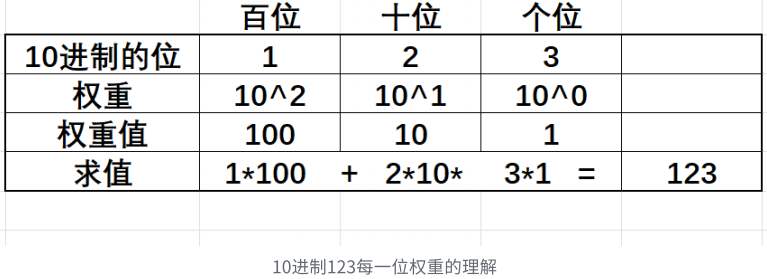

2进制和10进制是类似的，只不过2进制的每⼀位的权重，从右向左是：2^0、2^1、2^2 ... 

如果是2进制的1101，该怎么理解呢？

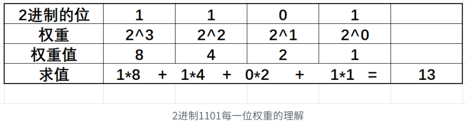

### 02. 10进制转2进制数字

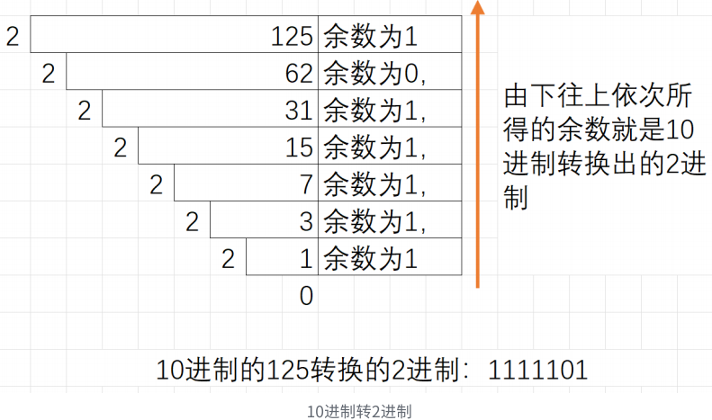

### 03. 2进制转8进制

8进制的数字每⼀位是0~7的，0~7的数字，各⾃写成2进制，最多有3个2进制位就⾜够了，⽐如7的⼆进制是111，所以在2进制转8进制数的时候，从2进制序列中右边低位开始向左每3个2进制位会换算⼀个8进制位，剩余不够3个2进制位的直接换算。

如：2进制的 01101011，换成8进制：0153，**0开头的数字，会被当做8进制**。

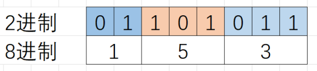

### 04. 2进制转16进制

16进制的数字每⼀位是0~9,a ~f 的，0~9,a ~f的数字，各⾃写成2进制，最多有4个2进制位就⾜够了，⽐如 f 的⼆进制是1111，所以在2进制转16进制数的时候，从2进制序列中右边低位开始向左每4个2进制位会换算⼀个16进制位，剩余不够4个⼆进制位的直接换算。

如：2进制的01101011，换成16进制：0x6b，**16进制表示的时候前⾯加0x**

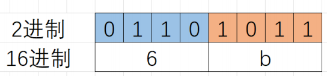


## 三. 原码、反码、补码

整数的2进制表示方法有三种：原码、反码和补码。

换句话说：**原码、反码和补码**指的是**整数的2进制表示方式**。

有符号整数的三种表⽰⽅法均有符号位和数值位两部分。

2进制序列中，**最⾼位的1位**是被当做**符号位**，**剩余**的都是**数值位**。

**无符号数，没有符号位，等价为正数，无法表示负数。**

```c
unsigned int num1 = 100;
unsigned int num2 = -100;
// 无符号数的打印格式，会存在问题
printf("%u\n", num1); // 100
printf("%u\n", num2); // 4294967196

// %d的打印格式，会把值当成有符号数打印
printf("%d\n", num1); // 100
printf("%d\n", num2); // -100
```

**符号位**都是⽤**0表⽰“正”**，⽤**1表⽰“负”**。

```c
// a是整型类型的，a是占4个字节位的（32bit）
// 32bit的内存存储空间中，数值10的二进制为：0000 0000 0000 0000 0000 0000 0000 1010
int a = 10; // 等价于 signed int a = 10;

// b也是整型类型的，占4个字节位
// 32bit的内存存储空间中，数值-10的二进制为：1000 0000 0000 0000 0000 0000 0000 1010
int b = -10; // 等价于 signed int b = -10;
```

> **1个bit指的是二进制中的一位，是信息的最小单位。**
>
> **1个字节表示8个bit位，储存的数值范围为0-255。**	

1. **正整数的原、反、补码都相同**。

   ```c
   // 示例：
   int a = 10;
   // 正整数a的值的原码、反码和补码都相同，即：
   // 0000 0000 0000 0000 0000 0000 0000 1010
   ```

2. **负整数**的原、反、补码表⽰⽅法**各不相同**。

   ```c
   // 示例：
   int b = -10;
   
   // 负整数的原码：
   // 直接将数值按照正负数的形式翻译成⼆进制得到的就是原码。
   // 1000 0000 0000 0000 0000 0000 0000 1010
   
   // 负整数的反码：
   // 将原码的符号位不变，其他位依次按位取反就可以得到反码。
   // 1111 1111 1111 1111 1111 1111 1111 0101
   
   // 负整数的补码：
   // 反码+1就得到补码。
   // 1111 1111 1111 1111 1111 1111 1111 0110
   ```

   > 重要理解：
   >
   > - **即使计算过程是按照补码进行的，最终打印出来的结果是按照原码来解释的。**
   
   - 负整数的补码 =>原码有两种方式：
     1. 可以先-1得到反码，再取反（符号位不变）得到原码
     2. 先取反（符号位不变），再+1直接得到原码（更直观常用的方式）

> - **整数在内存中存放的是补码**。为什么呢？
>
>   - 在计算机系统中，数值⼀律⽤补码来表⽰和存储。原因在于，使⽤补码，可以将符号位和数值位统⼀处理；同时，加法和减法也可以统⼀处理（CPU只有加法器）此外，补码与原码相互转换，其运算过程是相同的，不需要额外的硬件电路。
>
>     ```c
>     int a = 1 - 1; // 1 + (-1)
>     // 1. 如果用原码计算，存在问题
>     // 0000 0000 0000 0000 0000 00000 0000 0001：1的原码
>     // 1000 0000 0000 0000 0000 00000 0000 0001：-1的原码
>     // 如果使用原码相加，结果如下；
>     // 1000 0000 0000 0000 0000 00000 0000 0010：-2？？？错的
>                                             
>     // 使用补码计算就正确了
>     // 0000 0000 0000 0000 0000 00000 0000 0001：1的补码
>     // 1111 1111 1111 1111 1111 1111 1111 1111：-1的补码
>     // 如果使用补码相加，结果如下；
>     // 1 0000 0000 0000 0000 0000 00000 0000 0000：进1，最终第33位上得1
>     // 根据结果得知：变成33位了，而int a 是4个字节，为32位，必然就存不下了
>     // 存不下了，多出的第33位就会被截断，最终存储的结果为：
>     // 0000 0000 0000 0000 0000 00000 0000 0000：0（结果正确）
>                                             
>     // 所以根据示例得出为什么整数在内存中存放使用的是补码，而不是原码了。
>     ```


## 四. 移位操作符

<< 左移操作符，>> 右移操作符

注：**移位操作符的操作数只能是整数**。

### 01. 左移操作符

> **左移移位规则：左边抛弃、右边补0。**

```c
int num = 10;
int n = num<<1;
printf("n= %d\n", n); // 20
printf("num= %d\n", num); // 10
```

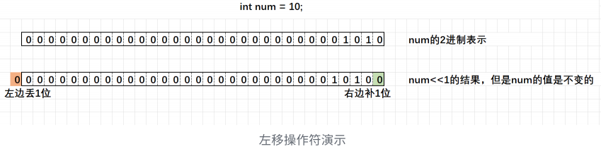

左移一位有乘以2的效果，验证如下：

```c
int num2 = 12;
int n2 = num2<<1;
printf("n2= %d\n", n2); // 24
printf("num2= %d\n", num2); // 12

int num3 = -12;
int n3 = num3<<1;
printf("n3= %d\n", n3); // -24
printf("num3= %d\n", num3); // -12
```

### 02. 右移操作符

移位规则：首先右移运算分两种：

> 1. 逻辑右移：左边用0填充，右边丢弃
> 2. **算术右移（常见）：左边用原该值的符号位填充，右边丢弃**

这个标准并没有确定，是取决于编译器实现的。

常见的编译器采用的都是算术右移。如：VS，GCC。

右移一位有除以2的效果，验证如下：

```c
int num = 10;
int n = num>>1;
printf("num= %d\n", num); // 10
printf("n= %d\n", n); // 5

int num = -10;
int n = num>>1;
printf("num= %d\n", num); // -10
printf("n= %d\n", n); // -5
```

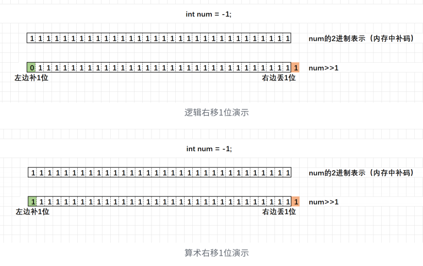

警告⚠️：对于移位运算符，不要移动负数位，这个是标准未定义的。

例如：

```c
int num = 10;
num>>-1; // error，C语言标准中未定义的行为
```


## 五. 位操作符：&、|、^、~

位操作符有：

```c
& // 按位与（基于2进制位计算）	&& // 逻辑与
| // 按位或（基于2进制位计算）	|| // 逻辑或
^ // 按位异或（基于2进制位计算）
~ // 按位取反（基于2进制位计算）
```

注：它们的**操作数必须是整数**。

```c
int a = 4;
int b = -7;
// 计算过程中使用的是补码，所以先列出4和-7的补码：
// 0000 0000 0000 0000 0000 0000 0000 0100：4的补码（正整数的三码相同）

// 1000 0000 0000 0000 0000 0000 0000 0111：-7的原码
// 1111 1111 1111 1111 1111 1111 1111 1000: -7的反码（原码取反）
// 1111 1111 1111 1111 1111 1111 1111 1001: -7的补码（反码+1）
```

- **按位与**的运算规则：**对应二进制位有0就是0，两个同时为1才为1**
  - 可以按逻辑与类似的方式记：按位与&，两个位上的值都为真值才为真，一个为假值则为假。（0代表假值，1代表真值）

```c
int c = a & b;
// 0000 0000 0000 0000 0000 0000 0000 0000：c的补码
// 符号位为0，则为正整数，三码相同，所以c的原码也为0
printf("%d\n", c); // 0（原码）
```

- **按位或**的运算规则：**对应二进制位有1就是1，两个同时为0才为0**
  - 可以按逻辑或类似的方式记：按位或|，两个位上的值只要有一个为真值即为真，两个都为假值则为假。（0代表假值，1代表真值）

```c
int d = a | b;
// 1111 1111 1111 1111 1111 1111 1111 1101: d的补码
// 1000 0000 0000 0000 0000 0000 0000 0011：d的原码
printf("%d\n", d); // -3（d的原码）
```

- **按位异或**的运算规则：**对应二进制位相同为0，相异为1**
  - 这个只能硬记了。。。

```c
int e = a ^ b;
// 1111 1111 1111 1111 1111 1111 1111 1101：e的补码
// 1000 0000 0000 0000 0000 0000 0000 0010：e的反码
// 1000 0000 0000 0000 0000 0000 0000 0011：e的原码
printf("%d\n", e); // -3（e的原码）

// 异或运算的一些特殊场景
int n = -2;
n ^ n = 0;
// n补码：1000 0000 0000 0000 0000 0000 0000 0010
// n^n:  0000 0000 0000 0000 0000 0000 0000 0000
// => 0

n ^ 0 = n; 
// n的补码: 1000 0000 0000 0000 0000 0000 0000 0010
// 0: 		 0000 0000 0000 0000 0000 0000 0000 0000
// => 		 1000 0000 0000 0000 0000 0000 0000 0010
```

- **按位取反**的运算规则：**符号位数值位都取反，即0变1，1变0**
  - 见名知意。每个位都取反

```c
int n1 = 0;
int n2 = ~n1;
// 0000 0000 0000 0000 0000 0000 0000 0000：n1的补码
// 1111 1111 1111 1111 1111 1111 1111 1111：n2的补码
// 1000 0000 0000 0000 0000 0000 0000 0000：n2的反码
// 1000 0000 0000 0000 0000 0000 0000 0001：n2的原码
printf("%d\n", n2);
```

- ⼀道变态的⾯试题：

  > 不能创建临时变量（第三个变量），实现两个整数的交换

```c
// 方式一：
int a = 3;
int b = 5; // tip：int 大小一般的情况下为4个字节（32位系统中，为4字节，64位系统中为8字节）
printf("交换前：a=%d b=%d\n", a, b);
a = a + b; // 缺陷：a+b的值大于32位bit的时候，会出现溢出的情况
b = a - b;
a = a - b;
printf("交换后：a=%d b=%d\n", a, b);
```

```c
// 方式二：
int a = 3;
int b = 5;
printf("交换前：a=%d b=%d\n", a, b);
a = a ^ b; 
b = a ^ b; // 等价于 b=a^b^b; b^b=0; => b=a^0; a^0=a; => b=a; 
a = a ^ b; // => a^b^b; => a^b^a; => 0^b; => b;
printf("交换后：a=%d b=%d\n", a, b);
```

练习1：编写代码实现：求⼀个整数存储在内存中的⼆进制中1的个数。

```c
// 参考代码：
// ⽅法1
#include <stdio.h>
int main() {
  int num = 10;
  int count= 0;//计数
  while (num) {
    if(num%2 == 1)
      count++;
    num = num/2;
  }
  printf("⼆进制中1的个数 = %d\n", count);
  return 0;
}
// 思考这样的实现⽅式有没有问题？

// ⽅法2：
int main() {
  int num = -1;
  int i = 0;
  int count = 0;//计数
  for (i=0; i<32; i++) {
    if( num & (1 << i) )
      count++; 
  }
  printf("⼆进制中1的个数 = %d\n",count);
  return 0;
}
// 思考还能不能更加优化，这⾥必须循环32次的。

// ⽅法3：
int main() {
  int num = -1;
  int i = 0;
  int count = 0;//计数
  while (num) {
    count++;
    num = num&(num-1);
  }
  printf("⼆进制中1的个数 = %d\n",count);
  return 0;
}
// 这种⽅式是不是很好？达到了优化的效果，但是难以想到。
```

练习2：⼆进制位置0或者置1

编写代码将13⼆进制序列的第5位修改为1，然后再改回0

```c
// 13的2进制序列： 00000000000000000000000000001101
// 将第5位置为1后：00000000000000000000000000011101
// 思路: 上一个结果按位与& （1111 1111 1111 1111 1111 1111 1110 1111）即可得到下面
// 将第5位再置为0：00000000000000000000000000001101
```

 ```c
 int a = 13;
 a = a | (1<<4);
 printf("a = %d\n", a); // 29
 a = a & ~(1<<4); // 对（1<<4：0000 0000 0000 0000 0000 0000 0001 0000）取反
 printf("a = %d\n", a); // 13
 ```


## 六. 单目操作符

单⽬操作符有这些：

```c
！、++、--、&、*、+、-、~ 、sizeof、(类型)
```

单⽬操作符的特点是只有⼀个操作数，在单⽬操作符中只有 &和 * 没有介绍，这2个操作符，我们放在学习指针的时候学习。


## 七. 逗号表达式

```
exp1, exp2, exp3, ...expN
```

逗号表达式，就是⽤逗号隔开的多个表达式。

逗号表达式，从左向右依次执⾏。**整个表达式的结果**是**最后⼀个表达式的结果**。

```c
// 代码1
int a = 1;
int b = 2;
int c = (a>b, a=b+10, a, b=a+1); // 逗号表达式
// c是多少？ 13

// 代码2
if (a=b+1, c=a/2, d > 0)

// 代码3
a = get_val();
count_val(a);
while (a > 0) {
  //业务处理
  a = get_val();
  count_val(a);
}

// 如果使⽤逗号表达式，改写：
while (a = get_val(), count_val(a), a>0) {
  // 业务处理
}
```


## 八. 下标访问[]、函数调用()

### 01. [ ] 下标引⽤操作符

操作数：⼀个数组名 + ⼀个索引值(下标)

```c
int arr[10]; // 创建数组
arr[9] = 10; // 实⽤下标引⽤操作符。
// [ ]的两个操作数是arr和9。
```

### 02. 函数调用操作符

接受⼀个或者多个操作数：第一个操作数是函数名，剩余的操作数就是传递给函数的参数。

```c
void test1() {
  printf("hehe\n");
}
int add(int x, int y) {
  return x + y;
}
int main() {
  test1(); // 这⾥的()就是作为函数调⽤操作符。
  add(1, 2); // 函数调用并传参
  return 0;
}
```


## 九. 结构成员访问操作符

### 01. 结构体

C语⾔已经提供了内置类型，如：char、short、int、long、float、double等，但是只有这些内置类型还是不够的，假设我想描述学⽣，描述⼀本书，这时单⼀的内置类型是不⾏的。描述⼀个学⽣需要名字、年龄、学号、⾝⾼、体重等；描述⼀本书需要作者、出版社、定价等。C语⾔为了解决这个问题，增加了结构体这种⾃定义的数据类型，让程序员可以⾃⼰创造适合的类型。

> **结构**是⼀些**值的集合**，这些**值**称为**成员变量**。结构的每个成员可以是不同类型的变量，如：标量、数组、指针，甚⾄是其他结构体。

1. 结构的声明

   ```c
   struct struct_name {
     member-list;
   } variable-list;
   ```

   描述一个学生：

   ```c
   struct Stu {
     char name[20]; // 名字
     int age; // 年龄
     char sex[5]; // 性别
     char id[20]; // 学号
   }; // 分号不能丢
   ```

2. 结构体变量的定义和初始化

   ```c
   // 代码1：变量的定义
   struct Point {
     int x;
     int y;
   } p1; // 声明类型的同时定义变量p1
   
   struct Point p2; // 定义结构体变量p2
   
   // 代码2:初始化
   struct Point p3 = {10, 20};
   struct Stu { // 类型声明
     char name[15];
     int age;
   };
   struct Stu s1 = {"zhangsan", 20}; // 初始化
   struct Stu s2 = {.age=20, .name="lisi"}; // 指定顺序初始化
   printf("%s %d\n", s1.name, s1.age);
   
   // 代码3
   struct Node {
     int data;
     struct Point p;
     struct Node* next; 
   } n1 = {10, {4,5}, NULL}; // 结构体嵌套初始化
   
   struct Node n2 = {20, {5, 6}, NULL}; // 结构体嵌套初始化
   ```


### 02. 结构成员访问操作符

1. 结构体成员的直接访问

   结构体成员的直接访问是通过点操作符（.）访问的。点操作符接受两个操作数。如下所⽰：

   ```c
   #include <stdio.h>
   struct Point {
     int x;
     int y;
   }p = {1,2};
   
   int main() {
     printf("x: %d y: %d\n", p.x, p.y);
     return 0;
   }
   ```

   使⽤⽅式：结构体变量.成员名

2. 结构体成员的间接访问

   有时候我们得到的不是⼀个结构体变量，⽽是得到了⼀个指向结构体的指针。如下所⽰：

   ```c
   #include <stdio.h>
   struct Point {
     int x;
     int y;
   };
   int main() {
     struct Point p = {3, 4};
     struct Point *ptr = &p;
     ptr->x = 10;
     ptr->y = 20;
     printf("x = %d y = %d\n", ptr->x, ptr->y);
     return 0;
   }
   ```

   使⽤⽅式：结构体指针->成员名

3. 综合举例：

   ```c
   #include <stdio.h>
   #include <string.h>
   struct Stu {
     char name[15];//名字
     int age; //年龄
   };
   void print_stu(struct Stu s) {
     printf("%s %d\n", s.name, s.age);
   }
   void set_stu(struct Stu* ps) {
     strcpy(ps->name, "李四");
     ps->age = 28;
   }
   int main() {
     struct Stu s = { "张三", 20 };
     print_stu(s);
     set_stu(&s);
     print_stu(s);
     return 0;
   }
   ```

   更多关于结构体的知识，后期在《⾃定义类型：结构体》中讲解


## 十. 操作符的属性：优先级、结合性

C语⾔的操作符有2个重要的属性：优先级、结合性，这两个属性决定了表达式求值的计算顺序。

### 01. 优先级

优先级指的是，如果⼀个表达式包含多个运算符，哪个运算符应该优先执⾏。各种运算符的优先级是不⼀样的。

```c
3 + 4 * 5;
```

上⾯⽰例中，表达式 3 + 4 * 5 ⾥⾯既有加法运算符（ + ），⼜有乘法运算符（ * ）。由于乘法的优先级⾼于加法，所以会先计算 4 * 5 ，⽽不是先计算 3 + 4 。

### 02. 结合性

如果两个运算符优先级相同，优先级没办法确定先计算哪个了，这时候就看结合性了，则根据运算符是左结合，还是右结合，决定执⾏顺序。⼤部分运算符是左结合（从左到右执⾏），少数运算符是右结合（从右到左执⾏），⽐如赋值运算符（ = ）。

```c
5 * 6 / 2;
```

上⾯⽰例中， * 和 / 的优先级相同，它们都是左结合运算符，所以从左到右执⾏，先计算 5 * 6 ，再计算 6 / 2 。

运算符的优先级顺序很多，下⾯是部分运算符的优先级顺序（按照优先级从⾼到低排列），建议⼤概记住这些操作符的优先级就⾏，其他操作符在使⽤的时候查看下⾯表格就可以了。

- 圆括号（ () ）
- ⾃增运算符（ ++ ），⾃减运算符（ -- ）
- 单⽬运算符（ + 和 - ）
- 乘法（ * ），除法（ / ）
- 加法（ + ），减法（ - ）
- 关系运算符（ < 、 > 等）
- 赋值运算符（ = ）

由于圆括号的优先级最⾼，可以使⽤它改变其他运算符的优先级。

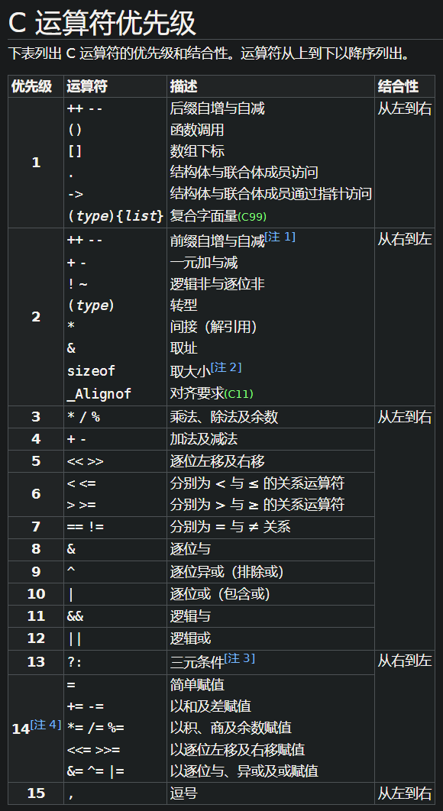

参考：https://zh.cppreference.com/w/c/language/operator_precedence


## 十一. 表达式求值

### 01. 整型提升

C语⾔中整型算术运算总是⾄少以缺省（默认）整型类型的精度来进⾏的。大小比int类型小的整型类型（char、short、unsinged char）整型运算时，都将提升为int类型进行计算。

为了获得这个精度，表达式中的字符和短整型操作数在使⽤之前被转换为普通整型，这种转换称为整型提升。

整型提升的意义：

> **表达式的整型运算要在CPU的相应运算器件内执⾏，CPU内整型运算器(ALU)的操作数的字节⻓度⼀般就是int的字节⻓度，同时也是CPU的通⽤寄存器的⻓度。**
>
> 因此，即使两个char类型的相加，在CPU执⾏时实际上也要先转换为CPU内整型操作数的标准⻓度。
>
> **通⽤CPU**（general-purpose CPU）是**难以直接实现两个8⽐特字节直接相加运算**（虽然机器指令中可能有这种字节相加指令）。所以，**表达式中各种⻓度可能⼩于int⻓度的整型值，都必须先转换为int或unsigned int，然后才能送⼊CPU去执⾏运算**。

```c
// 实例1
char a, b, c;
// ...
a = b + c;
```

b和c的值被提升为普通整型，然后再执⾏加法运算。

加法运算完成之后，结果将被截断，然后再存储于a中。

如何进⾏整体提升呢？

> 1. 有符号整数提升时，高位补充是按照变量的数据类型的符号位来提升的
> 2. ⽆符号整数提升，⾼位补0

```c
// 负数的整形提升
char c1 = -1;
// 变量c1的⼆进制位(补码)中只有8个⽐特位：1111 1111
// 因为 char 为有符号的 char
// 所以整形提升的时候，⾼位补充符号位，即为1
// 提升之后的结果是：
// 1111 1111 1111 1111 1111 1111 1111 1111

// 正数的整形提升
char c2 = 1;
// 变量c2的⼆进制位(补码)中只有8个⽐特位：0000 0001
// 因为 char 为有符号的 cha
// 所以整形提升的时候，⾼位补充符号位，即为0
// 提升之后的结果是：
// 0000 0000 0000 0000 0000 0000 0000 0001

// ⽆符号整形提升，⾼位补0
```

```c
char a = 5;
char b = 125;
char c = a + b;

// 1. a和b都是char类型，长度小于int类型的长度的，在计算的时候，默认会发生整型提升，转换为int类型进行运算
// a: 0000 0000 0000 0000 0000 0000 0000 0101
// b: 0000 0000 0000 0000 0000 0000 0111 1101
// a+b：0000 0000 0000 0000 0000 0000 1000 0010（补码）
// 因为c的类型也是char类型，所以在a+b的运算完成后，对结果进行截取为8位的结果
// char c：1000 0010（c的原码）

// 2.  
printf("%d": c); // ?
// %d：按照有符号整数的形式打印
// c进行提升，最高位符号位为1，根据有符号数提升按照符号位对高位进行补充，即：
// 1111 1111 1111 1111 1111 1111 1000 0010（内存中是补码形式）
// 解释为原码，补码转原码：符号位不变，其余取反，最后+1
// 1000 0000 0000 0000 0000 0000 0111 1101 + 1
// 1000 0000 0000 0000 0000 0000 0111 1110（原码）
// 所以最终c的结果为-106
```

### 02. 算术转换

如果某个操作符的各个操作数属于不同的类型，那么除⾮其中⼀个操作数的转换为另⼀个操作数的类型，否则操作就⽆法进⾏。下⾯的层次体系称为寻常算术转换。

```c
long double
double
float
unsigned long int
long int
unsigned int
int
```

如果某个操作数的类型在上⾯这个列表中排名靠后，那么⾸先要转换为另外⼀个操作数的类型后执⾏运算。

### 03. 问题表达式解析

1. 表达式1

   ```c
   // 表达式的求值部分由操作符的优先级决定。
   // 表达式1
   a*b + c*d + e*f
   ```

   表达式1在计算的时候，由于 * ⽐ + 的优先级⾼，只能保证， * 的计算是⽐ + 早，但是优先级并不能决定第三个 * ⽐第⼀个 + 早执⾏。

   所以表达式的计算机顺序就可能是：

   ```c
   a*b
   c*d
   a*b + c*d
   e*f
   a*b + c*d + e*f
   ```

   或者

   ```c
   a*b
   c*d
   e*f
   a*b + c*d
   a*b + c*d + e*f
   ```

2. 表达式2

   ```c
   // 表达式2
   c + --c;
   ```

   同上，操作符的优先级只能决定⾃减 -- 的运算在 + 的运算的前⾯，但是我们并没有办法得知， + 操作符的左操作数的获取在右操作数之前还是之后求值，所以结果是不可预测的，是有歧义的。

3. 表达式3

   ```c
   // 表达式3
   int main() {
     int i = 10;
     i = i-- - --i * ( i = -3 ) * i++ + ++i;
     printf("i = %d\n", i);
     return 0;
   }
   ```

   表达式3在不同编译器中测试结果：⾮法表达式程序的结果

   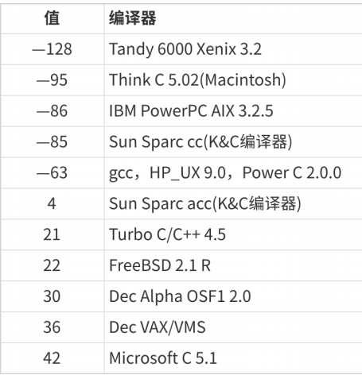

4. 表达式4

   ```c
   #include <stdio.h>
   int fun() {
     static int count = 1;
     return ++count;
   }
   int main() {
     int answer;
     answer = fun() - fun() * fun();
     printf( "%d\n", answer);//输出多少？
     return 0;
   }
   ```

   这个代码有没有实际的问题？有问题！

   虽然在⼤多数的编译器上求得结果都是相同的。

   但是上述代码 answer = fun() - fun() * fun(); 中我们只能通过操作符的优先级得知：先算乘法，再算减法。

   函数的调⽤先后顺序⽆法通过操作符的优先级确定。

5. 表达式5:

   ```c
   //表达式5
   #include <stdio.h>
   int main() {
     int i = 1;
     int ret = (++i) + (++i) + (++i);
     printf("%d\n", ret);
     printf("%d\n", i);
     return 0;
   }
   // 尝试在linux 环境gcc编译器，VS2013环境下都执⾏，看结果.
   ```

   gcc编译器执⾏结果：

   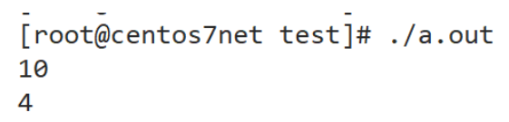

​	VS2022运⾏结果：	

​	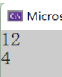

​	看看同样的代码产⽣了不同的结果，这是为什么？

​	简单看⼀下汇编代码，就可以分析清楚.

​	这段代码中的第⼀个 + 在执⾏的时候，第三个++是否执⾏，这个是不确定的，因为依靠操作符的优先

​	级和结合性是⽆法决定第⼀个 + 和第三个前置 ++ 的先后顺序。

### 04. 总结

即使有了操作符的优先级和结合性，我们写出的表达式依然有可能不能通过操作符的属性确定唯⼀的计算路径，那这个表达式就是存在潜在⻛险的，建议不要写出特别复杂的表达式。

> - C语言的同一套代码，在不同的编译器下计算路径可能不同，导致计算出的结果也有差异。
> - 解决的方式就是用表达式拆分或者括号控制计算顺序

