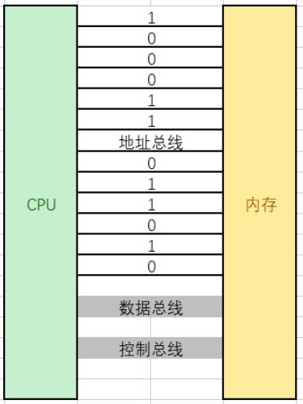
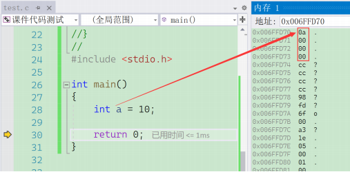
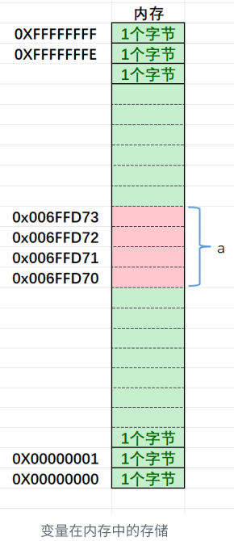
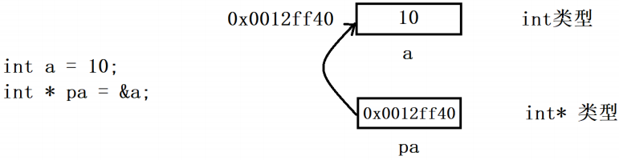
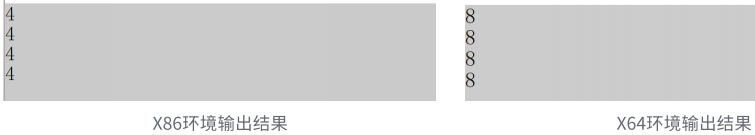

## 一. 内存和地址

### 01. 内存

在讲内存和地址之前，我们想有个⽣活中的案例：

假设有⼀栋宿舍楼，把你放在楼⾥，楼上有100个房间，但是房间没有编号，你的⼀个朋友来找你玩，如果想找到你，就得挨个房⼦去找，这样效率很低，但是我们如果根据楼层和楼层的房间的情况，给每个房间编上号，如：

```c
⼀楼：101，102，103...
⼆楼：201，202，203....
...
```

有了房间号，如果你的朋友得到房间号，就可以快速的找房间，找到你。


⽣活中，每个房间有了房间号，就能提⾼效率，能快速的找到房间。

如果把上⾯的例⼦对照到计算机中，⼜是怎么样呢？

我们知道计算机上CPU（中央处理器）在处理数据的时候，需要的数据是在内存中读取的，处理后的数据也会放回内存中，那我们买电脑的时候，电脑上内存是 8GB / 16GB / 32GB 等，那这些内存空间如何⾼效的管理呢？ 

其实也是把**内存划分为⼀个个的内存单元，每个内存单元的⼤⼩取1个字节**。

计算机中常⻅的单位（补充）：⼀个⽐特位可以存储⼀个2进制的位1或者0

```c
bit - ⽐特位
byte - 字节 // 1byte = 8bit
KB // 1KB = 1024byte
MB // 1MB = 1024KB
GB // 1GB = 1024MB
TB // 1TB = 1024GB
PB // 1PB = 1024TB
```

其中，每个内存单元，相当于⼀个学⽣宿舍，⼀个字节空间⾥⾯能放8个⽐特位，就好⽐同学们住的⼋⼈间，每个⼈是⼀个⽐特位。


每个内存单元也都有⼀个编号（这个编号就相当于宿舍房间的⻔牌号），有了这个内存单元的编号，CPU就可以快速找到⼀个内存空间。

⽣活中我们把⻔牌号也叫地址，在计算机中我们把内存单元的编号也称为地址。C语⾔中给地址起了新的名字叫：指针。

所以我们可以理解为：**内存单元的编号 == 地址 == 指针**

### 02. 如何理解编址



CPU访问内存中的某个字节空间，必须知道这个字节空间在内存的什么位置，⽽因为内存中字节很多，所以需要给内存进⾏编址(就如同宿舍很多，需要给宿舍编号⼀样)。计算机中的编址，并不是把每个字节的地址记录下来，⽽是通过硬件设计完成的。

钢琴、吉他 上⾯没有写上“剁、来、咪、发、唆、拉、西”这样的信息，但演奏者照样能够准确找到每⼀个琴弦的每⼀个位置，这是为何？因为制造商已经在乐器硬件层⾯上设计好了，并且所有的演奏者都知道。本质是⼀种约定出来的共识！

⾸先，必须理解，计算机内是有很多的硬件单元，⽽硬件单元是要互相协同⼯作的。所谓的协同，⾄少相互之间要能够进⾏数据传递。

但是硬件与硬件之间是互相独⽴的，那么如何通信呢？答案很简单，⽤"线"连起来。

⽽CPU和内存之间也是有⼤量的数据交互的，所以，两者必须也⽤线连起来。

不过，我们今天关⼼⼀组线，叫做地址总线。

硬件编址也是如此

我们可以简单理解，32位机器有32根地址总线，每根线只有两态，表⽰0,1【电脉冲有⽆】，那么⼀根线，就能表⽰2种含义，2根线就能表⽰4种含义，依次类推。32根地址线，就能表⽰2^32种含义，每⼀种含义都代表⼀个地址。

地址信息被下达给内存，在内存上，就可以找到该地址对应的数据，将数据在通过数据总线传⼊CPU内寄存器。


## 二. 指针变量和地址

### 01. 取地址操作符（&）

理解了内存和地址的关系，我们再回到C语⾔，**在C语⾔中，创建变量其实就是向内存申请空间**，⽐如：  



⽐如，上述的代码就是创建了整型变量a，内存中申请4个字节，⽤于存放整数10，其中每个字节都有地址，上图中4个字节的地址分别是：

```c
0x006FFD70
0x006FFD71
0x006FFD72
0x006FFD73
```

那我们如何能得到a的地址呢？

这⾥就得学习⼀个操作符(&)-取地址操作符

```c
int a = 10;
&a; // 取出a的地址
printf("%p\n", &a);
```

按照画图的例⼦，会打印处理：006FFD70

&a取出的是a所占4个字节中地址较⼩的字节的地址。



虽然整型变量占⽤4个字节，我们只要知道了第⼀个字节地址（较小的地址），顺藤摸⽠访问到4个字节的数据也是可⾏的。

### 02. 指针变量和解引用操作符（*）

1. 指针变量

   那我们通过取地址操作符(&)拿到的地址是⼀个数值，⽐如：0x006FFD70，这个数值有时候也是需要存储起来，⽅便后期再使⽤的，那我们把这样的地址值存放在哪⾥呢？答案是：指针变量中。

   ⽐如：

   ```c
   int a = 10;
   int * pa = &a; // 取出a的地址并存储到指针变量pa中
   ```

   指针变量也是⼀种变量，这种变量就是**⽤来存放地址的**，**存放在指针变量中的值都会理解为地址**。

2. 如何拆解指针类型

   我们看到pa的类型是 int* ，我们该如何理解指针的类型呢？

   ```c
   int a = 10;
   int * pa = &a;
   ```

   这⾥pa左边写的是 int* ， ***** 是在**说明pa是指针变量**，⽽**前⾯的 int** 是在**说明pa指向的是整型(int)类型的对象**。

   

   那如果有⼀个char类型的变量ch，ch的地址，要放在什么类型的指针变量中呢？

   ```c
   char ch = 'w';
   pc = &ch; // pc 的类型怎么写呢？
   
   // =>
   char * pc = &ch;
   ```

3. 解引⽤操作符

   我们将地址保存起来，未来是要使⽤的，那怎么使⽤呢？

   在现实⽣活中，我们使⽤地址要找到⼀个房间，在房间⾥可以拿去或者存放物品。

   C语⾔中其实也是⼀样的，我们只要拿到了地址（指针），就可以通过地址（指针）找到地址（指针）指向的对象，这⾥必须学习⼀个操作符叫解引⽤操作符(*)。

   ```c
   int a = 100;
   int* pa = &a;
   *pa = 0; // 解引用操作（间接访问操作）*p等价于a
   printf("%d\n", a); // 0
   ```

   上⾯代码中就使⽤了解引⽤操作符， *pa 的意思就是通过pa中存放的地址，找到指向的空间，pa其实就是a变量了；所以pa = 0，这个操作符是把a改成了0.

   这⾥如果⽬的就是把a改成0的话，写成 a = 0; 不就完了，为啥⾮要使⽤指针呢？

   其实这⾥是把a的修改交给了pa来操作，这样对a的修改，就多了⼀种的途径，写代码就会更加灵活，后期慢慢就能理解了。

### 03. 指针变量的大小

前⾯的内容我们了解到，32位机器假设有32根地址总线，每根地址线出来的电信号转换成数字信号后是1或者0，那我们把32根地址线产⽣的2进制序列当做⼀个地址，那么⼀个地址就是32个bit位，需要4个字节才能存储。

如果指针变量是⽤来存放地址的，那么指针变的⼤⼩就得是4个字节的空间才可以。

同理64位机器，假设有64根地址线，⼀个地址就是64个⼆进制位组成的⼆进制序列，存储起来就需要8个字节的空间，指针变量的⼤⼩就是8个字节。

```c
#include <stdio.h>
// 指针变量的⼤⼩取决于地址的⼤⼩
// 32位平台下地址是32个bit位（即4个字节）
// 64位平台下地址是64个bit位（即8个字节）
int main() {
  printf("%zd\n", sizeof(char *));
  printf("%zd\n", sizeof(short *));
  printf("%zd\n", sizeof(int *));
  printf("%zd\n", sizeof(double *));
  return 0;
}
```



> 结论：
>
> - 32位平台下地址是32个bit位，指针变量⼤⼩是4个字节
> - 64位平台下地址是64个bit位，指针变量⼤⼩是8个字节
> - 注意指针变量的⼤⼩和类型是⽆关的，只要是指针类型的变量，在相同的平台下，⼤⼩都是相同的。


## 三. 指针变量类型的意义

指针变量的⼤⼩和类型⽆关，只要是指针变量，在同⼀个平台下，⼤⼩都是⼀样的，为什么还要有各种各样的指针类型呢？

其实指针类型是有特殊意义的，我们接下来继续学习。

### 01. 指针的解引用

对⽐，下⾯2段代码，主要在调试时观察内存的变化。

```c
// 代码1
int n = 0x11223344;
int *pi = &n; 
*pi = 0;

// 代码2
int n = 0x11223344;
char *pc = (char *)&n;
*pc = 0;
```

调试我们可以看到，代码1会将n的4个字节全部改为0，但是代码2只是将n的第⼀个字节改为0。

> 结论：
>
> - 指针的类型决定了，对指针解引⽤的时候有多⼤的权限（⼀次能操作⼏个字节）。

⽐如： char* 的指针解引⽤就只能访问1个字节，⽽ int* 的指针的解引⽤就能访问4个字节。

### 02. 指针+-整数

先看⼀段代码，调试观察地址的变化。

```c
int n = 10;
char *pc = (char*)&n;
int *pi = &n;

printf("%p\n", &n); // &n = 00AFF974
printf("%p\n", pc); // &n = 00AFF974
printf("%p\n", pc+1); // &n = 00AFF975
printf("%p\n", pi); // &n = 00AFF974
printf("%p\n", pi+1); // &n = 00AFF978
```

我们可以看出， char* 类型的指针变量+1跳过1个字节， int* 类型的指针变量+1跳过了4个字节。

这就是指针变量的类型差异带来的变化。指针+1，其实跳过1个指针指向的元素。指针可以+1，那也可以-1。

> 结论：
>
> - 指针的类型决定了指针向前/后⾛⼀步有多⼤（距离）。
>
>   ```c
>   // 规律：
>   type* p;
>   p+i; // 相当于跳过i个type类型的数据，相当于跳过i*sizeof(type)个字节
>   
>   // 举例：
>   int* p;
>   p+2; // => 跳过了2个int类型的数据 => 2*sizeof(int)=8个字节
>   ```


