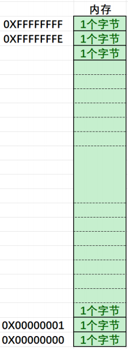

## 一. 内存和地址

### 01. 内存

在讲内存和地址之前，我们想有个⽣活中的案例：

假设有⼀栋宿舍楼，把你放在楼⾥，楼上有100个房间，但是房间没有编号，你的⼀个朋友来找你玩，如果想找到你，就得挨个房⼦去找，这样效率很低，但是我们如果根据楼层和楼层的房间的情况，给每个房间编上号，如：

```c
⼀楼：101，102，103...
⼆楼：201，202，203....
...
```

有了房间号，如果你的朋友得到房间号，就可以快速的找房间，找到你。


⽣活中，每个房间有了房间号，就能提⾼效率，能快速的找到房间。

如果把上⾯的例⼦对照到计算机中，⼜是怎么样呢？

我们知道计算机上CPU（中央处理器）在处理数据的时候，需要的数据是在内存中读取的，处理后的数据也会放回内存中，那我们买电脑的时候，电脑上内存是 8GB / 16GB / 32GB 等，那这些内存空间如何⾼效的管理呢？ 

其实也是把**内存划分为⼀个个的内存单元，每个内存单元的⼤⼩取1个字节**。

计算机中常⻅的单位（补充）：⼀个⽐特位可以存储⼀个2进制的位1或者0

```c
bit - ⽐特位
byte - 字节 // 1byte = 8bit
KB // 1KB = 1024byte
MB // 1MB = 1024KB
GB // 1GB = 1024MB
TB // 1TB = 1024GB
PB // 1PB = 1024TB
```

其中，每个内存单元，相当于⼀个学⽣宿舍，⼀个字节空间⾥⾯能放8个⽐特位，就好⽐同学们住的⼋⼈间，每个⼈是⼀个⽐特位。



每个内存单元也都有⼀个编号（这个编号就相当于宿舍房间的⻔牌号），有了这个内存单元的编号，CPU就可以快速找到⼀个内存空间。

⽣活中我们把⻔牌号也叫地址，在计算机中我们把内存单元的编号也称为地址。C语⾔中给地址起了新的名字叫：指针。

所以我们可以理解为：**内存单元的编号 == 地址 == 指针**


