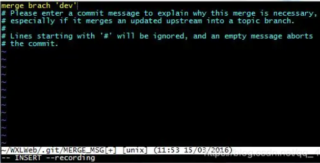

# 前言

---

合并分支出现 `Please enter a commit message to explain why this merge is necessary`



```bash
merge brach "test"
# Please enter a commit message to explain why this merge is necessary,
# especially if it merges an updated upstream into a topic branch. 
#
# Lines starting with '#' will be ignored, and an empty message aborts the commit.

# 请输入一个提交消息来解释为什么合并是必要的，  
# 特别是当它将更新后的上游合并到主题分支中时  
#   
# 以“#”开头的行将被忽略，空消息将中止提交。  
```

# 解决方法

---

- 不写原因直接按照下面3，4步骤，写原因则按1，2，3，4步骤
  1. 按键盘字母 `i` 进入 `insert` 模式
  2. 修改最上面那行黄色合并信息，可以不修改
  3. 按键盘左上角"`Esc`"
  4. 输入"`:wq`",注意是`冒号 + wq`，按回车键即可