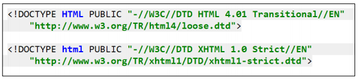
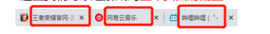
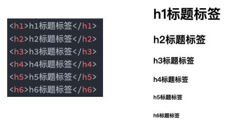
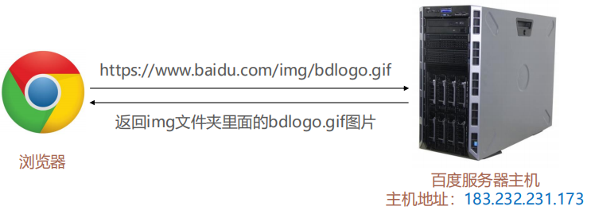
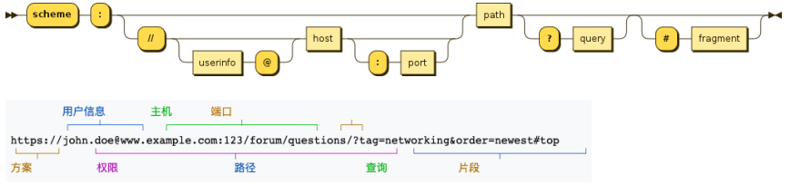
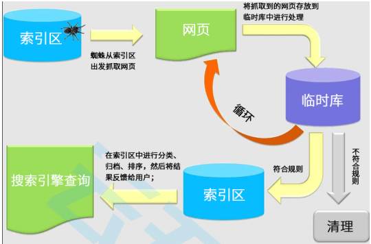

# 一. 完整的HTML结构

---

1. 文档声明
2. `HTML`元素
   - `head`元素
   - `body`元素

```html
<!DOCTYPE html>
<html>
  <head></head>
  <body>
    <!-- 这是一个完整的HTML结构 -->    
  </body>
</html>
```


# 二. 什么是文档声明？为什么需要文档声明

---

## 1. 文档声明的定义

- `HTML`最上方的一段文本我们称之为文档类型声明，**用于声明文档类型**

  ```html
  <!DOCTYPE html>
  ```

## 2. 为什么需要文档声明

- `HTML`文档声明，告诉浏览器当前页面是`HTML5`页面
- **让浏览器用`HTML5`的标准去解析识别内容**
- 必须放在`HTML`文档的最前面，不能省略，省略会出现兼容性问题

## 3. 版本比较

- `HTML5`的文档声明比`HTML4.01`、`XHTML1.0`简介很多（了解即可）

  


# 三. 什么是html元素？lang属性的作用是什么？

---

## 1. html(根)元素的定义

- `<html>`元素表示一个`HTML`文档的根（顶级元素），所以它也被称为**根元素**
  - 所有其他元素必须是**此元素的后代**

## 2. lang属性的作用和规则

- `W3C`标准建议为`html`元素增加一个`lang`属性，作用是
  - 帮助**语音合成工具**确定要使用的发音，即一些盲人使用语音合成工具访问网站，工具根据该属性翻译对应的语言
  - 帮助**翻译工具**确定要使用的翻译规则，即一些浏览器翻译插件会根据该属性对比用户所使用的语言，去判断是否提示翻译转换
- 常用的规则：
  - `lang = "en"`表示这个`HTML`文档的语言是英文
  - `lang = "zh-CN"`表示这个`HTML`文档的语言是中文

## 3. html元素与HTML元素的区别

- `html`元素：是指`<html></html>`根元素
- `HTML`元素：是指所有的`HTML`元素，如`<p>，<h1>，<head>，<html>`等


# 四. 什么是head元素？head元素常见的设置有哪些？

---

## 1. head元素的定义

- `head`元素规定文档相关的**配置信息**（也称为**元数据**），包括文档的标题，引用的文档样式和脚本等

### 	1.1 什么是元数据(`meta data`)

- 元数据就是描述数据的数据
- 在`HTML`中可以理解成，是对整个网页的一些配置信息

## 2. head元素常见的设置

### 2.1 网页的标题：`title`元素



```html
<title>网页的标题</title>
```


### 2.2 网页的编码：`meta`元素

- 可以用于设置网页的**字符编码**，让浏览器更精准的显示每一个文字，不设置或者设置错误会导致乱码

- 一般都使用`utf-8`编码（不区分大小写），涵盖了世界上几乎所有的文字

  ```html
  <meta charset="utf-8">
  ```


# 五. 什么是body元素?

---

- `body`元素里面的内容就是你在**浏览器窗口中看到的内容**，也就是**网页的具体内容和结构**

- **大部分`HTML`元素都是在`body`中编写**呈现的

  ```html
  <body>
    <div>我是body元素中的内容</div>
  </body>
  ```


# 六. HTMl元素内容补充

---

- `HTML`元素本身很多，但是常用的元素就是那么几个
  - https://developer.mozilla.org/zh-CN/docs/Web/HTML/Element
  - 我们只需要记住常用的，不常用的学会查看文档即可
- **常用的元素**（暂时掌握下面几个就够了，90%时间都在写这几个）：
  - `p`元素、`h`元素
  - `img`元素、`a`元素、`iframe`元素
  - `div`元素、`span`元素
- **下阶段学习的元素**：
  - `ul`、`ol`、`li`元素
  - `button`元素、`input`元素
  - `table`、`thead`、`tbody`、`thead`、`th`、`tr`、`td`
- `HTML5`新增元素（后续介绍）


# 七. 常见元素 - h元素

---

- 在一个页面中通常会有一些比较**重要的文字**作为标题，这个时候我们可以使用`h`元素 	

- `h1`-`h6`标题（`Heading`）元素呈现了六个不同的级别的标题

  

- 注意：`h`**元素通常和`SEO`优化有关系**（什么是`SEO`，后续介绍）


# 八. 常见元素 - `p`元素

---

- 如果我们想表示一个**段落**，这个时候可以使用`p`**元素**
- `HTML <p>`元素（或者说`HTML`段落元素）表示**文本的一个段落**
  - `p`元素是`paragraph`单词的缩写，是段落、分段的意思
  - `p`元素多个段落之间会有一定的间距


# 九. 常见元素 - img元素

---

## 1. img的使用

- 我们应该如何告诉浏览器来**显示一张图片**呢？使用`img`元素
- `HTML  `元素将一份图像嵌入文档
  - `img`是`image`单词的缩写，是图像、图像的意思
  - 事实上`img`是一个**可替换元素**（`replaced element`）
- `img`有两个常见的属性：
  - `src`属性（必须的）：`source`单词的缩写，表示源，包含了你想嵌入的图片的文件路径
  - `alt`属性：不是必须的，有两个作用：
    - 作用一：**当图片加载不成功（错误的地址或者图片资源不存在），那么会显示这段文本**
    - 作用二：屏幕阅读器会将这些**描述读给需要使用阅读器的使用者听**，让他们知道图像的含义
- `img`某些其他的属性目前已经不再使用
  - 比如`width`、`height`、`border`
  - 而是通过`css`样式去设置

## 2. 图片的路径

- 设置`img`的`src`时，需要给图片设置路径：

  - **网络图片**：一个`URL`地址（后续会专门讲`URL`）
  - **本地图片**：本地电脑上的图片，后续会和`html`文件一起部署到服务

- **本地图片的路径有两种方式**：

  - 方式一：**绝对路径**（几乎不用）

    - 从电脑的根目录（根盘符）开始一直找到资源的路径

      ```html
      
      ```

  - 方式二：**相对路径**（常用）

    - 相当于当前文件的一个路径

    - `.`代表当前文件夹（1个.），可以省略

    - `..`代表上一级文件夹（两个.）

      ```html
      <!-- 通过一个点 访问当前文件夹 -->
      
      <!-- 省略一个点 访问当前文件夹 -->
      
      <!-- 通过两个点 访问上一级文件夹 -->
      
      ```

> 注意：
>
> - 对于网页来说，不管什么操作系统（`Windows`，`Mac`，`Linux`），路径分隔符都是`/`，而不是`\`
> - 有一种特殊情况除外，就是`Windows`复制目录的时候默认是反斜杠`\`


# 十. 常见元素 - a元素

---

## 1. a元素的定义和属性

- 在网页中我们经常需要**跳转到另外一个链接**，这个时候我们使用`a`元素
- `HTML <a> `元素（或称锚（`anchor`）元素）：
  - 定义**超链接**，用于**打开新的**`URL`
- `a`元素有两个常见的属性：
  - `href`：`Hypertext Reference`（超文本引用）的简称
    - 指定要打开的`URL`地址
    - 也可以是一个本地地址
  - `target`：该属性指定在何处显示链接的资源
    - `_self`：默认值，在当前窗口打开`URL`
    - `_blank`：在一个新的窗口打开`URL`
    - 其他不常用，后面`iframe`可以讲一下

## 2. 锚点链接

- 锚点链接可以实现：**跳转到网页中的具体位置**

- 锚点链接有两个重要的步骤：

  - 在要跳到的元素上**定义一个`id`属性**
  
  - 定义`a`元素，并且`a`元素的**`href`指向对应的`id`**
  
    ```html
    <p id="one">段落一</p>
    <p id="two">段落二</p>
    <p id="three">段落三</p>
    
    <a href="#one">跳到段落一</a>
    <a href="#two">跳到段落二</a>
    <a href="#three">跳到段落三</a>
    ```
  

## 3. 图片链接

- 在很多网站我们会发现图片也是可以点击进行跳转的 

  - `img`元素跟`a`元素一起使用，可以实现**图片链接**

- 实现思路：

  - `a`元素中存放一个`img`元素
  - 也就是`img`元素是`a`元素的内容

  ```html
  <a href="https://www.mi.com/redmik50">
    
  </a>
  ```


## 4. a元素的其他用途

- `a`元素一定是用来跳转到新的网页么？

- 下载文件，指向对应的文件资源地址:
  - https://github.com/coderwhy/HYMiniMall/archive/master.zip
  
- 发送邮件，通过`mailto`协议完成:
  - `mailto:12345@qq.com`
  
    ```html
    <a href="https://github.com/coderwhy/HYMiniMall/archive/master.zip">下载压缩包</a>
    
    <a href="mailto:12345@qq.com">发送邮件到12345@qq.com</a>
    ```


# 十一. iframe元素

---

## 1. ifame的作用

- 利用`iframe`元素可以实现: 在一个`HTML`文档中嵌入其他`HTML`文档

## 2. frameborder属性

- 用于规定是否显示边框
  - `1`：显示
  - `0`：不显示

## 3. a元素target的其他值

- `_parent`: 在父窗口中打开`URL`
- `_top`: 在顶层窗口中打开`URL`

## 4. 如何防止网站被通过iframe技术嵌入打开

- 服务器在响应头设置`X-Frame-Options：SAMEORIGIN`


# 十二. div元素和span元素的历史

---

## 1. 英文含义

- 在`HTML`中**有两个特殊的元素`div`元素、`span`元素**
  - `div`元素：`division`，分开、分配的意思
  - `span`元素：跨域、涵盖的意思

## 2. 这两个元素有什么用呢？

- 无所用、无所不用

## 3. 产生的历史

- 网页的发展早期是没有`css`，为了让网页呈现的更多样化，后面就加了很多语义化元素（如`strong`、`i`、`del`等）
- 但是随着语义化的元素添加的越来越多，弊端也越来越明显，后来就出现了`css`，html只负责结构，`css`负责样式
- 但是后来发现如：`h1`元素既是普通的文本，又带有`css`样式，本质上结构和样式并没有完全分离
- 于是就新增了`div`和`span`两个元素，这个时候就出现了用`div`、`span`来编写网页所有结构，`css`来负责样式的潮流

- 所以，理论上来说：
  - 我们的网页可以没有`div`、`span`
  - 我们的网页也可以全是`div`、`span`


# 十三. `div`元素和`span`元素的区别

---

## 1. 为什么出现两个？

- 这个时候有一个问题：我出现一个不就可以了吗？
-  `div`元素和`span`元素都是**“纯粹的” 容器**，也可以把他们理解成**“盒子”**，它们都是用来**包裹内容**的
  - `div`元素：多个`div`元素包裹的内容会在不同的行显示
    - 一般作为其他元素的父容器，把其他元素包住，代表一个整体
    - 用于把网页分割为多个独立的部分
  - `span`元素：多个`span`元素包裹的内容会在同一行显示
    - 默认情况下，跟普通文本几乎没差别
    - 用于区分特殊文本和普通文本，比如用来显示一些关键字


# 十四. 不常用元素

---

## 1. strong元素

- 内容加粗、强调
  - 通常加粗会使用`css`样式来完成
  - 开发中很偶尔会使用一下

## 2. i元素

- 内容倾斜
  - 通常斜体会使用`css`样式来完成
  - 开发中偶尔会用它来做字体图标（因为看起来像是`icon`的缩写）

## 3. code元素

- 用于显示代码
  - 偶尔会使用用来显示等宽字体

## 4. br元素

- 换行元素
  - 开发中已经不使用

## 5. 更多元素详解，查看MDN文档

- https://developer.mozilla.org/zh-CN/docs/Web/HTML/Element


# 十五. HTML全局属性

---

## 1. 前言

- 我们发现**某些属性只能设置在特定的元素**中：
  - 比如`img`元素的`src`，`a`元素的`href`
- 也**有一些属性是所有`HTML`都可以设置和拥有**的，这样的属性我们称之为 **“ 全局属性（`Global Attributes`）”**
  - 全局属性有很多：https://developer.mozilla.org/zh-CN/docs/Web/HTML/Global_attributes

## 2.常见的全局属性

- `id`
  - 定义唯一标识符（`ID`），该标识符在整个文档中必须是唯一的。其目的是在链接（使用片段标识符），脚本或样式（使用`css`）时标识元素
- `class`
  - 一个以空格分隔的元素的类名（`classes`）列表，它允许`css`和`js`通过类选择器或者`DOM`方法来选择和访问特定的元素
- `style`
  - 给元素添加内联样式
- `title`
  - 包含表示与其所属元素相关信息的文本。这些信息通常可以作为提示呈现给用户，但不是必须的


# 十六. 字符实体

---

## 1. 什么是字符实体

- 思考：我们编写的`HTML`代码会被浏览器解析

- 如下代码是如何被解析的呢？

  - 如果你**使用小于号（`<`），浏览器会将其后的文本解析为一个标签（`tag`）**

  - 但是某些情况下，我们确实需要编写一个小于号（`<`）

  - 这个时候我们就可以使用**字符实体**

    ```html
    <span>
      <hehehe<
    </span>
    ```

- `HTML`字符实体是一段以**连字号（`&`）开头、以分号（`;`）结尾的文本**（字符串）：

  - 实体常常用于显示保留字符（这些字符会被解析为`HTML`代码）和不可见的字符（如“不换行空格”）

  - 你也可以用实体来代替其他难以用标准键盘键入的字符

    ```html
    <span>
      <!-- <hehehe> -->
      &lt;hehehe&gt;
    </span>
    ```

## 2. 常见的字符实体

|      |       描述        | 实体名称            | 实体编号  |
| :--: | :---------------: | :------------------ | --------- |
|      |       空格        | `&nbsp;`            | `&#160;`  |
|  <   |      小于号       | `&lt;`              | `&#60;`   |
|  >   |      大于号       | `&gt;`              | `&#62;`   |
|  &   |       和号        | `&amp;`             | `&#38;`   |
|  "   |      双引号       | ` &quot;`           | ` &#34;`  |
|  '   |      单引号       | `&apos;` (IE不支持) | `&#39;`   |
|  ￠  |    分（cent）     | `&cent;`            | `&#162;`  |
|  £   |    镑（pound）    | `&pound;`           | `&#163;`  |
|  ¥   |     元（yen）     | `&yen;`             | `&#165;`  |
|  €   |   欧元（euro）    | `&euro;`            | `&#8364;` |
|  §   |       小节        | `&sect;`            | ` &#167;` |
|  ©   | 版权（copyright） | `&copy;`            | `&#169;`  |
|  ®   |     注册商标      | `&reg;`             | `&#174;`  |
|  ™   |       商标        | `&trade;`           | `&#8482;` |
|  ×   |       乘号        | `&times;`           | ` &#215;` |
|  ÷   |       除号        | `&divide;`          | ` &#247;` |

- 完整的字符实体参考：https://www.w3school.com.cn/charsets/ref_html_8859.asp


# 十七. 认识URL

---

## 1. 什么是URL

- `URL`代表的是**统一资源定位符**（`Uniform Resource Locator`）

- 通俗的说：`URL`无非就是一个给定的独特**资源在`web`上的地址**
  - 理论上说，每个有效的`URL`都指向一个唯一的资源
  
  - 这个资源可以是一个`HTML`页面，一个`CSS`文档，一张图片等等
  
    

## 2. URL的格式

- `URL`的标准格式如下：
  
  - **[协议类型] : // [服务器地址] : [端口号] / [文件路径] [文件名] ? [查询] # 【片段ID】**
  
    
  

## 3. 和URI的区别

- 和`URI`的区别：
  - `URI = Uniform Resource Identifier` 统一资源**标志符，**用于标识`Web`技术使用的逻辑或物理资源
  - `URL = Uniform Resource Locator` 统一资源**定位符，**俗称网络地址，相当于网络中的门牌号
- `URI`在某一个规则下能把一个资源独一无二的识别出来
  - `URL`作为一个网络`Web`资源的地址，可以唯一将一个资源识别出来，所以`URL`是一个`URI`
  - 所以`URL`是`URI`的一个子集，但`URI`不一定是`URL`


# 十八. 元素语义化

---

## 1. 什么是元素语义化

- 元素的语义化：用正确的元素做正确的事情

## 2. 元素语义化的好处

- 理论上来说，所有的`HTML`元素，都能实现相同的事情

  - 实现的标题`h2`

  - 实现的标题`div`

  - 实现的标题`span`

    ```html
    <style>
      .title {
        margin: 20px 0;
        font-size: 24px;
        font-weight: 700;
      }
    </style>
    
    <h2>实现的标题h2</h2>
    <div class="title">实现的标题div</div>
    <span class="title">实现的标题span</span>
    ```

- 方便代码维护

- 减少开发者之间的沟通成本

- 能让语音 合成工具正确识别网页元素的用途，以便作出正确的反应

- 有利于`SEO`优化


# 十九. 什么是`SEO`？

---

## 1. 定义

- 搜索引擎优化（`search engine optimization`，缩写为`SEO`）是**通过了解搜索引擎的运作规则来调整网站，以及提高网站在有关搜索引擎内排名的方式**

## 2. 作用

- 以蛋糕网站为例：
  - 当用户去百度查找关于定制蛋糕的信息时，百度搜索引擎会根据蛋糕关键字去数据库中查找符合条件的数据返回给用户
  - 返回的数据排序规则会根据网站一些语义化的标题元素去进行排序，所包含的关键词数量越多，自然展示给用户时排名靠前

## 3. 搜索引擎原理

---



- 在后续我们会讲解`SPA`以及`SSR`相关的概念
  - 它们也与`SEO`、首屏渲染速度有关
  - 到时候会具体补充（为什么`SPA`页面不利于`SEO`优化，以及`SSR`的好处）


# 二十. 字符编码

---

## 1. 计算机是干什么的

- 计算机一开始发明出来时是用来**解决数字计算**问题的，后来人们发现，计算机还可以做更多的事，例如**文本处理**
- 但计算机其实挺笨的，它只“认识”010110111000…这样由**`0`和`1`两个数字组成的二进制**数字
- 这是因为**计算机的底层硬件实现就是用电路的开和闭两种状态来表示`0`和`1`两个数字的**
- 因此，计算机只可以直接存储和处理二进制数字

## 2. 什么是字符编码

- 为了在计算机上也**能表示、存储和处理像文字、符号等等之类的字符**，就必须将这些**字符转换成二进制**数字

  - 当然，肯定不是我们想怎么转换就怎么转换，否则就会造成同一段二进制数字在不同计算机上显示出来的字符不一样的情况，因此必须得定**一个统一的、标准的转换规则**

    

- 字符编码的发展历史可以阅读简书一篇文章：https://www.jianshu.com/p/899e749be47c


