# 一. 盒子模型

---

## 1. 认识盒子

- 生活中，我们经常会看到各种各样的盒子

  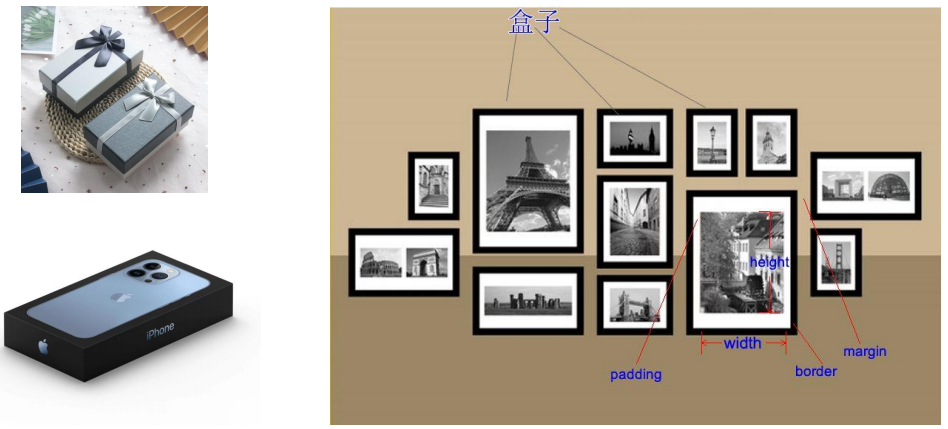

## 2. HTML每个元素都是盒子

- 事实上, 我们可以把`HTML`每一个元素看出一个个的盒子

  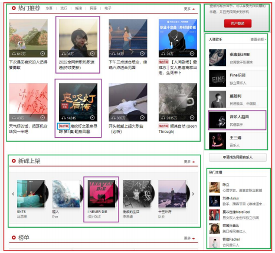

## 3. 盒子模型（Box Model)

- **`HTML`中的每一个元素都可以看做是一个盒子**，如右下图所示，可以具备这4个属性

- 内容（`content`）
  - 元素的内容`width/height`
  
- 内边距（`padding`）
  - 元素和内容之间的间距
  
- 边框（`border`）
  - 元素自己的边框
  
- 外边距（`margin`）
  - 元素和其他元素之间的间距
  
    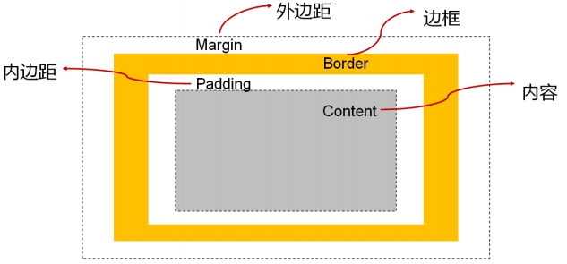

## 4. 盒子模型的四边

- 因为盒子有四边, 所以`margin/padding/border`都包括`top/right/bottom/left`四个边

  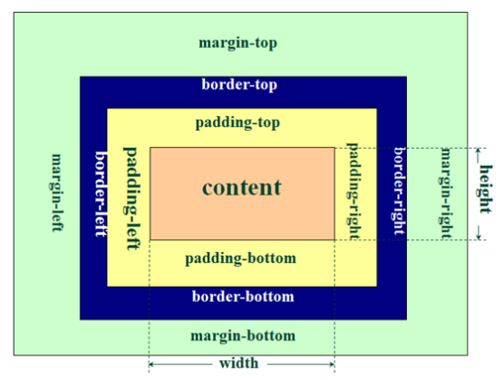

## 5. 在浏览器的开发工具中

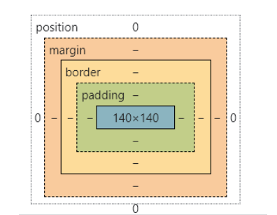

## 6. 内容 - 宽度和高度

- 设置内容是通过宽度和高度设置的
  - 宽度设置：`width`
  - 高度设置：`height`
- 注意：**对于行内级非替换元素来说，设置宽高是无效的**
- **宽高不设置的时候，默认是`auto`（即交给浏览器决定）**
  - 块级元素，`width`默认`auto`，是独占父元素的一行
  - 行内级非替换元素，`width`默认`auto`，是根据内容来决定的
  - 行内级替换元素，如`img`，宽高默认`auto`，浏览器会根据图片自身的宽高来显示的
- 另外我们可以设置如下属性：
  - `min-width`：最小宽度，无论内容多少，宽度都大于或等于`min-width`
  - `max-width`：最大宽度，无论内容多少，宽度都小于或等于`max-width`
  - 移动端适配时，可以设置最大宽度和最小宽度

- 下面两个属性不常用：
  - `min-height`：最小高度，无论内容多少，高度都大于或等于`min-height`
  - `max-height`：最大高度，无论内容多少，高度都小于或等于`max-height`

## 7. 内边距 - padding

- 设置盒子的内边距，通常用于设置**边框和内容之间的间距**

- `padding`包括四个方向，有如下的取值：
  
  - `padding-top`：上内边距
  - `padding-right`：右内边距
  - `padding-bottom`：下内边距
  - `padding-left`：左内边距
  
- **设置百分比相对的是包含块的宽度**

- `padding`单独编写是一个简写属性：
  
  - `padding-top、padding-right、padding-bottom、padding-left`的简写属性
  - `padding`缩写属性是从零点钟方向开始，沿着**顺时针**转动的，也就是**上右下左**
  
- `padding`并非必须是四个值，也可以有其他值

  | 值个数 | 例子                            | 代表的含义                                                   |
  | :----: | :------------------------------ | ------------------------------------------------------------ |
  |   4    | `padding: 10px 20px 30px 40px;` | `top: 10px`, `right: 20px`,  `bottom: 30px`, `left: 40px` |
  |   3    | `padding: 10px 20px 30px;`      | 缺少`left`，`left`使用`right`的值                            |
  |   2    | `padding: 10px 20px;`           | 缺少`left`，使用`right`的值， 缺少`bottom`，使用`top`的值 |
  |   1    | `padding: 10px;`                | `top/right/bottom/left`都使用10                              |

## 8. 边框 - border

- **`border`用于设置盒子的边框**
  
  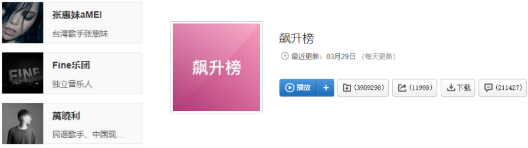
  
- 边框相对于`content/padding/margin`来说特殊一些

- 边框具备宽度`width`，样式`style`，颜色`color`

- 设置边框的方式
  - 边框宽度
    - `border-top-width、border-right-width、border-bottom-width、border-left-width`
    - `border-width`是上面4个属性的简写属性（`border-width`本身不能设置百分比）
  - 边框颜色
    - `border-top-color、border-right-color、border-bottom-color、border-left-color`
    - `border-color`是上面4个属性的简写属性
  - 边框样式
    - `border-top-style、border-right-style、border-bottom-style、border-left-style`
    - `border-style`是上面4个属性的简写属性
  
- 边框的样式设置值
  - 边框的样式有很多，可以了解如下的几个
  
  - `groove`：凹槽, 沟槽, 边框看上去好象是雕刻在画布之内
  
  - `ridge`：山脊, 和`grove`相反，边框看上去好象是从画布中凸出来
  
    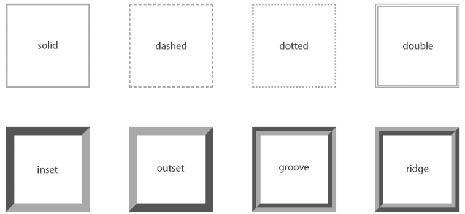
  
- 同时设置的方式
  - 如果我们相对某一边同时设置 宽度 样式 颜色, 可以进行如下设置: 
    - `border-top`
    - `border-right`
    - `border-bottom`
    - `border-left`
    - `border`：统一设置4个方向的边框
    
  - **边框颜色、宽度、样式的编写顺序任意**
  
    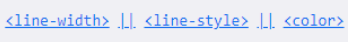
  
- 圆角 - `border-radius`
  - **设置盒子的圆角**
    
    
    
    - 常见的值：
    - 数值：通常用来设置小的圆角，比如`6px`
    - 百分比：通常用来设置一定的弧度或圆形
      - **百分比的计算值是相对于`boder-box` ，即内容 + 内边距 + 边框宽度组成**
      - 水平半轴相对于盒模型的宽度，垂直半轴相对于盒模型的高度，负值无效
  
- `border-radius`补充
  
  - 是一个简写属性
    - 将这四个属性`border-top-left-radius、border-top-right-radius、border-bottom-right-radius`，和`border-bottom、left-radius`简写为一个属性
    - 开发中比较少见一个个圆角设置
    
  - 如果一个元素是正方形, 设置`border-radius`大于或等于50%时，就会变成一个圆
    
    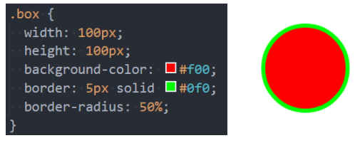

## 9. 外边距 - margin

- 设置**盒子的外边距,** 通常用于**元素和元素之间的间距**

- `margin`包括四个方向, 所以有如下的取值：
  
  - `margin-top`：上内边距
  - `margin-right`：右内边距
  - `margin-bottom`：下内边距
  - `margin-left`：左内边距
  
- `margin`单独编写是一个缩写属性：
  
  - `margin-top、margin-right、margin-bottom、margin-left`的简写属性
  
  - `margin`缩写属性是从零点钟方向开始, 沿着顺时针转动的, 也就是上右下左
  
  - `margin`的其他值
    
    | 值个数 | 例子                           | 代表的含义                                                   |
    | :----: | :----------------------------- | ------------------------------------------------------------ |
    |   4    | `margin: 10px 20px 30px 40px;` | `top: 10px`, `right: 20px`，  `bottom: 30px`, `left: 40px` |
    |   3    | `margin: 10px 20px 30px;`      | 缺少`left`，`left`使用`right`的值                            |
    |   2    | `margin: 10px 20px;`           | 缺少`left`，使用`right`的值，  缺少`bottom`，使用`top`的值 |
    |   1    | `margin: 10px;`                | `top/right/bottom/left`都使用10                              |
  
- 注意：
  - **设置值为百分比时，是相对于该元素的包含块的宽度（可以理解为：父元素）**
  - **对不可替换内联元素设置`margin-top、margin-bottom`无效**
  - **初始值都是`0`**
  - 从语义化的角度来说：
    - `margin`设置的应该是**兄弟元素**之间的间距的
    - `padding`设置的应该是**父子元素**之间的间距的

## 10. 上下margin的传递

- `margin-top`传递
  - 如果**块级元素的顶部线和父元素的顶部线重叠（边框紧挨着的时候）**，那么这个**块级元素的`margin-top`值会隐式的传递给父元素**
- `margin-bottom`传递
  - 如果**块级元素的底部线和父元素的底部线重叠（边框紧挨着的时候）**，且**父元素的高度是`auto`**，那么这个**块级元素的`margin-bottom`值会传递给父元素**
- 为什么会出现传递现象？
  - `W3C`在制定标准的时候，考虑到子元素和父元素顶部线重叠的时候，开发者设置相对于父元素的`margin-top`，可能是写错了，应该是设置父元素的`margin-top`，而子元素和父元素之间的间距，应该用`padding`设置的，所以就出现上下`margin`传递现象
- 如何防止出现传递问题？
  - 给**父元素设置**`padding-top/padding-bottom`（推荐）
  - 给**父元素设置`border`**，`boder`不能为`0`
  - 触发`BFC`：**设置`overflow`为`auto`**，让该元素无法将`margin`传递出去
- 建议
  - `margin`一般是用来**设置兄弟元素之间的间距**
  - `padding`一般是用来**设置父子元素之间的间距**

## 11. 上下margin的折叠

- **垂直方向上相邻的2个`margin（margin-top、margin-bottom）`有可能会合并为1个**`margin`，这种现象叫做**`collapse`（折叠）**

- **水平方向上的`margin（margin-left、margin-right）`永远不会`collapse`**

- 为什么会出现`collapse`折叠现象？
  - `W3C`在制定标准的时候，考虑到如果垂直方向上相邻的两个元素设置`margin-top、margin-bottom`，觉得没必要，只要设置一个即可，开发者可能写错了，所以就帮我们折叠成一个`margin`，导致出现上下`margin`折叠现象
  
- 折叠后最终值的计算规则
  - 两个值进行比较，**取较大的值**
  
- 如何防止`margin collapse`？
  - **只设置其中一个元素的`margin`**
  
- 上下`margin`折叠的出现情况
  - 两个兄弟块级元素之间上下`margin`的折叠
  
  - 父子块级元素之间`margin`的折叠
  
    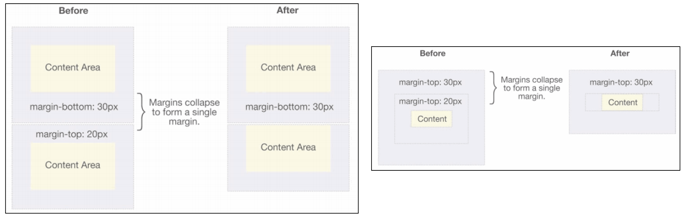

## 12. margin: 0, auto；让块级元素居中的原理

- 因为块级元素的`width`默认值是`auto`，且块级元素是独占父元素的一行，独占一行时，就没有居中不居中的说法了
- 即使你给块级元素设置一定的宽度，块级元素仍然是占据父元素的一行的
- 对于块级元素(`block box`)独占一行时，块级元素的宽度是等于內部`box`的宽度+`padding `+`border`+`margin `(`padding`、`border`、`margin`默认都为0)
  - **当内部块级元素独占父元素一行时**，可以得出一个公式：
    - **父元素宽度 = 内部块级元素宽度 + 内部块级元素`margin-left` + 内部块级元素`margin-right`**
- 而当块级元素有一定的宽度但小于父元素一行的宽度时，浏览器会发现该元素无法占据一行了
- 这个时候，浏览器会优先让我们内部`box`的宽度设置生效，而父元素一行的宽度减去内部`box`的宽度，剩下的距离会分配给该元素对应的`margin`，**如果该元素在父元素最左(右)端，即剩下的距离会全部分给子元素的`margin-right（left）`**
- 所以我们设置该元素左右`margin`为`auto`即可，浏览器会自动平分剩余的空间给左右的`margin`

> 注意：
>
> - 当某个元素的左右`margin`为`auto`，且**该元素的宽度大于视口的宽度时，浏览器会让该元素的`margin-right`为负值来使得上面的公式保持成立**

## 13. 外轮廓 - outline

- **表示元素的外轮廓**
  - 不占用空间
  - 默认显示在`border`的外面
  
- 相关属性有：

  | 属性            | 含义                                                         |
  | --------------- | ------------------------------------------------------------ |
  | `outline-width` | 外轮廓的宽度                                                 |
  | `outline-style` | 取值跟`border`的样式一样，比如`solid、dotted`等              |
  | `outline-color` | 外轮廓的颜色                                                 |
  | `outline`       | `outline-width | style | color`的简写属性，跟`border`用法类似 |

- 应用实例
  - **去除`a`元素、`input`元素的`focus`轮廓效果**

## 14. 盒子阴影 - box-shadow

- **设置一个或多个阴影**
  
  - 每个阴影用`<shadow>`表示
  - 多个阴影用`,`隔开，从前到后叠加
  
- `<shadow>`的常见格式如下
  
  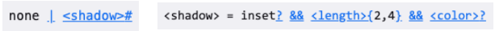
  
  - 第1个`<length>`：`offset-x`，水平方向的偏移，正数往右偏移
  - 第2个`<length>`：`offset-y`，垂直方向的偏移，正数往下偏移
  - 第3个`<length>`：`blur-radius`，模糊半径
  - 第4个`<length>`：`spread-radius`，延伸半径
  - `<color>`：阴影的颜色，如果没有设置，就跟随`color`属性的颜色
  - `inset`：外框阴影变成内框阴影
  
- 我们可以通过一个网站测试盒子的阴影：
  - https://html-css-js.com/css/generator/box-shadow/

## 15. 文字阴影 - text-shadow

- 设置文字的阴影效果
  - `<shadow>`的常见格式如下
    
    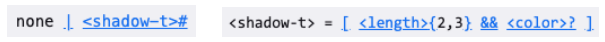
    
    - 相对于`box-shadow`，它没有`spread-radius`的值
  
- 我们可以通过一个网站测试文字的阴影：
  - https://html-css-js.com/css/generator/box-shadow/

## 16. 行内非替换元素注意事项

- **设置`width`、`height`无效**
  
  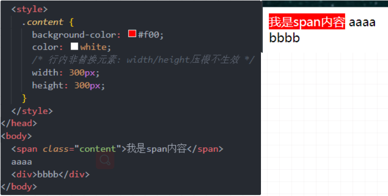
  
- **设置`padding-top`、`padding-bottom`，上下会被撑起来，但不占据空间**
  
  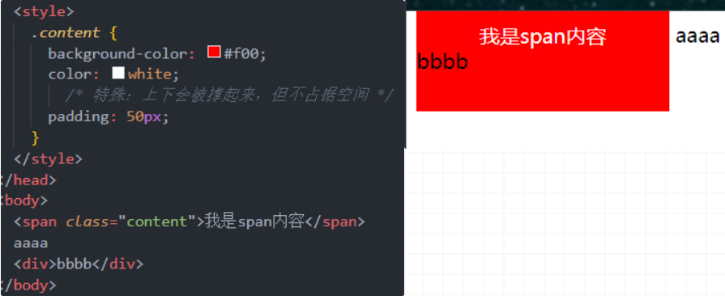
  
- **设置`border-top-width`、`border-bottom-width`，上下会被撑起来，但不占据空间**
  
  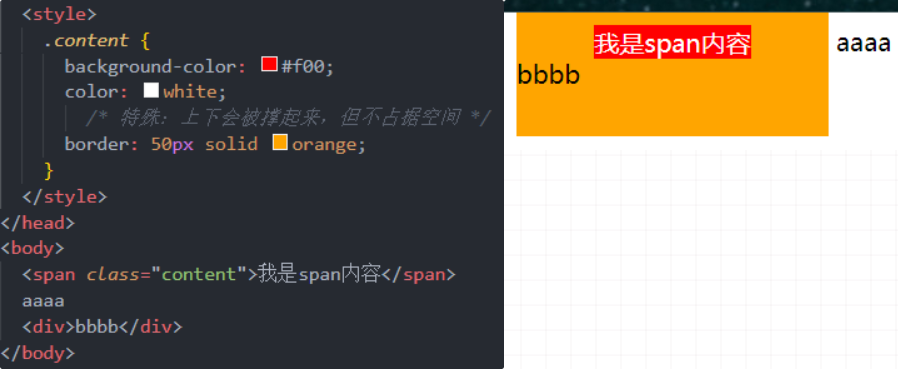
  
- **设置`margin-top`、`margin-bottom`不会生效**
  
  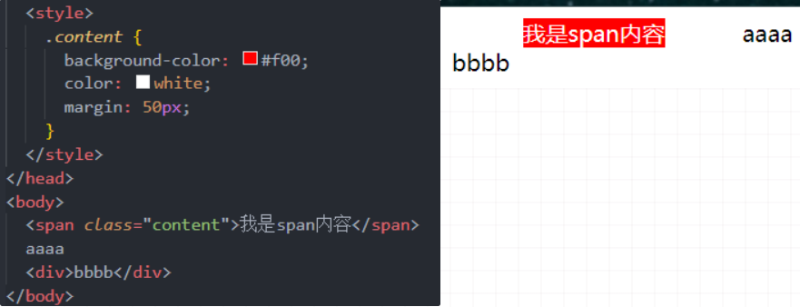
  
- 为什么行内非替换元素在使用盒子模型这些属性的时候，会有这些问题呢？
  - `W3C`在制定标准的时候，考虑到行内元素一般都是一行一行的呈现，如果你给某一个行内非替换元素设置垂直方向的上下`margin,border,padding`这些的时候，会破坏整个段落的美感，所以就对这些元素设置这类属性的时候不生效
  - 即：**行内非替换元素设置垂直方向的上下`margin、border、padding`这类属性的时候不生效**

## 17. 背景色和前景色设置的是哪些

- 背景色有设置到`border`下面
  - 设置范围：`content `+`padding `+`border`
- `border`在没有设置颜色的情况下，会使用前景色，如果没有设置(继承)前景色，则会使用默认的颜色，如果**`border`颜色设置为透明`transparent`的情况下，就能看到`border`下的背景色了**

## 18. CSS属性 - box-sizing

- **设置盒子模型中宽高的行为**

  - `content-box`（默认值）
    
    - 设置的`width、height`，只是`content`内容的宽高
    
    - `padding、border`都布置在`width、height`外边
    
    - 元素实际占用宽 / 高 = `border + padding + width / height`
    
      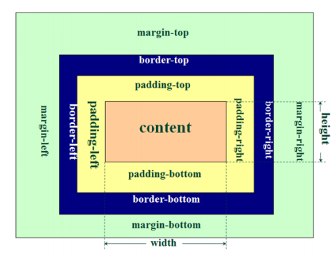
    
  - `border-box`
    
    - 设置的`width、height`，是元素实际占用的宽高
    
    - `padding、border`都布置在`width、height`里边
    
      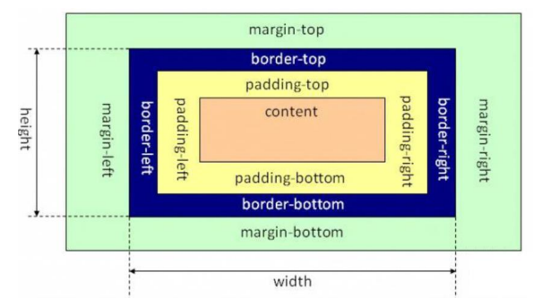
    
  - `border-box`即`IE`盒子模型（`IE8`以下浏览器），又叫怪异盒模型
    
    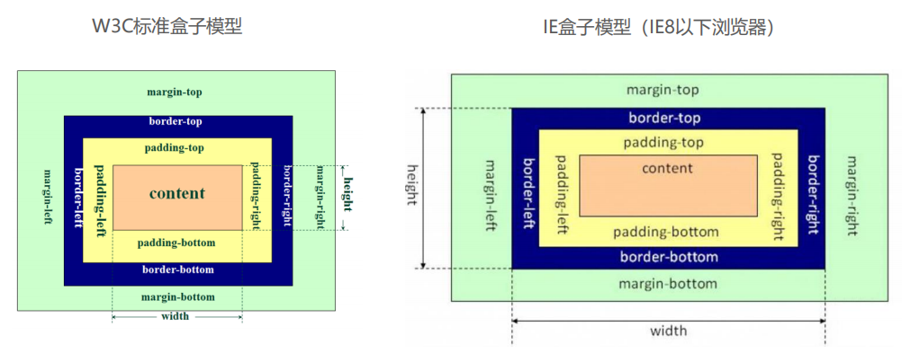
  
  > 注意：
  >
  > - `box-sizing`**生效的前提是，有明确的设置宽度和高度**

## 19. 元素的水平居中方案

- 在一些需求中，需要元素在父元素中水平居中显示（父元素一般都是块级元素、`inline-block`） 
- **行内级元素（行内非替换元素、行内替换元素、`inline-block`）**
  - 水平居中：在父元素中设置`text-align: center;`
- **块级元素**
  - 水平居中：`margin: 0 auto;`

# 二. CSS设置背景

---

## 1. background-image

- 设置元素的背景图片
  - **盖在(不是覆盖)`background-color`的上面**
- **可以设置多张图片**
  - 设置的**第一张显示在最上面**，其他图片按顺序层叠在下面

> 注意：
>
> - **元素如果没有具体的宽高，背景图片是不会显示出来的**

## 2. background-repeat

- **设置背景图片是否要平铺**
- 常见的值有
  - **`repeat`（默认值）：平铺**
  - `no-repeat`：不平铺
  - `repeat-x`：只在水平方向平铺
  - `repeat-y`：只在垂直方向平铺

## 3. background-size

- **设置背景图片的大小**
  - **`auto`（默认）：以背景图自身大小显示**
  - `contain`：缩放背景图，**保持宽高比的情况下，缩放至完全装入背景区（容器）**
  - `cover`：缩放背景图，**保持宽高比的情况下，缩放至完全覆盖铺满背景区（容器），超出部分裁剪**
  - `<percentage>`：百分比，相对于背景区(`background position area`)
  - `length`：具体的大小，如`100px`

## 4. background-position

- **设置背景图片在水平、垂直方向上的具体位置**
  
  - 可以设置具体的值：如`20px 30px`
  
  - 水平方向可以设值：`left、center、right`
  
  - 垂直方向可以设值：`top、center、bottom`
  
  - **如果只设置了一个方向，另一个方向默认是`center`**
  
    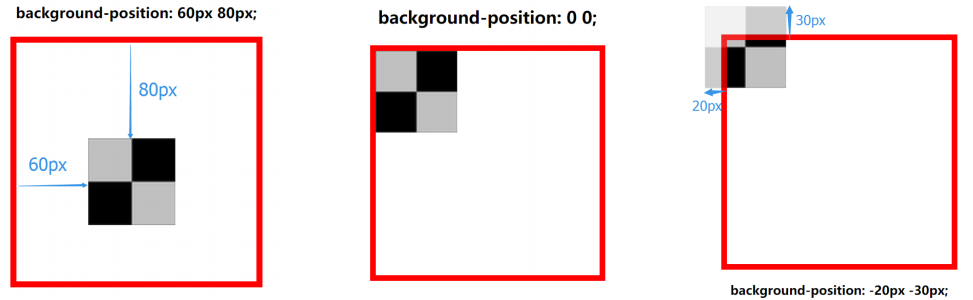
  

## 5. background-attachment

- **决定背景图像的位置是在视口内固定，或是随着包含它的区块滚动**
- 可以设置的值：
  - `scroll`（默认）：表示背景相对于元素本身固定，而不是随着它的内容滚动
  - `local`：表示背景相对于元素的内容固定。如果一个元素拥有滚动机制，背景将会随着元素的内容滚动
  - `fixed`：表示背景相对于视口固定。即使一个元素拥有滚动机制，背景也不会随着元素的内容滚动

## 6. background

- **是一系列背景相关属性的简写属性**

- `background-size`可以省略，如果不省略，**`/background-size`必须紧跟在`background-position`的后面**

- 其他属性也都可以省略，顺序任意

  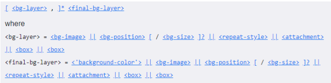

## 7. backgroun-image 与 img 对比

- 利用`background-image`和`img`都能够实现显示图片的需求，在开发中该如何选择?

  |                        |       `img`       | `background-image` |
  | :--------------------: | :---------------: | :----------------: |
  |          性质          |    `HTML`元素     |     `CSS`样式      |
  |    图片是否占用空间    |         ✔         |         ❎          |
  | 浏览器右键直接查看地址 |         ✔         |         ❎          |
  |    支持`CSS Sprite`    |         ❎         |         ✔          |
  | 更有可能被搜索引擎收录 | ✔（结合`alt`属性) |         ❎          |

> 总结：
>
> - `img`，作为网页内容的重要组成部分，比如广告图片、`LOGO`图片、文章配图、产品图片
>
>   `background-image`，可有可无。有，能让网页更加美观。无，也不影响用户获取完整的网页内容信息

