# 一. 标准流（文档流）

---

## 1. 认识标准流

- **默认情况下，元素都是按照`normal flow`（标准流、常规流、正常流、文档流【`document flow`】）进行布局**
  
  - **从左到右，从上到下**按顺序摆放好
  
  - **默认情况下，互相之间不存在层叠现象**
  
    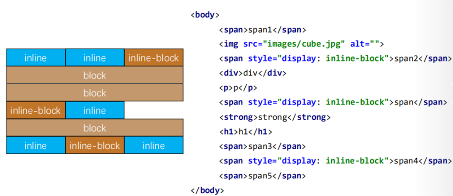
  

## 2. margin-padding位置调整

- 在标准流中，可以使用`margin`、`padding`对元素进行定位
  - 其中`margin`还可以设置负数
- **比较明显的缺点是**
  - 设置一个元素的`margin`或者`padding`，通常**会影响到标准流中其他元素的定位效果**
  - 不便于实现元素层叠的效果
- 如果我们希望一个元素可以跳出标准流，单独的对某个元素进行定位呢?
  - 我们可以通过`position`属性来进行设置


# 二. CSS元素定位

---

## 1. 认识元素的定位

- 定位允许您从正常的文档流布局中取出元素，并使它们具有不同的行为：
  - 例如放在另一个元素的上面
  - 或者始终保持在浏览器视窗内的同一位置
  
- 定位在开发中非常常见:
  
  

## 2. 认识position属性

- 用`position`可以对元素进行定位
  - 常用取值有5个: 
    - `static`（默认值）：静态定位
    - **使用下面的值，可以让元素变成定位元素**（`positioned element`）
    - `relative`：相对定位
    - `absolute`：绝对定位
    - `fixed`：固定定位
    - `sticky`：粘性定位

## 3. 静态定位 - static

- `position`属性的默认值
  - 默认情况下，元素的`position`属性值都是`static`(静态定位)
  - 静态定位的元素，都按照`normal flow`布局
  - **静态定位的元素，设置`left、right、top、bottom`无效**
  - **只有元素变为定位元素的时候，设置`left、right、top、bottom`才有效**

## 4. 相对定位 - relative

- **元素不脱离标准流，按照`normal flow`布局**

- 可以通过设置`left、right、top、bottom`进行定位

  - **设置值为百分比时，是相对于该元素的包含块（可以理解为：父元素），如果包含块没有显示的指定宽高，则值计算为`auto`，就会出现设置百分比值时，没有效果的现象**
  - **设置值为数值时，定位参照对象是元素自身在文档标准流中原来的位置**

- `left、right、top、bottom`用来设置元素的具体位置，对元素的作用如下图所示
  
  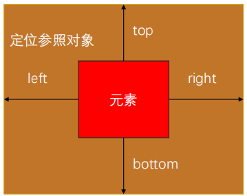
  
- 相对定位的应用场景
  - 在**不影响其他元素位置**的前提下，**对当前元素位置进行微调**

- 相对定位练习

  

  - 使上图在浏览器水平视图大小改变时，保持水平居中

    - 解决方案一：

      - 设置为块元素的背景图片，`background-position`设置为`center`即可

    - 解决方案二：

      ```css
      img {
        position: relative;
        left: -960px; /* 为图片宽度的一半 */
        /* left、margin值为百分比时，相对的都是该元素的包含块（可以理解为：父元素） */
        margin-left: 50%;
      }
      ```

    - 解决方案三：

      ```css
      img {
        /* transform、translate值为百分比时，相对的是包围框的大小(该元素自身) */
        transform: translate(-50%);
        /* margin值为百分比时，相对的是该元素的包含块（可以理解为：父元素） */
        margin-left：50%; 
      }
      ```
      


## 5. 固定定位 - fixed

- **元素脱离`normal flow`（脱离标准流、脱标）**
- 可以通过`left、right、top、bottom`进行定位
- **定位参照对象是视口（`viewport`）**
- 当画布滚动时，固定不变

## 6. 画布和视口

- **视口（`Viewport`）**
  - 文档的可视区域
  - 如下图红框所示
  
- **画布（`Canvas`）** 
  - 用于渲染文档的区域
  - 文档内容超出视口范围，可以通过滚动查看
  - 如下图黑框所示
  
- **宽高对比**
  - 画布 >= 视口
  
    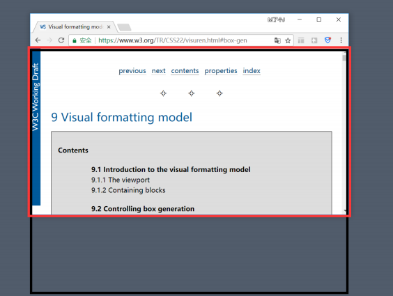

## 7. 绝对定位 - absolute

- 元素脱离`normal flow`（脱离标准流、脱标）
- 可以通过`left、right、top、bottom`进行定位
  - 定位参照对象是**最近的定位祖先元素**
  - 如果**找不到这样的祖先元素，参照对象是视口**
- **定位元素**（`position element`）
  - `position`值不为`static`的元素（元素`position`值默认为`static`）
  - 也就是`position`值为`relative、absolute、fixed、sticky`的元素

## 8. 子绝父相

- 在大多数情况下，子元素的绝对定位都是相对父元素进行定位的
- 如果希望子元素相对父元素进行定位，又不希望父元素脱离标准流，常用方案是：
  - 父元素设置`position：relative`（让父元素成为定位元素，且父元素不脱离标准流）
  - 子元素设置`position：absolute`
  - 简称：子绝父相

## 9. position值为absolute/fixed元素的特点（一） 

- **可以随意设置宽高，宽高默认由内容决定**
- **不再受标准流的约束**
  - 不再严格按照从上到下，从左到右布局
  - 不再严格区分块级(`block`)、行内级(`inline`)，行内块级(`inline-block`)的很多特性都会消失
- **不再给父元素汇报宽高数据**
  - 如果父元素没有设置高度，默认高度是由其内容决定的，如果这时候其内部的子元素`position`值都为`absolute/fixed`时，子元素的宽高将不再汇报给父元素，就会导致父元素宽高为`0`
- **脱标元素内部默认还是按照标准流布局**

## 10. position值为absolute/fixed元素的特点（二）

- **绝对定位元素**（`absolutely positioned element`）
  - `position`值为`absolute`或`fixed`的元素
- 对于绝对定位元素来说
  - **定位参照对象的宽度 = 绝对定位元素的实际占用宽度 +`left`+`right`+`margin-left`+`margin-right`**
  - **定位参照对象的高度 = 绝对定位元素的实际占用高度 +`top`+`bottom`+`margin-top`+`margin-bottom`**

> 注意：
>
> - **在未设置宽高的情况下，浏览器在`auto`默认分配的时候会优先分配给元素的宽高，在绝对定位元素`top`，`bottom`为`0`的情况下，元素高度会默认拉伸至包含块的高度，在`left`，`right`为`0`的情况下，元素宽度会默认拉伸至包含块的宽度**

- 如果希望绝对定位元素的宽高和定位参照对象一样，可以给绝对定位元素设置以下属性
  - **宽度一致**：

    ```css
    {
      left: 0;
      right 0;
      margin-left: 0;
      margin-right: 0;
    }
    ```

    - 由上面公式推出，在没有给绝对定位元素设置宽度时，浏览器会自动将定位参照对象剩余空间分配给绝对定位元素的宽度

  - **高度一致**：

    ```css
    {
      top: 0;
      bottom 0;
      margin-top: 0;
      margin-bottom: 0;
    }
    ```

    - 由上面公式推出，在没有给绝对定位元素设置高度时，浏览器会自动将定位参照对象剩余空间分配给绝对定位元素的高度

- 如果希望绝对定位元素在定位参照对象中**垂直水平居中显示**，可以给绝对定位元素设置以下属性：

  ```css
  {
    left: 0;
    right: 0;
    top: 0;
    bottom: 0;
    /*上面四行可以简写为 inset: 0; */
    margin: auto;
  }
  ```

  - 另外，还**得有具体的宽高值**（宽高小于定位参照对象的宽高）

## 11. auto到底是什么？

- `auto` => **交给浏览器来决定**
- `width：auto`
  - 行内非替换元素`width`：包裹内容
  - 块级元素`width`：包含块的宽度
  - 绝对定位元素`width`：包裹内容

## 12. 粘性定位 - sticky

- 可以看做是**相对定位和固定(绝对)定位的结合体**

- `sticky`允许被定位的元素**表现得像相对定位一样**，直到它滚动到某个阈值点

- 当**达到该阈值点**时，就会**变成固定(绝对)定位**

  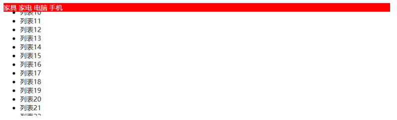

- `sticky`是**相对于最近的包含滚动视口的祖先元素**（`the nearest ancestor scroll container's scrollport`）
  - **如果找不到该祖先元素，参照对象将会是视口**

## 13. position值的对比

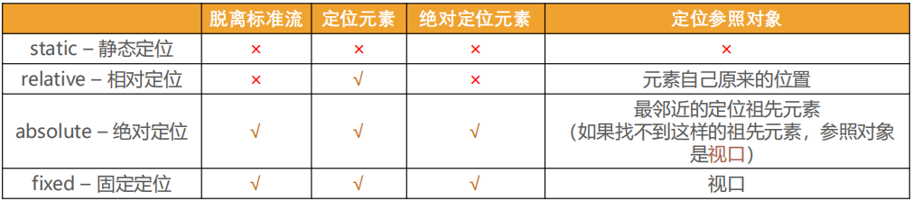

## 14. CSS属性 - z-index

- 设置定位元素的层叠顺序（**仅对定位元素有效**）
  - 取值可以是：正整数、负整数、0
  
    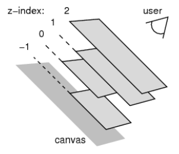
  
- `z-index`之间比较原则:
  
  - **兄弟关系**
    - `z-index`越大，层叠在越上面
    - `z-index`相等，后写的那个元素层叠在上面
  - **非兄弟关系**
    - **各自从元素自己以及祖先元素中，找出最邻近的`2`个设置有`z-index`属性的定位元素进行比较**


# 三. CSS元素浮动

---

## 1. 认识浮动

- `float`属性可以指定一个元素应沿其容器的左侧或右侧放置，允许文本和内联元素环绕它
  - `float `属性最初只用于在一段文本内浮动图像, 实现文字环绕的效果
  - 但是早期的`CSS`标准中并没有提供好的左右布局方案, 因此在一段时间里面它成为网页多列布局的最常用工具
- **绝对定位（`position`值为`absolute`、`fixed`）、浮动都会让元素脱离标准流**，以达到灵活布局的效果
- **浮动元素是可以设置宽高的，默认是包裹内容的宽高**
- 可以通过`float`属性让元素产生浮动效果，`float`的常用取值
  - `none`：不浮动，默认值
  - `left`：向左浮动
  - `right`：向右浮动

## 2. 浮动规则一

- **元素一旦浮动后, 脱离标准流，不再严格区分元素是块级元素还是行内元素**
  - **朝着向左或向右方向移动，直到自己的边界紧贴着包含块（一般是父元素）或者其他浮动元素的边界为止**
  
  - **定位元素会层叠在浮动元素上面**
  
    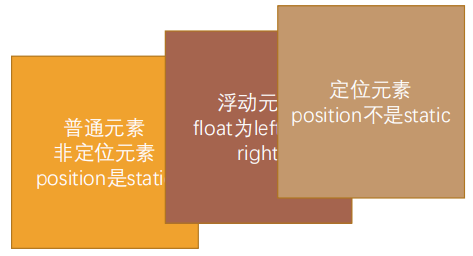
  

## 3. 浮动规则二

- 如果元素是向左（右）浮动，浮动元素的左（右）边界不能超出包含块的左（右）边界

  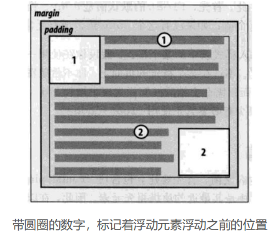

## 4. 浮动规则三

- **浮动元素之间不能层叠**
  
  - 如果一个元素浮动，另一个浮动元素已经在那个位置了，后浮动的元素将紧贴着前一个浮动元素（左浮找左浮，右浮找右浮）
  
  - 如果水平方向剩余的空间不够显示浮动元素，浮动元素将向下移动，直到有充足的空间为止
  
    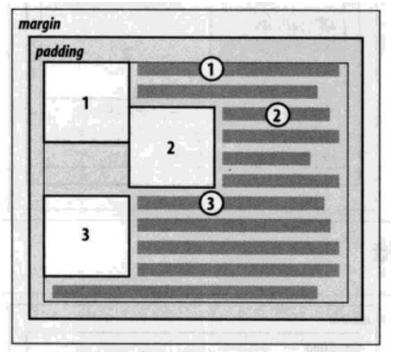
  

## 5. 浮动规则四

- **浮动元素不能与行内级内容层叠，行内级内容将会被浮动元素推出**
  - 比如行内级元素、`inline-block`元素、块级元素的文字内容
  
    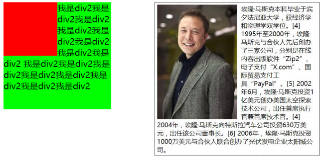
  

## 6. 浮动规则五

- **行内级元素、`inline-block`元素浮动后，其顶部将与所在行的顶部对齐**
  
  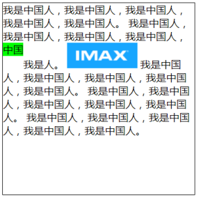

## 7. 多个行内级元素、inline-block元素水平间隙，中间空格（空隙）去除的解决方案

- 为什么会有空隙？
  - **浏览器将换行符解析成像空格一样的东西，所以产生这种空隙**
  - **多个空格浏览器只会解析成一个空格**

- 删除换行符（不推荐，影响代码阅读性）
- 将父级元素的`font-size: 0;`，但是需要子元素将`font-size`设置回来
  - 因为空格跟文字大小相关，将元素`font-size`设置为0，其内部的空格就不会有尺寸了

- 通过子元素统一向一个方向浮动即可（兼容低版本浏览器）
  - 因为浮动元素之间是紧挨着的

- 设置父元素`flex`布局

## 8. 不同元素margin设置为负值的影响

- **块级元素未设置`width`时，默认`auto`，浏览器会让其独占一行，如果设置`margin`为负值**
  - 则根据公式：父元素宽度 = 块级元素实际宽度 + `margin`，可推出，`margin`为负值时，浏览器为了保持`W3C`标准规定的公式，会给块级元素宽度添加上等同于`margin`设置的值的正数，以达到符合公式
- **行内级元素设置`margin`为负值**
  - 该元素会根据`margin-left/margin-right`向左/右移动

## 9. 浮动的问题 - 高度的塌陷

- 由于浮动元素脱离了标准流，变成了**脱标元素**，所以**不再向父元素汇报高度**
  - 父元素计算总高度时，**就不会计算浮动子元素的高度，导致了高度坍塌的问题**
- 解决父元素高度坍塌问题的过程，一般叫做清浮动（清理浮动、清除浮动）
- 清浮动的目的是
  - 让父元素计算总高度的时候，把浮动子元素的高度算进去
- 如何清除浮动呢? 使用`clear`属性

## 10. CSS属性 - clear

- `clear`属性是做什么的呢? 
  - `clear `属性可以**指定一个元素是否必须移动(清除浮动后)到在它之前的浮动元素下面**
- `clear`的常用取值：
  - `left`：要求元素的顶部低于之前生成的所有左浮动元素的底部
  - `right`：要求元素的顶部低于之前生成的所有右浮动元素的底部
  - `both`：要求元素的顶部低于之前生成的所有浮动元素的底部
  - `none`：默认值，无特殊要求
- 那么我们可以利用这个特性来清除浮动

## 11. 清除浮动的方法

- 事实上我们有很多方法可以清除浮动

- **方法一：给父元素设置固定高度**

  - 扩展性不好（不推荐）

- **方法二：在父元素最后增加一个空的块级子元素，并且让它设置**`clear: both`

  - 会增加很多无意义的空标签，维护麻烦
  - 违反了结构与样式分离的原则（不推荐）

- **方法三：给父元素增加`::after`伪元素，通过添加一个空的虚拟元素来设置`clear`属性**

  ```css
  .clear_fix::after {
    content: '';
    clear: both;
    display: block; /* 伪元素默认是行内非替换元素，默认宽高是根据内容来的，如果不设置内容，则压根没有宽高的，没有宽高，意味着根本不占据位置的，给clear是没有意义的。所以设置为块元素，默认宽度会占满包含块的一行 */
    /* 浏览器兼容，有些浏览器内核对于空的伪元素会自动显示些乱七八糟的内容或者是添加高度 */
    visibility: hidden;
    height: 0;
  }
  
  .clear_fix {
    /* 兼容IE6/7，早期一些ie会对这种空的伪元素做一些放大的操作 */
    *zoom: 1; /* 不缩放 */
  }
  ```

  - 纯`CSS`样式解决，结构与样式分离（推荐）

  - 编写好后可以轻松实现清除浮动
  
- **方法四：触发`BFC`**

## 12. 布局方案总结

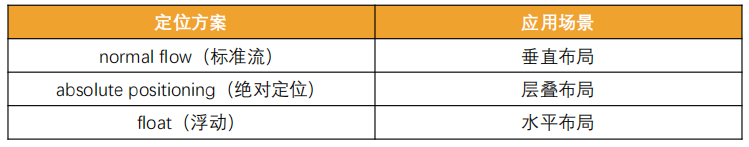


​	