# 一. `flex`布局

---

## 1. 认识flexbox

- `Flexbox`翻译为**弹性盒子**：
  - 弹性盒子是一种用于**按行或按列布局元素的一维布局方法**
    - `grid`布局是二维的，但是出现的相对晚些，兼容性不太好，功能是比`flex`强大
  - 元素可以**膨胀以填充额外的空间，收缩以适应更小的空间**
  - 通常我们使用`flexbox`来进行布局的方案称之为`flex`布局（`flex layout`）
- `flex`布局时目前`web`开发中使用最多的布局方案：
  - `flex`布局（`Flexible`布局，弹性布局）
  - 目前特别在**移动端可以说已经完全普及**
  - 在**`PC`端也几乎已经完全普及和使用**，只有非常少数的网站需要兼容低版本浏览器的依然在用浮动来布局
- 为什么需要`flex`布局呢？
  - 长久以来，`css`布局中唯一可靠而且浏览器兼容的**布局工具只有`floats`和`positioning`**
  - 但是这两种方法本身**存在很大的局限性**，并且他们用于布局实在是无奈之举
- 如何让元素变成一个弹性盒子`flexbox`呢？
  - `display: flex;`

## 2. 原先布局存在的痛点

- 原来的布局存在哪些痛点呢? 举例说明:
  - 比如在父内容里面**垂直居中一个块内容**
  
    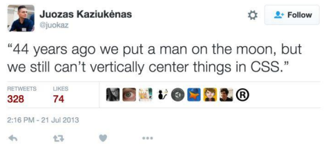
  
  - 比如使容器的**所有子项等分可用宽度/高度，而不管有多少宽度/高度可用**
  - 比如使**多列布局中的所有列采用相同的高度**，即使**它们包含的内容量不同**

## 3. flex布局的出现

- 所以长久以来, 大家非常期待一种真正可以用于对元素布局的方案: 于是`flex`布局出现了
  - `Nature and nature's laws lay hid in night; God said "Let Newton be" and all was light`
  - 自然与自然的法则在黑夜隐藏，于是上帝说，让牛顿出现吧！于是世界就明亮了起来
  
- **`flexbox`在使用时, 我们最担心的是它的兼容性问题:** 
  
  - 我们可以在`caniuse`上查询到具体的兼容性
  
    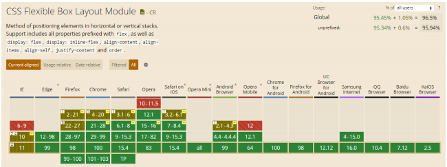
  

## 4. flex布局的重要概念

- 两个重要的概念：
  - **开启了`flex`布局的元素叫做`flex container`**
  
  - `flex container`里面的**直接子元素叫做`flex item`**
  
    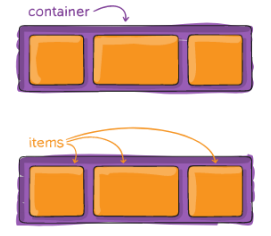
  
- **当`flex container`中的子元素变成了`flex item`时**，具备以下特点：
  
  - `flex item`的布局**将受`flex container`属性的设置来进行控制和布局**
  - `flex item`**不再严格区分块级元素和行内级元素**
  - `flex item`**默认情况下宽高是包裹内容的，可以设置宽高**
  
- 设置`display`属性为`flex`或者`inline-flex`可以成为`flex container`
  - `flex`: `flex container`以`block-level`**形式存在**
  - `inline-flex`: `flex container`以`inline-level`**形式存在**

## 5. flex布局的模型

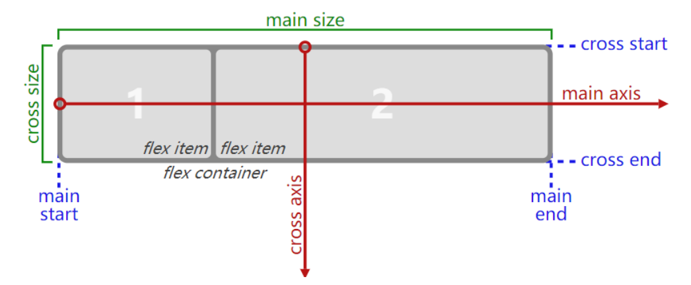

## 6. flex相关的属性


### 6.1 flex container相关的属性

#### flex-direction

- `flex items `默认都是沿着` main axis`（主轴）从` main start `开始往` main end `方向排布

- `flex-direction `**决定了` main axis `的方向**，有4个取值：
  
  - `row`（默认值）、`row-reverse`、`column`、`column-reverse`
  
    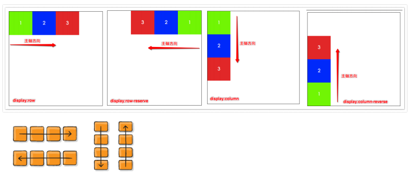
  

#### flex-wrap

- `flex-wrap`决定了`flex container`**是单行还是多行**
  
  - `nowrap`（默认）：单行
  
  - `wrap`：多行
  
  - `wrap-reverse`：多行（对比`wrap、cross start`与` cross end `相反）
  
    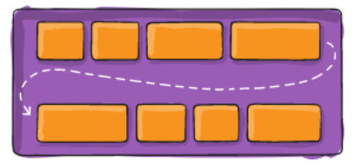
  

#### flex-flow

- `flex-flow`属性是`flex-direction `**和` flex-wrap `的简写**
  
  - 顺序任意，并且都可以省略
  
    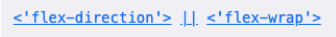
  

#### justify-content

- **`justify-content `决定了` flex items `在` main axis `上的对齐方式**
  
  - `flex-start`(默认值)：让` flex items `与`main start`对齐
  
  - `flex-end`：让`flex items `与` main end `对齐
  
  - `center`：居中对齐
  
  - `space-between`：
    
    - 同一行中的`flex items`之间的距离相等
    - 与`main start、main end`两端对齐
    
  - `space-around`：
    
    - 同一行中的`flex items`之间的距离相等
    - `flex items`与`main start、main end`之间的距离是`flex items`之间距离的一半
    
  - `space-evenly`：
    
    - 同一行中的`flex items`之间的距离相等
    
    - `flex items`与`main start、main end`之间的距离等于`flex items`之间的距离
    
      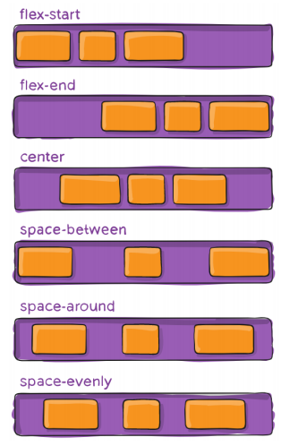
  

#### align-items

- `align-items `**决定了` flex items `在` cross axis `上的对齐方式**
  
  - `normal`：在弹性布局中，效果和`stretch`一样（默认值），均匀分布项目，拉伸自动大小的项目直至填充盒子
  
  - `stretch`：**当`flex items`在` cross axis `方向的`size`为`auto `时，会自动拉伸至填充` flex container`**
  
  - `flex-start`：与` cross start `对齐
  
  - `flex-end`：与` cross end `对齐
  
  - `center`：居中对齐
  
  - `baseline`：与基准线对齐
  
    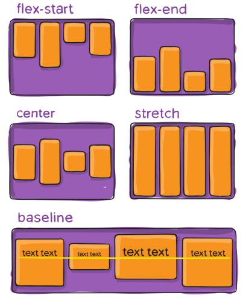
  

#### align-content

- 该属性**对单行弹性盒子模型无效**（即：带有`flex-wrap: nowrap`）

- `align-content `**决定了多行` flex items `在` cross axis `上的对齐方式，用法与` justify-content `类似**
  
  - `stretch`(默认值)：与` align-items `的`stretch `类似
  
  - `flex-start`：与` cross start `对齐
  
  - `flex-end`：与` cross end `对齐
  
  - `center`：居中对齐
  
  - `space-between`：
    
    - 同一行中的` flex items `之间的距离相等
    - 与` cross start、cross end`两端对齐
    
  - `space-around`:
    - 同一行中的` flex items `之间的距离相等
    - `flex items `与` cross start、cross end `之间的距离是` flex items `之间距离的一半
    
  - `space-evenly`: 
    - 同一行中的` flex items `之间的距离相等
    
    - `flex items `与` cross start、cross end `之间的距离 等于` flex items `之间的距离
    
      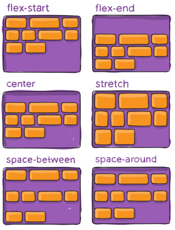
  
  

### 6.2 flex items相关的属性

#### order

- `order `**决定了` flex items `的排布顺序**
  
  - 可以设置任意整数（正整数、负整数、0），**值越小就越排在前面**
  
  - 默认值是 0
  
    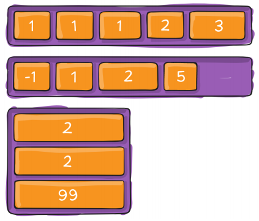
  

#### align-self

- `flex items `**可以通过` align-self `覆盖` flex container `设置的` align-items`**
  
  - `auto`(默认值)：遵从` flex container `的` align-items `设置
  
  - `stretch、flex-start、flex-end、center、baseline`，效果跟` align-items `一致
  
    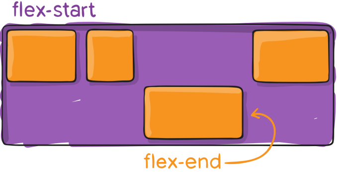
  

#### flex-grow

- `flex-grow `**决定了` flex items `如何扩展(拉伸/成长)** 
  
  - 可以设置任意非负数字（正小数、正整数、0），**默认值是 0** 
  - **当` flex container `在` main axis `方向上有剩余`size `时，`flex-grow `属性才会有效**
  
-  如果所有` flex items `的` flex-grow `总和`sum `超过 1，每个` flex item `扩展的`size `为 
  - `flex container `的剩余` size * flex-grow / sum`
  
    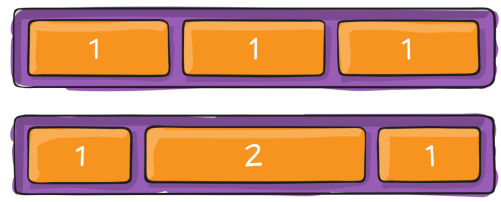
  
  - `flex items `**扩展后的最终`size `不能超过` max-width\max-height`**

> 注意：
>
> - **当`flex items`没有设置具体的宽高且该`flex items`自身`display`值为`flex`时，其内部`item`文字内容单行不换行时，且内容溢出时，`flex-grow`会扩展出去，设置该`flex items`的`overflow:hidden`即可**


#### flex-shrink

- `flex-shrink `**决定了` flex items `如何收缩(缩小)**
  - 可以设置任意非负数字（正小数、正整数、0），**默认值是 1** 
  - **当` flex items `在` main axis `方向上超过了` flex container `的`size`，`flex-shrink `属性才会有效**
- 如果所有` flex items `的` flex-shrink `总和超过 1，每个` flex item `收缩的`size`为
  - `flex items `超出` flex container `的`size `* 收缩比例 / 所有`flex items`的收缩比例之和
- `flex items `**收缩后的最终`size `不能小于` min-width\min-height`**

> 注意：
>
> - `img`不会收缩


#### flex-basis

- **设置` flex items` 在` main axis `方向上的` base size`**
  - `auto`(默认值)、具体的宽度数值（`100px`） 
- 决定` flex items `最终` base size `的因素，从优先级高到低
  - `max-width\max-height\min-width\min-height`
  - `flex-basis`
  - `width\height`
  - 内容本身的` size`
- `flex-grow`**为`0`的情况下，`flex-basis`为`0`的话，会导致`item`元素`base`宽度为`0`，如果内容有元素的话会呈多行显示，每行只显示一个单词（汉字）**

#### flex

- `flex `是` flex-grow `||` flex-shrink `||` flex-basis `的简写，`flex `属性可以指定1个，2个或3个值

  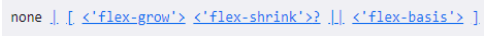

- **单值语法**：值必须为以下其中之一: 
  
  - **一个无单位数(`<number>`)：它会被当作`<flex-grow>`的值，`<flex-shrink>`的值被假定为`1`，然后`<flex-basis>`的值被假定为`0`**
  - 一个有效的宽度(`width`)值：它会被当作` <flex-basis>`的值
  - 关键字`none`，`auto`或`initial`
  
- **双值语法**：第一个值必须为一个无单位数，并且它会被当作` <flex-grow> `的值
  
  - 第二个值必须为以下之一：
    - 一个无单位数：它会被当作` <flex-shrink> `的值
    - 一个有效的宽度值：它会被当作` <flex-basis> `的值
  
- **三值语法**：
  
  - 第一个值必须为一个无单位数，并且它会被当作` <flex-grow> `的值
  - 第二个值必须为一个无单位数，并且它会被当作` <flex-shrink> `的值
  - 第三个值必须为一个有效的宽度值， 并且它会被当作` <flex-basis> `的值

## 7. 常见问题的解决方案

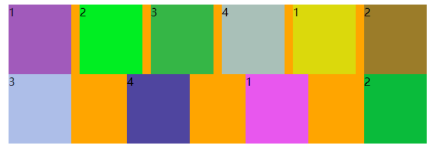

- 类似上面使用`justify-content：space-between`最后一行可能会遇到的情况
- 方法一：
  - 不设置`space-between`，给每个元素添加`margin-right`，最右边的`margin-right: 0;`
- 方法二：
  - 在`flex items`最后面添加几个没有内容的元素即可，**推荐`i`元素**
    - `flex items`不区分块级、行内级，默认宽高由内容决定，需要**设置添加的元素宽度等同于`item`的宽度**，**高度设置为`0`不可见**
    - 所以不给`i`元素添加内容，则没有宽高，就看不见，但是在`space-between`中，仍然会对添加的`i`元素进行排布
  - 添加个数：**排布的列数 - 2**

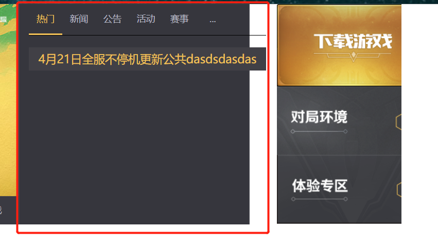

- 类似上面这种，给红框中间的`flex`子元素设置`flex：1;`，内层的元素设置`nowrap`的情况下，内容超出的时候，会将`flex`子元素撑开

  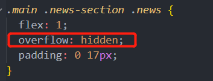

- 给`flex`为`1`的`item `设置` overflow：hidden`即可解决

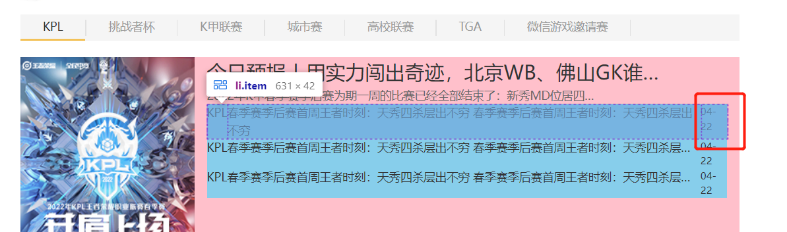

- 如上图所示，`flex`容器中，因为连字符的一些影响导致红框的子元素内容本应该显示在一行的，却出现断字的情况
  - 方法一：
    - 使用不间断连字符，`ctrl `+`shift `+连字符键
  - 方法二：
    - 使用类似`-`符号的字符实体：`&minus`
  - 方法三：
    - 给内容溢出排不下的子元素设置`flex: 1;`


- 当浏览器窗口宽度减少的时候，主`banner`图宽度固定，保持图片核心内容居中显示

  ```css
  /* 方案一：img结构 */
  img {
    position: relative;
    transform: translateX(-50%);
    left: 50%;
  }
  
  /* 方案二：背景图 */
  background: url(../img/main_bg.jpg) no-repeat center top;
  ```


# 二. 去除元素内容滚动时默认的滚动条

---

- 这里以类名为`box`的元素为例子

  ```css
  /* 去除类名为box的元素滚动时的滚动条 */
  .box::-webkit-scrollbar {
    display: none;
  }
  ```
  
  


