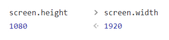

# 一. 媒体查询

---

## 1. 定义

- 媒体查询是一种提供给开发者**针对不同设备需求进行定制化开发的一个接口**

- 你可以根据设备的类型（比如屏幕设备、打印机设备）或者特定的特性（比如屏幕的宽度）来修改你的页面

- 媒体查询的使用方式主要有三种：
  - 方式一：通过`@media`和`@import`使用不同的`CSS`规则（常用）
  
    ```css
    /* @import可以结合媒体查询一起使用 */
    @import url(./css/body_bgc.css) (max-width: 800px);
    ```
  
  - 方式二：使用`media`属性为`<style>`, `<link>`,` <source>`和其他`HTML`元素指定特定的媒体类型
    
    ```html
    <link rel="stylesheet" medie="screem amd (max-width: 800px)" href="./css/body_bgc.css">
    ```
    
  - 方式三：通过使用`@media`来使用不同的`CSS`规则
    
    ```css
    @media (min-width: 500px) and (max-width: 800px) {
      body {
        background-color: orange;
      }
    }
    ```
    
  - 方式四：使用`Window.matchMedia() `和`MediaQueryList.addListener() `方法来测试和监控媒体状态

## 2. 媒体类型 Media types

- 在使用媒体查询时，你必须指定要使用的媒体类型
  - 媒体类型是**可选的**，并且会**默认（隐式地）应用`all`** 类型
- 常见的媒体类型值如下：
  - `all`：适用于所有设备
  - `print`：适用于在打印预览模式下在屏幕上查看的分页材料和文档
  - `screen`：主要用于屏幕
  - `speech`：主要用于语音合成器
- 被废弃的媒体类型：
  - `CSS2.1 `和` Media Queries 3 `定义了一些额外的媒体类型(`tty, tv, projection, handheld, braille, embossed, 以及 aural`)
  - 但是他们在`Media Queries 4 `中已经被废弃，并且不应该被使用
  - `aural`类型被替换为具有相似效果的`speech`

## 3. 媒体特性Media feature

- 媒体特性描述了 浏览器、输出设备，或是预览环境的**具体特征**
  - 通常会将媒体特性描述为一个**表达式**
  
  - 每条媒体特性表达式都**必须用括号括起来**
  
    |             特征              |                 价值                  | 最小/最大 |        描述        |
    | :---------------------------: | :-----------------------------------: | :-------: | :----------------: |
    |          宽度`width`          |                 长度                  |   是的    |   渲染表面的宽度   |
    |         高度`height`          |                 长度                  |   是的    |   渲染表面的高度   |
    |          颜色`color`          |                 整数                  |   是的    | 每个颜色分量的位数 |
    | 设备比例`device-aspect-ratio` |               整数/整数               |   是的    |       长宽比       |
    |    设备高度`device-width`     |                 长度                  |   是的    |   输出设备的高度   |
    |    设备宽度`device-height`    |                 长度                  |   是的    |   输出设备的宽度   |
    |       方向`orientation`       |      `"portrait"`或`"landscape"`      |    不     |      屏幕方向      |
    |      分辨率`resolution`       | 分辨率（`"dpi"`，`"dpcm"`或`"dppx"`） |   是的    |       解析度       |

## 4. 逻辑操作符logical operators

- 媒体查询的表达式最终会获得一个`Boolean`值，也就是真（`true`）或者假（`false`）
  - 如果结果为真（`true`），那么就会生效
  - 如果结果为假（`false`），那么就不会生效
  
-  如果有多个条件，我们可以通过逻辑操作符联合复杂的媒体查询
  
  | 条件       | 作用                                                         |
  | ---------- | ------------------------------------------------------------ |
  | `and`      | 用于将多个媒体查询规则组合成单条媒体查询                     |
  | `not`      | 用于否定媒体查询，如果不满足这个条件则返回`true`，否则返回`false` |
  | `only`     | 仅在整个查询匹配时才用于应用样式                             |
  | `, `(逗号) | 用于将多个媒体查询合并为一个规则                             |
  
- 比如下面的媒体查询，表示：屏幕宽度大于500，小于700的时候，`body`背景颜色为红色

  ```css
  @media screen and (min-width: 500px) and (max-width: 700px) {
    body {
      background-color: #f00;
    }
  }
  ```

## 5. 常见移动端设备

- 以`iPhone`为例：

  

  ```css
  /* 
  320~375之间 font-size: 15px;
  375~414之间 font-size: 18px;
  414~480之间 font-size: 21px;
  大于480px font-size: 24px
  */
  /* @media (min-width: 320px) and (max-width: 375px) {
  .box { font-size: 15px; }
  }
  @media (min-width: 375px) and (max-width: 414px) {
  .box { font-size: 18px; }
  }
  @media (min-width: 414px) and (max-width: 480px) {
  .box { font-size: 21px; }
  }
  @media (min-width: 480px) {
  .box { font-size: 24px; }
  } */
  
  /* CSS层叠性 */
  @media (min-width: 320px) {
    .box { font-size: 15px; }
  }
  @media (min-width: 375px) {
    .box { font-size: 18px; }
  }
  @media (min-width: 414px) {
    .box { font-size: 21px; }
  }
  @media (min-width: 480px) {
    .box { font-size: 24px; }
  }
  ```
  
  - 这是一种简写方式，跟上面注释代码效果是一致的


# 二. CSS常见单位详解

---

- 前面编写的`CSS`中，我们经常会使用`px`来表示一个长度（大小），比如`font-size`设置为18px，`width`设置为100px
- `px`是一个长度（`length`）单位，事实上`CSS`中还有非常多的长度单位
- 整体可以分成两类：
  - 绝对长度单位（`Absolute length units`）
  - 相对长度单位（`Relative length units`）

## 1. CSS中的绝对单位

- 绝对单位：
  - 它们与其他任何东西都没有关系，通常被认为总是相同的大小
  
  - 这些值中的大多数在用于打印时比用于屏幕输出时更有用，例如，我们通常不会在屏幕上使用cm
  
  - 一个我们经常使用的值，就是`px`(像素)
  
    

## 2. CSS中的相对单位

- 相对长度单位
  - 相对长度单位相对于其他一些东西
  
  - 比如父元素的字体大小，或者视图端口的大小
  
  - 使用相对单位的好处是，经过一些仔细的规划，您可以使文本或其他元素的大小与页面上的其他内容相对应
  
    


# 三. 深入理解pixel、DPR、PPI

---

## 1. pixel

- 前面我们已经一直在使用`px`单位了，`px`是`pixel`单词的缩写，翻译为像素

- 那么像素到底是什么呢？
  - 像素是**影响显示的基本单位**（比如屏幕上看到的画面、一幅图片）
  
  - `pix`是英语单词`picture`的常用简写，加上英语单词“元素”`element`，就得到`pixel`
  
  - “像素”表示“画像元素”之意，有时亦被称为`pel（picture element）`
  
    

## 2. 像素的不同分类

- 但是这个100个`pixel`到底是多少呢？
  - 我们确实可以在屏幕上看到一个大小，但是这个大小代表的真实含义是什么呢？
  - 我们经常说一个电脑的分辨率、手机的分辨率，这跟`CSS`当中的像素又是什么关系呢？
  
- 这里我们要深入到不同的像素概念中，来理解`CSS`中的`pixel`到底代表什么含义

- 像素单位常见的有三种像素名称：
  - 设备像素（也称之为物理像素）
  - 设备独立像素（也称之为逻辑像素）
  - `CSS`像素
  
- **设备像素，也叫物理像素**
  - 设备像素指的是显示器上的真实像素，每个像素的大小是屏幕固有的属性，屏幕出厂以后就不会改变了
  - 我们在购买显示器或者手机的时候，提到的设备分辨率就是设备像素的大小
  - 比如`iPhone X`的分辨率1125x2436，指的就是设备像素
  
- **设备独立像素，也叫逻辑像素**
  - 如果面向开发者我们使用设备像素显示一个`100px`的宽度，那么在不同屏幕上显示效果会是不同的
  - 开发者针对不同的屏幕很难进行较好的适配，编写程序必须了解用户的分辨率来进行开发
  - 所以在设备像素之上，操作系统为开发者进行抽象，提供了逻辑像素的概念
  - 比如你购买了一台显示器，在操作系统上是以1920x1080设置的显示分辨率，那么无论你购买的是2k、4k的显示器，对于开发者来说，都是1920x1080的大小
  - 是操作系统帮助我们用来调节在不同物理像素设备中的显示效果保持一致的
  
- **`CSS`像素**
  - `CSS`中我们经常使用的单位也是`pixel`，它在默认情况下**等同于设备独立像素**（也就是逻辑像素）
  - 毕竟逻辑像素才是面向我们开发者的
  
- 我们可以通过`JavaScript`中的`screen.width`和`screen.height`获取到电脑的逻辑分辨率：

  	

- 假如设备`A`的物理像素是100x100，设备`A`的屏幕是设置的100x100逻辑像素，`A`的设备像素比就是1（即1个逻辑像素在长度上对应1个物理像素），当在设备`A`上开发一个网页的时候，设置的100x100的图像，那么在设备`A`的屏幕上就是占满当前屏幕的，而当去一台300x300物理像素的设备`B`上显示时，如果此时设备`B`的逻辑像素也是100x100，设备`B`的像素比是3（即1个逻辑像素在长度上对应3个物理像素），设备`B`上比设备`A`显示的图像更加清晰细腻，设计稿中、开发中的像素是逻辑像素，如果图片不够清晰，在不能调整页面中显示的宽高时，就调整图片本身的尺寸（增加像素，保持偶数），如果是截图海报的这种形式，调整图片本身的尺寸，然后在截图之前放大海报的尺寸，截图后调回尺寸

## 3. DPR

- `DPR` ：`device pixel ratio`
  
  - 2010年，`iPhone4`问世，不仅仅带来了移动互联网，还带来了`Retina`屏幕
  
  - `Retina`屏幕翻译为视网膜显示屏，可以为用户带来更好的显示
  
  - 在`Retina`屏幕中，**一个逻辑像素在长度上对应两个物理像素**，这个比例称之为**设备像素比**（`device pixel ratio`）
  
  - 我们可以通过`window.devicePixelRatio`获取到当前屏幕上的`DPR`值
  
    

## 4. PPI

- `PPI`：**每英寸像素**（英语：`Pixels Per Inch`，缩写：`PPI`） 
  - 通常用来表示一个打印图像或者显示器上像素的密度
  - 前面我们提过1英寸=2.54厘米=`96px`(大概，逻辑像素)，在工业领域被广泛应用


# 四. CSS预处理器Less Sass

---

## 1. CSS编写的痛点

- `CSS`作为一种样式语言, 本身用来给`HTML`元素添加样式是没有问题的
- 但是目前前端项目已经越来越复杂, 不再是简简单单的几行`CSS`就可以搞定的, 我们需要几千行甚至上万行的`CSS`来完成页面的美化工作
- 随着代码量的增加, 必然会造成很多的编写不便：
  - 比如大量的重复代码, 虽然可以用类来勉强管理和抽取, 但是使用起来依然不方便
  - 比如无法定义变量（当然目前已经支持，但是不兼容老版本的浏览器）, 如果一个值被修改, 那么需要修改大量代码, 可维护性很差; (比如主题颜色)
  - 比如没有专门的作用域和嵌套, 需要定义大量的`id/class`来保证选择器的准确性, 避免样式混淆
- 所以有一种对`CSS`称呼是 “面向命名编程”
- 社区为了解决`CSS`面临的大量问题, 出现了一系列的`CSS`预处理器(`CSS_preprocessor`)
  - `CSS `预处理器是一个能让你**通过预处理器自己独有的语法来生成`CSS`的程序**
  - 市面上有很多`CSS`预处理器可供选择，且绝大多数`CSS`预处理器会增加一些原生`CSS`不具备的特性
  - 代码最终会转化为`CSS`来运行, 因为对于浏览器来说只识别`CSS`

## 2. 常见的CSS预处理器

- 常见的预处理器有哪些呢? 目前使用较多的是三种预处理器: 
- `Sass/Scss`
  - 2007年诞生，最早也是最成熟的`CSS`预处理器，拥有`ruby`社区的支持，是属于`Haml`（一种模板系统）的一部分
  -  目前受`Less`影响，已经进化到了**全面兼容`CSS`的`Scss`**
- `Less`
  - 2009年出现，受`Sass`的影响较大，但又使用`CSS`的语法，让大部分开发者更容易上手
  - 比起`Sass`来，可编程功能不够，不过优点是使用方式简单、便捷，兼容`CSS`，并且已经足够使用
  - 另外反过来也影响了`Sass`演变到了`Scss`的时代
  - 著名的`Twitter Bootstrap`就是采用`Less`做底层语言的，也包括`React`的`UI`框架`AntDesign`
- `Stylus`
  - 2010年产生，来自`Node.js`社区，主要用来给`Node`项目进行`CSS`预处理支持
  - 语法偏向于`Python`, 使用率相对于`Sass/Less`少很多

## 3. 认识Less

- 什么是`Less`呢? 我们来看一下官方的介绍: 
  - `It's CSS, with just a little more `它是`CSS`，只是多了一点点东西
  
    	

- `Less `（`Leaner Style Sheets`的缩写） 是一门`CSS`**扩展语言**，并且**兼容`CSS`**
  - `Less`增加了很多相比于`CSS`更好用的特性
  - 比如定义变量、混入、嵌套、计算等
  - `Less`最终**需要被编译成`CSS`运行于浏览器中**（包括部署到服务器中）

## 4. 编写Less代码

- 我们可以编写如下的`Less`代码：

  ```less
  @mainColor: #fa0112;
  .box {
    color: @mainColor;
    .desc {
      font-size: 12px;
    }
    .info {
      font-size: 18px;
    }
    &:hover {
      background-color: #0f0;
    }
  }
  ```

## 5. Less代码的编译

- 上述代码如何被编译成`CSS`代码运行呢？

- 方式一：下载`CSS`环境，通过`npm`包管理下载`less`工具，使用`less`工具对代码进行编译

  -  因为目前我们还没有学习过`Node`，更没有学习过`npm`工具
  - 所以现阶段不推荐大家使用`less`本地工具来管理
  - 后续我们学习了`webpack`其实可以自动完成这些操作的

- 方法二：通过`VSCode`插件（`easy Less`）来编译成`CSS`或者在线编译

  - `https://lesscss.org/less-preview/`

- 方式三：引入`CDN`的`less`编译代码，对`less`进行实时的处理

  - 需要在`link`元素中`rel`属性值后添加 '` /less` '

    ```html
    <script src="https://cdn.jsdelivr.net/npm/less@4" ></script>
    <link rel="stylesheet/less" href="./less/test.less">
    ```

- 方式四：第三种方式`CDN`引入，浏览器解析的时候需要先将对应资源下载到本地，会影响速度，所以将`less`的`js`代码下载到本地，执行`js`代码对`less`进行编译

> **补充：**
>
> - **`Less` 中将 `CSS` 强制打包到单个文件中的技巧**
>
> - **`less` 在 `import` 其它 `less` 文件的时候会将其合并到单个文件中。 但是当引入 `css` 文件时，默认不会将 `css` 合并进来 。 使用 `inline` 关键字 将 `*.css` 强制打包到最终的单个文件中**
>
>   ```less
>   @import (inline) './reset.css';
>   @import (inline) './common.css';
>   @import (inline) './page/load.css';
>   @import (inline) './page/hp.css';
>   
>   // 等价于上面
>   @import './reset.less';
>   @import './common.less';
>   @import './page/load.less';
>   @import './page/hp.less';
>   ```
>
>   

## 6. Less语法

- `Less`语法一：`Less`是**兼容**`CSS`的 
  
  - 可以在`Less`文件中编写所有的`CSS`代码
  - 只是将`css`的扩展名改成了`.less`结尾而已
  
  ```less
  .box {
    height: 200px;
    background-color: orange;
  }
  ```

- `Less`语法二： **使用变量**（`Variables`）

  - 在一个大型的网页项目中，我们`CSS`使用到的某几种属性值往往是特定的

  - 比如我们使用到的主题颜色值，那么每次编写类似于`#f3c258`格式的语法

  - 一方面是记忆不太方便，需要重新编写或者拷贝样式

  - 另一方面如果有一天主题颜色改变，我们需要修改大量的代码

  - 所以，我们可以将常见的颜色或者字体等定义为变量来使用

  - 在`Less`中使用如下的格式来定义变量
    - **@变量名: 变量值;**
    
    ```less
    @themeColor: #f3c258;
    @mainFontSize: 12px;
    
    .box {
      color: @themeColor;
      font-size: @mainFontSize;
    }
    ```

- `Less`语法三：**选择器嵌套**（`Nesting`）

  - 在之前的项目中，当我们需要找到一个内层的元素时，往往需要写很多层的选择器

    ```less
    #main .section .news-list-info .date {
      font-size: 12px;
    }
    ```

  - `Less`提供了选择器的嵌套
  
    ```less
    .box {
      .title {
        color: red;
      }
      .content {
        .link {
          font-size: 20px;
          color: orange;
        }
        .keyword {
          font-size: 30px;
          color: purple;
        }
      }
    }
    
    <div class="box">
      <h1 class="title">我是标题</h1>
      <p class="content">
        我是段落内容
        <a href="#" class="link">我是超链接</a>
        <span class="keyword">keyword</span>
      </p>
    </div>
    ```
  
- `Less`语法四：**运算**（`Operations`）

  - 在`Less`中，算术运算符`+`、`-`、`*`、`/ `可以对任何数字、颜色或变量进行运算

  - 算术运算符在加、减或比较之前会进行单位换算，**计算的结果以最左侧操作数的单位类型为准**

  - 如果单位换算无效或失去意义，则忽略单位

    ```less
    .box {
      height: 100px + 10%;
      color: #ff0000 + #00ff00;
    }
    ```

- `Less`语法五：**混入**（`Mixins`）

  - 在原来的`CSS`编写过程中，多个选择器中可能会有大量相同的代码

    - 我们希望可以将这些代码进行抽取到一个独立的地方，任何选择器都可以进行复用
    - 在`less`中提供了混入（`Mixins`）来帮助我们完成这样的操作

  - 混入（`Mixins`）是一种**将一组属性从一个规则集混入到另一个规则集的方法**

    ```less
    .bordered {
      border-top: 2px solid #f00;
    }
    .box {
      height: 100px;
      .bordered()
    }
    .container {
      height: 200px;
      .bordered();
    }
    ```
  
  - 注意：**混入在没有参数的情况下，小括号可以省略，但是不建议这样使用**

  - 混入也可以**传入变量**

    ```less
    .bordered(@borderWidth: 2px) {
      border-top: @borderWidth solid #f00;
    }
    
    // 混入是可以传递参数(定义变量)的
    .box_border(@borderWidth: 5px, @borderColor: purple) {
      border: @borderWidth solid @borderColor;
    }
    ```
  
- `Less`语法六：**映射**（`Maps`）

  ```less
  .colors() {
    primaryColor: #f00;
    secondColor: #0f0;
  }
  .box {
    color: .colors[primaryColor];
    background-color: .colors()[secondColor];
  }
  ```
  
  - 混入和映射结合：混入也可以当做一个**自定义函数**来使用

    ```less
    .pxToRem(@px) {
      result: (@px / @htmlFontSize) * 1rem;
    }
    .box {
      width: .pxToRem(100)[result];
      font-size: .pxToRem(10)[result];
    }
    ```
  
- `Less`语法七：**`extend`继承**

  - 和`mixins`作用类似，用于复用代码

  - 和`mixins`相比，继承代码最终会转化成并集选择器

  - 特殊符号：`& `**表示当前选择器的父级**（当前所处的选择器）

    ```less
    .borderer {
      color: red;
    }
    .box {
      &:extend(.bordered);
    }
    /* 编译后的css */
    .bordered,
    .box {
      color: red;
    }
    ```

- `Less`语法八：`Less`**内置函数**

  - `Less `内置了多种函数用于转换颜色、处理字符串、算术运算等

  - 内置函数手册：https://less.bootcss.com/functions/

    ```less
    .box {
      color: color(red); // 将red转成RGB的值
      width: convert(100px, "in"); // 单位的转行
      font-size: ceil(18.5px); // 数学函数
    }
    /* 编译后的css */
    .box {
      color: #ff0000;
      width: 1.04166667in;
      font-size: 19px;
    }
    ```

- `Less`语法九：**作用域**（`Scope`） 

  - 在查找一个变量时，首先在本地查找变量和混合（`mixins`）

  - 如果找不到，则从“父”级作用域往上一层层找，至到找到为止

    ```less
    .box {
      .inner {
        font-size: @fontSize; //使用15px
      }
      @fontSize: 15px;
    }
    ```

- `Less`语法十：**注释**（`Comments`）

  - 在`Less`中，块注释和行注释都可以使用

- `Less`语法十一：**导入**（`Importing`）

  - 导入的方式和`CSS`的用法是一致的
  - 导入一个` .less `文件，此文件中的所有变量就可以全部使用了
  - 如果导入的文件是` .less `扩展名，则可以将扩展名省略掉


## 7. 认识Sass和Scss

- 事实上，最初`Sass`是`Haml`的一部分，`Haml`是一种模板系统，由`Ruby`开发者设计和开发

- 所以，`Sass`的语法使用的是类似于`Ruby`的语法，没有花括号，没有分号，具有严格的缩进

  ```scss
  $font-stack: Helvetica, sans-serif
    $primary-color: #333
  
    body
    font: 100% $font-stack
    color: $primary-color
  ```

- 我们会发现它的语法和`CSS`区别很大，后来官方推出了全新的语法`SCSS`，意思是`Sassy CSS`，他是完全兼容`CSS`的

- 目前在前端学习`SASS`直接学习`SCSS`即可：

  - `SCSS`的语法也包括变量、嵌套、混入、函数、操作符、作用域等
  - 通常也包括更为强大的控制语句、更灵活的函数、插值语法等
  - 大家可以根据之前学习的`less`语法来学习一些`SCSS`语法
  - https://sass-lang.com/guide

- 目前大家掌握`Less`的使用即可


# 五. 什么是移动端适配？

---

- 移动互联网的快速发展，让人们已经越来越习惯于使用手机来完成大部分日常的事务
  - 前端我们已经学习了大量`HTML、CSS`的前端开发知识，并且也进行了项目实战
  - 这些知识也同样适用于移动端开发，但是如果想让一个页面真正适配于移动端，我们最好多了解一些移动端的知识
  
- 移动端开发目前主要包括三类：
  - 原生`App`开发（`iOS、Android、RN、uniapp、Flutter`等）
  
  - 小程序开发（原生小程序、`uniapp、Taro`等）
  
  - `Web`页面（移动端的`Web`页面，可以使用浏览器或者`webview`浏览）
  
    

- 因为目前移动端设备较多，所以我们需要对其进行一些适配
- 这里有两个概念：
  - 自适应：根据不同的设备屏幕大小来自动调整尺寸、大小
  -  响应式：会随着屏幕的**实时变动而自动调整**，是一种自适应


# 六. 认识视口Viewport

---

- 在前面我们已经简单了解过视口的概念了：
  - 在一个浏览器中，我们可以看到的区域就是视口（`viewport`）
  - 视口当前可见的部分叫做称之为可视视口
  - 当我们在缩放浏览器比例时，布局视口不变，可视视口变小
  - 我们说过`fixed`就是相对于视口来进行定位的
  - 在`PC`端的页面中，我们是不需要对视口进行区分，因为我们的布局视口和视觉视口是同一个
- 但是在移动端，不太一样，你布局的视口和你可见的视口是不太一样的
  - 这是因为移动端的网页窗口往往比较小，我们可能会希望一个大的网页在移动端可以完整的显示
  - 所以在默认情况下，移动端的布局视口是大于视觉视口的
- 所以在移动端，我们可以将视口划分为三种情况
  - 布局视口（`layout viewport`）
  - 视觉视口（`visual layout`） 
  - 理想视口（`ideal layout`） 
- 这些概念的区分，事实上来自`ppk`，他也是对前端贡献比较大的一个人（特别是在移动端浏览器）
  - https://www.quirksmode.org/mobile/viewports2.html

## 1. 布局视口和视觉视口

- 布局视口（`layout viewport`） 

- 默认情况下，一个在`PC`端的网页在移动端会如何显示呢？

  

  - 第一，它会默认按照宽度为`980px`来布局一个页面的盒子和内容
  - 第二，为了显示可以完整的显示在页面中，对整个页面进行缩小或放大

- 我们相对于`980px`布局的这个视口，称之为布局视口（`layout viewport`）

  - **布局视口的默认宽度是**`980px`

- 视觉视口（`visual viewport`）

  

  - 如果默认情况下，我们按照`980px`显示内容，那么右侧有一部分区域就会无法显示，所以手机端浏览器会默认对页面进行缩放以显示到用户的可见区域中
  - 那么**显示在可见区域的这个视口，就是视觉视口**（`visual viewport`） 

- 在`Chrome`上按`shift`+鼠标左键可以进行缩放

## 2. 理想视口

- 如果所有的网页都按照`980px`在移动端布局，那么最终页面都会被缩放显示

  - 事实上这种方式是不利于我们进行移动的开发的，我们希望的是设置`100px`，那么显示的就是`100px`
  - 如何做到这一点呢？通过设置理想视口（`ideal viewport`）

- 理想视口（`ideal viewport`）：

  - 默认情况下的`layout viewport`并不适合我们进行布局
  
  - 我们可以**对`layout viewport`进行宽度和缩放的设置**，以满足正常在一个移动端窗口的布局

  - 这个时候可以设置**`meta`中的`viewport`**
  
    ```html
    <meta name="viewport" content="width=device-width, initial-scale=1.0">
    ```
  

| 值              | 可能的附加值                           | 描述                                                         |
| :-------------- | -------------------------------------- | ------------------------------------------------------------ |
| `width`         | 一个正整数，或者字符串` device-width`  | 定义`viewport`的宽度                                         |
| `height`        | 一个正整数，或者字符串` device-height` | 定义`viewport`的高度，未被任何浏览器使用                     |
| `initial-scale` | 一个0.0和10.0之间的正数                | 定义设备宽度与`viewport`大小之间的缩放比例                   |
| `maximum-scale` | 一个0.0和10.0之间的正数                | 定义缩放的最大值，必须等于`minimum-scale`，否则表现将不可预测 |
| `minimum-scale` | 一个0.0和10.0之间的正数                | 定义缩放的最小值，必须等于`maximum-scale`，否则表现将不可预测 |
| `user-scalable` | `yes`或`no`                            | 默认`yes`，如果设置为`no`，将无法缩放当前页面，浏览器可忽略此规则 |


# 七. 移动端适配方案

---

## 1. 前言

- 移动端的屏幕尺寸通常是非常繁多的，很多时候我们希望在不同的屏幕尺寸上显示不同的大小
  - 比如我们设置一个`100*100`的盒子
    - 在`375px`的屏幕上显示是`100 * 100`
    - 在`320px`的屏幕上显示是`90+ * 90+`
    - 在`414px`的屏幕上显示是`100+ * 100+`
  - 其他尺寸也是类似，比如`padding、margin、border、left`，甚至是`font-size`等等
- 这个时候，我们可能可以想到一些方案来处理尺寸：
  - 方案一：**百分比设置**
    - 因为不同属性的百分比值，相对的可能是不同参照物，所以百分比往往很难统一
    - 所以百分比在移动端适配中使用是非常少的
  - 方案二：**`rem`单位 + 动态`html`的`font-size`**
  - 方案三：**`vw`单位**
  - 方案四：**`flex`的弹性布局**

## 2. 适配方案 - rem + 动态html的font-size

- `rem`单位是相对于`html`元素的`font-size`来设置的，那么如果我们需要在不同的屏幕下有不同的尺寸，可以动态的修改`html`的`font-size`尺寸

- 比如如下案例：

  1. 设置一个盒子的宽度是`2rem`

  2. 设置不同的屏幕上`html`的`font-size`不同

     

- 这样在开发中，我们只需要考虑两个问题：

  - 问题一：**针对不同的屏幕，设置`html`不同的`font-size`**
  - 问题二：将**原来要设置的尺寸，转化成`rem`单位**

> 注意：
>
> - `rem`方案设置的`html`的`font-size`，如果后代元素没有设置`font-size`，则会继承`html`的，所以一般会给`body`设置一个`font-size`，以免后代元素继承来自`html`的`font-size`，而导致页面尺寸混乱

## 3. rem的font-size尺寸

- **方案一：媒体查询**

  ```css
  @media screen and (min-width: 320px) {
    html { font-size: 32px; }
  }
  @media screen and (min-width: 375px) {
    html { font-size: 37.5px; }
  }
  @media screen and (min-width: 414px) {
    html { font-size: 41.4px; }
  }
  ```

  - 可以通过媒体查询来设置不同尺寸范围内的屏幕`html`的`font-size`尺寸
  - 缺点：
    - 需要针对不同的屏幕编写大量的媒体查询
    - 动态改变尺寸，不会实时的进行更新

- **方案二：编写`js`代码**

  - 如果希望实时改变屏幕尺寸时，`font-size`也可以实时更改，可以通过`js`代码

  - 方法：
    - 根据`html`的宽度计算出`font-size`的大小，并且设置到`html`上
    - 监听页面的实时改变，并且重新设置`font-size`的大小到`html`上
    
    ```js
    // 1.获取html的元素
    const htmlEl = document.documentElement
    function setRemUnit() {
      // 2.获取html的宽度(视口的宽度)
      const htmlWidth = htmlEl.clientWidth
      // 3.根据宽度计算一个html的font-size的大小
      const htmlFontSize = htmlWidth / 10
      // 4.将font-size设置到html上
      htmlEl.style.fontSize = htmlFontSize + "px"
    }
    // 保证第一次进来时, 可以设置一次font-size
    setRemUnit()
    // 当屏幕尺寸发生变化时, 实时来修改html的font-size
    window.addEventListener("resize", setRemUnit)
    ```

-  **方案三：`lib-flexible`等第三方库**

  - 事实上，`lib-flexible`库做的事情是相同的，你也可以直接引入它
  
    ```js
    (function flexible (window, document) {
      var docEl = document.documentElement
      var dpr = window.devicePixelRatio || 1
    
      // adjust body font size
      function setBodyFontSize () {
        if (document.body) {
          document.body.style.fontSize = (12 * dpr) + 'px'
        }
        else {
          document.addEventListener('DOMContentLoaded', setBodyFontSize)
        }
      }
      setBodyFontSize();
    
      // set 1rem = viewWidth / 10
      function setRemUnit () {
        var rem = docEl.clientWidth / 10
        docEl.style.fontSize = rem + 'px'
      }
    
      setRemUnit()
    
      // reset rem unit on page resize
      window.addEventListener('resize', setRemUnit)
      window.addEventListener('pageshow', function (e) {
        if (e.persisted) {
          setRemUnit()
        }
      })
    
      // detect 0.5px supports
      if (dpr >= 2) {
        var fakeBody = document.createElement('body')
        var testElement = document.createElement('div')
        testElement.style.border = '.5px solid transparent'
        fakeBody.appendChild(testElement)
        docEl.appendChild(fakeBody)
        if (testElement.offsetHeight === 1) {
          docEl.classList.add('hairlines')
        }
        docEl.removeChild(fakeBody)
      }
    }(window, document))
    ```

## 4. rem的单位换算

- **方案一：手动换算**

  - 比如有一个在`375px`屏幕上，`100px`宽度和高度的盒子
  - 我们需要将`100px`转成对应的`rem`值
  - 100/37.5=2.6667，其他也是相同的方法计算即可

- **方案二：`less`混入/`scss`函数**

  ```less
  /* less混入 */
  @htmlFontSize: 37.5;
  .pxToRem(@px) {
    result: (@px / @htmlFontSize) * 1rem;
  }
  
  .box {
    width: .pxToRem(100)[result];
    font-size: .pxToRem(18)[result];
  }
  ```

- **方案三：**`postcss-pxtorem`

  - 目前在前端的工程化开发中，我们可以借助于`webpack`的工具来完成自动的转化

- **方案四：`VSCode`插件**

  

  -  `px to rem `的插件，在编写时自动转化

## 5. 适配方案 - vw

- 在`flexible GitHub`上已经有写过这样的一句话：

  

- 所以它更推荐使用`viewport`的两个单位`vw、vh`

- `vw`的兼容性如何呢？

  - 现在已经可以放心使用了
  
    

## 6. vw和rem的对比

- `rem`事实上是作为一种过渡的方案，它利用的也是`vw`的思想
  - 前面不管是我们自己编写的`js`，还是`flexible`的源码
  - 都是将`1rem`等同于设计稿的`1/10`，在利用`1rem`计算相对于整个屏幕的尺寸大小
  - 那么我们来思考，`1vw`不是刚好等于屏幕的`1/100`吗？
  - 而且相对于`rem`还更加有优势
- `vw`**相比于`rem`的优势**
  - 优势一：不需要去计算`html`的`font-size`大小，也不需要给`html`设置这样一个`font-size`
  - 优势二：不会因为设置`html`的`font-size`大小，而必须给`body`再设置一个`font-size`，防止继承
  - 优势三：因为不依赖`font-size`的尺寸，所以不用担心某些原因`html`的`font-size`尺寸被篡改，页面尺寸混乱
  - 优势四：`vw`相比于`rem`更加语义化，`1vw`刚才是`1/100`的`viewport`的大小
  - 优势五：可以具备`rem`之前所有的优点
- `vw`我们只面临一个问题，将尺寸换算成`vw`的单位即可
- 所以，目前相比于`vw`，更加推荐大家使用`vw`（但是理解`rem`依然很重要）

## 7. vw的单位换算

- **方案一：手动换算**

  - 比如有一个在`375px`屏幕上，`100px`宽度和高度的盒子
  - 我们需要将`100px`转成对应的`vw`值
  - 100/3.75=26.667，其他也是相同的方法计算即可

- **方案二：`less/scss`函数**

  ```less
  @vwUnit: 3.75; // 375px屏幕，1vw=3.75
  .pxToVw(@px) {
    result: (@px / @vwUnit) * 1vw;
  }
  .box {
    width: .pxToVw(100)[result];
  }
  ```

- **方案三：**`postcss-px-to-viewport-8-plugin`

  - 和`rem`一样，在前端的工程化开发中，我们可以借助于`webpack`的工具来完成自动的转化

- **方案四：`VSCode`插件**

  -  `px to vw `的插件，在编写时自动转化

     
  


