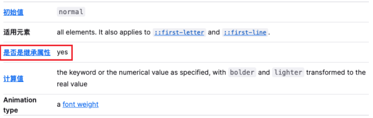
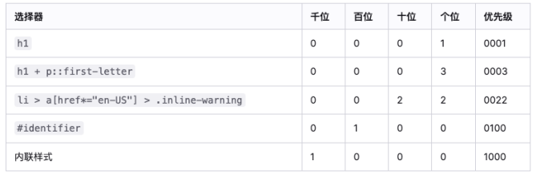
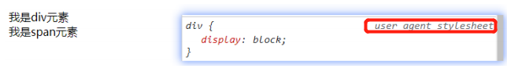

# 一. CSS的属性继承

---

- `CSS`的某些属性具有继承性（`inherited`）
  
  - **如果一个属性具有继承性**，那么在某元素上设置后，它的**后代元素都可以继承这个属性**
  - 如果后代元素自身设置该属性，那么**优先使用其自身的设置的属性（不管继承过来的属性权重有多高）**
  
- 如何知道一个属性是否具有继承性呢？
  - 常见的跟字体文本相关的属性一般都具有继承性，如：`font-size、font-family、color、line-height、text-align`等
  
  - 这些不用刻意去记，用的多自然就记住了
  
  - 另外多学会查阅文档，文档中每个属性都有标明其继承性的
  
    
  
- 注意：
  - **继承过来的是计算值，而不设置值**
  - 如：`a`元素`font-size`设置的`2em`，其`1em`等同于`a`元素父代元素的`font-size`的大小，而如果这时`a`元素自身有个`b`元素，`b`元素的`font-size`会从`a`元素继承过来，但继承的不是设置值`2em`，而是`a`元素`font-size`的计算值，即计算之后的结果，比如计算出来的结果是`28px`，那么`b`元素继承的也就是`28px`，而不是设置的`2em`

# 二. CSS属性的层叠

---

- `CSS`的翻译是层叠样式表，什么是层叠呢？
  - 对于一个元素来说，**相同一个属性可以通过不同的选择器给它进行多次设置**
  - 那么属性会被一**层层覆盖**上去，但是最终**只有一个会生效**
- 那么多个样式覆盖上去，哪一个会生效呢？
  - 先判断选择器的权重，**权重大的生效**
  - **权重相同时，后设置的生效**
  - **对于继承过来的属性，无论继承过来的属性所使用的权重多大，如果元素自身有设置该属性，一律使用自身设置的属性**
- 那么如何知道元素的权重呢？

# 三. 选择器的权重

---

- 按照经验，为了方便比较`CSS`属性的优先级，可以给`CSS`属性所处的环境定义一个权值（权重）
  - `!important`：10000
  
  - 内联样式：1000
  
  - `id`选择器：100
  
  - 类选择器、属性选择器、伪类：10
  
  - 元素选择器、伪元素：1
  
  - 通配符：0
  
    

# 四. HTML元素的类型

---

- 在前面我们会经常提到`div`是块级元素会独占一行**, **`span`是行内级元素会在同一行显示
  - 到底什么是块级元素, 什么是行内级元素呢? 
- `HTML`定义元素类型的思路: 
  - `HTML`元素有很多, 比如`h`元素/`p`元素/`div`元素/`span`元素/`img`元素/`a`元素等
  - 当我们把这个元素放到页面上时, 这个元素到底占据页面中一行多大的空间呢? 
    - 为什么我们这里只说一行呢? 因为垂直方向的高度通常是内容决定的
  - 比如一个`h1`元素的标题, 我们必然是希望它独占一行的, 其他的内容不应该和我的标题放在一起
  - 比如一个`p`元素的段落, 必然也应该独占一行, 其他的内容不应该和我的段落放在一起
  - 而类似于`img`/`span`/`a`元素, 通常是对内容的某一个细节的特殊描述, 没有必要独占一行
- 所以, 为了区分哪些元素需要独占一行, 哪些元素不需要独占一行, `HTML`将元素区分(本质是通过`CSS`的)成了两类:
  - **块级元素**（`block-level elements`）：**独占父元素的一行**  
  - **行内级元素**（`inline-level elements`）：多个行内级元素可以在**父元素的同一行中显示**
    - 行内级非替换元素`span`
    - 行内级替换元素`img `/`video`
    - 行内块级元素`inline-block`

# 五. 通过CSS修改元素类型

---

- **前面我们说过，事实上元素没有本质的区别：**
  
  - `div`是块级元素，`span`是行内级元素
  
  - `div`之所以是块级元素仅仅是因为浏览器默认设置了`display`属性而已
  
    
  
  - 那么我们是否可以通过`display`来改变元素的特性呢? 
  
  - 当然可以!

# 六. CSS属性display

---

- `CSS`中有个`display`属性，能修改元素的显示类型，有4个常用值
  - `block`：让元素显示为**块级元素**
  - `inline`：让元素显示为**行内级元素**
  - `inline-block`：让元素**同时具备行内级、块级元素的特征**
  - `none`：**隐藏元素** 
- 事实上`display`还有其他的值，比如`flex`，后续会专门学习
- **`display`不支持动画**

# 七. display值的特性

---

- `block`元素：
  - **独占父元素的一行**
  - **可设置宽高（设置宽后依然占父元素的一行，因为浏览器会自带把一行所剩下的距离会分配给该元素的`margin`）**
  - **默认宽度是`auto`(父元素的一行)，默认高度是由内容决定的**
  - 注意：当块级元素宽度是`auto`的时候（独占浏览器视图窗口一行），如果内容很多，且内容是不会自动换行的情况下，会将网页的内容撑开，导致浏览器水平方向出现滚动条
- `inline`元素：
  - 跟同一父元素下的其他行内级元素在同一行显示
  - **不可设置宽高**（`img`除外）
  - 宽高由其内容决定
- `inline-block`元素：
  - 跟同一父元素下的其他行内级元素在同一行显示
  - **可设置宽高**
  - 默认宽高由其内容决定

> 注意事项：
>
> - `img`属于`inline`元素，但是可以设置宽高
> - `img`是一个可替换元素，`display`默认`inline`
> - 但是`img`的默认分辨率是由被嵌入的图片的原始宽高来确定的，使得它像`inline-block`元素一样，可以设置`margin、padding、border、width、height`等`CSS`属性

# 八. 编写HTML时的注意事项

---

- 块级元素、`inline-block`元素
  - 一般情况下，可以包含其他任何元素（比如块级元素，行内级元素，`inline-block`元素）
  - 特殊情况，`p`元素不能包含其他块级元素（浏览器解析跟我们实际写的不一致）
  - `a`元素包含块级元素，设置背景色无效等，浏览器控制台调试看着`a`元素像是有宽高，实际是内部块级元素穿透出去的（解决办法，修改特性为块级元素或行内块级元素）
- 行内级元素（比如`a、span、strong`等）
  - 一般情况下，只能包含行内级元素

# 九. 元素隐藏方法

---

- 方法一：
  - `display：none`
  - **元素不显示出来，也不占据位置（浏览器不会渲染出来），但是在`html`结构中是存在的**

- 方法二：
  - `visibility：hidden`
  - `hidden`：**元素不可见，但是会占据元素应该占据的位置**
  - 默认值`visible`，元素是可见的

- 方法三：
  - **`rgba`设置颜色，将`a`的值设置为`0`**
  - `rgba`的`a`设置的是`alpha`值，**可以设置颜色透明度，不影响子元素**
    - `transparent`关键字是`rgba(0, 0, 0, 0)`的简写

- 方法四：
  - `opactity：0`
  - **设置整个元素的透明度，会影响所有子元素，仍然占据位置**

# 十. CSS属性 - overflow

---

- **用于控制内容溢出时的行为**
  - `visible`(默认值)：**溢出的内容照样可见**
  - `hidden`：**溢出的内容裁剪掉**
  - `scroll`：**溢出的内容被裁剪，可以通过滚动条查看**
    - **会一直显示滚动条，滚动条区域占用的空间属于**`width、height`
  - `auto`：**自动根据内容是否溢出来决定是否显示滚动条**

# 十一. CSS样式不生效技巧

---

- 为何有时候编写的`CSS`属性不好使，有可能是因为
  - 选择器的**优先级太低**
  - 选择器**没选中对应的元素**
  - `CSS`属性的**使用形式不对**
    - **元素不支持**此`CSS`属性，比如`span`行内级元素默认是不支持`width`和`height`的
    - **浏览器不支持**此`CSS`属性，比如旧版本的浏览器不支持一些`css module3`的某些属性
    - 被同类型的`CSS`**属性覆盖**，比如`font`覆盖`font-size`
- 建议：
  - 充分利用浏览器的**开发者工具进行调试（增加、修改样式）、查错**

