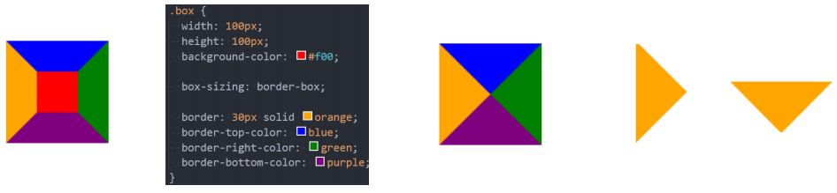
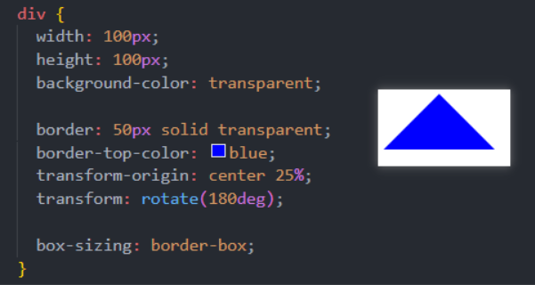
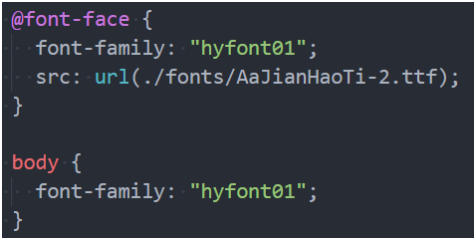
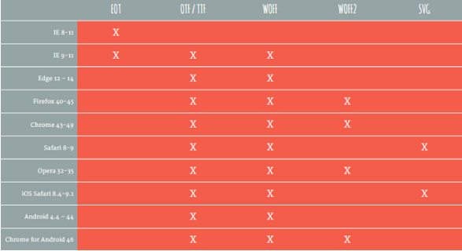
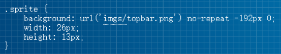

# 一. border图形

---

- `border`主要是用来给盒子增加边框的, 但是在开发中我们也可以利用边框的特性来实现一些形状: 

  

- 假如我们将`border`宽度设置成50会是什么效果呢? 

  - 如果我们进一步, 将另外三边的颜色去除呢? 

  - 如果我们将这个盒子旋转呢? 

    

- 所以利用`border`或者`CSS`的特性我们可以做出很多图形:

  - https://css-tricks.com/the-shapes-of-css/#top-of-site


# 二. web fonts

---

## 1. 认识web字体

- 在之前我们有设置过页面使用的字体: `font-family`
  - 我们需要提供一个或多个字体种类名称，浏览器会在列表中搜寻，直到找到它所运行的系统上可用的字体
  - 这样的方式完全没有问题，但是对于传统的`web`开发人员来说，字体选择是有限的
  - 这就是所谓的`Web-safe`字体
  - 并且这种默认可选的字体并不能进行一些定制化的需求
  
- 比如下面的字体样式, 系统的字体肯定是不能实现的

  

- 那么我们是否依然可以在网页中使用这些字体呢? 使用`Web Fonts`即可

## 2. web fonts的工作原理

- 首先，我们需要通过一些渠道获取到希望使用的字体(不是开发来做的事情)：
  - 对于某些收费的字体, 我们需要获取到对应的授权
  - 对于某些公司定制的字体, 需要设计人员来设计
  - 对于某些免费的字体, 我们需要获取到对应的字体文件
- 其次, 在我们的`CSS`代码当中使用该字体(重要)：
  - 具体的过程看后面的操作流程
- 最后, 在部署静态资源时, 将`HTML/CSS/JavaScript/Font`一起部署在静态服务器中
- 用户的角度：
  - 浏览一个网页时, 因为代码中有引入字体文件, 字体文件会被一起下载下来
  - 浏览器会根据使用的字体在下载的字体文件中查找、解析、使用对应的字体
  - 在浏览器中使用对应的字体显示内容

## 3. 使用web fonts

- **第一步：下载一个字体**
  
  - https://www.fonts.net.cn/fonts-zh-1.html
  - 默认下载下来的是`ttf`文件
  
- **第二步：使用字体**
  
  - 使用过程如下：
    - 将字体放入对应的目录中
    
    - 通过`@font-face`来引入字体，并且设置格式
    
    - 使用字体
    
      
    
  
- 注意：`@font-face`**用于加载一个自定义的字体**

## 4. web fonts 的兼容性

- 我们刚才使用的字体文件是` .ttf`, 它是`TrueType`字体
  - 在开发中某些浏览器可能不支持该字体, 所以为了浏览器的兼容性问题, 我们需要有对应其他格式的字体
  
- `TrueType`字体：拓展名是` .ttf`
  
  -  `OpenType/TrueType`字体：拓展名是` .ttf、.otf`，建立在`TrueType`字体之上
  
  - `Embedded OpenType`字体：拓展名是` .eot`，`OpenType`字体的压缩版
  
  - `SVG`字体：拓展名是` .svg`、` .svgz`
  
  - `WOFF`表示`Web Open Font Format web`开放字体：拓展名是` .woff`，建立在`TrueType`字体之上
  
    
  
- 这里我们提供一个网站来生产对应的字体文件: 
  -  https://font.qqe2.com/# 暂时可用

## 5. web fonts兼容性写法

- 如果我们具备很强的兼容性, 那么可以如下格式编写: 
  
  ```css
  @font-face {
    font-family: "why";
    src: url("./fonts02/AaQingHuanYuanTi.eot"); /* IE9 */
    src: url("./fonts02/AaQingHuanYuanTi.eot?#iefix") format("embedded-opentype"), /* IE6-IE8 */
      url("./fonts02/AaQingHuanYuanTi.woff") format("woff"), /* chrome、firefox */
      url("./fonts02/AaQingHuanYuanTi.ttf") format("truetype"), /* chrome、firefox、opera、Safari, Android, iOS 4.2+ */
      url("./fonts02/AaQingHuanYuanTi.svg#uxfonteditor") format("svg"); /* iOS 4.1- */
    font-style: normal;
    font-weight: 400;
  }
  
  body {
    font-family: "why";
  }
  ```
  
  - 为什么需要写两个`src`呢？
    - 这种写法是兼容一些早期的浏览器，如`ie6-8`
  
- 这被称为`bulletproof @font-face syntax`（刀枪不入的`@font-face`语法）:
  - 这是`Paul Irish`早期的一篇文章提及后`@font-face`开始流行起来 (`Bulletproof @font-face Syntax`)
  
- `src`用于指定字体资源
  
  - `url`指定资源的路径
  - `format`用于帮助浏览器快速识别字体的格式


# 三. 字体图标

---

## 1. 认识字体图标

- 思考：字体可以设计成各式各样的形状，那么能不能把**字体直接设计成图标的样子**呢？
  - 当然可以，这个就叫做字体图标
- **字体图标就是一种特殊字体**
- 字体图标的好处：
  - 放大不会失真
  - 可以任意切换颜色
  - 用到很多个图标时，文件相对较小
- 字体图标的使用：
  - 登录阿里`icons`：https://www.iconfont.cn/
  - 下载代码，并且拷贝到项目中
- 将字体文件和默认的`css`文件导入到项目中

## 2. 字体图标的使用

- 字体图标的使用步骤:
  - 第一步: 通过`link`引入`iconfont.css`文件
  - 第二步: 使用字体图标
  
- 使用字体图标常见的有两种方式
  - 方式一: 通过对应字体图标的`Unicode`(字符编码)来显示代码
  - 方式二: 利用已经编写好的`class`, 直接使用即可
  
  ```html
  <style>
    .icon-shouye {
      font-size: 30px;
      color: red;
    }
  </style>
  
  <!-- 直接通过内容(字符实体) -->
  <i class="iconfont">&#xe654;</i>
  <i class="icon"></i>
  
  <!-- 不使用字符实体的方式展示出来(伪元素) -->
  <i class="iconfont music"></i>
  <i class="iconfont icon-shouye"></i>
  ```


# 四.  CSS Sprite精灵图

---

## 1. 认识精灵图(雪碧图)

- 什么是`CSS Sprite`？
  -  是一种`CSS`图像合成技术，将各种小图片合并到一张图片上，然后利用`CSS`的背景定位来显示对应的图片部分
  - 有人翻译为：`CSS`雪碧、`CSS`精灵
- 使用`CSS Sprite`的好处
  - **减少网页的`http`请求数量，加快网页响应速度，减轻服务器压力**
  - **减少图片总大小**
  - 解决了图片命名的困扰，只需要针对一张集合的图片命名
- `Sprite`图片制作
  - 方法1：`photoshop`，设计人员提供
  - 方法2： `https://www.toptal.com/developers/css/sprite-generator`

## 2. 精灵图的使用

- 精灵图的原理是通过只显示图片的很小的一部分来展示的

- 通常使用背景：

  1. 设置对应元素的宽高
  2. 设置精灵图作为背景图片
  3. 调整背景图片的位置来展示

- 如何获取精灵图的位置
  - http://www.spritecow.com/

    
  


# 五. cursor

---

- `cursor`可以设置鼠标指针（光标）在元素上面时的显示样式
- `cursor`常见的设值有:
  - `auto`：浏览器根据上下文决定指针的显示样式，比如根据文本和非文本切换指针样式
  - `default`：由操作系统决定，一般就是一个小箭头
  - `pointer`：一只小手，鼠标指针挪动到链接上面默认就是这个样式
  - `text`：一条竖线，鼠标指针挪动到文本输入框上面默认就是这个样式
  - `none`：没有任何指针显示在元素上面

