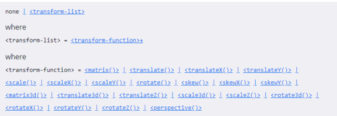
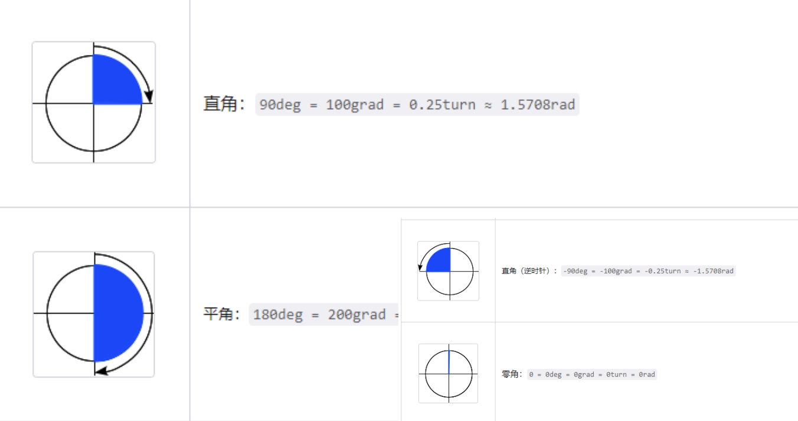
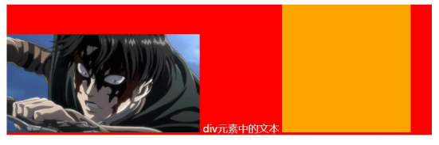

# 一. CSS属性 - transform

---

## 1. 定义

- `CSS transform`属性允许对某一个元素进行某些形变, 包括旋转，缩放，倾斜或平移等

- `transform`是形变的意思，`transformer`就是变形金刚

- 注意：
  - 并非所有的盒子都可以进行`transform`的转换（通常行内级元素不能进行形变）
  
  - `transform`是对元素进行形变，**不影响标准流中其他元素的布局**
  
  - 同一元素设置多个`transform`属性，只会生效最后设置的那一个

  - `transform`**对于行内级非替换元素是无效的**
  
  - 如对`span、a`元素等
    
    
  


## 2. transform的用法

- `transform`属性的语法如下：
  
  
  
  
  
  - 常见的函数`transform function`有：
    - 平移：`translate(x, y)`
    - 缩放：`scale(x, y)`
    - 旋转：`rotate(deg)`
    - 倾斜：`skew(deg, deg)`

## 3. 位移 - translate

- 平移：`translate(x, y)`
  - 这个`CSS `函数用于移动元素在平面上的位置
  - `translate`本身可以表示翻译的意思，在物理上也可以表示平移
  
- 值个数：
  - **一个值时，设置x轴上的位移**
  - **二个值时，设置x轴和y轴上的位移**
  
- 值类型：
  - 数字：100px
  
  - **百分比：参照元素本身**（` refer to the size of bounding box `）
  
    
  

##  4. translate的补充

- 补充一：`translate`是`translateX`和`translateY`函数的简写
  - `translate3d`后续了解

- 补充二：**两个相同的`transform`，后者会覆盖前者设置的值**
  
  
  
- 补充二：`translate`的百分比可以完成一个元素的水平和垂直居中：
  
  
  
- `translate`函数相对于`flex`布局的兼容性会好一点点

- 不过目前`flex`布局已经非常普及，直接使用`flex`布局即可

## 5. 缩放 - scale

- 缩放：`scale(x, y) `

  - `scale() CSS `函数可改变元素的大小

    

- 值个数：

  - 一个值时，设置`x`轴和`y`轴上的缩放
  - 二个值时，也是设置`x`轴和`y`轴上的缩放，只不过可以设置不一样而已

- 值类型：

  - 数字： 
    - 0.5：缩小一半	2：放大一倍
  -  百分比：`50%`跟数字`0.5`的效果是一样的

- `scale`函数时`scaleX`和`scaleY`的缩写：

  - `scale3d`后续再了解

## 6. 旋转 - rotate

- 旋转：`rotate(<angle>)`

- 值个数：
  - 一个值时，表示旋转的角度，如：`45deg`，顺时针旋转`45°`
  
- 值类型：
  - 常用单位`deg`：旋转的角度（`degrees `）
  
  - 正数为顺时针
  
  - 负数为逆时针
  
    
  

## 7. rotate补充

- 补充一：`rotate`函数是`rotateZ`的简写写法
  - `rotate3d`后续再了解
  
- 补充二：`rotate`的其他单位
  - 度(`degrees`)、百分度(`gradians`)、弧度(`radians`)或圈数(`turns`)
  
    
  

## 8. transform-origin

- `transform-origin`：形变的原点
  - 比如在进行`scale`缩放或者`rotate`旋转时，都会有一个原点(**默认是元素中心点`center`**)
  
    
  
- 值的个数：
  - 一个值：设置`x`轴的原点
  - 两个值：设置`x`轴和`y`轴的原点
  
- 值的类型：
  - `left, center, right, top, bottom`关键字
  - `length`：从左上角开始计算
  - **百分比：参考元素本身大小**

## 9. 倾斜 - skew

- 倾斜：`skew(x, y) `
  - 函数定义了一个元素在二维平面上的倾斜转换
  
    
  
- 值个数：
  - 一个值时，表示`x`轴上的倾斜
  - 二个值时，表示`x`轴和`y`轴上的倾斜
  
- 值类型：
  - `deg`：倾斜的角度
  - 正数往左侧（逆时针）倾斜
  - 负数往右侧（顺时针）倾斜
  
- 注意：倾斜的原点受`transform-origin`的影响

## 10. transform设置多个值

- 前面我们看到了`transform`的语法，它是可以设置多个`transform-function`的：
  - `<transform-function>+`
    - `+`：一个或者多个，并且**多个之间以`空格`分隔**
    - `transform: scale() translate();`
    
  -  `<box-shadow>#`
    
    - `#`：一个或者多个，多个之间以`,`分隔
    -  `box-shadow: 1px 1px 1px 1px #f00,`
    
  - 那么就意味着，我们可以给`transform`设置多个形变的函数
  
    
  


# 二. 元素的水平和垂直居中方案

---

## 1. 水平居中

- 行内级元素（` inline / inline-block `）
  - 设置父元素的`text-align: center`
- 块级元素（`block `）
  - 元素有宽度的情况下，设置` margin: 0 auto`（为了保持`block`元素独占一行的特性，浏览器会将水平方向的外边距平分给`margin-right/left`）
  - `margin-left: 50%; transform: translateX(-50%)`
- 行内块级元素（` inline-block `）
  - 设置父元素的`text-align: center`
  - `margin-left: 50%; transform: translateX(-50%)`

- 绝对定位元素(` absolute / fixed `)
  - 元素有宽度的情况下，设置` left0、right0、margin: 0 auto`
- `flex`元素
  - `justify-content: center`

## 2. 垂直居中

- 绝对定位元素(` absolute / fixed `)
  - 元素有高度的情况下，`top0、bottom0、margin: auto 0`
  - 弊端：
    - 必须使用绝对定位（脱离标准流`normal flow`）
    - 必须给元素设置高度
- `flex`元素
  - `align-items: center`
  - 弊端：
    - 当前`flex`局部中所有的`item`元素都会被垂直居中
    - 有一点点兼容性问题，`IE 6-9 `不兼容，现在基本不需要考虑兼容`IE`了
- 定位元素 + `top `+`translateY`
  - `top: 50%、transform: translateY(-50%)`
  - 这里为什么不使用`margin-top`呢？因为**`margin`百分比相对的是包含块的宽度**
  - 好处：
    - 没有兼容性问题，元素设置相对定位，不会产生脱标问题


# 三. transition动画

---

## 1. 什么是transition动画

- `CSS transitions `提供了一种在更改`CSS`属性时控制动画速度的方法

- 可以让**`CSS`属性变化成为一个持续一段时间的过程**，**而不是立即生效**的

- 比如将一个元素从一个位置移动到另外一个位置，默认在修改完`CSS`属性后会立即生效

- 但是我们可以通过`CSS transition`，让这个过程加上一定的动画效果，包括一定的曲线速率变化

- 通常将两个状态之间的过渡称为隐式过渡（`implicit transitions`），因为开始与结束之间的状态由浏览器决定

  

  - 译文：`CSS transition `告诉浏览器在初始和结束状态之间绘制中间状态，从而显示给用户一个丝滑的过渡

- `CSS transitions `可以决定：
  
  - 哪些属性发生动画效果 (明确地列出这些属性) 
  - 何时开始 (设置`delay`） 
  - 持续多久 (设置`duration`) 
  - 如何动画 (定义`timing function`，比如匀速地或先快后慢)

## 2. 哪些CSS属性可以做动画呢

- 并非所有的`CSS`属性都可以执行动画的，那么我们如何知道哪些属性支持动画呢？

- 方法一：在`MDN`可执行动画的`CSS`属性中查询
  - https://developer.mozilla.org/zh-CN/docs/Web/CSS/CSS_animated_properties
  
- 方法二：阅读`CSS`属性的文档说明
  
  

## 3. 过渡动画 - transition

- `transition CSS `属性是` transition-property，transition-duration，transition-timing-function `和` transition-delay `的一个简写属性

  

- `transition-property`：指定应用过渡属性的名称
  
  - `all`：所有属性都执行动画
  - `none`：所有属性都不执行动画（默认值）
  - `CSS`属性名称：要执行动画的`CSS`属性名称，比如`width、left、transform`等
  
- `transition-duration`：指定过渡动画所需的时间
  
  - 单位可以是秒`s`或毫秒`ms` 
  
- `transition-timing-function`：指定动画的变化曲线
  
  - https://developer.mozilla.org/zh-CN/docs/Web/CSS/transition-timing-function
  
- `transition-delay`：指定过渡动画执行之前的等待时间
  
  - 单位可以是秒`s`或毫秒`ms` 

## 4. 几个英语词汇的区分

- `transform`是形变：
  -  一个`CSS`属性，该`CSS`属性用于设置形变
  - 后面的值是形变的函数，比如`scale、rotate、translate`
- `translate`是其中一个`transform-function`
  - 用于对元素进行平移
- `transition`是过渡的意思
  - 它本身也有转变的含义，但是更多表示的是过渡的过程


# 四. transition动画

---

## 1. 认识animation

- 之前我们学习了`transition`来进行过渡动画，但是过渡动画有如下的缺点：
  - `transition`只能定义开始状态和结束状态，不能定义中间状态，也就是说只有两个状态
  - `transition`不能重复执行，除非一再触发动画
  - `transition`需要在特定状态下会触发才能执行，比如某个属性被修改了
- 如果我们希望**可以有更多状态的变化**，我们可以使用`CSS Animation`
- `CSS Animation`的使用分成两个步骤：
  - 步骤一：使用`keyframes`定义动画序列（每一帧动画如何执行）
  - 步骤二：配置动画执行的名称、持续时间、动画曲线、延迟、执行次数、方向等等

## 2. keyframes规则

- 可以使用`@keyframes`来定义多个变化状态，并且使用`animation-name`来声明匹配：
  - 关键帧使用`percentage`来指定动画发生的时间点
  - `0%`表示动画的第一时刻，`100%`表示动画的最终时刻
  - 因为这两个时间点十分重要，所以还有特殊的别名：`from`和`to`
  
- `to`相当于`100%`
  
  - `from`相当于`0%`
  
  - `to`相当于`100%`
  
    

## 3. animation属性

- `CSS animation `属性是` animation-name、animation-duration、animation-timing-function、animation-delay、animation-iteration-count、animation-direction、animation-fill-mode 和 animation-play-state `属性的一个简写属性形式

  - `animation-name`：指定执行哪一个关键帧动画

  - `animation-duration`：指定动画的持续时间

  - `animation-timing-funtion`：指定动画的变化曲线

  - `animation-delay`：指定延迟执行的时间

  - `animation-iteration-count`：指定动画执行的次数，`infinite`表示无限次

  - `animation-direction`：指定方向，常用值`normal`和`reverse`

  - `animation-fill-mode`：执行动画最后保留哪一个值

    - `none`：回到没有执行动画的位置（默认值）
    - `forwards`：动画最后一帧的位置
    - `backwards`：动画第一帧的位置

  - `animation-play-state`：指定动画运行或暂停（一般在`js`中使用，用于控制动画播放暂停）

    ```css
    animation: moveAnimation1 1000 liner 500 2 normal forwards;
    ```
  


# 五. vertical-align

---

## 1. 行盒(line boxes )


- 官方文档的翻译：`vertical-align`会**影响行内级元素在一个行盒中垂直方向的位置**
- 思考：一个`div`没有设置高度的时候，会不会有高度？
  - 没有内容，没有高度
  - 有内容，内容撑起来高度
- 但是内容撑起来高度的本质是什么呢？
  - **内容有行高（`line-height`：一行文字所占据的高度），撑起来了`div`的高度**
- 行高为什么可以撑起`div`的高度？
  - 这是因为`line boxes`的存在，并且`line-boxes`有一个特性，**包裹每行的**`inline level`
  - 而其中的**文字是有行高的，必须将整个行高包裹进去，才算包裹这个**`line-level`
- 把**一行中所有内容包裹**起来的一个隐性盒子叫行盒
- 在**不设置具体高度**的情况下，元素高度是由其内容决定的，而本质上是由内容中**每一行的行高之和**决定的
- **行盒的高度等于**`line-height`
- 那么，进一步思考：
  - 如果这个`div`中有图片，文字，`inline-block`，甚至他们设置了`margin`这些属性呢？


## 2. 不同情况分析

- **情况一：只有文字时，`line boxes`如何包裹内容？（注意：红色是包裹的`div`，下面也都一样）**
  
  
  
- **情况二：有图片，有文字时，`line-boxes`如何包裹内容？**
  
  
  
- **情况三：有图片，有文字，有`inline-block`（比图片要大）如何包裹内容？**
  
  
  
- **情况四：有图片，有文字，有`inline-block`（比图片要大）而且设置了`margin-bottom`，如何包裹内容？**
  
  
  
- **情况五：有图片、文字、`inline-block`（比图片要大）而且设置了`margin-bottom`并且有文字，如何包裹内容？**
  
  

## 3. baseline

- 结论：`line-boxes`**一定会想办法包裹住当前行中所有的内容**

- 但是，但是为什么对齐方式千奇百怪呢？
  - 你认为的千奇百怪，其实有它的内在规律
  - 答案就是`baseline`对齐
  
- 我们来看官方`vertical-align`的默认值：没错，就是`baseline`
  
  
  
- 但是`baseline`都是谁呢？
  - 文本的`baseline`
    - 是**字母`x`的下方**
  - 没有基线的元素(如图片等`inline`可替换元素)
    - 使用**外边距的下边缘**替代
  - `inline-block`内部没有文字时的`baseline`
    - 默认是`margin-bottom`**的底部（没有`margin-bottom`，就是盒子的底部）**
  - `inline-block`有文本时
    - 是**最后一行文本的`x`的下方**

## 4. vertical-align的其他值

- `vertical-align`用来指定行内元素（`inline`）或表格单元格（`table-cell`）元素的垂直对齐方式
- `baseline`(默认值)：基线对齐（你得先明白什么是基线）
- `top`：把行内级盒子的顶部跟`line boxes`顶部对齐
- `middle`：行内级盒子的中心点与父盒基线加上`x`英文字母的`height`一半的线对齐
- `bottom`：把行内级盒子的底部跟`line box`底部对齐
- `<percentage>`：把行内级盒子提升或者下降一段距离（距离相对于`line-height`计算\元素高度）， `0%`意味着同`baseline`一样
- `<length>`：把行内级盒子提升或者下降一段距离，`0cm`意味着同`baseline`一样
- 解决图片下边缘的间隙方法：
  - 方法一：**`vertical-align`设置成`top/middle/bottom`**
  - 方法二：将图片**设置为`block`元素，`block`不受`vertical`影响，因为是独占父元素的一行**，所以不存在像同一行中的行内级元素在一个行盒中可调整垂直方向的位置这样的说法


