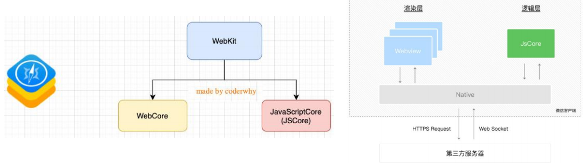

# 一. 认识编程语言

---

## 1. 前端三大核心

- 前端开发最主要需要掌握的是三个知识点：`HTML`、`CSS`、`JavaScript`

  

## 2. 计算机语言

- 前面我们已经学习了 `HTML` 和 `CSS` 很多相关的知识：
  - 在之前我们提到过，**HTML** 是一种**标记语言**，**CSS** 也是一种**样式语言**
  
- 他们本身都是属于计算机语言，因为都在和计算机沟通交流
  - 在生活中两个人想要沟通，必然是通过某一种语言
  - 计算机语言就是我们人和计算机进行交流要学习的语言
  
- 网页的三大组成部分的另外一个核心就是 `JavaScript`，也是一种计算机语言

  

## 3. 编程语言

-  事实上，`JavaScript` 我们可以对其有更加精准的说法：一种编程语言
- 我们先搞清楚计算机语言和编程语言的关系和区别：
  - 计算机语言：**计算机语言**（`computer language`）指用于**人与计算机之间通讯的语言**，是**人与计算机之间传递信息的介质**。但是其概念比通用的编程语言要更广泛。例如，`HTML` 是标记语言，也是计算机语言，但并不是编程语言
  - 编程语言：**编程语言**（英语：`programming language`），是用来**定义计算机程序的形式语言**。它是一种被标准化的交流技巧，用来向计算机发出指令，一种能够让程序员准确地定义计算机所需要使用数据的计算机语言，并精确地定义在不同情况下所应当采取的行动
- 很抽象，我们来说明一下编程语言的特点：
  - 数据和数据结构
  - 指令及流程控制
  - 引用机制和重用机制
  - 设计哲学

## 4. 常见的编程语言

# 二. 编程语言的发展历史 

---

## 1. 机器语言

- 阶段一：机器语言

  - **计算机的存储单元只有 `0` 和 `1` 两种状态**，因此一串代码要让计算机“读懂”，这串代码只能由数字0和1组成

  - **像这种由数字 `0` 和 `1` 按照一定的规律组成的代码就叫机器码（二进制编码）**

  - 一定长度的机器码组成了机器指令，用这些机器指令所编写的程序就称为机器语言

    

- 优点: 

  - 代码**能被计算机直接识别**，**不需要经过编译解析**
  - 直接对硬件产生作用，程序的执行效率非常高

- 缺点: 

  - 程序全是些0和1的指令代码，可读性差，还容易出错
  - 不易编写（目前没有人这样开发）

## 2. 汇编语言

- 阶段二：汇编语言
  -  为了解决机器语言的缺陷，人们发明了另外一种语言 — 汇编语言
  - 这种语言**用符号来代替冗长的、难以记忆的0、1代码**（`mov/push` 指令，经过汇编器，汇编代码再进一步转成0101）
- 优点: 
  - 像机器语言一样，可以直接访问、控制计算机的各种硬件设备
  - 占用内存少，执行速度快
- 缺点: 
  - **不同的机器有不同的汇编语言语法和编译器**，**代码缺乏可移植性**
    - 也就是说，一个程序只能在一种机器上运行，换到其他机器上可能就不能运行
  - **符号非常多、难记**
    - 即使是完成简单的功能也需要大量的汇编语言代码，很容易产生 `BUG`，难于调试
- 应用场景
  - **操作系统内核、驱动程序、单片机程序**

## 3. 高级语言

- 阶段三：高级语言

  - 最好的编程语言应该是什么? 自然语言

  - 而高级语言，就是接近自然语言，更符合人类的思维方式

  - 跟和人交流的方式很相似，但是大多数编程语言都是国外发明的，因为都是接近于英文的交流方式

    

- 优点: 

  - **简单、易用、易于理解**，语法和结构类似于普通英文
  - 远离对硬件的直接操作，使得一般人经过学习之后都可以编程，而不用熟悉硬件知识
  -  **一个程序还可以在不同的机器上运行，具有可移植性**

- 缺点:

  - 程序不能直接被计算机识别，**需要经编译器翻译成二进制指令**后，才能运行到计算机上 
  
  - 种类繁多：`JavaScript`、 `C语言`、`C++`、`C#`、`Java`、`Objective-C`、`Python` 等
  
    
  

# 三. JavaScript 的历史

---

## 1. 认识 JavaScript

- 维基百科对 `JavaScript` 的定义：
  - `JavaScript`（通常缩写为`js`）是一种高级的、解释型的编程语言
  - **`js` 是一门基于原型、头等函数的语言**，是一门多范式的语言，它支持面向对象程序设计，指令式编程，以及函数式编程
- 从上面的定义中，我们会发现很多关键词：
  - 解释型语言？原型？头等函数？多范式？面向对象程序设计？指令式编程？函数式编程？ 
  - 这些改变往往会让人不知所云，需要我们完全掌握 `js` 再来回头看，每一个词语描述的都非常准确
- 现在只需要知道，通俗的说法: 
  - `js` 是一门高级编程语言，是前端开发的重要组成部分！
- `HTML` 和 `CSS` 也是前端开发的重要组成部分，而 `js` 是前端开发的灵魂

## 2. JavaScript 的起源（一）

- **1994**年，**网景公司**（`Netscape`）发布了 **`Navigator` 浏览器**0.9版

  - 这是历史上**第一个比较成熟的网络浏览器**，轰动一时
  
  - 但是，这个版本的浏览器只能用来浏览，不具备与访问者互动的能力

  - 网景公司急需一种网页脚本语言，使得浏览器可以与网页互动
  
    
  

## 3. JavaScript 的起源（二）

- 网景公司当时想要选择一种语言来嵌入到浏览器中：

  - 采用现有的语言，比如Perl、Python、Tcl、Scheme等等，允许它们直接嵌入网页
  - 1995年网景公司招募了程序员Brendan Eich，希望将Scheme语言作为网页脚本语言的可能性

- 就在这时，发生了另外一件大事：1995年Sun公司将Oak语言改名为Java，正式向市场推出

  - Java推出之后立马在市场上引起了轰动，Java当初有一个口号：“write once run anywhere”
  
  - 网景公司动了心，决定与Sun公司结成联盟，希望将Java嵌入到网页中来运行

  - Brendan Eich本人非常热衷于Scheme，但是管理层那个时候有点倾向于Java，希望可以简化Java来适应网页脚本的需求
  
    
  

## 4. JavaScript 的起源（三）

- 但是Brendan Eich对此并不感兴趣，他用10天时间设计出来了`js`
  - 最初这门语言的名字是Mocha（摩卡）
  - 在Navigator2.0 beta 版本更名为 **`LiveScript`**
  - 在Navigator2.0 beta 3 版本正式重命名为 **`JavaScript`**，当时是为了给这门语言搭上 `Java` 这个热词
- 当然10天设计出来语言足够说明Brendan Eich是天才，但是这门语言当时更像是一个多种语言的大杂烩
  - 借鉴 `C` 语言的基本语法
  - 借鉴 `Java` 语言的数据类型和内存管理
  - 借鉴 `Scheme` 语言，将函数提升到"第一等公民"（first class）的地位
  - 借鉴 `Self` 语言，使用基于原型（`prototype`）的继承机制
- Brendan Eich 曾经这样描述过 `JavaScript`：
  - 与其说我爱 `Javascript`，不如说我恨它，它是 `C` 语言和 `Self` 语言一夜情的产物
  - 十八世纪英国文学家约翰逊博士说得好：'它的优秀之处并非原创，它的原创之处并不优秀

## 5. JavaScript 的起源（四）

- **微软**公司于**1995**年首次**推出 `Internet Explorer`**，从而引发了**与 `Netscape` 的浏览器大战**
  - 微软对Netscape Navigator解释器进行了逆向工程，创建了 **`JScript`**，以与处于市场领导地位的网景产品同台竞争
  -  这个时候对于开发者来说是一场噩耗，因为需要针对不同的浏览器进行不同的适配
- **1996**年11月，**网景**正式向 `ECMA`（欧洲计算机制造商协会）**提交语言标准**
  - **1997**年6月，`ECMA` 以 `js` 语言为基础**制定了 `ECMAScript` 标准规范 `ECMA-262`**
  - `ECMA-262` 是一份标准，定义了 `ECMAScript`
  - `js` 成为了 `ECMAScript` 最著名的实现之一
  - 除此之外，**ActionScript** 和 **JScript** 也都是 `ECMAScript` 规范的实现语言
- 所以说，**`ECMAScript` 是一种规范，而 `js` 是这种规范的一种实现**

## 6. JavaScript 的组成

- **ECMAScript** 是 **js** 的**标准**，描述了该语言的**语法和基本对象**
  
  - **`js` 是 `ECMAScript` 的语言层面的实现**
  - 因为除了语言规范之外，`js` 还需要**对页面和浏览器进行各种操作**
  - 除了基本实现之外，还包括 **`DOM` 操作**和 **`BOM` 操作**
  
- 目前我们会针对性的学习 `ECMAScript`，也就是语言层面的内容，特别是 `ES5` 之前的语法

  

# 四. JavaScript 运行引擎

---

## 1. JavaScript 由谁来运行？

- 我们经常会说：不同的浏览器有不同的内核组成
  - Gecko：早期被Netscape和Mozilla Firefox浏览器浏览器使用
  - Trident：微软开发，被ie4 ~ ie11浏览器使用，但是Edge浏览器已经转向Blink
  - WebKit：苹果基于KHTML开发、开源的，用于Safari，Google Chrome之前也在使用
  - Blink：是WebKit的一个分支，Google开发，目前应用于Google Chrome、Edge、Opera等
- 事实上，我们经常说的**浏览器内核**指的是**浏览器的排版引擎**
  -  **排版引擎**（layout engine），也称为**浏览器引擎**（browser engine）、**页面渲染引擎**（rendering engine）或**样版引擎**
- 那么，`js` 代码由谁来执行呢？
  - **JavaScript 引擎**

## 2. 认识 JavaScript 引擎 

- 为什么需要 `js` 引擎呢？
  - 我们前面说过，**高级的编程语言**都是需要**转成**最终的**机器指令**来执行的
  - 事实上我们编写的 **`js`** 无论你**交给浏览器或者 `Node` 执行**，最后**都是需要被 `CPU` 执行的**
  - 但是 `CPU` 只认识自己的指令集，实际上是机器语言，才能被 `CPU` 所执行
  - 所以我们需要 **`js` 引擎帮助我们将 `js` 代码编译成 `CPU` 指令来执行**
- 比较常见的 `js` 引擎有哪些呢？
  - SpiderMonkey：第一款 `js` 引擎，由Brendan Eich开发（也就是 `js` 作者）
  - Chakra：微软开发，用于IE浏览器
  - JavaScriptCore:  WebKit中的 `js` 引擎，Apple公司开发
  - **V8**:  **Google开发**的强大 `js` 引擎，也帮助 `Chrome` 浏览器从众多浏览器中脱颖而出
    - **`Chrome` 和 `Node` 都是使用的 `V8` 引擎**

## 3. 浏览器内核 和 JS引擎的关系

- 这里我们先以 `WebKit` 为例，`WebKit` 事实上由两部分组成的：

  - **`WebCore`**：**负责 `HTML` 解析、布局、渲染**等等相关的工作
  - **`JSCore`**：**解析、执行 `js` 代码**

- 小程序中也是这样的划分：

  - 在小程序中编写的 `js` 代码就是被 `JSCore` 执行的

    
  

## 4. 著名的 Atwood 定律

- Stack Overflow的创立者之一的 Jeff Atwood 在2007年提出了著名的 Atwood定律： 

  - Any application that can be written in JavaScript, will eventually be written in JavaScript
  
  - 任何可以使用 `js` 来实现的应用都最终都会使用 `js` 实现
  
    
  

# 五. JavaScript 的应用场景

---

