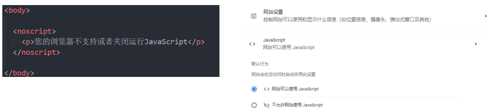
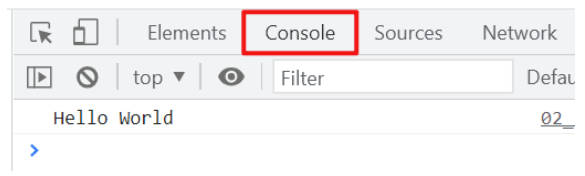

# 一. JavaScript编写方式

---

- **位置一：HTML代码行内（不推荐）**

  ```html
  <a href="javascript:alert('百度一下')" onclick="alert('点击百度一下')">百度一下</a>
  ```

- **位置二：script标签中**

  ```html
  <a class="google" href="#">Google一下</a>
  
  <script>
  	const googleEl = document.querySelector(".google")
    googleEl.onclick = function() {
      alert('Google一下')
    }
  </script>
  ```

- **位置三：外部的script文件**

  - 需要通过`script`元素的`src`属性来引入`JavaScript`文件

    ```html
    <script src="./bing.js"></script>
    ```
    
    ```js
    <!-- ./bing.js -->
    const bingEl = document.querySelector("bing")
    bingEl.onClick = function() {
      alert('Bing一下')
    }
    ```


# 二. noscript元素

---

- 如果运行的浏览器不支持`JavaScript`, 那么我们如何给用户更好的提示呢? 

  - 针对早期浏览器不支持` JavaScript `的问题，需要一个页面优雅降级的处理方案
  - 最终，**`noscript`元素**出现，被用于**给不支持` JavaScript `的浏览器提供替代内容**

- 下面的情况下, 浏览器将显示包含在`<noscript>`中的内容: 

  - **浏览器不支持脚本**
  
  - **浏览器对脚本的支持被关闭**
  
    
  


# 三. JavaScript编写的注意事项

---

- 注意一：`script`元素**不能写成单标签，加` / `可以，不推荐**
  - 即不能写成`<script src="index.js"/>`，虽然浏览器会解析，但是标准中是不支持的
- 注意二：在外联式引用`js`文件时，`script`标签中不可以写`js`代码，会被引用的`js`文件给**覆盖**掉
- 注意三：**省略`type`属性**
  - 在以前的代码中，`<script>`标签中会使用` type=“text/javascript”`
  - 现在可不写这个代码了，因为`js`是所有现代浏览器以及`HTML5 `中的默认脚本语言
- 注意四：**加载顺序**
  - 作为`HTML`文档内容的一部分，`js`默认**遵循`HTML`文档的加载顺序**，即**自上而下**的加载顺序
  - 推荐将`js`代码和编写位置**放在`body`子元素的最后一行**
- 注意五：`js`代码严格**区分大小写**
  - `HTML`元素和`CSS`属性不区分大小写，但是在`js`中严格区分大小写
- 后续补充：`script`元素还有`defer、async`属性，后续再详细讲解


# 四. JavaScript交互方式

---

- `js`有如下和用户交互的手段：

  - 最常见的是通过`console.log`, 目前大家掌握这个即可

    |     交互方法     | 方法说明           | 效果查看             |
    | :--------------: | :----------------- | :------------------- |
    |     `alert`      | 接受**一个**参数   | 弹窗查看             |
    |  `console.log`   | 接受**多个**参数   | 在浏览器控制台查看   |
    | `document.write` | 接受**多个**字符串 | 在浏览器页面查看     |
    |     `prompt`     | 接受**一个**参数   | 在浏览器接受用户输入 |
  


# 五. Chrome的调试工具

---

- 在前面我们利用`Chrome`的调试工具来调试了`HTML、CSS`，它也可以帮助我们来调试`js`

- 当我们在`js`中通过`console`函数显示一些内容时，也可以使用`Chrome`浏览器来查看：

  

- 另外补充几点：
  - 如果在代码中出现了错误，那么可以在`console`中显示错误
  - `console`中有个` > `标志，它**表示控制台的命令行**
    - 在命令行中我们可以直接编写`js`代码，按下`enter`会执行代码
    - 如果希望编写多行代码，可以按下`shift+enter`来进行换行编写
  - 在后续我们还会学习如何**通过`debug`方式来调试、查看代码的执行流程**


# 六. JavaSript语句和分号

---

- **语句**是**向浏览器发出的指令**，通常表达一个**操作或者行为**（`Action`）

  - 语句英文是`Statements`

  - 比如我们前面编写的每一行代码都是一个语句，用于告知浏览器一条执行的命令

    ```js
    alert('hello world');
    alert('你好啊');
    ```

- 通常每条语句的后面我们会添加一个`;`，**表示语句的结束**：

  - 分号的英文是`semicolon`
  - 当存在换行符（`line break`）时，在大多数情况下可以省略分号
  - `js` 将**换行符**理解成“**隐式**”的**分号**
  - 这也被称之为**自动插入分号**（`an automatic semicolon`）

- 推荐：

  - 前期在对`js`语法不熟悉的情况推荐添加分号
  - 后期对`js`语法熟练的情况下，任意！

# 七. JavsScript注释

---

- 在`HTML、CSS`中我们都添加过注释，`js`也可以添加注释

- **`js`的注释主要分为三种：**

  ```js
  // 单行注释
  
  /*
  	多行注释
  */
  
  /**
   * 这是一个文档注释
   * @param {string} name 姓名
   * @param {number} age 年龄
   */
  function say(name, age) {}
  ```

- 注意：`js`也不支持注释的嵌套


# 八. Vscode插件和配置

---

- `ES7+ React/Redux/React-Native snippets`

  - 这个插件是在`react`开发中会使用到的，但是咱们会经常用到它里面的打印语句`clg`

- `Bracket Pair Colorizer 2`

  - 但是该插件已经不再推荐使用了

  - 因为`VSCode`已经内置了该功能，我们可以直接通过`VSCode`的配置来达到插件的效果

  - 如何配置呢？

    ```json
    "editor.bracketPairColorization.enabled": true,
    "editor.guides.bracketPairs":"active"
    // vscode设置setting.json文件中添加上述两段代码，即可
    ```

    

