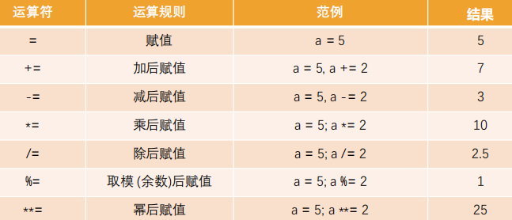
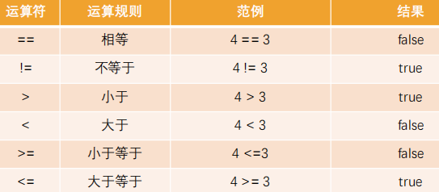

# 一. 运算符和运算元

---

## 1. 认识运算符

- 在小学的时候我们就学习了各种运算符，比如加号 +、乘号 \*、减号 - 、除号/
- 几乎所有的编程语言都有各种各样的运算符(也被称之为操作符，`operators`) 
  - 初次接触这些运算符，你会感觉种类繁多，难以记忆
  - 但是并不需要特别担心，因为很多的运算符我们在以后的开发中，每天都会使用
  - 多练习，不需要刻意去记忆
  - 而且常见的高级语言运算符都是相似的，学了JavaScript运算符很容易掌握C/C++/OC/Python等语言的运算符
- 计算机最基本的操作就是**执行运算**，执行运算时就需要使用运算符来操作：
  - 比如` console.log(20 + 30) `中的`+`号就是一个运算符
  - 比如` console.log(20 * 30) `中的`*`号也是一个运算符
- `js`按照使用场景的不同将运算符分成了很多种类型：
  - **算术运算符**、**赋值运算符**、 **关系(比较)运算符**、 **逻辑运算符**

## 2. 认识运算元

- 在正式开始运算之前，我们先学习一下常见的术语：
  - 运算元 —— **运算符应用的对象**
    - 比如说乘法运算 5 * 2，有两个运算元
    - 左运算元 5 和右运算元 2
    - 有时候人们也称其为“参数”
  - 如果一个运算符对应的只有**一个运算元**，那么它是 **一元运算符**
    - 比如说一元负号运算符（`unary negation`）`-`，它的作用是对数字进行正负转换
  - 如果一个运算符拥有**两个运算元**，那么它是 **二元运算符**
    - 比如 2 + 3
- 一元运算符通常我们是使用` – `和` +`，`-`号使用的会较多一些

## 3. 算术运算符

- 算术运算符用在数学表达式中，它的使用方式和数学中也是一直的

- 算术运算符是对数据进行计算的符号

  

- 取余运算符是` %`，尽管它看起来很像百分数，但实际并无关联

  - `a % b `的结果是` a `整除` b `的余数

    ```js
    10 % 3 // 1
    ```

- 求幂运算` a \** b `将` a `提升至` a `的` b `次幂（`ES7`中的语法，也叫做`ES2016`） 

  - 在数学中我们将其表示为` a`的`b`次方

    ```js
    2**3 // 8
    ```

## 4. 赋值运算符

- 前面我们使用的`= `其实也是一个运算符，被称之为赋值运算符

- `= `是一个运算符，而不是一个有着“魔法”作用的语言结构

  - **语句` x = value `将值` value `写入` x `，然后返回` x`**

- 链式赋值（`Chaining assignments`） 

  ```js
  var a, b, c;
  a = b = c = 2 + 2 
  ```

  - 链式赋值**从右到左进行计算**

  - 首先，对最右边的表达式 2 + 2 求值，然后将其赋给左边的变量：c、b 和 a

  - 最后，**所有的变量共享一个值**

  - 但是从代码的可读性的角度来说，不推荐这种写法

## 5. 原地修改

- 什么是原地修改呢？

  - 我们经常需要**对一个变量做运算**，并**将新的结果存储在同一个变量中**

    ```js
    var a = 10, b = 20
    a = a + 10 // 20
    b = b * 2 // 40
    ```

  - 可以使用运算符` += `和` *= `来缩写这种表示

    ```js
    var a = 10, b = 20
    a += 10 // 20
    a *= 2 //40
    ```

- 所有算术和位运算符都有简短的“修改并赋值”运算符：`/= `和` -= `等

  

## 6. 自增、自减

- 对一个数进行加一、减一是最常见的数学运算符之一
- 所以，对此有一些专门的运算符：
  - 自增` ++ `将变量加1
  -  自减` -- `将变量减1
- **自增/自减只能应用于变量**
  - 将其应用于数值（比如 5++）则会报错
- `++`和`--`的位置
  - 运算符` ++ `和` -- `可以置于变量前，也可以置于变量后
    - 当运算符置于变量后，被称为“后置形式”（postfix form）：`counter++`
    - 当运算符置于变量前，被称为“前置形式”（prefix form）：`++counter`
    - 两者都做同一件事：将变量` counter `与` 1 `相加
  - 有什么区别吗?
    - 有，但只有当我们使用` ++/-- `的返回值时才能看到区别
    - 如果自增/自减的值不会被使用，那么两者形式没有区别
    - 如果我们想要对变量进行自增操作，并且 需要立刻使用自增后的值，那么我们需要使用前置形式
    - **前置形式返回一个新的值，但后置返回原来的值**

## 7. 运算符的优先级

- 运算符放到一起使用时会有一定的优先级
- 在`MDN`上给出了所有运算符的优先级
  - https://developer.mozilla.org/zh-CN/docs/Web/JavaScript/Reference/Operators/Operator_Precedence

## 8. 比较运算符

- 我们知道，在数学中有很多用于比较大小的运算符，在`js`中也有相似的比较：

  - 大于 / 小于：a > b，a < b
  - 大于等于 / 小于等于：a >= b，a <= b
  -  检查两个值的相等：`a == b`，请注意双等号` == `表示相等性检查，而单等号` a = b `表示赋值
  - 检查两个值不相等：不相等在数学中的符号是 `≠`，但在`js`中写成` a != b`

- **比较运算符的结果都是`Boolean`类型的**

  


> 注意：
>
> - **双等号中，`null `和` undefined `二者互等，跟除自身外其他任何值都是不等的**
> - **`NaN `不等于任何值，包括其自身**

## 9. == 和 === 区别

- 普通的相等性检查` == `存在一个问题，它不能区分出` 0 `和` false`，或者空字符串和` false`这类运算：
  - 这是因为**在比较不同类型的值时，处于判断符号` == `两侧的值大部分会先被转化为`Number`类型**
  - 空字符串和` false `也是如此，转化后它们都为数字` 0`
- 如果我们需要区分` 0 `和` false`，该怎么办？
  - 严格相等运算符` === `在进行比较时不会做任何的类型转换
  -  换句话说，如果` a `和` b `属于不同的数据类型，那么` a === b `不会做任何的类型转换而立刻返回 `false`
- 同样的，“不相等”符号` != `类似，“严格不相等”表示为` !==`
- 严格相等的运算符虽然写起来稍微长一些，但是它能够很清楚地显示代码意图，降低你犯错的可能性


# 二. 分支语句

---

## 1. 程序的执行顺序

- 在程序开发中，程序有三种不同的执行方式：

  - **顺序** —— 从上向下，顺序执行代码
  - **分支** —— 根据条件判断，决定执行代码的 分支
  - **循环** —— 让 特定代码 重复 执行

  

## 2. 代码块的理解

- 代码块是多行执行代码的集合，通过一个**花括号{}**放到了一起

  - 在开发中，一行代码很难完成某一个特定的功能，我们就会将这些代码放到一个代码块中

  - ```js
    {
        var msg = 'hello world'
        console.log(msg)
    }
    ```

- 在JavaScript中，我们可以通过流程控制语句来决定如何执行一个代码块：

  - 通常会通过**一些关键字来告知js引擎代码**要如何被**执行**
  - 比如分支语句、循环语句对应的关键字等


## 3. 什么是分支结构？

-  程序是生活的一种抽象, 只是我们用代码表示了出来
  - 在开发中, 我们经常需要根据一定的条件, 来决定代码的执行方向
  - 如果 条件满足，才能做某件事情
  - 如果 条件不满足，就做另外一件事情
- 分支结构
  - 分支结构的代码就是让我们根据条件来决定代码的执行
  - 分支结构的语句被称为**判断结构**或者**选择结构**
  - 几乎所有的编程语言都有分支结构（C、C++、OC、JavaScript等等）
- JavaScript中常见的分支结构有：
  -  if分支结构
  - switch分支结构

## 4. if分支语句

- if分支结构有三种：
  - 单分支结构
    - if...
  - 多分支结构
    -  if..else..
    - if..else if..else..

## 5. 单分支结构

- 单分支语句：if

  -  if(...) 语句计算括号里的条件表达式，如果计算结果是 true，就会执行对应的代码块

    

- 案例一: 如果小明考试超过90分, 就去游乐场

  - “如果”相当于JavaScript中的关键字if
  - 分数超过90分是一个条件(可以使用 > 符号) 

- 案例二：单位5元/斤的苹果，如果购买超过5斤，那么立减8元

  -  注意：这里我们让用户输入购买的重量，计算出最后的价格并且弹出结果

## 6. if语句的细节补充

- 补充一：如果代码块中只有一行代码，那么{}可以省略
- 补充二：if (…) 语句会计算圆括号内的表达式，并将计算结果转换为布尔型（Boolean）
  - 转换规则和Boolean函数的规则一致
  - **0、""、null、undefined 和 NaN** 都会被转换成 **false**
    - 因为它们被称为 " 假值（falsy）"
  - 其他值被转换为true，所以它们被称为 " 真值（truthy）"

## 7. 多分支语句：if.. else..

- if 语句有时会包含一个可选的 "else" 块
- 如果判断条件不成立，就会执行它内部的代码


- 案例一：如果分数超过90分去游乐场，否则去上补习班
  - 满足条件时，做某些事情
  -  不满足（else），去做另外一些事情
- 案例二：m=20，n=30，比较两个数字的大小，获取较大的那个数字

## 8. 多分支结构：if.. else if.. else..

- 有时我们需要判断多个条件
- 我们可以通过使用 else if 子句实现


- 案例: 分数评级
  - 考试分数大于90：优秀
  - 大于80小于等于90：良好
  - 大于60小于等于80：合格
  - 小于60分：不及格

# 三. 三元运算符

---

- 有时我们需要根据一个条件去赋值一个变量

  - 比如比较数字大小的时候，获取较大的数字
  - 这个时候if else语句就会显得过于臃肿，有没有更加简介的方法呢？

- 条件运算符：?

  - 这个运算符通过问号 ? 表示
  - 有时它被称为三元运算符，被称为“三元”是因为该运算符中有**三个操作数（运算元）**
  - 实际上它是 JavaScript 中唯一一个有这么多操作数的运算符

- 使用格式如下：

  - ```js
    var result = condition ? value1 : value2
    ```

  - 计算条件结果，如果结果为真，则返回 value1，否则返回 value2

- 案例一： m=20，n=30，比较两个数字的大小，获取较大的那个数字

- 案例二：判断一个人是否是成年人了

# 四. 认识逻辑运算符

---

- 逻辑运算符，主要是由三个：

  - **||（或）**，**&&（与）**，**!（非）**
  - 它可以将多个表达式或者值放到一起来获取到一个最终的结果

  

- 有了逻辑运算符，我们就可以在判断语句中编写多个条件

## 1. || 逻辑或的本质

- ||（或）两个竖线符号表示 " 或 " 运算符（也称为**短路或**）：

  ```js
  var result = a || b
  ```

  - 从左到右依次计算操作数
  - 处理每一个操作数时，都将其转化为布尔值（Boolean）
  - 如果结果是 **true**，就**停止计算**，**返回**这个**操作数的初始值**
  - 如果所有的操作数都被计算过（也就是，转换结果**都是 false**），则**返回最后一个操作数**

- 注意：**返回的值**是**操作数的初始形式**，不会转换为Boolean类型

- 换句话说，一个或运算 || 的链，将返回第一个真值，如果不存在真值，就返回该链的最后一个值

  ```js
  var nickname = name1 || name2 || 'anonymous'
  // 返回第一个真值，没有真值，默认返回最后一个值
  ```

## 2. && 逻辑与的本质

-  &&（或）两个竖线符号表示 " 与 " 运算符（也称为**短路与**）：

  ```js
  var result = value1 && value2 && value3
  // 返回第一个假值，没有假值，默认返回最后一个值
  ```

  - 从左到右依次计算操作数
  - 在处理每一个操作数时，都将其转化为布尔值（Boolean）
  - 如果结果是 **false**，就**停止计算**，并**返回**这个**操作数的初始值**（一般不需要获取到初始值）
  - 如果所有的操作数都被计算过（例如**都是真值**），则**返回最后一个操作数**

- 换句话说，与运算 返回第一个假值，如果没有假值就返回最后一个值

  ```js
  var obj;
  obj.name //  这样使用，有风险，obj不存在name属性，会报错：Cannot read properties of undefined (reading 'name')
  obj && obj.name // 这样使用，代码更严谨，会先判断obj是否为真值，为真值则执行后续运算元，为假值，则不会报错，会返回假值运算元的初始值：这里obj为假值，其初始值为undefined
  ```

## 3. ! 逻辑非

- 逻辑非运算符接受一个参数，并按如下运算：
  - 步骤一：将操作数转化为布尔类型：true/false
  -  步骤二：返回相反的值（**取反**）
- 两个非运算 !! 有时候用来将某个值转化为布尔类型：
  - 也就是，第一个非运算将该值转化为布尔类型并取反，第二个非运算再次取反
  - 最后我们就得到了一个任意值到布尔值的转化

# 六. switch语句

- switch是分支结构的一种语句：

  - 它是通过判断**表达式的结果**（或者变量）**是否等于case语句的常量**，**来执行相应的分支体**的

- 与if语句不同的是，switch语句只能做**值的相等判断**（使用全等运算符 ===），而if语句可以做值的范围判断

- switch的语法：

  - switch 语句有至少一个 case 代码块和一个可选的 default 代码块

  ```js
  switch(表达式or常量) {
      case 常量1 ：
          ...
          break
      case 常量2 ：
          ...
          break
      default: 
          ...
  }
  ```

- 补充

  - **case穿透问题：**
    - 一条case语句结束后，会自动执行下一个case的语句
    - 这种现象被称之为case穿透
  - **break关键字**
    - 通过在每个case的代码块后添加break关键字来解决这个问题
  - **注意事项：这里的相等是严格相等**
    - 被比较的值必须是相同的类型才能进行匹配
  - 案例练习：播放模式（单曲循环、循环播放、随机播放）
