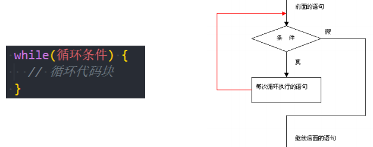
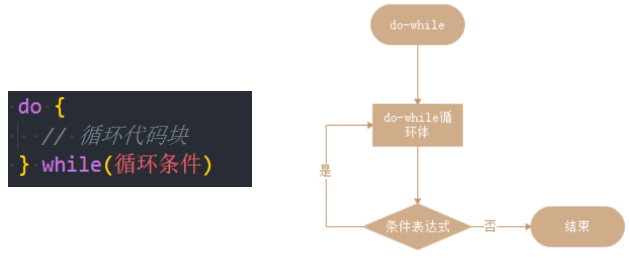
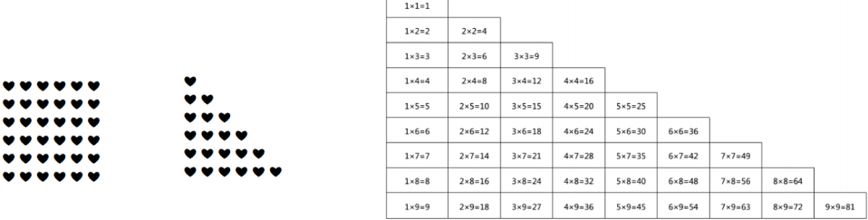

# 一. 认识循环语句

---

- 在开发中我们经常需要做各种各样的循环操作：
  - 比如把一个列表中的商品、歌曲、视频依次输出进行展示
  - 比如对一个列表进行累加计算
  - 比如运行相同的代码将数字 1 到 10 逐个输出
- 循环 是一种重复运行同一代码的方法
  - 如果是对某一个列表**进行循环操作**，我们通常也会称之为 **遍历**（`traversal`）或者**迭代**（`iteration`）
- 在`js`中支持三种循环方式：
  - `while`循环
  - `do while`循环
  - `for`循环


# 二. while循环

----

- `while`循环的语法如下：

  - 当条件成立时，执行代码块

  - 当条件不成立时，跳出代码块

    

- 如果条件一直成立（为`true`），那么会产生死循环

  - 这个时候必须通过关闭页面来停止死循环
  - 开发中一定要避免死循环的产生

- `while`循环的练习

  - 练习一：打印10次`Hello World`
  
    ```js
    var count = 0
    while (count < 10) {
      console.log('hello world')
      count++
    }
    ```
  
  - 练习二：打印0~99的数字
  
    ```js
    var count = 0
    while (count < 100) {
      console.log(count)
      count++
    }
    ```
  
  - 练习三：计算0~99的数字和
  
    ```js
    var count = 0
    var sum = 0
    while (count < 100) {
      sum += count++
    }
    console.log('sum: ', sum)
    ```
  
  - 练习四：计算0~99所有奇数的和
    - 性能优化写法：从1开始累加，每次循环自增2
    
      ```js
      var count = 1
      var sum = 0
      while (count < 100) {
        sum += count
        count += 2
      }
      console.log('sum: ', sum)
      ```
    
  - 练习五：计算0~99所有偶数的和
    - 性能优化写法：从0开始累加，每次循环自增2
    
      ```js
      var count = 0
      var sum = 0
      while (count < 100) {
        sum += count
        count += 2
      }
      console.log('sum: ', sum)
      ```


# 三. do..while循环

---

- `do..while`循环和`while循`环非常像，二者经常可以相互替代
  
  - 但是`do..while`的特点是**不管条件成不成立，`do`循环体都会先执行一次**
  
    

# 四. for循环

---

- `for `循环更加复杂，但它是最常使用的循环形式

  ```js
  for (begin; condition; step) {
    // 循环代码块
  }
  ```

  |     语句段     |    例子     |                    执行过程                     |
  | :------------: | :---------: | :---------------------------------------------: |
  |    `begin`     | `let i = 0` |               进入循环时执行一次                |
  |  `condition`   |   `i < 3`   | 在每次循环迭代之前检查，如果为`false`，停止循环 |
  | `body`(循环体) | `alert(i)`  |              条件为真时，重复运行               |
  |     `step`     |    `i++`    |             在每次循环体迭代后执行              |

- `begin `执行一次，然后进行迭代：每次检查` condition `后，执行` body `和` step`

- `for`循环的练习

  - 练习一：打印10次`Hello World`

    ```js
    for (var i = 0; i < 10; i++) {
      console.log('hello world')
    }
    ```

  - 练习二：打印0~99的数字

    ```js
    for (var i = 0; i < 100; i++) {
      console.log(i)
    }
    ```

  - 练习三：计算0~99的数字和

    ```js
    var sum = 0
    for (var i = 0; i < 100; i++) {
      sum += i
    }
    console.log('sum: ', sum)
    ```

  - 练习四：计算0~99所有奇数的和
    - 性能优化写法：从1开始累加，每次循环自增2
    
      ```js
      var sum = 0
      for (var i = 1; i < 100; i += 2) {
        sum += i
      }
      console.log('sum: ', sum)
      ```
    
  - 练习五：计算0~99所有偶数的和
    - 性能优化写法：从0开始累加，每次循环自增2
    
      ```js
      var sum = 0
      for (var i = 0; i < 100; i += 2) {
        sum += i
      }
      console.log('sum: ', sum)
      ```

- 什么是循环的嵌套呢？（日常开发使用不算多，在一些算法中比较常见）

  - 在开发中，某些情况下一次循环是无法达到目的的，我们需要循环中嵌套循环

- 我们通过`for`循环的嵌套来完成一些案例：

  

  - 案例一：在屏幕上显示包含很多❤的矩形

    ```js
    for (var y = 0; y < 6; y++) {
      var str = ''
      for (var x = 0; x < 6; x++) {
        str += '❤'
      }
      document.write(str + '<br />')
    }
    ```
  
  - 案例二：在屏幕上显示一个三角的❤图像
  
    ```js
    for (var y = 0; y < 6; y++) {
      var str = ''
      for (var x = 0; x <= y; x++) {
        str += '❤'
      }
      document.write(str + '<br/>')
    }
    ```
  
  - 案例三：在屏幕上显示一个九九乘法表
  
    ```js
    document.write('<table style="border-collapse: collapse;">')
    for (var y = 1; y <= 9; y++) {
      var str = ''
      document.write('<tr>')
      for (var x = 1; x <= y; x++) {
        str = x + 'x' + y + '=' + x * y
        document.write(
          '<th style=" width: 100px; border: 1px solid black; padding: 6px; box-sizing: border-box;">' +
            str +
            '</th>'
        )
      }
      document.write('</tr>')
    }
    document.write('</table>')
    ```


# 五. break、continue、return

---

- 循环的跳转（控制）：
  - 在执行循环过程中, 遇到某一个条件时, 我们可能想要做一些事情
  - 比如循环体不再执行(即使没有执行完), 跳出循环
  - 比如本次循环体不再执行, 执行下一次的循环体
  
- 循环的跳转控制
  - **`break`：直接跳出循环，循环结束**
    - `break `某一条件满足时，退出循环，不再执行后续重复的代码
  - **`continue`：跳过本次循环次，执行下一次循环体**
    - `continue `指令是` break `的“轻量版”
    - `continue `某一条件满足时，不执行后续重复的代码
  
- 猜数字游戏规则：
  - 电脑随机生成一个0~99之间的数字
  
  - 玩家有7次猜测的机会
  
  - 玩家猜测一个数字, 输入到程序中
  
  - 电脑根据输入的数字打印: 猜大了/猜小了/猜对了的情况
  
  - 猜对了, 那么游戏结束，显示恭喜您
  
  - 7次机会用完打印: 您的次数用完了, 您失败了
  
    ```js
    // 1.随机生成一个0~99的数字
    var randomNum = Math.floor(Math.random() * 100)
    alert(randomNum)
    
    // 2.玩家有7次机会猜测数字
    var isSuccess = false
    var count = 3
    for (var i = 0; i < count; i++) {
      // 获取用户的输入
      var inputNum = Number(prompt("请输入您猜测的数字:"))
    
      // 和randomNum进行比较
      if (inputNum === randomNum) {
        alert("恭喜您, 猜对了")
        isSuccess = true
        break
      } else if (inputNum > randomNum) {
        alert("您猜大了")
      } else {
        alert("您猜小了")
      }
    
      if (i === count - 1) {
        alert("您的次数已经用完了")
      }
    }
    
    // if (!isSuccess) {
    //   alert("您的机会用完了~")
    // }
    ```
  
- **`return`：只能在函数体中使用**
  - `return`语句**终止函数的执行**，并返回一个指定的返回值，没有指定，则返回默认值`undefined`

> 注意：
>
> - **`forEach`方法中无法使用`break`和`continue`，只能通过`try...catch`捕捉`forEach`中抛出的异常**
> - `every`方法中也无法使用`break`，可以使用`return false`或`return(return undefined)`来跳出循环


# 六. 循环的总结

---

- `while` —— 每次迭代之前都要检查条件
- `do..while` —— 每次迭代后都要检查条件
- `for (...)` —— 每次迭代之前都要检查条件，可以使用其他设置
-  `break / continue` —— 可以对循环进行控制


