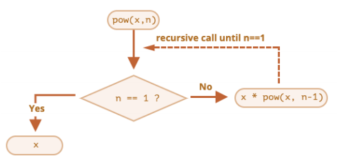
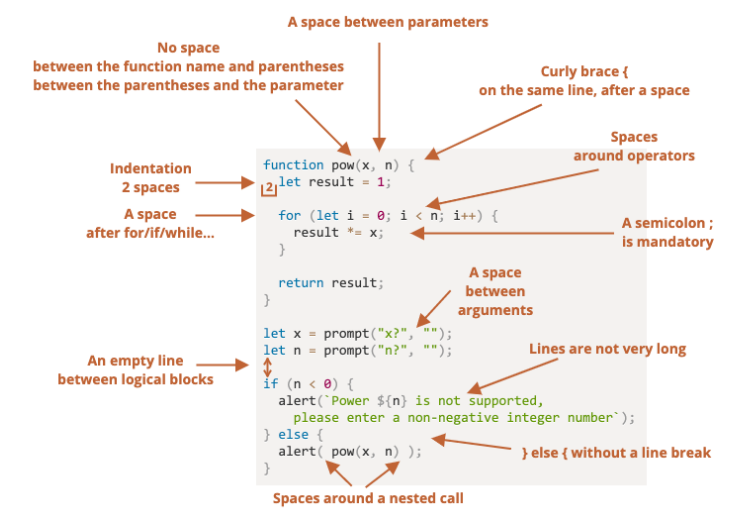
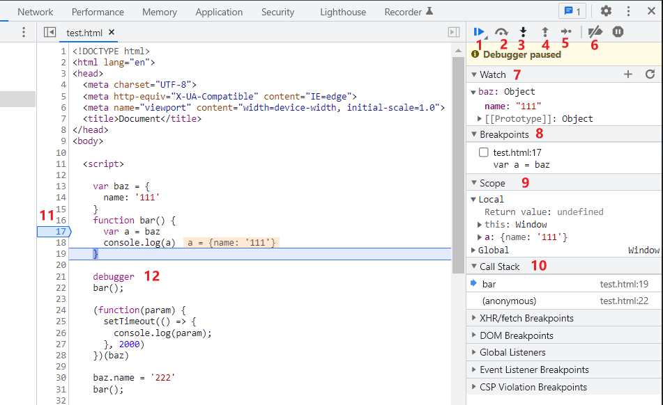

# 一. JavaScript函数

---

## 1. 程序中的foo、bar、baz

- 在学习编程的过程中，你可能会经常看到`foo、bar、baz`这些名词：
  - 它们通常被用来作为**函数**、**变量**、**文件**的名词
  - 目前已经编程了计算机编程的术语一部分
  - 但是它们本身并**没有特别的用途和意义**
  - 常被称之为 “**伪变量**”（`metasyntactic variable`） 
- 那么它们有什么由来吗？
  - 事实上，`foo`、`bar`这些名词最早从什么时候、地方流行起来的一直是由争论的
  - 一种说法是通过Digital（迪吉多，数字设备公司，成立于1957年的美国电脑公司）的手册说明流行起来的
  - 一种说法是说源自于电子学中的反转`foo`信号
  - 也有一种说法是`foo`因为出现在了一个漫画中，漫画中`foo`代表“好运”，与中文的福读音类似
- 总之，`foo、bar、baz`已经是编程领域非常常用的名词
  - 我个人也比较习惯在写一些变量、函数名词时使用这些词汇，大家做一个了解
  - 类似与给函数变量文件等取无意义的名词，**类似：张三李四**

## 2. 认识函数

- 什么是函数呢? 
- 目前, 我们已经接触过几个函数了
  - `alert`函数：浏览器弹出一个弹窗
  - `prompt`函数：在浏览器弹窗中接收用户的输入
  - `console.log`函数：在控制台输出内容
  - `String / Number / Boolean`等类型转换函数
- 当我们在谈函数时, 到底在谈些什么? 
  - **函数**其实就是**某段代码的封装**，这段代码帮助我们**完成某一个功能**
  - 默认情况下`js`引擎或者浏览器会给我们提供一些已经实现好的函数
  - 我们也可以编写属于自己的函数

## 3. 函数使用的步骤

- 函数的使用包含两个步骤：
  - **声明函数** —— 封装 独立的 " 工具 " 来实现某些功能
  - **调用函数** —— 使用 封装的 " 工具 " 来实现某些功能
- 声明函数，在`js`中也可以称为定义函数： 
  - 声明函数的过程是对某些功能的封装过程
  - 在之后的开发中，我们会根据自己的需求定义很多自己的函数
- 调用函数，也可以称为函数调用：
  - 调用函数是让已存在的函数为我们所用
  - 这些函数可以是刚刚自己封装好的某个功能函数
  - 当然, 我们也可以去使用默认提供的或者其他三方库定义好的函数
- **函数的作用**：
  - 在开发程序时，使用函数可以提高编写的效率以及**代码的复用**

## 4. 声明和调用函数

- 声明函数使用`function`关键字：这种写法称之为函数的定义

  ```js
  function 函数的名字() {
    // 函数封装的代码（函数体）....
  }
  ```

- 注意：

  -  函数名的命名规则和前面变量名的命名规则是相同的
  - 函数要尽量做到**见名知意**（并且函数通常是一些行为（`action`），所以使用动词会更多一些）
  - 函数定义完后里面的代码是不会执行的，函数必须调用才会执行

- 调用函数通过**函数名`()`**即可：比如`test()`

- 函数的练习：

  - 练习一：定义一个函数，打印一个人的个人信息
  
    ```js
    function logInfo() {
      console.log('name: ', 'later-zc')
    }
    ```
  
  -  练习二：定义一个函数，函数中计算10和20数字的和，并且打印出结果
  
     ```js
     function sum() {
     	console.log(10 + 20)
     }
     ```

## 5. 函数的参数

- 函数，把具有独立功能的代码块 组织为一个小模块，在需要的时候调用

- 函数的参数，增加函数的通用性，针对相同的数据处理逻辑，能够适应更多的数据

  - **在函数内部**，把**函数参数当做变量使用**，进行需要的数据处理

  - 函数调用时，按照函数定义的参数顺序，把希望在函数内部处理的数据，通过参数传递

    

- 形参和实参

  - **形参（参数` parameter`）**：定义函数时，小括号中的参数，是用来接收参数用的，**在函数内部作为变量使用的形式参数**

  - **实参（参数` argument`）**：调用函数时，小括号中的参数，是用来把数据传递到**函数内部用的实际参数**

    ```js
    function fn(形参1, 形参2, ...) {}
    fn(实参1, 实参2, ...)
    ```

## 6. 函数的返回值

- 回想我们之前使用的`prompt`函数，函数需要接受参数，并且会返回用户的输入：

- 所以说，函数不仅仅可以有参数，也可以有返回值：

  - 使用`return`关键字来返回结果，**`return`会立即终止当前函数的执行**

  - 一旦在函数中执行`return`操作，那么当前函数会终止

  - 如果函数中没有使用` return`语句 ，那么函数有**默认的返回值**：**`undefined`**

  - 如果函数使用` return`语句，但是`return`后面没有任何值，那么函数的返回值也是：`undefined`

    

- 函数的练习

  - 练习一：实现一个加法计算器
  
    ```js
    function sum(a, b) {
      return a + b
    }
    ```
  
  - 练习二：定义一个函数，传入宽高，计算矩形区域的面积
  
    ```js
    function getRectangleArea(width, height) {
      return width * height
    }
    ```
  
  - 练习三：定义一个函数，传入半径，计算圆形的面积
  
    ```js
    function getCircleArea(radius) {
      // return Math.PI * radius * radius
      return Math.PI * radius ** 2
    }
    ```
  
  - 练习四：定义一个函数，传入n（n为正整数），计算1~n数字的和
  
    ```js
    function sumN(n) {
      // 1.对n的判断
      if (n <= 0) {
        console.log(`您传入的${n}是有问题的`)
        return
      }
    
      // 2.真正对1~n的数字进行计算
      // 1~n的数字和
      // 1~5 1 2 3 4 5
      var total = 0
      for (var i = 1; i <= n; i++) {
        total += i
      }
      return total
    }
    ```
  
  - 实战函数练习：
    - 传入一个数字，可以根据数字转化成显示为亿、万文字显示的文本
    
      ```js
      // 从服务器拿到很多的数字
      var playCount1 = 13687 // 13687
      var playCount2 = 5433322 // 543万
      var playCount3 = 8766663333 // 87亿
      
      
      // 封装一个工具函数: 对数字进行格式化
      // 10_0000_0000就是1000000000语法糖
      // 语法糖的概念: 一种简写或者特殊的写法, 这种写法相对于原有的写法更加的方便或者阅读性更强
      // 相比于原来的写法, 有一点点的甜头, 称之为语法糖
      function formatCount(count) {
        var result = 0
        if (count >= 10_0000_0000) { // 超过10_0000_0000值进行转换
          result = Math.floor(count / 1_0000_0000) + "亿"
        } else if (count >= 10_0000) {
          result = Math.floor(count / 1_0000) + "万"
        } else {
          result = count
        }
      
        return result
      }
      
      console.log(formatCount(playCount1)) // 13687
      console.log(formatCount(playCount2)) // 543万
      console.log(formatCount(playCount3)) // 87亿
      ```


# 二 . arguments参数(js高级再学习)

---

- 事实上在函数有一个特别的对象：`arguments`对象
  - 默认情况下，**`arguments`对象是所有函数（不包括箭头函数）中都可用的局部变量**
  - 该对象中存放着所有的调用者传入的参数，从0位置开始，依次存放
  - `arguments`变量的类型是一个**`object`类型（` array-like `），不是一个数组**，但是和数组的用法看起来很相似
  - 如果调用者传入的参数多余函数接收的参数，可以通过`arguments`去**获取所有的参数**
- 因为这里涉及到数组、对象等概念，目前了解有这么一个参数即可
  - 后续我们会对其专门进行学习，包括和数组之间的转化


# 三. 函数的递归

---

## 1. 函数中调用函数

- 在开发中，函数内部是可以调用另外一个函数的

  ```js
  function bar() {
    foo()
  }
  function foo() {}
  ```

- 既然函数中可以调用另外一个函数，那么函数是否可以调用自己呢？

  - 当然是可以的

  - 但是函数调用自己必须有结束条件，否则会产生无限调用，造成报错

    ```js
    var count = 0
    function bar() {
      count++
      bar()
    }
    bar() // Maximum call stack size exceeded 超过最大调用堆栈大小
    ```

## 2. 递归的实现思路

- 事实上，**函数调用自己还有一个专业的名词，叫做递归**（`Recursion`） 

- 在语言学方面，我们也可以描述为递归：

  - 从前有座山，山里有座庙，庙里有个老和尚，正在给小和尚讲故事呢！故事是什么呢？
  - 递归读取上面的话

- 递归是一种重要的编程思想：

  - 将一个复杂的任务，转化成可以**重复执行的相同任务**

- 案例：实现一个自己的幂函数`pow`（`pow`单词可以表示指数的意思）

  - 我们可以先用`for`循环来实现

    ```js
    function pow(x, y) {
      var result = 1
      for (var i = 0; i < y; i++) {
        result * = x
      }
      return result
    }
    ```

  - 另一种实现思路是递归实现：

    ```js
    function pow(x, y) {
      if (y == 1) return x 
      return x * pow(x, y-1) // x的n次方 = x * x的n次方-1
    }
    ```
    
  - 这是因为在数学上：**x的n次方 = x * x的n次方-1**
    - 那么对于函数的调用，我们也可以进行划分
    
    - 这里需要有一个结束的条件，就是当n已经等于1的时候就不需要拆分了
    
      
    

- 递归的代码第一次接触会有点绕，对于初次接触函数的同学，可以先跳过去

  - 后续我们讲解数据结构与算法时，会使用递归来解决一些算法问题

## 3. 实现斐波那契的递归

- 什么是斐波那契数列？

  ```
  什么是斐波那契数列，前两个数字是1，后面的每一个数字是前两个数字之和
  数列: 1 1 2 3 5 8 13 21 34 55  ... x
  位置: 1 2 3 4 5 6 7  8  9  10  ... n
  ```

- 递归实现

  ```js
  function fibonacci(n) {
    if (n === 1 || n === 2) return 1
    return fibonacci(n-1) + fibonacci(n-2)
  }
  ```

- `for`循环实现

  ```js
  function fibonacci(n) {
    // 特殊的情况(前两个数字)
    if (n === 1 || n === 2) return 1
  
    // for循环的实现
    var n1 = 1
    var n2 = 1
    var result = 0
    for (var i = 3; i <= n; i++) {
      result = n1 + n2
      n1 = n2
      n2 = result
    }
    return result
  }
  ```


# 四. 作用域，局部变量，外部变量

---

- **在`ES5`之前`js`中没有块级作用域的概念，但是函数可以形成自己的作用域**
  - `var`定义的变量是没有作用域的，`for`循环的代码块也是没有自己的作用域
  - **作用域（`Scope`）表示一些标识符的有效作用范围**（所以也有被翻译为有效范围的）
    - `message`在哪一个范围内可以被使用，称之为`message`的作用域(`scope`)
  - **函数的作用域表示在函数内部定义的变量，只有在函数内部可以被访问到**

- 外部变量和局部变量的概念：
  - 定义在函数内部的变量，被称之为局部变量（`Local Variables`）
  - 定义在函数外部的变量，被称之为外部变量（`Outer Variables`）
- 什么是全局变量？
  - 在函数之外声明的变量（在`script`中声明的），称之为全局变量
  - 全局变量在任何函数中都是可见的
  - 通过**`var`声明的全局变量会在`window`对象上添加一个对应的属性**
- 在函数中，访问变量的顺序是什么呢？
  - 优先访问自己函数中的变量，没有找到时，在外部中访问
- 关于块级作用域、作用域链、变量提升、`AO`、`VO`、`GO`等概念我们后续学习


# 五. 函数表达式

---

- 在`js`中，函数并不是一种神奇的语法结构，而是一种特殊的值

  - 前面定义函数的方式，我们称之为函数的声明（`Function Declaration`）

- 还有另外一种写法是函数表达式（`Function Expressions`）：

  ```js
  var foo = function() {...}
  ```

- 注意，`function `关键字后面没有函数名

  - **函数表达式允许省略函数名**

- **无论函数是如何创建的，函数都是一个值**（**这个值的类型是一个对象**，对象的概念后面会讲到）

- 在`js`开发中，我们可以将函数作为**头等公民**


# 六. 函数声明 与 函数表达式 的区别

---

- 在开发中，函数的声明和函数表达式有什么区别，以及如何选择呢？
- **语法不同和`js`引擎创建时机不同**：
  - **函数声明**：
    - 在主代码流中**声明为单独的语句的函数**
    - 在函数声明被定义之前，**定义前可以调用**
      - 这是内部算法的原故，**当`js`引擎准备运行脚本时，首先会在脚本中寻找全局函数声明，并创建这些函数**
  - **函数表达式**：
    - **在一个表达式中或另一个语法结构中创建的函数**
    - **在代码执行到达时被创建，定义后才能调用**
- 开发中如何选择呢？
  - 当我们需要声明一个函数时，首先考虑函数声明语法
  - 它能够为组织代码提供更多的灵活性，因为我们可以在声明这些函数之前调用这些函数


# 七. 函数的头等公民

---

- **头等函数**（`first-class function `第一级函数）是指**在程序设计语言中，函数被当作头等公民**

  - 这意味着，**函数可以作为别的函数的参数、函数的返回值，赋值给变量或存储在数据结构中**
  - 有人主张也应包括支持匿名函数

- 通常我们对**函数作为头等公民的编程方式**，称之为**函数式编程**

  - `js`就是符合函数式编程的语言，这个也是`js`的一大特点

- 比如：函数可以在变量和变量之间相互进行赋值

  ```js
  function foo(fn) {}
  var bar = foo
  bar()
  ```


# 八. 回调函数，匿名函数

---

- 既然函数可以作为一个值相互赋值，那么也可以传递给另外一个函数

  ```js
  function foo(fn) {
    fn() // 通过fn去调用bar函数的过程, 称之为函数的回调
  }
  function bar() {}
  foo(bar)
  ```

- `foo`这种函数我们也可以称之为高阶函数（`Higher-order function`）

- **高阶函数**必须至少满足两个条件之一：

  - **接受一个或多个函数作为参数输入**
  - **输出一个函数**

- 匿名（`anonymous`）函数的理解：

  - 如果在**传入一个函数时**，我们**没有指定这个函数的名字或者通过函数表达式指定函数对应的变量**，那么这个函数称之为**匿名函数**


# 九. 立即执行函数

---

## 1. 立即执行函数?

- 专业名字：`Immediately-Invoked Function Expression`（`IIFE` **立即调用函数表达式**）

- 表达的含义是**一个在定义时就会立即执行的函数**

  - 第一部分是包围在 [`圆括号运算符`](https://developer.mozilla.org/zh-CN/docs/Web/JavaScript/Reference/Operators/Grouping) `()` 里的一个匿名函数，这个匿名函数**拥有独立的词法作用域，避免了外界访问内部的变量，也不会污染全局作用域**

  - 第二部分再一次使用 `()` 创建了一个立即执行函数表达式，`js`引擎到此将直接执行该函数

    ```js
    (function() {
      console.log('立即执行函数')
    })()
    ```

- `{} `：代码块 / 对象类型

- `() `：**控制优先级** / **函数的调用** / 函数的参数

- `[]` ：定义数组 / 从数组或对象中取值 / 对象的计算属性

> 注意：
>
> - 一段代码如果结束后，紧跟着的是` [] `或者`()`，可能会导致意料之外的解析报错，需要在该段代码后面添加分号`;`
>
>   ```js
>   var num = 22
>   () // 这种情况就会引发解析报错，22 is not a function
>   ```

## 2. 这个东西有什么用？

- **会创建一个独立的执行上下文环境，可以避免外界访问或修改内部的变量，也避免了对内部变量的修改**

  ```js
  var btns = document.querySelectorAll('.btn')
  for (var i = 0; i < btns.length; i++) {
    (function(m) {
      btns[m].onclick = function() {
        console.log(`第${m}个按钮被点击`)
      }
    })(i)
  }
  ```

## 3. 立即执行函数的其他写法

- **立即执行函数必须是一个表达式（整体），不能是函数声明**：

  - 下面的这种写法会报错，因为是一个函数声明，不是一个函数表达式

  - 当圆括号出现在函数的末尾想要调用函数时，`js`引擎会默认当成是函数声明，而在函数声明后加一个圆括号，这种写法是不被支持，必须是一个表达式，圆括号大部分情况下，表示优先执行，而空的圆括号，本身在`js`引擎里也是不被解析的，是没有意义的

    ```js
    function foo() {
      console.log('这种写法是不支持的')  
    }()
    ```

  - **当圆括号包裹函数时，`js`引擎会默认将函数作为一个表达式去解析，而不是函数声明**

    ```js
    (function foo() {
      console.log('立即执行函数') 
    })()
    ```

  - 下面的写法也是一个函数表达式，所以可以执行

    ```js
    +function foo() {
    	console.log('立即执行函数')
    }()
    (function foo() {
    	console.log('立即执行函数')
    }())
    ```


# 十. 代码风格

---




# 十一. Chrome的debug调试技巧

---



1. 恢复当前脚本执行 `resume script execution`
2. 跳过下一个函数调用 `step over next function call`
3. 进入下一个函数调用 `step into next function call`
4. 跳出当前函数调用 `step out current function`
5. 下一步 `step`
6. 禁用断点 `deactivate breakpoints`
7. 可以添加对某个变量的监听
8. 显示断点列表，支持对断点的控制
9. 作用域
10. 函数调用栈
11. 支持在对应行数添加删除断点等控制
12. `debugger`标识符可以在代码里，打断点


​	