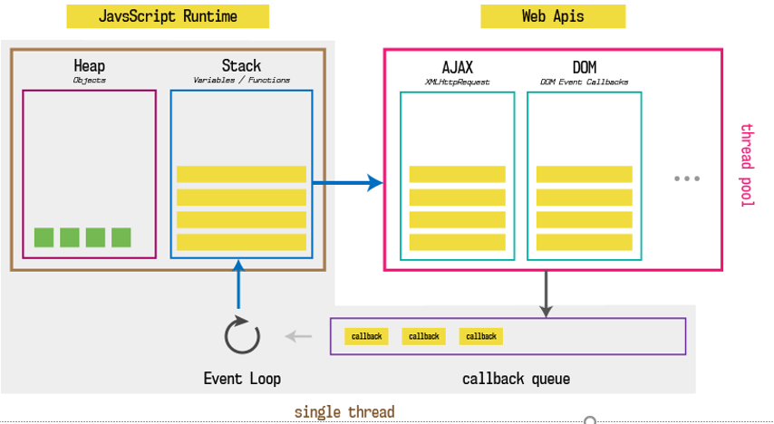
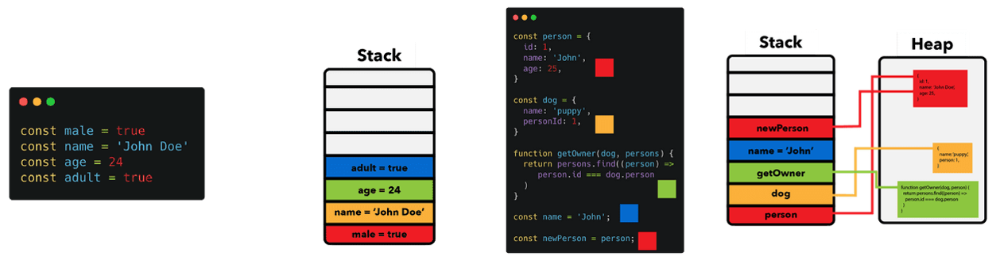
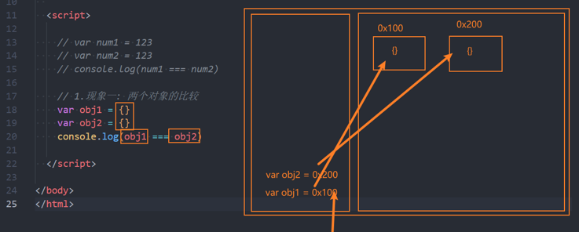
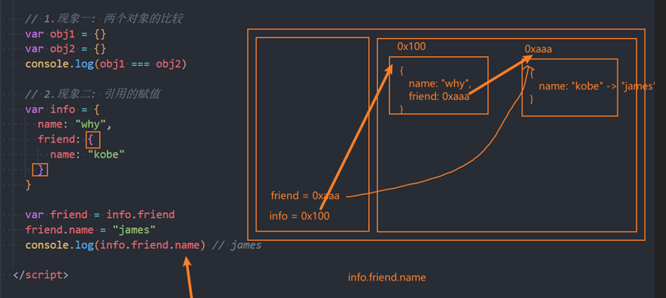
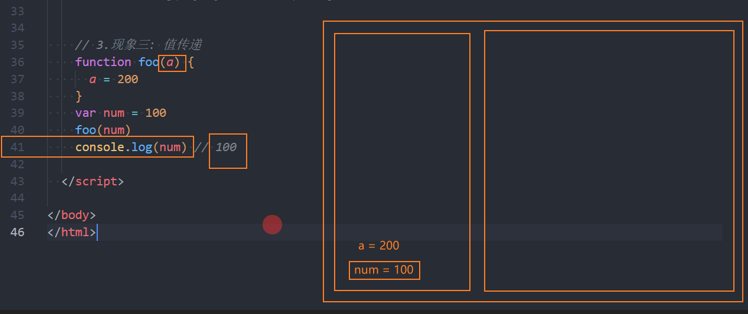
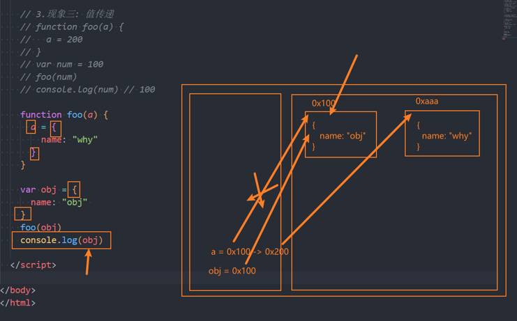
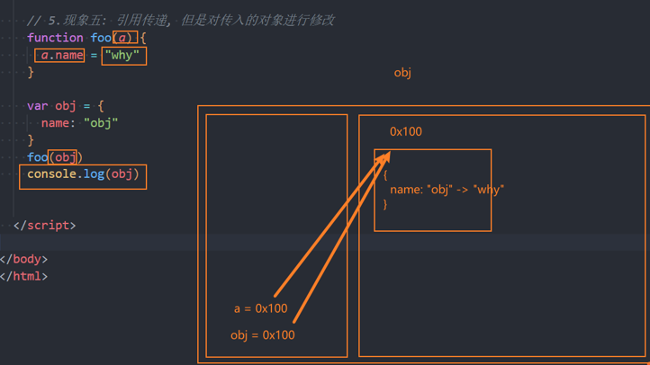
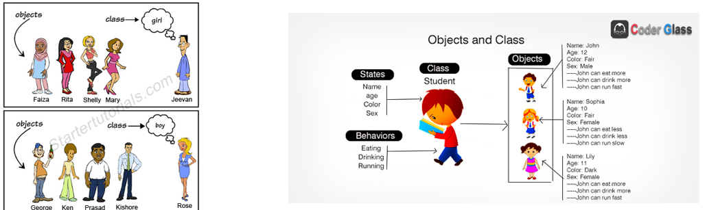
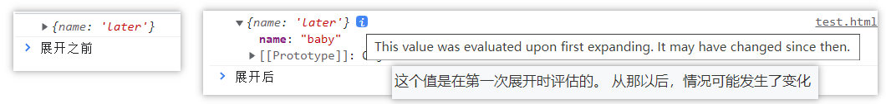

# 一. 对象类型的使用

---

## 1. 认识对象类型

- 在数据类型中我们提到还有一种特别的类型：对象类型
  - 对象类型涉及到`js`的各个方面，所以掌握对象类型非常重要
  - 对象类型是一种**存储键值对**（`key-value`）的更复杂的**数据类型**
- 为什么需要对象类型呢？
  - 基本数据类型可以存储一些简单的值，但是现实世界的事物抽象成程序时，往往比较复杂
  - 比如一个人，有自己的特性（比如姓名、年龄、身高），有一些行为（比如跑步、学习、工作）
  - 比如一辆车，有自己的特性（比如颜色、重量、速度），有一些行为（比如行驶）
- 这个时候，我们需要一种新的类型将这些特性和行为组织在一起，这种类型就是对象类型
  - 对象类型可以使用`{}`来创建的复杂类型，里面包含的是键值对（`"key: value"`）
  - 键值对可以是属性和方法（**在对象中的函数称之为方法**）
  - 其中**`key`是字符串，也叫做属性名`property name` ，`ES6`之后也可以是`Symbol`类型**
    - `key`：字符串类型，但是**在定义对象的属性名时，大部分情况下引号都是可以省略的**
    - **属性名称必须是字符串或符号` Symbol`**，这意味着**非字符串对象不能用来作为一个对象属性的键**。任何非字符串对象，包括` Number`，都会通过 `toString`方法，被转换成一个字符串
  - 其中**`value`可以是任意类型**，包括基本数据类型、函数类型、对象类型等

## 2. 创建对象和使用对象

- 对象的创建方法有很多，包括三种：

  - **对象字面量**（`Object Literal`）

    ```js
    var obj = {
      name: "later"
    }
    ```

  - **`new Object()` + 动态添加属性**

    ```js
    // Object构造函数
    var obj = new Object()
    obj.name = "later"
    ```

  - **`new `其他类**

    ```js
    function Person() {}
    var obj = new Person()
    ```

- 目前我们主要掌握对象字面量的方式，后续我们学习其他两种方式

  - 属性之间是以逗号（`comma`）分割的

- 对象的使用过程包括如下操作：

  ```js
  var obj = {
    name: 'later'
  }
  // 访问对象的属性
  console.log(obj.name)
  
  // 修改对象的属性
  obj.name = 'sensen'
  
  // 添加对象的属性
  obj.age = 23
  
  // 删除对象的属性 delete操作符
  delete obj.age
  ```

## 3. 方括号和引用的使用

- 为什么需要使用方括号呢？

  - 对于多次属性来说，`js`是无法理解的

    ```js
    var obj = {
      'good friend': 'later'
    }
    // 点语法 不支持
    obj.good friend // ';' expected.
    ```

  - 这是因为**点符号要求`key`必须是有效的变量标识符，不能是数字或字符的形式**

    - **不包含空格，不以数字开头，也不包含特殊字符（允许使用`$`和`_`）**

  - 这个时候我们可以使用方括号：

    - **方括号允许我们在定义或者操作属性时更加的灵活，可以是任意的字符串**

      ```js
      var obj = {
        'good friend': 'later'
      }
      obj['good friend']
      ```


> 总结：
>
> - **点语法：必须是有效的变量标识符**
> - **方括号：可以是任意的字符串**

## 4. 对象的遍历

- 对象的遍历（迭代）：**表示获取对象中所有的属性和方法**

- **Object.keys()** 方法会**返回一个由给定对象的自身可枚举属性组成的字符串数组**

- 遍历方式一：普通`for`循环

  ```js
  var info = {...}
  var infoKeys = Object.keys(info) // 获取info对象所有可枚举key组成的一个字符串数组
  
  for (var i = 0; i < infoKeys.length; i++) {
    var key = infoKeys[i]
    var value = info[key]
    console.log(`key: ${key}, value: ${value}`)
  }
  ```

- 遍历方式二：`for...in `遍历对象

  ```js
  for (var key in info) { // 任意顺序迭代一个对象的除Symbol以外的可枚举属性, 包括继承过来的可枚举属性
    var value = info[key]
    console.log(`key: ${key}, value: ${value}`)
  }
  ```


# 二. 内存中的值类型和引用类型

---

## 1. 内存

- 计算机存储器（英语：`Computer memory`）是一种利用[半导体](https://zh.wikipedia.org/wiki/半導體)、磁性介质等技术制成的存储[资料](https://zh.wikipedia.org/wiki/資料)的电子设备，其[电子电路](https://zh.wikipedia.org/wiki/電子電路)中的资料以[二进制](https://zh.wikipedia.org/wiki/二进制)方式存储，不同存储器产品中基本单元的名称也不一样
  - 计算机存储器可分为内部存储器（又称内存或主存）和外部存储器
  - 其中**内存是`CPU`能直接寻址的存储空间**，有半导体器件制成，**内存的特点是访问速率快**

## 2. 栈内存stack和堆内存heap

- 我们知道**程序是需要加载到内存中由`CPU`来执行的**，我们可以将**内存划分为两个区域**：**栈内存和堆内存**

  - **原始(基本)类型**占据的空间是在**栈内存**中分配的
  
  - **对象(复杂)类型**占据的空间是在**堆内存**中分配的
  
    
  

## 3. 值类型和引用类型

- **原始类型的保存方式：在变量中保存的是值本身**

  - 所以**原始类型**也被称之为**值类型**

- **对象类型的保存方式：在变量中保存的是对象的 "引用"** 

  - 所以**对象类型**也被称之为**引用类型**

    


> 注意：
>
> - 变量、原始类型是存储在栈内存中
> - 对象类型的值(数据)是存储在堆内存中的，会有对应的十六进制的内存地址
> - **对象类型的变量，保存的不是值本身，而是堆中对象类型值的内存地址(指针/引用)**
> - **值类型的变量，保存的是值本身**

- 现象一：两个变量的比较

  - 值类型的比较，比较的是值是否是同一个值

  - 引用类型的比较，比较的是内存地址是否是同一个

    ```js
    var a = 123
    var b = 123
    console.log(a === b) // true 因为原始类型在变量中保存的是值本身，这里是值的比较，123是等于123的
    
    var m = {}
    var n = {}
    console.log(m === n) // false 因为对象类型在变量中保存的是内存地址，只要写的是个对象字面量形式的大括号，在堆内存中就会创建一个新对象，这里是创建了两个对象，在堆中的内存地址不同，所以比较的时候是不相等的
    ```

  

- 现象二：引用的赋值

  ```js
  var info = {
    age: '18', // 对象类型中的基本数据类型，会直接保存在当前对象所在的堆内存中，因为堆内存本身就是一块空间，空间本身就可以放东西，所以对象类型中的基本数据类型就是存放在该对象所在的堆内存中的，所以'18'这个字符串就是在该对象所在的堆内存中的
    friend: {
      name: "kobe"
    }
    // 尽管info变量的值本身是一个对象类型，js引擎会在堆内存中分配一个空间用来存储info的值，但friend属性的值是对象类型，	js引擎会在堆内存中新分配一个空间用来存储friend属性的值，而friend属性实际保存的是值在栈内存中的内存地址
  }
  
  var friend = info.friend
  friend.name = "james"
  console.log(info.friend.name) // james
  ```

  

- 现象三：值传递

  ```js
  function foo(a) {
    a = 200 // a = 100 -> a = 200
  }
  
  var num = 100
  foo(num) // 相当于 a = num 值类型，变量会直接保存值 a = 100
  console.log(num) // 100
  ```

  

- 现象四：引用传递，但是在函数中创建了一个新对象，没有对传入对象进行修改

  ```js
  function foo(a) {
    a = {name: 'why'} // 这里并没有对传过来的obj值的进行修改，而是创建了一个新对象
  }
  
  var obj = {name: 'obj'}
  foo(obj) // 引用传递，传递的obj值的内存地址
  console.log(obj) // {name: 'obj'}
  ```

  

- 现象五：引用传递，但是对传入的对象进行修改

  ```js
  function foo(a) {
    a.name = 'why' // 对传递过来的obj的堆中的值进行了修改
  }
  var obj = {name: 'obj'}
  foo(obj) // 引用传递，传递的obj值的内存地址
  console.log(obj) // {name: 'why'}
  ```

  

> 总结：
>
> - 在函数传参时，根据传递的值来计算结果
> - 在使用闭包引用外层变量时，根据外层变量的值来计算结果


# 三. 函数的this执行

---

## 1. 为什么需要this？

- 在常见的编程语言中，几乎都有`this`这个关键字（`Objective-C`中使用的是`self`），但是`js`中的`this`和常见的面向对象语言中的`this`不太一样：

  - 常见面向对象的编程语言中，比如`Java、C++、Swift、Dart`等等一系列语言中，`this`通常只会出现在类的方法中
  - 也就是你需要有一个类，类中的方法（特别是实例方法）中，`this`代表的是当前调用对象

- 但是`js`中的`this`更加灵活，无论是它出现的位置还是它代表的含义

- 我们来看一下编写一个`obj`的对象，有`this`和没有`this`的区别：

  ```js
  var obj = {
    name: 'later',
    running: function () {
      console.log(obj.name + ' running')
    },
    eating: function () {
      console.log(obj.name + ' eating')
    },
    studying: function () {
      console.log(obj.name + ' studying')
    },
  }
  
  // this的写法
  var obj = {
    name: 'later',
    running: function () {
      console.log(this.name + ' running')
    },
    eating: function () {
      console.log(this.name + ' eating')
    },
    studying: function () {
      console.log(this.name + ' studying')
    },
  }
  ```

## 2. this指向什么？

- 目前掌握两个`this`的判断方法：

  - **默认的方式调用一个函数，`this`指向全局对象`window`**
  
  - **通过对象调用，`this`指向调用的对象** 
  
    ```js
    function foo() {
      console.log(this)
    }
    foo() // window
    
    var obj = {
    	bar: function() {
        console.log(this)
      }
    }
    obj.bar() // obj
    ```
  
- 后续学习`this`其他的规律


# 四. 工厂方法创建对象

---

## 1. 类和对象的思维方式

- 我们来思考一个问题：如果需要在开发中创建一系列的相似的对象，我们应该如何操作呢？

- 比如下面的例子：

  - 游戏中创建一系列的英雄（英雄具备的特性是相似的，比如都有名字、技能、价格，但是具体的值又不相同）
  - 学生系统中创建一系列的学生（学生都有学号、姓名、年龄等，但是具体的值又不相同）

- 当然，一种办法是我们创建一系列的对象：

  ```js
  // 一系列的学生对象
  // 重复代码的复用: for/函数
  var stu1 = {
    name: "why",
    age: 18,
    running: function() {
      console.log("running~")
    }
  }
  var stu2 = {
    name: "kobe",
    age: 30,
    running: function() {
      console.log("running~")
    }
  }
  var stu3 = {
    name: "james",
    age: 25,
    running: function() {
      console.log("running~")
    }
  }
  ```

- 这种方式有一个很大的弊端：创建同样的对象时，需要编写重复的代码

  - 我们是否有可以批量创建对象，但是又让它们的属性不一样呢？

## 2. 创建对象的方案 - 工厂函数

---

- 我们可以想到的一种创建对象的方式：工厂函数

  - 我们可以**封装一个函数**，这个函数用于帮助我们**创建一个对象**，我们只需要重复调用这个函数即可
  - **工厂模式**其实是一种常见的**设计模式**

  ```js
  function createPerson(name, age, address) {
    var p = new Object()
    p.name = name
    p.age = age
    p.address = address
    p.running = function() {
      console.log(this.name + '在跑步')
    }
    return p
  }
  
  var p1 = createPerson('张三', 18, '广州')
  var p2 = createPerson('李四', 22, '深圳')
  console.log(typeof p1) // object
  ```


# 五. 构造函数和类(ES5)

---

## 1. 认识构造函数

- 工厂方法创建对象有一个比较大的问题：我们在打印对象时，对象的类型都是`Object`类型
- 但是从某些角度来说，这些对象应该有一个他们共同的类型
- 下面我们来看一下另外一种模式：构造函数的方式
- 我们先理解什么是构造函数？
  - 构造函数也称之为构造器（`constructor`），通常是我们在创建对象时会调用的函数
  - 在其他面向的编程语言里面，构造函数是存在于类中的一个方法，称之为构造方法
  - 但是`js`中的构造函数有点不太一样，构造函数扮演了其他语言中类的角色
- 也就是在`js`中，构造函数其实就是类的扮演者：
  - 比如系统默认给我们提供的`Date`就是一个构造函数，也可以看成是一个类
    - 在`ES6`之前，我们都是通过`function`来声明一个构造函数（类）的，之后通过`new`关键字来对其进行调用
  - 在`ES6`之后，`js`可以像别的语言一样，通过`class`来声明一个类
- 那么类和对象到底是什么关系呢？

> 总结：
>
> - **构造函数（构造器）**，即创建对象时所调用的函数
> - **`js`中的构造函数就是类**，其他语言中构造函数只是类的构造方法
> - **`es6`之前，通过`function`声明一个构造函数（类），之后通过`new`调用该函数**
> - **`es6`之后，`js`可以使用`class`关键字来声明一个类**

## 2. 类和对象的关系

- 那么什么是类（构造函数）呢？

  - 现实生活中往往是根据一份描述/一个模板来创建一个实体对象的
  - 编程语言也是一样, 也必须先有一份描述, 在这份描述中说明将来创建出来的对象有哪些属性(成员变量)和行为(成员方法)

- 比如现实生活中，我们会如此来描述一些事物：

  - 比如水果`fruits`是一类事物的统称，苹果、橘子、葡萄等是具体的对象
  
  - 比如人`person`是一类事物的统称，而`Jim`、`Lucy`、`Lily`、李雷、韩梅梅是具体的对象
  
    
  

## 3. js中的类(ES5) - new创建对象

- 我们前面说过，在**`js`中类的表示形式就是构造函数**

- `js`中的构造函数是怎么样的？

  - 构造函数也是一个普通的函数，从表现形式来说，和普通的函数没有任何区别
  - 那么如果这么一个**普通的函数被使用`new`操作符来调用**了，那么**这个函数就称之为是一个构造函数**

- 如果一个**函数被使用`new`操作符调用**了，那么它**会执行如下操作**：

  ```js
  function Coder(name, age, height) { 
    // 2. 这个对象内部的[[prototype]]属性会被赋值为该构造函数的prototype属性
    // 3. 构造函数内部的this，会指向创建出来的空对象
    // 在内存中this指向的是创建出来的空对象，this.xx=xx这类操作，其实就是给创建出来的空对象添加属性或方法等操作
    // 4. 执行函数内部的代码（函数体的代码块）
    this.name = name 
    this.age = age
    this.height = height
    this.writeCode = function() {
      console.log('写代码~')
    } 
    // 5. 如果构造函数没有明确指定返回的对象(非空对象)，则返回创建出来的新对象
  }
  
  // 1.首先在堆内存中创建一个空对象
  var coder1 = new Coder('张三', 18, 1.8) 
  var coder2 = new Coder('李四', 22, 1.8)
  ```

## 4. 创建对象的方案 - 构造函数（类）

- 我们来通过构造函数实现一下：

  ```js
  function Coder(name, age, height) { 
    this.name = name 
    this.age = age
    this.height = height
    this.writeCode = function() {
      console.log('写代码~')
    } 
  }
  var coder1 = new Coder('张三', 18, 1.8) 
  console.log(coder1) // Coder
  ```

- 这个构造函数可以确保我们的对象是有**`Coder`的类型**的（实际是`constructor`的属性，这个我们后续再探讨）
- 事实上构造函数还有很多其他的特性：
  - 比如原型、原型链、实现继承的方案
  - 比如`ES6`中类、继承的实现


# 六. 全局对象window

---

- 浏览器中存在一个全局对象`object`:  `window`

- 作用一：

  - **查找变量/函数/对象时，如果当前作用域找不到，会一层层往上找，最终会查找到`window`对象上**

- 作用二：

  - **浏览器全局提供给我们的一些变量/函数/对象，放在`window`对象上**

- 作用三：

  - 使用**`var`定义的全局作用域的变量，会被默认添加到`window`上面**
  - `ES6`之后的`let`、`const`定义的不会添加到`window`对象上面，这是**语言早期设计上的缺陷**

  ```js
  console.log(window) // 控制台查看的时候，会发现window上面竟然有msg属性，且值为'000'，按道理，我在定义msg之前打印的window对象，为什么会能看到有msg属性且值为'000'呢？
  
  var msg = '000'// 这是因为浏览器本身会对其进行一个刷新，从而将msg新的值更新到之前打印的window对象中，为了方便开发者调试，普通对象亦是如此
  ```


- 打印一个对象，如果后续有对其属性通过对象引用的方式进行修改，浏览器打印出来的值，在展开时，会对其进行更新的，这是浏览器为了方便查看做的优化操作

- 如果是直接修改的该对象的值，则当时打印的结果并不会发生改变，而是显示打印时的值

  ```js
  var obj = {
    name: 'later'
  }
  console.log(obj)
  obj.name = 'baby'
  ```

​	

- 像查找`window`对象上的某些属性或者函数，打印在控制台的时候，**浏览器可能会展示，也可能会隐藏**


# 七. 函数本身也是对象

---

- `function `本身是一个**对象类型**，也是**保存在堆内存中**的，所以**函数也是可以有自己的属性或者方法的**

  ```js
  // 栈内存中的foo所对应的值是堆内存中函数的内存地址
  var foo = function() {}
  
  // 字面量的形式 和 new Object构造函数的形式，本质上都是在堆内存中创建一个对象
  var obj1 = {}, obj2 = new Object()
  
  // 同上，可推断出，function也是一个对象类型，foo1、foo2保存的也是对应函数在堆内存中的地址/引用/指针
  var foo1 = function() {}, foo2 = new Function() 
  
  console.log(typeof foo1) // function，只是为了显示的更具体些，本质上也是属于object类型
  ```

- 创建一个函数，会在堆内存中开辟一块空间用来存放函数体里的一些代码、一些相关的东西

- 执行这个函数的时候，会创建一个执行上下文的，然后把它们放到栈里面，挨个执行里面的代码

```js
// 引申一些别的知识
var info = {}
info.name = "abc"

function sayHello() {}
sayHello.age = 18

function Dog() {}
// 构造函数上(类上面)添加的函数, 称之为类方法
Dog.running = function() {}
Dog.running()
```

- **构造函数上面(类上面)的函数**，称之为**类方法**
- **通过类名直接调用的方法**，称之为**类方法**


