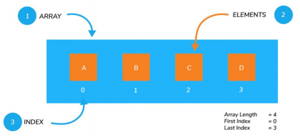
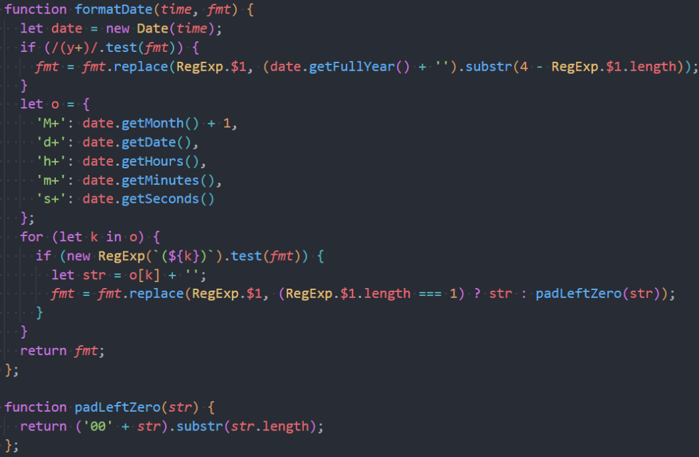

# 一. 认识包装类型

---

## 1. 原始类型的包装类

- **`js`的原始类型并非对象类型**，所以从**理论上**来说，它们**是没有办法获取属性或者调用方法的**

- 但是，在开发中会看到，我们会经常这样操作：

  ```js
  var msg = 'hello world'
  var words = msg.split(' ')
  var length = msg.length
  var num = 2.23443
  num = num.toFixed(2)
  ```

- 那么，为什么会出现这样奇怪的现象呢？（悖论）

  - **原始类型**是简单的值，**默认**是**没有属性和方法的**
  - 这是因为**`js`为了使其可以获取属性和调用方法，对其封装了对应的包装类型**

- 常见的包装类型有：`String`、`Number`、`Boolean`、`Symbol`、`BigInt`类型

## 2. 包装类型的使用过程

- 默认情况，我们**使用一个原始类型的属性或者方法时**，`js`引擎会进行如下操作：

  1. 首先根据原始类型的原始值，创建其对应的包装类型的对象
  2. 然后根据所调用的属性或方法去调用创建出来的包装类型的对象的属性或方法，会返回一个新的值
  3. 当该值没有被使用了，就会销毁掉创建的包装类型的对象

- 上面是规范的流程

- 通常`js`引擎会进行很多的优化，它内部可能会跳过创建包装类的过程在内部直接完成属性的获取或者方法的调用

- 我们也可以自己来创建一个包装类的对象：

  ```js
  var name1 = 'later' // 字面量 的创建方式
  var name2 = new String('later') // 原始类型的包装类 的创建对象方式
  console.log(typeof name1) // string
  console.log(typeof name2) // object
  ```

> 注意：
>
> - **通过`new`一个原始类型的包装类创建出来的是一个对象**
> - **`null`、`undefined`没有任何的方法和属性，也没有对应的对象包装类**


# 二. Number类的属性-实例方法-类方法的补充

---

- 前面我们已经学习了`Number`类型，它有一个对应的数字包装类型`Number`，我们来对它的方法做一些补充

- **`Number`属性**补充：

  ```js
  // js中最大的安全整数 (2^53 - 1)
  Number.MAX_SAFE_INTEGER 
  
  // js中最小的安全整数 -(2^53 - 1)
  Number.MIN_SAFE_INTEGER 
  ```

- **`Number`实例方法**补充：

  - 方法一：`toString(base)`，**将数字转成字符串，并且按照`base`进制进行转化**

    - `base `的范围可以从 2 到 36，默认情况下是 10

    > 注意：
    >
    > - 如果是直接对一个数字操作，需要使用**`..`运算符**或者**用小括号将要转换的目标括起来**，防止出错
    >
    >   ```js
    >   123.toString() // Uncaught SyntaxError: Invalid or unexpected token
    >   123..toString() // '123'
    >   (123).toString() // '123'
    >   ```

  - 方法二：`toFixed(digits)`，**格式化一个数字，保留`digits`位的小数(四舍五入)，返回值`string`类型**

    - `digits`的范围是`[0, 20]`之间

- **`Number`类方法**补充：

  - 方法一：`Number.parseInt(string[, radix])`，**将字符串解析成整数**，也有对应的全局方法`parseInt`
  - 方法二：`Number. parseFloat(string)`，**将字符串解析成浮点数**，也有对应的全局方法`parseFloat`

  ```js
  function zcNumber() {}
  zcNumber.parseInt = function() {}
  window.parseInt = zcNumber.parseInt
  console.log(window.parseInt === zcNumber.parseInt) // true
  
  // 所以我们可以猜测，全局的parseInt方法本质上也是类似这样实现的，其实就是内存地址的赋值
  console.log(window.parseInt === Number.parseInt) // true
  ```

- 更多`Number`的知识，可以查看`MDN`文档：

  - https://developer.mozilla.org/zh-CN/docs/Web/JavaScript/Reference/Global_Objects/Number


# 三. Math对象

---

- 在除了`Number`类可以对数字进行处理之外，`js`还提供了一个`Math`对象
  - `Math`是一个**内置对象**（**不是构造函数**），它**拥有一些数学常数属性和数学函数方法**
  
- `Math`常见的**属性**：
  - `Math.PI`：圆周率，约等于 3.14159
  
- `Math`常见的**方法**：

  | 方法             | 作用                                 |
  | ---------------- | ------------------------------------ |
  | `Math.floor`     | 向下取整                             |
  | `Math.ceil`      | 向上取整                             |
  | `Math.round`     | 四舍五入取整                         |
  | `Math.random`    | 生成`(0, 1]`的随机数，包含0，不包含1 |
  | `Math.pow(x，y)` | 返回x的y次幂，幂也可以用` ** `运算符 |
  | `Math.abs(x)`    | 返回x的绝对值(正数)                  |

- `Math`中还有很多其他数学相关的方法，可以查看`MDN`文档：
  - https://developer.mozilla.org/zh-CN/docs/Web/JavaScript/Reference/Global_Objects/Math


# 四. String类的补充

---

## 1. 基本使用

- 在开发中，我们经常需要对字符串进行各种各样的操作，`String`类提供给了我们对应的属性和方法

- `String`常见的属性：
  
  - `length`：获取字符串的长度
  
- `String`也有很多常见的方法和操作，我们来进行学习

- 操作一：**访问字符串的字符**
  - 使用方法一：通过**字符串的索引`str[index]`**，**找不到时返回`undefined`**
  -  使用方法二：通过**`str.charAt(pos)`实例方法**，`pos`是索引位置，**找不到时返回空字符串**
  
- 练习：字符串的遍历
  - 方式一：普通`for`循环
  
    ```js
    var message = "Hello World"
    for (var i = 0; i < message.length; i++) {
      console.log(message[i])
    }
    ```
  
  - 方式二：`for..of`遍历
    - **仅支持可迭代对象，对象默认是不可迭代的**
    
    - **`String`对象内部是将字符串变成了一个可迭代对象**
    
    - **目前可迭代对象：字符串、数组**
    
      ```js
      var message = "Hello World"
      for (var char of message) {
        console.log(char)
      }
      ```

## 2. 字符串的不可修改性

- 字符串的不可变性：

  - **字符串在定义后是不可以修改的**，所以下面的操作是没有任何意义的

    ```js
    var msg = 'hello world'
    msg[1] = 'a'
    console.log(msg) // 'hello world'
    ```

- 所以，**在我们改变很多字符串的操作中，都是生成了一个新的字符串**

  - 比如改变字符串大小的两个方法
    - `toLowerCase()`：返回一个根据原有字符串全部小写的新字符串
    - `toUpperCase()`：返回一个根据原有字符串全部大写的新字符串

## 3. 查找字符串

-  在开发中我们经常会在一个字符串中查找或者获取另外一个字符串，`String`提供了如下方法：

  - **查找字符串位置**

    ```js
    str.indexOf(searchValue [, fromIndex]) // 不支持负索引
    ```

    - 从`fromIndex`开始，查找`searchValue`的索引
    - 如果没有找到，那么返回`-1`
    - 有一个相似的方法，叫`lastIndexOf`，从最后开始查找

  - **是否包含字符串**

    ```js
    str.includes(searchString [, position])
    ```

    - 从`position`位置开始查找`searchString`， 根据情况返回` true `或` false`
    - `ES6`新增的方法

## 4. 以..开头或结尾

- **以`xxx`开头**

  ```js
  str.startWith(searchString [, position])
  ```

  - 从`position`位置开始，判断字符串是否以`searchString`开头
  - 是`ES6`新增的方法，下面的方法也一样

- **以`xxx`结尾**

  ```js
  str.endsWith(searchString [, position])
  ```

  - 在`length`长度内，判断字符串是否以`searchString`结尾

## 5. 获取子字符串

- `String.prototype.slice(start, end) `

  - 返回索引从`beginIndex`到`endIndex`(不含`endIndex`)的新字符串，不修改原字符串

  - `endIndex`，如果省略该参数，`slice`会一直提取到字符串末尾

    ```js
    str.slice(beginIndex[, endIndex])
    ```

- `String.prototype.substring()`

  - 返回索引从`indexStart`到`indexEnd`(不含`indexEnd`)的新字符串，不修改原字符串

  - `indexEnd`，如果省略该参数，`substring`会一直提取到字符串末尾

    ```js
    str.substring(indexStart[, indexEnd])
    ```

- `String.prototype.substr()`（已弃用）

  - 返回一个字符串中从`start`开始到指定字符数的字符，不修改原字符串

  - `length`，如果省略该参数，`substr`会一直提取到字符串末尾

    ```js
    str.substr(start[, length]) 
    ```

- 开发中推荐使用`slice`方法

## 6. replace + concat + trim + split

- 替换字符串

  ```js
  str.replace(regexp|substr, newSubStr|function)
  ```

  - 查找到对应的字符串，并且使用新的字符串进行替代
  - 这里也**可以传入正则表达式来查找**，也**可以传入函数来替换**

- 拼接字符串

  ```js
  str.concat(str2, [, ...strN])
  ```

- 删除字符串首尾空格

  ```js
  str.trim(str)
  ```

- 字符串分割

  ```js
  str.split([separator[, limit]])
  ```

  - `separator`：以什么字符串进行分割，也可以是正则表达式
  - `limit`：限制返回片段的数量

- 更多的字符串的补充内容，可以查看`MDN`的文档：

  - https://developer.mozilla.org/zh-CN/docs/Web/JavaScript/Reference/Global_Objects/String


# 五. 数组Array

---

## 1. 什么是数组？

-  对象允许存储键值集合，但是在某些情况下使用键值对来访问并不方便

- 比如说一系列的商品、用户、英雄，包括`HTML`元素，我们如何将它们存储在一起呢

- 这个时候我们需要一种**有序的集合**，**里面的元素是按照某一个顺序来排列的**

- 这个有序的集合，我们可以通过索引来获取到它

- 这个结构就是数组（`Array`）

- 数组和对象都是一种保存多个数据的数据结构，在后续的数据结构中我们还会学习其他结构

- 我们可以通过` [] `来创建一个数组
  - **数组是一种特殊的对象类型**
  
    

## 2. 数组的创建方式

- 创建一个数组有两种语法：

  ```js
  var arr1 = [] // 字面量形式
  var arr2 = new Array() // 构造函数形式
  var arr3 = ['a', 'b', 'c']
  var arr4 = new Array('a', 'b', 'c')
  ```

- 下面的方法是在创建一个数组时，设置数组的长度

  ```js
  var arr = new Array(5)
  console.log(arr) // [empty*5]
  ```

- 数组元素从 0 开始编号（索引`index`）

  - 一些编程语言允许我们使用负数索引来实现这一点，例如` fruits[-1]`
  - `js`并不支持这种写法

## 3. 数组的基本操作

- **访问数组中的元素**：

  - 通过中括号`[]`访问

  - `arr.at(i)`实例方法： 

    - 如果` i >= 0`，则与` arr[i] `完全相同
    - 对于` i `为负数的情况，它则从数组的尾部向前数
    - 只支持`chrome92`以上版本的浏览器

    ```js
    console.log(arr[arr.length]) // 数组最后一位
    console.log(arr.at(-1)) // 数组最后一位
    ```

- **修改数组中的元素**：

  ```js
  arr[0] = 'aaa'
  ```

- 删除和添加元素虽然也可以通过索引来直接操作，但是开发中很少这样操作

- **在数组的尾端添加或删除元素**：

  - `push`：在末端添加元素（可添加多个）

  - `pop`：从末端移除一个元素

    ```js
    var arr = []
    arr.push('a', 'b') // ['a', 'b']
    arr.pop() // ['a']
    ```

- **在数组的首端添加或删除元素**:

  - `shift`：移除首端的一个元素，整个数组元素向前移动

  - `unshift`：在首段添加元素（可添加多个），整个数组元素向后移动

    ```js
    var arr = ['a', 'b']
    arr.shift() // ['b']
    arr.unshift('a', 'c') // ['a', 'c', 'b']
    ```

- **`push / pop `方法运行的比较快**，**而` shift / unshift `比较慢**

## 4. splice添加删除替换元素

- 如果我们希望在中间某个位置添加或者删除元素应该如何操作呢？

- `arr.splice `方法可以说是处理数组的利器，它可以做所有事情：添加，删除和替换元素

- `arr.splice`语法结构如下：

  ```js
  array.splice(start[, deleteCount[, item1[, item2[, ...]]]])
  ```

  - 从`start`位置开始，处理数组中的元素

  - `deleteCount`：要删除元素的个数，如果为`0`或者负数表示不删除

  - `item1, item2, ...`：在添加元素时，需要添加的元素

    ```js
    var arr = [1, 2, 3, 4, 5]
    // 删除元素
    arr.splice(2, 1) // [1, 2, 4, 5]
    // 新增元素
    arr.splice(2, 0, '6', '7') // [1, 2, '6', '7', 4, 5]
    // 替换元素
    arr.splice(2, 2, 'a', 'b') // [1, 2, 'a', 'b', 4, 5]
    ```

> 注意：
>
> - **`splice()`会修改原数组**

## 5. length属性

- `length`属性用于获取数组的长度：

  - 当我们**修改数组**的时候，**`length`属性会自动更新**

- `length `属性的另一个有意思的点是它是**可写的**

  - 如果我们手动**增加一个大于默认`length`的数值**，那么**会增加数组的长度**
  - 但是如果我们**减少`length`数值**，**数组就会被截断**

  ```js
  var arr = ['a', 'b', 'c']
  arr.length = 10 // ['a', 'b', 'c', 	empty*7]
  arr.length = 2 // ['a', 'b']
  ```

- 所以，**清空数组**最简单的方法就是：`arr.length = 0`

## 6. 数组的遍历

- `for`循环

  ```js
  for (var i = 0; i < arr.length; i++) {
    console.log(arr[i])
  }
  ```

- `for..in`遍历，获取索引值

  ```js
  for (var index in arr) {
    console.log(arr[index])
  }
  ```

- `for..of`遍历，获取每一个元素

  ```js
  for (var item of arr) {
    console.log(item)
  }
  ```


## 7. slice、concat、join方法

- `Array.prototype.slice()`：

  - 返回索引从`begin`到`end`（不包括`end`）之间的元素所组成的新数组（**浅拷贝的原数组**），不修改原数组

    ```js
    arr.slice([begin[, end]]) 
    
    var arr = [1, 2, 3, 4] 
    arr.slice(2, 3) // [3] 
    ```

- `Array.prototype.concat()`：

  - 返回一个新数组（**浅拷贝的原数组**），包含来自于其他数组和其他项的值，不修改原数组

    ```js
    arr.concat(value[, value2[, ...[, valueN]]]) 
    
    var arr = [1, 2]
    var newArr = arr.concat([3, 4], 5) // [1, 2, 3, 4, 5]
    ```

- `Array.prototype.join()`：

  - 返回数组中所有元素根据指定字符连接成的一个字符串，不修改原数组

    ```js
    arr.join([separator]) 
    
    var arr = [1, 2, 3, 4, 5]
    var arr2 = arr.join('-') // '1-2-3-4-5'
    ```


## 8. 数组查找元素 - 高级函数

- `Array.prototype.indexOf()`：

  - 返回在数组中可以找到给定元素`searchElement`的第一个索引，如果不存在，则返回` -1`

  - 从`fromIndex`开始查找，如果找到返回对应的索引，没有找到返回`-1`

  - 也有对应的从最后位置开始查找的` lastIndexOf `方法

    ```js
    arr.indexOf(searchElement[, fromIndex])
    ```

- `Array.prototype.includes()`：

  - 判断数组是否包含某个元素

  - 从索引` fromIndex`开始搜索` searchElement`，如果找到则返回` true`，否则则返回` false`

    ```js
    arr.includes(searchElement[, fromIndex])
    ```

  - `Array.prototype.find()`和`Array.prototype.findIndex()`

    - 查找元素或者元素的索引（`ES6`之后新增）

      ```js
      arr.find(callback[, thisArg])
      ```

## 9. 数组的排序 - sort、reverse

- `sort`方法也是一个高阶函数，**用于对数组进行排序，并且生成一个排序后的新数组**：

  ```js
  arr.sort([compareFunction])
  ```

  - 如果` compareFn(参数一, 参数二) `**小于 0 ，`参数一`排列到`参数二`前面**

  - 如果` compareFn(参数一, 参数二) `**等于 0 ，`参数一`和`参数二`的相对位置不变**

  - 如果` compareFn(参数一, 参数二) `**大于 0 ，参数一`排列到`参数二`后面**

  - 也就是说，**谁小谁排在前面**

    ```js
    var newStu = students.sort(function(a, b) {
      return a - b // 升序
    })
    
    var newStu = students.sort(function(a, b) {
      return b - a // 降序
    })
    ```

- 等到后续讲解数据结构与算法时，我们会编写自己的排序算法：

  - 冒泡排序、插入排序、选择排序、堆排序、希尔排序、快速排序等

- `reverse() `方法将数组中元素的位置颠倒，并返回该数组

## 10. forEach、filter、map、reduce

- `Array.prototype.forEach()`
  - `forEach`方法**对数组的每个元素执行一次给定的`callback`函数**
  - **对数组中的元素进行修改操作，原始类型的数据不会被修改，引用类型数据会被修改**
  - **`forEach`方法中无法使用`break`和`continue`，只能通过`try...catch`抛出异常**
  
- `Array.prototype.filter()`
  
  - `filter`方法返回一个新数组（`浅拷贝`），其包含通过所提供函数实现的测试的所有元素
  
- `Array.prototype.map()`
  
  - `map`方法返回一个新数组，这个新数组由原数组中的每个元素都调用一次提供的函数后的返回值组成
  
- `Array.prototype.reduce()`

  ```js
  reduce(function(previousValue, currentValue, currentIndex, array) { /* … */ }, initialValue)
  ```

  - `reduce`方法对数组中的每个元素按序执行一个指定的函数，每一次运行该函数会将先前元素的计算结果作为参数传入，最后将其结果汇总为单个返回值
  - 若指定了初始值 `initialValue`，则 `currentValue` 则将使用数组第一个元素；否则 `previousValue` 将使用数组第一个元素，而 `currentValue` 将使用数组第二个元素

## 11. 实现forEach，find方法

- `forEach`

  ```js
  // forEach() 方法对数组的每个元素执行一次给定的函数
  Array.prototype.zc_forEach = function(fn) {
    for (var i = 0; i < this.length; i++) {
      fn(this[i], i, this)
    }
  }
  
  var arr = ['a', 'b', 'c']
  arr.zc_forEach(function(item, index, arr) {
    console.log(item, index, arr)
  })
  // 'a' 0 ['a', 'b', 'c']
  // 'b' 1 ['a', 'b', 'c']
  // 'c' 2 ['a', 'b', 'c']
  ```

- `find`

  ```js
  // find() 方法返回数组中满足提供的测试函数的第一个元素的值。否则返回 undefined
  Array.prototype.zc_find = function(fn) {
    for (var i = 0; i < this.length; i++) {
      var isTrue = fn(this[i], i, this)
      if (isTrue) 
        return this[i]
    }
  }
  
  var arr = ['a', 'b', 'c']
  arr.zc_find(function(item) {
    return item === 'b'
  })
  // 'b'
  ```

  


# 六. Date对象

---

## 1. 时间的表示方式

- 关于《时间》，有很多话题可以讨论：
  - 比如物理学有《时间简史：从大爆炸到黑洞》，讲述的是关于宇宙的起源、命运
  - 比如文学上有《记念刘和珍君》：时间永是流驶，街市依旧太平
  -  比如音乐上有《时间都去哪儿了》：时间都去哪儿了，还没好好感受年轻就老了
- 我们先来了解一下时间表示的基本概念：
  - 最初，人们是通过观察太阳的位置来决定时间的，但是这种方式有一个最大的弊端就是**不同区域位置大家使用的时间是不一致的**
    - 相互之间没有办法通过一个统一的时间来沟通、交流
  - 之后，人们开始制定的标准时间是英国伦敦的**皇家格林威治（` Greenwich `）天文台的标准时间**（刚好在本初子午线经过的地方），这个时间也称之为**GMT**（`Greenwich Mean Time`）
    - 其他时区根据标准时间来确定自己的时间，往东的时区（`GMT+hh:mm`），往西的时区（`GMT+hh:mm`）
  - 但是，根据公转有一定的误差，也会造成`GMT`的时间会造成一定的误差，于是就提出了根据**原子钟计算的标准时间`UTC`**（`Coordinated Universal Time`） 
- 目前`GMT`依然在使用，主要表示的是**某个时区中的时间**，而`UTC`是**标准的时间**

## 2. 时区对比图


## 3. 创建Date对象

- 在`js`中我们使用`Date`来表示和处理时间

  - `Date`的构造函数有如下用法：

    ```js
    // 创建Date对象的方式
    
    // 1.没有传入任何的参数, 获取当前时区GMT时间（RFC格式时间）
    new Date() // Thu Dec 01 2022 00:09:47 GMT+0800 (中国标准时间)
    
    // 2.传入参数: 时间字符串 
    // new Date(dateString)
    new Date("2022-12-1") // Thu Dec 01 2022 00:00:00 GMT+0800 (中国标准时间)
    
    // 3.传入具体的年月日时分秒毫秒 
    // new Date(year, monthIndex [, day [, hours [, minutes [, seconds [, milliseconds]]]]])
    new Date(2033, 10, 10, 09, 08, 07, 333) // Thu Nov 10 2033 09:08:07 GMT+0800 (中国标准时间)
    
    // 4.传入一个Unix时间戳 
    // new Date(value)
    new Date(1669824619912) // Thu Dec 01 2022 00:10:19 GMT+0800 (中国标准时间)
    ```
  

## 4. dateString时间的表示方式

- 日期的表示方式有两种：**RFC 2822 标准** 或者 **ISO 8601 标准**

- **默认打印的时间格式**是`RFC 2822`标准的：

  ```js
  new Date() // Thu Dec 01 2022 00:09:47 GMT+0800 (中国标准时间)
  // 等价于 new Date().toDateString()
  ```

- 我们也可以将其转化成`ISO 8601`标准的：

  ```js
  new Date().toISOString() // '2022-11-30T16:20:54.828Z'
  ```

  - `YYYY`：年份，0000 ~ 9999
  - `MM`：月份，01 ~ 12
  - `DD`：日，01 ~ 31
  - `T`：分隔日期和时间，没有特殊含义，可以省略
  - `HH`：小时，00 ~ 24
  - `mm`：分钟，00 ~ 59
  - `ss`：秒，00 ~ 59
  - `.sss`：毫秒
  - `Z`：时区


## 5. Date获取信息的方法

- 我们可以从`Date`对象中获取各种详细的信息：

  | 方法                | 作用                                             |
  | ------------------- | ------------------------------------------------ |
  | `getFullYear()`     | 获取年份（4 位数）                               |
  | `getMonth()`        | 获取月份，从 0 到 11                             |
  | `getDate()`         | 获取当月的具体日期，从 1 到 31（方法名字有点迷） |
  | `getHours()`        | 获取小时                                         |
  | `getMinutes()`      | 获取分钟                                         |
  | `getSeconds()`      | 获取秒钟                                         |
  | `getMilliseconds()` | 获取毫秒                                         |
  | `getDay()`          | 获取一周中的第几天，从 0（星期日）到 6（星期六） |

## 6. Date设置信息的方法

- `Date`也有对应的设置方法：
  - `setFullYear(year, [month], [date])`
  - `setMonth(month, [date])`
  - `setDate(date)`
  - `setHours(hour, [min], [sec], [ms])`
  - `setMinutes(min, [sec], [ms])`
  - `setSeconds(sec, [ms])`
  - `setMilliseconds(ms) `
  - `setTime(milliseconds)`
- 了解：我们可以**设置超范围的数值，它会自动校准**

## 7. Date获取Unix时间戳

- `Unix `时间戳：它是一个整数值，**表示自1970年1月1日0点0分0秒0毫秒`UTC`以来的毫秒数**

- 在`js`中，我们有多种方法可以**获取时间戳**：

  - 方式一：`new Date().getTime()`
  - 方式二：`new Date().valueOf()`
  - 方式三：`+new Date()`
  - 方式四：`Date.now()`

- 获取到`Unix`时间戳之后，我们可以利用它来测试代码的性能：

  ```js
  // 计算这个操作所花费的时间
  var startTime = Date.now()
  for (var i = 0; i < 100000; i++) {
    console.log(i)
  }
  var endTime = Date.now()
  console.log("执行100000次for循环的打印所消耗的时间:", endTime - startTime)
  ```

- 封装一个简单的工具函数

  ```js
  function testPerformance(fn) {
    var startTime = Date.now()
    fn()
    var endTime = Date.now()
    console.log("该段代码执行所消耗时间:", endTime - startTime)
  }
  ```

## 8. Date.parse方法

- `Date.parse(str) `方法可以**从一个字符串中读取日期，并且输出对应的`Unix`时间戳**

- `Date.parse(str) `： 

  - 作用等同于` new Date(dateString).getTime() `操作
  
  - 需要符合` RFC2822 `或` ISO 8601 `日期格式的字符串
    - 比如`YYYY-MM-DDTHH:mm:ss.sssZ`
    
  - 其他格式也许也支持，但结果不能保证一定正常
  
  - 如果输入的**格式不能被解析**，那么会**返回`NaN`**
  
    ```js
    Date.parse('2022-11-30T16:31:58.295Z') // 1669825918295
    Date.parse(1669825918295) // NaN
    ```
  

## 9. 时间格式化封装的方法

```js
const timeStamp = + new Date()
function formatDate(timeStamp, formatString) {
  const date = new Date(timeStamp)
  const timeObj = {
    'y+': date.getFullYear(),
    'M+': date.getMonth() + 1,
    'd+': date.getDate(),
    'h+': date.getHours(),
    'm+': date.getMinutes(),
    's+': date.getSeconds()
  }

  for (const key in timeObj) {
    const keyRegExp = new RegExp(key)
    if (keyRegExp.test(formatString)) {
      const value = String(timeObj[key]).padStart(2, '0')
      formatString = formatString.replace(keyRegExp, value)
    }
  }
  return formatString
}

console.log(formatDate(timeStamp, 'yyyy-MM-dd hh:mm:ss')) // 2022-07-13 00:09:48
console.log(formatDate(timeStamp, 'hh:mm:ss yyyy/MM/dd')) // 00:09:48 2022/07/13
```

- 下面写法中的`RegExp.$1`不是标准中的，不建议使用

  


# 七. toString()

- `Object.prototype.toString()`方法返回一个表示该对象的字符串

- 每个对象都有一个 `toString()` 方法，**当对象被表示为一个文本值时，或者一个对象以预期的字符串方式引用时自动调用`toString`方法**

- 默认情况下，`toString()` 方法被每个 `Object` 对象继承。**如果`toString`方法在自定义对象中未被覆盖，`toString()` 返回 `"[object *type*]"`，其中 `type` 是对象的类型**

- 以下代码说明了这一点：

- https://developer.mozilla.org/zh-CN/docs/Web/JavaScript/Reference/Global_Objects/Object/toString

  ```js
  new Object().toString(); // '[object Object]'
  var obj = {}
  obj + '' // '[object Object]'
  ```

- 当然有种特殊的情况就是**`{} + ''` 转化为`0`**

  ```js
  {} + '' // 0
  // 上面竟然是0 ，什么情况
  
  // 暂时不知道，( )小括号包起来，这样就没问题了
  ({}) + '' // '[object Object]' 
  
  // 或者使用String()方法进行转化可以避免这类问题
  String({} + '') // '[object Object]'
  String({}) // '[object Object]'
  ```

- 那我们来看看原始类型在转化为字符串时的表现

  ```js
  new Boolean().toString() // 'false'
  new Number().toString() // '0'
  new String().toString() // ''
  ```

  - 按照原始的包装类的原理来说，`new`原始包装类是生成一个对象的，根据上面所说，`Object.prototype.toString`方法会返回 `"[object *type*]"`，其中 `type` 是对象的类型

- 但是这里为什么没有呢？

- 因为`Number`、`String`、`Boolean`等原始类型的包装类，其原型上都有实现专门的`toString`方法，从而覆盖了`Object`原型上的`toString`方法，所以导致产生了非预期的结果

  > 注意：
  >
  > - 如果是直接对一个数字操作，需要使用**`..`运算符**或者**用小括号将要转换的目标括起来**，防止出错
  >
  >   ```js
  >   123.toString() // Uncaught SyntaxError: Invalid or unexpected token
  >   123..toString() // '123'
  >   (123).toString() // '123'
  >   ```

- 如果我们想看到 `"[object *type*]"`呢，修改对应包装类的原型的`toString`方法所指向值的引用即可，或者重写对应的方法

  ```js
  Boolean.prototype.toString = Object.prototype.toString;
  (new Boolean()).toString() // '[object Boolean]'
  ```


- `Array.protootype.toString`方法

  - 当一个数组被作为文本值或者进行字符串拼接操作时，将会自动调用其 `toString` 方法
  - `Array`对象覆盖了 `Object`的 `toString` 方法。对于数组对象，`toString` 方法在内部调用 `join()` 方法拼接数组中的元素并返回一个字符串，其中包含用逗号分隔的每个数组元素。如果 `join` 方法不可用，或者它不是一个函数，将使用 `Object.prototype.toString`代替，返回 `[object Array]`

  ```js
  ['aaa', 'bbb', 'ccc'].toString() // 'aaa,bbb,ccc'
  ```


