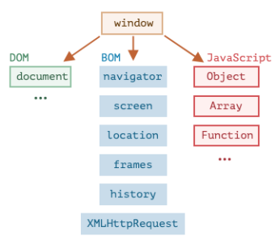
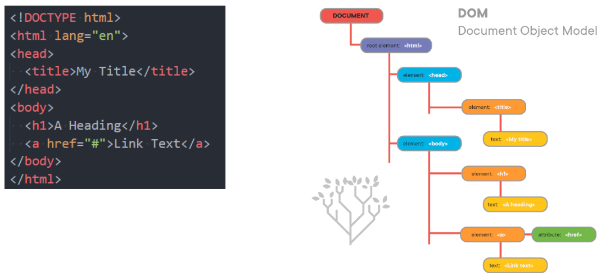
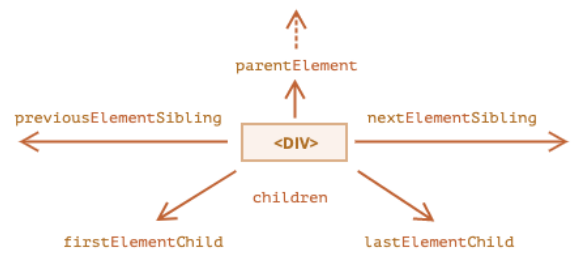

# 一. 什么是DOM?

---

## 1. 认识DOM和BOM

- 前面我们花了很多时间学习`js`的基本语法，但是这些基本语法，但是这些语法好像和做网页没有什么关系，和前面学习的`HTML`、`CSS`也没有什么关系呢？

  - 这是因为我们前面学习的部分属于`ECMAScript`，也就是**`js`本身的语法部分**
  -  除了语法部分之外，我们还需要学习**浏览器提供**给我们开发者的**`DOM`、`BOM`相关的`API`**才能**对页面、浏览器进行操作**

-  前面我们学习了一个`window`的全局对象，`window`上事实上就包含了这些内容：

  - 我们已经学习了`js`语法部分的`Object`、`Array`、`Date`等

  - 另外还有`DOM`、`BOM`部分

    


- `DOM`：**文档对象模型**（`Document Object Model`）
  -  简称` DOM`，**将页面所有的内容表示为可以修改的对象**
- `BOM`：**浏览器对象模型**（`Browser Object Model`） 
  - 简称` BOM`，**由浏览器提供的用于处理除文档（`document`）之外的所有内容的其他对象**
  - 比如`navigator`、`location`、`history`等对象

## 2. 深入理解DOM

- 浏览器会对我们编写的`HTML`、`CSS`进行渲染，同时它又要考虑我们可能会通过`js`来对其进行操作： 

  - 于是**浏览器将**我们编写在**`HTML`中的每一个元素**（`Element`）都**抽象成了一个个对象**
  - 所有**这些对象**都**可以通过`js`**来对其**进行访问**，那么我们就可以**通过`js`来操作页面**
  - 所以，我们将**这个抽象过程**称之为 **文档对象模型**（`Document Object Model`）

- **整个文档被抽象到` document `对象中**：

  - 比如`document.documentElement`对应的是**`html`元素**
  - 比如`document.body`对应的是**`body`元素**
  - 比如`document.head`对应的是**`head`元素**

- 下面的一行`js`代码可以让整个页面变成红色：

  ```js
  document.body.style.backgroundColor = 'red'
  ```

- 所以我们学习`DOM`，就是在学习如何通过`js`对文档进行操作的

- 个人理解：

  - **`DOM`就是浏览器提供给我们用来对整个文档进行操作的，将`HTML`所有元素抽象成了一个个对象，允许使用`js`进行操作访问等**


#  二. 认识DOM Tree

---

- 一个页面不只是有`html`、`head`、`body`元素，也包括很多的子元素：
  - 在`html`结构中，最终会形成一个树结构
  
  - 在**抽象成`DOM`对象的时候**，它们也会**形成一个树结构**，我们称之为`DOM Tree`
  
    


# 三. DOM的整体结构

---

## 1. DOM的学习顺序

- `DOM`相关的`API`非常多，我们会通过如下顺序来学习：
  - `DOM`元素之间的关系
  - 获取`DOM`元素
  - `DOM`节点的`type`、`tag`、`content`
  - `DOM`节点的`attributes`、`property`
  - `DOM`节点的创建、插入、克隆、删除
  - `DOM`节点的样式、类
  - `DOM`元素/`window`的大小、滚动、坐标
- 整体会按照这个顺序来学习，也会额外补充其他的知识

## 2. DOM的继承关系图

- `DOM`相当于是`js`和`HTML`、`CSS`之间的桥梁

  - 通过浏览器提供给我们的`DOM API`，我们可以对元素以及其中的内容做任何事情

- 类型之间有如下的继承关系：

  - **所有元素继承`Element`基类**
  - **`Element`基类又继承`Node`类**
  
  

## 3. document对象

- **`document`对象是`Document`类的实例对象**

- **`document`对象下的所有对象都有继承自`Element`类**

- **`document`对象是`DOM`入口对象**

- `Document`节点表示的整个载入的网页，它的实例是全局的`document`对象：

  - 对`DOM`的所有操作都是从` document `对象开始的
  - 它是**`DOM`的入口点**，**可以从`document`开始去访问任何节点元素**

- 对于最顶层的`html`、`head`、`body`元素，我们可以直接在`document`对象中获取到：

  ```js
  document.doctype // 文档声明 <!DOCTYPE html>
  document.documentElement // html元素 <html> 
  document.head // head元素 <head>
  document.body // body元素 <body> 
  ```


# 四. 节点、元素导航

---

## 1. 节点（Node）之间的导航（navigator）

- 如果我们获取到一个节点后，可以**根据这个节点去获取其他的节点**，我们称之为**节点之间的导航**

  - **节点范畴**：文本节点(换行符、空格等)、注释节点`comment`、`body`节点、`html`节点、`script`节点、`div`节点等其他节点...

- 节点之间存在如下的关系：

  - 父节点：`parentNode`
  
  - 前兄弟节点：`previousSibling`
  
  - 后兄弟节点：`nextSibling`
  
  - 子节点：`childNodes`
  
  - 第一个子节点：`firstChild`
  
  - 最后一个子节点：`lastChild`
  
    
  
  ```html
  <body>
    <div class="box">
      <!-- 这是注释节点 -->
      <h1>标题</h1>
      <div>div2</div>
      <div>div2</div>
    </div>
    
    <script>
      var boxEl = document.querySelector('.box')
      console.log(boxEl.parentNode) // 父节点 body
      console.log(boxEl.previousSibling) // 前兄弟节点 #text(文本节点)
      console.log(boxEl.nextSibling) // 后兄弟节点 #text(文本节点)
      console.log(boxEl.childNodes)  // NodeList(9) [text, comment, text, h1, text, div, text, div, text]
      console.log(boxEl.firstChild) // 第一个子节点 #text
      console.log(boxEl.lastChild) // 最后一个子节点 #text
    </script>
  </body>
  ```

## 2. 元素（Element）之间的导航（navigator）

- 如果我们获取到一个元素后，可以根据这个元素去获取其他的元素，我们称之为**元素之间的导航**

  - **元素范畴**：`body`元素、`html`元素、`script`元素、`div`元素等其他元素，**文本和注释不属于元素**

- 元素之间存在如下的关系：

  - 父元素：`parentElement`
  
  - 前兄弟元素：`previousElementSibling`
  
  - 后兄弟元素：`nextElementSibiling`
  
  - 子元素：`children`
  
  - 第一个子元素：`firstElementChild`
  
  - 最后一个子元素：`lastElementChild`
  
    
  
  ```html
  <body>
    <div class="box">
      <h1>标题</h1>
      <div>div2</div>
      <div>div2</div>
    </div>
  
    <script>
      var boxEl = document.querySelector('.box')
      console.log(boxEl.parentElement) // 父元素 body
      console.log(boxEl.previousElementSibling) // 前兄弟元素 不存在 则为null
      console.log(boxEl.nextElementSibling) // 后兄弟元素 script
      console.log(boxEl.children)  // HTMLCollection(3) [h1, div, div]
      console.log(boxEl.firstElementChild) // 第一个子元素 h1
      console.log(boxEl.lastElementChild) // 最后一个子元素 div
    </script>
  </body>
  ```
  

## 3. 表格table元素之间的导航navigator

- `table `元素支持以下这些属性（包括上面给出的）：
  - `table.rows` ： `<tr> `元素的集合
  
  - `table.caption / tHead / tFoot` ：  引用元素 `<caption>`，`<thead>`，`<tfoot>`
  
  - `table.tBodies` ： `<tbody>` 元素的集合
  
- `<thead>`，`<tfoot>`，`<tbody>` 元素提供了`rows `属性：
  
  - `tbody.rows` ： 表格内部` <tr>`元素的集合
  
- `<tr>`： 
  
  - `tr.cells` ： 在给定` <tr>`中的`<td>`和`<th>`单元格的集合
  
  - `tr.sectionRowIndex` ： 给定的`<tr>`在封闭的`<thead> / <tbody> / <tfoot>`中的位置（索引）
  
  - `tr.rowIndex` ：在整个表格中`<tr>`的编号（包括表格的所有行）
  
- `<td>` 和 `<th>`： 
  
  - `td.cellIndex` ：在封闭的 `<tr>` 中单元格的编号

## 4. 表单form元素的导航navigator

- `form `元素可以直接通过`document`来获取：`document.forms`

- `form `元素中的内容可以通过`elements`来获取：`form.elements`

- 我们可以设置表单子元素的`name`来获取它们

  ```html
  <body>
    <form action="">
      <input name="account" type="text">
      <input name="password" type="password">
      <input name="sex" type="sex">
      <select name="fruits" id="fruits">
        <option value="apple">苹果</option>
        <option value="orange">橘子</option>
      </select>
    </form>
    
    <script>
      var formEl = document.forms[0]
      var els = formEl.elements
      console.log(formEl) // form元素
      console.log(els) // HTMLFormControlsCollection(4) [input, input, input, select#fruits, account: input, password: input, sex: input, fruits: select#fruits]
      window.onclick = function() {
        console.log(els.account.value)
        console.log(els.password.value)
        console.log(els.sex.value)
        console.log(els.fruits.value)
      }
    </script>
  </body>
  ```

# 五. 获取元素的方法

---

- 当元素彼此靠近或者相邻时，`DOM `导航属性（`navigation property`）非常有用
  - 但是，在实际开发中，我们希望可以任意的获取到某一个元素应该如何操作呢？
  
- `DOM `为我们提供了获取元素的方法：

  |          方法名          |    搜索方式    | 可以在元素上调用？ | 实时的？ |
  | :----------------------: | :------------: | :----------------: | :------: |
  |     `querySelector`      | `CSS-selector` |        可以        |   不是   |
  |    `querySelectorAll`    | `CSS-selector` |        可以        |   不是   |
  |     `getElementById`     |      `id`      |       不可以       |   不是   |
  |   `getElementsByName`    |     `name`     |       不可以       |    是    |
  |  `getElementsByTagName`  |  `tag or '*'`  |        可以        |    是    |
  | `getElementsByClassName` |    `class`     |        可以        |    是    |

```html
<body>
  <div class="box">
    <h1>标题</h1>
    <div>div1</div>
    <div>div2</div>
  </div>
  
  <script>
    var divEl1 = document.querySelector('div') // 匹配第一个符合条件的元素
    console.log(divEl1) // div.box
    var divEl2 = document.querySelectorAll('div') 
    console.log(divEl2) // NodeList(3) [div.box, div, div]
    var divEl4 = document.getElementsByTagName('div') // 实时获取
    console.log('divEl4: ', divEl4) // HTMLCollection(3) [div.box, div, div], 点开查看会有包含后续增加的divEl4元素，浏览器会实时更新
    setTimeout(function() {
      var divEl3 = document.createElement('div')
      divEl1.append(divEl3)
      console.log('添加')
    }, 2000)
  </script>
</body>
```

- 开发中如何选择呢？
  - 目前最常用的是`querySelector`和`querySelectAll`
  - `getElementById`偶尔也会使用或者在适配一些低版本浏览器时


# 六. Node节点的属性

---

## 1. 节点的属性 - nodeType

- 目前，我们已经可以获取到节点了，接下来我们来看一下节点中有哪些常见的属性：

  - 当然，不同的节点类型有可能有不同的属性
  - 这里我们主要讨论**节点共有的属性**

- `nodeType`属性：

  - `nodeType`属性提供了一种**获取节点类型的方法**
  - 它有一个数值型值（`numeric value`）

- 常见的节点类型有如下：

  |           常量            |  值  | 描述                                                         |
  | :-----------------------: | :--: | :----------------------------------------------------------- |
  |    `Node.ELEMENT_NODE`    |  1   | 一个元素节点，例如：`<p>`和`<div>`                           |
  |     `Node.TEXT_NODE`      |  3   | `Element`或者`Attr`中实际的文字                              |
  |    `Node.COMMENT_NODE`    |  8   | 一个`Comment`节点                                            |
  |   `Node.DOCUMENT_NODE`    |  9   | 一个`Document`节点                                           |
  | `Node.DOCUMENT_TYPE_NODE` |  10  | 描述文档类型的`DocumentType`节点。例如：`<!DOCTYPE html>`就是用于`HTML5`的 |

- 其他类型可以查看`MDN`文档： https://developer.mozilla.org/zh-CN/docs/Web/API/Node/nodeType

  ```html
  <body>
    <!-- 这是一个注释节点 -->
    这是一个文本节点
    <div class="box">
      <h1>标题</h1>
      <div>div1</div>
    </div>
  
    <script>
      var divEl1 = document.querySelector('div') // 匹配第一个符合条件的元素 div.box
      var h1El = document.querySelector('h1') 
      var bodyEl = document.querySelector('body')
      console.log(divEl1.nodeType, h1El.nodeType, bodyEl.nodeType) // 1 1 1
  
      var textNode = document.body.childNodes[2]
      var commentNode = document.body.childNodes[1]
      console.log(textNode.nodeType, commentNode.nodeType) // 3 8
  
      var documentNode = document
      console.log(documentNode.nodeType) // 9
  
      var documentDescNode = document.doctype
      console.log(documentDescNode.nodeType) // 10
  
      console.log(Node.DOCUMENT_TYPE_NODE) // 10
    </script>
  </body>
  ```

## 2. 节点的属性 - nodeName、tagName

- **`nodeName`**：**获取`node`节点的名字**

- **`tagName`**：**获取元素的标签名字**

  ```html
  <body>
    <!-- 这是一个注释节点 -->
    这是一个文本节点
    <div class="box">
      <h1>标题</h1>
      <div>div1</div>
      <div>div2</div>
    </div>
    
    <script>
      var divEl1 = document.querySelector('div')
      var h1El = document.querySelector('h1') 
      var bodyEl = document.querySelector('body')
      var textNode = document.body.childNodes[2]
      var commentNode = document.body.childNodes[1]
      var documentNode = document
      var documentDescNode = document.doctype
  
      console.log(divEl1.nodeName, divEl1.tagName) // DIV DIV
      console.log(h1El.nodeName, h1El.tagName) // H1 H1
      console.log(bodyEl.nodeName, bodyEl.tagName) // BODY BODY
      console.log(textNode.nodeName, textNode.tagName) // #text undefined
      console.log(commentNode.nodeName, commentNode.tagName) // #comment undefined
      console.log(documentNode.nodeName, documentNode.tagName) // #document undefined
      console.log(documentDescNode.nodeName, documentDescNode.tagName) // html undefined
    </script>
  </body>
  ```

- `tagName `和` nodeName `之间有什么不同呢？

  - `tagName `属性仅适用于` Element `节点
  - `nodeName `是为任意` Node `定义的：
    - 对于元素，它的意义与` tagName `相同，所以使用哪一个都是可以的
    - 对于其他节点类型（`text`，`comment `等），它拥有一个对应节点类型的字符串

## 3. 节点的属性 - innerHTML、textContent

- `innerHTML `属性

  - **获取节点中的内容（包含`HTML`，不包含节点本身）**

- `outerHTML`属性

  - 包含了节点完整的`HTML`
  - **等同于`innerHTML` + 节点本身**

- `textContent`属性

  - **获取节点中所有的文本内容（包括子元素中的文本内容）**
    - **性能好于`innerHTML`**，设置`textContent`只修改元素中的文本，设置`innerHTML`修改整个元素

- `innerHTML`和`textContent`的区别：

  - 使用` innerHTML`，我们将其 "**作为`HTML`**" **插入**，可带有` HTML `标签
  - 使用` textContent`，我们将其 "**作为文本**" **插入**，所有符号（`symbol`）均按字面意义处理

  

## 4. 节点的属性 - nodeValue

- 用于**获取非元素节点`(text、comment)`的文本内容**

  ```html
  <body>
    <!-- 这是一个注释节点 -->
    这是一个文本节点
    <div class="box">
      <h1>标题</h1>
    </div>
    
    <script>
      var divEl1 = document.querySelector('div') // 匹配第一个符合条件的元素
      console.log(divEl1.previousSibling.nodeValue) // 这是一个文本节点
      console.log(divEl1.previousSibling.data) // 这是一个文本节点
    </script>
  </body>
  ```


## 5. 节点的其他属性

- `hidden`属性：也是一个**全局属性，可以用于设置元素隐藏**

  ```html
  <body>
    <div class='box'>哈哈哈</div>
  
    <script>
      var box = document.quertSelector('.box')
      box.hidden = true // 隐藏元素，不占据页面位置，但DOM结构中存在
    </script>
  </body>
  ```

- `DOM `元素还有其他属性：

  - `value`
    - `<input>`，`<select> `和` <textarea>（HTMLInputElement，HTMLSelectElement……）`的` value`
  -  `href`
    - `<a href="...">（HTMLAnchorElement）`的` href`
  - `id`
    - 所有元素（`HTMLElement`）的 “`id`” 特性（`attribute`）的值

- `class`和`style`我们会在后续专门讲解的

  
