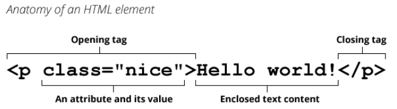
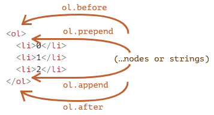
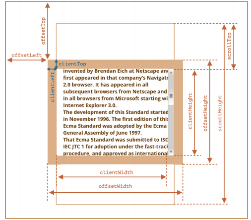

# 一. 元素的属性attribute

---

## 1. 元素的属性和特性

- 前面我们已经学习了如何获取节点，以及节点通常所包含的属性，接下来我们来仔细研究元素`Element`

  - 我们知道，一个元素除了有开始标签、结束标签、内容之外，还有很多的属性（`attribute`）

  

- **浏览器在解析`HTML`元素时，会将对应的`attribute`也创建出来放到对应的元素对象上**
  - 比如`id`、`class`就是全局的`attribute`，会有对应的`id`、`class`属性
  - 比如`href`属性是针对`a`元素的，`type`、`value`属性是针对`input`元素的
- **元素**中的**属性称**之为`attribute`
- **对象**中的**属性称**之为`property`

## 2. attribute的分类

- 属性`attribute`的分类：

  - **`HTML`标准中制定的`attribute`**

    - 如果是`HTML`标准制定的`attribute`，称之为标准`Attribute`
    - 标准的`attribute`：某些`attribute`属性是标准的，比如`id`、`class`、`href`、`type`、`value`等

  - **自定义的`attribute`**

    - 而自定义的`Attribute`，称之为非标准`Attribute`
    - 非标准的`attribute`：某些`attribute`属性是自定义的，比如`abc`、`age`、`height`等

    ```html
    <div class='box' id='main' name='later' abc='abc' age='23' height='180'>
      哈哈哈
    </div>
    ```

## 3. attribute的操作

- 对于所有的`attribute`访问都支持如下的方法：

  - `el.hasAttribute(name)`：检查属性是否存在
  - `el.getAttribute(name)`：获取这个属性值
  - `el.setAttribute(name)`：设置这个属性值
  - `el.removeAttribute(name)`：移除这个属性
  - `el.attributes`：该元素所有属性节点的一个实时集合，具有`name`、`value`属性

- `attribute`具备以下特征：

  - **大小写不敏感**（`id`和`ID`相同）
  - 它们的**值**总是**字符串类型**的，所以大部分情况下推荐使用`property`

  ```html
  <body>
    <div id="abc" class="box" title="box" age="18" height="1.88">我是box</div>
    <input type="checkbox" checked="checked">
  
    <script>
      var boxEl = document.querySelector(".box")
      // 1.所有的attribute都支持的操作
      console.log(boxEl.hasAttribute("AGE"), boxEl.hasAttribute("abc")) // true false
      console.log(boxEl.getAttribute("AGE"), boxEl.getAttribute("abc")) // 18 null
      boxEl.setAttribute("id", "cba") // 设置attrubite
      boxEl.removeAttribute("id") // 删除attribute
      var boxAttributes = boxEl.attributes 
      // NamedNodeMap {0: class, 1: title, 2: age, 3: height, class: class, title: title, age: age, height: height, length: 4}
      for (var attr of boxAttributes) {
        console.log(attr.name, attr.value)
        // class box
        // title box
        // age 18
        // height 1.88
      }
      // 2.通过getAttribute()一定是字符串类型
      var inputEl = document.querySelector("input")
      console.log(inputEl.getAttribute("checked")) // 'checked'
    </script>
  </body>
  ```


# 二. 元素对象的属性property

---

- **对于标准的`attribute`，会在`DOM`对象上创建与其对应的`property`属性**： 

  ```js
  console.log(boxEl.id, boxEl.className) // box main
  console.log(boxEl.abc, boxEl.age) // undefined...
  ```

- 在大多数情况下，**`attribute`和`property`是相互作用的**

  - 改变`property`，通过`attribute`获取的值，会随着改变
  - 通过`attribute`操作修改，`property`的值会随着改变
    - 老版本浏览器中，`input`的`value`修改只能通过`attribute`的方法，现在也能使用`property`了
    - **二者在同一个语句中同时作用一个对象时，只有其中一个有效**(貌似`arrtibute`)，另外一个无效

- 除非特别情况，大多数情况下，设置、获取`attribute`，推荐使用`property`的方式：

  - 这是因为**`property`默认情况下是有类型的**，**`attribute`获取到的总是字符串**


# 三. 元素的class、style

---

## 1. js动态修改样式

- 有时候我们会通过`js`来动态修改样式，这个时候我们有两个选择：
  -  选择一：在`CSS`中编写好对应的样式，**动态添加`class`**
  - 选择二：**动态修改`style`属性**
- 开发中如何选择呢？
  - 在大多数情况下，如果可以动态修改`class`完成某个功能，更推荐使用动态`class`
  - 如果对于某些情况，无法通过动态修改`class`（比如精准修改某个`css`属性的值），那么就可以修改`style`属性

## 2. 元素的className和classList

- 元素的`class attribute`，对应的`property`并非叫`class`，而是`className`：
  - 这是因为`js`早期是不允许使用`class`这种关键字来作为对象的属性，所以`DOM`规范使用了`className`
  - 虽然现在`js`已经没有这样的限制，但是并不推荐，并且依然在使用`className`这个名称

- 我们可以**对`className`进行赋值，会替换整个类中的字符串**

  ```js
  var boxEl = document.querySelector('.box')
  boxEl.className = 'later'
  ```

- 如果我们需要**添加或移除单个`class`**，那么可以使用**`classList`属性**

- `el.classList `是一个特殊的对象：

  - `el.classList.add(class)`：添加某个类
  - `el.classList.remove(class)`：删除某个类
  - `el.classList.toggle(class)`：检查某个类是否存在，存在移除，不存在添加
  - `el.classList.contains(class)`：检查指定类是否存在，返回`true/false`
  - `classList`是**可迭代对象**，可通过`for...of`进行遍历


## 3. 元素的style属性和cssText

- 如果需要单独修改某一个`CSS`属性，那么可以通过`style`来操作：

  -  **对于多词属性**（`multi-word`），**使用驼峰式** `camelCase`

    ```js
    boxEl.style.backgroundColor = '#fff'
    ```

  - 如果我们**将值设为空字符串**，那么**会使用`CSS`的默认样式**： 

    ```js
    boxEl.style.display = '' // 浏览器会使用display默认值
    ```

- 多个样式的写法，我们需要使用`cssText`属性： 

  - 不推荐这种用法，因为它**会替换整个字符串（元素内联样式也会被替换，`CSS`样式表中的不会被替换）**

  - 对同一个元素设置，后设置的会覆盖之前设置的属性
  
    ```js
    boxEl.style.cssText = `
    	width: 100px;
    	height: 100px;
    `
    ```

## 3. 元素style的读取 - getComputedStyle

- 如果我们需要读取样式：

  - **对于内联样式**，是可以**通过`style.*`的方式读取到的**
  - **对于`style`标签、`css`文件中的样式，是读取不到的**，可以通过**`getComputedStyle`的方式**
    - 虽然读取不到非内联样式，但是`js`内部可以通过`style`去修改其中的`css`属性值

- 这个时候，我们可以通过`getComputedStyle`的全局函数来实现：

  ```js
  console.log(getComputedStyle(boxEl).width) // 计算出来的属性值，只能读取，无法修改
  ```


# 四. 元素的常见操作

---

## 1. 创建元素

- 前面我们使用过` document.write `方法写入一个元素：

  - 这种方式写起来非常便捷，但是对于复杂的内容、元素关系拼接并不方便
  - 它是在早期没有`DOM`的时候使用的方案，目前依然被保留了下来

- 那么目前我们想要插入一个元素，通常会按照如下步骤：

  - 步骤一：创建一个元素
  - 步骤二：插入元素到`DOM`的某一个位置

- 创建元素： `document.createElement(tag)`

  ```js
  var boxEl = document.querySelector('.box')
  var h1El = document.createElement('h1')
  boxEl.append(h1El)
  ```


## 2. 插入元素

- 插入元素的方式如下：
  
  |                  方法                   | 操作                                  |
  | :-------------------------------------: | :------------------------------------ |
  |   `node.append(...nodes or strings)`    | 在`node` **末尾插入**节点或字符串     |
  |   `node.prepend(...nodes or strings)`   | 在` node` **开头插入** 节点或字符串   |
  |   `node.before(...nodes or strings)`    | 在` node ` **前面插入** 节点或字符串  |
  |    `node.after(...nodes or strings)`    | 在` node` **后面插入** 节点或字符串   |
  | `node.replaceWith(...nodes or strings)` | 将` node` **替换为** 指定节点或字符串 |

​		

## 3. 移除和克隆元素

- 移除元素我们可以调用元素本身的`remove`方法：

  ```js
  h1El.remove() // 移除h1元素
  ```

- 如果我们想要复制一个现有的元素，可以通过`cloneNode`方法：

  - 可以**传入一个`Boolean`类型的值**，来决定**是否是深度克隆**，默认不是深度克隆
  - 深度克隆会克隆对应元素的子元素，否则不会

  ```js
  var cloneBoxEl = boxEl.cloneNode(true) // 创建一个深度克隆boxEl的元素
  ```

## 4. 旧的元素操作方法

- 在很多地方我们也会看到一些旧的操作方法：
  - `parentEl.appendChild(node)`：在`parentEl`中最后位置添加一个子元素
  - `parentEl.insertBefore(newNode，referenceNode)`：在`parentEl`中子元素`referenceNode`节点前插入一个新元素`newNode`
  - `parentEl.replaceChild(node，oldChild)`：在`parent`El中，指定`node`替换之前的`oldChild`元素
  - `parentEl.removeChild(node)`：在`parentEl`中，移除`node`元素


# 五. 元素的大小和滚动

---

- `clientWidth`：`contentWith` + `padding`（不包含滚动条）

- `clientHeight`： `contentHeight` + `padding`

- `clientTop`： `border-top`的宽度

- `clientLeft`： `border-left`的宽度

- `offsetWidth`： 元素布局的宽度（包含滚动条）

- `offsetHeight`： 元素布局的高度

- `offsetLeft`：距离父元素的左侧内边距的距离
  
  - **父元素必须是：定位元素 或 最近的 `table`, `td`, `th`, `body` 元素**
  
- `offsetTop`：距离父元素的顶部内边距的距离

- `scrollHeight`： 整个可滚动的区域高度

- `scrollTop`： 当前已滚动部分（卷起来的）到其视口可见内容顶部的距离下

  

> 注意：
>
> - 在使用显示比例缩放的系统上，`scrollTop`可能会提供一个小数
> - https://developer.mozilla.org/zh-CN/docs/Web/API/Element/scrollTop 
> - 经测试使用四舍五入，暂时来看获得的结果是欧克的，这玩意偏移数不会太大应该（`hy-trip`）


# 六. window的大小和滚动

---

- `window`的`width`和`height`：
  - `innerWidth`、`innerHeight`：获取`window`窗口的宽度和高度（包含滚动条）
  - `outerWidth`、`outerHeight`：获取`window`窗口的整个宽度和高度（包括调试工具、工具栏）
- `documentElement.clientHeight`、`documentElement.clientWidth`：获取`html`的宽度和高度（不包含滚动条）
- `documentElement.offsetWidth`、`documentElement.offsetHeight`：获取`html`元素实际占用的宽度和高度（包含滚动条）
- `window`的滚动位置：
  - `scrollX`：`X`轴滚动的位置（别名`pageXOffset`）
  - `scrollY`：`Y`轴滚动的位置（别名`pageYOffset`） 
- 也有提供对应的滚动方法：
  - 方法` scrollBy(x，y) `：将页面滚动至 相对于当前位置的` (x, y) `位置
  - 方法` scrollTo(pageX，pageY) `将页面滚动至 绝对坐标


# 七. HTML5的data-*自定义属性

---

- 前面我们有学习`HTML5`的`data-*`自定义属性，那么它们也是可以在`dataset`属性中获取到的：

  ```html
  <div class='box' data-name='later'></div>
  <script>
    var boxEl = document.querySelector('.box')
    console.log(boxEl.dataset.name) // later
  </script>
  ```


