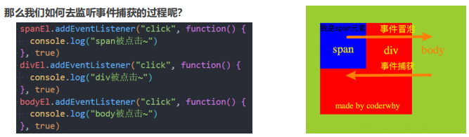
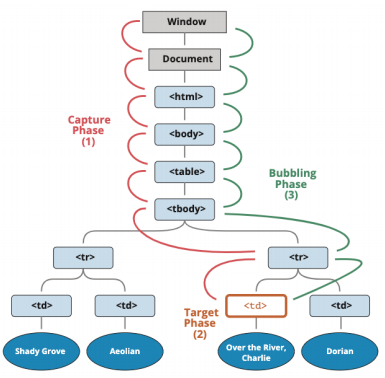

# 一. 认识事件处理

---

## 1. 认识事件（Event）

- `Web`页面需要经常和用户之间进行交互，而交互的过程中我们可能想要捕捉这个交互的过程：

  - 比如用户点击了某个按钮、用户在输入框里面输入了某个文本、用户鼠标经过了某个位置
  - 浏览器需要搭建一条`js`代码和事件之间的桥梁
  - 当某个事件发生时，让`js`可以相应（执行某个函数），所以我们需要针对事件编写处理程序（`handler`）

- 如何进行事件监听呢？

  - 事件监听方式一：直接在`html`中编写`js`代码

    ```html
    <div id='box' onclick='alert("box点击")'></div>
    ```

  -  事件监听方式二：`DOM`属性，通过元素的`onClick`属性来监听事件

    ```js
    box.onclick = function() {
      alert('box点击')
    }
    ```

  - 事件监听方式三：通过`EventTarget`中的`addEventListener`方法来监听

    ```js
    box.addEventListener('click', function() {
      alert('box点击')
    })
    ```

## 2. 常见的事件列表

- 鼠标事件：

  | 事件                   | 含义                                             |
  | ---------------------- | ------------------------------------------------ |
  | `click`                | 当鼠标点击一个元素时（触摸屏设备会在点击时生成） |
  | `mouseover / mouseout` | 当鼠标指针移入/离开一个元素时                    |
  | `mousedown / mouseup`  | 当在元素上按下/释放鼠标按钮时                    |
  | `mousemove`            | 当鼠标在元素上移动时                             |

- 键盘事件：
  - `keydown` 和 `keyup` —— 当按下和松开一个按键时
  
- 表单（`form`）元素事件：
  
  | 事件     | 含义                                               |
  | -------- | -------------------------------------------------- |
  | `submit` | 当表单提交时触发                                   |
  | `focus`  | 当访问者聚焦于一个元素时，例如聚焦于一个` <input>` |
  | `reset`  | 当表单被重置时触发                                 |
  
- `Document `事件：
  - `DOMContentLoaded` —— 当` HTML `的加载和处理均完成，`DOM `被完全构建完成时，无需等待`css`、图片等资源加载完成
  
- `CSS `事件：
  - `transitionend` —— 当一个` CSS `动画完成时


# 二. 事件冒泡捕获

---

## 1. 认识事件流·

- 事实上对于事件有一个概念叫做事件流，为什么会产生事件流呢？

  - 我们可以想到一个问题：当我们在浏览器上对着一个元素点击时，你点击的不仅仅是这个元素本身
  
  - 这是因为我们的`HTML`元素是存在父子元素叠加层级的

  - 比如一个`span`元素是放在`div`元素上的，`div`元素是放在`body`元素上的，`body`元素是放在`html`元素上的
  
    ```html
    <div class="box">
      <span class="word">哈哈</span>
    </div>
    
    <script>
    	var spanEl = document.querySelector('.word')
      var divEl = document.querySelector('.box')
      var bodyEl = document.body
      
      spanEl.addEventListener('click', function() {
        console.log('span被点击')
      })
      divEl.addEventListener('click', function() {
        console.log('div被点击')
      })
      bodyEl.addEventListener('click', function() {
        bodyEl.log('body被点击')
      })
    </script>
    ```
  

## 2. 事件冒泡和事件捕获

- 我们会发现默认情况下事件是**从最内层的`span`向外依次传递的顺序**，这个顺序我们称之为**事件冒泡（`Event Bubble`）**

- 事实上，还有另外一种监听事件流的方式就是**从外层到内层（`body -> span`），**这种称之为**事件捕获（`Event Capture`）**

- 为什么会产生两种不同的处理流呢？

  - 这是因为早期浏览器开发时，不管是`IE`还是`Netscape`公司都发现了这个问题
  
  - 但是他们采用了完全相反的事件流来对事件进行了传递

  -  `IE`采用了事件冒泡的方式，`Netscape`采用了事件捕获的方式
  
     
  

## 3. 事件捕获和冒泡的过程

- 如果我们都监听，那么会按照如下顺序来执行：

  

  1. **捕获阶段**（`Capturing phase`）：事件对象从`Window`传播到目标元素的过程
  2. **目标阶段**（`Target phase`）：事件对象到达目标元素
  3. **冒泡阶段**（`Bubbling phase`）：事件对象从目标元素上开始往上冒泡，直至`window`

- **`addEventListener`默认`false`处于冒泡阶段，为`true`时，处于捕获阶段**

- 事实上，我们可以通过`event`对象来获取当前的阶段：`eventPhase`

- 开发中通常会使用事件冒泡，所以事件捕获了解即可


# 三. 事件对象Event

---

## 1. Event对象

- 当一个事件发生时，就会有和这个事件相关的很多信息：

  - 比如事件的类型是什么，你点击的是哪一个元素，点击的位置是哪里等等相关的信息
  - 那么这些信息会被**封装到一个`Event`对象中**，这个对象由浏览器创建，称之为`event`对象
  - 该对象给我们提供了想要的一些属性，以及可以通过该对象进行某些操作

- 如何获取这个`event`对象呢？

  - `event`对象会在传入的事件处理（`event handler`）函数回调时，被系统传入

  - 我们可以在回调函数中拿到这个`event`对象

    ```js
    spanEl.onclick = function(event) {
      console.log('事件对象：', evnet)
    }
    ```

## 2. event常见的属性和方法

- `event`对象常见的属性：
  
  | 属性                 | 含义                     |
  | -------------------- | ------------------------ |
  | `type`               | 事件的类型               |
  | `target`             | **当前事件触发的元素**   |
  | `currentTarget`      | **当前处理事件的元素**   |
  | `eventPhase`         | 事件所处的阶段           |
  | `offsetX`、`offsetY` | 事件发生在元素内的位置   |
  | `clientX`、`clientY` | 事件发生在客户端内的位置 |
  | `pageX`、`pageY`     | 事件发生在页面中的位置   |
  | `screenX`、`screenY` | 事件发生在屏幕的位置     |
  
- 常见的方法：
  
  | 方法              | 作用                                             |
  | ----------------- | ------------------------------------------------ |
  | `preventDefault`  | **取消事件的默认行为**                           |
  | `stopPropagation` | **阻止事件的进一步传递**（冒泡或捕获都可以阻止） |

## 3. 事件处理中的this

- 在函数中，我们也可以**通过`this`来获取当前的发生元素**：

  ```js
  boxEl.addEventListener('click', function(event) {
    console.log(event.target === this) // true
  })
  ```

- 这是因为**在浏览器内部，调用`event handler`是绑定到当前的`target`上的**


# 四. EventTarget使用

---

- 我们会发现，**所有的节点、元素都继承自`EventTarget`**
  - 事实上`Window`也继承自`EventTarget`
  
- 那么这个`EventTarget`是什么呢？
  - **`EventTarget`是一个`DOM`接口**，主要**用于添加、删除、派发`Event`事件**
  
- `EventTarget`常见的方法：
  
  | 方法                  | 作用                              |
  | --------------------- | --------------------------------- |
  | `addEventListener`    | 注册某个事件类型以及事件处理函数  |
  | `removeEventListener` | 移除某个事件类型以及事件处理函数  |
  | `dispatchEvent`       | 派发某个事件类型到`EventTarget`上 |
  
  ```js
  var boxEl = document.querySelector('.box')
  
  boxEl.addEventListener('click', function () {
    console.log('box发生了点击')
    boxEl.dispatchEvent(new Event('later'))
  })
  
  boxEl.addEventListener('later', function () {
    console.log('触发了later事件')
  })
  ```


# 五. 事件委托模式

---

## 1. 事件委托（event delegation）

- 事件冒泡在某种情况下可以帮助我们实现强大的事件处理模式 – **事件委托模式**（也是**一种设计模式**）

- 那么这个模式是怎么样的呢？

  - 因为**当子元素被点击时**，**父元素可以通过冒泡可以监听到子元素的点击**
  - 并且可以**通过`event.target`获取到触发事件的元素**

- 案例：一个`ul`中存放多个`li`，点击某一个`li`会变成红色

  - 方案一：监听每一个`li`的点击，并且做出相应处理
  
    ```js
    var liEls = document.querySelectorAll("li")
    
    for (var liEl of liEls) {
      liEl.onclick = function(event) {
        event.currentTarget.classList.add("active")
      }
    }
    ```
  
  - 方案二：在`ul`中监听点击，并且通过`event.target`拿到对应的`li`进行处理
  
  - 因为这种方案并不需要遍历后给每一个`li`上添加事件监听，所以性能更好
  
    ```js
    var listEl = document.querySeletor('.list')
    
    var currentActive = null
    listEl.addEventListener('click', function(event) {
      if (currentActive) currentActive.classList.remove('active')
      event.target.classList.add('active')
      currentActive = event.target
    })
    ```
  

## 2. 事件委托的标记

- 某些事件委托可能需要对具体的子组件进行区分，这个时候我们可以使用`data-*`对其进行标记：

- 比如多个按钮的点击，区分点击了哪一个按钮：

  ```html
  <div class="box">
    <button data-action="search">搜索~</button>
    <button data-action="new">新建~</button>
    <button data-action="remove">移除~</button>
    <button>1111</button>
  </div>
  
  <script>
  
    var boxEl = document.querySelector(".box")
    boxEl.onclick = function(event) {
      var btnEl = event.target
      var action = btnEl.dataset.action
      switch (action) {
        case "remove":
          console.log("点击了移除按钮")
          break
        case "new":
          console.log("点击了新建按钮")
          break
        case "search":
          console.log("点击了搜索按钮")
          break
        default:
          console.log("点击了其他")
      }
    }
  </script>
  ```


# 六. 常见的事件

---

## 1. 常见的鼠标事件

- 接下来我们来看一下常见的鼠标事件（不仅仅是鼠标设备，也包括模拟鼠标的设备，比如手机、平板电脑）

- 常见的鼠标事件：

  | 属性          | 描述                                       |
  | :------------ | ------------------------------------------ |
  | `click`       | 当用户点击某个对象时调用的事件句柄         |
  | `contextmenu` | 在用户点击鼠标右键打开上下文菜单时触发     |
  | `dbclick`     | 当用户双击某个对象时调用的事件句柄         |
  | `mousedown`   | 鼠标按键被按下                             |
  | `mouseup`     | 鼠标按键被松开                             |
  | `mouseover`   | 鼠标移到某元素上（支持冒泡）               |
  | `mouseout`    | 鼠标从某元素移开（支持冒泡）               |
  | `mouseenter`  | 当鼠标指针移动到元素上时触发（不支持冒泡） |
  | `mouseleave`  | 当鼠标指针移除元素时触发（不支持冒泡）     |
  | `mousemove`   | 鼠标被移动                                 |

## 2. mouseover和mouseenter的区别

- `mouseenter`和`mouseleave`
  
  - **不支持冒泡**
  - 进入子元素依然属于在该元素内，没有任何反应
  
- `mouseover`和`mosueout`
  
  - **支持冒泡**
  
  - 进入元素的子元素时
    - 先调用父元素的`mouseout`
    
    - 再调用子元素的`mouseover`
    
    - 因为支持冒泡，所以会将子元素的`mouseover`传递到父元素中
    
      

## 3. 常见的键盘事件

- 常见的键盘事件：

  |     属性     | 描述               |
  | :----------: | ------------------ |
  | `onkeydown`  | 某个按键被**按下** |
  | `onkeypress` | 某个按键被**按下** |
  |  `onkeyup`   | 某个按键被**松开** |

- 事件的执行顺序是` onkeydown`、`onkeypress`、`onkeyup`
  - `down`事件先发生
  -  `press`发生在文本被输入
  - `up`发生在文本输入完成
- 我们可以通过`key`和`code`来区分按下的键：
  - `code`：“按键代码”（`"KeyA"`，`"ArrowLeft"`等），特定于键盘上按键的物理位置
  - `key`：字符（`"A"`，`"a"`等），对于非字符（`non-character`）的按键，通常具有与` code `相同的值）

## 4. 常见的表单事件

- 针对表单也有常见的事件：

  |    属性    | 描述                                                         |
  | :--------: | ------------------------------------------------------------ |
  | `onchange` | 该事件在表单元素的内容改变时触发（`<input>、<keygen>、<select>、<textarea>`） |
  | `oninput`  | 元素获取用户输入时触发                                       |
  | `onfocus`  | 元素获取焦点时触发                                           |
  |  `onblur`  | 元素失去焦点时触发                                           |
  | `onreset`  | 表单重置时触发                                               |
  | `onsubmit` | 表单提交时触发                                               |

## 5. 文档加载事件

- `DOMContentLoaded`：**浏览器已完全加载` HTML`，并构建了` DOM `树，但像`img`和`css`样式表之类的外部资源可能尚未加载完成**

- `load`：**浏览器不仅加载完成了` HTML`，还加载完成了所有外部资源：图片，样式等**

  ```html
  <script>
    window.addEventListener("DOMContentLoaded", function () {
      // 1.这里可以操作box, box已经加载完毕
      var boxEl = document.querySelector(".box")
      boxEl.style.backgroundColor = "orange"
      console.log("HTML内容加载完毕")
  
      // 2.获取img对应的图片的宽度和高度
      var imgEl = document.querySelector("img")
      console.log("图片的宽度和高度:", imgEl.offsetWidth, imgEl.offsetHeight) // 0 0
    })
  
    window.onload = function () {
      console.log("文档中所有资源都加载完毕")
      var imgEl = document.querySelector("img")
      console.log("图片的宽度和高度:", imgEl.offsetWidth, imgEl.offsetHeight) // 200 100
    }
  </script>
  
  <div class="box">
    <p>哈哈哈啊</p>
  </div>
  <a href="#">百度一下</a>
  
  ```

- 事件类型：https://developer.mozilla.org/zh-CN/docs/Web/Events


