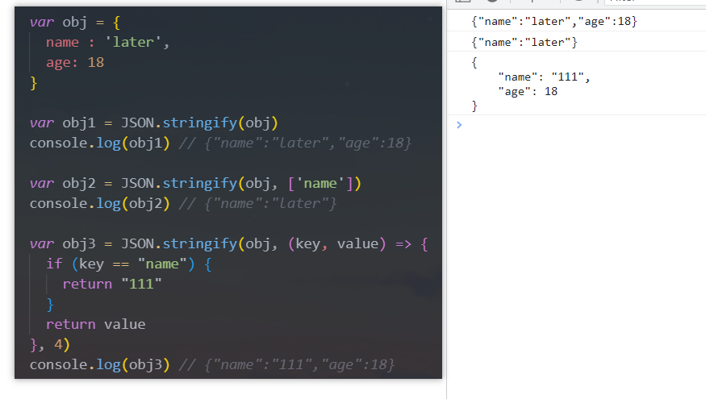

# 一. 认识BOM

---

- `BOM`：**浏览器对象模型**（`Browser Object Model`）
  - 简称 `BOM`，由浏览器提供的用于处理除文档（`document`）之外的所有内容的其他对象
  - 比如`navigator`、`location`、`history`等对象
- `JS`有一个非常重要的运行环境就是浏览器
  - 而且浏览器本身又作为一个应用程序需要对其本身进行操作
  - 所以通常浏览器会有对应的对象模型（`BOM`、`Browser Object Model`）
  - 我们可以将`BOM`看成是**连接`JS`脚本与浏览器窗口的桥梁**
- `BOM`主要包括以下的对象模型（接口）：
  - `window`：包括全局属性、方法，控制浏览器窗口相关的属性、方法
  - `location`：浏览器连接到的对象的位置（`URL`）
  - `history`：操作浏览器的会话历史记录
  - `navigator`：用户代理（浏览器）的状态和标识
  - `screen`：屏幕窗口信息


# 二. 全局对象window

---

## 1. window对象

- `window`对象在浏览器中可以从两个视角来看待：
  - 视角一：**全局对象**
    - `ECMAScript`中其实是有一个全局对象的，这个全局对象在`Node`中是`global`
    - 在浏览器中就是`window`对象
  - 视角二：**浏览器窗口对象**
    - 作为浏览器窗口时，提供了对浏览器操作的相关的`api`
- 当然，这两个视角存在大量重叠的地方，所以不需要刻意去区分它们：
  - 事实上对浏览器和`Node`中全局对象名称不一样的情况，目前已经指定了对应的标准，称之为**`globalThis`**，并且大多数现代浏览器都支持它
  - 放在`window`对象上的所有属性都可以被访问
  - 使用`var`定义的全局变量会被添加到`window`对象中
  - `window`默认给我们提供了全局的函数和类：`setTimeout`、`Math`、`Date`、`Object`等

## 2. window对象的作用

- 事实上`window`对象上肩负的重担是非常大的：

  - 第一：包含大量的属性，`localStorage`、`console`、`location`、`history`、`screenX`、`scrollX`等等（大概60+个属性）
  - 第二：包含大量的方法，`alert`、`close`、`scrollTo`、`open`等等（大概40+个属性）
  - 第三：包含大量的事件，`focus`、`blur`、`load`、`hashchange`等等（大概30+个属性）
  - 第四：包含从`EventTarget`继承过来的方法，`addEventListener`、`removeEventListener`、`dispatchEvent`方法

- 那么这些大量的属性、方法、事件在哪里查看呢？

  - `MDN`文档：https://developer.mozilla.org/zh-CN/docs/Web/API/Window

- 查看`MDN`文档时，我们会发现有很多不同的符号，是什么意思：

  

  - 删除符号：表示这个`API`已经废弃，不推荐继续使用了
  - 点踩符号：表示这个`API`不属于`W3C`规范，某些浏览器有实现（所以兼容性的问题）
  - 实验符号：该`API`是实验性特性，以后可能会修改，并且存在兼容性问题

## 3. window常见的属性

```js
// 浏览器高度
console.log(window.outerHeight)
console.log(window.innerHeight)
console.log('screenX: ', window.screenX) // 分屏扩展模式下，默认相对的是屏幕1左上角计算的，可以修改主屏幕的
console.log('screenY: ', window.screenY)

// 监听
window.addEventListener('scroll', event => {
  console.log(window.scrollY)
  console.log(window.scrollX)
})
```

## 4. window常见的方法

```html
<!DOCTYPE html>
<html lang="en">
  <head>
    <meta charset="UTF-8">
    <meta http-equiv="X-UA-Compatible" content="IE=edge">
    <meta name="viewport" content="width=device-width, initial-scale=1.0">
    <title>Document</title>
  </head>
  <body>

    <button id="close">打开百度并1s后关闭</button>
    <button id="scroll">滚动</button></button>

    <br><br><br><br><br><br><br><br><br><br>
    <br><br><br><br><br><br><br><br><br><br>
    <br><br><br><br><br><br><br><br><br><br>
    <br><br><br><br><br><br><br><br><br><br>
    <br><br><br><br><br><br><br><br><br><br>
    <br><br><br><br><br><br><br><br><br><br> 

  </body>
<script>
  var openBtn = document.querySelector('close')
  openBtn.onclick = function() {
    win1 = window.open('https://www.baidu.com', '_target') // '_self不能关闭'
    setTimeout(() => {
      win1.close()
    }, 1000);
  }

  var scrollBtn = document.querySelector('#scroll')
  scrollBtn.onclick = function() {
    window.scrollTo({
      top: 1000,
      behavior: "smooth" // 平滑滑动
    })
  }
</script>
</html>
```

## 5. window常见的事件

```js
window.onfocus = function() {
  console.log('获取焦点')
}

window.onblur = function() {
  console.log('失去焦点')
}

window.onhashchange = function() {
  console.log('hash值发生改变')
}
```


# 三. location、URLSearchParams

---

## 1. location常见属性

- `location`对象用于表示`window`上当前链接到的`URL`信息

- 常见属性有哪些？

  - `href`：完整`URL`
  - `protocol`：当前协议
  - `host`：主机地址（带端口号）
  - `hostname`：主机名（不带端口）
  - `port`：端口号
  - `pathname`：路径
  - `search`：查询字符串
  - `hash`：哈希值
  - `username`：`URL`中的`username`（很多浏览器已经禁用）
  - `password`：`URL`中的`password`（很多浏览器已经禁用）

  |    属性    | 示例：`http://127.0.0.1:5501/test3呵呵.html?a=1&b=2#1`       |
  | :--------: | :----------------------------------------------------------- |
  |   `href`   | `http://127.0.0.1:5501/test3呵呵.html?a=1&b=2#1`（完整`url`，中文会编码处理） |
  | `protocol` | ` http:`                                                     |
  |   `host`   | `127.0.0.1:5501`                                             |
  | `hostname` | `127.0.0.1`                                                  |
  |   `port`   | `5501`                                                       |
  | `pathname` | `/test3%E5%91%B5%E5%91%B5.html`（路径，中文会编码处理）      |
  |  `search`  | `?a=1&b=2`                                                   |
  |   `hash`   | `#1`                                                         |

## 2. location常见方法

- 我们会发现`location`其实是`URL`的一个抽象实现：

  

- `location`有如下常用的方法：

  - `assign()`：赋值一个新的`URL`，并且跳转到该`URL`中
  - `replace()`：替换当前的网页`URL`（不会在浏览器中留下之前的记录）
  - `reload()`：重新加载页面
    - `Firefox `对于该方法支持一个非标准的`boolean`参数，当值为 `true` 时，将强制`Firefox `从服务器加载页面资源

  ```html
  <!DOCTYPE html>
  <html lang="en">
    <head>
      <meta charset="UTF-8">
      <meta http-equiv="X-UA-Compatible" content="IE=edge">
      <meta name="viewport" content="width=device-width, initial-scale=1.0">
      <title>Document</title>
    </head>
    <body>
  
      <button>打开新的网页</button>
      <button>替换新的网页</button>
      <button>重新加载网页</button>
  
      <script>
        var btns = document.querySelectorAll('button')
        console.log(btns)
        btns[0].onclick = function() {
          location.assign('http://baidu.com')
        }
        btns[1].onclick = function() {
          location.replace('http://baidu.com')
        }
        btns[2].onclick = function() {
          location.reload()
        }
      </script>
    </body>
  </html>
  ```

## 3. URLSearchParams

- `URLSearchParams`定义了一些实用的方法来处理`URL`的查询字符串

  - **可以将一个字符串转化为`URLSearchParams`类型**
  - 也可以将一个`URLSearchParams`类型转成字符串
  - **`URLSearchParams`构造函数创建出来的实例对象，是可以使用`for..of`的**

  ```js
  var urlSearch = new URLSearchParams('name=later&age=18')
  
  console.log(urlSearch.get('name')) // later
  
  console.log(urlSearch.toString()) // 'name=later&age=18'
  
  urlSearch.set('age', '23')
  
  console.log(urlSearch.get('age')) // 23
  
  urlSearch.append('height', '1.88')
  
  console.log(urlSearch.get('height')) // 1.88
  
  console.log(urlSearch.has('name')) // true
  ```

- `URLSearchParams`常见的方法有如下：

  - `get()`：获取搜索参数的值
  - `set()`：设置一个搜索参数和值
  - `append()`：追加一个搜索参数和值
  - `has()`：判断是否有某个搜索参数
  - https://developer.mozilla.org/zh-CN/docs/Web/API/URLSearchParams

- 中文会使用`encodeURIComponent`和`decodeURIComponent`进行编码和解码


# 四. history

---

- `history`对象**允许访问浏览器曾经的会话历史记录**

- 有两个默认属性：
  - `length`：会话中的记录条数
  - `state`：当前保留的状态值
  
- 有五个方法：
  - `back()`：返回上一页，等同于`history.go(-1)`
  - `forward()`：前进下一页，等同于`history.go(1)`
  - `go()`：加载历史中的某一页，可以输入一个参数，指定前进或后退几页
  - `pushState()`：打开一个指定的地址，且不会重新加载页面
  - `replaceState()`：打开一个新的地址，并且使用`replace`，不会在历史记录中产生新的记录（直接替换当前页）
  
  ```JS
  // 前端路由核心: 修改了URL, 但是页面不刷新
  // 1> 修改hash值
  // 2> 修改history
  
  // 1.history对应的属性
  console.log(history.length)
  console.log(history.state)
  
  // 2.修改history
  var btnEl = document.querySelector("button")
  btnEl.onclick = function() {
    // history.pushState({ name: "why", age: 18 }, "", "/why")
    history.replaceState({ name: "why", age: 18 }, "", "/why")
  }
  
  var backBtnEl = document.querySelector(".back")
  backBtnEl.onclick = function() {
    // history.back()
    // history.forward()
    // 类似于上面的两个方法, 只是可以传入层级
    // history.go(-2)
  }
  ```

# 五. navigator、screen

---

## 1. navigator

- `navigator`对象表示**用户代理（浏览器或运行环境）的状态和标识等信息**

  

## 2. screen

- `screen`主要记录的是**浏览器窗口外面的客户端显示器的信息**：

  - 比如屏幕的逻辑像素：`screen.width`、`screen.height`

    
  


# 六. JSON

---

## 1. json的由来

- 在目前的开发中，`JSON`是一种非常重要的数据格式，它并不是编程语言，而是**一种可以在服务器和客户端之间传输的数据格式**

- `JSON`的全称是`JavaScript Object Notation`（`JS`对象符号）：

  - `JSON`是由`Douglas Crockford`构想和设计的一种轻量级资料交换格式，算是`JS`的一个子集
  - 但是虽然`JSON`被提出来的时候是主要应用`JS`中，但是目前已经独立于编程语言，可以在各个编程语言中使用
  - 很多编程语言都实现了将`JSON`转成对应模型的方式

- 其他的传输格式：

  - `XML`：在早期的网络传输中主要是使用`XML`来进行数据交换的，但是这种格式在解析、传输等各方面都弱于`JSON`，所以目前已经很少在被使用了
  - `Protobuf`：另外一个在网络传输中目前已经越来越多使用的传输格式是`protobuf`，但是直到2021年的`3.x`版本才支持`JS`，所以目前在前端使用的较少

- 目前`JSON`被使用的场景也越来越多：

  - 网络数据的传输`JSON`数据
  - 项目的某些配置文件
  - 非关系型数据库（`NoSQL`）将`json`作为存储格式

- 小程序的`app.json`

  

## 2. json的基本语法

- **`JSON`的顶层支持三种类型的值**：
  
  - 简单值：数字`Number`、字符串`String`（**不支持单引号**）、布尔`Boolean`、空值`null`
  
  - 对象值：由`key`、`value`组成，`key`是字符串类型，并且**必须添加双引号**，值可以是简单值、对象值、数组值
  
  - 数组值：数组的值可以是简单值、对象值、数组值
  
  - **`json`中不能写注释**
    - `jsconfig.json`和`tsconfig.js`这两个文件`vscode`有做特殊处理，所以其中可以写注释
    
      ```json
      123
      ```
    
      ```json
      [
        "123",
        123
      ]
      ```
    
      ```json
      {
        "name": "why",
        "age": 123,
        "friend": {
          "name": "kobe",
          "age": null
        }
      }
      ```

## 3. json的序列化

- 某些情况下我们希望将`JS`中的复杂类型转化为`json`格式的字符串，这样方便对其进行处理

  - 比如我们希望将一个对象保存到`localStorage`中

  - 但是如果我们直接存放一个对象，这个对象会被转化为`[object Object]`格式的字符串，并不是我们想要的结果

    

- 在**`ES5`中引用了`JSON`全局对象**，该对象有两个常用的方法：
  - `stringify`（序列化）：将`JS`类型转成对应的`JSON`字符串
    - `undefined`、任意的函数以及`symbol`值，在序列化过程中会被忽略（出现在非数组对象的属性值中时）或者被转换成`null`（出现在数组中时）。函数、`undefined`被单独转换时，会返回`undefined`，如`JSON.stringify(function(){} || undefined)`
  - `parse`（反序列化）：解析`JSON`字符串，转回对应的`JS`类型
  
- 那么上面的代码我们可以通过如下的方法来使用：

```js
var obj = {
  name : 'later'
}

// localStorage.setItem('obj', obj)
localStorage.setItem('obj', JSON.stringify(obj)) // 序列化对象转成JSON字符串进行存取

var _obj = localStorage.getItem('obj')
console.log(_obj, typeof _obj) // {"name":"later"} string
console.log(JSON.parse(_obj), typeof JSON.parse(_obj)) // {name: 'later'} 'object' 反序列化JSON字符串转化为JS类型
```

## 4. Stringify的参数replace

- `JSON.stringify() `方法将一个`JS`对象或值转换为`JSON `字符串：

  - 如果指定了一个`replacer `函数，则可以选择性地替换值，函数必须返回`value`
  - 如果指定的`replacer `是数组，则可选择性地仅包含数组指定的属性

  ```js
  var obj1 = JSON.stringify(obj)
  console.log(obj1) // {"name":"later","age":18}
  
  var obj2 = JSON.stringify(obj, ['name'])
  console.log(obj2) // {"name":"later"}
  
  var obj3 = JSON.stringify(obj, (key, value) => {
    if (key == "name") {
      return "111"
    }
    return value 
  })
  console.log(obj3) // {"name":"111","age":18}
  ```

## 5. Stringify的参数space

- `space `参数用来控制结果字符串里面的间距

  

## 6. toJSON方法

-   如果对象本身包含`toJSON`方法，那么会直接使用`toJSON`方法返回的结果：

  ```js
  var obj = {
    name: "later",
    toJSON: function() {
      return "123"
    }
  }
  
  var objJSONString = JSON.stringify(obj)
  console.log(objJSONString) // '123'
  ```

## 7. JSON的反序列化

- `JSON.parse() `方法用来解析`JSON`字符串，构造由字符串描述的`JS`值或对象

  - 提供可选的`reviver`函数用以在返回之前对所得到的对象执行变换(操作)

    ```js
    var obj = {
      name: "later",
      age: 18
    }
    
    var objJSONString = JSON.stringify(obj)
    console.log(objJSONString) // {"name":"why","age":18}
    
    var newObj = JSON.parse(objJSONString, function(key, value) {
      if (key === "age") {
        return value + 2
      }
      return value
    })
    console.log(newObj) // {name: 'later', age: 20}
    ```

- `JSON`的方法可以帮我们实现对象的深拷贝：

  - 但是目前我们还没有了解什么是对象的拷贝、浅拷贝、深拷贝的概念
  - 我们会在`JS`高级中学习

# 七. Storage

---

## 1. 认识Storage

- `WebStorage`主要提供了一种机制，可以让浏览器提供一种比`cookie`更直观的`key`、`value`存储方式：
  - 如果你想要**操作一个域名的本地存储**，可以使用：
    - `localStorage`：本地存储，提供的是一种永久性的存储方法，在关闭掉网页重新打开时，存储的内容依然保留
    
  - 如果想要**操作一个域名的会话存储**，可以使用：
    - `sessionStorage`：会话存储，提供的是本次会话的存储，在关闭掉会话时，存储的内容会被清除
    
      

## 2. localStorage和sessionStorage的区别

- 验证一：关闭网页后重新打开，`localStorage`会保留，而`sessionStorage`会被删除
-  验证二：在页面内实现跳转，`localStorage`会保留，`sessionStorage`也会保留
-  验证三：打开新的网页，`localStorage`会保留，`sessionStorage`不会被保留

## 3. Storage常见的属性和方法

- `Storage`有如下的属性和方法：
- 属性：
  - `Storage.length`：只读属性
    - 返回一个整数，表示存储在`Storage`对象中的数据项数量
- 方法：
  - `Storage.key()`：该方法接受一个数值`n`作为参数，返回存储中的第`n`个`key`名称
  - `Storage.getItem()`：该方法接受一个`key`作为参数，并且返回`key`对应的`value`
  - `Storage.setItem()`：该方法接受一个`key`和`value`，并且将会把`key`和`value`添加到存储中
    - 如果`key`已有值存储，则更新其对应的值
  - `Storage.removeItem()`：该方法接受一个`key`作为参数，并把该`key`从存储中删除
  - `Storage.clear()`：该方法的作用是清空存储中的所有`key`


