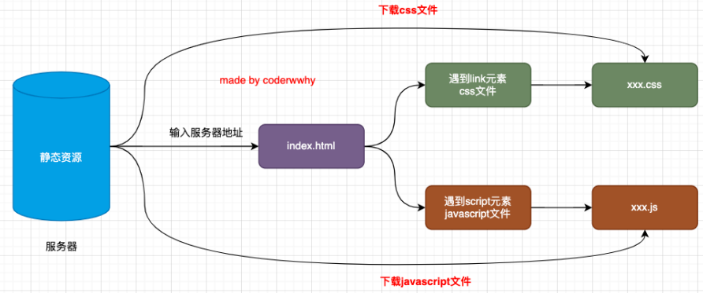
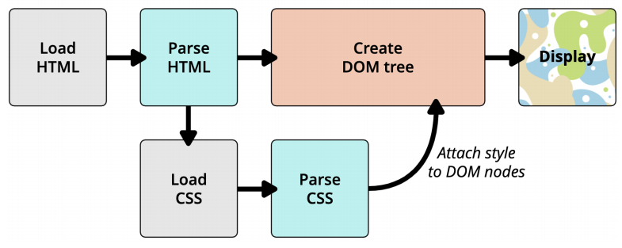
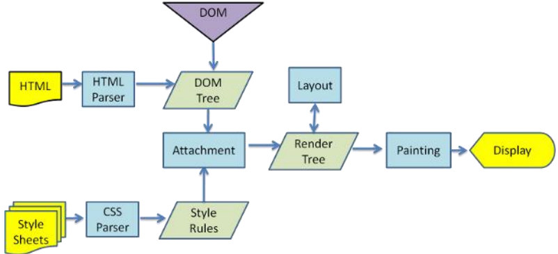
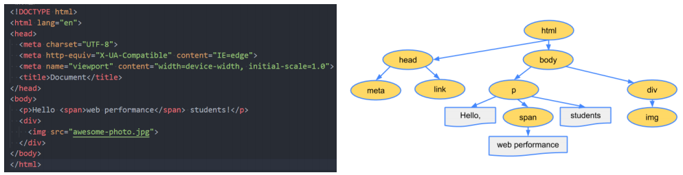
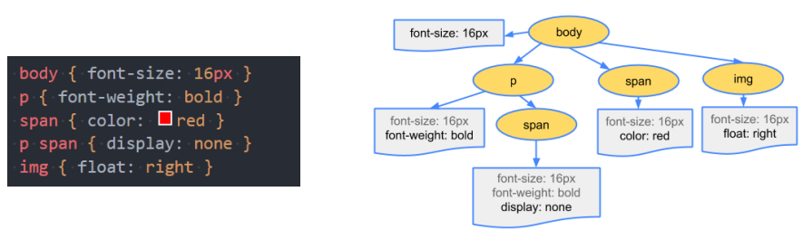
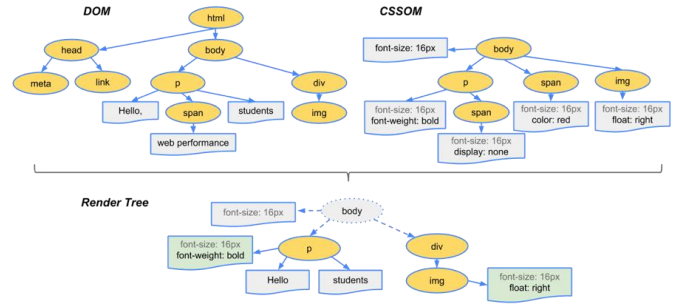
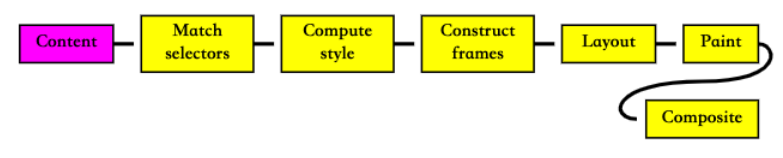
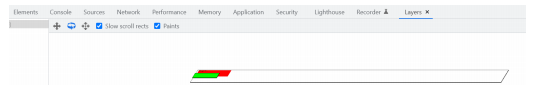

# 一. 网页的解析过程

---

- 大家有没有深入思考过：一个网页从输入`URL`到浏览器中到显示经历过怎么样的解析过程呢？

  

- 要想深入理解下载的过程，我们还要先理解，一个`index.html`被下载下来后是如何被解析和显示在浏览器上的
- 说出**浏览器输入一个`URL`到页面显示的过程**
  1. 先通过`DNS`服务器进行域名解析
  2. 解析出对应的`IP`地址然后向`IP`地址对应的主机发送`http`请求，获取对应的静态资源
  3. 默认情况服务器会返回`index.html`文件
  4. 然后浏览器内核开始解析`HTML`
  5. 首先，会解析对应的`html `生成`DOM Tree`
  6. 解析过程中，如果遇到`css`文件后会先下载然后进行解析，生成`CSSOM（CSS object mode）`
  7. 当`DOM Tree`和`CSS Tree`都解析完成之后，会进行合并生成`Render Tree`（渲染树）
  8. 初步生成的渲染树会显示节点以及部分样式，但是并不表示每个节点的尺寸，位置信息
  9. 于是进行`Layout`（布局）来生成渲染树节点的宽高位置等信息
  10. 经过`Layout`之后，浏览器内核将布局时的每个`frame`转换为屏幕上实际的像素点，将每个节点绘制到屏幕上

- 浏览器的工作原理：https://developer.mozilla.org/zh-CN/docs/Web/Performance/How_browsers_work


# 二. 浏览器渲染流程

---

## 1. 浏览器内核

- 常见的浏览器内核有：

  | 内核                                          | 浏览器                                                       |
  | :-------------------------------------------- | :----------------------------------------------------------- |
  | `Trident `（三叉戟）                          | `IE`、360安全浏览器、搜狗高速浏览器、百度浏览器、UC浏览器    |
  | `Gecko`（壁虎）                               | `Mozilla Firefox` （火狐）                                   |
  | `Presto`（急板乐曲）—> `Blink`（眨眼）        | `Opera`                                                      |
  | `WebKit`                                      | `Safari`、移动端浏览器（`Android`、`ios`）、360极速浏览器、搜狗高速浏览器 |
  | `WebKit`(分支优化) —> `Blink`（目前渲染最快） | `Google Chrome`、`Edge`                                      |

  

  - 我们经常说的**浏览器内核**指的是**浏览器的排版引擎**：

    - **排版引擎**（`layout engine`），也称为**浏览器引擎**（`browser engine`）、**页面渲染引擎**（`rendering engine`）或**样版引擎**

  - 也就是一个网页下载下来后，就是由我们的渲染引擎来帮助我们解析的

## 2. 渲染引擎如何解析页面呢？

- 渲染引擎在拿到一个页面后，如何解析整个页面并且最终呈现出我们的网页呢？

  - 我们之前学习过下面的这幅图，现在让我们更加详细的学习它的过程

    

  1. 首先下载`HTML`文件,下载完成后开始解析`HTML`文件
  2. 解析的过程中遇到外部`CSS`引入，就去下载外部`CSS`文件
  3. 下载完开始解析`CSS`文件，`CSS`文件下载和解析过程不会阻塞`HTML`的解析过程
  4. `HTML`解析完成就会创建`DOM`树，`CSS`解析完成会绑定到对应的`DOM`节点上
  5. 然后就会生成对应的`render tree`
  6. 然后经过布局
  7. 布局之后就展示网页

## 3. 渲染页面的详细流程

- 更详细的解析过程如下：

  

-  https://www.html5rocks.com/en/tutorials/internals/howbrowserswork

## 4. 解析一：HTML解析过程

- 因为默认情况下服务器会给浏览器返回`index.html`文件，所以解析`HTML`是所有步骤的开始：

- 解析`HTML`，会构建`DOM Tree`：

  

## 5. 解析二：生成CSS规则

-  在`HTML`解析的过程中，如果遇到`CSS`的`link`元素，那么会由浏览器（单独的一个线程(执行单元) ）负责下载对应的`CSS`文件：

  - 注意：**下载`CSS`文件是不会影响`DOM`的解析的（不会阻塞`HTML`的解析）**

- 浏览器下载完`CSS`文件后，就会对`CSS`文件进行解析，解析出对应的规则树：

  -  我们可以称之为` CSSOM`（`CSS Object Model`，`CSS`对象模型）

  

## 6. 解析三：构建render tree

- 当有了`DOM Tree`和` CSSOM Tree`后，就可以两个结合来构建`Render Tree`了

  

- 注意一：**`link`元素不会阻塞`DOM tree`的构建过程，但是会阻塞`Render tree`的构建过程**

  - 这是因为`render tree`在构建时，需要对应的`CSSOM tree`
  - 具体会不会阻塞取决于浏览器会不会做优化，浏览器可能觉得这个解析等的时间太久了，就会先把之前解析好的先渲染出来

- 注意二：`render tree`和`DOM tree`并不是一一对应的关系，比如`display`为`none`的元素，压根不会出现在`render tree`中

## 7. 解析四：布局（layout）和绘制（paint）

- 当渲染树构建完成，就会对渲染树上运行布局（`layout`）以计算每个节点的几何体

  - **渲染树只会表示显示哪些节点以及其他样式，但是不表示每个节点的尺寸、位置等信息**
  - **布局是确定呈现树中所有节点的宽度、高度和位置等信息**

- 布局完成，就会将每个节点绘制（`paint`）到屏幕上

  - 在绘制阶段，浏览器将布局阶段计算的每个`frame`（具体的矩形空间）转为屏幕上实际的像素点
  - 包括将元素的可见部分进行绘制，比如文本、颜色、边框、阴影、替换元素（比如`img`）

  

  - 对应的内容 => 匹配对应`CSS`规则 => 计算样式 => 构建每个元素对应的`frame`（具体的结构体） =>  布局（确定每个节点的位置大小等） => 绘制（每个节点对应的`frame`结构体转化为实际屏幕上的像素） => 合成图层


# 三. 回流和重绘

---

- 理解**回流`reflow`**（重排）：
  -  **第一次确定节点的大小和位置，称之为布局（`layout`），之后对节点的大小、位置修改重新计算称之为回流**
- 什么情况下引起回流呢？
  
  - 比如`DOM`结构发生改变（添加新的节点或者移除节点）
    - 修改了`DOM`树，渲染树也跟着修改，重新布局、绘制、展示
  - 比如改变了布局（修改了`width`、`height`、`padding`、`font-size`等值）
    - 修改了布局、重新计算布局、绘制、展示
  - 比如窗口`resize`（修改了窗口的尺寸等）
    - 页面布局发生改变，重新计算布局
  - 比如调用`getComputedStyle()`方法获取尺寸、位置信息
    - 会重新计算整个`frame`，引起`layout`，重新计算布局
    - 具体看浏览器会不会做些优化，比如获取的时候，就不会重新计算
- 理解**重绘`repaint`**：
  - **第一次渲染内容称之为绘制（`paint`），之后重新渲染称之为重绘**
- 什么情况下会引起重绘呢？
  
  - 比如修改背景色、文字颜色、边框颜色、边框样式(实线或虚线)等
    - 边框宽度会引起回流
- 回流一定会引起重绘，所以回流是一件很消耗性能的事情
- 所以在开发中要尽量避免发生回流：
  1. 修改样式时尽量一次性修改
       - 比如通过`cssText`修改，比如通过添加`class`修改
  2. 尽量避免频繁的操作`DOM`
       - 我们可以在一个`DocumentFragment`或者父元素中将要操作的`DOM`操作完成，再一次性的操作
  3. 尽量避免通过`getComputedStyle()`获取尺寸、位置等信息
  4. 对某些元素使用`position`的`absolute`
       - 并不是不会引起回流，而是开销相对较小，因为是脱标元素不会对其他元素造成影响
  5. 必要时可以使用 [CSS contain 属性](https://developer.mozilla.org/en-US/docs/Web/CSS/contain)限制计算布局、样式和绘制等的范围


# 四. 合成和性能优化

---

## 1. 特殊解析 – composite合成

- 绘制的过程，可以将布局后的元素绘制到多个合成图层中

  - 这是浏览器的一种优化手段

- **默认情况下，标准流中的内容都是被绘制在同一个图层（`Layer`）中的**

- 而**一些特殊的属性，会创建一个新的合成层**（ `CompositingLayer` ），并且**新的图层可以利用`GPU`来加速绘制**

  - **因为每个合成层都是单独渲染的**

  

- 那么哪些属性可以形成新的合成层呢？常见的一些属性：

  - `3D`相关的`transform`函数
  - `video`、`canvas`、`iframe`
  - `opacity`动画转换时（小于1）
  - `position`: `fixed`
  - `will-change`：一个实验性的属性，提前告诉浏览器哪些属性会发生变化
  - `animation`或`transition`设置了`opacity`、`transform`
    - 尽量避免修改元素的`margin-left`、宽高等，因为会产生回流，回流是件十分消耗性能的操作，回流会导致重新计算布局，重新渲染，重新合成图层，合成完再渲染图层，使用`transition`搭配`transform`会在新的图层执行动画，不影响其他图层中的元素，不会产生回流

- 分层确实可以提高性能，但是它以内存管理为代价(会增加浏览器内存使用)，因此不应作为` web `性能优化策略的一部分过度使用


# 五. defer和async属性

---

## 1. script元素和页面解析的关系

- 我们现在已经知道了页面的渲染过程，但是`js`在哪里呢？
  - 事实上，浏览器在解析`HTML`的过程中，遇到了`script`元素是不能继续构建`DOM`树的
  - 它会停止继续构建`DOM tree`，首先下载`js`代码，并且执行`js`的脚本
  - 只有等到`js`脚本执行结束后，才会继续解析`HTML`，构建`DOM`树
- 为什么要这样做呢？
  - 这是因为`js`的作用之一就是操作`DOM`，并且可以修改`DOM`
  - **如果我们等到`DOM`树构建完成并且渲染再执行`js`，会造成严重的回流和重绘，影响页面的性能**
  - 所以会**在遇到`script`元素时，优先下载和执行`js`代码，再继续构建`DOM`树**
- 但是这个也往往会带来新的问题，特别是现代页面开发中：
  - 在目前的开发模式中（比如`Vue`、`React`），脚本往往比`HTML`页面更“重”，处理时间需要更长
  - 所以会造成页面的解析阻塞，在脚本下载、执行完成之前，用户在界面上什么都看不到
- 从标准规范的角度来说，脚本没执行完就会阻塞构建`DOM`树，为了考虑用户体验，**浏览器会做一些优化，一些已经解析构建了的`DOM tree`会被先渲染出来，但对应的`dom`元素并不会提前被脚本获取到**
- **渲染引擎会力求尽快呈现内容显示在屏幕上，它不必等到整个`HTML`文档解析完毕，就会开始构建渲染树和设置布局，在不断接受和处理来自网络的其余内容的同时，渲染引擎会将部分内容解析并显示出来**
- 为了解决这个问题，`script`元素给我们提供了两个属性（`attribute`）：`defer`和`async`

## 2. defer属性

- **`defer `属性告诉浏览器不要等待脚本下载，而继续解析`HTML`，构建`DOM Tree`**

  - 脚本会由浏览器来进行下载，但是不会阻塞`DOM Tree`的构建过程
  - 如果脚本提前下载好了，它会**等待`DOM Tree`构建完成，在`DOMContentLoaded`事件之前先执行`defer`中的代码**
    - 所以在`defer`中可以操作`DOM`，因为`defer`中的脚本，不管提前下载好还是之后，都是在`DOM tree`构建完成后执行

- 因为`defer`中的代码可能会操作`DOM`，所以如果`DOM`操作还没完成，就不算`DOM`加载完成，所以**`DOMContentLoaded`总是会等待`defer`中的代码先执行完成**

  ```html
  <script defer src="./js/defer-demo.js"></script>
  <script>
  	window.addEvenetListener("DOMContentLoaded", () => {
      console.log("DOMContentLoaded")
    })
  </script>
  ```

- 另外**多个带`defer`的脚本是可以保持正确的顺序执行的**

- 从某种角度来说，**`defer`可以提高页面的性能，并且推荐放到`head`元素中**

> 注意：
>
> - `defer`仅适用于外部脚本，对于`script`默认内容会被忽略

## 3. async属性

- `async `特性与` defer `有些类似，它也能够让脚本不阻塞页面
- `async`是让一个脚本完全独立的：
  -  **浏览器不会因` async `脚本而阻塞`DOM tree`的构建**（与` defer `类似）
  - `async`脚本**不能保证顺序**，它是**独立下载、独立运行**，**不会等待其他脚本**
  - **`async`不会能保证在`DOMContentLoaded`之前或者之后执行**

> 总结：
>
> - **`defer`通常用于需要在文档解析后操作`DOM`的`js`代码，并且对多个`script`文件有顺序要求的**
> - **`async`通常用于独立的脚本，对其他脚本，甚至`DOM`没有依赖的**


