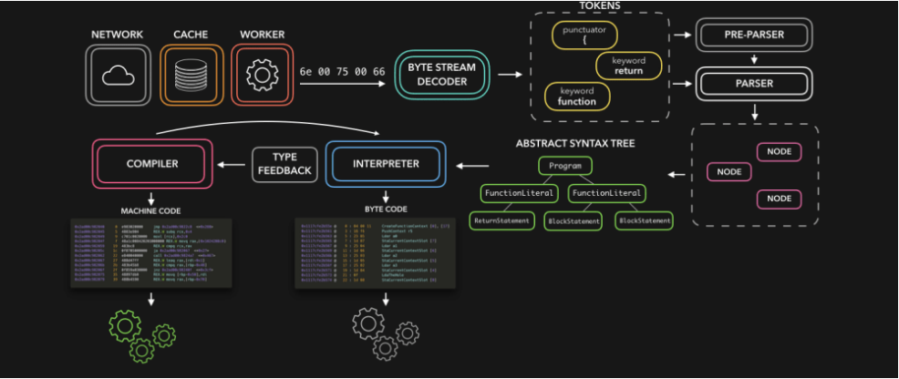

# 一. 深入v8引擎原理

---

## 1. js代码的执行

- `js`代码下载好之后，是如何一步步被执行的呢？

  - `js`代码最终转换成二进制代码，才能被`cpu`执行

- 我们知道，浏览器内核是由两部分组成的，以`webkit`为例：

  - `WebCore`**：**负责`HTML`解析、布局、渲染等相关的工作

  - `JavaScriptCore`**：**解析、执行`js`代码

    

- 另外一个强大的`JavaScript`引擎就是V8引擎

## 2. v8引擎的执行原理

- 我们来看一下官方对V8引擎的定义：
  - V8是用**`C++`编写**的**`Google`开源**高性能**`JavaScript`和`WebAssembly`引擎**，它**用于`Chrome`和`Node.js`**等
  - 它实现`ECMAScript`和`WebAssembly`，并在`Windows7`或更高版本，`macOS 10.12+`和使用`x64`，`IA-32`，`ARM`或`MIPS`处理器的`Linux`系统上运行
  - V8**可以独立运行**，也可以嵌入到任何`C ++`应用程序中
  
  
  
  - `cpu`无法识别`js`代码，必须转换成二进制代码才能被`cpu`执行
    1. 先对`js`代码进行解析，生成`AST`抽象语法树（对代码的一个解析，知道代码的结构和含义）
    2. `lgnition`将抽象语法树，转换成字节码（字节码可以跨平台运行）

## 3. v8引擎的架构

- V8引擎本身的源码非常复杂，大概有超过100w行`C++`代码，通过了解它的架构，我们可以知道它是如何对`js`执行的：
- **`Parse`模块**会**将`js`代码转换成`AST`（抽象语法树）**，这是因为解释器并不直接认识`js`代码
  - 如果函数没有被调用，那么是不会被转换成`AST`的
  - `Parse`的V8官方文档：https://v8.dev/blog/scanner
- **`Ignition`**是一个**解释器，会将`AST`转换成`ByteCode`**（字节码）
  - 同时会收集`TurboFan`优化所需要的信息（比如函数参数的类型信息，有了类型才能进行真实的运算）
  - 如果函数只调用一次，`Ignition`会解释执行`ByteCode`
  - `Ignition`的V8官方文档：https://v8.dev/blog/ignition-interpreter
- **`TurboFan`**是一个**编译器**，可以**将字节码编译为`CPU`可以直接执行的机器码**
  - 如果一个函数被多次调用，那么就会被标记为**热点函数**，那么就会经过`TurboFan`转换成优化的机器码，提高代码的执行性能
  - 但是，机器码实际上也会被还原为`ByteCode`，这是因为如果后续执行函数的过程中，类型发生了变化（比如`sum`函数原来执行的是`number`类型，后来执行变成了`string`类型），之前优化的机器码并不能正确的处理运算，就会逆向的转换成字节码
  - `TurboFan`的V8官方文档：https://v8.dev/blog/turbofan-jit

## 4. v8引擎的解析图（官方）


- **词法分析**（英文`lexical analysis`）
  - 将字符序列转换成`token`序列的过程
  - `token`是记号化（`tokenization`）的缩写
- **词法分析器**（`lexical analyzer`，简称`lexer`），也叫**扫描器**（`scanne`） 
- **语法分析**（英语：`syntactic analysis`，也叫`parsing`）
  - 语法分析器也可以称之为`parser`

## 5. v8引擎的解析图



## 6. v8引擎执行js代码的大致流程

- `Parse`模块 
  - 将`js`代码转成`AST Tree`（抽象语法树）
- `Ignition`解释器
  - 将`AST Tree `转换为`byte Code`（字节码）
  - 同时收集`TurboFan `优化需要的信息
- `TurboFan`编译器
  - 将字节码编译为`CPU`可以直接执行的机器码（`machine code`）
  - 如果某一个函数被多次调用，则会被标记为热点函数，会经过`TurBoFan`转换的优化的机器码，让`CPU`执行，提高代码性能（后续直接使用机器码无需转换）
  - 如果后续执行代码过程中 改函数调用时的参数类型发生了改变 则会逆向的转成字节码 让`CPU`执行
- 首先会编译`JS`，编译过程分为三步：
  - 词法分析(`scanner`)
    - 会将对应的每一行的代码的字节流分解成有意义的代码块，代码块被称为词法单元(`token `进行记号化)
  - 语法分析(`parser`)
    - 将对应的`tokens`分析成一个元素逐级嵌套的树 这个树称之为 抽象语法树(`Abstract Syntax Tree AST`)
    - 这里也有对应的` pre-parser`
  - 将`AST `通过`Ignition`解释器转换成对应的字节码(`ByteCode`) 交给`CPU`执行 同时收集类型信息 
    - 将可优化的信息 通过`TurBoFan`编译器 编译成更好使用的机器码交给`CPU`执行
    - 如果后续代码的参数类型发生改变 则会逆优化(`Deoptimization`)为字节码


# 二. JS执行上下文

---

## 1. JS代码执行原理 - 版本说明

- 在`ECMA`早期的版本中（`es3`），代码的执行流程的术语和`es5`以及之后的术语会有所区别：
  - 目前网上大多数流行的说法都是基于`es3`版本的解析，并且在面试时问到的大多数都是`es3`的版本内容
  - 但是`es3`终将过去， `es5`必然会成为主流，所以最好也理解`es5`甚至包括`es6`以及更好版本的内容
  - 事实上在`TC39（ es5 ）`的最新描述中，和`es5`之后的版本又出现了一定的差异
- 那么我们按照如下顺序学习：
  - 通过`es3`中的概念学习`js`执行原理、作用域、作用域链、闭包等概念
  -  通过`es5`中的概念学习块级作用域、`let`、`const`等概念
- 事实上，它们只是在对某些概念上的描述不太一样，在整体思路上都是一致的

## 2. js的执行过程

- 假如我们有下面一段代码，它在`js`中是如何被执行的呢？

  ```js
  var name = 'why'
  function foo() {
    var name = 'foo'
    console.log(name)
  }
  
  var num1 = 20
  var num2 = 30
  var result = num1 + num2
  console.log(result)
  foo()
  ```

## 3. 初始化全局对象（GO）

- `js`引擎会**在执行代码之前**，会**在堆内存中创建一个全局对象（`window`）**：`Global Object`（**`GO`**） 
  - 该对象可以被所有的作用域（`scope`）可以访问
  - 里面会包含`Date`、`Array`、`String`、`Number`、`setTimeout`、`setInterval`等
  - 其中还有一个`window`属性指向自己


## 4. 执行上下文（ Execution Contexts ）

- `js`引擎内部有一个**执行上下文栈**（`Execution Context Stack`，简称`ECS`），它是**用于执行代码的调用栈**

- 那么现在它要执行谁呢？执行的是全局的代码块：

  - 全局的代码块为了执行会创建一个**全局执行上下文**`Global Execution Context`（`GEC`）
  - `GEC`会被放入到`ECS`中执行

- `GEC`被放入到`ECS`中里面包含两部分：

  - 第一部分：在代码执行前，在`parse`转成`AST`的过程中，会将全局定义的变量、函数等加入到`GO`中，但是变量并不会赋值
    - 这个过程也称之为**变量的作用域提升**，**这些变量会作为属性添加到当前`VO`中，但运行前不会赋值**
    - **函数声明会提前创建出来**，作为属性添加到当前`VO`对象中，`JS`引擎是为了可以提前对函数进行调用，这个过程称之为**函数提升**
  - 第二部分：在代码执行中，对变量赋值或执行其他的函数

  


# 三. 全局代码执行过程

---

## 1. 认识VO对象（Variable Object）

- **每一个执行上下文会关联一个`VO`**（`Variable Object`，变量对象），**变量和函数声明会被添加到这个`VO`对象中**

  

  - 每个执行上下文都关联一个变量对象。
  - 在代码中声明的变量和函数被添加为变量对象`VO`的属性
  -  对于执行函数代码，函数的参数被添加为变量对象`AO`的属性  

- **当全局代码被执行的时候，`VO`就是`GO`对象了**

  

  - 创建并初始化作用域链以包含全局对象而不包含其他对象
  - 变量实例化使用全局对象作为变量对象并使用属性来执行
  - `this`的值是全局对象

## 2. 全局代码执行过程（执行前）


## 3. 全局代码执行过程（执行后）


# 四. 函数代码执行过程

---

## 1. 函数如何被执行呢？

- 在执行的过程中执行到一个函数时，就会根据函数体创建一个**函数执行上下文**（`Functional Execution Context`，简称`FEC`），并且压入到`ECS`中

  - 函数定义不会创建函数执行上下文和`AO`对象，**只有执行函数时，才会创建`FEC`和`AO`**
  - 函数执行完成，其对应的`FEC`会被弹出`ECS`，该上下文关联的的`AO`对象是否被回收，取决于内存是否回收（该对象是否还有可达性、引用）
  - 同一个函数多次执行，每次执行创建的函数执行上下文，都会创建一个新的`AO`对象

- 因为每个执行上下文都会关联一个`VO`，那么函数执行上下文关联的`VO`是什么呢？

  - 当进入一个函数执行上下文时，会创建一个`AO`对象（`Activation Object`），并与该执行上下文关联
  - 这个`AO`对象会使用`arguments`作为初始化，并且初始值是传入的参数
  - 这个`AO`对象会作为执行上下文的`VO`来存放变量的初始化

  

## 2. 函数的执行过程（执行前）


## 3. 函数的执行过程（执行后）


# 五. 作用域和作用域链

---

- **当进入到一个执行上下文时，执行上下文也会关联一个作用域链（`Scope Chain`）** 

  - 作用域链是一个对象列表，用于变量标识符的求值
  - 当进入一个执行上下文时，这个作用域链被创建，并且根据代码类型，添加一系列的对象
    - 这个作用域链对象并赋值给执行上下文中的`scope chain`
    - 查找变量的时候**优先查找自己`VO`对象中的变量，没有再去自己执行上下文中的`scope chain`中查找**
  - **函数的作用域链在代码被解析的时候（函数定义的时候），就确定下来了，跟函数怎么调用没有关系**

  

  

  

  ```js
  var msg = 'global msg'
  
  function foo() {
    console.log(msg)
  }
  
  var obj = {
    name: 'obj',
    bar: function() {
      var msg = 'bar msg'
      foo()
    }
  }
  obj.bar() // 'global msg' 函数的作用域链在函数定义的时候就已经被确定下来了
  ```


# 六. 不带标识符定义变量的区别

- 不带`var`标识符定义变量，不会产生变量提升（即解析的时候，不会提前添加到当前上下文所关联的`VO`对象中）
- 实际是给`window`对象添加了一个属性，相当于一个全局的变量

```js
console.log(msg) // msg未定义 
msg = 'global msg' // 这种写法其实是给window添加了一个msg属性，赋值为'global msg'
console.log(msg === window.msg) // true

function foo() {
  console.log(msg2) // msg2未定义
  msg2 = 'foo msg'
  console.log(msg2 === window.msg2) // true
}
foo()
```


