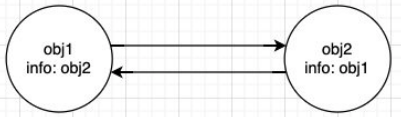
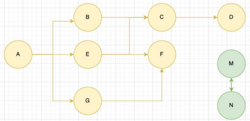
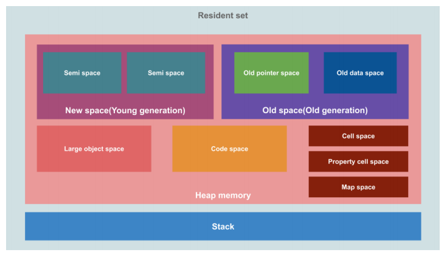
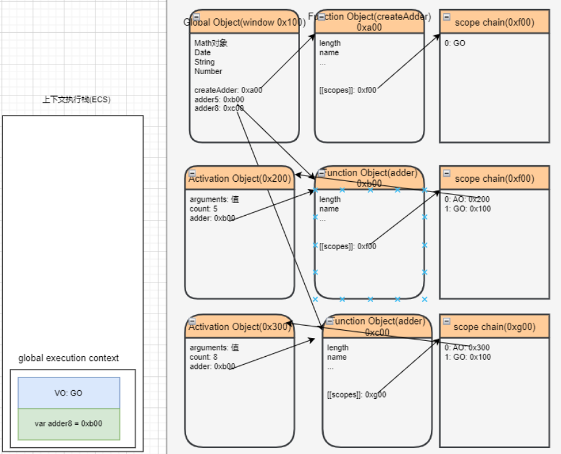
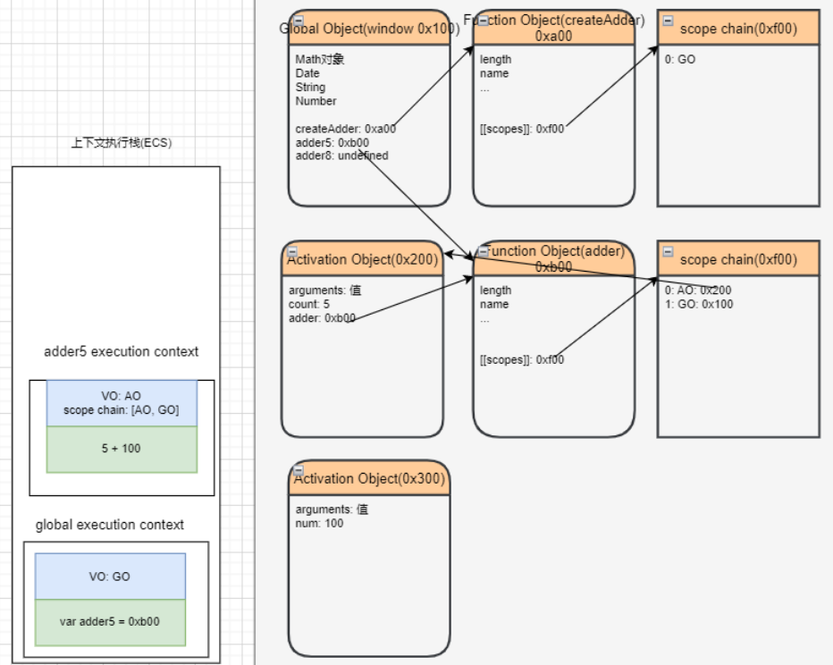
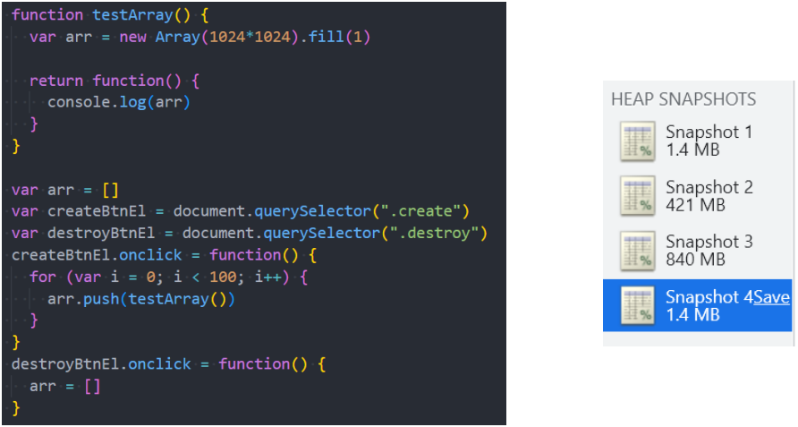
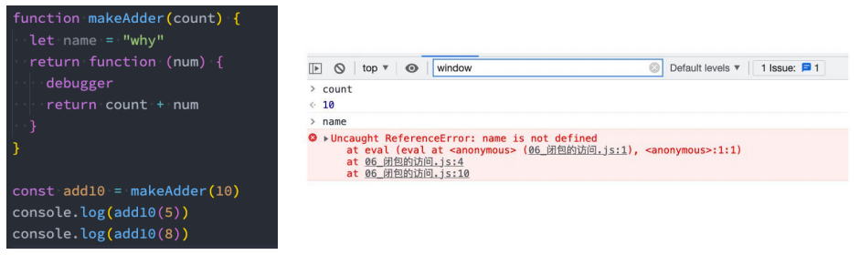

# 一. JS内存管理

---

## 1. 认识内存管理

- 不管什么样的编程语言，**在代码的执行过程中都是需要给它分配内存的**，不同的是某些编程语言需要我们自己手动的管理内存，某些编程语言会可以自动帮助我们管理内存：
- 不管以什么样的方式来管理内存，**内存的管理都会有如下的生命周期**：  
  - 第一步：分配申请你需要的内存（申请）
  - 第二步：使用分配的内存（存放一些东西，比如对象等）
  - 第三步：不需要使用时，对其进行释放
- 不同的编程语言对于第一步和第三步会有不同的实现：
  - 手动管理内存：比如`C`、`C++`，包括早期的`OC`，都是需要手动来管理内存的申请和释放的（`malloc`和`free`函数）
  - 自动管理内存：比如`Java`、`JavaScript`、`Python`、`Swift`、`Dart`等，它们有自动帮助我们管理内存
- 对于开发者来说，`JavaScript `的内存管理是自动的、无形的
  - 我们**创建的原始值、对象、函数……这一切都会占用内存**
  - 但是我们并不需要手动来对它们进行管理，`JavaScript`引擎会帮助我们处理好它

## 2. JS的内存管理

- `js`会**在定义数据时**为我们**分配内存**
- 但是内存分配方式是一样的吗？
  - `JS`对于**原始数据类型**内存的分配会在执行时，直接**在栈空间进行分配**
    - 因为`JS`有作用域链、作用域链这样的概念，形成了`AO`、`GO`这样的概念，所以在堆内存中又存在一个全局对象`GO`
    - 定义全局变量赋值原始数据类型，就会造成全局对象在堆内存中又有这样一个属性，属性又会保存一份这样的原始数据，但是执行这样一份代码的时候，确实是在栈内存中做分配的，只不过同时又会给`GO`添加这样一个属性而已，执行完后，栈内存中的这份数据会销毁掉，而`GO`中的就保留下来了
  - `JS`对于**复杂数据类型**内存的分配会**在堆内存中开辟一块空间**，并且**将这块空间的指针(内存地址)返回给变量来引用**


# 二. 垃圾回收机制算法

---

## 1. JS的垃圾回收

- 因为**内存的大小是有限**的，所以当**内存不再需要的时候**，我们**需要对其进行释放**，**以便腾出更多的内存空间**
- 在手动管理内存的语言中，我们需要通过一些方式自己来释放不再需要的内存，比如`free`函数： 
  - 但是这种管理的方式其实非常的低效，影响我们编写逻辑的代码的效率
  - 并且这种方式对开发者的要求也很高，并且一不小心就会产生内存泄露
- 所以大部分现代的编程语言都是有自己的垃圾回收机制： 
  - **垃圾回收**的英文是`Garbage Collection`，简称`GC`
  - 对于那些不再使用的对象，我们都称之为是垃圾，它需要被回收，以释放更多的内存空间
  - 而我们的语言运行环境，比如`Java`的运行环境`JVM`，`JavaScript`的运行环境`js`引擎都会有内存 **垃圾回收器**
  - **垃圾回收器**我们也会简称为`GC`，所以在很多地方你看到`GC`其实指的是垃圾回收器
- 但是这里又出现了另外一个很关键的问题：**`GC`怎么知道哪些对象是不再使用的呢？**
  - 这里就要用到`GC`的实现以及对应的算法

## 2. 常见的GC算法 - 引用计数（Reference counting）

- 引用计数：

  - 当一个对象有一个引用指向它时，那么这个对象的引用就`+1`
  - 当一个对象的引用为`0`时，这个对象就可以被销毁掉

- 这个算法有一个很大的**弊端**就是**会产生循环引用**

  

## 3. 常见的GC算法 – 标记清除（mark-Sweep）

- 标记清除：

  - 标记清除的核心思路是可达性（`Reachability`）
  - 这个算法是设置一个根对象（`root object`），**垃圾回收器会定期从这个根开始，找所有从根开始有引用到的对象，对于哪些没有引用到的对象，就认为是不可用的对象**
    - **`JS`中这里的根对象就是`window`对象**

- 这个算法可以很好的解决循环引用的问题

  

## 4. 常见的GC算法 - 其他算法优化补充

- **`JS`引擎比较广泛的采用的就是 可达性中的标记清除算法**，当然类似于V8引擎为了进行更好的优化，它在算法的实现细节上也会结合一些其他的算法
- **标记整理**（`Mark-Compact`） 和 ' 标记－清除 ' 相似
  - 不同的是，回收期间同时会将保留的存储对象搬运汇集到连续的内存空间，从而**整合空闲空间，避免内存碎片化**
- **分代收集**（`Generational collection`）—— 对象被分成两组：“新的”和“旧的”
  -  许多对象出现，完成它们的工作并很快死去，它们可以很快被清理
  - 那些**长期存活的对象会变得“老旧”**，而且**被检查的频次也会减少**
  - 长期在内存中保存（使用）的对象会被分为一组老旧的空间中保存，对这些老旧的对象检查的频次也会减少
- **增量收集**（`Incremental collection`）
  - 如果有许多对象，并且我们试图一次遍历并标记整个对象集，则可能需要一些时间，并在执行过程中带来明显的延迟
  - 所以引擎试图**将垃圾收集工作分成几部分来做**，然后将这几部分会逐一进行处理，这样会有**分成多个微小的延迟**而不是一个大的延迟
- **闲时收集**（`Idle-time collection`）
  - **垃圾收集器只会在` CPU `空闲时尝试运行，以减少可能对代码执行的影响**

## 5. v8引擎详细的内存图

- 事实上，V8引擎为了提供内存的管理效率，对内存进行非常详细的划分：




# 三. 闭包的概念理解

---

## 1. 又爱又恨的闭包

- 闭包是`js`中一个非常容易让人迷惑的知识点：
  - 有同学在深入`JS`高级的交流群中发了这么一张图片
  
  - 并且闭包也是群里面大家讨论最多的一个话题
  
    

- 闭包确实是`js`中一个很难理解的知识点，接下来我们就对其一步步来进行剖析，看看它到底有什么神奇之处

## 2. js的函数式编程

- 在前面我们说过，`js`是支持函数式编程的
- 在`js`中，函数是非常重要的，并且是一等公民：
  - 那么就意味着函数的使用是非常灵活的
  - 函数可以作为另外一个函数的参数，也可以作为另外一个函数的返回值来使用
- 所以`js`存在很多的高阶函数：
  - 自己编写高阶函数
  - 使用内置的高阶函数
- 目前在`vue3 + react`开发中，也都在趋向于函数式编程：
  - `vue3 composition api: setup`函数 -> 代码（函数`hook`，定义函数）
  - `react: class -> function -> hooks`

## 3. 闭包的定义

- 这里先来看一下闭包的定义，分成两个：在计算机科学中和在`js`中
- 在计算机科学中对闭包的定义（维基百科）：
  - 闭包（英语：`Closure`），又称词法闭包（`Lexical Closure`）或函数闭包（`function closures`）
  - 是在支持头等函数的编程语言中，实现词法绑定的一种技术
  - 闭包在实现上是一个结构体，它存储了一个函数和一个关联的环境（相当于一个符号查找表）
    - **函数本身和函数所关联的外部环境，二者组成的结构体就是闭包**
  - **闭包跟函数最大的区别**在于，当捕捉闭包的时候，它的自由变量会在捕捉时被确定，这样**即使脱离了捕捉时的上下文，它也能照常运行**
- 闭包的概念出现于60年代，最早实现闭包的程序是`Scheme`，那么我们就可以理解为什么`js`中有闭包：
  - 因为`js`中有大量的设计是来源于`Scheme`的
- 我们再来看一下`MDN`对`js`闭包的解释：
  - **一个函数和对其周围状态（词法环境）的引用捆绑在一起（或者说函数被引用包围）**，这样的组合就是闭包
  - 也就是说，**闭包让你可以在一个内层函数中访问到其外层函数的作用域**
  - 在`js`中，**每当创建一个函数，闭包就会在函数创建的同时被创建出来**
- 理解和总结：
  - 一个普通的函数`function`，如果它可以访问外层作用域的自由变量，那么这个函数和周围环境就是一个闭包
  - 从广义的角度来说：`JS`中的函数都是闭包
  - 从狭义的角度来说：`JS`中一个函数，如果访问了外层作用域的变量，那么该函数就形成了一个闭包
- **`JS`中如果一个函数有对外层环境的变量产生了引用(访问)，那么这个函数就是一个闭包**


# 四. 闭包的形成过程

---

## 1. 闭包的访问过程

- 如果我们编写了如下的代码，它一定是形成了闭包的：

  ```js
  function makeAdder(count) {
    return function(num) {
      return count + num
    }
  }
  
  var add10 = makeAdder(10)
  console.log(add10(5)) // 15
  ```

  

## 2. 闭包的执行过程

- 那么函数继续执行呢？

  -  这个时候`makeAdder`函数执行完毕，正常情况下我们的`AO`对象会被释放
  - 但是因为在`0xb00`的函数中有作用域引用指向了这个`AO`对象，所以它不会被释放掉

  

# 五. 闭包的内存泄露

---

## 1. 闭包的内存泄漏

- **那么我们为什么经常会说闭包是有内存泄露的呢？**

  - 在上面的案例中，如果后续我们不再使用`add10`函数了，那么该函数对象应该要被销毁掉，并且其引用着的父作用域`AO`也应该被销毁掉

  - 但是目前因为在全局作用域下`add10`变量对`0xb00`的函数对象有引用，而`0xb00`函数的作用域中对`AO（0x200）`有引用，所以最终会造成这些内存都是无法被释放的

  - 所以我们经常说的闭包会造成内存泄露，其实就是刚才的引用链中的所有对象都是无法释放的

- **那么，怎么解决这个问题呢？**
  -  将`add10`**设置为`null`**时，就不再对函数对象`0xb00`有引用，那么对应的`AO`对象`0x200`也就不可达了
  - 在`GC`的下一次检测中，它们就会被销毁掉

## 2. 闭包的内存泄露测试



## 3. AO不使用的属性优化

- 我们来研究一个问题：`AO`对象不会被销毁时，是否里面的所有属性都不会被释放？

  - 下面这段代码中`name`属于闭包的父作用域里面的变量
  - 我们知道形成闭包之后`count`一定不会被销毁掉，那么`name`是否会被销毁掉呢？
  - 这里我打上了断点，我们可以在浏览器上看看结果
    - 所以，`AO`中不使用的属性会被浏览器优化掉
  - 如果一个**`AO`中有不被使用的自定义属性会被浏览器优化掉**
  
  


