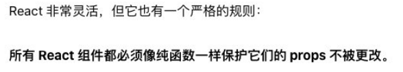

# 一. 函数默认属性、arguments、rest剩余参数

---

## 1. 函数对象的默认属性

- 我们知道`JS`中函数也是一个对象，那么对象中就可以有属性和方法

- **属性`name`**：一个**函数的名字**我们可以通过`name`来访问

  ```js
  function foo() {}
  var bar = function() {}
  console.log(foo.name, bar.name) // foo bar
  ```

- **属性`length`**：返回**函数形参的个数**

  - **`rest`剩余参数和有默认值的形参是不计算在内的**

  ```js
  function foo(name, age) {}
  function bar(name, age = 18, ...args) {}
  console.log(foo.length, bar.length) // 2 1
  ```

## 2. 认识arguments

- `arguments`是一个**由函数调用所传入的实参所组成的类数组（`array-like`）对象**

  ```js
  function foo(x, y, z) {
    console.log(arguments)
  }
  foo(10, 20, 30) // [Arguments] { '0': 10, '1': 20, '2': 30 }
  ```

- `array-like`意味着它不是数组类型，而是一个对象类型

  - 但是它却拥有数组的一些特性，比如说`length`、通过`index`索引来访问
  - 但是却没有数组的一些方法，如`forEach`、`filter`、`map`等

  ```js
  console.log(arguments.length) // 3
  console.log(arguments[0]) // 10
  console.log(arguments[arguments.length-1]) // 30
  ```

## 3. arguments转换成Array

- 在开发中，我们经常需要将`arguments`转成`Array`，以便使用数组的一些特性

- 常见转换方式如下：

  - 方式一：

    - 遍历`arguments`，将所有属性添加到一个新数组中

    ```js
    var  arr = []
    for (var i = 0; i < arguments.length; i++) {
      arr.push(arguments[i])
    }
    ```

  - 方式二（`es6`之前早期写法）：

    - 调用`Array.prototype.slice()`方法显式绑定`this`
      - `slice()`方法截取某个数组**内部实现原理，其实是通过`this`找到需要执行的数组**
      - 所以通过`slice`显示绑定`this`进行调用，从而拿到返回的**浅拷贝**的新数组

    ```js
    var newArr = [].slice.call(arguments)
    var newArr = Array.prototype.slice.call(arguments)
    ```

  - 方式三（`es6`新增方法）：

    - `Array.from()`类方法
      - 对一个类数组对象或可迭代对象创建一个新的，**浅拷贝**的数组实例
    
    
    ```js
    function foo() {
      console.log(arguments instanceof Array) // false
      console.log(Array.from(arguments) instanceof Array) // true
    }
    foo(1, 2)
    ```
    
    - `...arguments`展开语法
      - **在函数调用 或 数组构造时，将数组表达式 或 字符串在语法层面展开**
      - **在构造字面量对象时，将对象表达式按`key-value`的方式展开（`es2018`新增）**
    
    ```js
    function foo(name, age) {
      console.log(...arguments)
    }
    var arr = [1, 2]
    foo(...arr) // 1 2
    console.log([...arr, 3]) // [1, 2, 3]
    
    var obj = {
      name: 'later',
      age: '18'
    }
    var obj2 = {
      ...obj,
      sex: 'male'
    }
    console.log(obj2) // {name: 'later', age: '18', sex: 'male'}
    ```

## 4. 箭头函数不绑定arguments

- **箭头函数是不绑定`arguments`的**，所以我们在箭头函数中使用`arguments`时，会**去上层作用域中查找**：

  ```js
  var foo = (x, y) => {
    console.log(arguments)
  }
  foo() // not defined 全局中也是不存在arguments的
  
  function bar(m, n) {
    return x => console.log(arguments)
  }
  bar('aaa', 222)() // {'0': 'aaa', '1': 222} 查找到bar函数中的arguments
  ```

## 5. 函数的rest剩余参数

- `ES6`中新增了`rest parameter`，可以将不定数量的参数放入到一个数组中，**存储的是没有对应形参的所有实参**：

  - 如果有多个参数，**剩余参数必须放到最后一个位置，否则会报错**
  - 如果最后一个形参是` ... `为前缀的，那么它会将剩余的实参放到该形参中，并且作为一个数组

  ```js
  function foo(x, y, ...args) {
    console.log(x, y, args)
  }
  foo(1, 2, 3, 4, 5) // 1 2 [3, 4, 5]
  
  function bar(...args) {
    console.log(args)
  }
  bar(1, 2) // [1, 2]
  ```

- 那么剩余参数和`arguments`有什么区别呢？

  - **`arguments`存储的是所有实参**，**`rest`参数存储的是没有对应形参接收的所有实参**
  - **`arguments`是一个类数组对象**，**`rest`参数是数组**
  - `arguments`是早期的`ECMAScript`中为了方便去获取所有的参数提供的一个数据结构，而`rest`参数是`ES6`中提供并且希望以此来替代`arguments`的


# 二. 纯函数的理解和应用

---

## 1. 理解JS纯函数

- **函数式编程**中有一个非常重要的概念叫**纯函数**，`JS`符合**函数式编程的范式**，所以也有纯函数的概念
  - 在`react`开发中纯函数是被多次提及的
  - 比如`react`中组件就被要求像是一个纯函数（为什么是像，因为还有`class`组件），`redux`中有一个`reducer`的概念，也是要求必须是一个纯函数
  - 第三方框架一般也是用纯函数，不会对你传入的一些对象进行修改等
  - 所以掌握纯函数对于理解很多框架的设计是非常有帮助的
- **纯函数的维基百科定义：**
  - 在程序设计中，若一个函数符合以下条件，那么这个函数被称为纯函数
    - 此函数在相同的输入值时，需产生相同的输出
    - 函数的输出和输入值以外的其他隐藏信息或状态无关，也和由`I/O`设备产生的外部输出无关
    - 该函数不能有语义上可观察的函数副作用，诸如“触发事件”，使输出设备输出，或更改输出值以外物件的内容等
- 当然上面的定义会过于的晦涩，所以简单总结一下：
  - **相同的输入，产生相同的输出**
  - **函数在执行过程中，不能产生副作用**
- 纯函数不要用闭包，因为不能保证相同的输入，一定产生相同的输出
  - 如果想用外部的变量，可以作为参数传入进去，而不是使用闭包直接对其进行引用


## 2. 副作用概念的理解

- 那么这里又有一个概念，叫做副作用，什么又是副作用呢？
  - 副作用（`side effect`）其实本身是医学的一个概念，比如我们经常说吃药是为了治病，但可能会产生一些其他的副作用
  - 在计算机科学中，也引用了副作用的概念，**表示在执行一个函数时，除了返回函数值之外，还对调用函数产生了附加的影响，比如修改了全局变量，修改参数或者改变外部的存储**
- 纯函数在执行的过程中就是不能产生这样的副作用：
  -  副作用往往是产生`bug`的 “温床”

## 3. 纯函数的案例

- 我们来看一个对数组操作的两个函数：

  - `Array.prototype.slice()`：返回一个新数组（（**浅拷贝**）），不修改原数组
  - `Array.prototype.splice()`：返回一个被修改后的原数组

- `slice`就是一个纯函数，不会修改数组本身，而`splice`函数不是一个纯函数

  ```js
  var arr = [1, 2, 3, 4, 5]
  console.log(arr.slice(0, 2)) // [1, 2]
  console.log(arr.splice(2)) // [3, 4, 5]
  console.log(arr) // [1, 2]
  ```

## 4. 判断下面函数是否是纯函数

```js
function sum(num1, num2) { // 是纯函数
  return num1 + num2
}

var foo = 0
function add(num) { // 不是纯函数，当foo修改时，同样的输入，不同的输出
  return foo + num
}
console.log(add(5)) // 5
foo = 10
console.log(add(5)) // 15

function printInfo(info) { // 不是纯函数，修改了传入的参数
  info.name = 'hehe'
}
```

## 5. 纯函数的作用和优势

- 为什么纯函数在函数式编程中非常重要呢？
  - 因为你可以安心的编写和安心的使用
  - 你在写的时候保证了函数的纯度，只是单纯实现自己的业务逻辑即可，不需要关心传入的内容是如何获得的或者依赖其他的外部变量是否已经发生了修改
  - 你在用的时候，你确定你的输入内容不会被任意篡改，并且自己确定的输入，一定会有确定的输出
  
- **`React`中**就要求我们无论是**函数还是`class`声明一个组件**，这个组件都必须**像纯函数一样**，**保护它们的`props`不被修改：**

  


# 三. 柯里化的理解和应用

---

## 1. 柯里化概念的理解

- 柯里化也是属于函数式编程里面一个非常重要的概念
  - 是一种关于函数的高阶技术
  - 它不仅被用于`js`，还被用于其他编程语言
- 我们先来看一下**维基百科的解释**：
  - 在计算机科学中，柯里化（英语：`Currying`），又译为卡瑞化或加里化
  - **是把接收多个参数的函数，变成接受一个单一参数（最初函数的第一个参数）的函数，并且返回接受剩下参数且返回结果的新函数的技术**
  - 柯里化声称 “如果你固定某些参数，你将得到接受余下参数的一个函数”
- 维基百科的解释非常的抽象，我们这里做一个总结：
  - **只传递给函数一部分参数来调用它，让它返回一个函数去处理剩余的参数**
  - **这个转换过程就称之为柯里化**
- 柯里化是一种函数的转换，将一个函数从可调用的` f(a, b, c) `转换为可调用的` f(a)(b)(c)`
  - 柯里化不会调用函数，它只是对函数进行转换

## 2. 柯里化的代码转换

- 那么柯里化到底是怎么样的表现呢？

```js
// 未柯里化的函数
function add1(x, y, z) {
  return x + y +z
}
add1(1, 2, 3)

// add1的柯里化函数
function add2(x) {
  return function(y) {
    return function(z) {
      return x + y + z
    }
  }
}
add2(1)(2)(3)

function add3 = x => y => z => x + y + z
add3(1)(2)(3)
```

## 3. 柯里化优势一 - 函数的职责单一

- 那么为什么需要有柯里化呢？

  - 在函数式编程中，我们其实往往希望一个函数处理的问题尽可能的单一，而不是将一大堆的处理过程交给一个函数来处理
  - 那么我们是否就可以将每次传入的参数在单一的函数中进行处理，处理完后在下一个函数中再使用处理后的结果

- 比如上面的案例我们进行一个修改：**传入的函数需要分别被进行如下处理**

  - 第一个参数 `+ 2`
  - 第二个参数 `* 2`
  - 第三个参数 `** 2`

  ```js
  function add(x) {
    x = x + 2
    return function(y) {
      y = y * 2
      return function(z) {
        z = z ** 2
        return x + y + z
      }
    }
  }
  ```


## 4. 柯里化优势二 - 函数的参数复用

- 另外一个使用柯里化的场景是可以帮助我们可以**复用参数逻辑**： 

  - `makeAdder`函数要求我们传入一个`num`（并且如果我们需要的话，可以在这里对`num`进行一些修改）
  - 在之后使用返回的函数时，我们不需要再继续传入`num`了

  ```js
  function makeAdder(num) {
    return function(count) {
      return num + count
    }
  }
  var add5 = makeAdder(5)
  console.log(add5(10)) // 15
  console.log(add5(20)) // 25
  ```

## 5. 柯里化案例练习

- 这里我们在演示一个案例，需求是打印一些日志：

  - 日志包括时间、类型、信息

- 普通函数的实现方案如下：

  ```js
  function log(date, type, msg) {
    console.log(`[${date.getHours()}:${date.getMinutes()}]·[${type}]·[${msg}]`)
  }
  log(new Date(), 'debug', '修复问题')
  log(new Date(), 'feature', '新功能')
  
  function log(date) {
    return type => {
      return msg => {
        console.log(`[${date.getHours()}:${date.getMinutes()}]·[${type}]·[${msg}]`)
      }
    }
  }
  var logNow = log(new Date())
  logNow('debug')('fix question')
  logNow('feature')('add new feature')
  
  var logNowDebug = log(new Date())('debug')
  logNowDebug('修复轮播图bug')
  logNowDebug('点击无效bug')
  ```


## 6. 柯里化高级 - 自动柯里化函数

- 目前我们有将多个普通的函数，转成柯里化函数：

  ```js
  function foo(x, y, z) {
    return x + y + z
  }
  
  function zcCurrying(fn) {
    return function curryFn(...args) {
      if (args.length >= fn.length) {
        return fn.call(this, ...args)
      } else {
        return function(...newArgs) {
          return curryFn.call(this, ...args.concat(...newArgs))
        }
      }
    }
  }
  
  var fooCurry = zcCurrying(foo)
  console.log(fooCurry(10)(20).call('aaa', 30))
  ```


# 四. 组合函数理解和应用

---

## 1. 组合函数概念的理解

- 组合（`Compose`）函数是在`JS`开发过程中一种对**函数的使用技巧、模式**： 

  - 比如我们现在需要对某一个数据进行函数的调用，执行两个函数`fn1`和`fn2`，这两个函数是依次执行的
  - 那么如果每次我们都需要进行两个函数的调用，操作上就会显得重复
  - 那么是否可以将这两个函数组合起来，自动依次调用呢？
  -  这个过程就是对函数的组合，我们称之为 组合函数（`Compose Function`）

  ```js
  function compose(fn1, fn2) {
    return function(x) {
      return fn2(fn1(x))
    }
  }
  
  function double(num) { return num * 2 }
  function square(num) { return num ** 2 }
  var calcFn = compose(double, square)
  console.log(calcFn(20)) // 1600
  ```

## 2. 实现组合函数

- 刚才我们实现的`compose`函数比较简单

- 我们需要考虑更加复杂的情况：比如传入了更多的函数，在调用`compose`函数时，传入了更多的参数：

  ```js
  function double(num) { return num * 2 }
  function square(num) { return num ** 2 }
  function pow(num) { return num ** 2 }
  
  function compose(...fns) {
    // 遍历所有的参数如果不是函数，那么抛出一个错误
    var length = fns.length
    if (!length) throw new Error('The parameter cannot be empty')
    for (var i = 0; i < length; i++) {
      var fn = fns[i]
      if (typeof fn !== 'function') {
        throw new TypeError('Expected a function')
      }
    }
    
    // 取出所有的参数依次调用
    return function(...args) {
      if (!args.length) throw new Error('The parameter cannot be empty')
      var result = fns[0].call(this, ...args);
      for (var i = 0; i < length; i++) {
        result = fns[i].call(this, result)
      }
      return result
    }
  }
  
  var newFn = compose(double, pow, console.log)
  newFn(2) // 64
  ```


# 五. with、eval的使用

---

## 1. with语句的使用

- **`with`语句** 用于**扩展一个语句的作用域链**

  - `es5`严格模式中不支持使用
  - 不建议使用`with`语句，因为它可能是混淆错误和兼容性问题的根源

  ```js
  var obj = {
    name: 'hello world',
    age: 18
  }
  
  with(obj) { // 会先从obj对象中查找对应的变量
    console.log(name)
  }
  ```

## 2. eval函数

- **内建函数`eval`** 会**将传入的字符串当做`JS`代码进行执行**

  - `eval`会将最后一句执行语句的结果，作为返回值

  ```js
  var evalString = `var message = "hello world"; console.log(message)`
  eval(evalString) // hello world
  console.log(message) // hello world
  ```

- 不建议在开发中使用`eval`：

  - `eval`代码的可读性非常的差（代码的可读性是高质量代码的体现）
  - `eval`函数调用需要传入一个字符串，那么字符串有可能在执行的过程中被刻意篡改，也就有可能被攻击的风险
  - `eval`的执行必须经过`JS`解释器，不能被`JS`引擎优化


# 六. 严格模式的使用

---

## 1. 认识严格模式

- `JS`历史的局限性：
  - 长久以来，`JS`不断向前发展且并未带来任何兼容性问题
  - 新的特性被加入，旧的功能也没有改变，这么做有利于兼容旧代码
  - 但缺点是`JS`创造者的任何错误或不完善的决定也将永远被保留在`JS`语言中
- 在`es5`标准中，`JS`提出了**严格模式的概念（`Strict Mode`）**
  - 严格模式很好理解，是一种具有限制性的`JS`模式，从而使代码隐式的脱离了 " 懒散（`sloppy`）模式 "
  - 支持严格模式的浏览器在检测到代码中有严格模式时，会以更加严格的方式对代码进行检测和执行
- 严格模式对正常的`JS`语义进行了一些限制：
  - 严格模式**通过 抛出错误 来消除一些原有的 静默（`silent`）错误**
    - **静默错误：类似于不报错也没有任何效果的**
    - 如非严格模式下：使用`Object.defineProperty()`给对象某个属性设置不可配置后，对该属性进行删除，不会报错也不会执行，配置了不可修改，进行修改操作，也是不会报错也不会执行的
  - 严格模式**让`JS`引擎在执行代码时可以进行更多的优化**（**不需要对一些特殊的语法进行处理**）
    - 如非严格模式下：不使用`var`、`let`、`const`等标识符定义一个变量，也是可以的，这种早期语言设计层面上遗留下来的设计缺陷
  - 严格模式**禁用了在`ECMAScript`未来版本中可能会定义的一些语法**

## 2. 开启严格模式

- 那么如何开启严格模式呢？严格模式支持粒度化的迁移：

  - 可以支持在`js`文件中开启严格模式
  - 也支持对某一个函数开启严格模式

- 严格模式通过**在文件 或 函数开头**使用 `use strict` 来开启

  ```js
  'use strict'
  var name = 'abc'
  console.log(name)
  
  function foo() {
    'use strict'
    m = 'foo' // 不支持这种写法
  }
  ```

- 没有类似于`" no use strict "`这样的指令可以使程序返回默认模式

  - 现代`JS`支持**`class`**和**`module`**，它们**会自动启用`use strict`**

## 3. 严格模式下的限制

- 这里我们来说几个严格模式下的严格语法限制：

  - `use strict`被设计为新手开发者更容易上手，所以有时候本来错误语法，被认为也是可以正常被解析的
  - 但是这种方式可能给带来留下来安全隐患
  -  在严格模式下，这种失误就会被当做错误，以便可以快速的发现和修正

  ```js
  "use strict"
  
  // 1. 不会意外创建全局变量
  msg = 'aaa'
  console.log(msg) 
  
  // 2. 严格模式会使引起静默失败（silently fail，注:不报错也不没有任何效果）的赋值操作抛出异常
  var obj = {
    name: 'later'
  }
  Object.defineProperty(obj, 'name', {
    writable: false,
    configurable: false
  })
  obj.name = 'haha'
  
  // 3. 严格模式下试图删除不可删除的属性
  delete obj.name
  
  // 4. 严格模式不允许函数参数有相同的名称
  function foo(num, num) {}
  
  // 5. 不允许0的八进制语法
  012
  
  // 6. 在严格模式下，不允许使用with
  width () {}
  
  // 7. 在严格模式下，eval不再为上层引用变量
  eval('var msg = "haha";')
  console.log(msg) // not defined
  
  // 8. 严格模式下，this绑定不会默认转成对象
  function foo() {
    console.log(this, typeof this)
  }
  
  foo.call('abc') // abc string
  foo.call(123) // 123 number
  
  // 9. 在严格模式下, 独立函数调用，不绑定全局对象window而是undefined
  foo() // undefined 'undefined'
  ```
  


