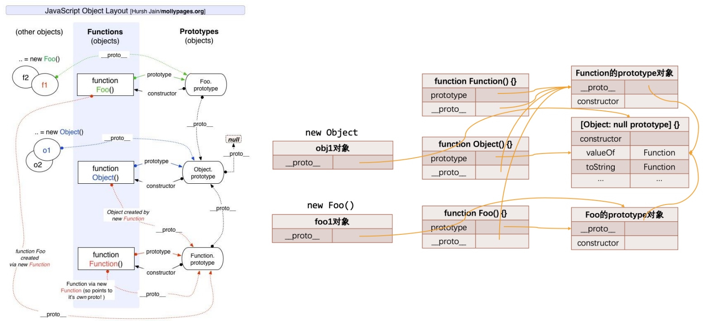
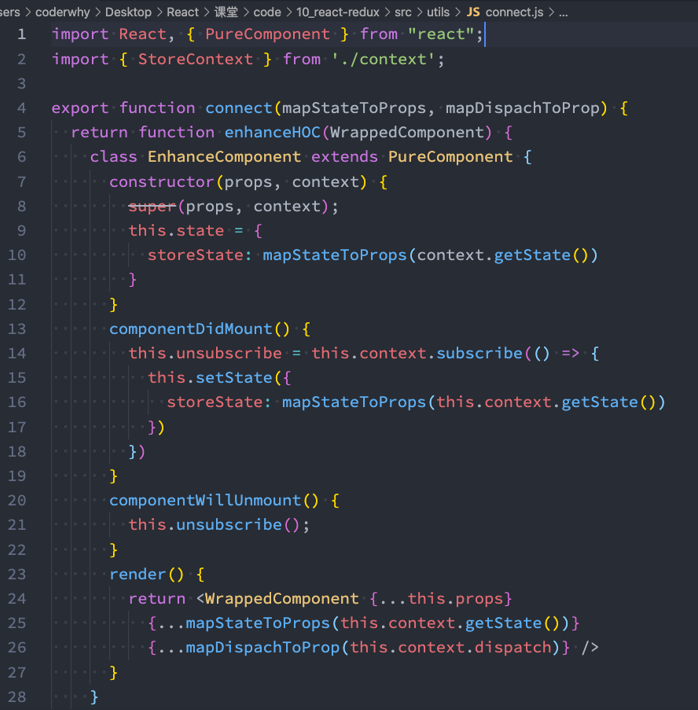

# 一. 对象的方法补充

---

- `Object.prototype.hasOwnProperty()`

  ```js
  obj.hasOwnProperty(prop)
  // 检测obj对象自身属性中是否存在prop属性，返回一个boolean
  // 只检测自身的属性，不包括原型上的属性
  ```
  
- `in`操作符 、`for...in`、`Object.keys()`

  ```js
  in操作符
  // 检测某个属性是否存在某个对象或其原型链上，返回一个boolean
  
  for...in语句（遍历对象的可枚举属性包括原型链上的）
  // 任意顺序迭代一个对象的除Symbol以外的可枚举属性，包括继承的可枚举属性
  
  Object.keys()
  // 返回一个给定对象的自身可枚举属性组成的数组（除Symboly），数组中属性名的排列顺序和正常循环遍历该对象时返回的顺序一致
  ```

- `instanceof`运算符

  - 语法：`obj instanceof Constructor`
  - `obj`：检测的对象
  - `Constructor`：构造函数

  ```js
  // 用于检测某个构造函数的prototype，是否出现在某个实例对象的原型链上
  // 就是检测某个对象是否是某个构造函数的实例对象
  ```

- `Object.prototype.isPrototypeOf()`

  ```js
  // 用于检测某个对象，是否出现在某个实例对象的原型链上
  ```

  ```js
  function Person() {}
  function Student(name, age) {
    this.name = name
    this.age = age
  }
  
  Object.prototype.address = '深圳'
  var stu1 = new Student('later', 23)
  
  console.log(stu1.hasOwnProperty('name')) // true
  console.log(stu1.hasOwnProperty('address')) // false
  console.log(stu1)
  
  console.log('name' in Student) // true
  console.log('name' in Person) // true
  console.log('address' in Student) // true
  
  for (var key in stu1) {
    console.log(key) // name、age、address
  }
  console.log(Object.keys(stu1)) // ['name', 'age']
  
  console.log(stu1 instanceof Student) // true
  console.log(stu1 instanceof Person) // false
  console.log(stu1 instanceof Object) // true
  
  console.log(Object.prototype.isPrototypeOf(stu1)) // true
  console.log(Student.isPrototypeOf(stu1)) // false
  console.log(Student.prototype.isPrototypeOf(stu1)) // true
  ```


# 二. 原型继承关系图

---



- `Function`构造函数作为对象，其隐式原型指向其`Function`构造函数的显式原型

  ```js
  Function.__proto__ === Function.prototype // true
  ```

- **所有函数的隐式原型都指向`Function`构造函数的显式原型**

  ```js
  (()=>{}).__proto__ === Function.prototype  // true
  Object.__proto__ === Function.prototype // true
  Date.__proto__ === Function.prototype // true
  Number.__proto__ === Function.prototype // true
  
  function foo() {}
  function bar() {}
  // 普通函数本质上是通过new Function的方式创造出来的
  foo.__proto__ === Function.prototype // true
  bar.__proto__ === Function.prototype // true
  ```
  
- **普通对象的隐式原型默认是指向`Object`构造函数的显式原型的**

  ```js
  {}.__proto__ === Object.prototype // true
  var obj = new Object({name: 'hi'}) 
  obj.__proto__ === Object.prototype // true
  console.log(obj) // {name: 'hi'}
  ```

- **`Object`构造函数的显式原型，其本身也是一个对象，其隐式原型是指向`null`的**

  ```js
  Object.prototype.__proto__ // null
  ```


# 三. es6的class类

---

## 1. 认识class定义类

- 我们会发现，按照前面的构造函数形式创建类，不仅仅和编写普通的函数过于相似，而且代码并不容易理解

  ```js
  // ES5中定义类
  // function Person() {}
  ```

  - 在`ES6（ECMAScript2015）`新的标准中使用了**`class`关键字来直接定义类**
  - 但是**类本质上**依然是前面所讲的**构造函数**、**原型链的语法糖**而已
  - 所以学好了前面的构造函数、原型链更有利于我们理解类的概念和继承关系

- 那么，如何使用`class`来定义一个类呢？

  - 可以使用两种方式来声明类：类声明和类表达式
  - **类表达式 和 类声明体都是在严格模式下运行**
  
  ```js
  // ES6定义类
  // {key: value} -> 对象
  // {表达式} -> 代码块
  // {} -> 类的结构
  class Person {}
  var Person = class {}
  ```

## 2. 类的构造函数

- 如果我们希望在创建对象的时候给类传递一些参数，这个时候应该如何做呢？

  - **每个类都可以有一个自己的构造函数**（方法），这个方法的名称是固定的`constructor`
  - 当我们通过**`new`操作符，操作一个类的时候会调用这个类的构造函数`constructor`**
  - 每个类只能有一个构造函数，如果包含多个构造函数，那么会抛出异常
  - **构造函数是可选的**

- 当我们通过`new`关键字操作类的时候，会调用这个`constructor`函数，并且执行如下操作：

  1. 在堆内存中创建一个空对象
  2. 该对象内部的`[[prototype]]`属性会被赋值为该类的`prototype`属性
  3. `constructor`构造函数内部的`this`，会指向创建出来的空对象
  4. 执行`constructor`构造函数的内部代码（函数体代码）
  5. 如果`constructor`构造函数没有指定返回非空对象，则返回创建出来的新对象

  ```js
  class Person {
    // es6中class类中constructor方法的固定语法
    constructor(name, age) {
      this.name = name
      this.age = age
    }
  }
  
  var p1 = new Person('later', 18)
  console.log(p1) // Person {name: 'later', age: 18}
  ```

- **如果不指定构造方法，则使用默认构造函数**

  - 对于基类，默认构造函数是：

    ```js
    constructor() {}
    ```

  - 对于派生类，默认构造函数是：

    ```js
    constructor(...args) {
      super(...args);
    }
    ```

## 3. 类的实例方法

- 在上面我们定义的属性都是直接放到了`this`上，也就意味着它是放到了创建出来的新对象中：

  - 在前面我们说过对于实例的方法，我们是希望放到原型上的，这样可以被多个实例来共享
  - 这个时候我们可以直接在类中定义

  ```js
  class Person {
    constructor(name, age) {
      this.name = name
      this.age = age
    }
    // es6中class类中定义实例方法的固定语法
    running() {
      console.log(this.name + ' running')
    }
  }
  
  var p1 = new Person('later', 18)
  p1.running() // 'later running'
  ```

## 4. class中定义构造方法和实例方法

- 当我们**通过`new`关键字调用一个`Person`类时，默认调用`class`中的`constructor`方法**

  ```js
  class Person {
    // 1.类中的构造函数
    // 当我们通过new关键字调用一个Person类时, 默认调用class中的constructor方法
    constructor(name, age) { //  es6中class类中constructor方法的固定语法
      // 创建空的新对象，Person类的显式原型赋值给空对象的隐式原型
      // this指向空对象，指向函数体代码
      // 没有明确指定返回非空对象，默认返回创建的之前空对象
      this.name = name
      this.age = age
    }
    // 2.实例方法 es6中class类中定义实例方法的固定语法
    // 本质上是放在Person.prototype
    running() {
      console.log(this.name + " running~")
    }
  }
  
  // 创建实例对象
  var p1 = new Person("why", 18)
  // 使用实例对象中属性和方法
  console.log(p1.name, p1.age) // why 18
  p1.running() // 'why running~'
  
  // 研究内容
  console.log( Person.prototype === p1.__proto__ ) // true
  console.log( Person.runnin g) // undefined 不存在这样的类方法 
  console.log( Person.prototype.running ) // ƒ running() { console.log(this.name + " running~") }
  ```

## 5. class类和function构造函数（类）区别

- **`class`关键字定义类，本质上也是构造函数、原型链的语法糖**
- 唯一区别就是：
  - **`function`构造函数可以作为普通函数独立调用，函数声明可以提升**
  - **`class`定义的类，不能作为普通函数调用，类声明不能提升**

```js
// function定义类
function Person1(name, age) {
  this.name = name
  this.age = age
}
Person1.prototype.running = function() {}

var p1 = new Person1('later', 18)
console.log( p1.__proto__ === Person1.prototype) // true
console.log( Person1.prototype.constructor) // f Person1(name, age) {...}
console.log( typeof Person1 ) // function
// 区别：function构造函数可以作为普通函数进行调用
Person1('later', 18)

// class定义类
class Person2 {
  constructor(name, age) {
    this.name = name
    this.age = age
  }
}

var p2 = new Person2('later', 23)
console.log( p2.__proto__ === Person2.prototype ) // true
console.log( Person2.prototype.constructor ) // class Person2 {...}
console.log( typeof Person2 ) // function
// 区别：class定义的类，不能作为普通函数进行调用
Person2('later', 23) // 没有new的情况下，不能调用类构造函数Person2
```

## 6. 类的访问器方法

- 我们之前讲对象的属性描述符时，有讲过对象可以添加`setter`和`getter`函数的，那么类也是可以的：

  ```js
  // es5定义getter和setter，方式一：存取属性描述符
  var obj = {
    _name: 'hehe'
  }
  
  Object.defineProperty(obj, 'name', {
    // get: function() {
    //   return this._name
    // },
    // set: function(value) {
    //   this._name = value
    // },
    get() {
      return this._name
    },
    set(value) {
      this._name = value
    }
  })
  console.log( obj.name ) // hehe
  obj.name = 'later'
  console.log( obj.name ) // later
  
  // es5定义getter和setter，方式二：直接在对象中定义访问器
  var obj = {
    _name: 'hehe',
    get name() {
      return this._name
    },
    set name(value) {
      this._name = value
    }
  }
  console.log( obj.name ) // hehe
  obj.name = 'later'
  console.log( obj.name ) // later
  
  // 类的访问器方法
  class Person {
    constructor(name) {
      this._name = name
    }
    get name() {
      return this._name
    }
    set name(value) {
      this._name = value
    }
  }
  
  var p1 = new Person('later')
  console.log( p1.name ) // later
  
  // 2.访问器的应用场景
  class Rectangle {
    constructor(x, y, width, height) {
      this.x = x
      this.y = y
      this.width = width
      this.height = height
    }
  
    get position() {
      return { x: this.x, y: this.y }
    }
  
    get size() {
      return { width: this.width, height: this.height }
    }
  }
  
  var rect1 = new Rectangle(10, 20, 100, 200)
  console.log( rect1.position )
  console.log( rect1.size )
  ```
  

## 7. 类的静态方法

- **静态方法**通常用于定义**直接通过类来执行的方法，不需要有类的实例，使用`static`关键字来定义**

  ```js
  class Person {
    constructor(name, age) {
      this.name = name
      this.age = age
    }
    running() {
      console.log(this.name, ' running~')
    }
    static eatting() {
      console.log(this.name, ' eatting~')
    }
  }
  
  var p1 = new Person('later', 18)
  p1.running() // later running~
  Person.eatting() // Person  eatting~
  ```

- 类方法（静态方法）中的`this`指向类本身

- **`es6`之前叫做类方法，`es6`之后叫做静态方法，本质上是同一种东西**

  ```js
  class Person {
    constructor(name, age) {
      this.name = name
      this.age = age
    }
    static randomNum() {
      // return new Person('test', Math.floor(Math.random() * 5) + 1)
      // 在静态方法中new该类的时候，可以用this代替该类
      return new this('test', Math.floor(Math.random() * 5) + 1)
    }
  }
  
  var p1 = new Person('later', 18)
  console.log( Person.randomNum() ) // Person {name: 'test', age: 3}
  ```

- **静态方法（类方法）在`es6`的`class`类中也是可以被继承的**，`es5`的构造函数，验证发现不能继承过来类方法，因为`es6`中的`extends`关键字内部实现做了特殊处理（直接将子类隐式原型的指向父类）

  ```js
  class Person {
    static eat() {
      console.log('Person eat~')
    }
  }
  
  class Student extends Person {
  
  }
  
  Student.eat() // Person eat~
  ```


# 四. extends实现继承

---

## 1. ES6类的继承 - extends关键字

- 前面我们花了很大的篇幅讨论了在`ES5`中实现继承的方案，虽然最终实现了相对满意的继承机制，但是过程却依然是非常繁琐的

- 在`ES6`中新增了使用`extends`关键字，可以方便的帮助我们实现继承：

  ```js
  class Person {
    running() {
      console.log('running~')
    }
  }
  
  class Student extends Person {}
  
  var p1 = new Student()
  p1.running() // running~
  ```

## 2. super关键字

- `Class`为我们的方法中还提供了`super`关键字：

  - **执行`super.method(...)`来调用一个父类方法**
  - **执行`super(...)`来调用一个父类`constructor`（只能在子类的`constructor`中）**
  - **在子类的`constructor`中使用`this`之前，必须在`constructor`中先调用`super`方法**

  > 注意：
  >
  > - 在使用`super`调用父类（基类）构造函数时，`super`调用必须放在子类（派生类）的构造函数中使用`this`或返回默认对象之前
  > - 即**`super()`必须写在子类`constructor`内部代码最前面**

- `super`的使用位置有三个：子类的构造函数中、实例方法、静态方法

  ```js
  class Person {
    constructor(name, age) {
      this.name = name
      this.age = age
    }
  
    run() {
      return 'Person run~'
    }
  
    static eat() {
      return 'Person eat~'
    }
  }
  
  class Student extends Person {
    constructor(name, age, sex) {
      // 1. 子类构造函数中
      super(name, age) 
      this.sex = sex
    }
    run2() {
      // 2. 子类实例方法中
      console.log(super.run())
    }
  
    static eat2() {
      // 3. 子类静态方法中
      console.log(super.eat())
    }
  }
  
  var p1 = new Student('later', 23, 'male')
  console.log(p1) // Student {name: 'later', age: 23, sex: 'male'}
  p1.run2() // Person run~
  Student.eat2() // Person eat~
  ```


##  3. 继承内置类

- 我们也可以让我们的类继承自内置类，比如`Array`：

  ```js
  // 1. 创建一个新的类，继承自Array类进行扩展
  class ZcArray extends Array {
    get lastItem() { // 类访问器方法
      return this[this.length - 1]
    }
  
    firstItem() { // 实例方法
      return this[0]
    }
  }
  
  var zcArr = new ZcArray(1, 2, 3)
  console.log( Array.prototype.isPrototypeOf(zcArr) ) // true
  console.log( zcArr.lastItem ) // 3
  console.log( zcArr.firstItem() ) // 1
  
  // 2. 直接对Array进行扩展
  Array.prototype.sayHi = function() {
    console.log(this, ' sayHi~')
  }
  var arr = new Array(1, 1, 1)
  arr.sayHi() // [1, 1, 1] ' sayHi~'
  ```

## 4. 类的混入mixin

- `JS`的类只支持单继承：也就是只能有一个父类

  - 那么开发中如果我们需要在一个类中添加多个相似的功能时，应该如何来做呢？
  - 这个时候可以使用混入`mixin`

  ```js
  // class Animal {
  //   running() {
  //     console.log('running~')
  //   }
  // }
  
  // class Fly {
  //   flying() {
  //     console.log('flying~')
  //   }
  // }
  
  // // js中类只支持单继承
  // class Bird extends Animal {
  //   eatting() {
  //     console.log('eatting~')
  //   }
  // }
  
  function mixinAnimal(baseClass) {
    return class extends baseClass {
      running() {
        console.log('running~')
      }
    }
  }
  
  function mixinFly(baseClass) {
    return class extends baseClass {
      flying() {
        console.log('flying~')
      }
    }
  }
  
  class Bird {
    eatting() {
      console.log('eatting~')
    }
  }
  
  var NewBird = mixinFly(mixinAnimal(Bird)) // 写法一
  var bird = new NewBird()
  bird.running() // running~
  bird.flying() // flying~
  bird.eatting() // eatting~
  
  class NewBird2 extends mixinFly(mixinAnimal(Bird)) { // 写法二
  
  }
  
  var bird2 = new NewBird2()
  bird2.running() // running~
  bird2.flying() // flying~
  bird2.eatting() // eatting~
  ```

  - 在`react`中的高阶组件

  


# 五. Babel的ES5转ES6

---

## 1. ES6的class转ES5

- 注意： `babel`转化后的代码，会自动添加`'use strict'`，从而开启严格模式

- `es6`

  ```js
  class Person {
    constructor(name, age) {
      this.name = name
      this.age = age
    }
  
    running() {}
    eatting() {}
  
    static randomPerson() {}
  }
  
  var p1 = new Person('later', 18)
  ```

- 转化后`es5`

  ```js
  "use strict";
  
  function _classCallCheck(instance, Constructor) {
    if (!(instance instanceof Constructor)) {// 检测如何调用的，不允许将class类作为普通函数直接调用，如果是当作普通函数直接调用，在严格模式下，this不绑定window，而是undefined，如果是new的话，首先会创建一个空对象，然后Person构造函数的prototype的值赋值给空对象的隐式原型__proto__属性，然后构造函数中的this会指向该空对象，所以才能通过_classCallCheck函数的检测
      throw new TypeError("Cannot call a class as a function");
    }
  }
  
  function _defineProperties(target, props) {
    for (var i = 0; i < props.length; i++) {
      var descriptor = props[i];
      descriptor.enumerable = descriptor.enumerable || false;
      descriptor.configurable = true;
      if ("value" in descriptor) descriptor.writable = true;
      Object.defineProperty(target, descriptor.key, descriptor);
    }
  }
  
  function _createClass(Constructor, protoProps, staticProps) {
    if (protoProps) _defineProperties(Constructor.prototype, protoProps);
    if (staticProps) _defineProperties(Constructor, staticProps);
    Object.defineProperty(Constructor, "prototype", { writable: false });
    return Constructor;
  }
  
  // /*#__PURE__*/ 纯函数注释 为了tree shaking（摇树优化）
  // tree shaking干嘛的？ 如果代码从来没用到的话，tree shaking这样的工具在打包的时候，会将对应的代码删掉的，这个过程叫做tree shaking
  var Person = /*#__PURE__*/ (function () {
    function Person(name, age) {
      _classCallCheck(this, Person); 
  
      this.name = name;
      this.age = age;
    }
  
    _createClass(
      Person,
      [ // 实例方法
        {
          key: "running",
          value: function running() {}
        },
        {
          key: "eatting",
          value: function eatting() {}
        }
      ],
      [ // 静态方法
        {
          key: "randomPerson",
          value: function randomPerson() {}
        }
      ]
    );
  
    return Person;
  })();
  
  var p1 = new Person('later', 18)
  ```


## 2. ES6的extends转ES5

- `ES6`

  ```js
  class Person {
    constructor(name, age) {
      this.name = name
      this.age = age
    }
  
    running() {}
    eatting() {}
  
    static randomPerson() {}
  }
  
  class Student extends Person {
    constructor(name, age, sno, score) {
      super(name, age)
      this.sno = sno
      this.score = score
    }
  
    studying() {}
    static randomStudent() {}
  }
  
  var stu = new Student()
  ```

- `ES6`

  ```js
  "use strict";
  
  function _typeof(obj) {
    "@babel/helpers - typeof";
    return (
      (_typeof =
       "function" == typeof Symbol && "symbol" == typeof Symbol.iterator
       ? function (obj) {
        return typeof obj;
      }
       : function (obj) {
        return obj &&
          "function" == typeof Symbol &&
          obj.constructor === Symbol &&
          obj !== Symbol.prototype
          ? "symbol"
        : typeof obj;
      }),
      _typeof(obj)
    );
  }
  // 这个方法就是为了实现子类继承超类
  function _inherits(subClass, superClass) { // 子类 超类
    if (typeof superClass !== "function" && superClass !== null) { // 不是一个函数且不为空
      throw new TypeError("Super expression must either be null or a function"); // 超类表达式必须是一个函数或者是null
    }
    subClass.prototype = Object.create(superClass && superClass.prototype, { // 创建一个新对象，其隐式原型对象指向超类的显示原型对象，即其继承自超类，然后将子类的显示原型对象指向该创建的新对象
      constructor: { value: subClass, writable: true, configurable: true } // 给创建的新对象添加constructor属性
    });
    Object.defineProperty(subClass, "prototype", { writable: false }); // 配置子类显式原型对象的可写属性描述符为false
    if (superClass) _setPrototypeOf(subClass, superClass); // 如果超类存在 
  }
  
  function _setPrototypeOf(o, p) { // o子类  p超类
    _setPrototypeOf = Object.setPrototypeOf // 判断当前版本环境是否支持Object.setPrototypeOf方法
      ? Object.setPrototypeOf.bind() // 支持，返回一个setPrototypeOf方法的拷贝函数，且绑定了执行作用域中的this
    : function _setPrototypeOf(o, p) { // 不支持，定义一个私有的setPrototypeOf函数
      o.__proto__ = p; // 子类隐式原型指向超类，为了后续调用_getPrototypeOf方法时，获取到的是Person类
      return o;
    };
    return _setPrototypeOf(o, p);
  }
  
  function _createSuper(Derived) { // 派生类
    var hasNativeReflectConstruct = _isNativeReflectConstruct(); // 判断浏览器是否支持Reflect
    return function _createSuperInternal() {
      var Super = _getPrototypeOf(Derived), // 这里获取到的子类的隐式原型指向的是Person类，因为前面在调用_setPrototypeOf函数时，修改了子类隐式原型的指向（Student.__proto__ = Person），这一步实现了es6类中子类可以继承父类的静态方法（类方法）的由来
          result;
      if (hasNativeReflectConstruct) { // 借用构造函数（兼容写法）
        var NewTarget = _getPrototypeOf(this).constructor;
        result = Reflect.construct(Super, arguments, NewTarget);
      } else {
        result = Super.apply(this, arguments); 
      }
      return _possibleConstructorReturn(this, result);
    };
  }
  
  function _possibleConstructorReturn(self, call) {
    if (call && (_typeof(call) === "object" || typeof call === "function")) {
      return call;
    } else if (call !== void 0) {
      throw new TypeError(
        "Derived constructors may only return object or undefined" // 派生构造函数只能返回object或undefined 
      );
    }
    return _assertThisInitialized(self);
  }
  
  function _assertThisInitialized(self) {
    if (self === void 0) {
      throw new ReferenceError(
        "this hasn't been initialised - super() hasn't been called"
      );
    }
    return self;
  }
  
  // 判断浏览器是否支持Reflect
  function _isNativeReflectConstruct() {
    if (typeof Reflect === "undefined" || !Reflect.construct) return false;
    if (Reflect.construct.sham) return false;
    if (typeof Proxy === "function") return true;
    try {
      Boolean.prototype.valueOf.call(
        Reflect.construct(Boolean, [], function () {})
      );
      return true;
    } catch (e) {
      return false;
    }
  }
  
  
  function _getPrototypeOf(o) {
    _getPrototypeOf = Object.setPrototypeOf
      ? Object.getPrototypeOf.bind()
    : function _getPrototypeOf(o) {
      return o.__proto__ || Object.getPrototypeOf(o); // 获取对象的隐式原型（兼容写法）
    };
    return _getPrototypeOf(o);
  }
  
  function _classCallCheck(instance, Constructor) {
    if (!(instance instanceof Constructor)) {
      throw new TypeError("Cannot call a class as a function");
    }
  }
  
  function _defineProperties(target, props) {
    for (var i = 0; i < props.length; i++) {
      var descriptor = props[i];
      descriptor.enumerable = descriptor.enumerable || false;
      descriptor.configurable = true;
      if ("value" in descriptor) descriptor.writable = true;
      Object.defineProperty(target, descriptor.key, descriptor);
    }
  }
  
  function _createClass(Constructor, protoProps, staticProps) {
    if (protoProps) _defineProperties(Constructor.prototype, protoProps);
    if (staticProps) _defineProperties(Constructor, staticProps);
    Object.defineProperty(Constructor, "prototype", { writable: false });
    return Constructor;
  }
  
  var Person = /*#__PURE__*/ (function () {
    function Person(name, age) {
      _classCallCheck(this, Person);
  
      this.name = name;
      this.age = age;
    }
  
    _createClass(
      Person,
      [
        {
          key: "running",
          value: function running() {}
        },
        {
          key: "eatting",
          value: function eatting() {}
        }
      ],
      [
        {
          key: "randomPerson",
          value: function randomPerson() {}
        }
      ]
    );
  
    return Person;
  })();
  
  var Student = /*#__PURE__*/ (function (_Person) { // 这里为什么是个纯函数呢？不是有对外部变量的引用嘛？纯函数概念：相同的输入产生相同的输出，不会对外部变量产生副作用（修改等）。那为什么不写成普通函数呢？而写成立即调用函数表达式呢？因为如果写普通函数的话，直接去引用Person，函数内部是依赖了外部的变量的，而作为立即调用函数表达式，将Person对象作为参数传入进来，则意味着这个东西它是会变成一个纯函数的，作为参数传入进去，即使后续修改了该变量，性质上仍然是以传入参数的形式，因为是传入的参数变了（输入变了），结果就跟着变了（输出跟着变了），而不是像普通函数一样，即使传入相同的参数（相同的输入），如果将其内部直接依赖的外部变量修改，其结果就会发生改变（却产生不同的输出），某种角度上解释就是：直接依赖外部变量，即使有相同的输入（传参），也可能外部变量修改了，输出的结果也会有所变动（就不符合纯函数的概念：相同输入产生相同输出），而作为参数传入，是符合相同的输入的。
    _inherits(Student, _Person);
  
    var _super = _createSuper(Student);
  
    function Student(name, age, sno, score) {
      var _this;
  
      _classCallCheck(this, Student);
  
      _this = _super.call(this, name, age);
      _this.sno = sno;
      _this.score = score;
      return _this;
    }
  
    _createClass(
      Student,
      [
        {
          key: "studying",
          value: function studying() {}
        }
      ],
      [
        {
          key: "randomStudent",
          value: function randomStudent() {}
        }
      ]
    );
  
    return Student;
  })(Person);
  
  var stu = new Student()
  ```


# 六. JS中的多态

---

- 面向对象的三大特性：封装、继承、多态

  - 前面两个我们都已经详细解析过了，接下来我们讨论一下`JavaScript`的多态

- `JavaScript`有多态吗？

  - 维基百科对多态的定义：多态（英语：`polymorphism`）指为不同数据类型的实体提供统一的接口，或使用一个单一的符号来表示多个不同的类型
  - 非常的抽象，个人的总结：**不同的数据类型进行同一个操作，表现出不同的行为，就是多态的体现**

- 那么从上面的定义来看，JS中到处都是存在多态的

  ```js
  function sum(a, b) {
    return a + b
  }
  sum(1, 2) // 3
  sum(1, '2') // '12'
  ```


# 七. ES6对象的增强

---

## 1. 字面量的增强

- `ES6`中对 **对象字面量** 进行了增强，称之为`Enhanced object literals`（增强对象字面量）

- 字面量的增强主要包括下面几部分：

  - **属性的简写**：`Property Shorthand`
  - **方法的简写**：`Method Shorthand`
  - **计算属性名**：`Computed Property Names`
    - 因为在使用字面量的方式定义对象时，`key`是字符串的类型，只不过提供了省略引号的方式
  
  
  ```js
  /* 对象字面量的增强(es6)
    1. 属性的简写（语法糖）：某个属性的key和value相同时，可省略
    2. 方法的简写（语法糖）：某个普通方法可简写成 => fun() {}
    3. 新增计算属性名: 可以将某个变量的值作为对象属性的key使用，需要给变量加上[]
  */
  var name = 'later'
  var age = 18
  var key = 'address'
  
  var obj = {
    name, // name: name 的简写
    age, // age: age 的简写
    run() {}, // run: function() {} 的简写
    eat: () => {},
    [key]: '深圳'// 等同于 address: '深圳'
  }
  ```

## 2. 解构Destructuring

- `ES6`中新增了一个从数组 或 对象中方便获取数据的方法，称之为解构`Destructuring`

  - **解构赋值 是一种特殊的语法，可以将数组 或 对象“拆包”至一系列变量中**

- 我们可以划分为：数组的解构和对象的解构

- 数组的解构：
  - 基本解构过程
  - 顺序解构
  - 解构出数组：…语法
  - 默认值

  ```js
  var [name1 = 'aaa', name2, ...newNames] = names
  ```

  ```js
  // 1. 数组的解构
  var nums = [1, 2, 3, 4, 5]
  // var n1 = nums[0]
  // var n2 = nums[1]
  // var n3 = nums[2]
  
  // 1.1 基本用法
  var [n1, n2, n3] = nums
  console.log(n1, n2, n3) // 1 2 3
  
  // 1.2 顺序解构：按照严格的顺序进行解构的
  var [n1,  , n3] = nums
  console.log(n1, n3) // 1 3
  
  // 1.3 解构出数组
  var [ ,  , ...newArr] = nums
  console.log(newArr) // [3, 4, 5]
  
  // 1.4 解构的默认值，如果解构的值为undefined，会使用指定的默认值
  var nums = [1, , undefined]
  var [n1, n2, n3 = 'default'] = nums
  console.log(n2, n3) // undefined default
  ```

- 对象的解构：

  - 基本解构过程
  - 任意顺序
  - 重命名
  - 默认值

  ```js
  var {name: varName = 'later', ...reset} = object
  ```

```js
// 2. 对象的解构
var obj = {
  name: 'later',
  age: 18
}
// var name = obj.name
// var age = obj.age

// 2.1 基本用法
var {name, age} = obj
console.log(name, age) // later 18

// 2.2 任意顺序：对象的解构顺序是任意的，根据Key解构的
var {age} = obj
console.log(age) // 18

// 2.3 对变量进行重命名
var {name:nickName} = obj
console.log(nickName) // later

// 2.4 默认值
var {sex = 'male'} = obj
console.log(sex) // male

// 2.5 解构出对象
var {name, ...rest} = obj
console.log(rest) // {age: 18}
```

## 3. 解构的应用场景

- 解构目前在开发中使用是非常多的：

  - 比如在开发中拿到一个变量时，自动对其进行解构使用
  - 比如对函数的参数进行解构

  ```js
  function getPosition({x, y}) {
    console.log(x, y)
  }
  getPosition({ x: 1, y: 2 }) // 1 2
  ```
  
  ```js
  async getPageListDataAction({ commit }, payload: IPagePayload) {
    const pageName = payload.pageName
    const pageUrl = `/${pageName}/list`
    if (pageUrl.length === 0) return
    const { totalCount, list } = await getPageList(pageUrl, payload.queryInfo)
  }
  
  instance.update = effect(function componentEffect() {
    // 组件没有被挂载，那么挂载组件
    if (!instance.isMounted) {
      let vnodeHook: VNodeHook | null | undefined
      const { el, props } = initialVNode
      const { bm, m, parent } = instance
    }
  })
  ```


