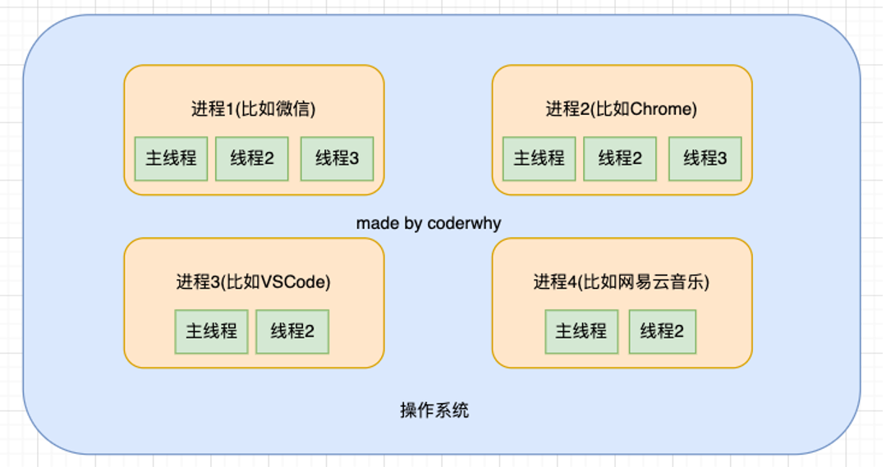
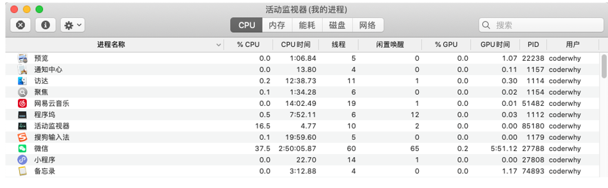
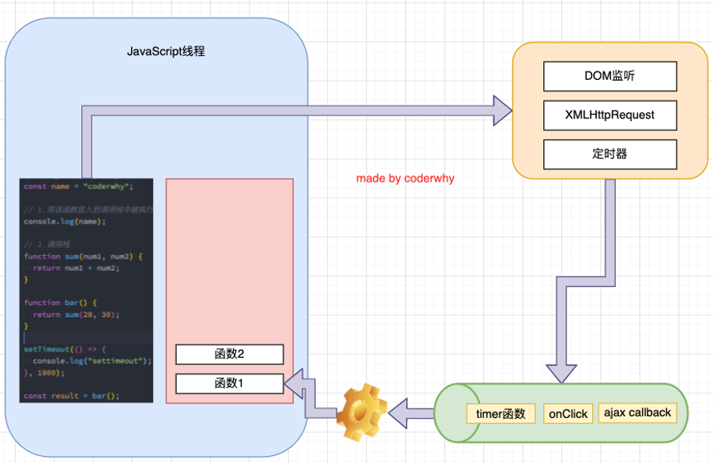
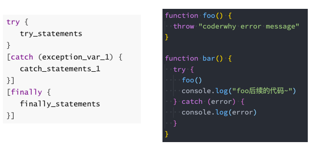

# 一. async、await

---

## 1. 异步函数 async function

- `async` 关键字**用于声明一个异步函数**：

  - `async` 是 `asynchronous` 单词的缩写，异步、非同步
  - `sync` 是 `synchronous`单词的缩写，同步、同时

- `async` 异步函数可以有很多种写法：

  ```js
  // 普通函数
  function foo() {} // 函数声明
  const bar = function() {} // 函数表达式
  const baz = () => {} // 箭头函数
  
  // 生成器函数
  function* foo() {}
  
  // 异步函数
  async function foo() {}
  const foo = async function() {}
  const foo = async () => {}
  class Person {
    async run() {}
  }
  ```

## 2. 异步函数的返回值

- 异步函数的内部代码执行过程和普通的函数是一致的，默认情况下也是会被同步执行

  ```js
  async function foo() { 
    console.log('first')
  }
  foo() // first
  ```

- 异步函数有返回值时，和普通函数会有区别，**异步函数会返回一个 `Promise`**：

  - 情况一：异步函数也可以有返回值，但是异步函数的**返回的原始值和对象相当于被包裹到 `Promise.resolve()` 中**

    ```js
    async function foo() {
      return 'abc' // 等价于 => return Promise.reolve('abc')
    }
    
    console.log(foo()) // Promise {<fulfilled>: 'abc'}
    foo().then(res => {
      console.log('res: ', res) // res: abc
    }).catch(err => {
      console.log('err: ', err)
    })
    ```

  - 情况二：如果我们的**异步函数的返回值是 `Promise`，状态由该 `Promise` 决定**

    ```js
    async function foo() {
      return new Promise((resolve, reject) => {
        setTimeout(() => {
          resolve('111')
        }, 1000)
      })
    }
    
    foo().then(res => {
      console.log('res: ', res) // res: 111
    }).catch(err => {
      console.log('err: ', err)
    })
    ```

  - 情况三：如果我们的异步函数的**返回值是一个实现了 `thenable` 方法的对象，那么由该对象的 `then` 方法决定**

    ```js
    async function foo() {
      return {
        then: function(resolve, reject) {
          resolve('111')
        }
      }
    }
    
    foo().then(res => {
      console.log('res: ', res) // res: 111
    }).catch(err => {
      console.log('err: ', err)
    })
    ```

- 如果我们**在 `async` 中抛出了异常**，**那么程序它并不会像普通函数一样抛出错误**

- `js` 中抛出错误，如果没有对其捕获，则意味中错误信息一直会往上抛出，直至顶层依然没有处理的话，浏览器就会将错误信息打印在控制台，并且后续代码将不会执行

- **而是会作为 `Promise` 的 `reject` 来传递，但是异步函数后续的代码将不会执行**

  ```js
  // 什么情况下异步函数的结果是rejected
  // 如果异步函数中有抛出异常(产生了错误), 这个异常不会被立即浏览器处理
  // 进行如下处理: Promise.reject(error)
  async function foo() {
    throw new Error("async function error")
    console.log("---------3")
    // return new Promise((resolve, reject) => {
    //   reject("err rejected")
    // })
    return 123
  }
  
  // promise -> pending -> fulfilled/rejected
  foo().then(res => {
    console.log("res:", res)
  }).catch(err => {
    console.log("err:", err) // err: Error: async function error
    console.log("继续执行其他的逻辑代码") // 继续执行其他的逻辑代码
  })
  ```

## 3. await 关键字

- `async` 函数另外一个特殊之处就是可以在它内部使用 `await` 关键字，而普通函数中是不可以的

  - `es13` 支持了 `await` 也可以在顶层模块中使用

  ```js
  function foo() { await 123 }
  foo() 
  // Uncaught SyntaxError: await is only valid in async functions and the top level bodies of modules
  ```

- `await` 关键字有什么特点呢？

  - 通常使用 `await` 时后面会跟上一个表达式，通常这个表达式会返回一个 `Promise` 对象
  - **`await` 表达式会暂停当前异步函数的执行，等到 `Promise` 的状态变成 `fulfilled` 状态，之后继续执行异步函数**
  - **`await` 关键字后面的代码块会被同步执行，`await` 关键字前面的赋值和下面代码，是处在一个微任务中的**

- **如果 `await` 后面是一个普通的值，那么会直接返回这个值**

  ```js
  function request(url) {
    return new Promise((resolve, reject) => {
      setTimeout(() => {
        resolve(url)
      }, 1000)
    })
  }
  
  async function foo() {
    const res = await request('111')
    console.log(res)
  }
  
  foo() // 等待1s后打印：111
  ```

- **如果 `await` 后面是一个 `thenable` 的对象，那么会根据对象的 `then` 方法调用来决定后续的值**

  ```js
  function request(url) {
    return new Promise((resolve, reject) => {
      setTimeout(() => {
        resolve(url)
      }, 1000)
    })
  }
  
  async function foo() {
    const res = await {
      then: function(resolve, reject) {
        setTimeout(() => {
          resolve('100')
        }, 1000)
      }
    }
    console.log(res)
  }
  
  foo() // 等待1s后打印：100
  ```

- **如果 `await` 后面的表达式，返回的 `Promise` 是 `reject` 的状态，那么会将这个 `reject` 结果直接作为异步函数的 `Promise` 的 `reject` 值**

  ```js
  function request(url) {
    return new Promise((resolve, reject) => {
      setTimeout(() => {
        reject(url)
      }, 1000)
    })
  }
  
  async function foo() {
    const res = await request('err message')
    console.log(res) // 抛出异常后，异步函数后续代码不会执行，但是会将错误信息当作Promise的rejected的值传递出去
  }
  
  foo().catch(err => { // 所以这里需要接收
    console.log('err: ', err)  // 等待1s后打印：err: err message
  })
  ```

## 4. await 结合 async 函数使用

```js
function rerquest(url) {
  return new Promise((resolve) => {
    setTimeout(() => {
      resolve(url)
    }, 1000)
  })
}

async function test() {
  return "test"
}

async function bar() {
  return new Promise((resolve, reject) => {
    setTimeout(() => {
      // resolve("bar")
      reject('errMessage')
    }, 1000)
  })
}

async function demo() {
  return {
    then: function(resolve) {
      resolve("demo")
    }
  }
}

async function foo() {
  const res1 = await rerquest("later")
  console.log("res1:", res1) // res1: later

  const res2 = await test()
  console.log("res2:", res2) // res2: test

  const res3 = await bar().catch(err => { // 1. 上面bar异步函数返回的Promise的rejected,也可以在这里接收
    console.log('err: ', err) // err:  errMessage
    return err
  })
  console.log("res3:", res3) // res3: errMessage

  const res4 = await demo()
  console.log("res4:", res4) // res4: demo
}

foo().catch(err => { //  2. 上面bar异步函数返回的Promise的rejected,也可以在这里接收
  console.log('err: ', err) // err: errMessage
})
```


# 二. 浏览器进程、线程

---

## 1. 什么是进程和线程？

- 线程和进程是操作系统中的两个概念:
  - **进程（`process`）：计算机已经运行的程序**，是操作系统管理程序的一种方式
  - **线程（`thread`）：操作系统能够运行运算调度的最小单位**，通常情况下它被包含在进程中
- 听起来很抽象，这里还是给出我的解释:
  - **进程**：我们可以认为，**启动一个应用程序，就会默认启动至少一个进程**
  - **线程**：**每一个进程中，都会启动至少一个线程用来执行程序中的代码，这个线程被称之为主线程**
  - 所以我们也可以说 **进程是线程的容器**
- 再用一个形象的例子解释：
  - 操作系统类似于一个大工厂
  - 工厂中里有很多车间，这个车间就是进程
  - 每个车间可能有一个以上的工人在工厂，这个工人就是线程

## 2. 操作系统 - 进程 - 线程



## 3. 操作系统的工作方式

- 操作系统是如何做到同时让多个进程（边听歌、边写代码、边查阅资料）同时工作呢？
  - 这是因为 `CPU` 的运算速度非常快，它可以快速的在多个进程之间迅速的切换
  - 当我们**进程中的线程获取到时间片时，就可以快速执行我们编写的代码**
  - 对于用户来说是感受不到这种快速的切换的
- 你可以在 `Mac` 的活动监视器或者 `Windows` 的资源管理器中查看到很多进程：




# 三. 宏任务、微任务队列

---

## 1. 浏览器中的 js 线程

- 我们经常会说 `js` 是单线程的（可以开启`workers`），但是 `js` 的线程应该有自己的容器进程：浏览器或`Node`
- 浏览器是一个进程吗，它里面只有一个线程吗？
  - 目前多数的**浏览器其实都是多进程的**，当我们**打开一个 `tab` 页面时就会开启一个新的进程**，这是为了防止一个页面卡死而造成所有页面无法响应，整个浏览器需要强制退出
  - **每个进程中又有很多的线程，其中包括执行 `js` 代码的线程**
- **`js` 的代码执行是在一个单独的线程中执行的**：
  - 这就意味着 `js` 的代码，在同一个时刻只能做一件事
  - 如果这件事是非常耗时的，就意味着当前的线程就会被阻塞
- 所以真正耗时的操作，实际上并不是由 `js` 线程在执行的：
  - 浏览器的每个进程是多线程的，那么其他线程可以来完成这个耗时的操作
  - 比如网络请求、定时器、`DOM` 事件监听（如点击事件监听），我们只需要在特定的时候执行应该有的回调即可

## 2. 浏览器的事件循环

- **事件循环**：**负责执行代码、收集和处理事件以及执行队列中的子任务**

- 如果在执行 `js` 代码的过程中，有异步操作呢？
  - 中间我们插入了一个 `setTimeout` 的函数调用
  - 这个函数被放到入调用栈中，执行会立即结束，并不会阻塞后续代码的执行
  
  

- 也就是说执行 `js` 代码过程中遇到异步操作
- 比如 `setTimeout` 函数调用，这个 `setTimeout` 函数会被放到调用栈中立即执行
- 执行完 `setTimeout` 函数之后，后续代码的执行是不会阻塞的
- 因为真正负责计时的操作并不是由执行 `js` 代码的线程负责的
- 浏览器会交给当前页面所在进程中的其他线程负责，等到计时结束后，再将任务加入到事件队列中
- **等全局代码执行完之后，就会执行事件队列中的任务**
- **事件队列中的任务遵守先进先出，先加入的任务会被优先执行**

```js
setTimeout(() => {
  console.log('执行定时器任务')
}, 2000)

btn1.onclick = function() { 
  // 这个点击事件触发时间自代码运行起小于2s，所以比起setTimeout的回调函数，先加入到事件队列中，最终执行事件队列中的任务时，比setTimeout的回调函数先执行，如果触发时间自代码运行起大于2s，就相较setTimeout的回调函数后执行
  console.log('执行点击函数')
}

for (let i = 0; i < 10000; i++) {
  console.log('first')
}
console.log('全局代码')

// 执行顺序：
// 1. 10000 first
// 2. 全局代码
// 3. 执行点击函数
// 4. 执行定时器任务
```

## 3. 宏任务和微任务

- 但是事件循环中并非只维护着一个队列，事实上是有两个队列：
  - 宏任务队列（`macrotask queue`）：`ajax`、`setTimeout`、`setInterval`、`DOM` 事件监听、`UI Rendering` 等
  - 微任务队列（`microtask queue`）：`Promise` 的 `then`、`catch` 等类方法传入的回调函数、 `Mutation Observer API`、`queueMicrotask()` 等

- 那么事件循环对于两个队列的优先级是怎么样的呢？
  1. `main script` 中的代码优先执行（编写的顶层 `script` 代码）
  2. 在执行任何一个宏任务之前（不是队列，是一个宏任务），都会先查看微任务队列中是否有任务需要执行
     - 也就是 **宏任务执行之前，必须保证微任务队列是空的**
     - **如果不为空，那么就优先执行微任务队列中的任务（回调）**

  ```js
  setTimeout(() => {
    console.log('执行定时器任务')
  }, 1000)
  
  const p = new Promise((resolve, reject) => {
    console.log('111')
    resolve(1)
  })
  p.then(res => {
    console.log('执行微任务')
  })
  
  for (let i = 0; i < 1000; i++) {
    console.log('first')
  }
  
  console.log('全局代码')
  // 111
  // 1000 first
  // 全局代码
  // 执行微任务
  // 执行定时器任务
  ```

  > **注意：**
  >
  > - **`new` 一个 `Promise` 对象时，传入的 `executor` 回调函数是被 立即同步执行 的**
  >
  >   
  >
  > - **`promise` 的 `then`、`catch` 等类方法传入的回调函数，只有在被 `resolve` 或 `reject` 调用的时候，才会被加入到微任务队列中**
  >
  >   
  >
  > - **如果异步函数中 `await` 后面的表达式返回的是一个 `reject` 状态的 `promise` 或报错，此时异步函数后续的代码将不会执行，将 `reject` 的结果作为异步函数返回的 `promise` 的 `reject` 的值**
  >
  >   
  >
  > - **`await` 后面的表达式返回的如果是一个 `promise` 的话，`await` 下面的代码包括 `await` 前面的赋值，都会属于该 `promise` 执行 `resolve` 产生的微任务中的**
  >
  >   
  >
  > - **为啥 `await` 下面的代码包括 `await` 前面的赋值会属于 `resolve` 产生的微任务中呢？**
  >
  >   - **根据 `generator` 结合 `promise` 的写法，可知，是处于 `then` 方法的回调中的**
  >   - **每个执行上下文都关联一个变量对象。在代码中声明的变量和函数被添加为变量对象`VO`的属性**
  >
  >   ```js
  >   // 生成器函数 + 生成器
  >   function* getData() {
  >     const res1 = yield request('111')
  >     console.log('res1: ', res1)
  >     const res2 = yield request('222')
  >     console.log('res2: ', res2)
  >     const res3 = yield request('333')
  >     console.log('res3: ', res3)
  >   }
  >     
  >   const generator = getData()
  >   // console.log(generator.next().value) // Promise {<pending>}
  >   generator.next().value.then(res1 => {
  >     generator.next(res1).value.then(res2 => {
  >       generator.next(res2).value.then(res3 => {
  >         generator.next(res3)
  >       })
  >     })
  >   })
  >     
  >   // async + await
  >   async function getData() {
  >     const res1 = await request('111')
  >     const res2 = await request('222')
  >     const res3 = await request('333')
  >   }
  >   ```


# 四. Promise 面试题解析

---

```js
setTimeout(function() {
  console.log('setTimeout1')
  new Promise(function(resolve) {
    resolve()
  }).then(function() {
    new Promise(function(resolve) {
      resolve()
    }).then(function() {
      console.log('then4')
    })
    console.log('then2')
  })
})

new Promise(function(resolve) {
  console.log('promise1')
  resolve()
}).then(function() {
  console.log('then1')
})

setTimeout(function() {
  console.log('setTimeout2')
})

console.log(2)
queueMicrotask(() => {
  console.log('queueMicrotask1')
})

new Promise(function(resolve) {
  resolve()
}).then(function() {
  console.log('then3')
})

// promise1
// 2
// then1
// queueMicrotask1
// then3
// setTimeout1
// then2
// then4
// setTimeout2 
```

```js
async function async1() {
  console.log('async1 start')
  await async2() // 2. 所以这里相当于await Promise.resolve(undefined)
  console.log('async1 end') // 3. 所以await下面的代码以及前面的赋值都会放到一个微任务中
}

async function async2() {
  console.log('async2') // 1.异步函数的返回值相当于被包裹到`Promise.resolve`中
}

console.log('script start')

setTimeout(function() {
  console.log('setTimeout')
}, 0)

async1()

new Promise(function(resolve) {
  console.log('promise1')
  resolve()
}).then(function() {
  console.log('promise2')
})

console.log('script end')

// script start
// async1 start
// async2
// promise1
// script end
// async1 end
// promise2
// setTimeout
```


# 五. throw、try...catch

---

## 1. 错误处理方案

- 开发中我们会封装一些工具函数，封装之后给别人使用：

  - 在其他人使用的过程中，可能会传递一些参数
  - 对于函数来说，需要对这些参数进行验证，否则可能得到的是我们不想要的结果

- 很多时候我们可能验证到不是希望得到的参数时，就会直接 `return`：

  - 但是 `return` 存在很大的弊端：调用者不知道是因为函数内部没有正常执行，还是执行结果就是一个 `undefined`
  - 事实上，正确的做法应该是如果没有通过某些验证，那么应该让外界知道函数内部报错了

- 如何可以让一个函数告知外界自己内部出现了错误呢？

  - 通过 `throw` 关键字，抛出一个异常

- `throw` 语句：

  - **`throw` 语句用于抛出一个用户自定义的异常**
  - **当遇到 `throw` 语句时，当前的函数执行会被停止（`throw` 后面的语句不会执行）**

- 如果我们执行代码，就会报错，拿到错误信息的时候我们可以及时的去修正代码

  ```js
  function sum(num1, num2) {
    if (typeof num1 !== "number") {
      // return
      throw "type error: num1传入的类型有问题, 必须是number类型"
    }
    if (typeof num2 !== "number") throw "type error: num2传入的类型有问题, 必须是number类型"
    return num1 + num2
  }
  
  const result = sum('123', '321') // Uncaught type error: num1传入的类型有问题, 必须是number类型
  console.log('1111') // 不会执行
  ```

## 2. throw 关键字

- `throw` 表达式就是在 `throw` 后面可以跟上一个表达式来表示具体的异常信息：

  ```js
  throw expression
  ```

- `throw` 关键字可以跟上哪些类型呢？

  - 基本数据类型：比如 `number`、`string`、`Boolean`
  - 对象类型：对象类型可以包含更多的信息

- 但是每次写这么长的对象又有点麻烦，所以我们可以创建一个类：

  ```js
  class laterError {
    constructor(message, code) {
      this.errMessage = message
      this.errCode = code
    }
  }
  
  function foo() {
    console.log("foo start")
    // throw 1 // Uncaught 1
    // throw false // Uncaught false
    // throw '一个错误' // Uncaught 一个错误
    // throw {
    //   errMessage: '一个异常',
    //   errCode: '-1001'
    // } // Uncaught {errMessage: '一个异常', errCode: '-1001'}
    throw new laterError("我是错误信息", -1001)
    console.log("foo end")  // 不会执行
  }
  
  foo() // Uncaught laterError {errMessage: '我是错误信息', errCode: -1001}
  ```

## 3. Error 类型

- 事实上，`js` 已经给我们提供了一个 `Error` 类，我们可以直接创建这个类的对象：

  ```js
  function foo() {
    // Error类: 错误函数的调用栈以及位置信息
    throw new Error("我是错误信息")
  }
  ```

- `Error` 包含三个属性：

  - `messsage`：创建 `Error` 对象时传入的 `message`
  - `name`：`Error` 的名称，通常和类的名称一致
  - `stack`：整个 `Error` 的错误信息，包括函数的调用栈，当我们直接打印 `Error` 对象时，打印的就是 `stack`

  ```js
  function foo() {
    // Error类: 错误函数的调用栈以及位置信息
    throw new Error("我是错误信息")
  }
  
  function bar() {
    try {
      foo()
    } catch(err) {
      console.log(err.name)
      console.log(err.message)
      console.log(err.stack)
    }
  }
  bar() 
  // Error
  // 我是错误信息
  /*
    Error: 我是错误信息
      at foo (test2.html:20:13)
      at bar (test2.html:25:9)
      at test2.html:33:5
  */
  ```

- `Error` 有一些自己的子类：

  - **`RangeError`：下标值越界时使用的错误类型**
  - **`SyntaxError`：解析语法错误时使用的错误类型**
  - **`TypeError`：出现类型错误时，使用的错误类型**

  ```js
  function foo() {
    throw new RangeError('下标值出现越界') // Uncaught RangeError: 下标值出现越界
    throw new SyntaxError('语法存在问题') // Uncaught SyntaxError: 语法存在问题
    throw new TypeError('类型使用不正确') // Uncaught TypeError: 类型使用不正确
  }
  
  foo() 
  ```

## 4. 异常的处理

- 我们会发现在之前的代码中，一个函数抛出了异常，调用它的时候程序会被强制终止：

  - 这是因为如果我们在调用一个函数时，这个函数抛出了异常，但是我们并没有对这个异常进行处理，那么这个异常会继续传递到上一个函数调用中
  - 而如果到了最顶层（全局）的代码中依然没有对这个异常的处理代码，这个时候就会报错并且终止程序的运行

- 我们先来看一下这段代码的异常传递过程：

  - `foo` 函数在被执行时会抛出异常，也就是我们的 `bar` 函数会拿到这个异常
  - 但是 `bar` 函数并没有对这个异常进行处理，那么这个异常就会被继续传递到调用 `bar` 函数的函数，也就是 `test` 函数
  - 但是 `test` 函数依然没有处理，就会继续传递到我们的全局代码逻辑中
  - 依然没有被处理，这个时候程序会终止执行，后续代码都不会再执行了

  ```js
  function foo() {
    throw 'error message'
  }
  
  function bar() { foo() }
  function test() { bar() }
  
  test() // Uncaught error message
  console.log('test后续代码~')
  ```

## 5. 异常的捕获

- 但是很多情况下当出现异常时，我们并不希望程序直接终止，而是希望可以正确的处理异常：

  - 这个时候我们就可以使用 `try...catch`

  

- 在 `ES10（ES2019）` 中，`catch` 后面绑定的 `error` 可以省略

- 当然，如果有一些必须要执行的代码，我们可以使用 `finally` 来执行

  - `finally` 表示最终一定会被执行的代码结构

>  **注意：**
>
> - **如果 `try` 和 `finally` 中都有返回值，那么会使用 `finally` 当中的返回值**


