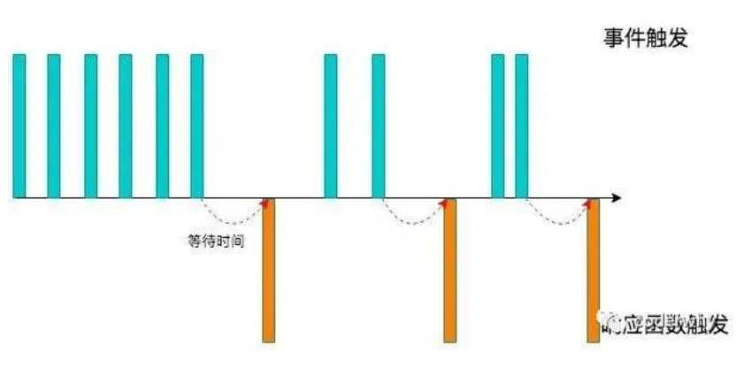
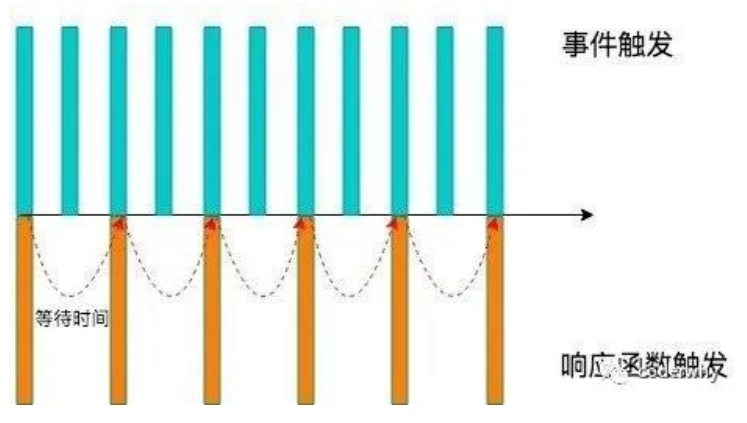
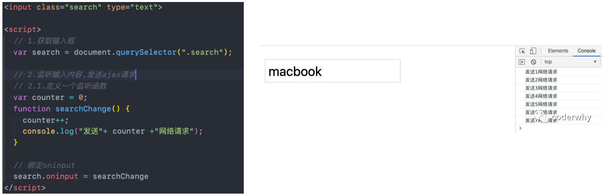

#  一. 认识防抖和节流

---

## 1. 认识防抖和节流函数

- 防抖和节流的概念其实最早并不是出现在软件工程中，防抖是出现在电子元件中，节流出现在流体流动中
  - 而 `js` 是事件驱动的，大量的操作会触发事件，加入到事件队列中处理
  - 而对于某些频繁的事件处理会造成性能的损耗，我们就可以通过防抖和节流来限制事件频繁的发生
- 防抖和节流函数目前已经是前端实际开发中两个非常重要的函数，也是面试经常被问到的面试
- 但是很多前端开发者面对这两个功能，有点摸不着头脑：
  - 某些开发者根本无法区分防抖和节流有什么区别（面试经常会被问到）
  - 某些开发者可以区分，但是不知道如何应用
  - 某些开发者会通过一些第三方库来使用，但是不知道内部原理，更不会编写
- 接下来我们会一起来学习防抖和节流函数：
  - 我们不仅仅要区分清楚防抖和节流两者的区别，也要明白在实际工作中哪些场景会用到
  - 并且我会带着大家一点点来编写一个自己的防抖和节流的函数，不仅理解原理，也学会自己来编写

## 2. 认识防抖 debounce 函数

- 我们用一副图来理解一下它的过程：

  - 当事件触发时，相应的函数并不会立即触发，而是会等待一定的时间
  - 当事件密集触发时，函数的触发会被频繁的推迟
  - 只有等待了一段时间也没有事件触发，才会真正的执行响应函数

  

- 防抖的应用场景很多：

  - 输入框中频繁的输入内容，搜索或者提交信息
  - 频繁的点击按钮，触发某个事件
  - 监听浏览器滚动事件，完成某些特定操作
  - 用户缩放浏览器的 `resize` 事件

## 3. 防抖函数的案例

- 我们都遇到过这样的场景，在某个搜索框中输入自己想要搜索的内容： 

- 比如想要搜索一个 `MacBook`： 

  - 当我输入 `m` 时，为了更好的用户体验，通常会出现对应的联想内容，这些联想内容通常是保存在服务器的，所以需要一次网络请求
  - 当继续输入 `ma` 时，再次发送网络请求
  - 那么 `macbook` 一共需要发送7次网络请求
  - 这大大损耗我们整个系统的性能，无论是前端的事件处理，还是对于服务器的压力

  

- 但是我们需要这么多次的网络请求吗？

  - 不需要，正确的做法应该是在合适的情况下再发送网络请求
  - 比如如果用户快速的输入一个 `macbook`，那么只是发送一次网络请求
  - 比如如果用户是输入一个 `m` 想了一会儿，这个时候 `m` 确实应该发送一次网络请求
  - 也就是我们应该监听用户在某个时间，比如 `500ms` 内，没有再次触发时间时，再发送网络请求

- 这就是**防抖**的操作：**在指定的时间内，没有再次触发时，才去执行对应的操作**

## 4. 认识节流 throttle 函数

- 我们用一副图来理解一下节流的过程

  - 当事件触发时，会执行这个事件的响应函数
  - 如果这个事件会被频繁触发，那么节流函数会按照一定的频率来执行函数
  - 不管在这个中间有多少次触发这个事件，执行函数的频繁总是固定的

- **节流**：**在频繁触发的时候，只会按照固定的时间间隔去执行对应的操作**

  

- 节流的应用场景：

  - 监听页面的滚动事件
  - 鼠标移动事件
  - 用户频繁点击按钮操作
  - 游戏中的一些设计

## 5. 节流函数的应用场景

- 很多人都玩过类似于飞机大战的游戏

- 在飞机大战的游戏中，我们按下空格会发射一个子弹：

  - 很多飞机大战的游戏中会有这样的设定，即使按下的频率非常快，子弹也会保持一定的频率来发射
  - 比如1秒钟只能发射一次，即使用户在这1秒钟按下了10次，子弹会保持发射一颗的频率来发射
  - 但是事件是触发了10次的，响应的函数只触发了一次

  

## 6. 生活中的例子：防抖和节流

- **生活中防抖的例子：**
  - 比如说有一天我上完课，我说大家有什么问题来问我，我会等待五分钟的时间
  - 如果在五分钟的时间内，没有同学问我问题，那么我就下课了
  - 在此期间，a同学过来问问题，并且帮他解答，解答完后，我会再次等待五分钟的时间看有没有其他同学问问题
  - 如果我等待超过了5分钟，就点击了下课（才真正执行这个时间）
- **生活中节流的例子：**
  - 比如说有一天我上完课，我说大家有什么问题来问我，但是在一个5分钟之内，不管有多少同学来问问题，我只会解答一个问题
  - 如果在解答完一个问题后，5分钟之后还没有同学问问题，那么就下课

## 7. 案例准备

- 我们通过一个搜索框来延迟防抖函数的实现过程：
  - 监听 `input` 的输入，通过打印模拟网络请求
- 测试发现快速输入一个 `macbook` 共发送了7次请求，显示我们需要对它进行防抖操作：




# 二. underscore 库的使用

---

## 1. underscore 库的介绍

- 事实上我们可以通过一些第三方库来实现防抖操作：

  - `lodash`、`underscore`

- 这里使用 `underscore`

  - 我们可以理解成 `lodash` 是 `underscore` 的升级版，它更重量级，功能也更多
  - 但是目前看 `underscore` 还在维护，`lodash` 已经很久没有更新了

- `Underscore` 的官网：https://underscorejs.org/

- `Underscore` 的安装有很多种方式：

  - 下载 `Underscore`，本地引入
  - 通过 `CDN` 直接引入
  - 通过包管理工具（`npm`）管理安装

- 这里我们直接通过 `CDN`：

  ```html
  <script src="https://cdn.jsdelivr.net/npm/underscore@1.13.1/underscore-umd-min.js"></script>
  ```

## 2. underscore 实现防抖和节流

```html
<input type="text">

<script src="https://cdn.jsdelivr.net/npm/underscore@1.13.1/underscore-umd-min.js"></script>
<script>
  const inputEl = document.querySelector('input')
  const inputChange = function() {
    console.log('value: ', this.value)
  }
  // 实现防抖
  inputEl.oninput = _.debounce(inputChange, 1000) 
  // 实现节流
  inputEl.oninput = _.throttle(inputChange, 1000) 
</script>
```


# 三. 防抖函数实现及优化

---

## 1. 基本实现

```js
function laterDebounce(fn, delay) {
  // 1.用于记录上一次事件触发的timer
  let timer = null
  // 2.触发事件时执行的函数
  const _debounce = function() {
    // 2.1.如果有再次触发(更多次触发)事件, 那么取消上一次的事件
    if (timer) clearTimeout(timer)
    // 2.2.延迟去执行对应的fn函数(传入的回调函数)
    timer = setTimeout(function() {
      fn()
      timer = null // 执行过函数之后, 将timer重新置null
    }, delay)
  }
  // 返回一个新的函数
  return _debounce
}

const inputEl = document.querySelector('input')
const inputChange = function() {
  console.log('发送请求' + +new Date())
}
// 实现防抖
inputEl.oninput = laterDebounce(inputChange, 1000)  
```

## 2. this 和参数实现绑定

```js
function laterDebounce(fn, delay) {
  // 1.用于记录上一次事件触发的timer
  let timer = null
  // 2.触发事件时执行的函数
  const _debounce = function(...args) { // 接受多个参数
    // 2.1.如果有再次触发(更多次触发)事件, 那么取消上一次的事件
    if (timer) clearTimeout(timer)
    // 2.2.延迟去执行对应的fn函数(传入的回调函数)
    timer = setTimeout(() => { // 使用箭头函数绑定上层this
      fn.apply(this, args)
      timer = null // 执行过函数之后, 将timer重新置null
    }, delay)
  }
  // 返回一个新的函数
  return _debounce
}

const inputEl = document.querySelector('input')
const inputChange = function(event) {
  console.log('value: ' + this.value, event)
}
// 实现防抖
inputEl.oninput = laterDebounce(inputChange, 1000)  
```

## 3. 取消功能实现

```js
function laterDebounce(fn, delay) {
  // 1.用于记录上一次事件触发的timer
  let timer = null
  // 2.触发事件时执行的函数
  const _debounce = function(...args) { // 接受多个参数
    // 2.1.如果有再次触发(更多次触发)事件, 那么取消上一次的事件
    if (timer) clearTimeout(timer)
    // 2.2.延迟去执行对应的fn函数(传入的回调函数)
    timer = setTimeout(() => { // 使用箭头函数绑定上层this
      fn.apply(this, args)
      timer = null // 执行过函数之后, 将timer重新置null
    }, delay)
  }

  // 3.给_debounce绑定一个取消的函数
  _debounce.cancel = function() {
    if (timer) clearTimeout(timer)
  }
  // 返回一个新的函数
  return _debounce
}

const inputEl = document.querySelector('input')
const cancelEl = document.querySelector('button')
const inputChange = function(event) {
  console.log('value: ' + this.value, event)
}
const debounce = laterDebounce(inputChange, 1000)
inputEl.oninput = debounce
cancelEl.onclick = function() {
  debounce.cancel()
}
```

## 4. 立即执行功能实现

```js
// immediate 用户每间次输入执行开始的第一次立即执行，连续快速输入还是保持延后执行
function laterDebounce(fn, delay, immediate = false) {
  // 1.用于记录上一次事件触发的timer
  let timer = null
  // 记录是否是每次输入执行开始的第一次输入，默认第一次为true
  let isStartInput = true
  // 2.触发事件时执行的函数
  const _debounce = function(...args) { // 接受多个参数
    // 2.1.如果有再次触发(更多次触发)事件, 那么取消上一次的事件
    if (timer) clearTimeout(timer)
    if (immediate && isStartInput) {
      fn.apply(this, args)
      isStartInput = false
      return
    }
    // 2.2.延迟去执行对应的fn函数(传入的回调函数)
    timer = setTimeout(() => { // 使用箭头函数绑定上层this
      fn.apply(this, args)
      timer = null // 执行过函数之后, 将timer重新置null
      isStartInput = true
    }, delay)
  }

  // 3.给_debounce绑定一个取消的函数
  _debounce.cancel = function() {
    if (timer) clearTimeout(timer)
  }
  // 返回一个新的函数
  return _debounce
}

const inputEl = document.querySelector('input')
const cancelEl = document.querySelector('button')
const inputChange = function(event) {
  console.log('value: ' + this.value, event)
}
const debounce = laterDebounce(inputChange, 1000, true)
// 实现防抖
inputEl.oninput = debounce
cancelEl.onclick = function() {
  debounce.cancel()
}
```

## 5. 获取返回值功能实现

```js
// 原则: 一个函数进行做一件事情, 一个变量也用于记录一种状态
function hydebounce(fn, delay, immediate = false, resultCallback) {
  // 1.用于记录上一次事件触发的timer
  let timer = null
  let isInvoke = false

  // 2.触发事件时执行的函数
  const _debounce = function(...args) {
    return new Promise((resolve, reject) => {
      try {
        // 2.1.如果有再次触发(更多次触发)事件, 那么取消上一次的事件
        if (timer) clearTimeout(timer)
        // 第一次操作是不需要延迟
        let res = undefined
        if (immediate && !isInvoke) {
          res = fn.apply(this, args)
          if (resultCallback) resultCallback(res)
          resolve(res)
          isInvoke = true
          return
        }
        // 2.2.延迟去执行对应的fn函数(传入的回调函数)
        timer = setTimeout(() => {
          res = fn.apply(this, args)
          if (resultCallback) resultCallback(res)
          resolve(res)
          timer = null // 执行过函数之后, 将timer重新置null
          isInvoke = false
        }, delay);
      } catch (error) {
        reject(error)
      }
    })
  }

  // 3.给_debounce绑定一个取消的函数
  _debounce.cancel = function() {
    if (timer) clearTimeout(timer)
    timer = null
    isInvoke = false
  }

  // 返回一个新的函数
  return _debounce
}

const inputEl = document.querySelector("input")
const cancelBtn = document.querySelector(".cancel")
// 2.手动绑定函数和执行
const myDebounceFn = hydebounce(function(name, age, height) {
  console.log("----------", name, age, height)
  return "coderwhy 哈哈哈哈"
}, 1000, false)
myDebounceFn("why", 18, 1.88).then(res => {
  console.log("拿到执行结果:", res)
})
```


# 四. 节流函数实现及优化

---

## 1. 基本实现

```js
function hythrottle(fn, interval) {
  let startTime = 0
  const _throttle = function() {
    const nowTime = new Date().getTime()
    const waitTime = interval - (nowTime - startTime)
    if (waitTime <= 0) {
      fn()
      startTime = nowTime
    }
  }
  return _throttle
}

const inputEl = document.querySelector("input")
let counter = 1
inputEl.oninput = hythrottle(function() {
  console.log(`发送网络请求${counter++}:`, this.value)
}, 1000)

// ------------------自己版本---------------------------
function laterThrottle(fn, interval) {
  let startTime = 0
  const _throttle = function() {
    const nowTime = +new Date()
    const intervalTime = nowTime - startTime
    if (intervalTime > interval) {
      fn()
      startTime = nowTime
    }
  }
  return _throttle
}

const inputEl = document.querySelector('input')
const inputChange = function() {
  console.log('发送请求' + +new Date())
}
inputEl.oninput = laterThrottle(inputChange, 1000)
```

## 2. this 和参数绑定实现

```js
function hythrottle(fn, interval) {
  let startTime = 0
  const _throttle = function(...args) {
    const nowTime = new Date().getTime()
    const waitTime = interval - (nowTime - startTime)
    if (waitTime <= 0) {
      fn.apply(this, args)
      startTime = nowTime
    }
  }
  return _throttle
}

const inputEl = document.querySelector("input")
let counter = 1
inputEl.oninput = hythrottle(function(event) {
  console.log(`发送网络请求${counter++}:`, this.value, event)
}, 1000)
// ------------------自己版本---------------------------
function laterThrottle(fn, interval) {
  let startTime = 0
  const _throttle = function(...args) {
    const nowTime = +new Date()
    const intervalTime = nowTime - startTime
    if (intervalTime > interval) {
      fn.apply(this, args)
      startTime = nowTime
    }
  }
  return _throttle
}

const inputEl = document.querySelector('input')
const inputChange = function(event) {
  console.log('value: ' + this.value, event)
}
inputEl.oninput = laterThrottle(inputChange, 1000)
```

## 3. 立即执行控制实现

```js
function hythrottle(fn, interval, leading = true) {
  let startTime = 0
  const _throttle = function(...args) {
    // 1.获取当前时间
    const nowTime = new Date().getTime()
    // 对立即执行进行控制
    if (!leading && startTime === 0) {
      startTime = nowTime
    }
    // 2.计算需要等待的时间执行函数
    const waitTime = interval - (nowTime - startTime)
    if (waitTime <= 0) {
      fn.apply(this, args)
      startTime = nowTime
    }
  }
  return _throttle
}

const inputEl = document.querySelector("input")
let counter = 1
inputEl.oninput = hythrottle(function(event) {
  console.log(`发送网络请求${counter++}:`, this.value, event)
}, 1000, false)
// ------------------自己版本---------------------------
// leading 首次输入立即执行默认为true
function laterThrottle(fn, interval, leading = true) {
  let startTime = 0
  const _throttle = function(...args) {
    const nowTime = +new Date()
    if (!leading) {
      leading = true // 除了第一次之后，恢复立即执行
      startTime = nowTime
    }
    const intervalTime = nowTime - startTime
    if (intervalTime > interval) {
      fn.apply(this, args)
      startTime = nowTime
    }
  }
  return _throttle
}
const inputEl = document.querySelector('input')
const inputChange = function(event) {
  console.log('value: ' + this.value, event)
}
inputEl.oninput = laterThrottle(inputChange, 1000, false)
```

## 4. 尾部执行控制

```js
function hythrottle(fn, interval, { leading = true, trailing = false } = {}) {
  let startTime = 0
  let timer = null
  const _throttle = function(...args) {
    // 1.获取当前时间
    const nowTime = new Date().getTime()
    // 对立即执行进行控制
    if (!leading && startTime === 0) {
      startTime = nowTime
    }
    // 2.计算需要等待的时间执行函数
    const waitTime = interval - (nowTime - startTime)
    if (waitTime <= 0) {
      // console.log("执行操作fn")
      if (timer) clearTimeout(timer)
      fn.apply(this, args)
      startTime = nowTime
      timer = null
      return
    } 
    // 3.判断是否需要执行尾部
    if (trailing && !timer) {
      timer = setTimeout(() => {
        // console.log("执行timer")
        fn.apply(this, args)
        startTime = new Date().getTime()
        timer = null
      }, waitTime);
    }
  }
  return _throttle
}

const inputEl = document.querySelector("input")
let counter = 1
inputEl.oninput = hythrottle(function(event) {
  console.log(`发送网络请求${counter++}:`, this.value, event)
}, 3000, { trailing: true })
// ------------------自己版本---------------------------
// leading 首次输入立即执行默认为true
// trailing 最后一次输入是否执行，默认false
function laterThrottle(fn, interval, { leading = true, trailing = false } = {}) {
  let startTime = 0
  let timer = null
  const _throttle = function(...args) {
    if (timer) clearTimeout(timer)
    const nowTime = +new Date()
    if (!leading) {
      leading = true
      startTime = nowTime
    }
    const intervalTime = nowTime - startTime
    if (intervalTime > interval) {
      fn.apply(this, args)
      startTime = nowTime
    } else {
      if (trailing) {
        timer = setTimeout(() => {
          fn.apply(this, args)
          startTime = nowTime
        }, intervalTime)
      }
    }
  }
  return _throttle
}

const inputEl = document.querySelector('input')
const inputChange = function(event) {
  console.log('value: ' + this.value, event)
}
inputEl.oninput = laterThrottle(inputChange, 1000, { trailing: true })
```

## 5. 取消功能实现

```js
function hythrottle(fn, interval, { leading = true, trailing = false } = {}) {
  let startTime = 0
  let timer = null
  const _throttle = function(...args) {
    // 1.获取当前时间
    const nowTime = new Date().getTime()
    // 对立即执行进行控制
    if (!leading && startTime === 0) {
      startTime = nowTime
    }
    // 2.计算需要等待的时间执行函数
    const waitTime = interval - (nowTime - startTime)
    if (waitTime <= 0) {
      // console.log("执行操作fn")
      if (timer) clearTimeout(timer)
      fn.apply(this, args)
      startTime = nowTime
      timer = null
      return
    } 
    // 3.判断是否需要执行尾部
    if (trailing && !timer) {
      timer = setTimeout(() => {
        // console.log("执行timer")
        fn.apply(this, args)
        startTime = new Date().getTime()
        timer = null
      }, waitTime);
    }
  }
  _throttle.cancel = function() {
    if (timer) clearTimeout(timer)
    startTime = 0
    timer = null
  }
  return _throttle
}

const inputEl = document.querySelector("input")
const cancelBtn = document.querySelector(".cancel")
let counter = 1
const throttleFn = hythrottle(function(event) {
  console.log(`发送网络请求${counter++}:`, this.value, event)
}, 3000, { trailing: true })
inputEl.oninput = throttleFn
cancelBtn.onclick = function() {
  throttleFn.cancel()
}
```

## 6. 获取返回值实现

```js
function hythrottle(fn, interval, { leading = true, trailing = false } = {}) {
  let startTime = 0
  let timer = null
  const _throttle = function(...args) {
    return new Promise((resolve, reject) => {
      try {
        // 1.获取当前时间
        const nowTime = new Date().getTime()
        // 对立即执行进行控制
        if (!leading && startTime === 0) {
          startTime = nowTime
        }
        // 2.计算需要等待的时间执行函数
        const waitTime = interval - (nowTime - startTime)
        if (waitTime <= 0) {
          // console.log("执行操作fn")
          if (timer) clearTimeout(timer)
          const res = fn.apply(this, args)
          resolve(res)
          startTime = nowTime
          timer = null
          return
        } 
        // 3.判断是否需要执行尾部
        if (trailing && !timer) {
          timer = setTimeout(() => {
            // console.log("执行timer")
            const res = fn.apply(this, args)
            resolve(res)
            startTime = new Date().getTime()
            timer = null
          }, waitTime);
        }
      } catch (error) {
        reject(error)
      }
    })
  }
  _throttle.cancel = function() {
    if (timer) clearTimeout(timer)
    startTime = 0
    timer = null
  }
  return _throttle
}

const inputEl = document.querySelector("input")
const cancelBtn = document.querySelector(".cancel")
let counter = 1
const throttleFn = hythrottle(function(event) {
  console.log(`发送网络请求${counter++}:`, this.value, event)
  return "throttle return value"
}, 3000, { trailing: true })
throttleFn("aaaa").then(res => {
  console.log("res:", res)
})
```


# 五. 深拷贝函数的实现

---

- 前面我们已经学习了对象相互赋值的一些关系，分别包括：
  - 引入的赋值：指向同一个对象，相互之间会影响
  - 对象的浅拷贝：只是浅层的拷贝，内部引入对象时，依然会相互影响
  - 对象的深拷贝：两个对象不再有任何关系，不会相互影响
- 前面我们已经可以通过一种方法来实现深拷贝了：`JSON.parse(JSON.stringify)`
  - 这种深拷贝的方式其实对于 `undefined`、函数、`Symbol` 等是无法处理
  - 并且如果存在对象的循环引用，也会报错的
  - https://developer.mozilla.org/zh-CN/docs/Web/JavaScript/Reference/Global_Objects/JSON/stringify#%E6%8F%8F%E8%BF%B0
- 自定义深拷贝函数：
  - 自定义深拷贝的基本功能
  - 对 `Symbol` 的 `key` 进行处理
  - 其他数据类型的值进行处理：数组、函数、`Symbol`、`Set`、`Map`
  - 对循环引用的处理

## 1. 基本实现

- **函数递归调用 + 判断是否是对象类型（`null` 特殊处理），值是数组创建 `[]`，是对象创建 `{}`**

```js
const info = {
  name: "later",
  age: 18,
  friend: [1, 2, 3],
  obj: {
    name: 'obj'
  }
}

function isObject(value) {
  // typeof function => function
  // ... undefined => undefined
  // ... null => object
  // ... [] => object
  // ... {} => object
  // ... new Map() => object
  // ... new WeakMap() => object
  // ... new Set() => object
  // ... 'abc' => string
  // ... 123 => number
  // ... false => boolean
  // ... Symbol() => symbol
  // ... 9007199254740992n => bigint
  // 排除null，且类型须是object或function类型
  const type = typeof value
  return (value != null) && (type == 'object' || type == 'function')
}

// 深拷贝函数
function deepCopy(originValue) {
  // 1.如果是原始类型, 直接返回
  if (!isObject(originValue)) {
    return originValue
  }
  // 2.如果是对象类型, 才需要创建对象
  const newObj = Array.isArray(originValue) ? [] : {} // 判断是否数组
  for (const key in originValue) {
    newObj[key] = deepCopy(originValue[key])
  }
  return newObj
}

const newObj = deepCopy(info)
console.log(
  newObj.obj == info.obj
) // false
```

## 2. 其他类型处理

```js
const info = {
  name: "later",
  age: 18,
  friend: [1, 2, 3],
  obj: {
    name: 'obj'
  },
  // 1.特殊类型: Set
  set: new Set(["abc", "cba", {name: 'aaa'}]),
  // 2.特性类型: function 
  running: function() {
    console.log("running~")
  },
  // 3.值的特殊类型: Symbol
  symbolKey: Symbol("abc"),
  // 4.key是symbol时
  [Symbol("s1")]: "aaaa",
  [Symbol("s2")]: "bbbb"
}

function isObject(value) {
  // typeof function => function
  // ... undefined => undefined
  // ... null => object
  // ... [] => object
  // ... {} => object
  // ... new Map() => object
  // ... new WeakMap() => object
  // ... new Set() => object
  // ... 'abc' => string
  // ... 123 => number
  // ... false => boolean
  // ... Symbol() => symbol
  // ... 9007199254740992n => bigint
  // 排除null，且类型须是object或function类型
  const type = typeof value
  return (value != null) && (type == 'object' || type == 'function')
}

function deepCopy(originValue) {
  // 如果值是Symbol的类型
  if (typeof originValue === "symbol") {
    return Symbol(originValue.description) // 拿到Symbol对象的描述字符串，根据该字符串创建一个新的Symbol对象
  }
  // 如果是原始类型, 直接返回
  if (!isObject(originValue)) {
    return originValue
  }
  // 如果是Set类型（Map处理方式一致）
  if (originValue instanceof Set) {
    // return new Set([...originValue]) // 这种浅拷贝写法还是有问题，如果Set内部还是存在非原始类型，就还是存在有指向同一个内存地址的问题，下面有验证实现
    // return new Set(deepCopy([...originValue])) // 这种ok, 也是比下面更简便的写法，用展开语法代替for...of
    const newSet = new Set()
    for (const item of originValue) { // Set使用for...in是遍历不出key的
      newSet.add(deepCopy(item)) // 防止item存在非原始类型
    }
    return newSet
  }
  // 如果是函数function类型, 不需要进行深拷贝，函数类型一般不需要生成新的，浪费内存，函数一般只是用来使用的
  if (typeof originValue === "function") {
    return originValue
  }
  // 如果是对象类型, 才需要创建对象
  const newObj = Array.isArray(originValue) ? [] : {} // 判断是否数组
  for (const key in originValue) {
    newObj[key] = deepCopy(originValue[key])
  }
  // 如果key是Symbol类型, 单独遍历symbol
  const symbolKeys = Object.getOwnPropertySymbols(originValue) // 返回一个给定对象自身的所有Symbol属性的数组
  for (const item of symbolKeys) {
    console.log('item: ', item)
    newObj[Symbol(item.description)] = deepCopy(originValue[item])
  }

  return newObj
}

const newObj = deepCopy(info)
console.log(
  newObj.obj == info.obj
) // false
// 验证
let obj1 = null
let obj2 = null
for (const item of newObj.set) {
  if (isObject(item)) obj1 = item
}
for (const item of info.set) {
  if (isObject(item)) obj2 = item
}
console.log(obj1 == obj2)
```

## 3. 解决循环引用

- 简单拓展一下这里为什么使用 `weakMap`:
  - `Map` 可以使用任意类型的 `key` 值，不限字符串，对象等
  - `WeakMap` 只能使用对象作为 `key` 值，`WeakMap` 的 `key` 对对象的引用是**弱引用**
  - 如果没有其他引用引用这个对象，那么 `GC` 可以回收该对象

```js
const info = {
  name: "later",
  age: 18,
  friend: [1, 2, 3],
  obj: {
    name: 'obj'
  },
  // 1.特殊类型: Set
  set: new Set(["abc", "cba", {name: 'aaa'}]),
  // 2.特性类型: function 
  running: function() {
    console.log("running~")
  },
  // 3.值的特殊类型: Symbol
  symbolKey: Symbol("abc"),
  // 4.key是symbol时
  [Symbol("s1")]: "aaaa",
  [Symbol("s2")]: "bbbb"
}

function isObject(value) {
  // typeof function => function
  // ... undefined => undefined
  // ... null => object
  // ... [] => object
  // ... {} => object
  // ... new Map() => object
  // ... new WeakMap() => object
  // ... new Set() => object
  // ... 'abc' => string
  // ... 123 => number
  // ... false => boolean
  // ... Symbol() => symbol
  // ... 9007199254740992n => bigint
  const type = typeof value
  return (value != null) && (type == 'object' || type == 'function') // 排除null，且类型须是object或function类型
}
// 深拷贝函数
function deepCopy(originValue, map = new WeakMap()) {
  // 如果值是Symbol的类型
  if (typeof originValue === "symbol") {
    return Symbol(originValue.description) // 拿到Symbol对象的描述字符串，根据该字符串创建一个新的Symbol对象
  }
  // 如果是原始类型, 直接返回
  if (!isObject(originValue)) {
    return originValue
  }
  // 如果是Set类型，Map处理方式一致
  if (originValue instanceof Set) {
    // return new Set([...originValue]) // 这种浅拷贝写法还是有问题，如果Set内部还是存在非原始类型，就还是存在有指向同一个内存地址的问题，下面有验证实现
    // return new Set(deepCopy([...originValue])) // 这种ok, 也是比下面更简便的写法，用展开语法代替for...of
    const newSet = new Set()
    for (const item of originValue) { // Set使用for...in是遍历不出key的
      newSet.add(deepCopy(item)) // 防止item存在非原始类型
    }
    return newSet
  }
  // 如果是函数function类型, 不需要进行深拷贝，函数类型一般不需要生成新的，浪费内存，函数一般只是用来调用的
  if (typeof originValue === "function") {
    return originValue
  }
  if (map.has(originValue)) {
    return map.get(originValue)
  }
  // 如果是对象类型, 才需要创建对象
  const newObj = Array.isArray(originValue) ? [] : {} // 判断是否数组
  map.set(originValue, newObj)
  for (const key in originValue) {
    newObj[key] = deepCopy(originValue[key], map)
  }
  // 如果key是Symbol类型, 单独遍历symbol
  const symbolKeys = Object.getOwnPropertySymbols(originValue) // 返回一个给定对象自身的所有 Symbol属性的数组
  for (const item of symbolKeys) {
    newObj[Symbol(item.description)] = deepCopy(originValue[item], map)
  }
  return newObj
}
info.self = info // 设置一个循环引用，如果不做处理会报栈溢出：Uncaught RangeError: Maximum call stack size exceeded，因为newObj[self] = deepCopy(originValue[self]) 会一直嵌套执行下去，最终超出调用栈的最大内存
const newObj = deepCopy(info)
console.log(newObj.self == newObj) // true
console.log(newObj.self.self == newObj) // true
```


# 六. 事件总线工具实现

---

- 自定义事件总线属于一种观察者模式，其中包括三个角色：
  - 发布者（`Publisher`）：发出事件（`Event`）
  - 订阅者（`Subscriber`）：订阅事件（`Event`），并且会进行响应（`Handler`）
  - 事件总线（`EventBus`）：无论是发布者还是订阅者都是通过事件总线作为中台的
- 当然我们可以选择一些第三方的库：
  - `Vue2` 默认是带有事件总线的功能
  - `Vue3` 中推荐一些第三方库，比如 `mitt`
- 当然我们也可以实现自己的事件总线：
  - 事件的监听方法 `on`
  - 事件的发射方法 `emit`
  - 事件的取消监听 `off`

```js
// 类EventBus -> 事件总线对象
class laterEventBus {
  constructor() {
    this.eventMap = {}
  }

  on(eventName, eventFn) {
    if (!this.eventMap[eventName]) {
      this.eventMap[eventName] = []
    }
    this.eventMap[eventName].push(eventFn)
  }

  off(eventName, eventFn) {
    let eventFns = this.eventMap[eventName]
    if (!eventFns || !eventFns.length) return
    for (let i = 0; i < eventFns.length; i++) {
      if (eventFns[i] === eventFn) {
        eventFns.splice(i, 1)
        break
      }
    }
    // 如果eventFns已经清空了
    if (eventFns.length === 0) {
      delete this.eventMap[eventName]
    }
  }

  emit(eventName, ...args) {
    let eventFns = this.eventMap[eventName]
    if (!eventFns || !eventFns.length) return
    eventFns.forEach(item => {
      item(...args)
    })
  }
}

// 使用过程
const eventBus = new laterEventBus()

// aside.vue组件中监听事件
eventBus.on("navclick", (name, age) => {
  console.log("navclick listener 01 ", name, age)
})
const clickFn = () => {
  console.log("navclick listener 02 ")
}
eventBus.on("navclick", clickFn)
setTimeout(() => {
  eventBus.off('navclick', clickFn)
}, 2000)

eventBus.on("asideclick", () => {
  console.log("asideclick listener")
})

const navBtnEl = document.querySelector(".nav-btn")
navBtnEl.onclick = function() {
  console.log("自己监听到")
  eventBus.emit("navclick", 'later', 18)
}
```


