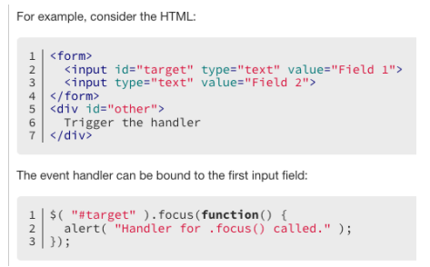

# 一. jQuery 事件处理

---

## 1. 认识事件（Event）

- `Web` 页面经常需要和用户之间进行交互，而交互的过程中我们可能想要捕捉这个交互的过程：

  - 比如用户点击了某个按钮、用户在输入框里面输入了某个文本、用户鼠标经过了某个位置
  - 浏览器需要搭建一条 `js` 代码和事件之间的桥梁
  - 当某个事件发生时，让 `js` 执行某个函数，所以我们需要针对事件编写处理程序（`handler`）

- 原生事件监听方法：

  - 事件监听方式一：在 `script` 中直接监听（很少使用）
  - 事件监听方式二：`DOM` 属性，通过元素的 `on` 来监听事件
  - 事件监听方式三：通过 `EventTarget` 中的 `addEventListener` 来监听

- **`jQuery` 事件监听方法**：

  - 事件监听方式一：直接调用 `jQuery` 对象中的事件处理函数来监听，例如：`click`，`mouseenter`....
  - 事件监听方式二：调用 `jQuery` 对象中的 `on` 函数来监听，使用 `off` 函数来取消监听
  - **使用程序 - 自动触发事件 `trigger`**
  
  ```js
  // 1.使用on来监听事件
  $('ul').on('click', function() {
    console.log('click1')
  })
  // 2.使用click来监听事件
  $('ul').click(function() {
    console.log('click2')
  })
  // 3.使用mouseenter来监听事件
  $('ul').mouseenter(function() {
    console.log('mouseenter')
  })
  // 取消监听事件
  $('.cancel').click(function() {
    // $('ul').off() // 取消ul元素上所有的事件
    // $('ul').off('mouseenter')
    $('ul').off('click')
  })
  // 使用程序-自动触发事件
  $('ul').trigger('click')  // 模拟用户点击了ul元素
  $('ul').trigger('mouseenter')
  ```

## 2. click 和 on 的区别

- `click` 是 `on` 的简写。它们重复监听，不会出现覆盖情况，都支持事件委托，底层用的是 `addEventListener `

- 如果 `on` 没有使用 `selector` 的话，那么和使用 `click` 是一样的

- **`on` 函数可以接受一个 `selector` 参数，用于筛选可触发事件的后代元素**

- **`on` 函数支持给事件添加命名空间**

  ```js
  // 1.使用on来监听事件 ( 支持给事件添加命名空间: liujun )
  $('ul').on('click.liujun', function() {
    console.log('click1')
  })
  // 2.使用click来监听事件
  $('ul').click(function() {
    console.log('click2')
  })
  // 取消监听事件
  $('.cancel').click(function() {
    $('ul').off('click.liujun')
  })
  /*
    1.on 监听的事件支持使用 命名空间
    2.on 函数支持一个 selector 的参数
  */
  $('ul').on('click', '字符串类型的选择器', function() { })
  // 仅仅监听li中元素的点击事件( 筛选出 可触发事件的 后代元素 )
  $('ul').on('click', 'li p' , function(event) {
    console.log(event.target)  // DOM Element : ul li  p
  })
  ```

## 3. click 和 on 中的 this 指向

- `this` 都是指向原生的 `DOM Element`

- 监听函数 `this` 指向 `document` 对象（因为有第二个参数是上下文，不传的话可能内部默认 `document`）

  ```js
  $('ul').click(function() {
    console.log("%O", this) // DOM Element -> UL 当前监听的dom元素对象
  }) 
  
  $('ul').on('click', function() {
    console.log(this) // DOM Element -> UL 当前监听的dom元素对象
  })
  
  $('ul li').click(function() {
    console.log(this) // DOM Element -> UL 当前监听的dom元素对象
  })
  
  // 底层实现的原理
  var lisEl = $('ul li').get() // [li, li, li]
  for(var liEL of lisEl ){
    liEL.addEventListener('click', function() {
      console.log(this)
    })
  }
  
  $('ul li').click(function() {
    console.log( $(this) ) // DOM Element 转成 jQuery 对象
  })
  
  $('ul li').click(() => {
    console.log(this)
  })
  ```

## 4. jQuery 的事件冒泡

- 我们会发现默认情况下事件是**从最内层向外依次传递的顺序**，这个顺序我们称之为**事件冒泡（Event Bubble）**

- 事实上，还有另外一种监听事件流的方式就是**从外层到内层（如`body => span`）**，这种称之为**事件捕获（Event Capture）**

- 为什么会产生两种不同的处理流呢？

  - 这是因为早期在浏览器开发时，不管是 `IE` 还是 `Netscape` 公司都发现了这个问题
  - 但是他们采用了完全相反的事件流来对事件进行了传递
  - `IE<9` 仅采用了事件冒泡的方式，`Netscape` 采用了事件捕获的方式
  - `IE9+` 和现在所有主流浏览器都已支持这两种方式

- **`jQuery` 为了更好的兼容 `IE` 浏览器，底层并没有实现事件捕获**，所以**只能使用原生的事件冒泡**

  ```js
  // 事件冒泡
  $('.content').on('click', function() {
    console.log('span')
  })
  $('.box').on('click', function() {
    console.log('div')
  })
  $('body').on('click', function() {
    console.log('body')
  })
  ```

## 5. jQuery 的事件对象（Event Object）

- `jQuery` 事件系统的规范是根据 `W3C` 的标准来制定 `jQuery` 事件对象。**原生事件对象的大多数属性都被复制到新的 `jQuery` 事件对象上**。如以下原生的事件属性被复制到 `jQuery` 事件对象中：

  - `altKey, clientX, clientY, currentTarget, data, detail, key, keyCode, offsetX, offsetY, originalTarget, pageX, pageY, relatedTarget, screenX, screenY, target, ......`

- `jQuery` 事件对象通用的属性（以下属性已实现跨浏览器的兼容）:

  - `target`、`relatedTarget`、`pageX`、`pageY`、`which`、`metaKey`

- `jQuery` 事件对象常用的方法：

  - `preventDefault() `：**取消事件的默认行为**（如：`a` 标签、表单事件等）
  - `stopPropagation() `：**阻止事件的进一步传递**（如：事件冒泡）

- 要访问其它事件的属性，**可以使用 `event.originalEvent` 获取原生的事件对象**

  ```js
  // 1.获取原生的事件对象
  var divEl = document.querySelector('.box')
  divEl.addEventListener('click', function(event) {
    console.log(event)
  })
  
  // 2.获取jQuery的事件对象
  $('.box').click(function($event) {
    console.log($event) // 是jQuery的事件对象
    console.log($event.originalEvent) // 拿到原生的事件对象
  })
  $('a').click(function($event) {
    $event.preventDefault()  // 阻止a元素的默认行为,跳转
    console.log('点击a元素')
  })
  $('.content').click(function($event) {
    $event.stopPropagation() // 阻止事件的进一步传递（冒泡或捕获都可以阻止）
    console.log('span')
  })
  ```

## 6. jQuery 的事件委托（event delegation）

- 事件冒泡在某种情况下可以帮助我们实现强大的事件处理模式 – 事件委托模式（也是一种设计模式）

- 那么这个模式是怎么样的呢？

  - 因为当子元素被点击时，父元素可以通过冒泡监听到子元素的点击
    - 并且可以通过 **`event.target` 获取到当前触发事件的元素**、**`event.currentTarget` 获取到的是当前处理事件的元素**

- 案例：一个 `ul` 中存放多个 `li`，使用事件委托的模式来监听 `li` 中子元素的点击事件

  ```js
  // 事件的委托
  $('ul').on('click', function(event) {
    console.log(event.target)  // DOM Element : ul li  p
  })
  // 仅仅监听li中元素的点击事件( 筛选出 可触发事件的 后代元素 )
  $('ul').on('click', 'li p' , function(event) {
    console.log(event.target)  // DOM Element : ul li  p
  })
  ```

## 7. jQuery 常见的事件

- 鼠标事件（`Mouse Events`） 

  - `.click()`、`.dblclick()`、`.hover()`、`.mousedown()`、`.mouseup()`
  - `.mouseenter()`、`.mouseleave()`、`.mousemove()`
  - `.mouseover()`、`.mouseout()`、`.contextmenu()`、`.toggle()`

- 键盘事件（`Keyboard Events`）

  - `.keydown()`、`.keypress()`、`.keyup()`

- 文档事件（`Document Loading Events`）

  - `load`、`ready()`、`.unload`

- 表单事件（`Form Events`）

  - `.blur()`、`.focus()`、`.change()`、`.submit()`、`.select()`

- 浏览器事件（`Browser Events`）

  - `.resize()`、`.scroll()`

  | 属性        | 描述                                     |
  | ----------- | ---------------------------------------- |
  | click       | 当用户点击某个对象时调用的事件句柄       |
  | contextmenu | 在用户点击鼠标右键打开上下文菜单时触发   |
  | dbclick     | 当用户双击某个对象时调用的事件句柄       |
  | mousedown   | 鼠标按钮被按下                           |
  | mouseup     | 鼠标按键被松开                           |
  | mouseover   | 鼠标移到某元素之上（支持冒泡）           |
  | mouseout    | 鼠标从某元素移开（支持冒泡）             |
  | mouseenter  | 当鼠标指针移到元素上时触发（不支持冒泡） |
  | mouseleave  | 当鼠标指针移出元素时触发（不支持冒泡）   |
  | mousemove   | 鼠标被移动                               |
  
  ```js
  // 1.jq中的 hover 底层使用的是: mouseenter or mouseleaver
  $('ul').hover(function() {
    console.log('鼠标悬浮在ul')
  }, function() {
    console.log('鼠标离开ul')
  })
  // 2.监听浏览器resize事件 ( throttle 节流 )
  $(window).resize(function() {
    console.log('resize')
  })
  // 3.表单事件
  $('input').focus(function() {
    console.log('input focus事件')
  })
  $('input').blur(function() {
    console.log('input blur事件')
  })
  // input ( debounce 防抖操作 )
  $('input').on('input', function() {
    //  console.log( $('input').val() )
    console.log( $(this).val() )
  })
  ```

## 8. mouseover 和 mouseenter 的区别

- `mouseenter()` 和 `mouseleave()`
  
  - **不支持冒泡**
  - 进入子元素依然属于在该元素内，没有任何反应
  
- `mouseover()` 和 `mouseout()`
  
  - **支持冒泡**
  - 进入元素的子元素时
    - 先调用父元素的 `mouseout`
    - 再调用子元素的 `mouseover`
    - 因为支持冒泡，所以会将 `mouseover` 传递到父元素中
  
  

## 9. jQuery 的键盘事件

- 事件的执行顺序是 `keydown()`、`keypress()`、`keyup()`

  - `keydown` 事件先发生
  - `keypress` 发生在文本被输入
  - `keyup` 发生在文本输入完成（抬起、松开）

- 我们可以通过 `key` 和 `code` 来区分按下的键：

  - `code`：“按键代码”（"`KeyA`"，"`ArrowLeft`" 等），特定于键盘上按键的物理位置
  - `key`：字符("`A`"，"`a`" 等)，对于非字符(`non-character`)的按键，通常具有与 `code` 相同的值）

  

## 10. jQuery 的表单事件

- 表单事件（`Form Events`）
  - `.blur()` - 元素失去焦点时触发
  - `.focus()` - 元素获取焦点时触发
  - `·change()` - 该事件在表单元素的内容改变时触发(`<input>`, `<keygen>`, `<select>`, 和 `<textarea>`)
  - `.submit()` - 表单提交时触发
  - ...
  
  

## 11. jQuery - 选项卡切换


```html
  <style>
    .nav{
      background-color: #43240c;
      color: white;
    }
    .nav-bar{
      display: flex;
      width: 1200px;
      height: 46px;
      line-height: 46px;
      margin: 0 auto;
    }
    .item{
      width: 160px;
      text-align: center;
      cursor: pointer;
    }
    .item.active{
      background-color: #fee44e;
      color: #43200c;
    }
  </style>
<body>
  <div class="nav">
    <div class="nav-bar" >
      <div class="item active">首页</div>
      <div class="item">9块9包邮</div>
      <div class="item">超值大额券</div>
      <div class="item">降温急救穿搭</div>
    </div>
  </div>
  <script src="../libs/jquery-3.6.0.js"></script>
  <script>
    // 1.监听文档完全解析完成
    $(function() { 
      $('.item').on('click', function() {
        $(this).addClass('active').siblings().removeClass('active')
      })
      // console.log($('.item:eq(1)').siblings()) // 兄弟元素
    })
  </script>
</body>
```


# 二. jQuery 动画

---

## 1. jQuery 动画操作 - animate

- `.animate()`： 执行一组 `CSS` 属性的自定义动画，允许支持数字的 `CSS` 属性上创建动画

  ```js
  Jquery.animate(properties[, duration] [, easing] [, complete])
  ```

  - `.animate(properties, options)`
    - `propertys` 参数的支持：
      - 数值：`number `、`string`
      - 关键字：`show`、`hide` 和 `toggle`
      - 相对值：`+=`、`-=`
      - 支持 `em `、`%` 单位（可能会进行单位转换）

  

- 自定义修改宽高度动画

  - `height`：100% -> 0
  - `width`：100% -> 0
  - `opacity`：1 - > 0

  ```js
  $('.hide').click(function() {
    // 需要一个隐藏的动画
    $('.box').animate({
      height: 0, // 100px -> 0px
      width: 0, // 200px -> 0px
      opacity: 0 // 1 -> 0
    }, 2000, 'swing' , function() {
      console.log('动画执行完毕之后会回调')
    })
  })
  
  $('.show').click(function() {
    $('.box').animate({
      height: 100,
      width: 200,
      opacity: 1
    }, function() {
      console.log('动画执行完毕之后会回调')
    })
  
    $('.box').animate({
      height: 100,
      width: 200,
      opacity: 1
    }, 2000, 'swing', function() {
      console.log('动画执行完毕之后会回调')
    })
  
    $('.box').animate({
      height: 100,
      width: 200,
      opacity: 1
    }, {
      duration: 'slow',
      complete: function() {
        console.log('动画执行完毕之后会回调')
      }
    })
  })
  ```

## 2. jQuery 常见动画函数

- 显示和隐藏匹配的元素

  - `.hide()`、`.hide([duration] [,complete])`、`.hide(options)` - 隐藏元素
  - `.show()`、`.show([duration] [,complete])`、`.show(options)` - 显示元素
  - `.toggle()`、`.toggle([duration] [,complete])`、`.toggle(options)` - 显示或隐藏元素

- 淡入淡出

  - `.fadeIn()`、`.fadeIn( [duration ] [, complete ] )、.fadeIn( options )` - 淡入动画
  - `.fadeOut()`、`.fadeOut( [duration ] [, complete ] )、.fadeOut( options )` - 淡出动画
  - `.fadeToggle()`、`.fadeToggle( [duration ] [, complete ] )、.fadeToggle( options )` - 淡入淡出的切换
  - `.fadeTo( duration, opacity [, complete ] )` - 渐变到

  ```js
  $('.hide').click(function() {
    $('.box').hide('slow', function() {
      console.log('动画执行完成')
    })
  })
  $('.show').click(function() {
    $('.box').show('fast', function() {
      console.log('动画执行完成')
    })
  })
  $('.toggle').click(function() {
    // $('.box').toggle(2000)    
    $('.box').toggle({
      duration: 3000,
      complete: function() {
        console.log('动画执行完成')
      }
    })
  })
  ```

## 3. jQuery 元素中的动画队列

- `jQuery` 匹配元素中的 `animate` 和 `delay` 动画是通过一个动画队列(`queue`)来维护的。例如**执行下面的动画都会添加到动画队列中**：

  - `.hide()`、`.show()`、`.fadeIn()`、`.fadeOut()`、`.animate()`、`delay()`、...

- `.queue()`：查看当前选中元素中的动画队列

- `.stop([clearQueue][, jumpToEnd])`：停止匹配元素上当前正在运行的动画

  - `clearQueue `：一个布尔值，指示是否也删除排队中的动画。默认 `false`
  - `jumpToEnd `：一个布尔值，指示是否立即完成当前动画。默认 `false`

  ```js
  $('.btn3').click(() => {
    console.log( $box.queue() ) // 查看该元素的动画队列
  })
  
  $('.btn2').click(() => {
    $box.stop() // 停止匹配元素上当前正在运行的动画
    // $box.stop(false, false) // 默认值
    // $box.stop(true, true) // 停止所有的动画
    // $box.stop(true, true) // 停止所有的动画，立即完成当前动画
    // $box.stop(false, true) // 立即完成当前动画
  })
  ```

## 4. jQuery 实现 - 隐藏侧边栏广告


## 5. jQuery 中的遍历

- **`.each(cb)`：遍历一个 `jQuery` 对象，为每个匹配的元素执行一个回调函数**

  ```js
  // cb参数:
  Function(index, element) // 函数中返回 false 会终止循环
  ```

- `jQuery.each(array | object , cb) `：一个通用的迭代器函数，可以用来无缝地迭代对象和数组

  - `array` 参数：支持数组 `array` 或类数组 `array-like` ，底层使用 `for` 循环
  - `object` 参数：支持普通的对象 `object` 和 `JSON` 对象等，底层用 `for..in` 循环

  ```js
  each: function( obj, cb ) {
    var length, i = 0
    
    if ( isArrayLike( obj ) ) {
      length = obj.length
      for ( ; i < length; i++ ) {
        // call绑定this指向，这里this指向DOM element
        if ( cb.call( obj[i], i, obj[i] ) === false ) break
      }
    } else {
      for ( i in obj ) {
        // call绑定this指向，这里this指向DOM element
        if ( cb.call( obj[i], i, obj[i] ) === false ) break
      }
    }
    
    return obj
  }
  ```

  ```js
  // cb参数:
  Function(index, element) // 函数中返回 false 会终止循环
  ```

- `.each()` 和 `jQuery.each()` 函数的区别：

  - `.each()` 是 `jQuery` 对象上的实例方法，用于遍历 `jQuery` 对象
  - `jQuery.each()` 是 `jQuery` 函数上的类方法，可以遍历对象、数组、类数组等，它是一个通用的工具函数

  ```js
  // 1.遍历jQuery对象 ( 已经实现了迭代器协议 for..of )
  // 对象中的 each 底层调用的 jQuery函数上的each方法
  $('ul li').each(function(index, element) {  // [].forEach( func(element, index, array ))
    console.log(index, element)
  })
  console.log("%O", $('ul') )
  ```


# 三. jQuery AJAX

---

## 1. jQuery 中的 AJAX

- 在前端页面开发中，如果页面中的数据是需要动态获取或者更新的，这时我们需要向服务器发送异步的请求来获取数据，然后在无需刷新页面的情况来更新页面。那么这个发起异步请求获取数据来更新页面的技术叫做 `AJAX`

- `AJAX` 全称（`Asynchronous JavaScript And XML`），是异步的`JavaScript `和`XML`，它描述了一组用于构建网站和`Web`应用程序的开发技术

  - 简单点说，**就是使用 `XMLHttpRequest` 对象与服务器通信**。它可以使用 `JSON`，`XML`，`HTML` 和 `text` 文本等格式发送和接收数据
  - `AJAX` 最吸引人的就是它的“异步”特性。也就是说它可以在不重新刷新页面的情况下与服务器通信，交换数据，或更新页面

- `AJAX` 请求方法（`Method`） 

  - `GET`、`POST`、`PUT`、`PACTH`、`DELETE` 等

- **`jQuery` 中也有 `AJAX` 模块，该模块是在 `XMLHttpRequest` 的基础上进行了封装**

- 语法（`Syntax`）如下：

  ```js
  // 默认用`GET`请求从服务器加载数据，会返回`jQXHR`对象，可以利用该对象的`abort`方法来取消请求
  $.ajax([settings]) 
  
  // 发起`GET`请求，底层调用的还是`$ajax()`
  $.get(url[, data][, success][, dataType]) 
  
  // 发起`POST`请求，底层调用的还是`$ajax()`
  $.post(url[, data][, success][, dataType])
  ```

- 初体验 `jQuery` 中的 `AJAX`

  - https://httpbin.org  (是一个专门提供：免费测试 `http` 服务的网站)

  ```js
  // 监听文档完全解析完成：$(cb)
  $(function() {
    var jqXHR =  $.ajax({
      url: 'http://httpbin.org/delay/7',  // 后台需要在7秒后才会返回数据给我们
      method: 'POST',
      timeout: 5000,  // 配置超时时间
      success: function(res) {
        console.log(res)
      },
      error: function(error) {
        console.log(error)
      }
    })
    // 取消这个请求
    $('button').click(function() {
      // abort()
      jqXHR.abort()  // 手动取消请求
    })
  })
  ```

## 2. AJAX 请求参数（Parameters）

- 请求参数（`Parameters`） 
  - `url` - 指定发送请求的`URL`
  - `method/type` - 用于指定请求的类型 (`"POST", "GET", "PUT"`)，默认为 `GET`
  - `data` - 指定要发送到服务器的数据（`PlainObject or String or Array`） 
    - `processData`：当 `data` 是一个对象时，`jQuery` 从对象的键/值对生成数据字符串，除非该 `processData` 选项设置为 `false`。例如，`{a: "bc", d: "e,f"}` 被转换为字符串 `"a=bc&d=e%2Cf"` ，默认为 `true`
  - `header` - 请求头的内容（`PlainObject`）
  - `contentType` - 默认值：`application/x-www-form-urlencoded; charset=UTF-8`，向服务器发送数据时指定内容类型
    - `application/x-www-form-urlencoded; charset=UTF-8`： 请求体的数据以查询字符串形式提交，如：`a=bc&d=e%2Cf`
    - `application/json; charset=UTF-8` 指定为 `json` 字符串类型
    - `contentType` 为 `false` 时， 代表是 ` multipart/form-data `。表单类型，一般用于上传文件
  - `dataType` - 期望服务器端发回的数据类型（`json`、`xml`、`text`...），默认会根据响应的类型来自动推断类型
  - `timeout` - 请求超时时间。它以毫秒为单位
  - `beforeSend` - 这是一个在发送请求之前运行的函数，返回 `false` 会取消网络请求
  - `success` - 请求成功回调的函数
  - `error` - 请求失败回调的函数

- `get` 请求示例

  ```js
  // 1.url添加查询字符串
  $.ajax({
    url: 'http://httpbin.org/get?cityId=404100&keyWord=天河公园',
    method: "GET",
    success: function(res) {
      console.log(res)
    }
  })
  
  // 2.支持在data中提交参数
  $.ajax({
    url: 'http://httpbin.org/get',
    method: "GET",
    data: {
      cityId: '504100',
      keyWord: '小蛮腰'
    },
    success: function(res) {
      console.log(res)
    }
  })
  
  // 3.给get请求添加请求头
  $.ajax({
    url: 'http://httpbin.org/get',
    method: "GET",
    data: {
      cityId: '504100',
      keyWord: '小蛮腰'
    },
    headers: {  // 比如你登录成功之后,后台会返回一个token
      accessToken: 'aaaaabbbbbcccccc' 
    },
    success: function(res) {
      console.log(res)
    }
  })
  
  // 4.get简写 
  $.get('http://httpbin.org/get')
    .then(function(res) {  // jQuery 1.8  ; done
      console.log(res)
    })
    .catch(function() {  //  fail
      console.log('catch')
    })
    .always(function() {  // finally  
      console.log('always')
    })
  ```

- `post` 请求示例

  ```js
  // 1. 在url中提交查询字符串(比较少见)
  $.ajax({
    url: 'http://httpbin.org/post?cityId=404100&keyWord=天河公园',
    method: "POST",
    success: function(res) {
      console.log(res)
    }
  })
  
  // 2. 在data中提交查询字符串
  $.ajax({
    url: 'http://httpbin.org/post',
    method: "POST",
    data: {
      cityId: '504100',
      keyWord: '小蛮腰'
    },
    // contentType: 'application/x-www-form-urlencoded; charset=UTF-8',
    // dataType: 'json', // 自动推断, response content-type
    success: function(res) {
      console.log(res)
    }
  })
  
  // 3. 在data中提交 JSON 字符串
  $.ajax({
    url: 'http://httpbin.org/post',
    method: "POST",
    data: JSON.stringify({
      cityId: '504100',
      keyWord: '小蛮腰'
    }),
    contentType: 'application/json; charset=UTF-8',
    success: function(res) {
      console.log(res)
    }
  })
  
  // 4. 在data中提交 FormData
  var formData = new FormData()  
  // <form> <input name="cityId" value="404100"/> <input name="keyWord" value="小蛮腰"/>   </form>
  formData.append('cityId', 404100)
  formData.append('keyWord', '小蛮腰')
  formData.append('file', 文件)
  $.ajax({
    url: 'http://httpbin.org/post',
    method: "POST",
    data: formData,
    processData: false, // processData默认true, 会将data为对象的转成查询字符串
    // contentType为false时， 代表是multipart/form-data。表单类型，一般用于上传文件
    contentType: false, // 使用原生XHR 默认的 contentType
    success: function(res) {
      console.log(res)
    }
  })
  
  // 5. 在添加请求头
  var formData = new FormData()
  formData.append('cityId', 404100)
  formData.append('keyWord', '小蛮腰')
  $.ajax({
    url: 'http://httpbin.org/post',
    method: "POST",
    data: formData,
    processData: false, // processData:true, 会将data为对象的转成查询字符串
    contentType: false, // 使用 原生 XHR 默认的 contentType
    headers: {
      liujunToken: 'xxxxxxxsssssssssssd'
    },
    success: function(res) {
      console.log(res)
    }
  })
  
  // 6. POST简写
  $.post('http://httpbin.org/post', {
    cityId: '504100',
    keyWord: '小蛮腰'
  })
    .then(function(res) {
      console.log(res)
    })
  ```


# 四.  jQuery 插件( plugins )开发

---

- 在我们开发时，有时候 `jQuery` 提供的方法并不能满足我们的需求。如果我们想给 `jQuery` 扩展一些其它的方法，那这种情况下，可能需要编写一个插件

  - `jQuery` 插件其实就是：编写一些新增的方法，并将这些方法添加到 `jQuery` 的原型对象上

- **编写 `jQuery` 插件的步骤**：

  - 新建一个插件对应的 `JS` 文件（**命名规范：`jquery.插件名.js`**） 
  - **在立即执行函数中编写插件，这样可以避免插件中的变量与全局变量冲突**
  - 在 `jQuery` 的原型对象上新增一些方法
  - 最后在 `html` 中导入就可以像使用其他 `jQuery` 对象方法一样使用了
  - 到此就开发完一个 `jQuery` 的插件了

- 案例：开发一个 `jquery.showlinklocation.js` 的插件

  - 功能：让网页上所有的 `a` 标签文本的后面追加对应的域名地址

  ```js
  // 1.编写插件
  ;(function(window, jQuery) {  // 压缩 (w, $)
    // 1.在jquery的原型上添加了一个 showlinklocation
    // $.fn.showlinklocation = function() {
    //   console.log(this) // jQuery对象
    //   this.append('(http://www.liujun.com)')
    // }
    
    // 2.需要过滤出a元素
    // $.fn.showlinklocation = function() {
    //   console.log(this) // jQuery对象
    //   this.filter('a').append('(http://www.liujun.com)')
    // }
    
    // 3.需要遍历a元素
    jQuery.fn.showlinklocation = function() {
      console.log(this) // jQuery对象
      this.filter('a').each(function() {
        var $a = $(this) // DOM Element
        var link = $a.attr('href')
        $a.append(`(${link})`)
      })
      return this
    }
  })(window, jQuery) // 这里为什么传进来window和jQuery。目的是为了后续如果对该插件进行压缩，实参不需要压缩，指定window和jQuery，而立即执行函数的形参以及内部对该形参的使用都可以压缩成一个字符，如：function(window, jQuery) => function(w,$)，内部使用传进来的window和jQuery都是可以压缩成w和$，减少了文件体积
  
  // 2.使用
  $('a').showlinklocation().css('color', 'red')
  ```


#  五. jQuery 项目实战

---


- 项目的目录结构

  

- 项目的接口地址
  - `baseURL`：`http://123.207.32.32:9060/beike/api`
  - 首页数据(`GET`)：`baseURL + /homePageInfo`
  - 搜索接口(`GET`)：`baseURL + /sug/headerSearch?cityId=440100&cityName=广州&channel=site&keyword=白云山&query=白云山`
  - 热门推荐(`GET`)：`baseURL + /site/rent`
  - 城市数(`GET`)据：`baseURL + /city`

- 配置文件

  ```js
  const BASE_URL = 'http://123.207.32.32:9060/beike/api'
  const HYAPI = {
    HOME_PAGE_INFO: BASE_URL + '/homePageInfo', // 获取首页数据
    HOT_RECOMMEND: BASE_URL + '/site/rent', // 热门推荐
    HOME_SEARCH: BASE_URL + '/sug/headerSearch', // 搜索房子
  }
  ```

- 请求封装

  ```js
  ;(function(window, $) {
    // 这个是公共的请求  HYReq.request -> $.ajax
    function request(config = {}) {
      return $.ajax({
        ...config,
        url: config.url || '',  // 跨越处理: node cors  / nginx 反向代理
        method: config.method || "GET",
        timeout: config.timeout || 5000,
        data: config.data || {},
        headers: config.headers || {}
      })
    }
    // HYReq.get -> $.get
    function get(url, data) {
      return request({
        url,
        method: 'GET',
        data
      })
    }
    // HYReq.post -> $.post
    function post(url, data) {
      return request({
        url,
        method: 'POST',
        data
      })
    }
    window.HYReq = {
      request,
      get,
      post
    }
  })(window, jQuery)
  ```

- 主页

  ```js
  $(function() {
    var $searchHouseInput = $('.header .house-search')
    var $searchList = $('.header .search-list')
    var $searchTips = $('.header .search-tips')
    var $searchMenuUl = $('.header .search-menu > ul')
    var $searchMenuArrow = $('.header .arrow')
    var cacheSearchListData = []  // 将热门推荐的数据缓存到这个数组中
    var homePageInfoData = {} // 首页的所有的数据
    var currentSearchPlaceHolder = '请输入区域、商圈或小区名开始'
    var currentSearchBarSelector = 'site'
    // 初始化页面的
    initPage()
    // 监听搜索房子输入框的 focus事件
    $searchHouseInput.on('focus', function() {
      // 如果 input 有数据,应该搜索
      var value = $(this).val()
      if(value.trim()){
        // 搜索房子 ( 通过代码来模拟用户的输入事件 )
        $(this).trigger('input')
        return  
      }
      // 如果没有就是热门推荐
      if(cacheSearchListData.length){
        // 渲染界面
        renderSearchList(cacheSearchListData)
        return
      }
      // 1.发起网络请求获取 热门推荐的数据
      HYReq.get(HYAPI.HOT_RECOMMEND)
        .then(function(res) {
        var searchListData = res.rent_house_list.list || []
        if(!searchListData){
          return
        }
        // 将复杂的数组映射为简单的数组
        searchListData = searchListData.map((item) => {
          return {
            title: item.app_house_title
          }
        })
        // 优化代码,将数据缓存
        cacheSearchListData = searchListData
        // 渲染界面
        renderSearchList(cacheSearchListData)
      })
    })
    $searchHouseInput.on('blur', function() {
      $searchTips.css('display', 'none')
    })
    $searchHouseInput.on('input', debounce( function() {
      var value = $(this).val()
      var curLocation = homePageInfoData.curLocation
      HYReq.get(HYAPI.HOME_SEARCH, {
        cityId: curLocation.cityCode,
        cityName: curLocation.city,
        channel: currentSearchBarSelector,
        keyword: value,
        query: value
      })
        .then(function(res) {
        var searchData = res.data.result || []
        // 将复杂的数组转成简单的数组
        searchListData = searchData.map(function(item) {
          return {
            title: item.hlsText || item.text
          }
        })
        // 渲染列表
        renderSearchList(searchListData)
      })
    }))
    $searchMenuUl.on('click', 'li', function() {
      // 1.修改li的高亮
      var $li = $(this)
      $li.addClass('active').siblings().removeClass('active')
      // 2.移动箭头
      var liWidth = $li.width()
      var position = $li.position()
      var arrowLeft = position.left + ( liWidth / 2 )
      $searchMenuArrow.css('left', arrowLeft)
      // 3.修改placeholder
      $searchHouseInput.prop({
        placeholder: currentSearchPlaceHolder + $li.text()
      })
      // 4. 拿到 li 中绑定的 key 
      // console.log($li.data('key'))
      currentSearchBarSelector = $li.data('key')
    })
    function initPage() {
      // 1.拿到首页的数据
      HYReq.get(HYAPI.HOME_PAGE_INFO)
        .then(function(res) {
        homePageInfoData = res
        // 1.渲染头部地址
        renderHeaderAddress(res)
        // 2.渲染搜索栏
        renderSearchBar(res)
      })
    } 
    function renderSearchBar(res) {
      var searchBarData = res.searchMenus || []
      console.log(searchBarData)
      var htmlString = ''
      searchBarData.forEach(function(item, index) {
        var active = index === 0 ? 'active' : '' 
        htmlString += `
          <li class="item ${active}" data-key="${item.key}"><span>${item.title}</span></li>
        `
      })
      $searchMenuUl.empty().append(htmlString)
    }
    function renderSearchList(searchListData = []) {
      // 渲染界面
      var htmlString = `<li><span>热门搜索</span></li> `
      searchListData.forEach(function(item) {
        htmlString += `<li><span>${item.title}</span></li>`
      })
      $searchList.empty().append(htmlString)
      $searchTips.css('display', 'block')
    }
    // 渲染头部地址
    function renderHeaderAddress(res) {
      // 1.更新左上角的地址
      var addr = res.curLocation || {}
      $('.header .address').text(addr.city)
    }  
  })
  ```


# 八. jQuery 中的选择器

---

- `jQuery` 借鉴了 `CSS 1-3`，然后又添加了自己的，为匹配文档中的一组元素提供了一套功能强大的工具

- https://api.jquery.com/category/selectors/

- ` jQuery( "*" )`：所有选择器

  - 选中所有元素

- `$( ":contains(text)" ) `：包含指定文本选择器

  - 选择包含指定文本的所有元素

    ```html
    <div>aaa</div>
    <div>bbb</div>
    <div>ccc</div>
    
    <script>
      $( "div:contains('aaa')" )
        .css( "text-decoration", "underline" )
    </script>
    ```

- `$( "input[name=value]" )`：属性相等选择器

  - 选择具有指定属性且值完全等于某个值的元素

    ```html
     
     
     
    
    <script>
    	$( "img[_src='aaa']" )
    </script>
    ```

- `$( ":visible" )`：可见选择器

  - 选择所有可见的元素（如果元素占用文档中的空间，则认为它们是可见的。可见元素的宽度或高度大于零）

  - `visibility: hidden` 或 `opacity: 0` 的元素被认为是可见的，因为它们仍然占用布局中的空间

    ```html
    <div></div>
    <div style="display:none;"></div>
    
    <script>
    	$( "div:visible" )
    </script>
    ```

- `$( ":hidden" )`：隐藏选择器

  - 有以下几个原因可以认为元素是隐藏的：

    - `CSS` 属性 `display` 值为 `none`
    - 带有 `type="hidden"` 的表单元素
    - `width` 和 `height` 显式地设置为 `0`
    - 祖先元素是隐藏的，因此该元素不会显示在页面上

    ```html
    <input type="hidden">
    <input>
    
    <script>
    	$( "input:hidden" )
    </script>
    ```

    


