# 一. 认识 jQuery

---

## 1. 什么是 jQuery

- `jQuery ` 读音为：/`ˈdʒeɪkwɪəri`/ (简称：`jQ`)，是一个快速、小型且功能丰富的 `js` 库，官网对 `jq` 的描述：
  - 使 `HTML` 文档遍历、操作、事件处理、动画和 `Ajax` 之类的事情变得更加简单
  - 具有易于使用的 `API`，可在多种浏览器中使用
  - `jq` 结合多功能性和可扩展性，改变了数百万人编写 `js` 的方式
- `jq` 官网：https://jquery.com/

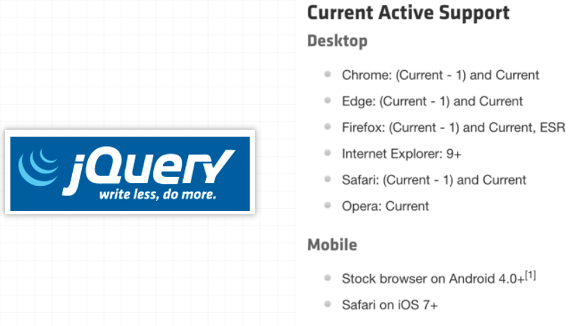

## 2. 库(library)和框架(framework)的概念

- 随着 `js` 的普及，以及越来越多人使用 `js` 来构建网站和应用程序

  - `js` 社区认识到代码中存在非常多相同的逻辑是可复用的

  - 因此社区就开始对这些相同的逻辑的代码封装到一个 `js` 文件中

  - 这类封装好的 `js` 文件就可称为 `js` 库或 `js` 框架

    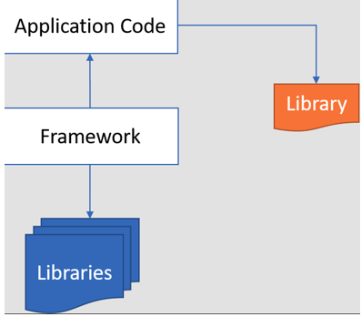

- 库（`library`）

  - `js` 库是 **一个预先编写好并实现了一些特定功能的代码片段的集合**
  - 一个库中会包含许多的函数、变量等，可根据需求引入到项目中使用
  - 一些常见的库有 `jQuery`、`Day.js`、`Lodash` 和 `React` 等（`react` 官方称之为库，但是大多数人都是称之为前端三大框架之一）

- 框架（`framework`）

  - `js` 框架是 **一个完整的工具集，可帮助塑造和组织您的网站或应用程序**
  - 提供一个结构来构建整个应用程序，开发人员可以在结构的规则内更安全、更高效地工作
  - 一些更常见的框架有：`Bootstrap`、`Angular`、`Vue`、`Next.js` 等

## 3. jQuery 优点与缺点

- `jQuery` 的优点

  - 易于学习：相对于其它的前端框架，`jq` 更易于学习，它支持 `js` 的编码风格

  - 少写多做（`Write less, do more`）

    - **`jq` 提供了丰富的功能（`DOM` 操作、过滤器、事件、动画、`Ajax` 等）**

    - 可以编写更少可读的代码来提高开发人员的工作效率

      ```js
      // 原生js
      document.addEVentListener("DOMContentLoaded", function() {
        paragraphs = document.getELementsByTagName('p')
        for (i = 0; i <= paragraphs.length; i++) {
          paragraphs[i].innerHTML = 'This is a Paragraph'
        }
      })
      
      // jq
      $(document).ready(function() {
        $('p').html('This is a Paragraph')
      })
      ```
      

  - 优秀的 `API` 文档：`jq` 提供了优秀的在线 `API` 文档

  - 跨浏览器支持：`1.X` 版本支持 `IE6-8`，当前版本提供出色的跨浏览器支持 (`IE9+`)，无需编写额外代码

- `jq` 的缺点：

  - `jq` 代码库一直在增长（自 `jQuery1.5` 起超过 `200KB`）
  - 不支持组件化开发
  - `jq` 更适合 `DOM` 操作，当涉及到开发复杂的项目时，`jq` 能力有限

## 4. jQuery 起源和历史

- 早在2005年8月22日，`John Resig first hints of a JavaScript library to use CSS selectors（Selectors in JavaScript） with a more succinct syntax than existing libraries（Behaviour ）`

  - `John Resig ` 首次提出支持 `CSS` 选择器的 `js` 库，其语法比现有库（例如：`Behaviour `）更简洁

    

- 在2006年之前，`John Resig`（一名从事自己项目的 `Web` 开发人员）对编写跨浏览器的 `js` 感到非常繁琐

  - 2006年1月16日，`John Resig` 在 `BarCamp` 的演讲中介绍了他的新库(`jQuery`)

    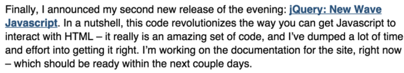

  - 最后，我宣布了今晚发布的第二个新版本：`jQuery: New Wave Javascript`。简而言之，这段代码彻底改变了 `js` 与 `HTML` 交互的方式——它确实是一组令人惊叹的代码，我已经投入了大量的时间和精力来实现它。我现在正在为网站编写文档，应该会在接下来的几天内准备好
  - 之后 `John Resig` 又花了8个月的时间完善 `jq` 库，直到2006-8-26才发布了1.0版本
    - 原本打算使用 ` JSelect（JavaScript Selectors）` 命名该库，但域名都已被占用

## 5. Behaviour vs Selectors in JavaScript

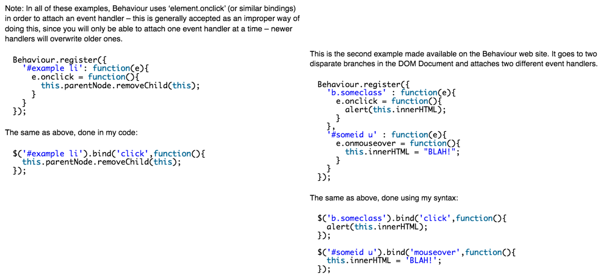

## 6. jQuery 历史版本

- 注意：**`1.x` 的版本支持 `ie6-8`，`2.x`版本已经不支持 `ie6-8`**
  - 所以如果需要兼容 `ie6-8` 的项目，就需要使用 `jq1.x` 的版本
  
  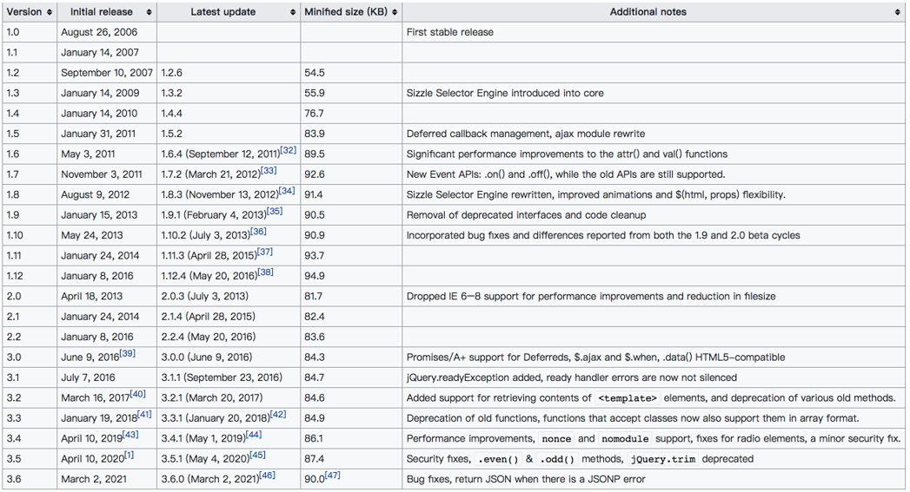

## 7. 为什么学习 jQuery

- `jq` 是一个非常受欢迎的 `js` 库，被全球约7000万个网站使用。它优秀的设计和架构思想非常值得我们去学习
- `jq` 的座右铭是“`Write less , do more`”，它易于学习， 非常适合 `js` 开发人员学习的第一个库
- 前端 `js` 库非常多，学习 `jq` 有利于我们学习和理解其它的 `js` 库（例如：`Day.js、Lodash.js`等）
- 许多大型科技公司，虽然他们现在不会直接使用 `jq` 来做项目，但在项目中仍然会借鉴很多 `jq` 设计思想
- 因此，了解 `jq` 依然是一个好主意

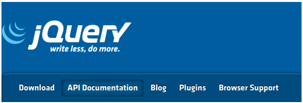

## 8. jQuery 的安装

- `jq` 本质是一个 `js` 库
  
  - 该库包含了：`DOM` 操作、选择器、事件处理、动画和 `Ajax` 等核心功能
  - 现在我们可以简单的理解它就是一个 `js` 文件
  - 执行该文件中会给 `window` 对象添加一个 `jQuery` 函数（例如：`window.jQuery`）
  - 接着我们就可以调用 `jQuery` 函数，或者使用该函数上的类方法
  
- 下面我们来看看 `jQuery` 安装方式有哪些？
  - 方式一：在页面中，直接通过 `CDN` 的方式引入
  
    - https://code.jquery.com/jquery-3.6.0.js
  
    - 下面实现一个 `Hello jQuery` 的案例：
  
      ```html
      <!-- 
        1.使用CDN的方式引入
        执行下面的js文件，会给window添加jQuery函数和$函数
        1.window.jQuery 函数 -> 工厂函数
        2.window.$ 函数
      -->
      <script src="https://code.jquery.com/jquery-3.6.0.js"></script>
      <script>
        // console.log("%O", jQuery)
        // console.log($ === jQuery) // true
        // 需求:在页面上显示 Hello World
        // document.querySelector('body').textContent = 'Hello World'
        // var $body = jQuery('body')
        // $body.text('hello jQuery')
        $('body').text('hello jQuery')
      </script>
      ```
  
    > 补充：
    >
    > ```html
    > <script src="https://code.jquery.com/jquery-3.6.0.js" integrity="sha256-H+K7U5CnXl1h5ywQfKtSj8PCmoN9aaq30gDh27Xc0jk=" crossorigin="anonymous"></script>
    > 
    > <!-- 
    >   integrity: 防止资源被篡改,如果浏览器发现资源被篡改 就不会加载该资源
    >   crossorigin: 加载不同源的资源时,浏览器是否需要携带用户凭证信息( cookie, ssl 证书 等 )
    >   anonymous: 不需要携带用户凭证信息
    >   user-credentail: 需要携带用户凭证信息
    > -->
    > ```
  
  - 方式二：下载 `jq` 的源文件，并在页面中手动引入
  
    - 官网下载：https://jquery.com/download/
  
    - `CDN` 连接地址下载： https://releases.jquery.com/jquery/
  
    - `GitHub` 仓库中下载：https://github.com/jquery/jquery
  
    - 下面使用源码的方式引入 `jq`：
  
      ```html
      <script src="../libs/jquery-3.6.0.js"></script>
      <script>
        $('body').text('hello jquery') // textContent
      </script>
      ```
  
  - 方式三：使用 `npm` 包管理工具安装到项目中
  
    ```bash
    npm i jquery
    
    # yarn包管理工具
    yarn add jquery
    ```

## 9. jQuery 初体验 - 计数器案例

```html
<button class="sub">-</button>
<span class="counter">0</span>
<button class="add">+</button>

<script>
  // 原生js
  var subEl = document.querySelector('.sub')
  var spanEl = document.querySelector('.counter')
  var addEl = document.querySelector('.add')
  var counter = 0
  subEl.addEventListener('click', function() {
    spanEl.innerText = --counter
  })
  addEl.addEventListener('click', function() {
    spanEl.innerText = ++counter
  })
</script>

<script>
  // jquery
  var $sub = jQuery('.sub')
  var $span = jQuery('.counter')
  var $add = jQuery('.add')
  var counter = 0
  $sub.on('click', function() {
    $span.text(--counter)      
  })
  $add.on('click', function() {
    $span.text(++counter)
  })
</script>
```

## 10. jQuery 监听文档加载

- **`jq` 监听 `document` 的 `DOMContentLoaded` 事件的四种方案**

  - `$(document).ready(handler)`：弃用（`deprecated`）
  - `$("document").ready(handler)`：`弃用
  - `$().ready(handler)`：弃用
  - `$(handler) `：推荐用这种写法，其它可以使用但是不推荐

  ```js
  // 监听文档完全解析完成
  var cb = () => {}
  
  // 方式一
  $(document).ready(cb)
  // 方式二
  jQuery('document').ready(cb)
  // 方式三
  $().ready(cb)
  // 方式四（推荐）
  $(cb)
  ```

- **监听 `window` 的 `load` 事件，即网页所有资源（外部链接，图片等）加载完**

  - `.load(handler)：This API has been removed in jQuery 3.0` (`jq3.x` 版本已删除)
  
  - `$(window).on('load', handler) `：推荐写法
  
    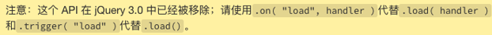
  
  ```js
  // 监听整个HTML页面加载完成( 外部链接 和 图片资源.. )
  var cb = () = {}
  
  // 方式一（jq3.x 已移除）
  $(window).load(cb)
  // 方式二（推荐）
  $(window).on('load', cb)
  ```

## 11. jQuery 与其它库的变量名冲突

- 和 `jq` 库一样，许多其他 `js` 库也会使用 `$` 作为函数名或变量名

  ```html
  <!-- 
    给 window 添加了 $ 变量
    window.$ = '我是hy-utils'
    window.jQuery = '我是hy-utils jQuery'
  -->
  <script src="./utils/hy-utils.js"></script>
  <!-- 
    给 window 添加了 $ 变量
    var _$ = window.$
    var _jQuery = window.jQuery
    window.$ = func 函数
    window.jQuery = func 函数
  -->
  <script src="../libs/jquery-3.6.0.js"></script>
  <script>
    // console.log('%O', $)  // func 还是  '我是hy-utils'
    // 解决变量的冲突
    var newjQuery = jQuery.noConflict(true) // window.$ =  _$ ;  window.jQuery =  _jQuery
    console.log( $ ) // 我是hy-utils
    console.log( jQuery ) // 我是hy-utils
    console.log(newjQuery)
  </script>
  ```

  - 在 `jq` 中，`$` 是 `jq` 的别名
  - 如果我们在使用 `jq` 库之前，其它库已经使用了 `$` 函数或变量，这时就会出现冲突的情况
  - 这时我们可以通过调用 `jq` 中的 `noConflict` 函数来解决冲突问题
  - `jq` 在初始化前会先备份一下全局其它库的 `jQuery` 和 `$` 变量，调用 `noConflict` 函数只是恢复之前备份的 `jQuery` 和 `$` 变量，而 `jQuery` 本身是通过 `noConflict` 函数返回的

  ```js
  var
  // Map over jQuery in case of overwrite
  _jQuery = window.jQuery, // 备份其它库的相同变量jQuery
      // Map over the $ in case of overwrite
      _$ = window.$; // 备份其它库的相同变量$
  // noConflict#liujun
  jQuery.noConflict = function( deep ) {
    if ( window.$ === jQuery ) {
      window.$ = _$; // 恢复先前备份其他框架的$
    }
    if ( deep && window.jQuery === jQuery ) {
      window.jQuery = _jQuery;  // 恢复先前备份其他框架的jQuery
    }
    return jQuery; // 返回一个jQuery函数
  };
  ```


# 二. 认识 CDN

---

- 什么是 `CDN` 呢？`CDN` 称之为**内容分发网络**（`Content Delivery Network` 或 `Content Distribution Network`，缩写：`CDN`）

  - `CDN` 它是 **一组分布在不同地理位置的服务器相互连接形成的网络系统**
  - 通过这个网络系统，将 `Web` 内容存放在距离用户最近的服务器
  - 可以更快、更可靠地将 `Web` 内容(文件、图片、音乐、视频等)发送给用户
  - `CDN` 不但可以提高资源的访问速度，还可以分担源站的压力

- 更简单的理解 `CDN`：

  - `CDN` 会将资源缓存到遍布全球的网站

  - 用户请求获取资源时，可就近获取 `CDN` 上缓存的资源，提高资源访问速度，同时分担源站压力

    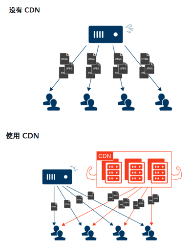

- 常用的 `CDN` 服务可以大致分为两种：

  - 自己购买的 `CDN` 服务：需要购买开通 `CDN` 服务（会分配一个域名）
    - 目前阿里、腾讯、亚马逊、`Google` 等都可以购买 `CDN` 服务
  - 开源的 `CDN` 服务
    - 国际上使用比较多的是 `unpkg`、`JSDelivr`、`cdnjs`、`BootCDN` 等

- 总结：**`cdn` 是分布式网络系统，可以提高资源的访问速度，即可以更快的将 `web` 内容发送给用户，还可以分担源站的压力**

- 当韩国用户`A`第一次访问中国深圳某个有`cdn`加速的`www.later.com`时，会通过`dns`查询拿到最佳节点，然后通过最佳节点找到对应的`cdn`服务器`aaa`，然后该服务器`aaa`去源站(`www.later.com`部署的服务器)拿到资源再发送给用户，同时该`cdn`服务器`aaa`会将资源缓存起来，之后当韩国用户`A`再次访问该站点时，利用就近原则，会直接从`cdn`服务器`aaa`上获取到缓存的资源，而不需要再去源站获取资源，从而提高了资源的访问速度，也减少了源站的压力

- `CDN` 加速度是**将网站的内容缓存到网络边缘**（例如：离用户最近的服务器），然后用户在访问的时候，将**接入离用户最近或者访问效果最佳的服务器上**，这种方式缩短了用户和内容之间的网络距离，从而达到加速的效果

- `dns` 解析的时候访问最近服务器，加载最新的静态缓存，如果没有缓存就会去源站获取资源

- 购买 `cdn` 服务，会给一个域名，然后去设置为源站的 `cName` 子域名

  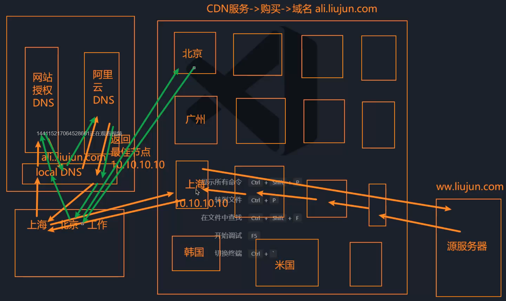

- 无 `cdn` 加速的

  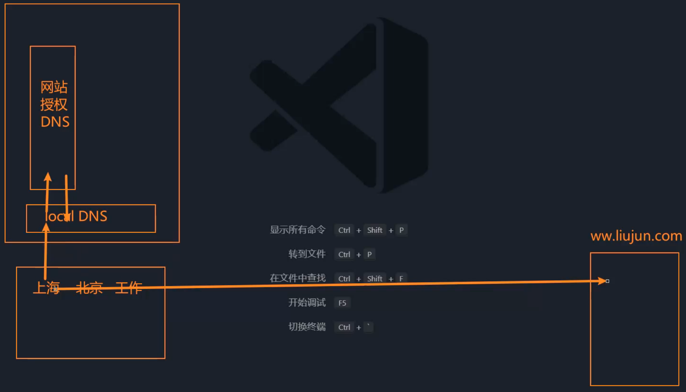


# 三. 认识 jQuery 对象

---

## 1.认识 jQuery 函数

- **`jQuery` 是一个工厂函数（别名 `$` ），调用该函数，会根据传入参数类型来返回匹配到元素的集合，一般把该集合称为 `jQuery` 对象**

  - 如果传入假值：返回一个空的集合
  - 如果传入选择器：返回在 `documnet` 中所匹配到元素的集合
  - 如果传入元素：返回包含该元素的集合
  - 如果传入 `HTML` 字符串，返回包含新创建元素的集合
  - 如果传入回调函数：返回的是包含 `document` 元素集合，并且当文档加载完成会回调该函数
  - 因为函数也是对象，所以该函数还包含了很多已封装好的方法。如：`jQuery.noConflict`、`jQuery.ready` 等 

  ```js
  // Define a local copy of jQuery jQuery#liujun
  jQuery = function( selector, context ) {
    // The jQuery object is actually just the init constructor 'enhanced'
    // Need init if jQuery is called (just allow error to be thrown if not included)
    return new jQuery.fn.init( selector, context );
  };
  ```

- `jQuery` 函数的参数：

  - `jQuery(selector[,context])`：
  - `selector` 是字符串选择器
  - `context` 是匹配元素时的上下文，默认值为 `document`
    - `jQuery(selector[, context])`
    - `jQuery(element)`
    - `jQuery(elementArray)`
    - `jQuery()`
  - `jQuery(html[,ownerDocument])`
    - `jQuery(html[,ownerDocument])`
    - `jQuery(html)`
  - `jQuery(callback)`
  
  ```js
  init = jQuery.fn.init = function( selector, context, root ) {
    var match, elem;
    // HANDLE: $(""), $(null), $(undefined), $(false)
    if ( !selector ) {
      return this;
    }
    // Method init() accepts an alternate rootjQuery
    // so migrate can support jQuery.sub (gh-2101)
    root = root || rootjQuery;
  ```

  - 练习
  
    ```js
    // 1.假值： ''  false  null undefined NAN 0....
    console.log( jQuery('') )
    // 2.字符串（选择器）
    console.log( jQuery('ul li') )
    // 3.字符串（ html string）
    console.log( jQuery('<div>') ) // 创建了一个div元素
    document.createElement('div')  
    
    var $els = jQuery(`
      <div>我是div</div><p>我是一个p</p>
    `)
    $els.appendTo('body')
    console.log($els)
    // 4.元素类型
    var bodyEl = document.querySelector('body')
    console.log(jQuery(bodyEl))
    // 5.监听文档的解析完成
    var $doc =jQuery(function() { })
    console.log(jQuery($doc))
    ```

## 2.认识 jQuery 对象

- **`jQuery` 对象是一个包含所匹配到元素的集合，该集合是类数组(`array-like`)对象**

  - **`jQuery` 对象是通过调用 `jQuery` 函数来创建的**
  - **`jQuery` 对象中会包含`0`个或多个匹配到的元素**
  - `jQuery` 对象原型中包含了很多已封装好的方法。例如：`DOM` 操作、事件处理、动画等方法

- 下面我们通过调用 `jQuery` 函数来新建一个 `jQuery` 对象，例如：

  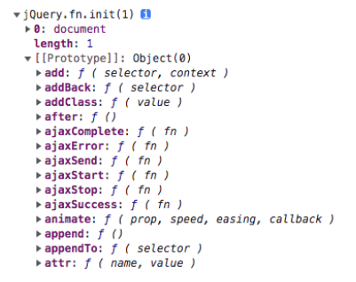

  - `$()` 返回一个空的 `jQuery` 对象
  - `$(document)` 返回一个包含 `document` 元素的 `jQuery` 对象
  - `$('selector')` 返回一个包含所选中 `DOM` 元素的 `jQuery` 对象

  ```js
  // 1.返回一个空的jQuery对象
  jQuery()
  // 2.返回一个匹配到document元素的集合 -> jQuery对象
  jQuery(document)
  // 3.返回匹配到多个li元素的集合 -> jQuery对象
  jQuery('ul li')
  jQuery('ul li', document.querySelector('div'))
  ```

## 3. jQuery 对象与 DOM Element 的区别

- 获取的方式不同：

  - `DOM Element` 是通过原生方式获取，例如：`document.querySelector()`
  - `jQuery` 对象是通过调用 `jQuery` 函数获取，例如：`jQuery(' ')`

  ```js
  // 1.获取jQuery对象
  console.log(jQuery('body'))
  // 2.获取DOM Element对象
  console.log('%O', document.querySelector('body'))
  ```

  > 补充：
  >
  > - 可以在传递给 `console` 的方法的时候使用下面的字符以期进行参数的替换
  >
  >   ```js
  >   %o or %O // 打印 js 对象。在审阅器点击对象名字可展开更多对象的信息。
  >   ```
  >
  > - 更多：https://developer.mozilla.org/zh-CN/docs/Web/API/console#%E8%BE%93%E5%87%BA%E6%96%87%E6%9C%AC%E5%88%B0%E6%8E%A7%E5%88%B6%E5%8F%B0

- `jQuery` 对象是一个**类数组对象**，该对象中会包含所选中的 `DOM Element` 的集合

- `jQuery` 对象的原型上扩展非常多实用的方法，`DOM Element` 则是 `W3C` 规范中定义的属性和方法

  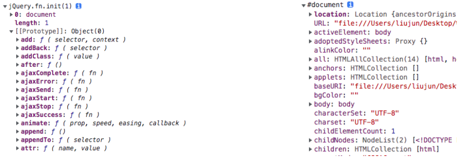

## 4. jQuery 对象与 DOM Element 的转换

- `jQuery` 对象转成 `DOM Element`

  - `.get(index)`：获取 `jQuery` 对象中某个索引中的 `DOM` 元素
    - `index` 一个从零开始的整数，指示要检索的元素
    - 如果 `index` 超出范围（小于负数元素或 `>=` 元素数），则返回 `undefined`
  - `.get() `：没有参数，将返回 `jQuery` 对象中所有 `DOM` 元素的数组

- `DOM Element` 转成 `jQuery` 对象

  - 调用 `jQuery` 函数或 `$` 函数
  - 例如：`$` (元素)

  ```js
  // 1.jQuery对象 转成 DOM Element
  var $ul = jQuery('ul')
  console.log($ul) 
  
  // 方式一
  var ulEl = $ul[0]  // 将jQuery对象转成DOM Element
  console.log('%O', ulEl)
  
  // 方式二
  $ul.get() // 获取到匹配元素集合中所有的元素 [ul]
  $ul.get(0) // 获取到匹配元素集合中某一个元素 ul 
  
  // 2.DOM Element 转成 jQuery对象
  var ulEL = document.querySelector('ul')
  console.log(ulEL)
  console.log(jQuery(ulEL)) // 目的：转换之后可以调用jQuery对象中的方法
  ```


# 四. jQuery 的整体架构

---

- 在开始学习 `jq` 语法之前，我们先来了解一下 `jq` 的架构设计图

- `jq` 架构设计图如下：

  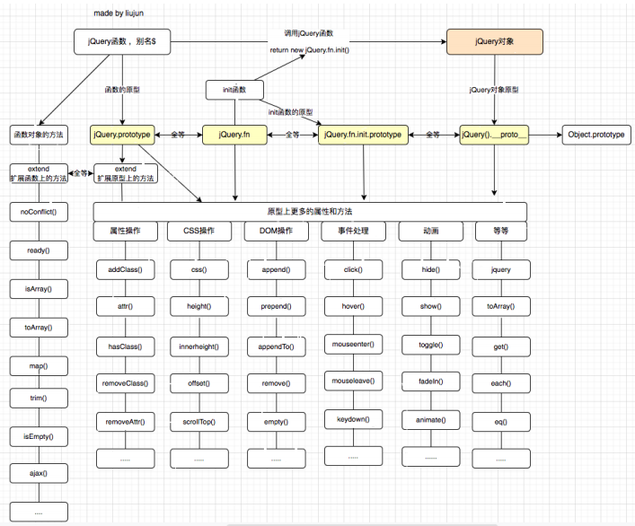

  - 简易 `jq` 架构

    ```js
    // 立即执行函数（避免与全局变量冲突）
    ;(function(global, factory) {
      factory(global)
    })(window, function(window) {
    
      function HYjQuery(selector) {
        return new HYjQuery.fn.init(selector)
      }
      // 原型方法
      HYjQuery.prototype = {
        constructor: HYjQuery,
        extend: function() {},
        text: function() {},
        ready: function() {}
      }
      // 类方法
      HYjQuery.noConflict = function() {}
      HYjQuery.isArray = function() {}
      HYjQuery.map = function() {}
    
      HYjQuery.fn = HYjQuery.prototype
    
      // 构造函数（创建jQuery对象）
      HYjQuery.fn.init = function(selector) { // css selector
        if (!selector) { // 一些边界值判断...
          return this
        }
        // 拿到DOM Element源码
        var el = document.querySelector(selector)
        this[0] = el
        this.length = 1
        return this
      }
      HYjQuery.fn.init.prototype = HYjQuery.fn
      window.HYjQuery = window.$ = HYjQuery
    })
    ```


# 五. jQuery 操作属性

---

## 1. jQuery 的选择器（Selectors）

- `jQuery` 函数支持大部分的 `CSS` 选择器，语法：`jQuery`（'**字符串格式的选择器**'）

  1. 通用选择器（`*`） 
  2. 基本选择器（`id`、`class`、元素）
  3. 属性选择器（`[attr]`、`[atrr=”value”]`） 
  4. 后代选择器（`div > span`、`div span`） 
  5. 兄弟选择器（`div + span `、`div ~ span`） 
  6. 交集选择器（`div.container`） 
  7. 伪类选择器（`:nth-child()`、`:nth-of-type()`、`:not()`， 但不支持状态伪类 `:hover`, `:focus`...）
  8. 内容选择器（`:empty`、`:has(selector)`、`empty` 指选中的元素没有子元素或文本，`has` 指选中的元素是否存在某个子元素 
  9. 可见选择器（`:visible`、`:hidden`） 
  10. `jQuery` 扩展选择器：（`:eq()`、`:odd`、`:even`、`:first`、`:last `）
  11. ...

  ```js
  // 1.基本的选择器
  $('.li-1')
  $('#list')
  
  // 2.伪元素选择器
  $('ul li:nth-child(2)')
  
  // 3.jQuery额外扩展的选择器
  document.querySelector('ul li:eq(1)') // 不会生效
  $('ul li:eq(1)')
  $('ul li:first') 
  $('ul li:last')
  $('ul li:odd')
  $('ul li:even')
  ```

## 2. jQuery 过滤器（Filtering）API

- `jQuery` 过滤器  `API` （即 `jQuery` 函数显式原型上的方法）

  1. `eq(index)`：从匹配元素的集合中，取索引处的元素， `eq` 全称(`equal` 等于)，返回 `jQuery` 对象
  2. `first() `：从匹配元素的集合中，取第一个元素，返回 `jQuery` 对象
  3. `last()`：从匹配元素的集合中，取最后一个元素，返回 `jQuery` 对象
  4. `not(selector)`：从匹配元素的集合中，删除匹配的元素，返回 `jQuery` 对象
  5. `filter(selector)`：从匹配元素的集合中，过滤出匹配的元素，返回 `jQuery` 对象
  6. `find(selector)`：从匹配元素集合中，找到匹配的后代元素，返回 `jQuery` 对象
  7. `is(selector|element|.)`：根据选择器、元素等检查当前匹配到元素的集合。集合中至少有一个与给定参数匹配则返回 `true`
  8. `odd()`：将匹配到元素的集合减少为集合中的奇数，从零开始编号，返回 `jQuery` 对象
  9. `even()`：将匹配到元素的集合减少到集合中的偶数，从零开始编号，返回 `jQuery` 对象
  10. 只要方法返回的结果是 `jQuery` 对象，就**支持链式调用**
  11. ...

  ```html
  <ul id="list" class="panel">
    <li class="li-1">li-1</li>
    <li class="li-2">li-2</li>
    <li class="li-3">li-3</li>
    <li class="li-4">li-4</li>
    <li class="li-5">li-5</li>
  </ul>
  
  <script>
  	// 1.监听文档完全解析完成
    $(function() {
      // 1.eq()
      console.log($('ul li:eq(2)') ) // selector
      console.log( $('ul li').eq(2) ) // API -> 原型上的方法
      // 2.first()  last()
      console.log( $('ul li').first() )
      console.log( $('ul li').last() )
      // 3.not()
      console.log($('ul li').not('.li-1') )
      console.log($('ul li').not('.li-1, .li-2') )
      // 4. odd()  even()
      console.log($('ul li').odd() )
      console.log($('ul li').even() )
      // 5.filter()
      console.log($('ul li').filter('.li-4') )
      console.log($('ul li').filter('.li-4, .li-3') )
      // 6.jQuery原型上的方法，大部分支持链式调用
      var $el = $('ul li')
      .filter('.li-2, .li-3, .li-4')
      .eq(1)
      console.log($el)
    })
  </script>
  ```

## 3.`jQuery`对文本的操作

- `.text()`、`.text(text)`
  - 获取匹配到元素集合中每个元素组合的文本内容，包括它们的后代，或设置匹配到元素的文本内容
  - 相当于原生元素的`textContent`属性
- `.html()`、`html(htmlString)`
  - 获取匹配到元素集合中第一个元素的`HTML`内容，包括它们的后代，或设置每个匹配元素的`HTML `内容
  - 相当于原生元素的`innerHTML`属性
- `.val()`、`.val(value)`
  - 获取匹配到元素集合中第一个元素的当前值 或 设置每个匹配到元素的值
  - 该`.val()`方法主要用于获取`input`, `select`和等表单元素的值
  - 相当与获取原生元素的`value`属性
- 注意：**传递参数的时候是设置，不传递参数是获取**

```js
    // 1.拿到 ul 中所有的文本
    console.log( $('ul').text() )
    // 2.设置 li 中的文本
    $('ul li').text('我是li')  // 会给匹配元素集合中所有的元素添加文本 （ 设置值：一般是给选中所有元素设置）
    // 1.获取ul元素中的所有 html 内容
    console.log($('ul li').html() ) // 拿到匹配元素集合中的第一个元素（获取的时候 一般是拿到匹配元素集合中的第一个元素的数据 ）

    // 2.给设置li元素设置html的内容（ 设置 ）
    $('ul li').html(`
      <p>我是p元素</p>
      <span>我是一个span</span>
    `)
	// 1.获取表单数据
    $('.login').on('click', function() {})
    // 简写
    $('.login').click(function() {
      console.log( $('.user').val() )
      console.log( $('.password').val() )
    })
    // 2.给表单元素设置值
    $('.setUserPas').click(function() {
      $('.user').val('coder')
      $('.password').val('admin')
    })
```

## 4.`jQuery`对`CSS`的操作

- `.width()`、`.width(value)`

  - 获取匹配到元素集合中第一个元素的宽度或设置每个匹配到元素的宽度

  

- `.height()`、`.height(value)`

  -  获取匹配到元素集合中第一个元素的高度或设置每个匹配到元素的高度

- `.css(propertyName)`、`.css(propertyNames)`

  - 获取匹配到元素集中第一个元素样式属性的值，底层是调用`getComputedStyle`函数获取
  - `.css("width")`和`.width()`之间的区别: 
    - `width()`返回一个无单位的像素值(例如，`400`)，而`css()`返回一个具有完整单位的值(例如，`400px`)

- `.css(propertyName, value)`、`.css(properties)`

  - 为每个匹配到元素设置一个或多个`CSS `属性
  - 调用`css`方法添加样式会直接把样式添加到元素的`style`属性上

  ```js
        // 1.获取到元素的width
        // width: content ;  innerWidth:padding + content; outerWidth: border + padding + content
        console.log($('ul').width()) // 返回的结果是 number
        // 2.设置ul元素的width
        $('ul').width(300)  // 直接给style设置一个width
        $('ul').width('500px')  // 直接给style设置一个width
        // 3. width height  innerWidth innerHeight ......
        // 1.获取ul元素的width
        console.log( $('ul').css('width') )  // 返回的结果是 string 带单位 px
        console.log( $('ul').css(['width', 'height']) )  // 返回的结果是 string 带单位 px 。 {width: '223px', height: '105px'}
        // 2.给ul元元素设置width
        $('ul').css('width', '450px') // 设置的是一个属性
        $('ul').css({  // 设置的是多个属性
          width: 100,
          height: 100,
          color: 'red'
        })
        $('ul li')
          .css('color', 'green')
          .odd()
          .css({color: 'red'})
  ```

## 5.`Class`属性的操作

- `.addClass(className)`、`.addClass(classNames)`、`.addClass(funcntion)`

  - 将指定的类添加到匹配元素集合中的每个元素，每次都是追加`class`
  - 底层调用的是`setAttribute("class", finalValue)`方法添加`class`

- `.hasClass(className)`

  - 是否给任意匹配到的元素分配了该类
  - 底层是通过`getAttribute("class").indexOf()`来判断是否存在

- `.removeClass()`、`.removeClass(className)`、`.removeClass(classNames)`、`.removeClass(function)`

  - 给匹配元素集中的每个元素删除单个类、多个类或所有类
  - 底层调用的是`setAttribute("class", finalValue)`方法

- `.toggleClass()`、`.toggleClass(className[,state])`、`.toggleClass(classNames[,state])`

  - 根据类的存在或状态参数的值，在匹配到元素的集合中，给每个元素添加或删除一个或多个类

  ```js
        // 1.添加class
        $('ul').addClass('list1 list2')
        $('ul li').addClass(['list1', 'list2'])
        // 2.判断是否存在弄个class
        console.log($('ul').hasClass('active list') )
        // 3.删除class
        $('ul').removeClass() // 删除全部
        $('ul').removeClass('list') // 删除指定的某一个
  
        // 4.class的切换
        $('.toggle').click(function() {
          $('ul').toggleClass()
          $('ul').toggleClass('active')
        })
  ```

## 6.`attributes`和`property`属性的操作


- `.attr(attributeName)`

  - 获取匹配元素集和中第一个元素的属性值，底层调用了原生的`getAttribute() API`

- `.attr(attributeName, value)`、`.attr(attributes)`

  - 为每个匹配元素设置一个或多个属性，底层调用了原生的`setAttribute() API`

- `.removeAttr(attributeName) `

  - 在匹配到元素的集中，给每个元素删除一个属性
  - 底层调用了原生的`removeAttribute() API`

- `.prop(propertyName)`

  - 获取匹配到元素集合中第一个元素的属性值

- `.prop(propertyName，value)`、`.prop(propertys)`

  - 为每个匹配元素设置一个或多个属性

- `removeProp(propertyName) `

  - 删除匹配元素集的属性，(只能删除用户自定义添加的`prop`，不能删除元素本身的属性)

  ```js
        // 1.获取attribute属性  ul
        console.log($('ul').attr('id'))
        console.log($('ul').attr('name'))
        // 2.设置 attribute属性 ul
        $('ul').attr('id', 'box')
        $('ul').attr({   // 设置多个属性
          id: 'container',
          class: "panel",
          name: 'coder'
        })
        // 3.删除 attribute属性 ul
        $('ul').removeAttr('id')
        $('ul').removeAttr('name')
  
        // 1.获取property属性  ul
        console.log("%O", document.querySelector('input') )
        console.log($('ul').prop('id') )
        console.log($('ul').prop('name') )
        console.log($('ul').prop('nodeName') )
        console.log($('ul').prop('nodeType') )
        // 2.设置property属性  input
        $('input').prop('disabled', true)
        $('input').prop({
          disabled: true,
          placeholder: '请输入用户名',
          jQuery_liujun_123: '自定义的属性' // 缓存 click data
        })
        // 3.删除property属性 input
        $('input').removeProp('jQuery_liujun_123') // 只能删除 自定义的属性
  ```

## 7.自定义`data-xx`属性的操作

- `.data()`、`.data(key)`

  - 获取匹配元素集中第一个元素的自定义属性的值

- `.data(key, value) `、`.data(obj)`

  - 为每个匹配元素设置一个或多个自定义属性

- `.removeData([name])`

  - 会删除`data()`函数给匹配元素属性添加的数据 和 `data()`函数绑定的自定义属性
  - `data`函数添加的属性会被移除，但是如果属性同时在签上定义了就不会被移除

  ```js
      // 1.监听文档完全解析完成
      $(function() {
        // 1.获取data属性 ul
        console.log($('ul').data() )  //  {age: 17, name: 'liujun'}
        console.log($('ul').data('age') )
        // 2.设置data属性 ul
        $('ul').data('name', 'coder')
        $('ul').data({  // 调用data()函数只能修改 缓存中的数据
          name: 'coder',
          age: '18',
          height: '1.66'  // 动态添加的data-xx属性
        })
        // 3.删除data属性
        $('ul').removeData('name')  // 只能删除 缓存中的数据
        $('ul').removeData(['name', 'age', 'height'])  // 只能删除 缓存中的数据
        console.log( $('ul').data('name') )
        console.log("%O", $('ul').get(0) )
  ```


# 六. `jQuery`操作`DOM`

---

## 1.`jQuery`的`DOM`操作-插入内容

- `.append(content[, content])`、`append(function)`

  - 将参数的内容插入到匹配元素集中每个元素内部的末尾
  - `content `的类型: `DOM element, text node, array of elements and text nodes, HTML string, or jQuery object`

- `.prepend(content[, content]) 、prepend(function)`

  - 将参数的内容插入到匹配元素集中每个元素的开头

- `.after(content[, content])`、`after(function)`

  - 在匹配元素集中的每个元素之后，插入由参数指定的内容

- `.before(content[, content])`、`before(function)`

  - 在匹配元素集中的每个元素之前，插入由参数指定的内容

  ```js
  $('ul').append('文本')
  $('ul').prepend('文本')
  $('ul').before('文本')
  $('ul').after('文本')
  
  // 方式一: 在ul的尾部插入文本
  $('ul').append('文本')
  
  // 方式二: 插入html字符串
  $('ul').append(`
    <li class="li-6">我是li-6</li>
    <li class="li-7">我是li-7</li>
  `)
  
  // 方式三: 插入的是jQuery对象
  var liEl = document.createElement('li')
  var $li = $('<li>').addClass('li-6').text('我是li-6')
  $('ul').append($li)
  
  // 方式四: 插入的是元素对象
  var liEl = document.createElement('li')
  liEl.className = 'li-6'
  liEl.innerText = '我是li-6'
  $('ul').append(liEl)
  
  //  方式五: 选中页面上的元素插入到ul中
  $('ul').append( $('.li-6') ) // move, 不是clone
  ```

- `.appendTo(target)`

  - 将匹配元素集中的每个元素插入到目标元素的末尾
  - `target`的类型：`A selector, element, HTML string, array of elements, or jQuery object`

- `.prependTo(target)`

  - 将匹配元素集中的每个元素插入到目标元素的开头

- `.insertAfter(target)`

  - 在目标元素之后，插入匹配元素集中的每个元素

- `.insertBefore(target)`

  - 在目标元素之前，插入匹配元素集中的每个元素

  ```js
       // 1.给ul的尾部插入内容
       $('<li>')
        .addClass('li-6')
        .css('color', 'red')
        .text('我是li-6')  // 创建一个li元素(必须是一个jQuery对象)
        // 方式一: 支持 jQuery对象
        .appendTo( $('ul') )
        // 方式二: 支持 字符串类型的选择器
        .appendTo( 'ul' )
        // 方式三: 支持 元素对象
        .appendTo( document.querySelector('ul') )
        $('.li-7').appendTo('ul')  // append
  ```

## 2.`jQuery`的`DOM`操作-移除/替换/克隆

- `.empty()`: 删除匹配元素集的所有子节点，自身不会删除

- `.remove()`、`.remove([selector])`

  - 删除匹配的元素集，自身也会删除
  - `selector`参数：字符串类型选择器。筛选匹配元素集的元素来删除

- `.replaceAll(target)`: 用匹配到的元素集替换每个目标元素

- `.replaceWidth(newContent)`、`.replaceWidth(function)`

  - 用新内容替换匹配元素集中的每个元素，并返回被移除的元素集
  - `newConten`参数的类型： `HTML string, DOM element, array of DOM elements, or jQuery object`

- `.clone()`、`.clone(withDataAndEvents)`

  - 对匹配的元素集执行深度复制，底层是调用了`elem.cloneNode(true)`来复制元素
  - `withDataAndEvents`参数: 布尔值，是否复制该元素的事件处理程序和数据，默认`false`

  ```js
      // 1.删除ul中的后代元素
      $('ul').empty()
      // 2.删除ul 以及后代元素
      $('ul').remove()
      $('ul li').remove('.li-1, .li-2') // 支持
      $('ul li').remove(['.li-1', '.li-2'])  // 不支持
  
      // 1.将li替换为span元素.replaceAll(target)
      $('<span>')
        .addClass('content')
        .text('我是span')
        .css('color', 'red') // 创建一个span元素( jQuery对象 )
        .replaceAll( 'ul li' ) // 将li元素替换为span 
      // replaceAll参数: 1.字符串类型的选择器  2.$('ul li') jQuery对象  3.元素对象
      // 2.将li替换为 span元素 .replaceWidh( content )
      var $span = $('<span>').text('我是span')
      $('ul li').replaceWith( $span )
      $('ul li').replaceWith('<span>我是span</span>')
      // replaceWith 参数: 1.字符串文本/html字符串  2.$('ul li') jQuery对象  3.元素对象
  
      // 1.将li-6克隆到ul元素的尾部
      var $newLi = $('.li-6').clone() // 属于克隆一个li元素
      $newLi.appendTo('ul')
      // 简写
      $('.li-6').clone().appendTo('ul')
      // 2.将li-6克隆到 ul元素的尾部( 将li-6的事件处理函数和data自定义属性一起拷贝过去 )
      $('.li-6')
        .data({
          name: 'liujun',
          age: '17'
        })
        .click(function() {
          console.log( 'li-6' )
        })
      // 开始克隆
        .clone(true)
        .appendTo('ul')
      console.log("%O", $('.li-6').get(0))
  ```


# 七. `vscode`生成代码片段

---

- 在线生成代码片段地址：`https://snippet-generator.app/`
- 光标停留控制：`json`配置文件中将光标停留的位置写上`$1`即可


