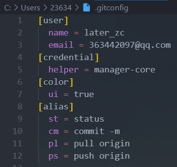
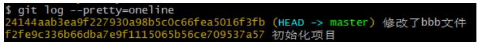
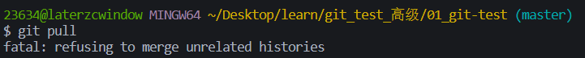

# 一. 邂逅版本控制工具

---

## 1.认识版本控制

- 什么是版本控制？
  - 版本控制的英文是`Version control`
  - 是维护工程蓝图的标准作法，能追踪工程蓝图从诞生一直到定案的过程
  - 版本控制也是一种软件工程技巧，借此能在软件开发的过程中，确保由不同人所编辑的同一程序文件都得到同步
- 简单来说，版本控制在软件开发中，可以帮助程序员进行代码的追踪、维护、控制等等一系列的操作


## 2.版本控制的功能

- 对于我们日常开发，我们常常面临如下一些问题，通过版本控制可以很好的解决：
- 不同版本的存储管理：
  - 一个项目会不断进行版本的迭代，来修复之前的一些问题、增加新的功能、需求，甚至包括项目的重构
  - 如果我们通过手动来维护一系列的项目备份，简直是一场噩梦
- 重大版本的备份维护：
  - 对于很多重大的版本，我们会进行备份管理
- 恢复之前的项目版本：
  - 当我们开发过程中发生一些严重的问题时，想要恢复之前的操作或者回到之前某个版本
- 记录项目的点点滴滴：
  - 如果我们每一个功能的修改、`bug`的修复、新的需求更改都需要记录下来，版本控制可以很好的解决
- 多人开发的代码合并：
  - 项目中通常都是多人开发，将多人代码进行合并，并且在出现冲突时更好的进行处理

## 3.版本控制的历史

- 版本控制的史前时代（没有版本控制）：
  - 人们通常通过文件备份的方式来进行管理，再通过`diff`命令来对比两个文件的差异
- `CVS（Concurrent Versions System）`
  - 第一个被大规模使用的版本控制工具，诞生于1985年
  - 由荷兰阿姆斯特丹`VU`大学的`Dick Grune`教授实现的，也算是`SVN`的前身（`SVN`的出现就是为了取代`CVS`的）
- `SVN（Subversion）`
  - 因其命令行工具名为`svn`因此通常被简称为`SVN`
  - `SVN`由`CollabNet`公司于2000年资助并发起开发，目的是取代`CVS`，对`CVS`进行了很多的优化
  - `SVN`和`CVS`一样，也属于集中式版本控制工具
  - `SVN`在早期公司开发中使用率非常高，但是目前已经被`Git`取代
- `Git`（`Linus`的作品）
  - 早期的时候，`Linux`社区使用的是`BitKeeper`来进行版本控制
  - 但是因为一些原因，`BitKeeper`想要收回对`Linux`社区的免费授权
  - 于是`Linus`用了大概一周的时间，开发了`Git`用来取代`BitKeeper`
  - `Linus`完成了`Git`的核心设计，在之后`Linus`功成身退，将`Git`交由另外一个`Git`的主要贡献者`Junio C Hamano`来维护


# 二. 集中式和分布式区别

---

## 1.集中式版本控制

- `CVS`和`SVN`都是是属于**集中式版本控制系统**（`Centralized Version Control Systems`，简称`CVCS`）

  - 它们的主要特点是**单一的集中管理的服务器，保存所有文件的修订版本**
  - 协同开发人员通过客户端连接到这台服务器，取出最新的文件或者提交更新

  

- 这种做法带来了许多好处，特别是相较于老式的本地管理来说，每个人都可以在一定程度上看到项目中的其他人正在做些什么

- 但是集中式版本控制也有一个核心的问题：**中央服务器不能出现故障**：

  - 如果宕机一小时，那么在这一小时内，谁都无法提交更新，也就无法协同工作
  - 如果中心数据库所在的磁盘发生损坏，又没有做恰当备份，毫无疑问你将丢失所有数据

## 2.分布式版本控制

- `git`是属于**分布式版本控制系统**（`Distributed Version Control System`，简称`DVCS`） 

  - 客户端并不只提取最新版本的文件快照， 而是**把代码仓库完整地镜像下来，包括完整的历史记录**
  - 这么一来，**任何一处协同工作用的服务器发生故障，事后都可以用任何一个镜像出来的本地仓库恢复**
  - 因为每一次的克隆操作，实际上都是一次对代码仓库的完整备份

  

- 目前在公司开发中我们都是使用`Git`来管理项目的，所以接下来我们会重点学习`Git`的各种用法


# 三. Git 的环境安装搭建

---

## 1. Git 的安装

- 电脑上要想使用`Git`，我们需要先对`Git`进行安装：

  - `Git`的官网：https://git-scm.com/downloads。
  - 根据自己的操作系统下载`Git`即可

  

  - **在`window`操作系统按照默认配置全局安装即可**

## 2. Bash、CMD、GUI的区别

- `Bash`，`Unix shell `的一种，`Linux `与 `MacOS X `都将它作为默认`shell`
  - `Git Bash `就是一个` shell`，是` Windows `下的命令行工具，可以执行` Linux `命令
  - `Git Bash `是基于` CMD `的，在` CMD `的基础上增添一些新的命令与功能
  - 所以建议在使用的时候，用` Bash `更加方便
- `Git CMD`
  - 命令行提示符(`CMD`)是`Windows`操作系统上的命令行解释程序
  - 当你在` Windows `上安装` git `并且习惯使用命令行时，可以使用` cmd `来运行` git `命令
- `Git GUI`
  - 基本上针对那些不喜欢黑屏（即命令行）编码的人
  - 它提供了一个图形用户界面来运行`git`命令

## 3. Git 的配置分类

- 既然已经在系统上安装了`Git`，你会需要做几件事来定制你的`Git`环境：

  - 每台计算机上只需要配置一次，程序升级时会保留配置信息
  - 你可以在任何时候再次通过运行命令来修改它们

- `Git`自带一个`git config`的工具来帮助设置控制`Git`外观和行为的配置变量：

  - `/etc/gitconfig `文件：包含系统上每一个用户及他们仓库的通用配置

    - 如果在执行` git config `时带上` --system `选项，那么它就会读写该文件中的配置变量
    - 由于它是系统配置文件，因此你需要管理员或超级用户权限来修改它。（开发中通常不修改）

  - `~/.gitconfig `或 `C/用户/236344/.gitconfig `文件：只针对当前用户

    - 你可以传递` --global `选项让` Git `读写此文件，这会对你系统上 所有 的仓库生效

  - 当前使用仓库的` Git `目录中的` config `文件（即 `.git/config`）：针对该仓库

    - 你可以传递` --local `选项让` Git `强制读写此文件，虽然默认情况下用的就是它

    

## 4. Git 的配置选项

- 安装`Git`后，要做的**第一件事就是设置你的用户名和邮件地址**

  - 这一点很重要，因为每一个` Git `提交都会使用这些信息，它们会写入到你的每一次提交中，不可更改

  - 如果使用了` --global `选项，那么该命令只需要运行一次，因为之后无论你在该系统上做任何事情， `Git `都会使用那些信息

    ```shell
    # git全局配置用户名和邮箱
    git config --global user.name "later_zc"
    git config --global user.email "2363442097@qq.com"
    ```

- 查看当前的配置信息：

  ```shell
  git config --list
  ```

  - 如下

    

- 查看配置文件中的用户名信息等

  ```shell
  git config user.name
  ```
  
  

## 5. Git 的别名（alias）

- `Git`并不会在你输入部分命令时自动推断出你想要的命令：

  - 如果不想每次都输入完整的`Git`命令，可以通过` git config `文件来轻松地为每一个命令设置一个别名

    

  - 也可以通过命令的形式配置

    ```shell
    git config --global alias.co checkout
    git config --global alias.br branch
    git config --global alias.ci commit
    git config --global alias.st status
    ```


# 四. Git 初始化本地仓库

---

- 我们需要一个`Git`来管理源代码，那么我们本地也需要有一个`Git`仓库

- 通常有两种获取` Git `项目仓库的方式：

  - 方式一：初始化一个`Git`仓库，并且可以将当前项目的文件都添加到`Git`仓库中（目前很多的脚手架在创建项目时都会默认创建一个`Git`仓库）
  - 方式二：从其它服务器克隆`clone`一个已存在的`Git `仓库（第一天到公司通常需要做这个操作）

- 方式一：初始化`Git`仓库

  - 该命令将创建一个名为` .git `的子目录，这个子目录含有你初始化的` Git `仓库中所有的必须文件，这些文件是` Git `仓库的核心
  - 但是，在这个时候，我们仅仅是做了一个初始化的操作，你的项目里的文件还没有被跟踪

  ```shell
  git init
  # cInitialized empty Git repository in C:/Users/23634/Desktop/learn/git_test/01_GitDemo/.git/ 
  ```

- 方式二：从`Git`远程仓库

  ```shell
  git clone https://github.com/coderwhy/hy-react-web-music.git
  ```


# 五. Git 记录更新变化过程

---

## 1. 文件的状态划分

- 现在我们的电脑上已经有一个`Git`仓库：
  - 在实际开发中，你需要将某些文件交由这个`Git`仓库来管理
  - 并且我们之后会修改文件的内容，当达成某一个目标时，想要记录下来这次操作，就会将它提交到仓库中
- 那么我们需要对文件来划分不同的状态，以确定这个文件是否已经归于`Git`仓库的管理：
  - 未跟踪：默认情况下，`Git`仓库下的文件也没有添加到`Git`仓库管理中，我们需要通过`add`命令来操作
  - 已跟踪：添加到`Git`仓库管理的文件处于已跟踪状态，`Git`可以对其进行各种跟踪管理
- 已跟踪的文件又可以进行细分状态划分：
  - `staged`：暂缓区中的文件状态
  - `Unmodified：commit`命令，可以将`staged`中文件提交到`Git`仓库
  - `Modified`：修改了某个文件后，会处于`Modified`状态
- 在工作时，你可以选择性地将这些修改过的文件放入暂存区
- 然后提交所有已暂存的修改，如此反复


## 2. Git 操作流程图


## 3. 检测文件的状态 git status

- 我们在有`Git`仓库的目录下新建一个文件，查看文件的状态：

  ```shell
  git status // 查看文件状态
  ```

  - 输出如下

  

- `Untracked files`：未跟踪的文件

  - 未跟踪的文件意味着` Git `在之前的提交中没有这些文件
  - `Git `不会自动将之纳入跟踪范围，除非你明明白白地告诉它“我需要跟踪该文件”

- 我们也可以查看更加简洁的状态信息：

  ```shell
  git status -s
  git status --short
  ```

  - 输出如下

  

  - `??`中的左栏指明了暂存区的状态，右栏指明了工作区的状态

## 4. 文件添加到暂存区 git add

- 跟踪新文件命令：

  ```shell
  git add aaa.js # git add 文件名
  ```

  - 使用命令`git add `开始跟踪一个文件

- 跟踪修改的文件命令：

  - 如果我们已经跟踪了某一个文件，这个时候修改了文件也需要重新添加到暂存区中

  

- 通过`git add . `将所有的文件添加到暂存区中：

  ```shell
  git add . # 将所有的文件添加到暂存区
  ```

- 输出如下

  

## 5. git 忽略文件

- 一般我们总会有些文件无需纳入` Git `的管理，也不希望它们总出现在未跟踪文件列表

  - 通常都是些自动生成的文件，比如日志文件，或者编译过程中创建的临时文件等
  - 我们可以创建一个名为` .gitignore `的文件，列出要忽略的文件的模式

- 在实际开发中，这个文件通常不需要手动创建，在必须的时候添加自己的忽略内容即可

- 也可以`github`中搜索`gitignore`查看，`github`官方提供的`gitignore`的一些模板，复制所需的模板即可

- https://github.com/github/gitignore。

- 比如下图是创建的`Vue`项目自动创建的忽略文件：

  - 包括一些不需要提交的文件、文件夹
  - 包括本地环境变量文件
  - 包括一些日志文件
  - 包括一些编辑器自动生成的文件

  

## 6. 文件更新提交 git commit

- 现在的暂存区已经准备就绪，可以提交了

  - 每次准备提交前，先用` git status `看下，你所需要的文件是不是都已暂存起来了
  - 再运行提交命令` git commit`
  - 可以在` commit `命令后添加` -m `选项，将提交信息与命令放在同一行

  ```shell
  git commit -m '提交信息'
  ```

  - 输出如下

    

- 如果我们修改文件的`add`操作(**注意：是已追踪文件的`add`操作，不包括未追踪文件**)，加上`commit`的操作有点繁琐，那么可以将两个命令结合来使用：

  ```shell
  git commit -a -m '提交信息'
  ```

  - 输出如下

    
  

## 7. Git 的校验和

- `Git`中所有的数据在存储前都计算校验和，然后以 校验和 来引用
  
  - `Git`用以计算校验和的机制叫做`SHA-1`散列（`hash`，哈希）
  
  - 这是一个由`40`个十六进制字符（`0-9 `和` a-f`）组成的字符串，基于` Git `中文件的内容或目录结构计算出来
  
    

## 8. 查看提交的历史 git log

- 在提交了若干更新，又或者克隆了某个项目之后，有时候我们想要查看一下所有的历史提交记录

- 这个时候我们可以使用`git log`命令：

  ```shell
  git log
  ```
  
  - 不传入任何参数的默认情况下，`git log `会按时间先后顺序列出所有的提交，**最近的更新排在最上面**
  - 这个命令会列出每个提交的` SHA-1 `校验和、作者的名字和电子邮件地址、提交时间以及提交说明

  - 输出如下

    

  - **退出：`q`**
  
  - 转为单行显示
  
    ```shell
    git log --pretty=oneline
    ```
  
  - 输出如下
  
    
  
  - 多分支查看
  
    ```shell
    git log --pretty=oneline --graph
    ```
  
  - 输出如下
  
    
  

## 9. 版本回退 git reset

- 如果想要进行版本回退，我们需要先知道目前处于哪一个版本：**`Git`通过`HEAD`指针记录当前版本**

  - `HEAD`是当前分支引用的指针，它总是指向该分支上的最后一次提交
  - 理解`HEAD`的最简方式，就是将它看做**该分支上的最后一次提交的快照**

  

- 我们可以通过`HEAD`来改变`Git`目前的版本指向：

  - 上一个版本就是`HEAD^`，上上一个版本就是`HEAD^^`
  - 如果是上`1000`个版本，我们可以使用`HEAD~1000`
  - 我们也可以指定某一个`commit id`

  ```shell
  git reset --hard HEAD^
  git reset --hard HEAD~1000
  git reset --hard 2d44982
  ```

- 回退之后，再次使用`git log`查看，只能查看到回退版本之前的提交记录

- 如果要查看所有记录(包括回退之前的提交记录)

  ```shell
  git reflog
  ```

## 10. 丢弃本地修改

- 分为三种情况：

  1. 还未将变更从工作区加入到暂存区，即未执行 `git add` 命令前，如：

     

     - 此时可以使用 `git checkout` 命令来撤销修改，如：

       ```shell
       git checkout -- a.js css/b.css #匹配根目录下的a.js和css文件夹下的b.css
       git checkout -- * #匹配所有文件
       git checkout -- *.js #匹配所有的js文件
       ```

  2. 已将变更加入到暂存区，即已经执行了 `git add` 命令，如：

     

     - 此时可以使用 `git reset` 命令来撤销修改，如：

       ```shell
       git reset HEAD a.js css/b.css #匹配根目录下的a.js和css文件夹下的b.css
       git reset HEAD * #匹配所有文件
       git reset HEAD *.js #匹配所有的js文件
       ```

       - 要注意的是，执行以上命令后，**本地的修改并不会消失，而只是从暂存区回到了工作区**，即第1种情况下所示的状态，继续用第1种情况下的操作，就可以放弃本地的修改

  3. 已经将代码提交到本地仓库，即已经执行 `git commit` 命令，此时工作区已经 `clean`，若想撤销之前的修改，需要执行版本回退操作：

     ```shell
     #回退到上一个版本
     git reset --hard HEAD^
     #回退到上上次版本
     git reset --hard HEAD^^
     git reset --hard HEAD^^^
      
     #回退到指定commitid的版本
     git reset --hard  commit_id
     ```

     - 可以使用 `git log` 或 `git reflog` 命令来查看 `git` 的提交历史，获取 `commit_id`
     - 要注意的是，执行以上命令后，**本地的修改并不会消失，而只是从暂存区回到了工作区**，即第1种情况下所示的状态，继续用第1种情况下的操作，就可以放弃本地的修改


# 六. `Git`远程仓库和验证

---

## 1.什么是远程仓库？

- 什么是远程仓库（`Remote Repository`）呢？

  - 目前我们的代码是保存在一个本地仓库中，也就意味着我们只是在进行本地操作
  - 在真实开发中，我们通常是多人开发的，所以我们会将管理的代码共享到远程仓库中

- 那么如何创建一个远程仓库呢？

  - 远程仓库通常是搭建在某一个服务器上的（当然本地也可以，但是本地很难共享）
  - 所以我们需要在`Git`服务器上搭建一个远程仓库
  - `git`服务器本身是跑在一台服务器上的，不过一般公司都是租的云服务器，除非公司比较大，有自己服务器的机房

- 目前我们有如下方式可以使用Git服务器：

  - 使用第三方的`Git`服务器：比如`GitHub`、`Gitee`、`Gitlab`等等
  - 在自己服务器搭建一个`Git`服务

  

## 2.远程仓库的验证

- 常见的远程仓库有哪些呢？目前比较流行使用的是三种：
  - `GitHub`：`https://github.com/`
  - `Gitee`：`https://gitee.com/`
  - 自己搭建`Gitlab`：`http://152.136.185.210:7888/`
- 对于私有的仓库我们想要进行操作，远程仓库会对我们的身份进行验证：
  - 如果没有验证，任何人都可以随意操作仓库是一件非常危险的事情
- 目前`Git`服务器验证手段主要有两种：
  - 方式一：**基于`HTTP`的凭证存储**（`Credential Storage`）
  - 方式二：**基于`SSH`的密钥**
- 下面我们来具体讨论一下这两种方式的验证规则和过程

## 3.远程仓库的验证 – 凭证

- 因为本身**`HTTP`协议是无状态的连接，所以每一个连接都需要用户名和密码**：

  - 如果每次都这样操作，那么会非常麻烦
  - 幸运的是，`Git `拥有一个凭证系统来处理这个事情

- 下面有一些`Git Crediential`的选项：

  - 选项一：默认所有都不缓存。 每一次连接都会询问你的用户名和密码

  - 选项二：“`cache`” 模式会将凭证存放在内存中一段时间。 密码永远不会被存储在磁盘中，并且在15分钟后从内存中清除

  - 选项三：“`store`” 模式会将凭证用明文的形式存放在磁盘中，并且永不过期

  - 选项四：如果你使用的是` Mac`，`Git `还有一种 “`osxkeychain`” 模式，它会将凭证缓存到你系统用户的钥匙串中（加密的）

  - 选项五：如果你使用的是` Windows`，你可以安装一个叫做 “`Git Credential Manager for Windows`” 的辅助工具

    - 可以在`https://github.com/Microsoft/Git-Credential-Manager-for-Windows`下载
    - 默认安装`git`的时候，设置选项的时候，默认帮我们已经勾选上安装这个辅助工具了

    ```shell
    git config credential.helper
    manager-core #上面一行回车之后，自动出现，表示已经有配置该辅助工具了
    ```

    - 之后克隆仓库的时候，只需要第一次的时候输入账号密码即可，凭证就会永久保存，之后对远程仓库进行操作的时候，就会自动检验凭证，如果删除掉，就需要再输入一次账号密码

    

## 4.远程仓库的验证 – SSH密钥

- `Secure Shell`（安全外壳协议，简称`SSH`）是一种**加密的网络传输协议，可在不安全的网络中为网络服务提供安全的传输环境**

- `SSH`以**非对称加密实现身份验证**

  - 例如其中一种方法是使用自动生成的公钥-私钥对来简单地加密网络连接，随后使用密码认证进行登录
  - 另一种方法是人工生成一对公钥和私钥，通过生成的密钥进行认证，这样就可以在不输入密码的情况下登录
  - 先在需要连接远程仓库的设备上通过`ssh`命令来生产对应的公钥和私钥
  - 然后公钥需要放在待访问的电脑(运行远程仓库的服务器)之中，而对应的私钥需要由用户自行保管
  - 访问的时候，通过私钥去匹配公钥(非对称加密方式实现身份验证)

- 如果我们以`SSH`的方式访问`Git`仓库，那么就需要生产对应的公钥和私钥：

  - `-t`: 后面加密的类型：`ed25519\rsa`
  - `-C`: 注释，一般会跟上`email`，这里的`email`只是生成的` sshkey `的名称，仅仅是为了便于辨识所以使用了邮箱
  - 最好在`git bash`中敲，`cmd`可能会没有支持对应的一些命令

  ```shell
  ssh-keygen -t ed25519 -C "your email"
  ssh-keygen -t rsa -b 2048 -C "your email"
  ```

  - 生成地址一般默认在

  

  - `.pub`的文件就是生成的公钥了，复制其内容添加到个人的`ssh`公钥中（即可访问该用户下的所有仓库了），另外一个文件就是私钥了，用来匹配的

- 注意：坑人的地方

  - 第一次`ssh`连接该云服务器仓库时，会出现下面红框提示，输入`yes`之后，第二次就不会出现了
  - **记住一定要输入`yes`，不能敲回车，否则一直提示权限失败**

  

## 5.管理远程服务器

- 查看远程地址：比如我们之前从`GitHub`上`clone`下来的代码，它就是有自己的远程仓库的：

  ```shell
  git remote
  git remote –v # -v是—verbose的缩写(冗长的)
  ```
  
  - 输出如下
  - 如果没有关联远程仓库，输出为空
  
    	
  
- 添加远程地址：我们也可以继续添加远程服务器（让本地的仓库和远程服务器仓库建立连接）：

  ```shell
  git remote add <shortname> <url>
  git remote add gitlab http://152.136.185.210:7888/coderwhy/gitremotedemo.git
  ```

  - 一个**本地仓库是可以和多个远程仓库建立连接的**

- 重命名远程地址：

  ```shell
  git remote rename gitlab glab
  ```

- 移除远程地址：

  ```shell
  git remote remove gitlab
  ```

## 6.本地分支的上游分支（跟踪分支）

- 问题一：当前分支没有`track`的分支

  	

- 原因：当前分支没有和远程的`origin/master`分支进行跟踪

  - 在没有跟踪的情况下，我们直接执行`pull`操作的时候必须指定从哪一个远程仓库中的哪一个分支中获取内容

    	

- 如果我们想要**直接执行`git pull`是有一个前提的**：

  - **必须给当前分支设置一个跟踪分支**

    	

  - 设置完当前分支的上游分支之后，就相当于已经指定了操作所对应的分支是`origin/master`了，后续`git pull`的时候就不需要指定分支了
  - `git pull`默认是从上游分支中获取代码的，`git pull`是`git fetch`和`git merge`的结合，`git merge`未指定分支时，默认也是从上游分支中获取代码的，`git fetch`是从指定分支中下载对应的对象和引用的(也就是下载对应分支的代码)，而前面指定了对应的上游分支，所以可以直接`git pull`等同于`git fetch + git merge`

    	
  

## 7.拒绝合并不相干的历史

- 问题二：合并远程分支时，拒绝合并不相干的历史（没用共同的`parent`）

  		

- 原因：我们将两个不相干的分支进行了合并：

- `https://stackoverflow.com/questions/37937984/git-refusing-to-merge-unrelated-histories-on-rebase`

  	

- 简单来说就是：过去`git merge`允许将两个没有共同基础的分支进行合并，这导致了一个后果：新创建的项目可能被一个毫不怀疑的维护者合并了很多没有必要的历史，到一个已经存在的项目中，目前这个命令已经被纠正，但是我们依然可以通过`--allow-unrelated-histories`选项来逃逸这个限制，来合并两个独立的项目

  	

- 上述情况，只是本地仓库合并远程仓库时，遇到的问题，而`clone`远程仓库的是不会遇到这种问题(`clone`下来的就是远程仓库的一个备份，而本地仓库分支合并远程仓库分支时，是两个不相干的分支进行合并，所以在`git2.9`版本之后有这个问题)

## 8.远程仓库的交互

- 从远程仓库`clone`代码：将存储库克隆到新创建的目录中

  ```js
      git clone http://152.136.185.210:7888/coderwhy/gitremotedemo.git 
  ```

- 将代码`push`到远程仓库：将本地仓库的代码推送到远程仓库中

  - 默认情况下是将当前分支（比如`master`）`push`到`origin`远程仓库的

  ```js
      git push // 有设置上游分支时，可不指定分支
      git push origin master // 未设置上游分支时，需指定分支
  ```

- 从远程仓库`fetch`代码：从远程仓库获取最新的代码

  - 默认情况下是从`origin`中获取代码

  ```js
      git fetch // 有设置上游分支时，可不指定分支
      git fetch origin master // 未设置上游分支时，需指定分支
  ```

  - 获取到代码后默认并没有合并到本地仓库，我们需要通过`merge`来合并

  ```js
  	git merge
      git merge origin/master
  ```

- 从远程仓库`pull`代码：上面的两次操作有点繁琐，我们可以通过一个命令来操作

  ```js
      git pull // 等价于下面写法
      git fetch + git merge(rebase)
  ```

## 9.git开发流程(远程仓库操作)

```js
// 情况一：到公司后已经有项目，并且有远程仓库了
1. git clone xxx // https:xxx 或 git@xxxx.git
2. 进行开发
  git add .
  git commit -m '提交信息'
  git pull -> git fetch + git merge
  git push

// 情况二: 开发一个全新的项目（由你来搭建的）
1. 创建一个远程仓库
  // 方案一：
        * git clone 远程仓库地址
        * 在clone下来的文件夹中开始搭建整个项目
        * git add .
        * git commit -m '提交信息'
        * git pull // clone的不需要指定分支
        * git push

	// 方案二：
        * 创建一个本地仓库和搭建本地项目
        * git remote add origin 远程仓库地址
        * git branch --set-upstream-to=origin/master // 设置完之后push\pull\fetch等操作就不需要再指定分支
        * git fetch
        * git merge --allow-unrelated-histories
        * // 上面两个操作可以简化为 git pull --allow-unrelated-histories
        * git push 
```

## 10.git push不同名分支时，遇到的一个问题（push默认行为）

- 当推送本地仓库`matser`分支到`Github`(默认只有一个`main`分支)远程仓库时

- 已经设置过对应的上游分支

  	

- 但是当我们在`master`分支`push`到远程仓库时（只有一个`main`分支），会提示匹配失败

  	

- 根据提示推荐，使用如下命令即可`push`成功

  ```js
      git ps origin head:main
  ```

- 但实际上的原因是跟`git config`中的`push.default`有关

- `push.default`的默认值是`simple`

  - `simple`：将当前具有相同名称的分支推送到远程端
  - `https://git-scm.com/docs/git-config`
  - `git --help`也可以自动打开浏览器查看对应的一个文档
  - 而我们远程仓库中并没有`master`分支，所以就会`push`失败，提示匹配不到

- 所以需要将`push.default`值设为`upstream`

  - `upstream`：使用`--set-upstream-to`命名指定的分支
  - 这里修改的只是当前仓库的`config`文件(`.git/config`)，并不是全局的(全局需加`--global`)

  ```js
      git config push.default upstream
  ```

- 查看下当前仓库的配置

  	

- 配置为`upstream`之后，直接`git push`也是没问题了

- 这里还有一个`push.default`的值：`current`

- `current`：配置之后，当本地仓库的某个分支进行`push`时，远程仓库中并没有该同名分支，就会自动在远程仓库中新建一个同名分支


# 七. `Git`的标签`tag`用法

---

## 1.`Git`标签`tag` - 创建`tag`

- 对于重大的版本我们常常会打上一个标签，以表示它的重要性：

  - `Git `可以给仓库历史中的某一个提交打上标签
  - 比较有代表性的是人们会使用这个功能来标记发布结点（` v1.0 `、` v2.0 `等等）

- 创建标签：

  - `Git `支持两种标签：轻量标签（lightweight）与附注标签（annotated）

  - 附注标签：通过`-a`选项，并且通过`-m`添加额外信息

    ```js
        git tag v1.0.0
    	git tag -a v1.2.0 -m 'store状态管理'
    ```

- 默认情况下，`git push `命令并不会传送标签到远程仓库服务器上

  - 在创建完标签后你必须显式地推送标签到共享服务器上，当其他人从仓库中克隆或拉取，他们也能得到你的那些标签
  
    ```js
    	git push origin [tagname] // git push origin v0.2.0
    ```
  

## 2.`Git`标签`tag` - 删除和检出`tag`

- 删除本地`tag`：

  - 要删除掉你本地仓库上的标签，可以使用命令` git tag -d <tagname> `

    	

- 删除远程`tag`：

  - 要删除远程的`tag`我们可以通过`git push <remote> –delete <tagname>`

    	

- 检出`tag`：

  - 如果你想查看某个标签所指向的文件版本，可以使用` git checkout `命令
  - 通常我们在检出`tag`的时候还会创建一个对应的分支（分支后续了解）


# 八. `Git`分支的使用过程

---

## 1.`Git`提交对象（`Commit Object`）

- 几乎所有的版本控制系统都以某种形式支持分支

  - 使用分支意味着你可以把你的工作从开发主线上分离开来，以免影响开发主线

- 在**进行提交操作时，`Git`会保存一个提交对象**（`commit object`）：

  - **该提交对象会包含一个指向暂存内容快照的指针**
  - **分支本质上就是一个指针**
  - 该提交对象还包含了作者的姓名和邮箱、提交时输入的信息以及指向它的父对象的指针
    - 首次提交产生的提交对象没有父对象(`parent`)，普通提交操作产生的提交对象有一个父对象
    - 而由多个分支合并产生的提交对象有多个父对象

  

- `git add`添加文件到暂存区(`.git/objects`中)

- `git cat-file -p 文件名+内部文件名组成`: 查看文件内容

  	

## 2.`Git master`分支

- `Git`的分支，其实**本质上仅仅是指向提交对象的可变指针**

  - `Git`的默认分支名字是`master`，在多次提交操作之后，你其实已经有一个指向最后那个提交对象的`master`分支
  - `master`分支会在每次提交时自动移动

- `Git`的`master`分支并不是一个特殊分支

  - 它就跟其它分支完全没有区别
  
  - 之所以几乎每一个仓库都有`master`分支，是因为`git init`命令默认创建它，并且大多数人都懒得去改动它
  
    	
  
  ```shell
  	git branch -M main # 修改当前分支为 main
  ```

## 3.`Git`创建分支

- `Git`是怎么创建新分支的呢？

  - 很简单，它只是为你创建了一个可以移动的新的指针

- 比如，创建一`testing`分支， 你需要使用`git branch`命令：

  ```js
  	git branch testing // 创建一个testing分支
  ```

- 表现如下：

  	

- 那么，`Git`又是怎么知道当前在哪一个分支上呢？

  - 也很简单，它也是通过一个名为`HEAD`的特殊指针

    ```js
    	git branch // 查看当前分支
    ```

  - 表现如下：

    	

- 切换到`testing`分支：

  ```js
  	git checkout testing
  ```

- 表现如下：

  	

## 4.`Git`分支提交

- 如果我们当前指向`testing`分支，并且在这个分支上提交：

  	

- 提交本地分支到远程分支

  ```bash
  git push origin 分支名 # git push origin dev
  ```

- 你也可以切换回到`master`分支，继续开发：

  

## 5.创建分支同时切换

- 创建新分支的同时切换过去
  - 通常我们会在创建一个新分支后立即切换过去
  - 这可以用`git checkout -b <newbranchname>`一条命令搞定

## 6.为什么需要使用分支呢？

- 让我们来看一个简单的分支新建与分支合并的例子，实际工作中你可能会用到类似的工作流

  - 开发某个项目，在默认分支`master`上进行开发
  - 实现项目的功能需求，不断提交
  - 并且在一个大的版本完成时，发布某个版本到线上，打上一个`tag v1.0.0`，然后继续开发后续的功能

- 继续开发后续的新功能，正在此时，你突然接到一个电话说线上版本有个很严重的问题需要紧急修补， 你将按照如下方式来处理：

  - 切换到`tag v1.0.0`的版本，并且创建一个分支`hotfix`

    ```js
    	git checkout v1.0.0 // 切换到tag v1.0.0的版本
    ```

- 想要新建一个分支并同时切换到那个分支上，你可以运行一个带有`-b`参数的` git checkout `命令：

  ```js
  		git checkout -b hotfix // 创建并切换到hotfix分支
  ```

- 表现如下：

  

## 7.分支开发和合并

- 分支上开发、修复`bug`： 

  - 我们可以在创建的`hotfix`分支上继续开发工作或者修复`bug`
  - 当完成要做的工作后，重新打上一个新的`tag v1.0.1`，修复完成之后，一般会把修复版本更新到线上

- 然后切换回`master`分支，但是这个时候`master`分支也需要修复刚刚的`bug`：

  - 所以我们需要将`master`分支和`hotfix`分支进行合并

  ```js
    git checkout master 
    git merge hotfix // 当前分支合并hotfix分支
  ```

- 表现如下：

  

- 当有冲突时，冲突文件表现如下：

  - `<<<<<<<HEAD`到`========`分隔符的区域是当前所在分支的内容
  - `========`分隔符到`>>>>>>>hotfix`的区域是合并分支`hotfxi`的内容

  ****

  - `vscode`作为一个编辑器，提供了一些功能，如下图红框区域的一些选项：

    	

  - `Accept Current Change`: 保留当前分支的内容

  - `Accept Incoming Change`: 保留合并分支的内容

  - `Accept Both Changes`: 两者都保留其内容

  - `Compare Changes`: 比较两者的内容

    - 效果如下：

      
    

- 合并冲突之后，进行提交

  	

## 8.查看和删除分支

- 如果我们希望查看当前所有的分支，可以通过以下命令：

  ```js
      git branch # 查看当前所有的分支
      git branch –v # 同时查看最后一次提交
      git branch --merged # 查看所有合并到当前分支的分支
  	git branch --no-merged # 查看所有没有合并到当前分支的分支
  ```

- 表现如下：

  	

- 如果某些已经合并的分支我们不再需要了，那么可以将其移除掉：

  - **删除分支本质上就是移除对应的指针，并不会删除对应的提交历史记录**

  ```js
      git branch –d hotfix # 删除当前分支
      git branch –D hotfix # 强制删除某一个分支
  ```


# 九. 工作中的`Git Flow`

---

## 1.`Git`的工作流（`git flow`）

- 由于`Git`上分支的使用的便捷性，产生了很多`Git`的工作流：

  - 也就是说，在整个项目开发周期的不同阶段，你可以同时拥有多个开放的分支
  - 你可以定期地把某些主题分支合并入其他分支中

- 比如以下的工作流：

  - `master`作为主分支
  - `develop`作为开发分支，并且有稳定版本时，合并到`master`分支中
  - `topic`作为某一个主题或者功能或者特性的分支进行开发，开发完成后合并到`develop`分支中

  

## 2.比较常见的git flow


# 十. `Git`远程分支的管理

---

## 1.`Git`的远程分支

- 远程分支是也是一种分支结构：
  - 以` <remote>/<branch> `的形式命名的
- 如果我们刚刚`clone`下来代码，分支的结构如下：
- 如果其他人修改了代码，那么远程分支结构如下：
  - 你需要通过`fetch`来获取最新的远程分支提交信息


## 2.远程分支的管理

- 操作一：推送分支到远程

  - 当你想要公开分享一个分支时，需要将其推送到有写入权限的远程仓库上
  - 运行`git push <remote> <branch>`

  ```js
      git push origin <branch>
  ```

- 操作二：跟踪远程分支

  - 当克隆一个仓库时，它通常会自动地创建一个跟踪` origin/master `的` master `分支
  - 如果你愿意的话可以设置其他的跟踪分支，可以通过运行` git checkout --track <remote>/<branch>`
  - 如果你尝试检出的分支 (`a`) 不存在且 (`b`) 刚好只有一个名字与之匹配的远程分支，那么` Git `就会为你创建一个跟踪分支

  ```js
  	git checkout --track <remote>/<branch>
  	git checkout <branch> // 上面写法简写
  ```

- 操作三：删除远程分支

  - 如果某一个远程分支不再使用，我们想要删除掉，可以运行带有` --delete `选项的` git push `命令来删除一个远程分支

  ```js
      git push origin --delete <branch>
  ```


# 十一. `Git rebase`的使用

---

## 1.`Git rebase`用法

- 在` Git `中整合来自不同分支的修改主要有两种方法：`merge `以及` rebase`

  

- 什么是`rebase`呢？

  - 在上面的图例中，你可以提取在` C4 `中引入的补丁和修改，然后在` C3 `的基础上应用一次
  - 在` Git `中，这种操作就叫做 变基（`rebase`）
  - 你可以使用` rebase `命令将提交到某一分支上的所有修改都移至另一分支上，就好像“重新播放”一样
  - `rebase`这个单词如何理解呢？
    - 我们可以将其理解成改变当前分支的`base`
    - 比如在分支`experiment`上执行`rebase master`，那么可以改变`experiment`的`base`为`master`

  ```bash
  git checkout experiment // 切换到experiment分支上
  git rebase master // 改变当前分支base到master
  ```

## 2.`rebase`的原理

- `rebase`是如何工作的呢？

  - 它的原理是首先找到这两个分支（即当前分支` experiment`、变基操作的目标基底分支` master`） 的最近共同祖先` C2`
  - 然后对比当前分支相对于该祖先的历次提交，提取相应的修改并存为临时文件
  - 然后将当前分支指向目标基底` C3`
  - 最后以此将之前另存为临时文件的修改依序应用

- 我们可以再次执行`master`上的合并操作：

  ```bash
  git checkout master
  git merge experiment
  ```

- 表现如下：

  

## 3.`rebase`和`merge`的选择

- 开发中对于`rebase`和`merge`应该如何选择呢？

- 事实上，`rebase`和`merge`是对`Git`历史的不同处理方法：

  - **`merge`用于记录`git`的所有历史，那么分支的历史错综复杂，也全部记录下来**
  - **`rebase`用于简化历史记录，将两个分支的历史简化，整个历史更加简洁**

- 了解了`rebase`的底层原理，就可以根据自己的特定场景选择`merge`或者`rebase`

- 注意：`rebase`有一条黄金法则：**永远不要在主分支上使用`rebase`**

  - 如果在`main`上面使用`rebase`，会造成大量的提交历史在`main`分支中不同
  
  - 而多人开发时，其他人依然在原来的`main`中，对于提交历史来说会有很大的变化
  
    
  


# 十二. `Git`常见命令速查表和常见开源协议

---


- 常见的开源协议


