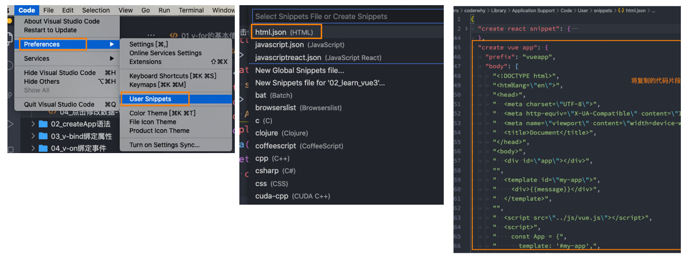

# 一. Mustache 语法

---

## 1. VSCode 代码片段

- 我们在前面练习 `Vue` 的过程中，有些代码片段是需要经常写的

- 我们在 `VSCode` 中我们可以生成一个代码片段，方便我们快速生成

- `VSCode` 中的代码片段有固定的格式，所以我们一般会借助于一个在线工具来完成

- 具体的步骤如下：

  - 第一步，复制自己需要生成代码片段的代码
  
  - 第二步，https://snippet-generator.app/ 在该网站中生成代码片段

  - 第三步，在 `VSCode` 中配置代码片段
  
    
  

## 2. 认识模板语法

- `React` 的开发模式：
  - `React` 使用的 `jsx`，所以对应的代码都是编写的类似于 `js` 的一种语法
  - 之后通过 `Babel` 将 `jsx` 编译成 `React.createElement` 函数调用
- `Vue` 也支持 `jsx` 的开发模式：
  - 但是大多数情况下，使用基于 `HTML` 的模板语法
  - 在模板中，允许开发者以声明式的方式将 `DOM` 和底层组件实例的数据绑定在一起
  - 在底层的实现中，`Vue` 将模板编译成虚拟 `DOM` 渲染函数
- 所以，对于学习 `Vue` 来说，学习模板语法是非常重要的

## 3. Mustache 双大括号语法

- 如果我们希望把数据显示到模板 `template` 中，使用最多的语法是 `Mustache` 语法 (双大括号) 的文本插值

  - 并且我们前面提到过，**`data` 返回的对象是有添加到 `Vue` 的响应式系统中**
  - 当 `data` 中的数据发生改变时，对应的内容也会发生更新
  - 当然，`Mustache` 中不仅仅可以是 `data` 中的属性，也可以是一个 `js` 表达式

  ```vue
  // 1.基本使用
  <h2>{{ message }}</h2>
  <h2>当前计数: {{ counter }}</h2>
  
  // 2.表达式
  <h2>计数双倍: {{ counter * 2 }}</h2>
  <h2>展示信息: {{ info.split(' ') }}</h2>
  
  // 3.三元运算符
  <h2>年龄{{ age >= 18 ? '大于' : '小于' }}18岁</h2>
  
  // 4.调用 methods 中函数
  <h2>{{ sayHello(age) }}</h2>
  
  // 5.错误写法: 这是一个赋值语句，不是表达式
  <h2>{{ const msg = 'hello' }}</h2>
  // 6.错误写法: if语句也是不支持的
  <h2>{{ if(age) return '123' }}</h2>
  ```


# 二. 常见的基本指令

---

## 1. v-once 指令

- **`v-once` 用于指定元素 或者 组件只渲染一次**：

  - 当数据发生变化时，元素或者组件以及其所有的子元素将视为静态内容并且跳过
  - 该指令可以用于性能优化

- **包含的子节点也只会渲染一次**：

  ```vue
  // message或counter发生改变时，v-once绑定的元素及其子节点都只会渲染一次
  <h2 v-once> 
    {{message}}
    <span>{{counter}}</span>
  </h2>
  
  // 这里的 h2元素 会重新渲染
  <h2>{{counter}}</h2> 
  ```

## 2. v-text 指令

- **用于更新元素的 `textContent`**：

  ```vue
  <h2>{{message}}</h2>
  <h2 v-text="message"></h2>
  ```

## 3. v-html 指令

- 默认情况下，如果我们展示的内容本身是 `html` 的，那么 `vue` 并不会对其进行特殊的解析

  - 如果我们希望这个内容被 `Vue` 可以解析出来，那么可以使用 `v-html` 来展示

  ```html
  <div id="app">
    <h2>{{content}}</h2> // 不被解析 直接显式字符串内容
    <h2 v-html="content">{{content}}</h2> // 当成Html元素去解析
  </div>  
  <script src="https://unpkg.com/vue@next"></script>
  <script>
    const app = Vue.createApp({ // 创建app
      data: function() {
        return {
          content: `<span style="color: red; font-size: 30px;">哈哈</span>`
        }
      }
    })
    app.mount('#app') // 挂载app
  </script>
  ```

## 4. v-pre 指令

- `v-pre` 用于**跳过元素和它的子元素的编译过程，显示原始的 `Mustache` 标签**：

  - 跳过不需要编译的节点，加快编译的速度

  ```vue
  // 该div元素及其后代元素都不会被编译
  <div v-pre> 
    <h2>{{message}}</h2>
    <p>当前计数: {{counter}}</p>
    <p>{{}}</p>
  </div>
  ```

## 5. v-cloak 指令

- 这个指令保持在元素上直到关联组件实例结束编译

  - 和 `CSS` 规则如 `[v-cloak] { display: none }` 一起用时，这个指令可以**隐藏未编译的 `Mustache` 标签直到组件实例准备完毕**

  ```html
  <style>
    [v-cloak] {
      display: none;
    }
  </style>
  
  <div id="app">
    // 隐藏未编译的`Mustache`标签直到组件实例准备完毕
    <h2 v-cloak>{{message}}</h2> 
  </div>
  ```

## 6. v-memo 指令

```vue
// 只有name属性发生改变时，才会更新对应的元素
<div v-memo="[name]"> 
  <h2>姓名：{{name}}</h2>
  <h2>年龄：{{age}}</h2>
  <h2>身高：{{height}}</h2>
</div>
<button @click="updateInfo">改变信息</button>
```


# 三. v-bind 绑定属性

---

## 1. v-bind 的绑定属性

- 前面讲的一系列指令，主要是将值插入到模板内容中
- 但是，除了内容需要动态来决定外，某些属性我们也希望动态来绑定
  - 比如动态绑定 `a` 元素的 `href` 属性
  - 比如动态绑定 `img` 元素的 `src` 属性
- 绑定属性我们使用 `v-bind`：
  - 缩写：`:`
  - 预期：`any (with argument)` | `Object (without argument)`
  - 参数：`attrOrProp (optional)`
  - 修饰符：
    - `.camel -` 将 `kebab-case attribute` 名转换为 `camelCase`
  - 用法：动态地绑定一个或多个 `attribute`，或一个组件 `prop` 到表达式

## 2. 绑定基本属性

- `v-bind` 用于绑定一个或多个属性值，或者向另一个组件传递 `props` 值

- 在开发中，有哪些属性需要动态进行绑定呢？

  - 还是有很多的，比如图片的链接 `src`、网站的链接 `href`、动态绑定一些类、样式等等

- `v-bind` 有一个对应的语法糖，也就是简写方式

- 在开发中，我们通常会使用语法糖的形式，因为这样更加简洁

  ```html
  <div id="app">
    // 1.绑定img的src属性
    
    // 2.绑定a的href属性
    // v-bind: 语法糖 => :
    <a :href="href">Vue.js</a>
    <button @click="swicthImg">切换图片</button>
  </div>  
  <script>
    const app = Vue.createApp({ // 创建app
      data: function() {
        return {
          imgUrl1: 'https://webpack.docschina.org/site-logo.1fcab817090e78435061.svg',
          imgUrl2: 'https://v3.cn.vuejs.org/logo.png',
          imgUrl: 'https://v3.cn.vuejs.org/logo.png',
          href: 'https://v3.cn.vuejs.org/'
        }
      },
      methods: {
        swicthImg: function() {
          this.imgUrl = this.imgUrl == this.imgUrl2 ? this.imgUrl1 : this.imgUrl2
        }
      }
    })
    app.mount('#app') // 挂载app
  </script>
  ```

## 3. 绑定 class 介绍

- 在开发中，有时候我们的元素 `class` 也是动态的，比如：
  - 当数据为某个状态时，字体显示红色
  - 当数据另一个状态时，字体显示黑色
- 绑定 `class` 有两种方式：
  - 对象语法
  - 数组语法

## 4. 绑定 class – 对象语法

- 对象语法：我们可以传给 `:class` （`v-bind:class` 的简写）一个对象，以动态地切换 `class`

  ```html
  <style>
    .active { color: skyblue; }
    .fs30 { font-size: 30px; }
  </style>
  <div id="app">
    // 1.基本绑定class
    <h2 :class="classes">{{message}}</h2>
    // 2.动态class可以写成对象语法
    // 对象语法 - 基本使用
    <button :class="{active: isActive}"></button>
    // 对象语法的 - 键值对
    <button :class="{active: isActive, fs30: isActive}"></button>
    // 动态绑定的class可以和普通class一起使用
    <button class="fs30" :class="{active: isActive}"></button>
    // 动态绑定class可以调用方法
    <button :class="getClasses()"></button>
    // 三元表达式
    <button :class="isActive ? 'active' : ''"></button>
  </div>  
  <script>
    const app = Vue.createApp({
      data: function() {
        return {
          classes: "a b c",
          isActive: false,
          classes2: {
            active: this.isActive, 
            fs30: this.isActive
          }
        }
      },
      methods: {
        getClasses: function() {
          return {
            active: this.isActive, 
            fs30: this.isActive
          }
        }
      }
    })
    app.mount('#app')
  </script>
  ```

## 5. 绑定 class – 数组语法

- 数组语法：我们可以把一个数组传给 `:class`，以应用一个 `class` 列表

  ```html
  <div id="app">
    <h2 :class="['abc', 'cba', className]">h2</h2>
    <h2 :class="[isActive ? 'aaa' : 'bbb']">h2</h2>
    <h2 :class="[{active: isActive}]">h2</h2>
  </div>  
  <script>
    const app = Vue.createApp({
      data: function() {
        return {
          className: 'nba',
          isActive: true
        }
      }
    })
    app.mount('#app')
  </script>
  ```

## 6. 绑定 style 介绍

- 我们可以利用 `v-bind:style` 来绑定一些 `CSS` 内联样式：
  - 这次因为某些样式我们需要根据数据动态来决定
  - 比如某段文字的颜色，大小等等
- `CSS property` 名可以用驼峰式（`camelCase`）或 短横线分隔（`kebab-case`，记得用引号括起来）来命名
- 绑定 `style` 有两种方式：
  - 对象语法
  - 数组语法

## 7. 绑定 style 演练

```html
<div id="app">
  <h2 style="color: red"></h2>
  <h2 :style="styleString"></h2>
  <h2 :style="styleObj"></h2>
  // 对象语法
  <h2 :style="{color: fontColor}"></h2>
  <h2 :style="{'font-size': '30px'}"></h2>
  <h2 :style="{fontSize: '30px'}"></h2>
  <h2 :style="{fontSize: fontSize}"></h2>
  // 数组语法 可以将多个样式对象应用到同一个元素上
  <h2 :style="[styleObj, {fontSize: '39px'}]"></h2>
  <!-- 错误写法 -->
  <h2 :style="color: fontColor"></h2>
  <h2 :style="{font-size: '30px'}"></h2>
</div>  
<script>
  const app = Vue.createApp({
    data: function() {
      return {
        fontColor: "pink",
        fontSize: 30,
        styleString: 'color: red',
        styleObj: {
          color: 'skyblue'
        }
      }
    }
  })
  app.mount('#app')
</script>
```

## 8. 动态绑定属性

- 在某些情况下，我们属性的名称可能也不是固定的：

  - 前端我们无论绑定 `src`、`href`、`class`、`style`，属性名称都是固定的
  - 如果属性名称不是固定的，我们可以使用 `:[属性名]="值"` 的格式来定义
  - 这种绑定的方式，我们称之为动态绑定属性

  ```html
  <div id="app">
    <h2 :[name]="value"></h2>
  </div>  
  <script>
    const app = Vue.createApp({
      data: function() {
        return {
          name: 'abc',
          value: '123'
        }
      }
    })
    app.mount('#app')
  </script>
  ```

## 9. 绑定一个对象

- 如果我们希望将一个对象的所有属性，绑定到元素上的所有属性，应该怎么做呢？

  - 非常简单，我们可以直接使用 `v-bind` 绑定一个 对象

- 案例：`info` 对象会被拆解成 `div` 的各个属性

  ```html
  <div id="app">
    <h2 :name="name" :age="age"></h2>
    // v-bind绑定对象: 给组件传递参数
    <h2 :="infos"></h2>
  </div>  
  <script>
    const app = Vue.createApp({
      data: function() {
        return {
          name: 'later',
          age: 18,
          infos: {
            name: 'later',
            age: 18
          }
        }
      }
    })
    app.mount('#app')
  </script>
  ```


# 四. v-on 绑定事件

---

## 1. v-on 绑定事件

- 前面我们绑定了元素的内容和属性，在前端开发中另外一个非常重要的特性就是交互
- 在前端开发中，我们需要经常和用户进行各种各样的交互：
  - 这个时候，我们就必须监听用户发生的事件，比如点击、拖拽、键盘事件等等
  - 在 `Vue` 中如何监听事件呢？使用 `v-on` 指令
- 接下来我们来看一下 `v-on` 的用法：

## 2. v-on 的用法

- `v-on` 的使用：
  - 缩写：`@`
  - 预期：`Function` | `Inline Statement` | `Object`
  - 参数：`event`
  - 修饰符：
    - `.stop`：调用 `event.stopPropagation()`
    - `.prevent`：调用 `event.preventDefault()`
    - `.capture`：添加事件侦听器时使用 `capture` 捕获模式
    - `.self`：只当事件是从侦听器绑定的元素本身触发时才触发回调
    - `.{keyAlias}`：仅当事件是从特定键触发时才触发回调
    - `.once`：只触发一次回调
    - `.left`：只当点击鼠标左键时触发
    - `.right`：只当点击鼠标右键时触发
    - `.middle`：只当点击鼠标中键时触发
    - `.passive`：`{ passive: true }` 模式添加侦听器
  - 用法：绑定事件监听

## 3. v-on 的基本使用

- 我们可以使用 `v-on` 来监听一下点击的事件

- `v-on:click` 可以写成 `@click`，是它的语法糖写法

- 当然，我们也可以绑定其他的事件

- 如果我们希望一个元素绑定多个事件，这个时候可以传入一个对象

  ```html
  <div id="app">
    <!-- 1.基本写法 -->
    <h2 class="box" v-on:click="clickHandler"></h2>
    <!-- 2.语法糖写法 -->
    <h2 class="box" @click="clickHandler"></h2>
    <!-- 3.绑定的方法位置，也可以写成一个表达式(不推荐) -->
    <h2>{{ counter }}</h2>
    <button @click="add">+1</button>
    <button @click="counter++">+1</button>
    <!-- 4.绑定其他方法 -->
    <h2 class="box" @mousemove="moveHandler"></h2>
    <!-- 5.绑定多个事件 -->
    <h2 class="box" @click="clickHandler" @mousemove="moveHandler"></h2>
    <h2 class="box" v-on="{click: clickHandler, mousemove: moveHandler}"></h2>
    <h2 class="box" @="{click: clickHandler, mousemove: moveHandler}"></h2>
  </div>  
  <script>
    const app = Vue.createApp({
      data: function() {
        return {
          counter: 0
        }
      },
      methods: {
        clickHandler() { console.log('click') },
        add() { this.counter++ },
        moveHandler() { console.log('mousemove') },
      },
    })
    app.mount('#app')
  </script>
  ```

## 4. v-on 参数传递

- 当通过 `methods` 中定义方法，以供 `@click` 调用时，需要注意参数问题：

- 情况一：如果该方法不需要额外参数，那么方法后的 `()` 可以不添加

  - 但是注意：如果方法本身中有一个参数，那么会默认将原生事件 `event` 参数传递进去

- 情况二：如果需要同时传入某个参数，同时需要明确获取 `event` 时，**可以通过 `$event` 传入事件对象**

  ```html
  <div id="app">
    <button @click="btn1Click">按钮1</button>
    <button @click="btn2Click('later', age)">按钮2</button>
    <!-- 在模板中，想要明确获取event对象：$event -->
    <button @click="btn3Click('later', age, $event)">按钮3</button>
  </div>  
  <script>
    const app = Vue.createApp({ // 创建app
      data: function() {
        return {
          message: 'hello Vue',
          age: 18
        }
      },
      methods: {
        // 1.默认参数: event对象
        // 总结：如果在绑定事件的时候，没用传递任何的参数，那么event对象会被默认传递进来
        btn1Click(event) { console.log('btn1 click: ', event) },
        // 2.明确参数，覆盖默认参数event对象
        btn2Click(name, age) { console.log('btn2 click: ', name, age) },
        // 2.明确参数 + event对象
        btn3Click(name, age, event) { console.log('btn3 click: ', name, age, event) }
      },
    })
    app.mount('#app')
  </script>

## 5. v-on 的修饰符

- `v-on` 支持修饰符，修饰符相当于对事件进行了一些特殊的处理：

  - `.stop`：调用 `event.stopPropagation()`
  - `.prevent`：调用`event.preventDefault()`
  - `.capture`：添加事件侦听器时使用 `capture` 捕获模式
  - `.self`：只当事件是从侦听器绑定的元素本身触发时才触发回调
  - `.{keyAlias}`：仅当事件是从特定键触发时才触发回调
  - `.once`：只触发一次回调
  - `.left`：只当点击鼠标左键时触发
  - `.right`：只当点击鼠标右键时触发
  - `.middle`：只当点击鼠标中键时触发
  - `.passive`：`{ passive: true }` 模式添加侦听器

  ```html
  <style>
    .box {width: 100px;height: 100px;background-color: orange;}
  </style>
  <div id="app">
    <div class="box" @click="divClick">
      <button @click.stop="btnClick">按钮</button>
    </div>
  </div>
  <script>
    const app = Vue.createApp({
      data: function() {
        return {
          message: "Hello Vue"
        }
      },
      methods: {
        btnClick(event) { console.log("btnClick") },
        divClick() { console.log("divClick") }
      }
    })
    app.mount("#app")
  </script>
  ```


# 五. Vue 的条件渲染

---

## 1. 条件渲染

- 在某些情况下，我们需要根据当前的条件决定某些元素或组件是否渲染，这个时候我们就需要进行条件判断了
- `Vue` 提供了下面的指令来进行条件判断：
  - `v-if`
  - `v-else`
  - `v-else-if`
  - `v-show`

## 2. v-if、v-else、v-else-if

- `v-if`、`v-else`、`v-else-if` 用于根据条件来渲染某一块的内容：

  - 这些内容只有在条件为 `true` 时，才会被渲染出来
  - 这三个指令与 `js` 的条件语句 `if`、`else`、`else if` 类似

- `v-if` 的渲染原理：

  - `v-if` 是惰性的
  - 当条件为 `false` 时，其判断的内容完全不会被渲染或者会被销毁掉
  - 当条件为 `true` 时，才会真正渲染条件块中的内容

  ```html
  <div id="app">
    <h1 v-if="score > 90">优秀</h1>
    <h2 v-else-if="score > 80">良好</h2>
    <h3 v-else-if="score >= 60">及格</h3>
    <h4 v-else>不及格</h4>
  </div>
  <script>
    const app = Vue.createApp({
      data() {
        return {
          score: 40
        }
      },
    })
    app.mount("#app")
  </script>
  ```

## 3. template 元素

- 因为 `v-if` 是一个指令，所以必须将其添加到一个元素上：

  - 但是如果我们希望切换的是多个元素呢？
  - 此时我们渲染 `div`，但是我们并不希望 `div` 这种元素被渲染
  - 这个时候，我们可以选择使用 `template`

- **`template` 元素可以当做不可见的包裹元素**，并且在 `v-if` 上使用，但是 **最终 `template` 不会被渲染出来**：

  - 有点**类似于小程序中的 `block`**

  ```html
  <div id="app">
    <template v-if="Object.keys(info).length">
      <h2>个人信息</h2>
      <ul>
        <li>姓名: {{info.name}}</li>
        <li>年龄: {{info.age}}</li>
      </ul>
    </template>
    <template v-else>
      <h2>没有输入个人信息</h2>
      <p>请输入个人信息后, 再进行展示~</p>
    </template>
  </div>
  <script>
    const app = Vue.createApp({
      data() {
        return {
          info: { name: "why", age: 18 }
        }
      }
    })
    app.mount("#app")
  </script>
  ```

## 4. v-show

- `v-show` 和 `v-if` 的用法看起来是一致的，也是根据一个条件决定是否显示元素或者组件：

  ```html
  <style>
    img { width: 200px; height: 200px; }
  </style>
  <div id="app">
    <div>
      <button @click="toggle">切换</button>
    </div>
    <div v-show="isShowCode">
      
    </div>
    <div v-if="isShowCode">
      
    </div>
  </div>
  <script>
    const app = Vue.createApp({
      data() {
        return {
          isShowCode: true
        }
      },
      methods: {
        toggle() { this.isShowCode = !this.isShowCode }
      }
    })
    app.mount("#app")
  </script>
  ```

## 5. v-show 和 v-if 的区别

- 首先，在用法上的区别：
  - `v-show` 是不支持 `template`
  - `v-show` 不可以和 `v-else` 一起使用
- 其次，本质的区别：
  - `v-show` 元素无论是否需要显示到浏览器上，它的 `DOM` 实际都是有存在的，只是通过 `CSS` 的 `display` 属性来进行切换
  - `v-if` 当条件为 `false` 时，其对应的原生压根不会被渲染到 `DOM` 中
- 开发中如何进行选择呢？
  - 如果我们的原生需要在显示和隐藏之间频繁的切换，那么使用 `v-show`
  - 如果不会频繁的发生切换，那么使用 `v-if`

