# 一. Vue 组件的嵌套关系

---

## 1. 认识组件的嵌套

- 前面我们是将所有的逻辑放到一个 `App.vue` 中：

  - 在之前的案例中，我们只是创建了一个组件 `App`
  - 如果我们一个应用程序将所有的逻辑都放在一个组件中，那么这个组件就会变成非常的臃肿和难以维护
  - 所以组件化的核心思想应该是对组件进行拆分，拆分成一个个小的组件
  - 再将这些组件组合嵌套在一起，最终形成我们的应用程序

- 我们来分析一下下面代码的嵌套逻辑，假如我们将所有的代码逻辑都放到一个 `App.vue` 组件中：

  - 我们会发现，将所有的代码逻辑全部放到一个组件中，代码是非常的臃肿和难以维护的
  
  - 并且在真实开发中，我们会有更多的内容和代码逻辑，对于扩展性和可维护性来说都是非常差的

  - 所以，在真实的开发中，我们会对组件进行拆分，拆分成一个个功能的小组件
  
    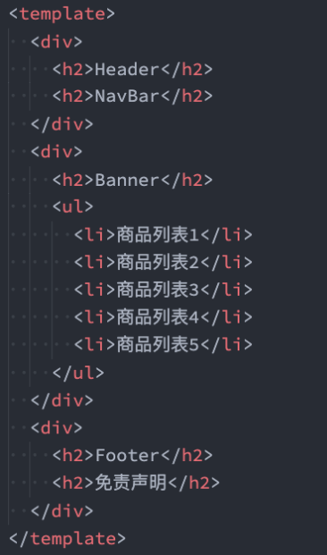
  

## 2. 组件的拆分

- 我们可以按照如下的方式进行拆分：

  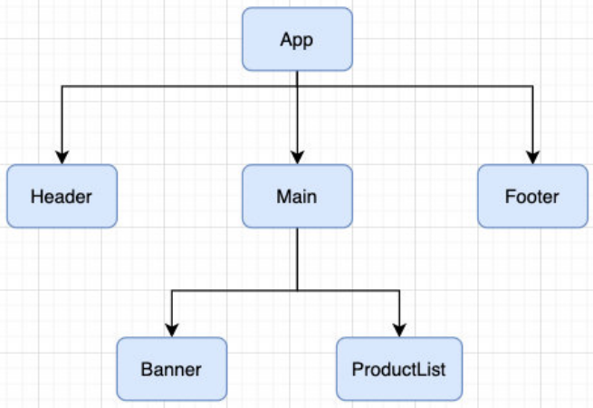

- 按照如上的拆分方式后，我们开发对应的逻辑只需要去对应的组件编写就可

## 3. 组件的通信

- 上面的嵌套逻辑如下，它们存在如下关系：

  - `App` 组件是 `Header`、`Main`、`Footer` 组件的父组件
  - `Main` 组件是 `Banner`、`ProductList` 组件的父组件

- 在开发过程中，我们会经常遇到需要组件之间相互进行通信： 

  - 比如 `App` 可能使用了多个 `Header`，每个地方的 `Header` 展示的内容不同，那么我们就需要使用者传递给 `Header` 一些数据，让其进行展示

  - 又比如我们在 `Main` 中一次性请求了 `Banner` 数据和 `ProductList` 数据，那么就需要传递给它们来进行展示
  - 也可能是子组件中发生了事件，需要由父组件来完成某些操作，那就需要子组件向父组件传递事件
  
- 总之，在一个 `Vue` 项目中，组件之间的通信是非常重要的环节，所以接下来我们就具体学习一下组件之间是如何相互之间传递数据的


# 二. 父组件传递子组件

---

## 1. 父子组件之间通信的方式

- 父子组件之间如何进行通信呢？

  - **父 => 子：通过 `props` 属性**
  
  - **子 => 父：通过 `$emit` 触发事件**
  
    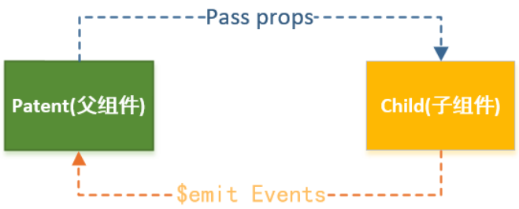
  

## 2. 父组件传递给子组件

- 在开发中很常见的就是父子组件之间通信，比如父组件有一些数据，需要子组件来进行展示：
  - 这个时候我们可以通过 `props` 来完成组件之间的通信
- 什么是 `Props` 呢？
  - `Props` 是你可以在组件上注册一些自定义的 `attribute`
  - 父组件给这些 `attribute` 赋值，子组件通过 `attribute` 的名称获取到对应的值
- **`Props` 有两种常见的用法**：
  - **方式一：字符串数组**，数组中的字符串就是 `attribute` 的名称
  - **方式二：对象类型**，对象类型我们可以在指定 `attribute` 名称的同时，指定它需要传递的类型、是否是必须的、默认值等等

## 3. Props 的数组用法

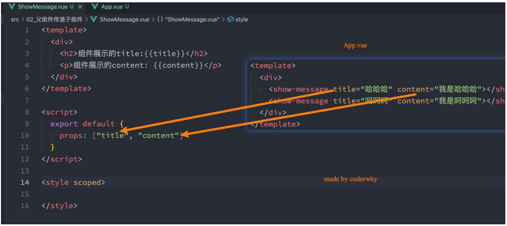

## 4. Props 的对象用法

- 数组用法中我们只能说明传入的 `attribute` 的名称，并不能对其进行任何形式的限制

- 接下来我们来看一下对象的写法是如何让我们的 `props` 变得更加完善的

- 当使用对象语法的时候，我们可以对传入的内容限制更多：

  - 比如指定传入的 `attribute` 的类型
  
  - 比如指定传入的 `attribute` 是否是必传的

  - 比如指定没有传入时，`attribute` 的默认值
  
    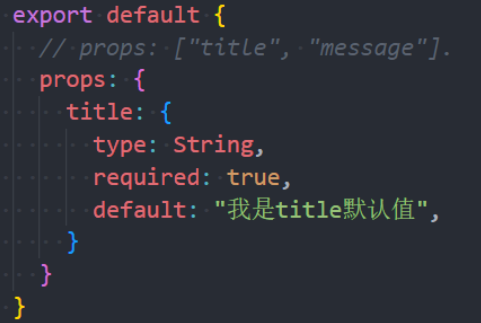
  

## 5. 细节一：那么 type 的类型都可以是哪些呢？

- 那么 `type` 的类型都可以是哪些呢？
  - `String`
  - `Number`
  - `Boolean`
  - `Array`
  - `Object`
  - `Date`
  - `Function`
  - `Symbol`

## 6. 细节二：对象类型的其他写法

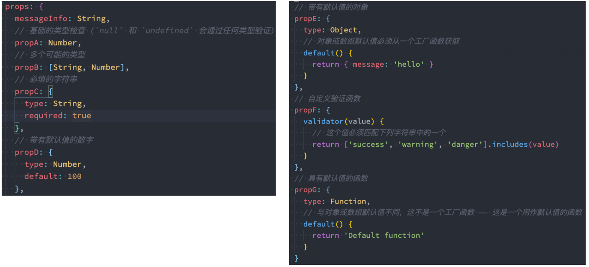

## 7. 细节三：Prop 的大小写命名

- `Prop` 的大小写命名（`camelCase vs kebab-case`）

  - `HTML` 中的 `attribute` 名是大小写不敏感的，所以浏览器会把所有大写字符解析为小写字符
  
  - 这意味着当你使用 `DOM` 中的模板时，`camelCase`（驼峰命名法）的 `prop` 名需要使用其等价的 `kebab-case`（短横线分隔命名）命名
  
  - 而在 `.vue` 文件中，为了和 `HTML attribute` 对齐，我们通常会将其写为 `kebab-case` 形式
  
    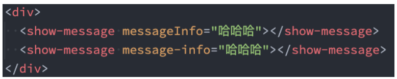
  


# 三. 非 props 的 attribute

---

## 1. 非 Prop 的 Attribute

- 什么是非 `Prop` 的 `Attribute` 呢？
  - 当我们**传递给组件某个属性，但是该属性并没有定义对应的 `props` 或者 `emits` 时，就称之为非 `Prop` 的 `Attribute`**
  - 常见的包括 `class`、`style`、`id`、`@click` 属性等
- `Attribute` 继承
  - **当组件有单个根节点时，非 `Prop` 的 `Attribute` 将自动添加到根节点的 `Attribute` 中**：


## 2. 禁用 Attribute 继承和多个根节点

- 如果我们不希望组件的根元素继承 `attribute`，可以在组件中设置 `inheritAttrs: false`： 

  - 禁用 `attribute` 继承的常见情况是需要将 `attribute` 应用于根元素之外的其他元素

  - 我们可以**通过 ` $attrs` 来访问所有的非 `props` 的 `attribute`**

    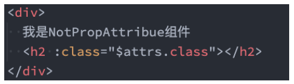

- 多个根节点的 `attribute`

  - **多个根节点的 `attribute` 如果没有显示绑定的话，会报警告**

  - **必须手动的指定要绑定到哪一个属性上**：
  
    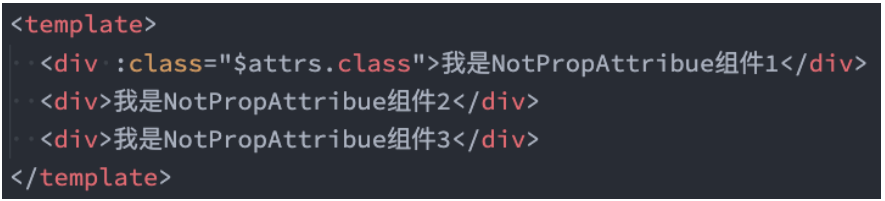
  


# 四. 子组件传递父组件

---

## 1. 子组件传递给父组件

- 什么情况下子组件需要传递内容到父组件呢？
  - 当子组件有一些事件发生的时候，比如在组件中发生了点击，父组件需要切换内容
  - 子组件有一些内容想要传递给父组件的时候
- 我们如何完成上面的操作呢？
  - 首先，我们需要在子组件中定义好在某些情况下触发的事件名称
  - 其次，在父组件中以 `v-on` 的方式传入要监听的事件名称，并且绑定到对应的方法中
  - 最后，在子组件中发生某个事件的时候，根据事件名称触发对应的事件

## 2. 自定义事件的流程

- 我们封装一个 `CounterOperation.vue` 的组件：

  - 内部其实是监听两个按钮的点击，点击之后通过 `this.$emit` 的方式发出去事件
  
  - `emits` 写上，会有更好的代码提示
  
    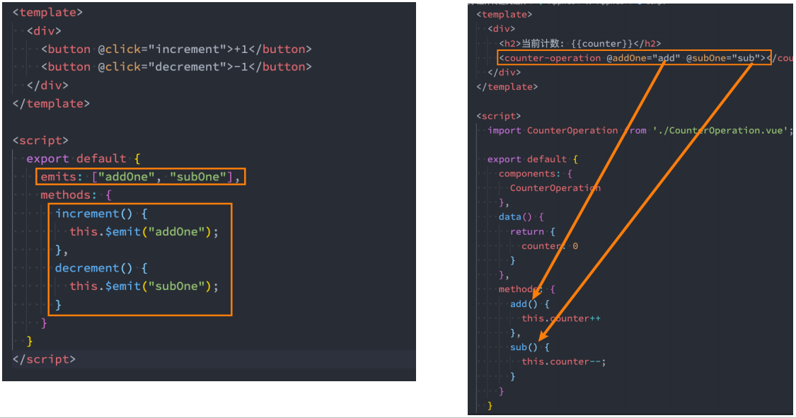
  

## 2. 自定义事件的参数和验证

- 自定义事件的时候，我们也可以传递一些参数给父组件：

  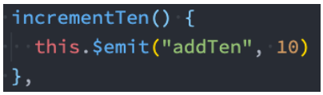

- 在 `vue3` 当中，我们可以对传递的参数进行验证：

  - `null`：不验证
  
  - `return false`：验证失败
  
    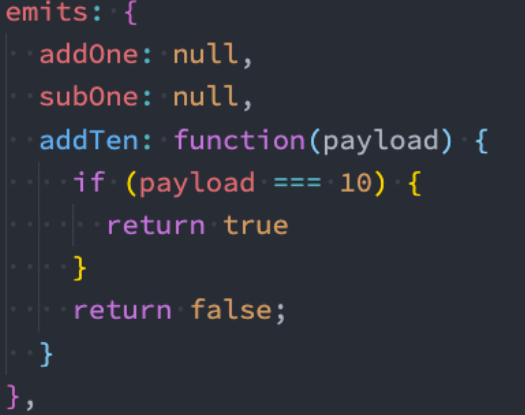
  

- 返回一个布尔值来表明事件是否合法：https://cn.vuejs.org/guide/components/events.html#events-validation


# 五. 组件通信案例

---

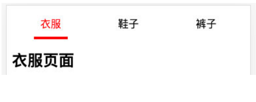

- 代码如下

  ```vue
  <! -- App.vue -->
  <template>
  <div class="container">
    <TabBar :titles="titles" @tabBarItemClick="activeHandler"></TabBar>
  </div>
  <h2>{{ this.titles[this.curIndex] }}页面</h2>
  </template>
  <script>
    import TabBar from './components/TabBar.vue'
    export default {
      components: {
        TabBar
      },
      data() {
        return {
          titles: ['衣服', '鞋子', '裤子', '帽子'],
          curIndex: 0,
        }
      },
      methods: {
        activeHandler(index) {
          this.curIndex = index
        }
      },
    }
  </script>
  <style scoped></style>
  ```

  ```vue
  <!-- TabBar.vue -->
  <template>
  <div class="container">
    <div class="item"
         v-for="(item, index) in titles" 
         :key="index"
         :class="{active: index==curIndex}"
         @click="itemClick(index)">
      <span>{{item}}</span>
    </div>
    </div>
  </template>
  <script>
    export default {
      props: {
        titles: {
          type: Array,
          default: () => []
        }
      },
      data() {
        return {
          curIndex: 0
        }
      },
      methods: {
        itemClick(index) {
          this.curIndex = index
          this.$emit('tabBarItemClick', index)
        }
      },
    }
  </script>
  <style scoped>
    .container {
      display: flex;
      height: 44px;
      line-height: 44px;
      text-align: center;
    }
    .item {
      flex: 1;
    }
    .item span {
      padding: 10px 10px;
    }
    .item.active span {
      color: red;
      border-bottom: 4px red solid;
    }
  </style>
  ```


