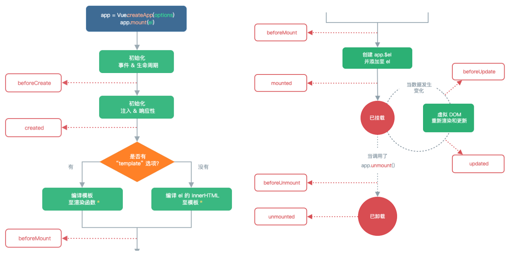
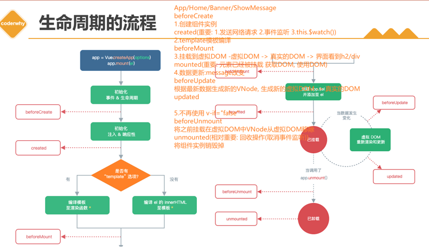
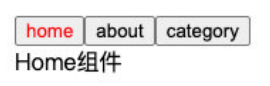
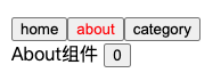
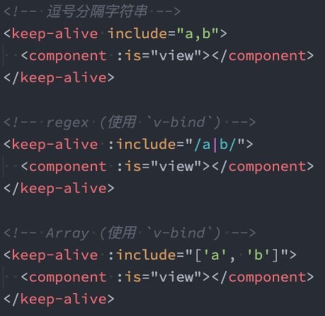
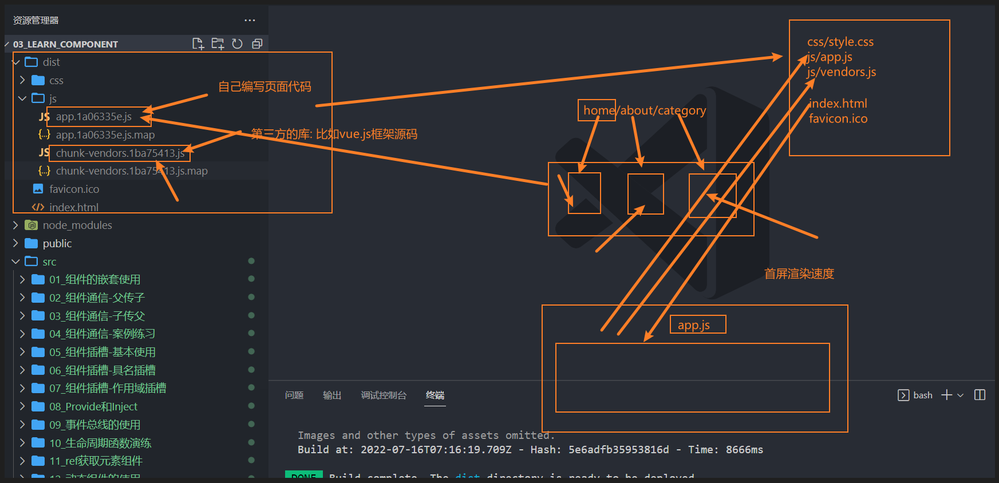
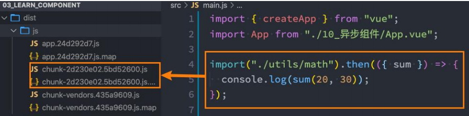

# 一. 组件的生命周期

---

## 1. 认识生命周期

- 什么是生命周期呢？
  - 生物学上，生物生命周期指得是一个生物体在生命开始到结束周而复始所历经的一系列变化过程
  - 每个组件都可能会经历从创建、挂载、更新、卸载等一系列的过程
  - 在这个过程中的某一个阶段，我们可能会想要添加一些属于自己的代码逻辑（比如组件创建完后就请求一些服务器数据）
  - 但是我们如何可以知道目前组件正在哪一个过程呢？`Vue` 给我们提供了组件的生命周期函数
- 生命周期函数：
  - **生命周期函数是一些钩子函数（回调函数），在某个时间会被 `Vue` 源码内部进行回调**
  - 通过对生命周期函数的回调，我们可以知道目前组件正在经历什么阶段
  - 那么我们就可以在该生命周期中编写属于自己的逻辑代码了

## 2. 生命周期的流程



- 生命周期的历程

  

- 代码如下：

  ```js
  export default {
    // 1.组件被创建之前
    beforeCreate() { },
    // 2.组件已经创建完成
    created() {
      console.log("发送网络请求, 请求数据")
      console.log("监听eventbus事件")
      console.log("监听watch数据")
    },
    // 3.组件template准备被挂载
    beforeMount() { },
    // 4.组件template已经挂载: 虚拟DOM -> 真实DOM
    mounted() {
      console.log("获取DOM")
      console.log("使用DOM")
    },
    // 5.数据发生改变
    // 5.1. 准备更新DOM
    beforeUpdate() { },
    // 5.2. 更新DOM
    updated() { },
    // 6.卸载VNode -> DOM元素
    // 6.1.卸载之前
    beforeUnmount() { },
    // 6.2.DOM元素已经卸载完成
    unmounted() { }
  }
  ```
  

>**补充：**
>
>- **所有生命周期钩子函数的 `this` 上下文都会自动指向当前调用它的组件实例**
>- **如果用箭头函数来定义生命周期钩子，将无法在函数中通过 `this` 获取组件实例**

## 3. 生命周期选项

- `beforeCreate`

  - 在组件实例初始化完成、`props` 解析之后、`data()` 和 `computed` 等选项处理之前立即调用

    > **注意：**
    >
    > - **组合式 API 中的 `setup()` 钩子会在所有选项式 `API` 钩子之前调用，`beforeCreate()` 也不例外**

- `created`

  - 当这个钩子被调用时，以下内容已经设置完成：响应式数据、计算属性、方法和侦听器
  - 此时挂载阶段还未开始，因此 `$el` 属性仍不可用

- `beforeMount`

  - 当这个钩子被调用时，组件已经完成了其响应式状态的设置
  - 但还没有创建 `DOM` 节点。它即将首次执行 `DOM` 渲染过程

- `mounted`

  - 组件在以下情况下被视为已挂载：
    - 所有同步子组件都已经被挂载（不包含异步组件或 `<Suspense>` 树内的组件）
    - 其自身的 `DOM` 树已经创建完成并插入了父容器中。注意仅当根容器在文档中时，才可以保证组件 `DOM` 树也在文档中
    - 这个钩子通常用于执行需要访问组件所渲染的 `DOM` 树相关的副作用，或是在[服务端渲染应用](https://cn.vuejs.org/guide/scaling-up/ssr.html)中用于确保 `DOM` 相关代码仅在客户端被调用

- `beforeUpdate`

  - 这个钩子可以用来在 `Vue` 更新 `DOM` 之前访问 `DOM` 状态。在这个钩子中更改状态也是安全的

- `updated`

  - 父组件的更新钩子将在其子组件的更新钩子之后调用

  - 这个钩子会在组件的任意 `DOM` 更新后被调用，这些更新可能是由不同的状态变更导致的。如果你需要在某个特定的状态更改后访问更新后的 `DOM`，请使用 [nextTick()](https://cn.vuejs.org/api/general.html#nexttick) 作为替代

    > **不要在 `updated` 钩子中更改组件的状态，这可能会导致无限的更新循环！**

- `beforeUnmount`
  - 当这个钩子被调用时，组件实例依然还保有全部的功能
- `unmounted`
  - 一个组件在以下情况下被视为已卸载：
    - 其所有子组件都已经被卸载
    - 所有相关的响应式作用（渲染作用以及 `setup()` 时创建的计算属性和侦听器）都已经停止
  - 可以在这个钩子中手动清理一些副作用，例如计时器、`DOM` 事件监听器或者与服务器的连接
- `activated`
  - 若组件实例是 `<KeepAlive>` 缓存树的一部分，当组件被插入到 `DOM` 中时调用
- `deactivated`
  - 若组件实例是 `<KeepAlive>` 缓存树的一部分，当组件从 `DOM` 中被移除时调用


# 二. 组件中的 ref 引用

---

## 1. $refs 的使用

- 某些情况下，我们在组件中想要直接获取到元素对象或者子组件实例： 

  - 在 `Vue` 开发中我们是不推荐进行 `DOM` 操作的
  - 这个时候，我们可以给元素或者组件绑定一个 `ref` 的 `attribute` 属性

- 组件实例有一个 `$refs` 属性：

  - 它一个对象 `Object`，持有注册过 `ref attribute` 的所有 `DOM` 元素和组件实例

    > **注意：**
    >
    > - **只可以在 组件挂载后 才能访问模板引用**
    > - **在模板中的表达式上访问 `$refs.input`，在初次渲染时会是 `null`。这是因为在初次渲染前这个元素还不存在呢！**
  
  ```js
  visitElement() {
  	// 访问元素
    this.$refs.title
    // 访问<helloCpn>组件实例
    this.$refs.helloCpn.$el
    // 访问组件实例
    this.$refs.helloCpn.showMessage()
  }
  ```

## 2. $parent 和 $root

- 通过 `$parent` 属性来访问父元素

- 根实例可以通过 `$root` 属性进行访问，所有的子组件都可以将这个实例作为一个全局 `store` 来访问或使用

- `HelloWorld.vue` 的实现：

  - 这里我们也可以通过 `$root` 来实现，因为 `App` 是我们的根组件

    ```js
    visitParent() {
      // 访问父组件实例上的数据
      this.$parent.message
      // 访问根组件实例上的数据
      this.$root.message
    }
    ```

- 注意：在 `Vue3` 中已经移除了 `$children` 的属性，所以不可以使用了

  ```vue
  <template>
  <div class="app">
    <h2 ref="title"></h2>
    <button ref="btn" @click="changeTitle">修改title</button>
    <banner ref="banner"/>
    </div>
  </template>
  <script>
    import Banner from "./Banner.vue"
    export default {
      components: { Banner },  
      data() { return { } },
      methods: {
        changeTitle() {
          // 1.不要主动的去获取DOM, 并且修改DOM内容
          // this.message = "你好啊, 李银河!"
          // this.titleColor = "blue"
  
          // 2.获取h2/button元素
          console.log(this.$refs.title)
          console.log(this.$refs.btn)
  
          // 3.获取banner组件: 组件实例
          console.log(this.$refs.banner)
  
          // 3.1.在父组件中可以主动的调用子组件的对象方法
          this.$refs.banner.bannerClick()
  
          // 3.2.获取banner组件实例, 获取banner中的元素
          console.log(this.$refs.banner.$el)
  
          // 3.3.如果banner template是多个根, 拿到的是第一个node节点
          // 注意: 开发中不推荐一个组件的template中有多个根元素
          // console.log(this.$refs.banner.$el.nextElementSibling)
  
          // 4.组件实例还有两个属性(了解):
          console.log(this.$parent) // 获取父组件
          console.log(this.$root) // 获取根组件 
        }
      }
    }
  </script>
  ```


# 三. 动态组件的使用

---

## 1. 切换组件案例

- 比如我们现在想要实现了一个功能：
  - 点击一个 `tab-bar`，切换不同的组件显示
  
    

- 这个案例我们可以通过两种不同的实现思路来实现：
  - 方式一：通过 `v-if` 来判断，显示不同的组件
  - 方式二：动态组件的方式

## 2. v-if 显示不同的组件

- 我们可以先通过 `v-if` 来判断显示不同的组件，这个可以使用我们之前讲过的知识来实现：

  ```vue
  <template>
    <div class="app">
      <div class="tabs">
        <template v-for="(item, index) in tabs" :key="item">
          <button :class="{ active: currentTab === item }" 
                  @click="itemClick(item)">
            {{ item }}
        </button>
      </template>
      </div>
      <div class="view">
        <!-- 1.第一种做法: v-if进行判断逻辑, 决定要显示哪一个组件 -->
        <template v-if="currentIndex === 0">
          <home></home>
            </template>
            <template v-else-if="currentIndex === 1">
          <about></about>
            </template>
            <template v-else-if="currentIndex === 2">
          <category></category>
        </template>
      </div>
    </div>
  </template>
  <script>
    import Home from './views/Home.vue'
    import About from './views/About.vue'
    import Category from './views/Category.vue'
    export default {
      components: {
        Home,
        About,
        Category
      },
      data() {
        return {
          tabs: ["home", "about", "category"],
          currentIndex: 0
        }
      },
      methods: {
        itemClick(tab) { this.currentTab = tab }
      }
    }
  </script>
  <style scoped>
    .active { color: red; }
  </style>
  ```

## 3. 动态组件的实现

- 动态组件是使用 `component` 组件，通过一个特殊的 `is` 属性来实现：

  ```vue
  <template>
    <div class="app">
      <div class="tabs">
        <template v-for="(item, index) in tabs" :key="item">
          <button :class="{ active: currentTab === item }" 
                  @click="itemClick(item)">
            {{ item }}
          </button>
        </template>
      </div>
      <div class="view">
        <!-- 2.第二种做法: 动态组件 component -->
        <!-- is中的组件需要来自两个地方: 1.全局注册的组件 2.局部注册的组件 -->
        <!-- <component :is="tabs[currentIndex]"></component> -->
        <component :is="currentTab"></component>
      </div>
    </div>
  </template>
  <script>
    import Home from './views/Home.vue'
    import About from './views/About.vue'
    import Category from './views/Category.vue'
    export default {
      components: {
        Home,
        About,
        Category
      },
      data() {
        return {
          tabs: ["home", "about", "category"],
          // currentIndex: 0
          currentTab: "home" // 允许小写
        }
      },
      methods: {
        itemClick(tab) { this.currentTab = tab }
      }
    }
  </script>
  <style scoped>
    .active { color: red; }
  </style>
  ```

- 这个 `currentTab` 的值需要是什么内容呢？

  - 全局注册：可以是通过 `component` 函数注册的组件
  - 局部注册：在一个组件对象的 `components` 对象中注册的组件

## 4. 动态组件的传值

- 如果是动态组件我们可以给它们传值和监听事件吗？

  - 也是一样的
  - 只是我们需要将属性和监听事件放到 `component` 上来使用

  ```vue
  <template>
    <component name="why" :age="18" @homeClick="homeClick" :is="currentTab"></component>
  </template>
  <script>
    export default {
      methods: {
        homeClick(payload) { 
          console.log("homeClick:", payload)
        }
      }
    }
  </script>
  ```


# 四. keep-alive 组件

---

## 1. 认识 keep-alive

- 我们先对之前的案例中 `About` 组件进行改造：

  - 在其中增加了一个按钮，点击可以递增的功能

    

- 比如我们将 `counter` 点到10，那么在切换到 `home` 再切换回来 `about` 时，状态是否可以保持呢？

  - 答案是否定的
  - 这是因为默认情况下，我们在切换组件后，`about` 组件会被销毁掉，再次回来时会重新创建组件

- 但是，在开发中某些情况我们希望继续**保持组件的状态，而不是销毁掉**，这个时候我们就可以使用一个**内置组件：`keep-alive`**

  ```vue
  <keep-alive include="home,about">
    <component :is="currentTab"></component>
  </keep-alive>
  ```

## 2. keep-alive 属性

- `keep-alive` 有一些属性：

  - `include` - `string | RegExp | Array`，只有名称匹配的组件会被缓存
  - `exclude` - `string | RegExp | Array`，任何名称匹配的组件都不会被缓存
  - `max` - `number | string`，最多可以缓存多少组件实例，一旦达到这个数字，那么缓存组件中最近没有被访问的实例会被销毁

- `include` 和 `exclude` 属性允许组件有条件地缓存：

  - 二者都可以用逗号分隔字符串（不能有空格）、正则表达式或一个数组来表示

  - 匹配首先检查组件自身 `options` 选项中的 `name` 选项（组件的名称来自于组件定义时 `name` 选项）

    ```js
    export default {
      name: "about",
    }
    ```
  
  - 如下
  
    

## 3. 缓存组件的生命周期

- 对于缓存的组件来说，再次进入时，我们是不会执行 `created` 或者 `mounted` 等生命周期函数的：

  - 但是有时候我们确实希望监听到何时重新进入到了组件，何时离开了组件
  
  - 这个时候我们可以使用 `activated` 和 `deactivated` 这两个生命周期钩子函数来监听
  
    ```js
    // 对于保持 keep-alive 组件, 监听有没有进行切换
    // keep-alive 组件进入活跃状态
    activated() {
      console.log("home activated")
    },
    deactivated() {
      console.log("home deactivated")
    }
    ```
  


# 五. 异步组件的使用

---

## 1. Webpack 的代码分包

- 默认的打包过程：
  - 默认情况下，在构建整个组件树的过程中，因为组件和组件之间是通过模块化直接依赖的，那么 `webpack` 在打包时就会将组件模块打包到一起（比如一个 `app.js` 文件中）
  - 这个时候随着项目的不断庞大，打包出来的 `app.js` 文件(业务代码)的内容过大，会造成首屏的渲染速度变慢
  
- 打包时，代码的分包：
  - 所以，对于一些不需要立即使用的组件，我们可以单独对它们进行拆分，拆分成一些小的代码块 `chunk.js`
  
  - 这些 `chunk.js` 会在需要时从服务器加载下来，并且运行代码，显示对应的内容
  
    

- 那么 `webpack` 中如何可以对代码进行分包呢？
  - **`import` 函数会动态的导入模块。以这种方式调用，将返回一个 `Promise`**
  
  - 同时，**`webpack` 也会对 `import` 导入的模块，进行分包处理，单独打包到一个文件中**
  
    

## 2. Vue 中实现异步组件

- 如果我们的项目过大了，对于**某些组件我们希望通过异步的方式来进行加载（目的是可以对其进行分包处理）**

- `Vue` 中给我们提供了一个函数：`defineAsyncComponent`

- `defineAsyncComponent` 接受两种类型的参数：
  
  - 类型一：工厂函数，该工厂函数需要返回一个 `Promise` 对象
  - 类型二：接受一个对象类型，对异步函数进行配置
  
- 工厂函数类型一的写法：

  ```vue
  <template>
    <AsyncHome />
  </template>
  <script>
    import { defineAsyncComponent } from 'vue'
  	const AsyncHome = defineAsyncComponent(() => import('./components/AsyncHome.vue'))
    export default {
      components: {
        AsyncHome
      }
    }
  </script>
  ```

- 异步组件的写法二(了解)

  ```js
  const AsyncComp = defineAsyncComponent({
    // 加载函数
    loader: () => import('./Foo.vue'),
  
    // 加载异步组件过程中使用的组件
    loadingComponent: LoadingComponent,
    // 展示 loadingComponent 之前的延迟时间，默认为 200ms
    delay: 200,
  
    // 加载失败后展示的组件
    errorComponent: ErrorComponent,
    // 如果提供了一个 timeout 时间限制，超时了将显示这里配置的报错组件，默认值是：Infinity（永不超时）
    timeout: 3000,
    // 定义组件是否可以挂起 | 默认值：true
    suspensible: true
  })
  ```


# 六. 组件的 v-mode

---

## 1. 组件的 v-model

- 前面我们在 `input` 中可以使用 `v-model` 来完成双向绑定：

  - 这个时候往往会非常方便，因为 `v-model` 默认帮助我们完成了两件事
  - `v-bind:value` 的数据绑定和 `@input` 的事件监听

- 如果我们现在封装了一个组件，其他地方在使用这个组件时，是否也可以使用 `v-model` 来同时完成这两个功能呢？

  - 也是可以的，`vue` 也支持在组件上使用 `v-model`

- 当我们在组件上使用的时候，等价于如下的操作：

  - 我们会发现和 `input` 元素不同的只是属性的名称和事件触发的名称而已

    ```vue
    <!-- 1. v-model 在原生元素上的用法 -->
    <input v-model="message">
    <!-- 在代码背后，模板编译器会对 v-model 进行更冗长的等价展开。因此上面的代码其实等价于下面这段-->
    <input :value="message" @input="message = $event.target.value"> 
    
    <!-- 2. 组件的v-model -->
    <MyInput v-model="searchText"></MyInput>
    <!-- 当使用在一个组件上时，v-model 会被展开为如下的形式 -->
    <MyInput :modelValue="searchText" @update:modelValue="newValue => searchText = newValue"></MyInput>
    ```
  

## 2. 组件 v-model 的实现

- 那么，为了我们的 `MyInput` 组件可以正常的工作，这个组件内的 `<input>` 必须：
  - 将其 `value` 属性绑定到一个名叫 `modelValue` 的 `prop` 上
  - 在其 `input` 事件被触发时，将新的值通过自定义的 `update:modelValue` 事件抛出
  
- `MyInput.vue` 的组件代码如下：

  ```vue
  <!-- MyInput.vue -->
  <template>
    <input
      :value="modelValue"
      @input="$emit('update:modelValue', $event.target.value)"
    />
  </template>
  <script>
    export default {
      props: ['modelValue'],
      emits: ['update:modelValue']
    }
  </script>
  ```

## 3. v-model 的参数

- **默认情况下，`v-model` 在组件上都是使用 `modelValue` 作为属性，并以 `update:modelValue` 作为对应的事件**

- 我们可以通过给 `v-model` 指定一个参数来更改这些名字：

  ```vue
  <MyComponent v-model:title="bookTitle" />
  ```

- 在这个例子中，子组件应声明一个 `title` 属性，并通过触发 `update:title` 事件更新父组件值：

  ```vue
  <!-- MyComponent.vue -->
  <script>
  export default {
    props: ['title'],
    emits: ['update:title']
  }
  </script>
  
  <template>
    <input
      type="text"
      :value="title"
      @input="$emit('update:title', $event.target.value)"
    />
  </template>
  ```

## 4. 多个 v-model 绑定

- 我们现在通过 `v-model` 是直接绑定了一个属性，如果我们希望使用 `v-model` 绑定多个属性呢？

  - 也就是我们希望在一个组件上使用多个 `v-model` 是否可以实现呢？

  - 利用刚才在 `v-model` 的指定参数与事件名的技巧，我们可以在单个组件实例上创建多个 `v-model` 双向绑定

  - 组件上的每一个 `v-model` 都会同步不同的属性，而无需额外的选项：

    ```vue
    <UserName
      v-model:first-name="first"
      v-model:last-name="last"
    />
    ```

    ```vue
    <template>
      <input
        type="text"
        :value="firstName"
        @input="$emit('update:firstName', $event.target.value)"
      />
      <input
        type="text"
        :value="lastName"
        @input="$emit('update:lastName', $event.target.value)"
      />
    </template>
    <script>
    export default {
      props: {
        firstName: String,
        lastName: String
      },
      emits: ['update:firstName', 'update:lastName']
    }
    </script>
    ```

## 5. 处理 v-model 修饰符

- 处理自定义修饰符
- 官方文档：https://cn.vuejs.org/guide/components/v-model.html#handling-v-model-modifiers


# 七. 组件的混入 Mixin

---

## 1. 认识 Mixin

- 目前我们是使用组件化的方式在开发整个 `Vue` 的应用程序，但是组件和组件之间有时候会存在相同的代码逻辑，我们希望对相同的代码逻辑进行抽取
- 在 `Vue2` 和 `Vue3` 中都支持的一种方式就是使用 `Mixin` 来完成： 
  - `Mixin` 提供了一种非常灵活的方式，来分发 `Vue` 组件中的可复用功能
  - 一个 `Mixin` 对象可以包含任何组件选项
  - 当组件使用 `Mixin` 对象时，所有 `Mixin` 对象的选项将被混合进入该组件本身的选项中

## 2. Mixin 的基本使用


## 3.`Mixin`的合并规则

- 如果`Mixin`对象中的选项和组件对象中的选项发生了冲突，那么`Vue`会如何操作呢？
  - 这里分成不同的情况来进行处理
- 情况一：如果是`data`函数的返回值对象
  - 返回值对象默认情况下会进行合并
  - 如果`data`返回值对象的属性发生了冲突，那么会保留组件自身的数据
- 情况二：如何生命周期钩子函数
  - 生命周期的钩子函数会被合并到数组中，都会被调用
- 情况三：值为对象的选项，例如` methods`、`components `和` directives`，将被合并为同一个对象
  - 比如都有`methods`选项，并且都定义了方法，那么它们都会生效
  - 但是如果对象的`key`相同，那么会使用组件自身对象的键值对

## 4.全局混入`Mixin`

- 如果组件中的某些选项，是所有的组件都需要拥有的，那么这个时候我们可以使用全局的`mixin`：

  - 全局的`Mixin`可以使用应用`app`的方法` mixin `来完成注册
  - 一旦注册，那么全局混入的选项将会影响每一个组件

  ```js
      const app = createApp(App)
      app.mixin({
        created() {
          console.log("mixin created")
        }
      })
      app.mount('#app')
  ```

  
