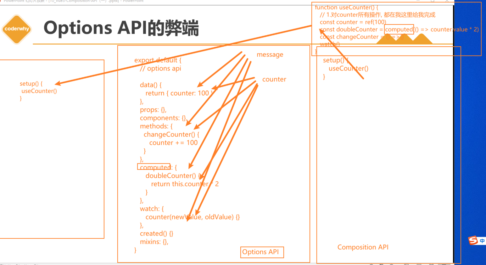
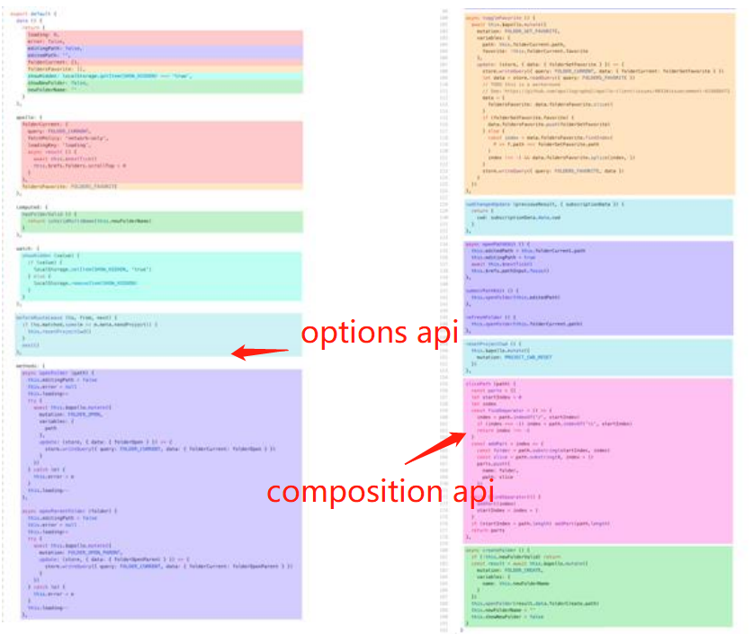
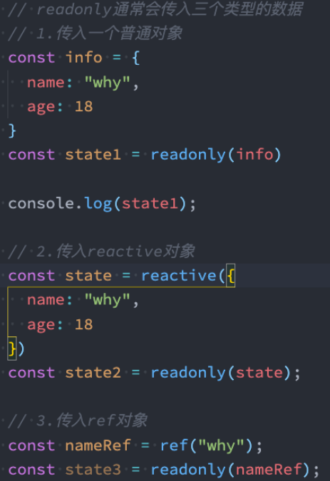

# 一. 认识 CompositionAPI

---

## 1. Options API 的弊端

- 在 `Vue2` 中，我们编写组件的方式是 `Options API`： 
  - `Options API` 的一大特点就是在对应的属性中编写对应的功能模块
  - 比如 `data` 定义数据、`methods` 中定义方法、`computed` 中定义计算属性、`watch` 中监听属性改变，也包括生命周期钩子
  
- 但是这种代码有一个很大的弊端：
  - 当我们实现某一个功能时，这个功能对应的代码逻辑会被拆分到各个属性中
  
  - 当我们组件变得更大、更复杂时，逻辑关注点的列表就会增长，那么同一个功能的逻辑就会被拆分的很分散
  
  - 尤其对于那些一开始没有编写这些组件的人来说，这个组件的代码是难以阅读和理解的（阅读组件的其他人）
  
    
  
- 下面我们来看一个非常大的组件，其中的逻辑功能按照颜色进行了划分：
  - 这种碎片化的代码使用理解和维护这个复杂的组件变得异常困难，并且隐藏了潜在的逻辑问题
  - 并且当我们处理单个逻辑关注点时，需要不断的跳到相应的代码块中

## 2. 大组件的逻辑分散



- 如果我们能将同一个逻辑关注点相关的代码收集在一起会更好
- 这就是 `Composition API` 想要做的事情，以及可以帮助我们完成的事情
- 也有人把 **`Vue Composition API` 简称为 `VCA`**


## 3. 认识 Composition API

- 那么既然知道 `Composition API` 想要帮助我们做什么事情，接下来看一下到底是怎么做呢？
  - 为了开始使用 `Composition API`，我们需要有一个可以实际使用它（编写代码）的地方
  - 在 `Vue` 组件中，这个位置就是 `setup` 函数
- `setup` 其实就是组件的另外一个选项：
  - 只不过这个选项强大到我们可以用它来替代之前所编写的大部分其他选项
  - 比如 `methods`、`computed`、`watch`、`data`、生命周期等等
- 接下来我们一起学习这个函数的使用：
  - 函数的参数
  - 函数的返回值


# 二. Setup 函数的基本使用

---

## 1. 基本使用

- `setup()` 钩子是在组件中使用组合式 `API` 的入口，通常只在以下情况下使用：

  1. 需要在非单文件组件中使用组合式 `API` 时
  2. 需要在基于选项式 `API` 的组件中集成基于组合式 `API` 的代码时

  > 注意：
  >
  > - 对于结合单文件组件使用的组合式 `API`，推荐通过 `<script setup>` 以获得更加简洁及符合人体工程学的语法
  > - `<script setup>` 是在单文件组件 (`SFC`) 中使用组合式 `API` 的 编译时语法糖
  > - https://cn.vuejs.org/api/sfc-script-setup.html

- 我们可以使用[响应式 API](https://cn.vuejs.org/api/reactivity-core.html) 来声明响应式的状态，**在 `setup()` 函数中返回的对象会暴露给模板和组件实例**

- 其他的选项也可以通过组件实例来获取 `setup()` 暴露的属性：

  ```vue
  <script>
  import { ref } from 'vue'
  
  export default {
    setup() {
      const count = ref(0)
  
      // 返回值会暴露给模板和其他的选项式 API 钩子
      return {
        count
      }
    },
  
    mounted() {
      console.log(this.count) // 0
    }
  }
  </script>
  
  <template>
    <button @click="count++">{{ count }}</button>
  </template>
  ```

- 在模板中访问从 `setup` 返回的 `ref` 时，它会[自动浅层解包](https://cn.vuejs.org/guide/essentials/reactivity-fundamentals.html#deep-reactivity)，因此你无须再在模板中为它写 `.value`。当通过 `this` 访问时也会同样如此解包

- `setup()` 自身并不含对组件实例的访问权，即在 `setup()` 中访问 `this` 会是 `undefined`。你可以在选项式 `API` 中访问组合式 `API` 暴露的值，但反过来则不行

- `setup()` 应该同步地返回一个对象。唯一可以使用 `async setup()` 的情况是，该组件是 [Suspense](https://cn.vuejs.org/guide/built-ins/suspense.html) 组件的后裔

## 2. setup 函数的参数

- 我们先来研究一个 `setup` 函数的参数，它主要有两个参数： 
  - 第一个参数：`props`
  - 第二个参数：`context`

- `setup` 函数的第一个参数是组件的 `props`

- 和标准的组件一致，一个 **`setup` 函数的 `props` 参数是响应式的**，并且会在传入新的 `props` 时同步更新：

  - 对于定义 `props` 的类型，我们还是和之前的规则是一样的，在 `props` 选项中定义

  - 并且在 `template` 中依然是可以正常去使用 `props` 中的属性，比如 `message`

  - 如果我们在 `setup` 函数中想要使用 `props`，那么不可以通过 `this` 去获取（后面会讲到为什么）

  - 因为 `props` 有直接作为参数传递到 `setup` 函数中，所以我们可以直接通过参数来使用即可

    ```js
    export default {
      props: {
        title: String
      },
      setup(props) {
        console.log(props.title)
      }
    }
    ```

  > **注意：**
  >
  > - **如果解构了 `props` 对象，解构出的变量将会丢失响应性**
  > - **因此推荐通过 `props.xxx` 的形式来使用其中的 `props`**

- 如果你确实需要解构 `props` 对象，或者需要将某个 `prop` 传到一个外部函数中并保持响应性

- **可以使用 `toRefs()` 和 `toRef()` 这两个工具函数来解构 `props` 对象并保持响应式**：

  ```js
  import { toRefs, toRef } from 'vue'
  
  export default {
    setup(props) {
      // 将 `props` 转为一个其中全是 ref 的对象，然后解构
      const { title } = toRefs(props)
      // `title` 是一个追踪着 `props.title` 的 ref
      console.log(title.value)
  
      // 或者，将 `props` 的单个属性转为一个 ref
      const title = toRef(props, 'title')
    }
  }
  ```

- 另外一个参数是 `context`，我们也称之为是一个 `Setup` 上下文： 

  ```js
  export default {
    setup(props, context) {
      // 透传 Attributes（非响应式的对象，等价于 $attrs）
      console.log(context.attrs)
  
      // 插槽（非响应式的对象，等价于 $slots）
      console.log(context.slots)
  
      // 触发事件（函数，等价于 $emit）
      console.log(context.emit)
  
      // 暴露公共属性（函数）
      console.log(context.expose)
    }
  }
  ```

  - `attrs`：所有的非 `prop` 的 `attribute`
  - `slots`：父组件传递过来的插槽（这个在以渲染函数返回时会有作用，后面会讲到）
  - `emit`：当我们组件内部需要发出事件时会用到 `emit`（因为我们不能访问 `this`，所以不可以通过 `this.$emit` 发出事件）

- **该上下文对象 `context` 是非响应式的，可以安全地解构**：

  ```js
  export default {
    setup(props, { attrs, slots, emit, expose }) {
      ...
    }
  }
  ```

  - `expose` 函数用于显式地限制该组件暴露出的属性，当父组件通过模板引用访问该组件的实例时，将仅能访问 `expose` 函数暴露出的内容：

    ```js
    export default {
      setup(props, { expose }) {
        // 让组件实例处于 “关闭状态”
        // 即不向父组件暴露任何东西
        expose()
    
        const publicCount = ref(0)
        const privateCount = ref(0)
        // 有选择地暴露局部状态
        expose({ count: publicCount })
      }
    }
    ```


## 3. setup 函数的返回值

- `setup` 既然是一个函数，那么它也可以有返回值，它的返回值用来做什么呢？

  - 在 `setup()` 函数中返回的对象会暴露给模板和组件实例。其他的选项也可以通过组件实例来获取 `setup()` 暴露的属性
  - 也就是说我们可以通过 `setup` 的返回值来替代 `data` 选项

- 甚至是我们可以返回一个执行函数来代替在 `methods` 中定义的方法：

- 但是，如果我们将 `counter` 在 `increment` 或者 `decrement` 进行操作时，是否可以实现界面的响应式呢？

  - 答案是不可以
  - 这是因为对于一个定义的变量来说，默认情况下，`Vue` 并不会跟踪它的变化，来引起界面的响应式操作

  ```vue
  <template>
  <div>
    <h2>message: {{ message }}</h2>
    <button @click="changeMessage">修改message</button>
    </div>
  </template>
  <script>
    import { reactive } from 'vue'
    export default {
      setup() {
        // 1.定义普通的数据: 可以正常的被使用
        // 缺点: 数据不是响应式的
        let message = "Hello World"
        function changeMessage() {
          message = "你好啊,李银河!" // 这里发生改变，但template中的数据并不会同步修改
          console.log(message)
        }
        return {
          message,
          changeMessage,
        }
      }
    }
  </script>
  ```

## 4. 与渲染函数一起使用

- `setup` 也可以返回一个[渲染函数](https://cn.vuejs.org/guide/extras/render-function.html)，此时在渲染函数中可以直接使用在同一作用域下声明的响应式状态：

- `Vue` 提供了一个 `h()` 函数用于创建 `vnodes`

  ```js
  import { h, ref } from 'vue'
  
  export default {
    setup() {
      const count = ref(0)
      return () => h('div', count.value)
    }
  }
  ```

- 返回一个渲染函数将会阻止我们返回其他东西。对于组件内部来说，这样没有问题，但如果我们想通过模板引用将这个组件的方法暴露给父组件，那就有问题了

- 我们可以通过调用 `expose() `解决这个问题：

  ```js
  import { h, ref } from 'vue'
  
  export default {
    setup(props, { expose }) {
      const count = ref(0)
      const increment = () => ++count.value
  
      expose({
        increment
      })
  
      return () => h('div', count.value)
    }
  }
  ```

- 此时父组件可以通过模板引用来访问这个 `increment` 方法


# 三. Setup 中数据的响应式

---

## 1. Reactive API

- 如果想为在 `setup` 中定义的数据提供响应式的特性，那么我们可以使用 `reactive` 的函数： 

- 那么这是什么原因呢？为什么就可以变成响应式的呢？

  - 这是因为当我们使用 `reactive` 函数处理我们的数据之后，数据再次被使用时就会进行依赖收集
  - 当数据发生改变时，所有收集到的依赖都是进行对应的响应式操作（比如更新界面）
  - 事实上，我们编写的 `data` 选项，也是在内部交给了 `reactive` 函数将其变成响应式对象的

  ```vue
  <template>
    <div>
      <h2>账号: {{ account.username }}</h2>
      <h2>密码: {{ account.password }}</h2>
      <button @click="changeAccount">修改账号</button>
    </div>
  </template>
  <script>
    import { reactive } from 'vue'
    export default {
      setup() {
        // 2.定义响应式数据
        // 2.1.reactive函数: 定义复杂类型的数据
        const account = reactive({
          username: "coderwhy",
          password: "123456"
        })
        function changeAccount() {
          account.username = "kobe"
        }
        return {
          account,
          changeAccount,
        }
      }
    }
  </script>
  ```

- **在 `Vue` 中，状态都是默认深层响应式的**。这意味着即使在更改深层次的对象或数组，你的改动也能被检测到

- 你也可以直接创建一个[浅层响应式对象](https://cn.vuejs.org/api/reactivity-advanced.html#shallowreactive)。它们仅在顶层具有响应性，一般仅在某些特殊场景中需要

- `reactive()` 返回的是一个原始对象的 `Proxy`，它和原始对象是不相等的：

  ```js
  const raw = {}
  const proxy = reactive(raw)
  
  // 代理对象和原始对象不是全等的
  console.log(proxy === raw) // false
  ```

- **只有代理对象是响应式的，更改原始对象不会触发更新**

- 为保证访问代理的一致性，对同一个原始对象调用 `reactive()` 会总是返回同样的代理对象，而对一个已存在的代理对象调用 `reactive()` 会返回其本身：

  ```js
  // 在同一个对象上调用 reactive() 会返回相同的代理
  console.log(reactive(raw) === proxy) // true
  
  // 在一个代理上调用 reactive() 会返回它自己
  console.log(reactive(proxy) === proxy) // true
  ```

- 这个规则对嵌套对象也适用。依靠深层响应性，响应式对象内的嵌套对象依然是代理：

  ```js
  const proxy = reactive({})
  
  const raw = {}
  proxy.nested = raw
  
  console.log(proxy.nested === raw) // false
  ```

## 2. Ref API

- `reactive()` 有两条限制：

  1. 对传入的类型是有限制的，仅对对象类型有效（对象、数组和 `Map`、`Set` 这样的[集合类型](https://developer.mozilla.org/zh-CN/docs/Web/JavaScript/Reference/Global_Objects#使用键的集合对象)），而对 `string`、`number` 和 `boolean` 这样的 [原始类型](https://developer.mozilla.org/zh-CN/docs/Glossary/Primitive) 无效，会报一个警告

  2. 因为 `Vue` 的响应式系统是通过属性访问进行追踪的，因此我们必须始终保持对该响应式对象的相同引用。这意味着我们不可以随意地“替换”一个响应式对象，因为这将导致对初始引用的响应性连接丢失

     ```js
     let state = reactive({ count: 0 })
     
     // 上面的引用 ({ count: 0 }) 将不再被追踪（响应性连接已丢失！）
     state = reactive({ count: 1 })
     ```

  - 同时这也意味着当我们将响应式对象的属性赋值或解构至本地变量时，或是将该属性传入一个函数时，会失去响应性：

    ```js
    const state = reactive({ count: 0 })
    
    // n 是一个局部变量，同 state.count
    // 失去响应性连接
    let n = state.count
    // 不影响原始的 state
    n++
    
    // count 也和 state.count 失去了响应性连接
    let { count } = state
    // 不会影响原始的 state
    count++
    
    // 该函数接收一个普通数字，并且
    // 将无法跟踪 state.count 的变化
    callSomeFunction(state.count)
    ```

- `reactive()` 的种种限制归根结底是因为 `javaScript` 没有可以作用于所有值类型的 “引用” 机制

- 为此，`Vue` 提供了一个 [`ref()`](https://cn.vuejs.org/api/reactivity-core.html#ref) 方法来允许我们创建可以使用任何值类型的响应式 **ref**：

  ```js
  import { ref } from 'vue'
  
  const count = ref(0)
  ```

- **`ref()` 将传入参数的值包装为一个带 `.value` 属性的 `ref` 对象**：

  ```js
  const count = ref(0)
  
  console.log(count) // { value: 0 }
  console.log(count.value) // 0
  
  count.value++
  console.log(count.value) // 1
  ```

- 和响应式对象的属性类似，**`ref` 的 `.value` 属性也是响应式的**

- 同时，当值为对象类型时，会用 `reactive()` 自动转换它的 `.value`

- 一个包含对象类型值的 `ref` 可以响应式地替换整个对象：

  ```js
  const objectRef = ref({ count: 0 })
  
  // 这是响应式的替换
  objectRef.value = { count: 1 }
  ```

- `ref` 被传递给函数或是从一般对象上被解构时，不会丢失响应性：

  ```js
  const obj = {
    foo: ref(1),
    bar: ref(2)
  }
  
  // 该函数接收一个 ref
  // 需要通过 .value 取值
  // 但它会保持响应性
  callSomeFunction(obj.foo)
  
  // 仍然是响应式的
  const { foo, bar } = obj
  ```

- 简言之，`ref()` 让我们能创造一种对任意值的 “引用”，并能够在不丢失响应性的前提下传递这些引用
- 这个功能很重要，因为它经常用于将逻辑提取到 [组合函数](https://cn.vuejs.org/guide/reusability/composables.html) 中

- **`ref` 会返回一个可变的响应式对象**，该对象作为一个响应式的引用维护着它内部的值，这就是 `ref` 名称的来源
- 它**内部的值是在 `ref` 的 `value` 属性中被维护的**

> **注意：**
>
> - **在模板中引入 `ref` 的值时，`Vue` 会自动帮助我们进行解包操作**，所以我们并不需要在模板中通过 `ref.value` 的方式来使用
> - 但是**在 `setup` 函数内部，它依然是一个 `ref` 引用**， 所以对其进行操作时，我们依然需要**使用 `ref.value` 的方式**

```vue
<template>
<div>
  <!-- 默认情况下在template中使用ref时, vue会自动对其进行解包(取出其中value) -->
  <h2>当前计数: {{ counter }}</h2>
  <button @click="increment">+1</button>
  <button @click="counter++">+1</button>
  <!-- 使用的时候不需要写.value -->
  <h2>当前计数: {{ info.counter }}</h2>
  </div>
</template>
<script>
  import { ref } from 'vue'
  export default {
    setup() {
      // 2.2.ref函数: 定义简单类型的数据(也可以定义复杂类型的数据)
      // counter定义响应式数据
      const counter = ref(0)
      function increment() {
        counter.value++
      }
      // 3.ref是浅层解包
      const info = {
        counter
      }
      return {
        counter,
        increment,
        info
      }
    }
  }
</script>
```

## 3. Ref 自动解包

- **当 `ref` 在模板中作为顶层属性被访问时，它们会被自动“解包”**，所以不需要使用 `.value`

- 下面是之前的计数器例子，用 `ref()` 代替：

  ```vue
  <template>
    <button @click="increment">
      {{ count }} <!-- 无需 .value -->
    </button>
  </template>
  
  <script setup>
  import { ref } from 'vue'
  
  const count = ref(0)
  
  function increment() {
    count.value++
  }
  </script>
  ```

- 请注意，**仅当 `ref` 是模板渲染上下文的顶层属性时才适用自动“解包”**

- 例如， `object` 是顶层属性，但 `object.foo` 不是

  ```js
  const object = { foo: ref(1) }
  ```

- 下面的表达式将不会像预期的那样工作：

  ```js
  {{ object.foo + 1 }}
  ```

- 渲染的结果会是一个 `[object Object]1`，因为 `object.foo` 是一个 `ref` 对象

- 我们可以通过将 `foo` 改成顶层属性来解决这个问题：

  ```js
  const { foo } = object
  ```

  ```js
  {{ foo + 1 }}
  ```

- 现在渲染结果将是 `2`

- 需要注意的是，如果一个 `ref` 是文本插值（即一个 `{{ }}` 符号）计算的最终值，它也将被解包

- 因此下面的渲染结果将为 `1`：

  ```js
  {{ object.foo }}
  ```

- 这只是文本插值的一个方便功能，相当于 `{{ object.foo.value }}`

- **当一个 `ref` 被嵌套在一个响应式对象中，作为属性被访问或更改时，它会自动解包**，因此会表现得和一般的属性一样：

  ```js
  const count = ref(0)
  const state = reactive({
    count
  })
  
  console.log(state.count) // 0
  
  state.count = 1
  console.log(count.value) // 1
  ```

- 如果将一个新的 `ref` 赋值给一个关联了已有 `ref` 的属性，那么它会替换掉旧的 `ref`：

  ```js
  const otherCount = ref(2)
  
  state.count = otherCount
  console.log(state.count) // 2
  // 原始 ref 现在已经和 state.count 失去联系
  console.log(count.value) // 1
  ```

- **只有当嵌套在一个深层响应式对象内时，才会发生 `ref` 解包。当其作为[浅层响应式对象](https://cn.vuejs.org/api/reactivity-advanced.html#shallowreactive)的属性被访问时不会解包**

- **跟响应式对象不同，当 `ref` 作为响应式数组或像 `Map` 这种原生集合类型的元素被访问时，不会进行解包**

  ```js
  const books = reactive([ref('Vue 3 Guide')])
  // 这里需要 .value
  console.log(books[0].value)
  
  const map = reactive(new Map([['count', ref(0)]]))
  // 这里需要 .value
  console.log(map.get('count').value)
  ```

- 模板中的解包是浅层的解包，如果我们的代码是下面的方式：

  ```vue
  <template>
  <div>
    <!-- 默认情况下在template中使用ref时, vue会自动对其进行解包(取出其中value) -->
    <h2>当前计数: {{ counter }}</h2>
    <button @click="increment">+1</button>
    <button @click="counter++">+1</button> // 这里是会自动解包
    <button @click="info.counter++">+1</button> // 这里是不会自动解包，需要通过.value的方式
    <!-- 使用的时候不需要写.value -->
    <h2>当前计数: {{ info.counter }}</h2>
    <!-- 修改的时候需要写.value -->
    <button @click="info.counter.value++">+1</button> 
    </div>
  </template>
  <script>
    import { reactive, ref } from 'vue'
    export default {
      setup() {
        // 2.2.ref函数: 定义简单类型的数据(也可以定义复杂类型的数据)
        // counter定义响应式数据
        const counter = ref(0)
        function increment() {
          counter.value++
        }
        // 3.ref是浅层解包
        const info = {
          counter
        }
        return {
          account,
          changeAccount,
          counter,
          increment,
          info
        }
      }
    }
  </script>
  ```

## 4. ref 和 reactive 的应用场景

```vue
<template>
<div>
  <form>
    账号: <input type="text" v-model="account.username">
    密码: <input type="password" v-model="account.password">
  </form>
  <form>
    账号: <input type="text" v-model="username">
    密码: <input type="password" v-model="password">
  </form>
  </div>
</template>
<script>
  import { onMounted, reactive, ref } from 'vue'
  export default {
    setup() {
      // 定义响应式数据: reactive/ref
      // 强调: ref也可以定义复杂的数据
      const info = ref({})
      console.log(info.value)
      // 1.reactive的应用场景
      // 1.1.条件一: reactive应用于本地的数据
      // 1.2.条件二: 多个数据之间是有关系/联系(聚合的数据, 组织在一起会有特定的作用)
      const account = reactive({
        username: "coderwhy",
        password: "1234567"
      })
      const username = ref("coderwhy")
      const password = ref("123456")
      // 2.ref的应用场景: 其他的场景基本都用ref(computed)
      // 2.1.定义本地的一些简单数据
      const message = ref("Hello World")
      const counter = ref(0)
      const name = ref("why")
      const age = ref(18)
      // 2.定义从网络中获取的数据也是使用ref
      // const musics = reactive([])
      const musics = ref([])
      onMounted(() => {
        const serverMusics = ["海阔天空", "小苹果", "野狼"]
        musics.value = serverMusics
      })
      return {
        account,
        username,
        password,
        name,
        age
      }
    }
  }
</script>
```


# 四. 认识 readonly 函数

---

## 1. 认识 readonly()

- 我们通过 `reactive` 或者 `ref` 可以获取到一个响应式的对象，但是某些情况下，我们传入给其他地方（组件）的这个响应式对象希望在另外一个地方（组件）被使用，但是不能被修改，这个时候如何防止这种情况的出现呢？

  - `Vue3` 为我们提供了 `readonly` 的方法

- **`readonly` 会返回原始对象的只读代理（也就是它依然是一个 `Proxy`，但其 `set` 方法被劫持，并且不能对其进行修改）**

- 只读代理是深层的：对任何嵌套属性的访问都将是只读的。它的 `ref` 解包行为与 `reactive()` 相同，但解包得到的值是只读的

- 要避免深层级的转换行为，请使用 [shallowReadonly()](https://cn.vuejs.org/api/reactivity-advanced.html#shallowreadonly) 作替代

- 在开发中常见的 `readonly` 方法会传入三个类型的参数：

  - 类型一：普通对象

  - 类型二：`reactive` 返回的对象

  - 类型三：`ref` 的对象

    


## 2. readonly 的使用

- 在 `readonly` 的使用过程中，有如下规则：
  - `readonly` 返回的对象都是不允许修改的
  - 但是经过 `readonly` 处理的原来的对象是允许被修改的
    - 比如 `const info = readonly(obj)`，`info` 对象是不允许被修改的
    - 当 `obj` 被修改时，`readonly` 返回的 `info` 对象也会被修改
    - 但是我们不能去修改 `readonly` 返回的对象 `info`
- 其实本质上就是 `readonly` 返回的对象的 `setter` 方法被劫持了而已

## 3. readonly 的应用

- 那么这个 `readonly` 有什么用呢？
  - **在传递给其他组件数据时，防止其他组件修改我们传递的数据时，就可以使用 `readonly` 了**
  - 其实就是为了**保持单项数据流**


# 五. Reactive 知识点补充

---

## 1. Reactive 判断的 API

- `isProxy()`
  - 检查对象是否是由 `reactive()`、`readonly()`、`shallowReactive()`或`shallowReadonly()` 创建的代理
- `isReactive()`
  - 检查一个对象是否是由 `reactive()` 或 `shallowReactive()` 创建的代理
  - 如果该代理是 `readonly` 建的，但包裹了由 `reactive` 创建的另一个代理，它也会返回 `true`
- `isReadonly()`
  - 检查传入的值是否为只读对象。只读对象的属性可以更改，但他们不能通过传入的对象直接赋值
  - 通过 `readonly()` 和 `shallowReadonly()` 创建的代理都是只读的，因为他们是没有 `set` 函数的 `computed()` `ref`
- `toRaw()`
  - 返回 `reactive` 或 `readonly` 代理的原始对象（不建议保留对原始对象的持久引用。请谨慎使用）
- `shallowReactive()`
  - 创建一个响应式代理，它跟踪其自身 `property` 的响应性，但不执行嵌套对象的深层响应式转换 (深层还是原始对象)
- `shallowReadonly()`
  - 创建一个 `proxy`，使其自身的 `property` 为只读，但不执行嵌套对象的深度只读转换（深层还是可读、可写的）


# 六. `Ref`知识点补充

---

## 1.`toRefs`

- 如果我们**使用`ES6`的解构语法，对`reactive`返回的对象进行解构获取值，那么之后无论是修改结构后的变量，还是修改`reactive`返回的`info`对象，数据都不再是响应式的**：
- 那么有没有办法让我们解构出来的属性是响应式的呢？
  - `Vue`为我们提供了一个`toRefs`的函数，可以将`reactive`返回的对象中的属性都转成`ref`
  - 那么我们再次进行结构出来的` name `和` age `本身都是` ref`的
- 这种做法相当于已经在`info.name`和`ref.value`之间建立了链接，任何一个修改都会引起另外一个变化

```vue
    <script>
      import { reactive, toRefs } from 'vue'
      export default {
        setup() {
          const info = reactive({
            name: "why",
            age: 18,
            height: 1.88
          })
          // reactive被解构后会变成普通的值, 失去响应式
          const { name, age } = info
          // toRefs包裹的对象，对其结构出来的变量是响应式的
          const { name, age } = toRefs(info)
          return {
            name,
            age
          }
        }
      }
    </script>
```

## 2.`toRef`

- 如果我们只希望转换一个`reactive`对象中的属性为`ref`, 那么可以使用`toRef`的方法：
- 就是单独解构某一个属性而已

```vue
    <script>
      import { reactive, toRefs, toRef } from 'vue'
      export default {
        setup() {
          const info = reactive({
            name: "why",
            age: 18,
            height: 1.88
          })
          // reactive被解构后会变成普通的值, 失去响应式
          const { name, age } = info
          // toRefs包裹的对象，对其结构出来的变量是响应式的
          const { name, age } = toRefs(info)
          const height = toRef(info, "height")
          return {
            name,
            age
          }
        }
      }
    </script>
```

## 3.`ref`其他的`API`

- `unref`
- 如果我们想要获取一个`ref`引用中的`value`，那么也可以通过`unref`方法： 
  - 如果参数是一个` ref`，则返回内部值，否则返回参数本身
  - 这是` val = isRef(val) ? val.value : val `的语法糖函数
- `isRef`
  - 判断值是否是一个`ref`对象
- `shallowRef`
  - 创建一个浅层的`ref`对象
- `triggerRef`
  - 手动触发和` shallowRef `相关联的副作用


# 七. `setup`中禁用`this`

---

## 1.`setup`不可以使用`this`

- 官方关于`this`有这样一段描述（这段描述是我给官方提交了`PR`之后的一段描述）：
  - 表达的含义是`this`并没有指向当前组件实例
  - 并且在`setup`被调用之前，`data`、`computed`、`methods`等都没有被解析
  - 所以无法在`setup`中获取`this`


- 其实在之前的这段描述是和源码有出入的（我向官方提交了`PR`，做出了描述的修改）：
  - 之前的描述大概含义是不可以使用`this`是因为组件实例还没有被创建出来
  - 后来我的`PR`也有被合并到官方文档中

## 2.之前关于`this`的描述问题


## 3.我是如何发现官方文档的错误的呢？

- 在阅读源码的过程中，代码是按照如下顺序执行的：
  - 调用` createComponentInstance `创建组件实例
  - 调用` setupComponent `初始化`component`内部的操作
  - 调用` setupStatefulComponent `初始化有状态的组件
  - 在` setupStatefulComponent `取出了` setup `函数
  - 通过`callWithErrorHandling `的函数执行` setup`
- 从上面的代码我们可以看出，组件的`instance`肯定是在执行` setup `函数之前就创建出来的


