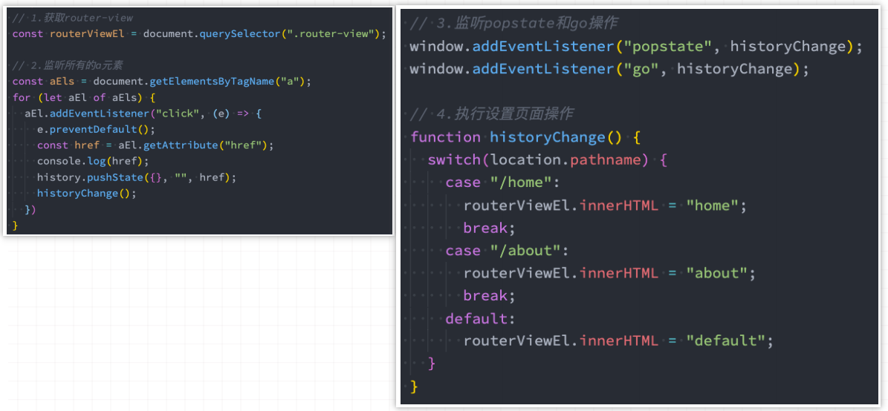
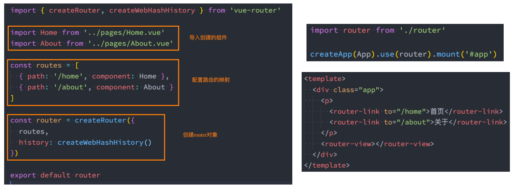
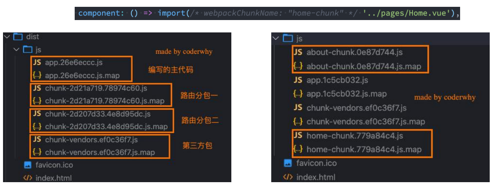
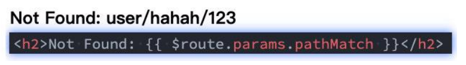
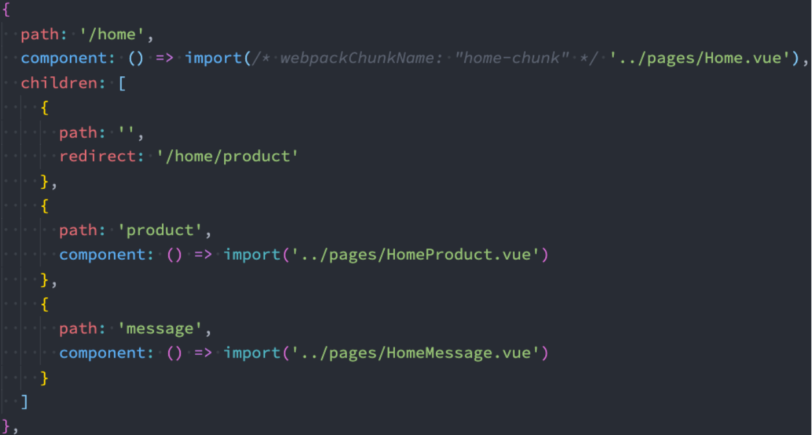
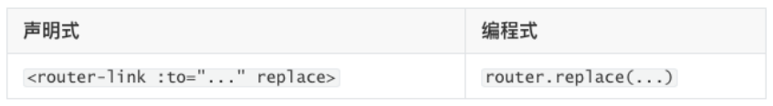
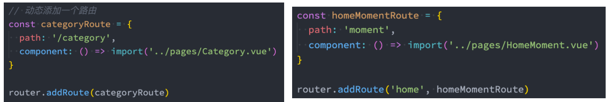
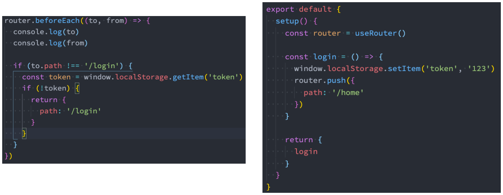

# 一. 前端路由的发展历程

---

## 1. 认识前端路由

- 路由其实是网络工程中的一个术语：
  - 在架构一个网络时，非常重要的两个设备就是路由器和交换机
  - 当然，目前在我们生活中路由器也是越来越被大家所熟知，因为我们生活中都会用到路由器
  - 事实上，路由器主要维护的是一个映射表
  - 映射表会决定数据的流向
- 路由的概念在软件工程中出现，最早是在后端路由中实现的，原因是 `web` 的发展主要经历了这样一些阶段：
  - 后端路由阶段
  - 前后端分离阶段
  - 单页面富应用 `SPA`

## 2. 后端路由阶段

- 早期的网站开发整个 `HTML` 页面是由服务器来渲染的
  - 服务器直接生产渲染好对应的 `HTML` 页面, 返回给客户端进行展示
- 但是, 一个网站, 这么多页面服务器如何处理呢?
  - 一个页面有自己对应的网址, 也就是 `URL`
  - `URL` 会发送到服务器, 服务器会通过正则对该 `URL` 进行匹配, 并且最后交给一个 `Controller` 进行处理
  - `Controller` 进行各种处理, 最终生成 `HTML` 或者数据，返回给前端
- 上面的这种操作, 就是后端路由： 
  - 当我们页面中需要请求不同的路径内容时, 交给服务器来进行处理, 服务器渲染好整个页面, 并且将页面返回给客户端
  - 这种情况下渲染好的页面, 不需要单独加载任何的 `js` 和 `css`, 可以直接交给浏览器展示, 这样也有利于 `SEO` 的优化
- 后端路由的缺点:
  - 一种情况是整个页面的模块由后端人员来编写和维护的
  - 另一种情况是前端开发人员如果要开发页面, 需要通过 `PHP` 和 `Java` 等语言来编写页面代码
  - 而且通常情况下 `HTML` 代码和数据以及对应的逻辑会混在一起, 编写和维护都是非常糟糕的事情

## 3. 前后端分离阶段

- 前端渲染的理解：
  - 每次请求涉及到的静态资源都会从静态资源服务器获取，这些资源包括 `HTML` + `CSS` + `JS`，然后前端再对这些请求回来的资源进行渲染
  - 需要注意的是，客户端的每一次请求，都会从静态资源服务器请求文件
  - 同时可以看到，和之前的后端路由不同，这时后端只是负责提供 `API`
- 前后端分离阶段：
  - 随着 `Ajax` 的出现, 有了前后端分离的开发模式
  - 后端只提供 `API` 来返回数据，前端通过 `Ajax` 获取数据，并且可以通过 `js` 将数据渲染到页面中
  - 这样做最大的优点就是前后端责任的清晰，后端专注于数据上，前端专注于交互和可视化上
  - 并且当移动端（`iOS`/`Android`）出现后，后端不需要进行任何处理，依然使用之前的一套 `API` 即可
  - 目前比较少的网站采用这种模式开发
- 单页面富应用阶段:
  - 其实 `SPA` 最主要的特点就是在前后端分离的基础上加了一层前端路由
  - 也就是前端来维护一套路由规则
- 前端路由的核心是什么呢？改变 `URL`，但是页面不进行整体的刷新

## 4. URL 的 hash

- 前端路由是如何做到 `URL` 和内容进行映射呢？监听 `URL` 的改变

- `URL` 的 `hash`
  - `URL` 的 `hash` 也就是锚点(`#`), 本质上是改变 `window.location` 的 `href` 属性
  
  - 我们可以通过直接赋值 `location.hash` 来改变 `href`, 但是页面不发生刷新
  
    

- `hash` 的优势就是兼容性更好，在老版 `IE` 中都可以运行，但是缺陷是有一个 `#`，显得不像一个真实的路径

## 5. HTML5 的 History

- `history` 接口是 `HTML5` 新增的, 它有六种模式改变 `URL` 而不刷新页面：
  - `replaceState`：替换原来的路径
  - `pushState`：使用新的路径
  - `popState`：路径的回退
  - `go`：向前或向后改变路径
  - `forward`：向前改变路径
  - `back`：向后改变路径
  
  


# 二. Vue-Router 基本使用

---

## 1. 认识 vue-router

- 目前前端流行的三大框架, 都有自己的路由实现: 

  - `Angular` 的 `ngRouter`
  - `React` 的 `ReactRouter`
  - `Vue` 的 `vue-router`

- `Vue Router` 是 `Vue.js` 的官方路由：

  - 它与 `Vue.js` 核心深度集成，让用 `Vue.js` 构建单页应用 `SPA` 变得非常容易
  - 目前 `Vue` 路由最新的版本是 `4.x` 版本，我们会基于最新的版本讲解

- `vue-router` 是基于路由和组件的

  - 路由用于设定访问路径, 将路径和组件映射起来
  - 在 `vue-router` 的单页面应用中, 页面的路径的改变就是组件的切换

- 通过 `npm` 方式，安装 `Vue Router`：

  ```bash
  npm i vue-router
  ```
  
  > 注意：
  >
  > - 如果你有一个正在使用 [Vue CLI](https://cli.vuejs.org/zh/) 的项目，你可以以项目插件的形式添加 `Vue Router`。**但是它会覆盖你的 `App.vue`**，因此请确保在项目中运行以下命令之前备份 `App.vue` 这个文件：
  >
  >   ```shell
  >   vue add router
  >   ```

## 2.路由的使用步骤

- 使用 `vue-router` 的步骤: 
  - 第一步：创建路由需要映射的组件（打算显示的页面）
  - 第二步：通过 `createRouter` 创建路由对象，并且传入 `routes` 和 `history` 模式
    - 配置路由映射: 组件和路径映射关系的 `routes` 数组
    - 创建基于 `hash` 或者 `history` 的模式
  - 第三步：使用 `app` 注册路由对象（`use` 方法）
  - 第四步：路由使用：通过 `<router-link>` 和 `<router-view>`
  
  

## 3. 路由的默认路径

- 我们这里还有一个不太好的实现: 
  - 默认情况下，进入网站的首页，我们希望 `<router-view>` 渲染首页的内容
  - 但是我们的实现中，默认没有显示首页组件，必须让用户点击才可以
- 如何可以让路径默认跳到到首页, 并且 `<router-view>` 渲染首页组件呢?
  ```js
  const routes = [
    {path: '/', redirect: '/home'},
    {path: '/home', component: Home},
    {path: '/about', component: About}
  ]
  ```

- 我们在 `routes` 中又配置了一个映射：
  - `path` 配置的是根路径: `/`
  - `redirect` 是重定向, 也就是我们将根路径重定向到 `/home` 的路径下, 这样就可以无需使用 `component` 属性配置组件了

## 4. history 模式

- 另外一种选择的模式是 `history` 模式：
  ```js
  import { createRouter, createWebHistory } from 'vue-router'
  
  const router = createRouter({
    routes,
    history: createWebHistory
  })
  ```

​		

> 注意：
>
> - **`history` 模式，需要服务器进行相关的配置，才能在生产环境中进行页面回退**

## 5. router-link

- `router-link` 事实上有很多属性可以配置：
- `to` 属性：
  - 是一个字符串或一个对象
- `replace` 属性：
  - 设置 `replace` 属性的话，当点击时，会调用 `router.replace()`，而不是 `router.push()`
- `active-class` 属性：
  - 设置激活 `a` 元素后应用的 `class`，默认是 `router-link-active`
- `exact-active-class` 属性：
  - 链接精准激活时，应用于渲染的 `<a>` 的 `class`，默认是 `router-link-exact-active`
  - 精准匹配时，`active-class` 属性和 `exact-active-class` 属性都会加上


# 三. 路由懒加载分包处理

---

## 1. 路由懒加载

- 当打包构建应用时，`js` 包会变得非常大，影响页面加载：	
  - 如果我们能把不同路由对应的组件分割成不同的代码块，然后**当路由被访问的时候 才加载对应组件**，这样就会更加高效
  - 也可以**提高首屏的渲染效率**
- 其实这里还是前面讲到过的 `webpack` 的分包知识，而 `Vue Router` 默认就支持动态来导入组件：
  - 这是因为 `component` 可以传入一个组件，也可以接收一个函数，该函数需要返回一个 `Promise`
  - 而 `import` 函数就是返回一个 `Promise`
  - **关键字 `import` 可以像调用函数一样来动态的导入模块。以这种方式调用，将返回一个  `promise`**
  - **当 `webpack` 检测到有通过 `import` 函数导入一个文件时，就会单独打包**
  - https://developer.mozilla.org/zh-CN/docs/Web/JavaScript/Reference/Statements/import
- **静态导入的模块在加载时，就被编译了，无法做到按需编译，降低首页加载速度（性能），但是有利于静态分析工具和 `tree shaking` 发挥作用**
  - `tree shaking`：用来**检测代码模块是否被导出、导入，且被 `js` 文件使用**，将多个 ` js` 文件打包为单个文件时**自动删除未引用的代码**
  - https://developer.mozilla.org/zh-CN/docs/Glossary/Tree_shaking

- **动态导入的模块，可以做到按需编译，提高首页加载速度(性能)**
  ```js
  const routes = [
    {path: '/', redirect: '/home'},
    {path: '/home', component: () => import('../pages/Home.vue')},
    {path: '/about', component: () => import('../pages/About.vue')}
  ]
  ```

## 2. 打包效果分析

- 我们看一下打包后的效果：

- 我们会发现分包是没有一个很明确的名称的，其实 `webpack` 从 `3.x` 开始支持对分包进行命名（`chunk name`）

- 魔法注释：

  

## 3. 路由的其他属性

- `name` 属性：路由记录独一无二的名称

- `meta` 属性：自定义的数据

  ```js
  {
    path: '/about',
    name: 'about-router',
    component: () => import('../pages/About.vue'),
    meta: {
      name: 'later',
      age: 18
    }
  }
  ```


# 四. 动态路由和路由嵌套

---

## 1. 动态路由基本匹配

- 很多时候我们需要将给定匹配模式的路由映射到同一个组件：
  - 例如，我们可能有一个 `User` 组件，它应该对所有用户进行渲染，但是用户的 `ID` 是不同的
  - 在 `Vue Router` 中，我们可以在路径中使用一个动态字段来实现，我们称之为**路径参数**

  ```js
  {
    path: '/user/:id',
    component: () => import('../pages/User.vue')
  }
  ```

- 在 `router-link` 中进行如下跳转：

  ```vue
  <router-link to='/user/123'>用户: 123</router-link>
  ```

## 2. 获取动态路由的值

- 那么在 `User` 中如何获取到对应的值呢？

  - **在 `template` 中，直接通过 `$route.params` 获取值**
  - **在 `create`（`options api`）中，通过 `this.$route.params` 获取值**
  - **在 `setup`（`composition api`）中，我们要使用 `vue-router` 库给我们提供的一个 `hook` `useRoute`** 
    - 该 `Hook` 会返回一个 `Route` 对象，对象中保存着当前路由相关的值

      ```vue
      <template>
        <div>
          <h2>用户界面： {{ $route.params.id }}</h2>
        </div>
      </template>
      
      <script>
        export default {
          created() {
            this.$route.params.id
          },
          setup() {
            const route = useRoute()
            console.log( route.params.id )
          }
        }
      </script>
      ```

  - 不同路由对应同一个组件，获取路径参数（在当前路由改变，但是该组件被复用时调用）

  - 或者使用 `watch` 监听对应属性的变化

    ```js
    onBeforeRouteUpdate((to, from) => {
      // 在当前路由改变，但是该组件被复用时调用
      // 举例来说，对于一个带有动态参数的路径 `/users/:id`，在 `/users/1` 和 `/users/2` 之间跳转的时候，
      // 由于会渲染同样的 `UserDetails` 组件，因此组件实例会被复用。而这个钩子就会在这个情况下被调用。
      // 因为在这种情况发生的时候，组件已经挂载好了，导航守卫可以访问组件实例 `this`
      console.log("from:", from.params.id)
      console.log("to:", to.params.id)
    })
    ```

## 3. NotFound

- 对于哪些没有匹配到的路由，我们通常会匹配到固定的某个页面
  - 比如 `NotFound` 的错误页面中，这个时候我们可编写一个动态路由用于匹配所有的页面

    ```js
    {
      path: '/:pathMatch(.*)',
      component: () => import('../pages/NotFound.vue')
    }
    ```

- 可以通过 `$route.params.pathMatch` 获取到传入的参数：

  

## 4. 匹配规则加 *

- 这里还有另外一种写法：
  - 注意：在 `/:pathMatch(.*)` 后面又加了一个 `*`

    ```js
    {
      path: '/:pathMatch(.*)*',
      component: () => import('../pages/NotFound.vue')
    }
    ```

- 它们的区别在于解析的时候，是否解析 `/`：

  

## 5. 路由的嵌套

- 什么是路由的嵌套呢？

  - 目前我们匹配的 `Home`、`About`、`User` 等都属于第一层路由，我们在它们之间可以来回进行切换

- 但是呢，我们 `Home` 页面本身，也可能会在多个组件之间来回切换：

  - 比如 `Home` 中包括 `Product`、`Message`，它们可以在 `Home` 内部来回切换
  - 这个时候我们就需要使用嵌套路由，在 `Home` 中也使用 `router-view` 来占位之后需要渲染的组件

- 路由的嵌套配置

  

> 注意：**以 `/` 开头的嵌套路径会被当作根路径**。 这让你充分的使用嵌套组件而无须设置嵌套的路径。
>
> ```js
> routes: [
>   {
>     path: '/order',
>     children: [
>       {
>         // 匹配url: /order/orderList
>         path: 'orderList', 
>         component: compA,
>       },
>       {
>         // 匹配url: /orderList
> 				path: '/orderList',
>         component: compB,
>       }
>     ]
>   }
> ]
> ```


# 五. 路由的编程式导航

---

##  1. 代码的页面跳转

- 有时候我们希望通过代码来完成页面的跳转，比如点击的是一个按钮：

  ```js
  jumpToProfile() {
    this.$router.push('/profile')
  }
  ```

- 当然，我们也可以传入一个对象：

  ```js
  jumpToProfile() {
    this.$router.push({
      path: '/profile'
    })
  }
  ```

- 如果是在 `setup` 中编写的代码，那么我们可以通过 `useRouter` 来获取：

  ```js
  const router = useRouter()
  
  const jumpToProfile = () => {
    router.replace('/profile')
  }
  ```

## 2. query 方式的参数

- 我们也可以通过 `query` 的方式来传递参数：

  ```js
  jumpToProfile() {
    this.$router.push({
      path: '/profile',
      query: { name: '111', age: 18}
    })
  }
  ```

- 在 `template` 中通过 `$route.query` 来获取参数：

  ```vue
  <template>
    <h2>
      query: {{ $route.query.name }}- {{ $router.query.age }}
    </h2>
  </template>
  ```

- `setup` 中

  ```js
  import { useRoute } from 'vue-router';
  
  const route = useRoute()
  console.log( route.query.name, route.query.age )
  ```

## 3. 替换当前的位置

- 使用 `push` 的特点是压入一个新的页面，那么在用户点击返回时，上一个页面还可以回退，但是如果我们希望当前页面是一个替换操作，那么可以使用 `replace`：

  

## 4. 页面的前进后退

- `router` 的 `go` 方法：

  

- `router` 也有 `back`：
  - 通过调用 `history.back()` 回溯历史。相当于 `router.go(-1)`
- `router` 也有 `forward`：
  - 通过调用 `history.forward()` 在历史中前进。相当于 `router.go(1)`


# 六. 动态管理路由对象

---

## 1. 动态添加路由

- 某些情况下我们可能需要**动态的来添加路由**：

  - 比如根据用户不同的权限，注册不同的路由
  - 这个时候我们可以使用一个方法 `addRoute()`

- 如果我们是为 `route` 添加一个 `children` 路由，那么可以传入对应的 `name`：

  

## 2. 动态管理路由的其他方法

- 删除路由有以下三种方式：
  - 方式一：添加一个 `name` 相同的路由，后添加的会覆盖之前添加的路由
  - 方式二：通过 `removeRoute` 方法，传入路由的名称
  - 方式三：通过 `addRoute` 方法的返回值回调
- 路由的其他方法补充：
  - `router.hasRoute()`：检查路由是否存在
  - `router.getRoutes()`：获取一个包含所有路由记录的数组


# 七. 路由导航守卫钩子

---

## 1. 路由导航守卫

- `vue-router` 提供的导航守卫主要用来通过跳转 或 取消的方式守卫导航

- 全局的前置守卫 `beforeEach` 是在导航触发时会被回调的：

- 它有两个参数：
  - `to`：即将进入的路由 `Route` 对象
  - `from`：即将离开的路由 `Route` 对象
  
- 它有返回值：
  - `false`：取消当前导航
  - 不返回或返回 `undefined`：进行默认导航
  - 返回一个路由地址
    - 可以是一个 `string` 类型的路径
    - 可以是一个对象，对象中包含 `path`、`query`、`params` 等信息
  
- 可选的第三个参数：`next`（不推荐使用）
  - **在 `Vue2` 中是通过 `next` 函数来决定如何进行跳转的**
  
  - 但是**在 `Vue3` 中是通过返回值来控制的**，不再推荐使用 `next` 函数，这是因为开发中很容易调用多次 `next`
  
    ```js
    router.beforeEach((to, from) => {
      console.log(to)
      console.log(from)
      return false
    })
    ```

## 2. 登录守卫功能

- 比如我们完成一个功能，只有登录后才能看到其他页面：

  

## 3. 其他导航守卫

- `Vue` 还提供了很多的其他守卫函数，目的都是在某一个时刻给予我们回调，让我们可以更好的控制程序的流程或者功能：
  - https://next.router.vuejs.org/zh/guide/advanced/navigation-guards.html
- 我们一起来看一下**完整的导航解析流程**： 
  - 导航被触发
  - 在失活的组件里调用 `beforeRouteLeave` 守卫
  - 调用全局的 `beforeEach` 守卫
  - 在重用的组件里调用 `beforeRouteUpdate` 守卫(2.2+)
  - 在路由配置里调用 `beforeEnter`
  - 解析异步路由组件
  - 在被激活的组件里调用 `beforeRouteEnter`
  - 调用全局的 `beforeResolve`守卫(2.5+)
  - 导航被确认
  - 调用全局的 `afterEach` 钩子
  - 触发 `DOM` 更新
  - 调用 `beforeRouteEnter` 守卫中传给 `next` 的回调函数，创建好的组件实例会作为回调函数的参数传入


