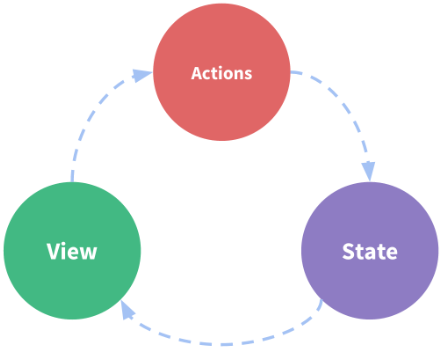

# 一. 认识应用状态管理

---

## 1.什么是状态管理

- 在开发中，我们会的应用程序需要处理各种各样的数据，这些数据需要保存在我们应用程序中的某一个位置，对于这些数据的管理我们就称之为是状态管理

- 在前面我们是如何管理自己的状态呢？
  - 在`Vue`开发中，我们使用组件化的开发方式
  - 而在组件中我们定义`data`或者在`setup`中返回使用的数据，这些数据我们称之为`state`
  - 在模块`template`中我们可以使用这些数据，模块最终会被渲染成`DOM`，我们称之为`View`
  - 在模块中我们会产生一些行为事件，处理这些行为事件时，有可能会修改`state`，这些行为事件我们称之为`actions`

- 以下是一个表示 "单向数据流" 理念的简单示意：

  

## 2.复杂的状态管理

- `JavaScript`开发的应用程序，已经变得越来越复杂了：
  - `js`需要管理的状态越来越多，越来越复杂
  - 这些状态包括服务器返回的数据、缓存数据、用户操作产生的数据等等
  - 也包括一些`UI`的状态，比如某些元素是否被选中，是否显示加载动效，当前分页
- 当我们的应用遇到多个组件共享状态时，单向数据流的简洁性很容易被破坏：
  - 多个视图依赖于同一状态
  - 来自不同视图的行为需要变更同一状态
- 我们是否可以通过组件数据的传递来完成呢？
  - 对于一些简单的状态，确实可以通过`props`的传递或者`Provide`的方式来共享状态
  - 但是对于复杂的状态管理来说，显然单纯通过传递和共享的方式是不足以解决问题的，比如兄弟组件如何共享数据呢？

## 3.`Vuex`的状态管理

- 管理不断变化的`state`本身是非常困难的：

  - 状态之间相互会存在依赖，一个状态的变化会引起另一个状态的变化，`View`页面也有可能会引起状态的变化
  - 当应用程序复杂时，`state`在什么时候，因为什么原因而发生了变化，发生了怎么样的变化，会变得非常难以控制和追踪

- 因此，我们是否可以考虑将组件的内部状态抽离出来，以一个全局单例的方式来管理呢？

  - 在这种模式下，我们的组件树构成了一个巨大的 “视图`View`”
  - 不管在树的哪个位置，任何组件都能获取状态或者触发行为
  - 通过定义和隔离状态管理中的各个概念，并通过强制性的规则来维护视图和状态间的独立性，我们的代码边会变得更加结构化和易于维护、跟踪

- 这就是`Vuex`背后的基本思想，它借鉴了`Flux`、`Redux`、`Elm`（纯函数语言，`redux`有借鉴它的思想）

- 当然，目前`Vue`官方也在推荐使用`Pinia`进行状态管理，我们后续也会进行学习

  


# 二. `Vuex`的基本使用

---

## 1.`Vuex`的安装

- 既然我们要使用`vuex`，首先第一步需要安装`vuex`： 

  ```bash
  # 使用npm
  npm i vuex
  
  # 使用yarn
  yarn add vuex
  ```

- 我们这里使用的是`vuex4.x`

- `vue cli`创建项目的时候可以选择安装`vuex`

## 2.创建`Store`

- 每一个`Vuex`应用的核心就是`store`（仓库）：

  - `store`本质上是一个容器，它包含着你的应用中大部分的状态（`state`）

- `Vuex`和单纯的全局对象有什么区别呢？

- 第一：**`Vuex`的状态存储是响应式的**

  - 当`Vue`组件从`store`中读取状态的时候，若`store`中的状态发生变化，那么相应的组件也会被更新

- 第二：你不能直接改变`store`中的状态

  - 改变`store`中的状态的`Vue`官方推荐的唯一途径就显示提交 (`commit`) `mutation`
  - 这样使得我们可以方便的跟踪每一个状态的变化，从而让我们能够通过一些工具帮助我们更好的管理应用的状态

- 使用步骤：

  - 创建`Store`对象
  - 在`app`中通过插件安装

  

## 3.组件中使用`store`

- 在组件中使用`store`，我们按照如下的方式：

  - 在模板中使用
  - 在`options api`中使用，比如`computed`
  - 在`setup`中使用

  

## 4.单一状态树

- `Vuex`使用单一状态树：
  - 用一个对象就包含了全部的应用层级的状态
  - 采用的是`SSOT`，`Single Source of Truth`，也可以翻译成单一数据源
- 这也意味着，每个应用将仅仅包含一个`store`实例
  - 单状态树和模块化并不冲突，后面我们会讲到`module`的概念
- 单一状态树的优势：
  - 如果你的状态信息是保存到多个`Store`对象中的，那么之后的管理和维护等等都会变得特别困难
  - 所以`Vuex`也使用了单一状态树来管理应用层级的全部状态
  - 单一状态树能够让我们最直接的方式找到某个状态的片段
  - 而且在之后的维护和调试过程中，也可以非常方便的管理和维护


# 三. 核心概念`State`

---

## 1.组件获取状态

- 在前面我们已经学习过如何在组件中获取状态了

- 当然，如果觉得那种方式有点繁琐（表达式过长），我们可以使用计算属性：

  ```vue
  <script>
  	export default {
      computed: {
        counter() {
          return this.$store.state.counter
        }
      }
    }
  </script>
  ```

- 当一个组件需要获取多个状态的时候，将这些状态都声明为计算属性会有些重复和冗余。为了解决这个问题，我们可以使用 `mapState` 辅助函数帮助我们生成计算属性，让你少按几次键：

  - `mapState`的方式一：对象类型
  - `mapState`的方式二：数组类型
  - 也可以使用展开运算符和原来的`computed`混合在一起

  ```vue
  <template>
    <div class="app">
      <button @click="incrementLevel">修改level</button>
      <!-- 1.在模板中直接使用多个状态 -->
      <h2>name: {{ $store.state.name }}</h2>
      <h2>level: {{ $store.state.level }}</h2>
      <h2>avatar: {{ $store.state.avatarURL }}</h2>
  
      <!-- 2.计算属性(映射状态: 数组语法) -->
      <h2>name: {{ name() }}</h2>
      <h2>level: {{ level() }}</h2> -->
  
      <!-- 4.setup计算属性(映射状态: 对象语法) -->
      <!-- <h2>name: {{ cName }}</h2>
      <h2>level: {{ cLevel }}</h2> -->
  
      <!-- 5.setup计算属性(映射状态: 对象语法) -->
      <h2>name: {{ name }}</h2>
      <h2>level: {{ level }}</h2>
    </div>
  </template>
  <script>
    import { mapState } from 'vuex'
    export default {
      computed: {
        name() {
          return this.$store.state.name
        }
      }
    }
  </script>
  <script setup>
    import { computed, toRefs } from 'vue'
    import { mapState, useStore } from 'vuex'
  
    // 1.一步步完成
    const { name, level } = mapState(["name", "level"])
    const store = useStore()
    const cName = computed(name.bind({ $store: store }))
    const cLevel = computed(level.bind({ $store: store }))
  
    function incrementLevel() { store.state.level++ }
  </script>
  ```

  

## 2.在`setup`中使用`mapState`

- 在`setup`中如果我们单个获取装是非常简单的：

  - 通过`useStore`拿到`store`后去获取某个状态即可
  - 但是如果我们需要使用` mapState `的功能呢？

- 默认情况下，`Vuex`并没有提供非常方便的使用`mapState`的方式，这里我们进行了一个函数的封装：

  

- 如下

  ```vue
      <template>
        <div class="app">
          <button @click="incrementLevel">修改level</button>
          <!-- 1.在模板中直接使用多个状态 -->
          <h2>name: {{ $store.state.name }}</h2>
          <h2>level: {{ $store.state.level }}</h2>
          <h2>avatar: {{ $store.state.avatarURL }}</h2>
  
          <!-- 2.计算属性(映射状态: 数组语法) -->
          <!-- <h2>name: {{ name() }}</h2>
          <h2>level: {{ level() }}</h2> -->
  
          <!-- 3.计算属性(映射状态: 对象语法) -->
          <!-- <h2>name: {{ sName }}</h2>
          <h2>level: {{ sLevel }}</h2> -->
  
          <!-- 4.setup计算属性(映射状态: 对象语法) -->
          <!-- <h2>name: {{ cName }}</h2>
          <h2>level: {{ cLevel }}</h2> -->
  
          <!-- 5.setup计算属性(映射状态: 对象语法) -->
          <h2>name: {{ name }}</h2>
          <h2>level: {{ level }}</h2>
        </div>
      </template>
      <script>
        import { mapState } from 'vuex'
        export default {
          computed: {
            // name() {
            //   return this.$store.state.name
            // },
            ...mapState(["name", "level", "avatarURL"]),
            ...mapState({
              sName: state => state.name,
              sLevel: state => state.level
            })
          }
        }
      </script>
      <script setup>
        import { computed, toRefs } from 'vue'
        import { mapState, useStore } from 'vuex'
        import useState from "../hooks/useState"
  
        // 1.一步步完成
        // const { name, level } = mapState(["name", "level"])
        // const store = useStore()
        // const cName = computed(name.bind({ $store: store }))
        // const cLevel = computed(level.bind({ $store: store }))
  
        // 2.使用useState
        // const { name, level } = useState(["name", "level"])
  
        // 3.直接对store.state进行解构(推荐)
        const store = useStore()
        const { name, level } = toRefs(store.state)
  
        function incrementLevel() { store.state.level++ }
      </script>
  ```


# 四. 核心概念`Getters`

---

## 1.`getters`的基本使用

- 某些属性我们可能需要经过变化后来使用，这个时候可以使用`getters`：

  

## 2.`getters`第二个参数

- `getters`可以接收第二个参数，第二个参数可以用来获取其他的`getters`：

  

## 3.`getters`支持返回一个函数

- `getters`中的函数本身，可以返回一个函数，那么在使用的地方相当于可以调用这个函数：

  

## 4.`mapGetters`的辅助函数

- 这里我们也可以使用`mapGetters`的辅助函数
- 在`setup`中使用


- 封装一个`useGetters`


# 五. 核心概念`Mutations`

---

## 1.`Mutation`基本使用

- **更改` Vuex `的` store `中的状态的唯一方法是提交` mutation`**：

  

## 2.`Mutation`携带数据

- 很多时候我们在提交`mutation`的时候，会携带一些数据，这个时候我们可以使用参数： 

- `payload`为对象类型

- 对象风格的提交方式

  

## 3.`Mutation`常量类型


## 4.`mapMutations`辅助函数

- 我们也可以借助于辅助函数，帮助我们快速映射到对应的方法中：

  - 跟`mapGetters`和`mapState`一样，内部执行的时候，本质是执行`this.$store.mutations(getters/state).xxx`
  - 所以有些情况需要绑定`this`

  

## 5.`mutation`重要原则

- 一条重要的原则就是要记住`mutation `必须是同步函数
  - 这是因为`devtool`工具会记录`mutation`的日志
  - 每一条`mutation`被记录，`devtools`都需要捕捉到前一状态和后一状态的快照
  - 但是在`mutation`中执行异步操作，就无法追踪到数据的变化
- 所以**`Vuex`的重要原则中要求` mutation`必须是同步函数**
  - 但是如果我们希望在`Vuex`中发送网络请求的话需要如何操作呢？
  - 在`actions`中操作


# 六. 核心概念`Actions`

---

## 1.`actions`的基本使用

- `Action`类似于`mutation`，不同在于：
  - `Action`提交的是`mutation`，而不是直接变更状态
  - **`Action`可以包含任意异步操作，主要用来做网络请求的**
- 这里有一个非常重要的参数`context`：
  - **`context`是一个和`store`实例均有相同方法和属性的`context`对象**
  - 所以我们可以从其中获取到`commit`方法来提交一个`mutation`，或通过` context.state `和` context.getters `来获取` state`和`getters`
- 但是为什么它不是`store`对象呢？这个等到我们讲`Modules`时再具体来说

## 2.`actions`的分发操作

- 如何使用`action`呢？进行`action`的分发：

  - 分发使用的是` store `上的`dispatch`函数

- 同样的，它也可以携带我们的参数：

  

- 也可以以对象的形式进行分发：

  

## 3.`actions`的辅助函数

- `action`也有对应的辅助函数：

  - 对象类型的写法

    

  - 数组类型的写法

    

  - 如下

    

## 4.`actions`的异步操作

- `Action `通常是异步的，那么如何知道` action `什么时候结束呢？

  - 我们可以通过让`action`返回`Promise`，在`Promise`的`then`中来处理完成后的操作

  


# 七. 核心概念`Modules`

---

## 1.`module`的基本使用

- 什么是`Module`？ 

  - 由于使用单一状态树，应用的所有状态会集中到一个比较大的对象，当应用变得非常复杂时，`store `对象就有可能变得相当臃肿
  - 为了解决以上问题，`Vuex `允许我们将` store `分割成模块`module`
  - 每个模块拥有自己的` state`、`mutation`、`action`、`getter`、甚至是嵌套子模块

  

## 2.`module`的局部状态

- 对于模块内部的` mutation `和` getter`，接收的第一个参数是模块的局部状态对象：


## 3.`module`的命名空间

- 默认情况下，**模块内部的`getters `、`action`和`mutation`默认是注册在全局的命名空间中的**：
  - 这样使得多个模块能够对同一个` getters`、` action `或 `mutation `作出响应
  - 但是这样就容易出现命名冲突的情况
- 如果我们希望模块具有更高的封装度和复用性，可以添加` namespaced: true `的方式使其成为带命名空间的模块：
  - 当模块被注册后，它的所有` getter`、`action `及` mutation `都会自动根据模块注册的路径调整命名


## 4.`module`修改或派发根组件

- 如果我们希望在`action`中修改`root`中的`state`，那么有如下的方式：


